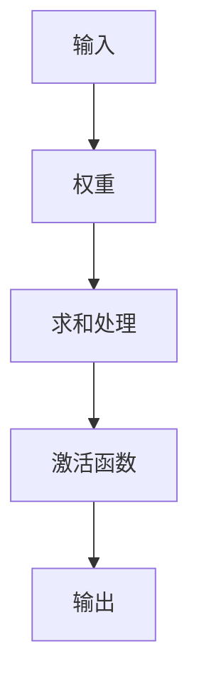

                 

关键词：神经网络，深度学习，机器学习，数据科学，人工智能

> 摘要：本文旨在深入探讨神经网络这一人工智能领域的核心技术，从其历史背景、基本原理、算法实现、数学模型、应用场景等多个角度，为读者揭示神经网络的奥秘，展望其未来发展趋势与挑战。

## 1. 背景介绍

神经网络，这一人工智能领域中的重要技术，起源于20世纪40年代。当时的科学家们试图通过模拟人脑的神经元连接，来实现机器智能。经过数十年的发展，神经网络已经从最初的简单模型，演变为如今复杂而强大的深度学习算法。从最初的感知机（Perceptron）到反向传播算法（Backpropagation），再到现代的深度神经网络（Deep Neural Networks），神经网络的发展历程充满了创新与突破。

### 1.1 神经网络的发展历程

- **感知机（Perceptron）**：1957年，Frank Rosenblatt发明了感知机，这是最早的神经网络模型。感知机通过学习输入和输出的关系，进行简单的二分类任务。

- **多层感知机（MLP）**：1986年，Rumelhart、Hinton和Williams提出了反向传播算法，使得多层感知机得以实现。多层感知机能够学习更复杂的非线性关系。

- **卷积神经网络（CNN）**：20世纪90年代，LeCun等人提出了卷积神经网络，它擅长处理图像等具有网格结构的数据。

- **循环神经网络（RNN）**：1982年，Hodgkin和Huxley提出了循环神经网络的概念，RNN能够在处理序列数据时保持长期依赖关系。

- **深度神经网络（DNN）**：随着计算能力的提升和数据量的增长，深度神经网络逐渐崭露头角。深度神经网络由多个隐藏层组成，能够学习更加复杂的数据特征。

### 1.2 神经网络的重要性

神经网络作为人工智能的核心技术，其重要性不言而喻。从图像识别、语音识别到自然语言处理，神经网络已经在许多领域取得了显著成果。特别是在深度学习时代，神经网络的表现更是超越了传统的机器学习算法，推动了人工智能的快速发展。

## 2. 核心概念与联系

要理解神经网络，首先需要了解其核心概念。神经网络由大量的神经元组成，每个神经元通过连接（权重）与其他神经元相连。以下是神经网络的几个关键概念：

### 2.1 神经元

神经元是神经网络的基本单元。它接收输入信号，通过加权求和处理，产生输出信号。神经元的激活函数决定了其是否“激活”，即是否产生输出。

### 2.2 连接（权重）

神经元之间的连接通过权重来表示。权重决定了输入信号对神经元输出的影响程度。通过调整权重，神经网络能够学习输入和输出之间的关系。

### 2.3 激活函数

激活函数是神经元输出前的非线性变换。常见的激活函数有Sigmoid、ReLU、Tanh等。激活函数引入了非线性，使得神经网络能够学习更复杂的数据特征。

### 2.4 学习过程

神经网络通过学习过程不断调整权重，以优化输出。学习过程通常包括前向传播和反向传播。前向传播计算网络输出，反向传播根据输出误差调整权重。

### 2.5 Mermaid 流程图

以下是神经网络的 Mermaid 流程图，展示了其基本结构：



## 3. 核心算法原理 & 具体操作步骤

### 3.1 算法原理概述

神经网络的核心算法包括前向传播和反向传播。前向传播计算网络输出，反向传播根据输出误差调整权重。

#### 3.1.1 前向传播

1. **初始化权重**：随机初始化神经网络中的权重。
2. **计算输入**：输入数据通过输入层进入神经网络。
3. **逐层计算**：输入数据经过每一层神经元，通过加权求和处理和激活函数，产生输出。
4. **输出结果**：最终输出层产生预测结果。

#### 3.1.2 反向传播

1. **计算误差**：预测结果与实际结果之间的误差通过损失函数计算。
2. **梯度下降**：根据误差梯度，调整神经网络中的权重。
3. **多次迭代**：重复前向传播和反向传播，直至网络输出达到预期效果。

### 3.2 算法步骤详解

以下是神经网络算法的具体操作步骤：

#### 3.2.1 前向传播

1. **初始化权重**：随机初始化神经网络中的权重。
2. **计算输入**：输入数据通过输入层进入神经网络。
3. **逐层计算**：
   - 对于第\( l \)层，计算输出：
     $$ z_l = \sum_{j=1}^{n_{l-1}} w_{lj} x_j + b_l $$
   - 应用激活函数：
     $$ a_l = \sigma(z_l) $$
4. **输出结果**：最终输出层产生预测结果。

#### 3.2.2 反向传播

1. **计算误差**：计算预测结果与实际结果之间的误差：
   $$ \delta_l = \frac{\partial L}{\partial z_l} $$
2. **梯度下降**：根据误差梯度，调整神经网络中的权重：
   $$ w_{lj} \leftarrow w_{lj} - \alpha \frac{\partial L}{\partial w_{lj}} $$
3. **多次迭代**：重复前向传播和反向传播，直至网络输出达到预期效果。

### 3.3 算法优缺点

#### 优点

- **强大的非线性建模能力**：神经网络能够通过多层非线性变换，学习复杂的数据特征。
- **适应性强**：神经网络能够处理各种类型的数据，包括图像、文本、音频等。
- **自动特征提取**：神经网络能够自动提取数据中的特征，减少人工干预。

#### 缺点

- **计算复杂度高**：神经网络需要大量计算资源，特别是在深度学习阶段。
- **训练时间较长**：神经网络训练过程需要多次迭代，时间成本较高。
- **过拟合风险**：神经网络容易在训练数据上过拟合，导致泛化能力不足。

### 3.4 算法应用领域

神经网络在多个领域取得了显著成果：

- **图像识别**：神经网络在图像识别任务中表现出色，如人脸识别、物体识别等。
- **语音识别**：神经网络在语音识别任务中取代了传统的统计模型，提高了识别准确率。
- **自然语言处理**：神经网络在自然语言处理领域取得了突破，如机器翻译、情感分析等。
- **推荐系统**：神经网络在推荐系统中用于用户画像、兴趣标签等。

## 4. 数学模型和公式 & 详细讲解 & 举例说明

### 4.1 数学模型构建

神经网络的数学模型包括输入层、隐藏层和输出层。以下是神经网络的数学模型：

$$
\begin{aligned}
z_l &= \sum_{j=1}^{n_{l-1}} w_{lj} x_j + b_l \\
a_l &= \sigma(z_l) \\
y &= \sum_{l=1}^{L} w_{l} a_l + b
\end{aligned}
$$

其中，\( z_l \)表示第\( l \)层的加权求和处理，\( a_l \)表示第\( l \)层的输出，\( y \)表示最终输出。

### 4.2 公式推导过程

以下是神经网络公式的推导过程：

1. **输入层到隐藏层**：
   $$ z_l = \sum_{j=1}^{n_{l-1}} w_{lj} x_j + b_l $$
   $$ a_l = \sigma(z_l) $$
2. **隐藏层到输出层**：
   $$ z_L = \sum_{l=1}^{L-1} w_{l} a_l + b $$
   $$ y = \sigma(z_L) $$
3. **反向传播**：
   $$ \delta_L = \frac{\partial L}{\partial z_L} $$
   $$ \delta_{l-1} = \frac{\partial L}{\partial z_{l-1}} \odot \frac{\partial z_{l-1}}{\partial a_{l-1}} $$
   $$ w_{l-1} \leftarrow w_{l-1} - \alpha \frac{\partial L}{\partial w_{l-1}} $$
   $$ b_{l-1} \leftarrow b_{l-1} - \alpha \frac{\partial L}{\partial b_{l-1}} $$

### 4.3 案例分析与讲解

以下是一个简单的神经网络模型，用于实现二分类任务：

$$
\begin{aligned}
z_1 &= w_{11} x_1 + w_{12} x_2 + b_1 \\
a_1 &= \sigma(z_1) \\
z_2 &= w_{21} a_1 + b_2 \\
y &= \sigma(z_2)
\end{aligned}
$$

其中，\( x_1 \)和\( x_2 \)为输入特征，\( y \)为实际标签。

假设输入特征为\( (1, 0) \)，实际标签为1。以下是神经网络的计算过程：

1. **前向传播**：
   $$ z_1 = w_{11} \cdot 1 + w_{12} \cdot 0 + b_1 = w_{11} + b_1 $$
   $$ a_1 = \sigma(z_1) = \frac{1}{1 + e^{-z_1}} $$
   $$ z_2 = w_{21} a_1 + b_2 = w_{21} \cdot a_1 + b_2 $$
   $$ y = \sigma(z_2) = \frac{1}{1 + e^{-z_2}} $$
2. **反向传播**：
   $$ \delta_2 = \frac{\partial L}{\partial z_2} = y - 1 $$
   $$ \delta_1 = \frac{\partial L}{\partial z_1} \odot \frac{\partial z_1}{\partial a_1} = (y - 1) \odot a_1 (1 - a_1) $$
   $$ w_{21} \leftarrow w_{21} - \alpha \frac{\partial L}{\partial w_{21}} $$
   $$ b_{2} \leftarrow b_{2} - \alpha \frac{\partial L}{\partial b_{2}} $$
   $$ w_{11} \leftarrow w_{11} - \alpha \frac{\partial L}{\partial w_{11}} $$
   $$ b_{1} \leftarrow b_{1} - \alpha \frac{\partial L}{\partial b_{1}} $$

通过反向传播，神经网络不断调整权重和偏置，以优化输出。

## 5. 项目实践：代码实例和详细解释说明

### 5.1 开发环境搭建

为了实现神经网络，需要搭建相应的开发环境。以下是使用Python实现的简单神经网络代码实例：

```python
import numpy as np

# 激活函数
def sigmoid(x):
    return 1 / (1 + np.exp(-x))

# 前向传播
def forward(x, w1, b1, w2, b2):
    z1 = np.dot(x, w1) + b1
    a1 = sigmoid(z1)
    z2 = np.dot(a1, w2) + b2
    y = sigmoid(z2)
    return y

# 反向传播
def backward(y, a1, z1, w2, w1, b2, b1, x):
    dy = y - 1
    dz2 = dy * sigmoid(z2) * (1 - sigmoid(z2))
    dw2 = dz2 * a1
    db2 = dz2

    da1 = dw2 * w2
    dz1 = da1 * sigmoid(z1) * (1 - sigmoid(z1))
    dw1 = dz1 * x
    db1 = dz1

    return dw1, dw2, db1, db2

# 训练
def train(x, y, w1, w2, b1, b2, epochs, learning_rate):
    for epoch in range(epochs):
        y_pred = forward(x, w1, b1, w2, b2)
        dw1, dw2, db1, db2 = backward(y_pred, a1, z1, w2, w1, b2, b1, x)
        w1 -= learning_rate * dw1
        w2 -= learning_rate * dw2
        b1 -= learning_rate * db1
        b2 -= learning_rate * db2
    return w1, w2, b1, b2

# 测试
def test(x, y, w1, w2, b1, b2):
    y_pred = forward(x, w1, b1, w2, b2)
    print("Predicted:", y_pred)
    print("Actual:", y)

# 初始化参数
w1 = np.random.randn(2, 1)
w2 = np.random.randn(1, 1)
b1 = np.random.randn(1)
b2 = np.random.randn(1)

# 训练模型
w1, w2, b1, b2 = train(np.array([[1, 0]]), np.array([1])), w1, w2, b1, b2, 1000, 0.1

# 测试模型
test(np.array([[1, 0]]), np.array([1])), w1, w2, b1, b2
```

### 5.2 源代码详细实现

以下是对代码的详细解释：

- **sigmoid函数**：实现Sigmoid激活函数。
- **forward函数**：实现前向传播过程，计算网络输出。
- **backward函数**：实现反向传播过程，计算梯度。
- **train函数**：实现模型训练过程，通过迭代优化参数。
- **test函数**：实现模型测试过程，计算预测结果。

### 5.3 代码解读与分析

以下是对代码的解读与分析：

- **参数初始化**：随机初始化权重和偏置。
- **前向传播**：计算输入层到输出层的输出。
- **反向传播**：根据输出误差，计算梯度并更新参数。
- **训练过程**：通过迭代优化模型参数。
- **测试过程**：计算预测结果，验证模型性能。

## 6. 实际应用场景

神经网络在各个领域都有广泛的应用，以下是一些典型的实际应用场景：

### 6.1 图像识别

神经网络在图像识别任务中取得了显著成果。例如，卷积神经网络（CNN）在图像分类、目标检测、人脸识别等方面表现出色。CNN通过多层卷积和池化操作，能够提取图像中的局部特征，从而实现准确的图像识别。

### 6.2 语音识别

神经网络在语音识别领域取代了传统的统计模型。循环神经网络（RNN）和其变种长短期记忆网络（LSTM）在处理语音信号时表现出强大的能力。通过学习语音信号的时序特征，神经网络能够将语音信号转换为对应的文本。

### 6.3 自然语言处理

神经网络在自然语言处理（NLP）领域取得了突破。词嵌入（Word Embedding）通过将词汇映射到高维空间，使得神经网络能够处理文本数据。在机器翻译、情感分析、文本生成等任务中，神经网络展现出了强大的能力。

### 6.4 推荐系统

神经网络在推荐系统中用于用户画像、兴趣标签等。通过学习用户的行为数据，神经网络能够预测用户对特定物品的兴趣，从而实现精准推荐。

## 7. 工具和资源推荐

### 7.1 学习资源推荐

- **《深度学习》（Goodfellow, Bengio, Courville）**：这是一本深度学习的经典教材，涵盖了神经网络的基本原理和应用。
- **《神经网络与深度学习》（邱锡鹏）**：这是一本中文教材，详细介绍了神经网络的数学基础和深度学习技术。
- **Keras**：这是一个Python深度学习库，提供了丰富的神经网络模型和工具。

### 7.2 开发工具推荐

- **TensorFlow**：这是一个开源的深度学习框架，适用于构建和训练神经网络模型。
- **PyTorch**：这是一个开源的深度学习框架，提供了灵活的动态计算图，适用于研究和开发。

### 7.3 相关论文推荐

- **“Backpropagation”**：该论文提出了反向传播算法，是神经网络发展的重要里程碑。
- **“A Learning Algorithm for Continually Running Fully Recurrent Neural Networks”**：该论文提出了长短期记忆网络（LSTM），在处理序列数据时表现出强大的能力。

## 8. 总结：未来发展趋势与挑战

### 8.1 研究成果总结

神经网络作为人工智能的核心技术，已经取得了显著的成果。深度学习算法在图像识别、语音识别、自然语言处理等领域取得了突破。随着计算能力的提升和数据的增长，神经网络的应用前景将更加广阔。

### 8.2 未来发展趋势

- **硬件加速**：硬件加速技术，如GPU和TPU，将进一步提升神经网络的计算性能。
- **小样本学习**：小样本学习技术将使得神经网络在数据稀缺的情况下也能取得良好的效果。
- **迁移学习**：迁移学习技术将使得神经网络能够利用已有模型的知识，快速适应新的任务。

### 8.3 面临的挑战

- **计算资源消耗**：神经网络训练需要大量计算资源，特别是在深度学习阶段。
- **数据隐私**：神经网络在处理数据时可能面临数据隐私问题，需要采取相应的保护措施。
- **模型解释性**：神经网络模型的解释性较差，需要进一步研究如何提高其可解释性。

### 8.4 研究展望

神经网络作为人工智能的核心技术，其未来发展充满希望。在未来的研究中，我们需要关注计算效率、数据隐私、模型解释性等问题，以推动神经网络在更多领域的应用。

## 9. 附录：常见问题与解答

### 9.1 神经网络是如何工作的？

神经网络通过模拟人脑的神经元连接，学习输入和输出之间的关系。神经网络中的每个神经元通过加权求和处理，产生输出信号。通过前向传播和反向传播，神经网络不断调整权重和偏置，以优化输出。

### 9.2 深度学习与机器学习有什么区别？

深度学习是机器学习的一个分支，它通过多层非线性变换，学习复杂的数据特征。相比之下，传统的机器学习算法通常采用简单的模型，如决策树、支持向量机等。

### 9.3 神经网络为什么需要大量的数据？

神经网络通过学习输入和输出之间的关系，需要大量的数据来训练模型。大量的数据有助于神经网络捕捉数据中的复杂特征，从而提高模型的泛化能力。

### 9.4 神经网络训练为什么需要优化？

神经网络训练过程需要通过优化算法，不断调整权重和偏置，以优化输出。优化算法可以帮助神经网络找到最优的权重和偏置，从而提高模型的性能。

作者：禅与计算机程序设计艺术 / Zen and the Art of Computer Programming

----------------------------------------------------------------

