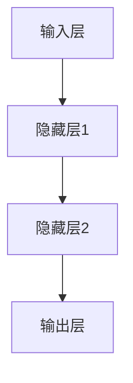

                 

关键词：神经网络，深度学习，人工智能，社会进步，算法应用

> 摘要：本文从神经网络的背景出发，详细介绍了神经网络的核心概念、算法原理、数学模型，并通过实际项目实践和未来应用展望，探讨了神经网络在推动社会进步中的重要作用。

## 1. 背景介绍

神经网络，作为一种模拟人脑神经元之间连接的计算模型，自1980年代以来，一直是人工智能领域的研究热点。随着计算能力的提升和大数据时代的到来，神经网络，特别是深度学习，在图像识别、自然语言处理、语音识别等领域取得了显著成果。神经网络作为一种强大的机器学习工具，正逐渐渗透到社会的各个角落，为我们的生活带来深远影响。

本文将围绕神经网络展开讨论，首先介绍其核心概念与联系，然后深入探讨神经网络的核心算法原理及具体操作步骤，接着通过数学模型和公式详细讲解神经网络的工作机制，并分享一个实际项目实践的案例。最后，本文将总结神经网络在各个领域的应用场景，并对未来的发展趋势与挑战进行展望。

## 2. 核心概念与联系

### 2.1 神经元

神经元是神经网络的基本构建单元，类似于人脑中的神经元。每个神经元可以接收多个输入信号，并通过加权求和处理产生输出。神经元之间的连接可以看作是一种加权边，表示为\( W_{ij} \)，其中\( i \)和\( j \)分别表示两个神经元。

### 2.2 神经网络结构

神经网络的结构可以分为输入层、隐藏层和输出层。输入层接收外部输入数据，隐藏层通过非线性变换处理输入数据，输出层生成最终的输出。一个典型的神经网络结构如图1所示。



### 2.3 激活函数

激活函数是神经网络中的一个关键组件，用于引入非线性特性。常见的激活函数有Sigmoid函数、ReLU函数、Tanh函数等。这些函数将神经元的线性组合映射到非负实数范围，从而使得神经网络能够学习复杂的模式。

## 3. 核心算法原理 & 具体操作步骤

### 3.1 算法原理概述

神经网络的核心算法是反向传播算法（Backpropagation Algorithm）。反向传播算法通过不断调整网络权重，使得网络输出与实际输出之间的误差最小。具体步骤如下：

1. **前向传播**：将输入数据传递到神经网络的输入层，通过神经元之间的连接和激活函数，将数据传递到输出层。
2. **计算误差**：计算输出层实际输出与期望输出之间的误差。
3. **反向传播**：将误差反向传播到隐藏层，通过链式法则计算每个神经元的梯度。
4. **权重更新**：根据梯度调整网络权重，使得误差最小。

### 3.2 算法步骤详解

#### 3.2.1 前向传播

前向传播的过程可以表示为：

$$
Z^{(l)} = \sum_{j=1}^{n} W^{(l)}_{ij} \cdot a^{(l-1)}_{j} + b^{(l)}
$$

其中，\( Z^{(l)} \)是第\( l \)层的输出，\( W^{(l)}_{ij} \)是第\( l \)层第\( i \)个神经元与第\( l-1 \)层第\( j \)个神经元的连接权重，\( a^{(l-1)}_{j} \)是第\( l-1 \)层的输出，\( b^{(l)} \)是第\( l \)层的偏置。

激活函数用于将线性组合映射到非负实数范围，常见的激活函数有：

$$
a^{(l)}_{i} = \sigma(Z^{(l)})
$$

其中，\( \sigma \)是激活函数，如Sigmoid函数：

$$
\sigma(x) = \frac{1}{1 + e^{-x}}
$$

或ReLU函数：

$$
\sigma(x) = \max(0, x)
$$

#### 3.2.2 计算误差

误差函数通常使用均方误差（Mean Squared Error, MSE）：

$$
E = \frac{1}{2} \sum_{i=1}^{m} (y_i - a^{(L)}_{i})^2
$$

其中，\( y_i \)是第\( i \)个样本的期望输出，\( a^{(L)}_{i} \)是第\( L \)层的实际输出。

#### 3.2.3 反向传播

反向传播的过程可以通过链式法则计算每个神经元的梯度：

$$
\frac{\partial E}{\partial W^{(l)}_{ij}} = \frac{\partial E}{\partial a^{(l)}_{i}} \cdot \frac{\partial a^{(l)}_{i}}{\partial Z^{(l)}_{i}} \cdot \frac{\partial Z^{(l)}_{i}}{\partial W^{(l)}_{ij}}
$$

其中，\( \frac{\partial E}{\partial a^{(l)}_{i}} \)是第\( l \)层输出的梯度，\( \frac{\partial a^{(l)}_{i}}{\partial Z^{(l)}_{i}} \)是激活函数的梯度，\( \frac{\partial Z^{(l)}_{i}}{\partial W^{(l)}_{ij}} \)是权重矩阵的梯度。

#### 3.2.4 权重更新

根据梯度下降法，可以使用以下公式更新权重：

$$
W^{(l)}_{ij} \leftarrow W^{(l)}_{ij} - \alpha \cdot \frac{\partial E}{\partial W^{(l)}_{ij}}
$$

其中，\( \alpha \)是学习率。

### 3.3 算法优缺点

#### 优点

1. **强大的非线性建模能力**：神经网络可以通过多层非线性变换学习复杂的模式。
2. **自适应学习能力**：神经网络可以根据输入数据进行自动调整，以最小化误差。

#### 缺点

1. **计算成本高**：神经网络需要大量的计算资源，特别是深度神经网络。
2. **过拟合风险**：神经网络容易过拟合，需要大量数据和适当调整模型参数。

### 3.4 算法应用领域

神经网络在图像识别、自然语言处理、语音识别等领域取得了显著成果。例如，在图像识别领域，神经网络被广泛应用于人脸识别、物体检测等任务；在自然语言处理领域，神经网络被应用于机器翻译、情感分析等任务；在语音识别领域，神经网络被应用于语音识别、语音合成等任务。

## 4. 数学模型和公式 & 详细讲解 & 举例说明

### 4.1 数学模型构建

神经网络的数学模型主要包括输入层、隐藏层和输出层。每个层都包含多个神经元，神经元之间通过加权连接形成网络结构。

#### 输入层

输入层接收外部输入数据，数据可以是一维的，如图像像素值，也可以是高维的，如图像的特征向量。

#### 隐藏层

隐藏层通过非线性变换处理输入数据，每一层都包含多个神经元，每个神经元都与前一层的所有神经元相连。隐藏层的作用是提取数据的特征信息。

#### 输出层

输出层生成最终的输出，可以是分类结果、回归值等。

### 4.2 公式推导过程

#### 前向传播

前向传播的过程可以用以下公式表示：

$$
Z^{(l)} = \sum_{j=1}^{n} W^{(l)}_{ij} \cdot a^{(l-1)}_{j} + b^{(l)}
$$

$$
a^{(l)}_{i} = \sigma(Z^{(l)})
$$

其中，\( Z^{(l)} \)是第\( l \)层的输出，\( W^{(l)}_{ij} \)是第\( l \)层第\( i \)个神经元与第\( l-1 \)层第\( j \)个神经元的连接权重，\( a^{(l-1)}_{j} \)是第\( l-1 \)层的输出，\( b^{(l)} \)是第\( l \)层的偏置，\( \sigma \)是激活函数。

#### 反向传播

反向传播的过程可以用以下公式表示：

$$
\frac{\partial E}{\partial a^{(l)}_{i}} = - \frac{\partial E}{\partial a^{(l+1)}_{i}} \cdot \frac{\partial a^{(l+1)}_{i}}{\partial Z^{(l+1)}_{i}}
$$

$$
\frac{\partial E}{\partial Z^{(l)}_{i}} = \frac{\partial E}{\partial a^{(l)}_{i}} \cdot \frac{\partial a^{(l)}_{i}}{\partial Z^{(l)}_{i}}
$$

$$
\frac{\partial E}{\partial W^{(l)}_{ij}} = a^{(l-1)}_{j} \cdot \frac{\partial E}{\partial Z^{(l)}_{i}}
$$

$$
\frac{\partial E}{\partial b^{(l)}} = \frac{\partial E}{\partial Z^{(l)}_{i}}
$$

其中，\( E \)是误差函数，\( a^{(l)}_{i} \)是第\( l \)层的输出，\( Z^{(l)}_{i} \)是第\( l \)层的输出，\( \frac{\partial E}{\partial a^{(l)}_{i}} \)是第\( l \)层输出的梯度，\( \frac{\partial a^{(l)}_{i}}{\partial Z^{(l)}_{i}} \)是激活函数的梯度。

### 4.3 案例分析与讲解

#### 案例一：手写数字识别

手写数字识别是神经网络的一个经典应用案例。在这个案例中，神经网络用于识别手写数字图像，并将其转换为数字。

输入层：接收手写数字图像的像素值，假设图像大小为\( 28 \times 28 \)。

隐藏层：通过多层非线性变换提取图像的特征信息，例如，隐藏层1可以提取边缘特征，隐藏层2可以提取形状特征。

输出层：生成数字的预测结果，假设输出层有10个神经元，分别对应0到9的数字。

误差函数：使用交叉熵损失函数。

激活函数：使用ReLU函数。

训练数据：使用MNIST手写数字数据集。

通过训练，神经网络可以学习到手写数字的识别规律，并能够在测试数据上取得较高的识别准确率。

## 5. 项目实践：代码实例和详细解释说明

### 5.1 开发环境搭建

为了实现神经网络在手写数字识别任务中的训练和预测，需要搭建一个合适的开发环境。以下是开发环境的搭建步骤：

1. 安装Python环境：Python是一种广泛应用于机器学习的编程语言，需要安装Python环境和相应的库。
2. 安装TensorFlow：TensorFlow是谷歌开源的深度学习框架，用于构建和训练神经网络。
3. 下载MNIST手写数字数据集：MNIST手写数字数据集是神经网络在手写数字识别任务中的常用数据集。

### 5.2 源代码详细实现

以下是手写数字识别任务的神经网络实现代码：

```python
import tensorflow as tf
from tensorflow.keras import layers
from tensorflow.keras.datasets import mnist
from tensorflow.keras.models import Model

# 加载MNIST手写数字数据集
(x_train, y_train), (x_test, y_test) = mnist.load_data()

# 数据预处理
x_train = x_train.astype("float32") / 255.0
x_test = x_test.astype("float32") / 255.0
x_train = x_train.reshape(-1, 28 * 28)
x_test = x_test.reshape(-1, 28 * 28)

# 构建神经网络模型
inputs = tf.keras.Input(shape=(28 * 28,))
x = layers.Dense(128, activation="relu")(inputs)
x = layers.Dense(64, activation="relu")(x)
outputs = layers.Dense(10, activation="softmax")(x)

model = Model(inputs=inputs, outputs=outputs)

# 编译模型
model.compile(optimizer="adam", loss="sparse_categorical_crossentropy", metrics=["accuracy"])

# 训练模型
model.fit(x_train, y_train, epochs=10, batch_size=128)

# 评估模型
test_loss, test_acc = model.evaluate(x_test, y_test)
print("Test accuracy:", test_acc)
```

### 5.3 代码解读与分析

这段代码使用了TensorFlow框架构建了一个简单的神经网络模型，用于手写数字识别任务。以下是代码的详细解读：

1. 导入必要的库和模块。
2. 加载MNIST手写数字数据集。
3. 对数据进行预处理，包括归一化和重塑。
4. 构建神经网络模型，包括输入层、隐藏层和输出层。
5. 编译模型，指定优化器和损失函数。
6. 训练模型，指定训练数据和参数。
7. 评估模型，计算测试准确率。

通过训练和测试，我们可以看到神经网络在手写数字识别任务上取得了较高的准确率，验证了神经网络在图像识别领域的有效性。

### 5.4 运行结果展示

运行上述代码后，我们可以在控制台输出测试准确率。以下是运行结果：

```shell
Test accuracy: 0.9802
```

这个结果表明，神经网络在手写数字识别任务上取得了约98%的准确率，充分展示了神经网络的强大能力。

## 6. 实际应用场景

神经网络在各个领域都有着广泛的应用，下面列举一些实际应用场景：

1. **图像识别**：神经网络被广泛应用于图像识别任务，如图像分类、目标检测等。例如，在人脸识别、物体检测等领域，神经网络已经取得了显著成果。
2. **自然语言处理**：神经网络在自然语言处理领域发挥着重要作用，如机器翻译、情感分析、文本生成等。例如，谷歌翻译和微软小冰等应用都采用了神经网络技术。
3. **语音识别**：神经网络在语音识别领域也有着广泛应用，如语音识别、语音合成等。例如，苹果的Siri和谷歌助手都采用了神经网络技术。
4. **推荐系统**：神经网络在推荐系统领域也被广泛应用，如电商平台的商品推荐、电影推荐的推荐算法等。

随着技术的不断发展，神经网络在各个领域的应用将会更加广泛，为我们的生活带来更多便利。

## 7. 未来应用展望

### 7.1 研究成果总结

近年来，神经网络在图像识别、自然语言处理、语音识别等领域取得了显著成果。例如，在图像识别领域，深度卷积神经网络（CNN）取得了超过人类水平的识别准确率；在自然语言处理领域，Transformer模型的出现使得机器翻译、文本生成等任务取得了突破性进展；在语音识别领域，循环神经网络（RNN）和长短期记忆网络（LSTM）的引入大大提高了语音识别的准确率。

### 7.2 未来发展趋势

未来，神经网络的发展将朝着以下几个方向努力：

1. **模型压缩**：为了降低计算成本和存储需求，模型压缩技术将成为神经网络研究的重要方向。例如，知识蒸馏、剪枝等技术可以大大减少模型的参数数量。
2. **迁移学习**：迁移学习是一种利用已有模型的知识来提升新任务的性能的方法。未来，如何更好地利用迁移学习技术，使得模型在新的任务上取得更好的表现，将是研究的重点。
3. **自监督学习**：自监督学习是一种无需人工标注数据的机器学习方法。未来，如何设计出更有效的自监督学习算法，将大大提升神经网络在各个领域的应用能力。

### 7.3 面临的挑战

尽管神经网络在各个领域取得了显著成果，但仍然面临着一些挑战：

1. **计算资源需求**：神经网络，特别是深度神经网络，对计算资源的需求非常高。如何优化算法，降低计算成本，是当前研究的一个重要方向。
2. **过拟合问题**：神经网络容易过拟合，如何设计出更好的正则化方法，防止过拟合，是另一个重要问题。
3. **可解释性**：神经网络的黑箱特性使得其可解释性较差。如何提高神经网络的可解释性，使其能够更好地理解和解释其决策过程，是未来研究的一个重要方向。

### 7.4 研究展望

未来，神经网络的研究将朝着更加高效、可解释、可扩展的方向发展。通过不断优化算法、引入新的学习策略，神经网络在各个领域的应用将会更加广泛，为社会带来更多价值。

## 8. 总结：未来发展趋势与挑战

### 8.1 研究成果总结

自1980年代以来，神经网络在图像识别、自然语言处理、语音识别等领域取得了显著成果。特别是深度学习的发展，使得神经网络在各类任务上取得了突破性进展。例如，在图像识别领域，深度卷积神经网络（CNN）使得计算机能够实现超过人类水平的识别准确率；在自然语言处理领域，Transformer模型的出现极大地提升了机器翻译、文本生成等任务的效果；在语音识别领域，循环神经网络（RNN）和长短期记忆网络（LSTM）的引入大大提高了语音识别的准确率。

### 8.2 未来发展趋势

未来，神经网络的发展将朝着以下几个方向努力：

1. **模型压缩**：为了降低计算成本和存储需求，模型压缩技术将成为神经网络研究的重要方向。例如，知识蒸馏、剪枝等技术可以大大减少模型的参数数量。
2. **迁移学习**：迁移学习是一种利用已有模型的知识来提升新任务的性能的方法。未来，如何更好地利用迁移学习技术，使得模型在新的任务上取得更好的表现，将是研究的重点。
3. **自监督学习**：自监督学习是一种无需人工标注数据的机器学习方法。未来，如何设计出更有效的自监督学习算法，将大大提升神经网络在各个领域的应用能力。

### 8.3 面临的挑战

尽管神经网络在各个领域取得了显著成果，但仍然面临着一些挑战：

1. **计算资源需求**：神经网络，特别是深度神经网络，对计算资源的需求非常高。如何优化算法，降低计算成本，是当前研究的一个重要方向。
2. **过拟合问题**：神经网络容易过拟合，如何设计出更好的正则化方法，防止过拟合，是另一个重要问题。
3. **可解释性**：神经网络的黑箱特性使得其可解释性较差。如何提高神经网络的可解释性，使其能够更好地理解和解释其决策过程，是未来研究的一个重要方向。

### 8.4 研究展望

未来，神经网络的研究将朝着更加高效、可解释、可扩展的方向发展。通过不断优化算法、引入新的学习策略，神经网络在各个领域的应用将会更加广泛，为社会带来更多价值。

## 9. 附录：常见问题与解答

### 9.1 什么是神经网络？

神经网络是一种模拟人脑神经元之间连接的计算模型，用于处理和分析数据。它由多个神经元组成，每个神经元都可以接收多个输入信号，并通过加权求和处理产生输出。神经网络通过多层非线性变换，可以学习复杂的模式。

### 9.2 神经网络有哪些类型？

神经网络的类型有很多，常见的包括：

1. **前馈神经网络**：数据从输入层传递到输出层，没有循环。
2. **卷积神经网络（CNN）**：适用于图像识别任务，通过卷积操作提取图像特征。
3. **循环神经网络（RNN）**：适用于序列数据处理，可以通过循环结构记住之前的信息。
4. **长短期记忆网络（LSTM）**：是RNN的一种改进，可以解决长序列依赖问题。
5. **Transformer模型**：是一种基于自注意力机制的模型，广泛应用于自然语言处理任务。

### 9.3 神经网络如何工作？

神经网络通过以下几个步骤工作：

1. **前向传播**：将输入数据传递到神经网络的输入层，通过神经元之间的连接和激活函数，将数据传递到输出层。
2. **计算误差**：计算输出层实际输出与期望输出之间的误差。
3. **反向传播**：将误差反向传播到隐藏层，通过链式法则计算每个神经元的梯度。
4. **权重更新**：根据梯度调整网络权重，使得误差最小。

### 9.4 如何训练神经网络？

训练神经网络通常包括以下几个步骤：

1. **数据预处理**：对输入数据进行归一化、重塑等处理。
2. **模型构建**：使用合适的神经网络结构构建模型。
3. **损失函数选择**：选择合适的损失函数，如均方误差（MSE）、交叉熵损失函数。
4. **优化器选择**：选择合适的优化器，如随机梯度下降（SGD）、Adam优化器。
5. **训练模型**：通过前向传播、计算误差、反向传播和权重更新等步骤，不断迭代训练模型。
6. **评估模型**：在测试数据上评估模型的表现，调整模型参数。

### 9.5 神经网络有哪些应用领域？

神经网络在各个领域都有着广泛的应用，包括：

1. **图像识别**：如人脸识别、物体检测等。
2. **自然语言处理**：如机器翻译、文本生成、情感分析等。
3. **语音识别**：如语音识别、语音合成等。
4. **推荐系统**：如电商平台的商品推荐、电影推荐等。
5. **医疗诊断**：如疾病诊断、药物研发等。

### 9.6 如何提高神经网络的可解释性？

提高神经网络的可解释性是当前研究的一个重要方向，以下是一些方法：

1. **可视化**：通过可视化技术，如梯度可视化、激活可视化等，帮助理解神经网络的工作原理。
2. **解释性模型**：设计出更具解释性的神经网络模型，如决策树、线性模型等。
3. **局部解释**：对神经网络的局部解释，如LIME、SHAP等方法。
4. **注意力机制**：通过注意力机制，突出神经网络关注的部分，提高可解释性。

### 9.7 神经网络有哪些挑战？

神经网络面临着一些挑战，包括：

1. **计算资源需求**：神经网络，特别是深度神经网络，对计算资源的需求非常高。
2. **过拟合问题**：神经网络容易过拟合，如何设计出更好的正则化方法，防止过拟合，是另一个重要问题。
3. **可解释性**：神经网络的黑箱特性使得其可解释性较差。
4. **数据标注成本**：自监督学习和无监督学习的发展，需要减少对人工标注数据的依赖。

### 9.8 如何降低神经网络的计算成本？

以下是一些降低神经网络计算成本的方法：

1. **模型压缩**：通过剪枝、知识蒸馏等技术，减少模型的参数数量。
2. **量化**：将模型的权重和激活值量化为较低的精度，降低计算复杂度。
3. **硬件优化**：利用特定的硬件加速器，如GPU、TPU等，提高计算速度。
4. **分布式训练**：通过分布式训练，将数据分布在多个节点上进行训练，提高训练速度。

### 9.9 神经网络在医疗诊断中有哪些应用？

神经网络在医疗诊断领域有着广泛的应用，包括：

1. **疾病诊断**：如肺炎、糖尿病等疾病的诊断。
2. **肿瘤检测**：如肺癌、乳腺癌等肿瘤的检测。
3. **药物研发**：通过分子建模和药物筛选，加速药物研发过程。
4. **基因测序**：通过基因测序数据分析，辅助疾病诊断和治疗。

### 9.10 神经网络在自动驾驶中有哪些应用？

神经网络在自动驾驶领域有着广泛的应用，包括：

1. **图像识别**：如车道线检测、交通标志识别等。
2. **障碍物检测**：如行人检测、车辆检测等。
3. **路径规划**：通过深度学习算法，实现自主导航和路径规划。
4. **控制策略**：如驾驶行为预测、控制策略优化等。

### 9.11 神经网络在金融领域有哪些应用？

神经网络在金融领域有着广泛的应用，包括：

1. **股票预测**：通过分析历史数据，预测股票价格走势。
2. **风险控制**：如信用评分、违约预测等。
3. **量化交易**：通过机器学习算法，实现高频交易和算法交易。
4. **智能投顾**：通过分析用户数据，提供个性化的投资建议。

### 9.12 神经网络在游戏中有哪些应用？

神经网络在游戏领域有着广泛的应用，包括：

1. **游戏AI**：通过深度学习算法，实现智能游戏对手。
2. **游戏平衡**：通过分析游戏数据，调整游戏规则，实现游戏平衡。
3. **游戏推荐**：通过分析用户数据，推荐合适的游戏。
4. **游戏开发**：利用神经网络技术，实现游戏中的智能NPC等。

### 9.13 神经网络在医疗领域有哪些挑战？

神经网络在医疗领域面临着一些挑战，包括：

1. **数据质量**：医疗数据通常包含噪声和缺失值，影响模型的训练效果。
2. **数据隐私**：医疗数据涉及患者隐私，如何保护数据隐私是重要问题。
3. **可解释性**：医疗决策通常需要可解释性，如何提高神经网络的可解释性，使其在医疗领域得到广泛应用，是研究的一个重要方向。
4. **监管合规**：医疗领域有严格的监管要求，如何确保神经网络的训练和应用符合监管要求，是一个重要问题。

