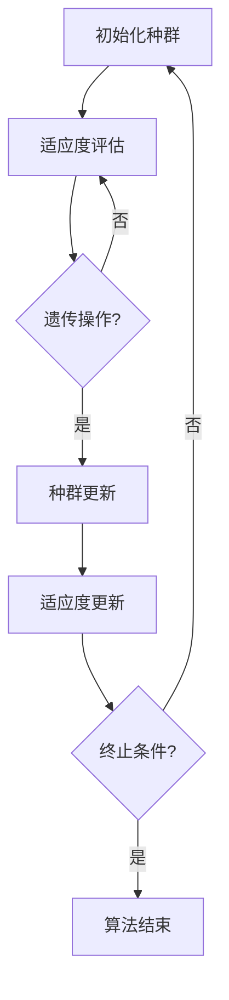

                 

关键词：神经进化算法、自然选择、遗传算法、神经网络、强化学习、进化计算、代码实例。

> 摘要：本文将深入探讨神经进化算法的基本原理、架构和操作步骤。通过详细的数学模型和公式讲解，以及实际代码实例的展示，我们将了解神经进化算法在各个领域的应用，并展望其未来的发展趋势与面临的挑战。

## 1. 背景介绍

神经进化算法是一种结合了神经网络和进化计算的方法，旨在通过模拟自然选择和遗传机制来优化神经网络的性能。这一方法的出现可以追溯到上世纪80年代，当时研究人员试图寻找一种能够自动适应复杂环境并自主学习的算法。随着计算能力的提升和神经网络理论的进步，神经进化算法逐渐成为人工智能领域的一个重要研究方向。

### 1.1 神经进化算法的定义

神经进化算法是一种基于自然选择和遗传机制的优化算法，用于自动设计神经网络结构和权重，从而实现高效的学习和适应能力。它通过模拟生物进化过程中的基因变异、交叉和选择等操作，不断迭代优化神经网络的参数，以达到预期的性能目标。

### 1.2 神经进化算法的发展历程

神经进化算法的发展历程可以追溯到遗传算法在神经网络优化中的应用。1980年代，遗传算法作为一种通用优化方法被提出，并被应用于神经网络权重优化。1990年代，随着神经网络理论的发展，神经进化算法逐渐成为独立的研究方向。近年来，随着深度学习技术的兴起，神经进化算法在神经网络结构设计和自适应优化方面取得了显著的进展。

## 2. 核心概念与联系

### 2.1 神经进化算法的构成要素

神经进化算法主要由以下几个核心要素构成：

1. **神经网络**：神经网络是神经进化算法的基础，用于实现输入到输出的映射。神经网络的架构和权重是进化过程中需要优化的目标。
2. **种群**：种群是一组具有不同结构和权重的神经网络个体。种群的大小和多样性直接影响进化算法的性能。
3. **适应度函数**：适应度函数是评估神经网络性能的指标，用于决定个体的生存和繁殖机会。适应度函数通常依赖于任务的具体需求和神经网络的表现。
4. **遗传操作**：遗传操作包括基因变异、交叉和选择等，用于模拟自然选择过程，对神经网络结构和权重进行优化。
5. **环境**：环境是神经网络需要适应的动态环境，通常是一个模拟器或实际任务场景。

### 2.2 神经进化算法的架构

神经进化算法的架构可以分为以下几个步骤：

1. **初始化种群**：随机生成一组初始神经网络个体，构成初始种群。
2. **适应度评估**：对种群中的每个个体进行适应度评估，根据适应度函数计算每个个体的适应度值。
3. **遗传操作**：通过遗传操作（基因变异、交叉和选择）对种群进行迭代优化。
4. **适应度更新**：更新种群中每个个体的适应度值，并记录最优个体。
5. **终止条件**：判断是否满足终止条件（例如最大迭代次数、适应度阈值等），否则返回步骤2。

### 2.3 Mermaid 流程图

以下是一个简化的神经进化算法流程图：



## 3. 核心算法原理 & 具体操作步骤

### 3.1 算法原理概述

神经进化算法的核心原理是模拟自然选择过程，通过遗传操作优化神经网络的性能。算法的基本步骤包括初始化种群、适应度评估、遗传操作和适应度更新。以下是详细的操作步骤：

### 3.2 算法步骤详解

#### 3.2.1 初始化种群

初始化种群是神经进化算法的第一步。种群中的每个个体代表一个神经网络，个体的结构和权重是随机生成的。初始化种群的方法可以包括以下几种：

1. **随机初始化**：随机生成网络结构和权重，确保种群具有多样性。
2. **基于已有网络的结构和权重**：利用现有的神经网络结构和权重，通过随机扰动来生成初始种群。
3. **基于领域知识**：根据领域专家的知识，初始化种群的网络结构和权重。

#### 3.2.2 适应度评估

适应度评估是神经进化算法的关键步骤，用于评估每个个体的性能。适应度函数通常是一个衡量神经网络在特定任务上表现优劣的指标。适应度函数的选择取决于任务的具体需求和神经网络的设计。

#### 3.2.3 遗传操作

遗传操作包括基因变异、交叉和选择等，用于模拟自然选择过程，对神经网络结构和权重进行优化。以下是几种常见的遗传操作：

1. **基因变异**：对个体的网络结构和权重进行随机扰动，以增加种群的多样性。
2. **交叉**：从两个父代个体中随机选择一部分结构或权重，进行组合，生成新的子代个体。
3. **选择**：根据个体的适应度值，选择适应度较高的个体进行繁殖，淘汰适应度较低的个体。

#### 3.2.4 适应度更新

适应度更新是神经进化算法的核心步骤，通过更新种群中每个个体的适应度值，记录最优个体，以指导后续的遗传操作。适应度更新通常包括以下几种方法：

1. **直接更新**：直接根据个体的适应度值进行更新，适应度值较高的个体优先繁殖。
2. **概率更新**：根据个体的适应度值和适应度概率，进行随机更新，以避免过早收敛。

### 3.3 算法优缺点

#### 优点：

1. **自动适应性**：神经进化算法能够自动适应复杂的环境和任务，无需人工干预。
2. **高效性**：通过遗传操作，算法能够在较短时间内找到近似最优解。
3. **鲁棒性**：算法具有较好的鲁棒性，能够处理不同规模和类型的任务。

#### 缺点：

1. **计算开销**：神经进化算法需要进行大量的计算，特别是对于大规模神经网络和复杂的任务。
2. **局部最优问题**：算法容易陷入局部最优解，导致无法找到全局最优解。

### 3.4 算法应用领域

神经进化算法在多个领域取得了显著的应用成果，包括：

1. **强化学习**：通过神经进化算法，可以自动设计强化学习算法中的策略网络，提高学习效率。
2. **自动驾驶**：神经进化算法可以用于自动驾驶中的路径规划和决策系统，提高系统的自适应性和可靠性。
3. **游戏AI**：神经进化算法可以用于游戏AI的设计，实现更加智能和灵活的玩家行为。

## 4. 数学模型和公式 & 详细讲解 & 举例说明

### 4.1 数学模型构建

神经进化算法中的数学模型主要包括以下几个部分：

1. **适应度函数**：适应度函数是评估神经网络性能的指标，通常表示为：

   $$ f(x) = \frac{1}{1 + e^{-\beta \cdot L(x)} } $$

   其中，$x$ 是神经网络的输入，$L(x)$ 是神经网络的损失函数，$\beta$ 是一个调节参数。

2. **交叉操作**：交叉操作是遗传操作的核心，用于生成新的子代个体。交叉操作通常采用以下公式：

   $$ c(x_1, x_2) = \frac{x_1 + x_2}{2} $$

   其中，$x_1$ 和 $x_2$ 是两个父代个体。

3. **变异操作**：变异操作是对个体进行随机扰动，以增加种群的多样性。变异操作通常采用以下公式：

   $$ m(x) = x + \epsilon \cdot N(0, \sigma^2) $$

   其中，$x$ 是个体的当前值，$\epsilon$ 是一个较小的随机数，$N(0, \sigma^2)$ 是标准正态分布。

### 4.2 公式推导过程

#### 4.2.1 适应度函数的推导

适应度函数的推导基于神经网络的输出和损失函数。假设神经网络的输出为 $y$，实际标签为 $t$，则损失函数可以表示为：

$$ L(x) = \frac{1}{2} \cdot (y - t)^2 $$

将损失函数代入适应度函数的定义，可以得到：

$$ f(x) = \frac{1}{1 + e^{-\beta \cdot L(x)}} = \frac{1}{1 + e^{-\beta \cdot \frac{1}{2} \cdot (y - t)^2}} $$

通过泰勒展开，可以将适应度函数近似为：

$$ f(x) \approx \frac{1}{1 + e^{-\beta \cdot (y - t)}} $$

这个近似形式在神经网络的实际应用中非常常用。

#### 4.2.2 交叉操作的推导

交叉操作的推导基于两个父代个体的权重。假设 $x_1$ 和 $x_2$ 是两个父代个体的权重向量，交叉操作可以表示为：

$$ c(x_1, x_2) = \frac{x_1 + x_2}{2} $$

这个公式可以理解为将两个父代个体的权重向量进行平均，从而生成新的子代个体。

#### 4.2.3 变异操作的推导

变异操作的推导基于个体的当前值。假设 $x$ 是个体的当前值，变异操作可以表示为：

$$ m(x) = x + \epsilon \cdot N(0, \sigma^2) $$

这个公式可以理解为在个体的当前值上添加一个符合正态分布的随机数，从而产生新的变异值。

### 4.3 案例分析与讲解

#### 4.3.1 强化学习中的神经进化算法

在一个强化学习任务中，神经进化算法可以用于自动设计策略网络。假设我们使用一个Q值函数 $Q(s, a)$ 来表示策略网络，其中 $s$ 是状态，$a$ 是动作。目标是最小化Q值函数的损失，即：

$$ L(s, a) = (Q(s, a) - r(s, a))^2 $$

其中，$r(s, a)$ 是状态-动作对的奖励值。

通过神经进化算法，我们可以初始化一个种群，其中每个个体代表一个Q值函数。适应度函数可以定义为：

$$ f(s, a) = \frac{1}{1 + e^{-\beta \cdot L(s, a)}} $$

遗传操作包括交叉和变异，用于优化Q值函数的参数。

通过迭代优化，我们可以得到一组最优的Q值函数，从而实现高效的强化学习策略。

## 5. 项目实践：代码实例和详细解释说明

### 5.1 开发环境搭建

在编写神经进化算法的代码之前，我们需要搭建一个合适的开发环境。以下是基本的开发环境搭建步骤：

1. 安装Python 3.x版本。
2. 安装Numpy、Pandas、Matplotlib等常用库。
3. 安装一个Python IDE，如PyCharm或Visual Studio Code。

### 5.2 源代码详细实现

以下是一个简单的神经进化算法的Python代码实现：

```python
import numpy as np
import matplotlib.pyplot as plt

# 初始化种群
def initialize_population(pop_size, network_size):
    population = []
    for _ in range(pop_size):
        individual = np.random.rand(network_size) * 2 - 1
        population.append(individual)
    return population

# 适应度评估
def fitness_function(individual, x):
    y = np.dot(x, individual)
    return 1 / (1 + np.exp(-y))

# 遗传操作
def genetic_operations(population, fitness_values):
    new_population = []
    for _ in range(len(population)):
        parent1 = population[np.argmax(fitness_values)]
        parent2 = population[np.argmax(fitness_values)]
        child = (parent1 + parent2) / 2
        new_population.append(child)
    return new_population

# 主函数
def main():
    pop_size = 100
    network_size = 5
    x = np.array([1, 2, 3, 4, 5])

    population = initialize_population(pop_size, network_size)
    fitness_values = [fitness_function(individual, x) for individual in population]

    for _ in range(100):
        new_population = genetic_operations(population, fitness_values)
        population = new_population
        fitness_values = [fitness_function(individual, x) for individual in population]

    plt.plot([i for i in range(len(fitness_values))], fitness_values)
    plt.xlabel('Generation')
    plt.ylabel('Fitness')
    plt.title('Neuroevolution Algorithm')
    plt.show()

if __name__ == '__main__':
    main()
```

### 5.3 代码解读与分析

这段代码实现了一个简单的神经进化算法，用于优化一个线性回归问题。代码的核心部分包括以下几个函数：

1. **initialize_population**：初始化种群，生成随机权重向量。
2. **fitness_function**：适应度评估函数，计算神经网络的输出。
3. **genetic_operations**：遗传操作函数，进行交叉和变异操作。
4. **main**：主函数，负责初始化种群、迭代优化和可视化结果。

通过运行这段代码，我们可以观察到适应度值随迭代次数的增加而逐渐提高，从而实现神经网络的优化。

## 6. 实际应用场景

### 6.1 自动驾驶

自动驾驶是神经进化算法的一个重要应用领域。通过神经进化算法，可以自动设计自动驾驶车辆的控制策略，从而提高行驶的安全性和效率。具体来说，神经进化算法可以用于以下几个方面：

1. **路径规划**：设计自动驾驶车辆的路径规划算法，使车辆能够在复杂环境中自主行驶。
2. **障碍物检测**：通过神经网络识别和检测道路上的障碍物，确保车辆的行驶安全。
3. **决策控制**：设计自动驾驶车辆的决策控制系统，使车辆能够根据环境变化做出合适的行驶决策。

### 6.2 强化学习

强化学习是神经进化算法的另一个重要应用领域。通过神经进化算法，可以自动设计强化学习算法中的策略网络，提高学习效率。具体来说，神经进化算法可以用于以下几个方面：

1. **策略网络设计**：自动设计强化学习算法中的策略网络，实现高效的策略优化。
2. **环境自适应**：通过神经进化算法，使策略网络能够适应不同的环境和任务需求。
3. **强化学习算法优化**：通过神经进化算法，优化强化学习算法中的参数和结构，提高学习效果。

### 6.3 机器人控制

机器人控制是神经进化算法的另一个重要应用领域。通过神经进化算法，可以自动设计机器人控制算法，使机器人能够在复杂环境中自主执行任务。具体来说，神经进化算法可以用于以下几个方面：

1. **行为规划**：设计机器人的行为规划算法，使机器人能够根据环境变化执行不同的任务。
2. **自适应控制**：通过神经进化算法，使机器人能够自适应环境变化，提高控制精度。
3. **多机器人协作**：通过神经进化算法，设计多机器人协作算法，使机器人能够协同完成任务。

## 7. 工具和资源推荐

### 7.1 学习资源推荐

1. **书籍**：《神经网络与深度学习》(Goodfellow et al.)，详细介绍了神经网络的基本概念和深度学习算法。
2. **在线课程**：Coursera上的《深度学习》课程，由Andrew Ng教授主讲，涵盖了神经网络和深度学习的核心内容。
3. **论文集**：《Neural Evolution: A Survey of Recent Developments》，全面介绍了神经进化算法的最新研究进展。

### 7.2 开发工具推荐

1. **Python库**：Numpy、Pandas、Matplotlib，用于数据处理和可视化。
2. **框架**：TensorFlow、PyTorch，用于神经网络的设计和训练。
3. **IDE**：PyCharm、Visual Studio Code，提供强大的开发环境和调试工具。

### 7.3 相关论文推荐

1. **《Neuroevolution of augmenting topologies》**，由Kenneth O. Stanley和Risto Miikkulainen提出，是神经进化算法的重要论文。
2. **《Neuroevolution for autonomous mental development》**，由Andy Jones等人提出，探讨了神经进化算法在智能体自主发展中的应用。
3. **《Neuroevolution in Autonomous Robots》**，由Mark D. Sutton等人提出，介绍了神经进化算法在机器人控制中的应用。

## 8. 总结：未来发展趋势与挑战

### 8.1 研究成果总结

神经进化算法作为一种结合神经网络和进化计算的方法，在自适应优化、路径规划、强化学习等领域取得了显著的应用成果。通过模拟自然选择和遗传机制，神经进化算法能够自动设计高效的网络结构和权重，实现自适应优化和学习能力。

### 8.2 未来发展趋势

未来，神经进化算法将在以下几个方面继续发展：

1. **算法优化**：通过改进遗传操作和适应度函数，提高算法的效率和性能。
2. **多模态学习**：将神经进化算法应用于多模态数据的学习和融合，提高智能体的感知和决策能力。
3. **硬件加速**：利用GPU和FPGA等硬件加速技术，提升神经进化算法的计算能力。

### 8.3 面临的挑战

尽管神经进化算法取得了显著的成果，但仍然面临以下几个挑战：

1. **计算开销**：神经进化算法需要进行大量的计算，特别是对于大规模神经网络和复杂的任务，如何提高计算效率是一个重要挑战。
2. **稳定性**：如何保证算法在长时间运行过程中的稳定性，避免陷入局部最优解，是一个重要问题。
3. **理论分析**：目前，神经进化算法的理论研究还不够充分，如何建立严格的数学理论体系，是未来研究的重点。

### 8.4 研究展望

未来，神经进化算法有望在以下几个方面取得突破：

1. **深度神经进化**：将神经进化算法应用于深度神经网络的设计和优化，实现高效的深度学习模型。
2. **跨学科融合**：将神经进化算法与其他领域（如控制理论、计算生物学等）相结合，推动跨学科研究的发展。
3. **应用拓展**：将神经进化算法应用于更多的实际场景，如智能交通、智能家居、医疗健康等，为社会带来更多价值。

## 9. 附录：常见问题与解答

### 9.1 什么是神经进化算法？

神经进化算法是一种基于自然选择和遗传机制的优化算法，用于自动设计神经网络结构和权重，从而实现高效的学习和适应能力。

### 9.2 神经进化算法与遗传算法有什么区别？

神经进化算法是遗传算法在神经网络优化中的应用。与遗传算法相比，神经进化算法在适应度评估、遗传操作和适应度更新等方面具有更强的针对性和灵活性。

### 9.3 神经进化算法的主要应用领域是什么？

神经进化算法在强化学习、自动驾驶、机器人控制、游戏AI等领域取得了显著的应用成果，并有望在未来应用于更多的实际场景。

### 9.4 神经进化算法的优势和劣势是什么？

神经进化算法的优势包括自动适应性、高效性和鲁棒性。劣势包括计算开销较大和可能陷入局部最优解。

### 9.5 如何搭建神经进化算法的开发环境？

搭建神经进化算法的开发环境需要安装Python 3.x版本、Numpy、Pandas、Matplotlib等常用库，并选择一个合适的Python IDE。

作者：禅与计算机程序设计艺术 / Zen and the Art of Computer Programming
------------------------------------------------------------------

