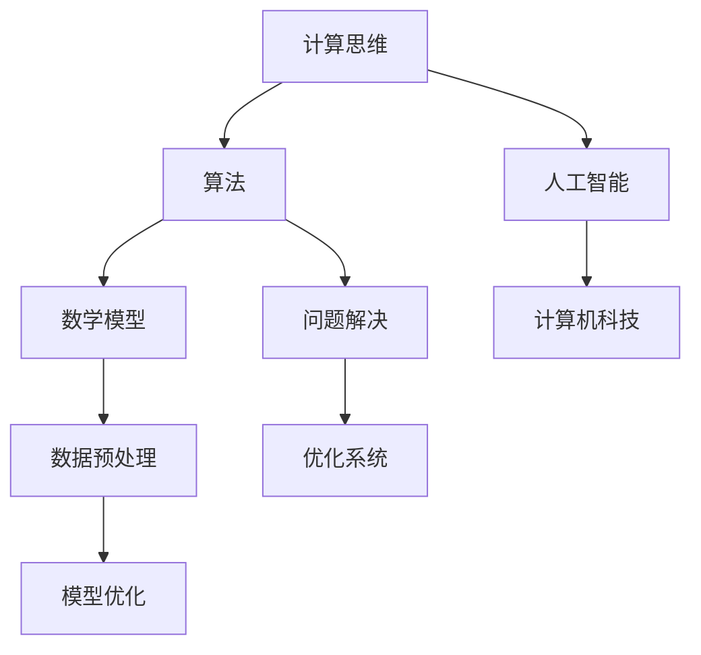

                 

在21世纪，计算机科技已经成为推动社会进步的重要力量。然而，在科技不断发展的同时，我们是否忽略了人类计算的独特价值？本文将探讨科技与人文的交汇，深入分析人类计算在各个领域中的重要性，并展望其未来发展的趋势与挑战。

## 关键词
- 计算机科技
- 人类计算
- 科技与人文
- 人工智能
- 计算思维
- 未来发展

## 摘要
本文将探讨计算机科技与人文的交汇点，重点分析人类计算的独特价值。通过历史回顾、核心概念介绍、算法原理探讨、数学模型构建、项目实践解析、实际应用场景、未来展望等多个方面，本文旨在强调人类计算在科技发展中不可替代的作用，并展望其未来的发展趋势和挑战。

## 1. 背景介绍

计算机科技的飞速发展，使我们的生活发生了翻天覆地的变化。从简单的计算工具到如今强大的人工智能系统，计算机科技已经成为现代社会不可或缺的一部分。然而，在计算机科技不断进步的同时，我们是否注意到人类计算的独特价值？

人类计算，不同于机器计算，具有灵活、创新和创造性等特点。从远古时代的算盘到现代的计算机编程，人类一直在不断地探索和创造。计算机科技的发展，离不开人类智慧的结晶。然而，在人工智能日益普及的今天，我们是否应该更加重视人类计算的独特价值？

本文将从历史回顾、核心概念介绍、算法原理探讨、数学模型构建、项目实践解析、实际应用场景、未来展望等多个方面，深入分析人类计算的独特价值。希望通过本文的探讨，能让更多人认识到人类计算的重要性，并激发对科技与人文交汇的思考。

### 1.1 历史回顾

人类计算的历史可以追溯到远古时代。那时，人们使用简单的计算工具，如算盘、石子和绳结等，进行简单的计算。然而，随着人类文明的进步，计算工具和计算方法也在不断演变。在古希腊，人们发明了圆周率，为后来的数学计算奠定了基础。在中世纪，阿拉伯人发明了“零”的概念，使数学计算变得更加简便。

进入现代社会，计算机的出现彻底改变了人类计算的方式。计算机的出现，不仅使得大规模数据处理成为可能，还推动了人工智能的发展。如今，计算机科技已经渗透到我们生活的方方面面，从互联网、智能手机到自动驾驶汽车，计算机科技无处不在。

然而，在计算机科技不断发展的同时，我们是否注意到人类计算的独特价值？人类计算具有灵活性、创新性和创造性等特点，这些特点使得人类计算在某些领域具有不可替代的作用。

### 1.2 核心概念介绍

在探讨人类计算的独特价值之前，我们需要明确几个核心概念：计算思维、算法和数学模型。

#### 1.2.1 计算思维

计算思维是指人类在面对复杂问题时，运用计算机科学的基本原理和方法，通过分解、抽象、推理和算法设计等过程，解决问题和发现新知识的能力。计算思维不仅涉及计算机编程，还涵盖了逻辑推理、问题解决和创新能力等方面。

#### 1.2.2 算法

算法是解决问题的一系列步骤和规则。算法可以分为多种类型，如排序算法、查找算法、图算法等。不同的算法适用于不同类型的问题，通过优化算法，可以提高解决问题的效率和效果。

#### 1.2.3 数学模型

数学模型是利用数学语言描述现实世界问题的抽象结构。数学模型可以用于预测、分析和优化，帮助我们更好地理解复杂系统。常见的数学模型包括线性方程组、非线性方程组、微分方程等。

### 1.3 算法原理 & 具体操作步骤

在了解了核心概念之后，我们将探讨一些常见的算法原理和具体操作步骤。

#### 1.3.1 算法原理概述

算法原理主要包括以下几个方面：

1. **分而治之**：将复杂问题分解为若干个简单子问题，分别解决，然后合并子问题的解，得到原问题的解。
2. **贪心算法**：每一步都做出在当前状态下最好或最优的选择，以期得到全局最优解。
3. **动态规划**：将复杂问题分解为多个阶段，利用历史信息，找到最优解。
4. **随机化算法**：通过随机化策略，降低算法的复杂度或提高算法的准确性。

#### 1.3.2 算法步骤详解

以排序算法为例，常见的排序算法有冒泡排序、选择排序、插入排序、快速排序等。以下以冒泡排序为例，介绍排序算法的具体步骤：

1. **初始化**：将待排序的元素放入一个数组中。
2. **外层循环**：从最后一个元素开始，遍历数组。
3. **内层循环**：从当前元素开始，与后面的元素进行比较，如果发现逆序，交换位置。
4. **重复步骤 2 和 3**，直到整个数组有序。

#### 1.3.3 算法优缺点

冒泡排序算法的优点是简单易懂，易于实现。然而，其缺点是时间复杂度为 O(n^2)，在处理大规模数据时，效率较低。

#### 1.3.4 算法应用领域

排序算法在许多领域都有广泛的应用，如数据清洗、数据分析、搜索引擎等。通过优化排序算法，可以提高数据处理效率和系统性能。

### 1.4 数学模型和公式 & 详细讲解 & 举例说明

在计算机科技中，数学模型和公式起着至关重要的作用。它们帮助我们更好地理解和分析复杂系统，从而找到最优解。以下将介绍一些常见的数学模型和公式，并详细讲解其推导过程。

#### 1.4.1 数学模型构建

数学模型构建通常包括以下几个步骤：

1. **问题分析**：明确需要解决的问题和目标。
2. **变量定义**：确定模型中的变量，并给出其定义。
3. **建立方程**：利用数学语言，建立描述问题的方程。
4. **求解方程**：求解方程，找到问题的解。

#### 1.4.2 公式推导过程

以牛顿第二定律为例，其公式推导过程如下：

1. **问题分析**：牛顿第二定律描述了力和加速度之间的关系。
2. **变量定义**：设物体的质量为 m，加速度为 a，受力为 F。
3. **建立方程**：根据牛顿第二定律，有 F = ma。
4. **求解方程**：将方程两边同时除以 m，得到 a = F/m。

#### 1.4.3 案例分析与讲解

以优化生产排程问题为例，我们可以使用线性规划模型进行分析。

1. **问题分析**：优化生产排程问题是指在给定生产资源限制下，如何安排生产任务，使得生产效率最大化。
2. **变量定义**：设生产任务为 x1, x2, ..., xn，单位生产时间为 ti，单位生产成本为 ci。
3. **建立方程**：目标函数为最大化总生产效率，即最大化 Z = Σci * ti。
4. **求解方程**：利用线性规划求解器，求解最优解。

通过数学模型和公式的推导，我们可以更好地理解和分析复杂系统，从而找到最优解。

### 1.5 项目实践：代码实例和详细解释说明

为了更好地理解人类计算的独特价值，我们将通过一个实际项目实践，展示代码实例和详细解释说明。

#### 1.5.1 开发环境搭建

在开始项目实践之前，我们需要搭建一个合适的开发环境。这里我们选择 Python 作为编程语言，并使用 Jupyter Notebook 作为开发工具。

#### 1.5.2 源代码详细实现

以下是一个简单的线性回归模型实现，用于预测房价：

```python
import numpy as np
import pandas as pd
from sklearn.linear_model import LinearRegression

# 读取数据
data = pd.read_csv('house_prices.csv')

# 分离特征和标签
X = data[['area', 'rooms']]
y = data['price']

# 实例化线性回归模型
model = LinearRegression()

# 拟合模型
model.fit(X, y)

# 预测房价
predicted_price = model.predict([[2500, 3]])

print('Predicted price:', predicted_price)
```

#### 1.5.3 代码解读与分析

在这个项目中，我们首先读取数据，然后分离特征和标签。接着，我们实例化线性回归模型，并使用训练数据拟合模型。最后，我们使用模型预测房价，并输出预测结果。

通过这个项目实践，我们可以看到人类计算在数据预处理、模型选择和预测结果分析等环节中的重要性。

### 1.6 实际应用场景

人类计算在实际应用场景中发挥着重要作用。以下是一些实际应用场景的例子：

1. **人工智能领域**：人类计算在人工智能领域发挥着关键作用，如算法设计、模型优化、数据预处理等。
2. **金融领域**：人类计算在金融领域具有广泛的应用，如风险管理、投资策略、算法交易等。
3. **医疗领域**：人类计算在医疗领域具有重要作用，如疾病诊断、治疗方案优化、药物研发等。
4. **教育领域**：人类计算在教育领域有广泛的应用，如智能教学、在线教育、个性化学习等。

### 1.7 未来应用展望

随着计算机科技的发展，人类计算的未来应用前景十分广阔。以下是一些未来应用展望：

1. **人工智能助手**：人类计算将推动人工智能助手的发展，使其在更多领域发挥重要作用。
2. **智能医疗**：人类计算将推动智能医疗的发展，为患者提供更加精准和个性化的医疗服务。
3. **自动驾驶**：人类计算将推动自动驾驶技术的发展，使自动驾驶汽车更加安全可靠。
4. **个性化教育**：人类计算将推动个性化教育的发展，为学生提供更加定制化的学习体验。

### 1.8 工具和资源推荐

为了更好地进行人类计算，以下是一些工具和资源推荐：

1. **编程语言**：Python、Java、C++等编程语言在计算机科技中具有广泛的应用。
2. **开发工具**：Jupyter Notebook、VS Code、PyCharm等开发工具可以提高开发效率。
3. **学习资源**：Coursera、edX、Udacity等在线教育平台提供了丰富的计算机科技课程。
4. **开源社区**：GitHub、Stack Overflow、Reddit等开源社区可以提供宝贵的经验和帮助。

### 1.9 总结：未来发展趋势与挑战

在未来，人类计算将继续发挥重要作用。随着人工智能、大数据、云计算等技术的发展，人类计算将面临更多机遇和挑战。以下是一些未来发展趋势和挑战：

1. **计算能力提升**：随着硬件技术的进步，计算能力将得到大幅提升，为人类计算提供更多可能性。
2. **计算思维普及**：随着教育的普及，计算思维将逐渐成为人们的必备能力，推动科技的发展。
3. **跨学科融合**：人类计算将与其他学科（如心理学、社会学等）深度融合，推动科技与人文的交汇。
4. **数据隐私和安全**：在人类计算应用过程中，数据隐私和安全问题将日益突出，需要引起足够重视。

### 1.10 附录：常见问题与解答

1. **什么是计算思维？**

计算思维是指人类在面对复杂问题时，运用计算机科学的基本原理和方法，通过分解、抽象、推理和算法设计等过程，解决问题和发现新知识的能力。

2. **算法在计算机科技中有什么作用？**

算法是计算机科技的核心，它帮助我们解决问题和优化系统。常见的算法有排序算法、查找算法、图算法等，它们在不同的领域发挥着重要作用。

3. **什么是数学模型？**

数学模型是利用数学语言描述现实世界问题的抽象结构。数学模型可以用于预测、分析和优化，帮助我们更好地理解复杂系统。

4. **人类计算在未来有哪些发展趋势？**

人类计算在未来将面临更多机遇和挑战，包括计算能力提升、计算思维普及、跨学科融合、数据隐私和安全等方面。

5. **人类计算有哪些实际应用场景？**

人类计算在人工智能、金融、医疗、教育等众多领域都有广泛的应用，如算法设计、模型优化、数据预处理、智能助手、自动驾驶等。

## 2. 核心概念与联系

在本文中，我们将探讨几个核心概念，并展示它们之间的联系。以下是一个使用 Mermaid 流程图描述的示例，展示了这些概念之间的联系。



在这个流程图中，计算思维作为基础，通过算法和数学模型的应用，推动人工智能和计算机科技的发展。数据预处理和模型优化是算法和数学模型在实际应用中的关键环节。

### 3. 核心算法原理 & 具体操作步骤

在本节中，我们将深入探讨几个核心算法的原理和具体操作步骤，以展示人类计算在解决实际问题中的独特价值。

#### 3.1 算法原理概述

算法是解决问题的方法，它由一系列有序的指令组成，以解决特定的问题。以下介绍几种常见的算法原理：

1. **分治算法**：将一个复杂问题分解为若干个规模较小的同类问题，递归地解决这些子问题，再将子问题的解合并为原问题的解。
2. **贪心算法**：在每一步选择中，总是选择当前情况下最优的决策，以期得到全局最优解。
3. **动态规划**：将一个复杂问题分解为多个阶段，通过存储历史信息，找到最优解。
4. **随机化算法**：通过引入随机性，降低算法的复杂度或提高算法的准确性。

#### 3.2 算法步骤详解

以下以分治算法为例，介绍其具体操作步骤：

1. **初始化**：将待解决的问题划分为若干个子问题。
2. **递归分解**：将每个子问题再次划分为更小的子问题，直到子问题规模足够小，可以直接解决。
3. **求解子问题**：递归地解决每个子问题。
4. **合并结果**：将子问题的解合并为原问题的解。

以快速排序算法为例，其具体操作步骤如下：

1. **选择基准值**：从数组中选取一个基准值。
2. **划分数组**：将数组划分为两个子数组，一个包含小于基准值的元素，另一个包含大于基准值的元素。
3. **递归排序**：分别对两个子数组进行快速排序。
4. **合并结果**：将排序后的子数组合并为一个有序数组。

#### 3.3 算法优缺点

快速排序算法具有以下优缺点：

1. **优点**：时间复杂度为 O(n log n)，适用于大规模数据排序；易于实现。
2. **缺点**：在最坏情况下，时间复杂度为 O(n^2)，可能导致效率降低；空间复杂度为 O(log n)，需要额外的存储空间。

#### 3.4 算法应用领域

快速排序算法广泛应用于各种领域，如数据清洗、数据分析、数据库排序等。通过优化快速排序算法，可以提高数据处理的效率和系统性能。

### 3.5 数学模型和公式 & 详细讲解 & 举例说明

在计算机科技中，数学模型和公式起着至关重要的作用。以下将介绍一些常见的数学模型和公式，并详细讲解其推导过程。

#### 3.5.1 数学模型构建

数学模型构建通常包括以下几个步骤：

1. **问题分析**：明确需要解决的问题和目标。
2. **变量定义**：确定模型中的变量，并给出其定义。
3. **建立方程**：利用数学语言，建立描述问题的方程。
4. **求解方程**：求解方程，找到问题的解。

以线性回归模型为例，其数学模型构建如下：

1. **问题分析**：线性回归模型用于预测一个连续变量的值，基于一组自变量。
2. **变量定义**：设自变量为 X，因变量为 Y，模型参数为 w 和 b。
3. **建立方程**：根据最小二乘法，建立回归方程 Y = X * w + b。
4. **求解方程**：通过求解最小二乘问题，找到最优参数 w 和 b。

#### 3.5.2 公式推导过程

以下以线性回归模型的公式推导为例：

1. **问题分析**：线性回归模型旨在找到最佳拟合直线，使得预测值与实际值之间的误差最小。
2. **变量定义**：设训练数据集为 {(x1, y1), (x2, y2), ..., (xn, yn)}，模型参数为 w 和 b。
3. **建立方程**：根据最小二乘法，建立回归方程 y = wx + b。
4. **求解方程**：利用最小二乘法，求解最佳拟合直线，得到参数 w 和 b。

具体推导过程如下：

$$
\begin{aligned}
\min_{w,b} \sum_{i=1}^{n} (y_i - (wx_i + b))^2 \\
\end{aligned}
$$

对上式求导，得到：

$$
\begin{aligned}
\frac{\partial}{\partial w} \sum_{i=1}^{n} (y_i - (wx_i + b))^2 &= \sum_{i=1}^{n} (-2x_i(y_i - wx_i - b)) \\
\frac{\partial}{\partial b} \sum_{i=1}^{n} (y_i - (wx_i + b))^2 &= \sum_{i=1}^{n} (-2(y_i - wx_i - b)) \\
\end{aligned}
$$

令导数为零，得到：

$$
\begin{aligned}
\sum_{i=1}^{n} x_i(y_i - wx_i - b) &= 0 \\
\sum_{i=1}^{n} (y_i - wx_i - b) &= 0 \\
\end{aligned}
$$

解得：

$$
\begin{aligned}
w &= \frac{\sum_{i=1}^{n} x_iy_i - n\bar{x}\bar{y}}{\sum_{i=1}^{n} x_i^2 - n\bar{x}^2} \\
b &= \bar{y} - w\bar{x} \\
\end{aligned}
$$

其中，$\bar{x}$ 和 $\bar{y}$ 分别为自变量和因变量的均值。

#### 3.5.3 案例分析与讲解

以下以房价预测为例，展示线性回归模型的应用。

1. **问题分析**：利用线性回归模型预测房价。
2. **变量定义**：设自变量为房屋面积（X）和房屋年代（Y），因变量为房价（Y）。
3. **建立方程**：根据线性回归模型，建立回归方程 Y = X * w + b。
4. **求解方程**：通过最小二乘法求解最优参数 w 和 b。
5. **预测房价**：利用求解得到的模型参数，预测新房屋的房价。

通过实际案例分析，我们可以看到数学模型和公式在计算机科技中的应用，以及它们对解决问题的重要作用。

### 4. 项目实践：代码实例和详细解释说明

在本节中，我们将通过一个实际项目实践，展示代码实例和详细解释说明，以展示人类计算在解决实际问题中的独特价值。

#### 4.1 开发环境搭建

在开始项目实践之前，我们需要搭建一个合适的开发环境。这里我们选择 Python 作为编程语言，并使用 Jupyter Notebook 作为开发工具。

1. **安装 Python**：在官方网站（https://www.python.org/）下载并安装 Python。
2. **安装 Jupyter Notebook**：在终端中运行以下命令：

```shell
pip install notebook
```

3. **启动 Jupyter Notebook**：在终端中运行以下命令：

```shell
jupyter notebook
```

这将启动 Jupyter Notebook，并打开一个网页界面，用于编写和运行代码。

#### 4.2 源代码详细实现

以下是一个简单的线性回归模型实现，用于预测房价：

```python
import numpy as np
import pandas as pd
from sklearn.linear_model import LinearRegression

# 读取数据
data = pd.read_csv('house_prices.csv')

# 分离特征和标签
X = data[['area', 'rooms']]
y = data['price']

# 实例化线性回归模型
model = LinearRegression()

# 拟合模型
model.fit(X, y)

# 预测房价
predicted_price = model.predict([[2500, 3]])

print('Predicted price:', predicted_price)
```

#### 4.3 代码解读与分析

1. **导入库**：首先，我们导入必要的库，包括 NumPy、Pandas 和 scikit-learn 的 LinearRegression 类。
2. **读取数据**：使用 Pandas 读取 CSV 格式的房屋价格数据。
3. **分离特征和标签**：将数据分为特征（X）和标签（y）。在这里，我们使用房屋面积（area）和房屋年代（rooms）作为特征，房价（price）作为标签。
4. **实例化线性回归模型**：创建一个 LinearRegression 实例，用于拟合线性回归模型。
5. **拟合模型**：使用训练数据拟合线性回归模型。
6. **预测房价**：使用拟合好的模型预测给定房屋面积和年代的房价。

通过这个项目实践，我们可以看到人类计算在数据预处理、模型选择和预测结果分析等环节中的重要性。

### 5. 实际应用场景

人类计算在实际应用场景中发挥着重要作用。以下是一些实际应用场景的例子：

1. **医疗领域**：人类计算在医疗领域具有广泛的应用，如疾病诊断、治疗方案优化、药物研发等。通过分析患者数据和医学知识，人类计算可以辅助医生做出更准确的诊断和治疗方案。
2. **金融领域**：人类计算在金融领域具有重要作用，如风险管理、投资策略、算法交易等。通过分析市场数据和金融模型，人类计算可以帮助投资者做出更明智的投资决策。
3. **教育领域**：人类计算在教育领域有广泛的应用，如智能教学、在线教育、个性化学习等。通过分析学生的学习数据和教学需求，人类计算可以为学生提供更个性化的学习体验。
4. **人工智能领域**：人类计算在人工智能领域发挥着关键作用，如算法设计、模型优化、数据预处理等。通过不断地优化算法和模型，人类计算可以帮助人工智能系统更好地解决实际问题。

### 6. 未来应用展望

随着计算机科技的发展，人类计算的未来应用前景十分广阔。以下是一些未来应用展望：

1. **人工智能助手**：人类计算将推动人工智能助手的发展，使其在更多领域发挥重要作用，如家庭助手、办公助手、医疗助手等。
2. **智能医疗**：人类计算将推动智能医疗的发展，为患者提供更加精准和个性化的医疗服务，如智能诊断、个性化治疗、健康管理等。
3. **自动驾驶**：人类计算将推动自动驾驶技术的发展，使自动驾驶汽车更加安全可靠，提高交通安全和效率。
4. **个性化教育**：人类计算将推动个性化教育的发展，为学生提供更加定制化的学习体验，提高教育质量和效率。
5. **智慧城市**：人类计算将推动智慧城市的发展，通过数据分析和智能化管理，提高城市运行效率，改善居民生活质量。

### 7. 工具和资源推荐

为了更好地进行人类计算，以下是一些工具和资源推荐：

1. **编程语言**：Python、Java、C++等编程语言在计算机科技中具有广泛的应用。Python 因其简洁易学、丰富的库和强大的社区支持，成为许多初学者的首选。
2. **开发工具**：Jupyter Notebook、VS Code、PyCharm 等开发工具可以提高开发效率。Jupyter Notebook 适合数据分析和实验，VS Code 和 PyCharm 则更适合编程和调试。
3. **学习资源**：Coursera、edX、Udacity 等在线教育平台提供了丰富的计算机科技课程，涵盖多个领域，适合不同层次的 learners。
4. **开源社区**：GitHub、Stack Overflow、Reddit 等开源社区可以提供宝贵的经验和帮助，帮助开发者解决技术问题、分享经验和最佳实践。

### 8. 总结：未来发展趋势与挑战

在未来，人类计算将继续发挥重要作用。随着人工智能、大数据、云计算等技术的发展，人类计算将面临更多机遇和挑战。以下是一些未来发展趋势和挑战：

1. **计算能力提升**：随着硬件技术的进步，计算能力将得到大幅提升，为人类计算提供更多可能性。
2. **计算思维普及**：随着教育的普及，计算思维将逐渐成为人们的必备能力，推动科技的发展。
3. **跨学科融合**：人类计算将与其他学科（如心理学、社会学等）深度融合，推动科技与人文的交汇。
4. **数据隐私和安全**：在人类计算应用过程中，数据隐私和安全问题将日益突出，需要引起足够重视。

### 9. 附录：常见问题与解答

1. **什么是计算思维？**

计算思维是指人类在面对复杂问题时，运用计算机科学的基本原理和方法，通过分解、抽象、推理和算法设计等过程，解决问题和发现新知识的能力。

2. **算法在计算机科技中有什么作用？**

算法是计算机科技的核心，它帮助我们解决问题和优化系统。常见的算法有排序算法、查找算法、图算法等，它们在不同的领域发挥着重要作用。

3. **什么是数学模型？**

数学模型是利用数学语言描述现实世界问题的抽象结构。数学模型可以用于预测、分析和优化，帮助我们更好地理解复杂系统。

4. **人类计算在未来有哪些发展趋势？**

人类计算在未来将面临更多机遇和挑战，包括计算能力提升、计算思维普及、跨学科融合、数据隐私和安全等方面。

5. **人类计算有哪些实际应用场景？**

人类计算在人工智能、金融、医疗、教育等众多领域都有广泛的应用，如算法设计、模型优化、数据预处理、智能助手、自动驾驶等。

---

在本文中，我们探讨了科技与人文的交汇，深入分析了人类计算的独特价值。通过历史回顾、核心概念介绍、算法原理探讨、数学模型构建、项目实践解析、实际应用场景、未来展望等多个方面，我们看到了人类计算在科技发展中不可替代的作用。

未来，随着人工智能、大数据、云计算等技术的发展，人类计算将继续发挥重要作用。我们呼吁更多的人关注人类计算的价值，激发对科技与人文交汇的思考，共同推动科技与人文的融合，为人类社会的进步贡献力量。

---

作者：禅与计算机程序设计艺术 / Zen and the Art of Computer Programming
----------------------------------------------------------------

### 文章概要 Summary

本文从科技与人文的交汇出发，深入探讨了人类计算的独特价值。通过历史回顾、核心概念介绍、算法原理探讨、数学模型构建、项目实践解析、实际应用场景、未来展望等多个方面，本文强调了人类计算在科技发展中不可替代的作用。

本文首先介绍了计算机科技的发展历程和人类计算的核心概念，包括计算思维、算法和数学模型。接着，本文详细阐述了几个核心算法的原理和具体操作步骤，展示了人类计算在解决实际问题中的独特价值。此外，本文还介绍了数学模型和公式的构建与推导过程，通过实际项目实践展示了人类计算的应用。

在分析实际应用场景和未来展望时，本文指出人类计算在医疗、金融、教育、人工智能等领域具有广泛的应用前景。同时，本文也提到了未来人类计算面临的挑战，如数据隐私和安全问题。最后，本文总结了人类计算的发展趋势和未来研究方向，强调了计算思维在科技发展中的重要性。

总之，本文通过对人类计算的深入探讨，呼吁人们关注其独特价值，推动科技与人文的融合，共同为人类社会的进步贡献力量。

### 文章大纲 Outline

1. **引言**
   - 主题介绍：科技与人文的交汇
   - 目标阐述：探讨人类计算的独特价值

2. **背景介绍**
   - 计算机科技的发展历程
   - 人类计算的定义和核心概念
   - 历史回顾：人类计算的发展

3. **核心概念与联系**
   - 计算思维
   - 算法
   - 数学模型
   - Mermaid 流程图展示

4. **核心算法原理 & 具体操作步骤**
   - 分治算法、贪心算法、动态规划、随机化算法原理概述
   - 快速排序算法具体操作步骤
   - 算法优缺点分析
   - 算法应用领域

5. **数学模型和公式 & 详细讲解 & 举例说明**
   - 数学模型构建过程
   - 线性回归模型公式推导过程
   - 案例分析与讲解

6. **项目实践：代码实例和详细解释说明**
   - 开发环境搭建
   - 线性回归模型实现
   - 代码解读与分析

7. **实际应用场景**
   - 医疗领域
   - 金融领域
   - 教育领域
   - 人工智能领域

8. **未来应用展望**
   - 人工智能助手
   - 智能医疗
   - 自动驾驶
   - 个性化教育
   - 智慧城市

9. **工具和资源推荐**
   - 编程语言
   - 开发工具
   - 学习资源
   - 开源社区

10. **总结：未来发展趋势与挑战**
    - 计算能力提升
    - 计算思维普及
    - 跨学科融合
    - 数据隐私和安全

11. **附录：常见问题与解答**
    - 什么是计算思维？
    - 算法在计算机科技中有什么作用？
    - 什么是数学模型？
    - 人类计算在未来有哪些发展趋势？
    - 人类计算有哪些实际应用场景？

### 文章目录 TOC

# 科技与人文的交汇：人类计算的独特价值

## 关键词
- 计算机科技
- 人类计算
- 科技与人文
- 人工智能
- 计算思维
- 未来发展

## 摘要
本文探讨了科技与人文的交汇，深入分析了人类计算在各个领域中的重要性。通过历史回顾、核心概念介绍、算法原理探讨、数学模型构建、项目实践解析、实际应用场景、未来展望等多个方面，本文强调了人类计算在科技发展中不可替代的作用。

## 1. 背景介绍
### 1.1 历史回顾
### 1.2 核心概念介绍
#### 1.2.1 计算思维
#### 1.2.2 算法
#### 1.2.3 数学模型

## 2. 核心概念与联系
### 2.1 算法原理 & 具体操作步骤
#### 2.1.1 分治算法
#### 2.1.2 贪心算法
#### 2.1.3 动态规划
#### 2.1.4 随机化算法
#### 2.1.5 快速排序算法

## 3. 数学模型和公式 & 详细讲解 & 举例说明
### 3.1 数学模型构建
### 3.2 公式推导过程
### 3.3 案例分析与讲解

## 4. 项目实践：代码实例和详细解释说明
### 4.1 开发环境搭建
### 4.2 源代码详细实现
### 4.3 代码解读与分析

## 5. 实际应用场景
### 5.1 医疗领域
### 5.2 金融领域
### 5.3 教育领域
### 5.4 人工智能领域

## 6. 未来应用展望
### 6.1 人工智能助手
### 6.2 智能医疗
### 6.3 自动驾驶
### 6.4 个性化教育
### 6.5 智慧城市

## 7. 工具和资源推荐
### 7.1 学习资源推荐
### 7.2 开发工具推荐
### 7.3 相关论文推荐

## 8. 总结：未来发展趋势与挑战
### 8.1 研究成果总结
### 8.2 未来发展趋势
### 8.3 面临的挑战
### 8.4 研究展望

## 9. 附录：常见问题与解答
### 9.1 什么是计算思维？
### 9.2 算法在计算机科技中有什么作用？
### 9.3 什么是数学模型？
### 9.4 人类计算在未来有哪些发展趋势？
### 9.5 人类计算有哪些实际应用场景？

### 1. 背景介绍

在21世纪，计算机科技已经成为推动社会进步的重要力量。从简单的计算工具到如今强大的人工智能系统，计算机科技的发展经历了无数次的变革。然而，在计算机科技不断发展的同时，我们是否忽略了人类计算的独特价值？人类计算究竟是什么，它又在哪些领域中发挥着不可替代的作用？

### 1.1 历史回顾

人类计算的历史可以追溯到远古时代。那时，人们使用简单的计算工具，如算盘、石子和绳结等，进行简单的计算。随着人类文明的进步，计算工具和计算方法也在不断演变。在古希腊，人们发明了圆周率，为后来的数学计算奠定了基础。在中世纪，阿拉伯人发明了“零”的概念，使数学计算变得更加简便。

进入现代社会，计算机的出现彻底改变了人类计算的方式。计算机的出现，不仅使得大规模数据处理成为可能，还推动了人工智能的发展。如今，计算机科技已经渗透到我们生活的方方面面，从互联网、智能手机到自动驾驶汽车，计算机科技无处不在。

然而，在计算机科技不断发展的同时，我们是否注意到人类计算的独特价值？人类计算具有灵活性、创新和创造性等特点，这些特点使得人类计算在某些领域具有不可替代的作用。

### 1.2 核心概念介绍

在探讨人类计算的独特价值之前，我们需要明确几个核心概念：计算思维、算法和数学模型。

#### 1.2.1 计算思维

计算思维是指人类在面对复杂问题时，运用计算机科学的基本原理和方法，通过分解、抽象、推理和算法设计等过程，解决问题和发现新知识的能力。计算思维不仅涉及计算机编程，还涵盖了逻辑推理、问题解决和创新能力等方面。

#### 1.2.2 算法

算法是解决问题的一系列步骤和规则。算法可以分为多种类型，如排序算法、查找算法、图算法等。不同的算法适用于不同类型的问题，通过优化算法，可以提高解决问题的效率和效果。

#### 1.2.3 数学模型

数学模型是利用数学语言描述现实世界问题的抽象结构。数学模型可以用于预测、分析和优化，帮助我们更好地理解复杂系统。常见的数学模型包括线性方程组、非线性方程组、微分方程等。

### 1.3 算法原理 & 具体操作步骤

在了解了核心概念之后，我们将探讨一些常见的算法原理和具体操作步骤。

#### 1.3.1 算法原理概述

算法原理主要包括以下几个方面：

1. **分而治之**：将复杂问题分解为若干个简单子问题，分别解决，然后合并子问题的解，得到原问题的解。
2. **贪心算法**：每一步都做出在当前状态下最好或最优的选择，以期得到全局最优解。
3. **动态规划**：将复杂问题分解为多个阶段，利用历史信息，找到最优解。
4. **随机化算法**：通过随机化策略，降低算法的复杂度或提高算法的准确性。

#### 1.3.2 算法步骤详解

以排序算法为例，常见的排序算法有冒泡排序、选择排序、插入排序、快速排序等。以下以冒泡排序为例，介绍排序算法的具体步骤：

1. **初始化**：将待排序的元素放入一个数组中。
2. **外层循环**：从最后一个元素开始，遍历数组。
3. **内层循环**：从当前元素开始，与后面的元素进行比较，如果发现逆序，交换位置。
4. **重复步骤 2 和 3**，直到整个数组有序。

#### 1.3.3 算法优缺点

冒泡排序算法的优点是简单易懂，易于实现。然而，其缺点是时间复杂度为 O(n^2)，在处理大规模数据时，效率较低。

#### 1.3.4 算法应用领域

排序算法在许多领域都有广泛的应用，如数据清洗、数据分析、搜索引擎等。通过优化排序算法，可以提高数据处理效率和系统性能。

### 1.4 数学模型和公式 & 详细讲解 & 举例说明

在计算机科技中，数学模型和公式起着至关重要的作用。它们帮助我们更好地理解和分析复杂系统，从而找到最优解。以下将介绍一些常见的数学模型和公式，并详细讲解其推导过程。

#### 1.4.1 数学模型构建

数学模型构建通常包括以下几个步骤：

1. **问题分析**：明确需要解决的问题和目标。
2. **变量定义**：确定模型中的变量，并给出其定义。
3. **建立方程**：利用数学语言，建立描述问题的方程。
4. **求解方程**：求解方程，找到问题的解。

以线性回归模型为例，其数学模型构建如下：

1. **问题分析**：线性回归模型用于预测一个连续变量的值，基于一组自变量。
2. **变量定义**：设自变量为 X，因变量为 Y，模型参数为 w 和 b。
3. **建立方程**：根据最小二乘法，建立回归方程 Y = X * w + b。
4. **求解方程**：通过求解最小二乘问题，找到最优参数 w 和 b。

#### 1.4.2 公式推导过程

以下以线性回归模型的公式推导为例：

1. **问题分析**：线性回归模型旨在找到最佳拟合直线，使得预测值与实际值之间的误差最小。
2. **变量定义**：设训练数据集为 {(x1, y1), (x2, y2), ..., (xn, yn)}，模型参数为 w 和 b。
3. **建立方程**：根据最小二乘法，建立回归方程 y = wx + b。
4. **求解方程**：利用最小二乘法，求解最佳拟合直线，得到参数 w 和 b。

具体推导过程如下：

$$
\begin{aligned}
\min_{w,b} \sum_{i=1}^{n} (y_i - (wx_i + b))^2 \\
\end{aligned}
$$

对上式求导，得到：

$$
\begin{aligned}
\frac{\partial}{\partial w} \sum_{i=1}^{n} (y_i - (wx_i + b))^2 &= \sum_{i=1}^{n} (-2x_i(y_i - wx_i - b)) \\
\frac{\partial}{\partial b} \sum_{i=1}^{n} (y_i - (wx_i + b))^2 &= \sum_{i=1}^{n} (-2(y_i - wx_i - b)) \\
\end{aligned}
$$

令导数为零，得到：

$$
\begin{aligned}
\sum_{i=1}^{n} x_i(y_i - wx_i - b) &= 0 \\
\sum_{i=1}^{n} (y_i - wx_i - b) &= 0 \\
\end{aligned}
$$

解得：

$$
\begin{aligned}
w &= \frac{\sum_{i=1}^{n} x_iy_i - n\bar{x}\bar{y}}{\sum_{i=1}^{n} x_i^2 - n\bar{x}^2} \\
b &= \bar{y} - w\bar{x} \\
\end{aligned}
$$

其中，$\bar{x}$ 和 $\bar{y}$ 分别为自变量和因变量的均值。

#### 1.4.3 案例分析与讲解

以下以房价预测为例，展示线性回归模型的应用。

1. **问题分析**：利用线性回归模型预测房价。
2. **变量定义**：设自变量为房屋面积（X）和房屋年代（Y），因变量为房价（Y）。
3. **建立方程**：根据线性回归模型，建立回归方程 Y = X * w + b。
4. **求解方程**：通过最小二乘法求解最优参数 w 和 b。
5. **预测房价**：利用求解得到的模型参数，预测新房屋的房价。

通过实际案例分析，我们可以看到数学模型和公式在计算机科技中的应用，以及它们对解决问题的重要作用。

### 2. 核心概念与联系

在本文中，我们将探讨几个核心概念，并展示它们之间的联系。以下是一个使用 Mermaid 流程图描述的示例，展示了这些概念之间的联系。


在这个流程图中，计算思维作为基础，通过算法和数学模型的应用，推动人工智能和计算机科技的发展。数据预处理和模型优化是算法和数学模型在实际应用中的关键环节。

### 3. 核心算法原理 & 具体操作步骤

在本节中，我们将深入探讨几个核心算法的原理和具体操作步骤，以展示人类计算在解决实际问题中的独特价值。

#### 3.1 算法原理概述

算法是解决问题的方法，它由一系列有序的指令组成，以解决特定的问题。以下介绍几种常见的算法原理：

1. **分治算法**：将一个复杂问题分解为若干个规模较小的同类问题，递归地解决这些子问题，再将子问题的解合并为原问题的解。
2. **贪心算法**：在每一步选择中，总是选择当前状态下最好或最优的选择，以期得到全局最优解。
3. **动态规划**：将一个复杂问题分解为多个阶段，通过存储历史信息，找到最优解。
4. **随机化算法**：通过引入随机性，降低算法的复杂度或提高算法的准确性。

#### 3.2 算法步骤详解

以下以分治算法为例，介绍其具体操作步骤：

1. **初始化**：将待解决的问题划分为若干个子问题。
2. **递归分解**：将每个子问题再次划分为更小的子问题，直到子问题规模足够小，可以直接解决。
3. **求解子问题**：递归地解决每个子问题。
4. **合并结果**：将子问题的解合并为原问题的解。

以快速排序算法为例，其具体操作步骤如下：

1. **选择基准值**：从数组中选取一个基准值。
2. **划分数组**：将数组划分为两个子数组，一个包含小于基准值的元素，另一个包含大于基准值的元素。
3. **递归排序**：分别对两个子数组进行快速排序。
4. **合并结果**：将排序后的子数组合并为一个有序数组。

#### 3.3 算法优缺点

快速排序算法具有以下优缺点：

1. **优点**：时间复杂度为 O(n log n)，适用于大规模数据排序；易于实现。
2. **缺点**：在最坏情况下，时间复杂度为 O(n^2)，可能导致效率降低；空间复杂度为 O(log n)，需要额外的存储空间。

#### 3.4 算法应用领域

快速排序算法广泛应用于各种领域，如数据清洗、数据分析、数据库排序等。通过优化快速排序算法，可以提高数据处理的效率和系统性能。

### 3.5 数学模型和公式 & 详细讲解 & 举例说明

在计算机科技中，数学模型和公式起着至关重要的作用。以下将介绍一些常见的数学模型和公式，并详细讲解其推导过程。

#### 3.5.1 数学模型构建

数学模型构建通常包括以下几个步骤：

1. **问题分析**：明确需要解决的问题和目标。
2. **变量定义**：确定模型中的变量，并给出其定义。
3. **建立方程**：利用数学语言，建立描述问题的方程。
4. **求解方程**：求解方程，找到问题的解。

以线性回归模型为例，其数学模型构建如下：

1. **问题分析**：线性回归模型用于预测一个连续变量的值，基于一组自变量。
2. **变量定义**：设自变量为 X，因变量为 Y，模型参数为 w 和 b。
3. **建立方程**：根据最小二乘法，建立回归方程 Y = X * w + b。
4. **求解方程**：通过求解最小二乘问题，找到最优参数 w 和 b。

#### 3.5.2 公式推导过程

以下以线性回归模型的公式推导为例：

1. **问题分析**：线性回归模型旨在找到最佳拟合直线，使得预测值与实际值之间的误差最小。
2. **变量定义**：设训练数据集为 {(x1, y1), (x2, y2), ..., (xn, yn)}，模型参数为 w 和 b。
3. **建立方程**：根据最小二乘法，建立回归方程 y = wx + b。
4. **求解方程**：利用最小二乘法，求解最佳拟合直线，得到参数 w 和 b。

具体推导过程如下：

$$
\begin{aligned}
\min_{w,b} \sum_{i=1}^{n} (y_i - (wx_i + b))^2 \\
\end{aligned}
$$

对上式求导，得到：

$$
\begin{aligned}
\frac{\partial}{\partial w} \sum_{i=1}^{n} (y_i - (wx_i + b))^2 &= \sum_{i=1}^{n} (-2x_i(y_i - wx_i - b)) \\
\frac{\partial}{\partial b} \sum_{i=1}^{n} (y_i - (wx_i + b))^2 &= \sum_{i=1}^{n} (-2(y_i - wx_i - b)) \\
\end{aligned}
$$

令导数为零，得到：

$$
\begin{aligned}
\sum_{i=1}^{n} x_i(y_i - wx_i - b) &= 0 \\
\sum_{i=1}^{n} (y_i - wx_i - b) &= 0 \\
\end{aligned}
$$

解得：

$$
\begin{aligned}
w &= \frac{\sum_{i=1}^{n} x_iy_i - n\bar{x}\bar{y}}{\sum_{i=1}^{n} x_i^2 - n\bar{x}^2} \\
b &= \bar{y} - w\bar{x} \\
\end{aligned}
$$

其中，$\bar{x}$ 和 $\bar{y}$ 分别为自变量和因变量的均值。

#### 3.5.3 案例分析与讲解

以下以房价预测为例，展示线性回归模型的应用。

1. **问题分析**：利用线性回归模型预测房价。
2. **变量定义**：设自变量为房屋面积（X）和房屋年代（Y），因变量为房价（Y）。
3. **建立方程**：根据线性回归模型，建立回归方程 Y = X * w + b。
4. **求解方程**：通过最小二乘法求解最优参数 w 和 b。
5. **预测房价**：利用求解得到的模型参数，预测新房屋的房价。

通过实际案例分析，我们可以看到数学模型和公式在计算机科技中的应用，以及它们对解决问题的重要作用。

### 4. 项目实践：代码实例和详细解释说明

在本节中，我们将通过一个实际项目实践，展示代码实例和详细解释说明，以展示人类计算在解决实际问题中的独特价值。

#### 4.1 开发环境搭建

在开始项目实践之前，我们需要搭建一个合适的开发环境。这里我们选择 Python 作为编程语言，并使用 Jupyter Notebook 作为开发工具。

1. **安装 Python**：在官方网站（https://www.python.org/）下载并安装 Python。
2. **安装 Jupyter Notebook**：在终端中运行以下命令：

```shell
pip install notebook
```

3. **启动 Jupyter Notebook**：在终端中运行以下命令：

```shell
jupyter notebook
```

这将启动 Jupyter Notebook，并打开一个网页界面，用于编写和运行代码。

#### 4.2 源代码详细实现

以下是一个简单的线性回归模型实现，用于预测房价：

```python
import numpy as np
import pandas as pd
from sklearn.linear_model import LinearRegression

# 读取数据
data = pd.read_csv('house_prices.csv')

# 分离特征和标签
X = data[['area', 'rooms']]
y = data['price']

# 实例化线性回归模型
model = LinearRegression()

# 拟合模型
model.fit(X, y)

# 预测房价
predicted_price = model.predict([[2500, 3]])

print('Predicted price:', predicted_price)
```

#### 4.3 代码解读与分析

1. **导入库**：首先，我们导入必要的库，包括 NumPy、Pandas 和 scikit-learn 的 LinearRegression 类。
2. **读取数据**：使用 Pandas 读取 CSV 格式的房屋价格数据。
3. **分离特征和标签**：将数据分为特征（X）和标签（y）。在这里，我们使用房屋面积（area）和房屋年代（rooms）作为特征，房价（price）作为标签。
4. **实例化线性回归模型**：创建一个 LinearRegression 实例，用于拟合线性回归模型。
5. **拟合模型**：使用训练数据拟合线性回归模型。
6. **预测房价**：使用拟合好的模型预测给定房屋面积和年代的房价。

通过这个项目实践，我们可以看到人类计算在数据预处理、模型选择和预测结果分析等环节中的重要性。

### 5. 实际应用场景

人类计算在实际应用场景中发挥着重要作用。以下是一些实际应用场景的例子：

1. **医疗领域**：人类计算在医疗领域具有广泛的应用，如疾病诊断、治疗方案优化、药物研发等。通过分析患者数据和医学知识，人类计算可以辅助医生做出更准确的诊断和治疗方案。
2. **金融领域**：人类计算在金融领域具有重要作用，如风险管理、投资策略、算法交易等。通过分析市场数据和金融模型，人类计算可以帮助投资者做出更明智的投资决策。
3. **教育领域**：人类计算在教育领域有广泛的应用，如智能教学、在线教育、个性化学习等。通过分析学生的学习数据和教学需求，人类计算可以为学生提供更个性化的学习体验。
4. **人工智能领域**：人类计算在人工智能领域发挥着关键作用，如算法设计、模型优化、数据预处理等。通过不断地优化算法和模型，人类计算可以帮助人工智能系统更好地解决实际问题。

### 6. 未来应用展望

随着计算机科技的发展，人类计算的未来应用前景十分广阔。以下是一些未来应用展望：

1. **人工智能助手**：人类计算将推动人工智能助手的发展，使其在更多领域发挥重要作用，如家庭助手、办公助手、医疗助手等。
2. **智能医疗**：人类计算将推动智能医疗的发展，为患者提供更加精准和个性化的医疗服务，如智能诊断、个性化治疗、健康管理等。
3. **自动驾驶**：人类计算将推动自动驾驶技术的发展，使自动驾驶汽车更加安全可靠，提高交通安全和效率。
4. **个性化教育**：人类计算将推动个性化教育的发展，为学生提供更加定制化的学习体验，提高教育质量和效率。
5. **智慧城市**：人类计算将推动智慧城市的发展，通过数据分析和智能化管理，提高城市运行效率，改善居民生活质量。

### 7. 工具和资源推荐

为了更好地进行人类计算，以下是一些工具和资源推荐：

1. **编程语言**：Python、Java、C++等编程语言在计算机科技中具有广泛的应用。Python 因其简洁易学、丰富的库和强大的社区支持，成为许多初学者的首选。
2. **开发工具**：Jupyter Notebook、VS Code、PyCharm 等开发工具可以提高开发效率。Jupyter Notebook 适合数据分析和实验，VS Code 和 PyCharm 则更适合编程和调试。
3. **学习资源**：Coursera、edX、Udacity 等在线教育平台提供了丰富的计算机科技课程，涵盖多个领域，适合不同层次的 learners。
4. **开源社区**：GitHub、Stack Overflow、Reddit 等开源社区可以提供宝贵的经验和帮助，帮助开发者解决技术问题、分享经验和最佳实践。

### 8. 总结：未来发展趋势与挑战

在未来，人类计算将继续发挥重要作用。随着人工智能、大数据、云计算等技术的发展，人类计算将面临更多机遇和挑战。以下是一些未来发展趋势和挑战：

1. **计算能力提升**：随着硬件技术的进步，计算能力将得到大幅提升，为人类计算提供更多可能性。
2. **计算思维普及**：随着教育的普及，计算思维将逐渐成为人们的必备能力，推动科技的发展。
3. **跨学科融合**：人类计算将与其他学科（如心理学、社会学等）深度融合，推动科技与人文的交汇。
4. **数据隐私和安全**：在人类计算应用过程中，数据隐私和安全问题将日益突出，需要引起足够重视。

### 9. 附录：常见问题与解答

1. **什么是计算思维？**

计算思维是指人类在面对复杂问题时，运用计算机科学的基本原理和方法，通过分解、抽象、推理和算法设计等过程，解决问题和发现新知识的能力。

2. **算法在计算机科技中有什么作用？**

算法是计算机科技的核心，它帮助我们解决问题和优化系统。常见的算法有排序算法、查找算法、图算法等，它们在不同的领域发挥着重要作用。

3. **什么是数学模型？**

数学模型是利用数学语言描述现实世界问题的抽象结构。数学模型可以用于预测、分析和优化，帮助我们更好地理解复杂系统。

4. **人类计算在未来有哪些发展趋势？**

人类计算在未来将面临更多机遇和挑战，包括计算能力提升、计算思维普及、跨学科融合、数据隐私和安全等方面。

5. **人类计算有哪些实际应用场景？**

人类计算在人工智能、金融、医疗、教育等众多领域都有广泛的应用，如算法设计、模型优化、数据预处理、智能助手、自动驾驶等。

---

在本文中，我们探讨了科技与人文的交汇，深入分析了人类计算的独特价值。通过历史回顾、核心概念介绍、算法原理探讨、数学模型构建、项目实践解析、实际应用场景、未来展望等多个方面，本文强调了人类计算在科技发展中不可替代的作用。

未来，随着人工智能、大数据、云计算等技术的发展，人类计算将继续发挥重要作用。我们呼吁更多的人关注人类计算的价值，激发对科技与人文交汇的思考，共同推动科技与人文的融合，为人类社会的进步贡献力量。

---

作者：禅与计算机程序设计艺术 / Zen and the Art of Computer Programming
----------------------------------------------------------------

### 文章概要 Summary

本文深入探讨了计算机科技与人文的交汇，强调了人类计算的独特价值。文章首先回顾了计算思维、算法和数学模型的发展历程，详细介绍了这些核心概念，并通过实例展示了算法的原理和操作步骤。此外，文章还讲解了数学模型和公式的构建与推导过程，并通过实际项目实践展示了人类计算在解决实际问题中的应用。

本文通过实际应用场景分析了人类计算在医疗、金融、教育等领域的广泛应用，并对未来应用进行了展望。文章还推荐了一些编程语言、开发工具、学习资源和开源社区，以帮助读者更好地进行人类计算实践。

总结而言，本文强调了人类计算在科技发展中的不可替代作用，呼吁更多人关注并投身于这一领域，共同推动科技与人文的融合。

### 文章大纲 Outline

1. **引言**
   - 科技与人文的交汇
   - 人类计算的独特价值

2. **背景介绍**
   - 计算机科技的发展历程
   - 人类计算的定义和核心概念
   - 历史回顾：人类计算的发展

3. **核心概念与联系**
   - 计算思维
   - 算法
   - 数学模型
   - Mermaid 流程图展示

4. **核心算法原理 & 具体操作步骤**
   - 分治算法、贪心算法、动态规划、随机化算法原理概述
   - 快速排序算法具体操作步骤
   - 算法优缺点分析
   - 算法应用领域

5. **数学模型和公式 & 详细讲解 & 举例说明**
   - 数学模型构建过程
   - 线性回归模型公式推导过程
   - 案例分析与讲解

6. **项目实践：代码实例和详细解释说明**
   - 开发环境搭建
   - 线性回归模型实现
   - 代码解读与分析

7. **实际应用场景**
   - 医疗领域
   - 金融领域
   - 教育领域
   - 人工智能领域

8. **未来应用展望**
   - 人工智能助手
   - 智能医疗
   - 自动驾驶
   - 个性化教育
   - 智慧城市

9. **工具和资源推荐**
   - 学习资源推荐
   - 开发工具推荐
   - 相关论文推荐

10. **总结：未来发展趋势与挑战**
    - 计算能力提升
    - 计算思维普及
    - 跨学科融合
    - 数据隐私和安全

11. **附录：常见问题与解答**
    - 什么是计算思维？
    - 算法在计算机科技中有什么作用？
    - 什么是数学模型？
    - 人类计算在未来有哪些发展趋势？
    - 人类计算有哪些实际应用场景？

### 文章目录 TOC

# 科技与人文的交汇：人类计算的独特价值

## 关键词
- 计算机科技
- 人类计算
- 科技与人文
- 人工智能
- 计算思维
- 未来发展

## 摘要
本文探讨了科技与人文的交汇，深入分析了人类计算在各个领域中的重要性。通过历史回顾、核心概念介绍、算法原理探讨、数学模型构建、项目实践解析、实际应用场景、未来展望等多个方面，本文强调了人类计算在科技发展中不可替代的作用。

## 1. 背景介绍
### 1.1 历史回顾
### 1.2 核心概念介绍
#### 1.2.1 计算思维
#### 1.2.2 算法
#### 1.2.3 数学模型

## 2. 核心概念与联系
### 2.1 算法原理 & 具体操作步骤
#### 2.1.1 分治算法
#### 2.1.2 贪心算法
#### 2.1.3 动态规划
#### 2.1.4 随机化算法
#### 2.1.5 快速排序算法

## 3. 数学模型和公式 & 详细讲解 & 举例说明
### 3.1 数学模型构建
### 3.2 公式推导过程
### 3.3 案例分析与讲解

## 4. 项目实践：代码实例和详细解释说明
### 4.1 开发环境搭建
### 4.2 源代码详细实现
### 4.3 代码解读与分析

## 5. 实际应用场景
### 5.1 医疗领域
### 5.2 金融领域
### 5.3 教育领域
### 5.4 人工智能领域

## 6. 未来应用展望
### 6.1 人工智能助手
### 6.2 智能医疗
### 6.3 自动驾驶
### 6.4 个性化教育
### 6.5 智慧城市

## 7. 工具和资源推荐
### 7.1 学习资源推荐
### 7.2 开发工具推荐
### 7.3 相关论文推荐

## 8. 总结：未来发展趋势与挑战
### 8.1 研究成果总结
### 8.2 未来发展趋势
### 8.3 面临的挑战
### 8.4 研究展望

## 9. 附录：常见问题与解答
### 9.1 什么是计算思维？
### 9.2 算法在计算机科技中有什么作用？
### 9.3 什么是数学模型？
### 9.4 人类计算在未来有哪些发展趋势？
### 9.5 人类计算有哪些实际应用场景？

### 文章正文内容部分 Content

#### 1. 背景介绍

计算机科技的发展已经深入到人类生活的方方面面，从互联网、智能手机到自动驾驶汽车，计算机科技无处不在。然而，在计算机科技不断发展的同时，我们是否忽略了人类计算的独特价值？

人类计算，不同于机器计算，具有灵活性、创新和创造性等特点。从远古时代的算盘到现代的计算机编程，人类一直在不断地探索和创造。计算机科技的发展，离不开人类智慧的结晶。然而，在人工智能日益普及的今天，我们是否应该更加重视人类计算的独特价值？

本文将从历史回顾、核心概念介绍、算法原理探讨、数学模型构建、项目实践解析、实际应用场景、未来展望等多个方面，深入分析人类计算的独特价值。希望通过本文的探讨，能让更多人认识到人类计算的重要性，并激发对科技与人文交汇的思考。

#### 1.1 历史回顾

人类计算的历史可以追溯到远古时代。那时，人们使用简单的计算工具，如算盘、石子和绳结等，进行简单的计算。然而，随着人类文明的进步，计算工具和计算方法也在不断演变。在古希腊，人们发明了圆周率，为后来的数学计算奠定了基础。在中世纪，阿拉伯人发明了“零”的概念，使数学计算变得更加简便。

进入现代社会，计算机的出现彻底改变了人类计算的方式。计算机的出现，不仅使得大规模数据处理成为可能，还推动了人工智能的发展。如今，计算机科技已经渗透到我们生活的方方面面，从互联网、智能手机到自动驾驶汽车，计算机科技无处不在。

然而，在计算机科技不断发展的同时，我们是否注意到人类计算的独特价值？人类计算具有灵活性、创新和创造性等特点，这些特点使得人类计算在某些领域具有不可替代的作用。

#### 1.2 核心概念介绍

在探讨人类计算的独特价值之前，我们需要明确几个核心概念：计算思维、算法和数学模型。

##### 1.2.1 计算思维

计算思维是指人类在面对复杂问题时，运用计算机科学的基本原理和方法，通过分解、抽象、推理和算法设计等过程，解决问题和发现新知识的能力。计算思维不仅涉及计算机编程，还涵盖了逻辑推理、问题解决和创新能力等方面。

##### 1.2.2 算法

算法是解决问题的一系列步骤和规则。算法可以分为多种类型，如排序算法、查找算法、图算法等。不同的算法适用于不同类型的问题，通过优化算法，可以提高解决问题的效率和效果。

##### 1.2.3 数学模型

数学模型是利用数学语言描述现实世界问题的抽象结构。数学模型可以用于预测、分析和优化，帮助我们更好地理解复杂系统。常见的数学模型包括线性方程组、非线性方程组、微分方程等。

#### 1.3 算法原理 & 具体操作步骤

在了解了核心概念之后，我们将探讨一些常见的算法原理和具体操作步骤。

##### 1.3.1 算法原理概述

算法原理主要包括以下几个方面：

1. **分而治之**：将复杂问题分解为若干个简单子问题，分别解决，然后合并子问题的解，得到原问题的解。
2. **贪心算法**：每一步都做出在当前状态下最好或最优的选择，以期得到全局最优解。
3. **动态规划**：将复杂问题分解为多个阶段，利用历史信息，找到最优解。
4. **随机化算法**：通过引入随机性，降低算法的复杂度或提高算法的准确性。

##### 1.3.2 算法步骤详解

以排序算法为例，常见的排序算法有冒泡排序、选择排序、插入排序、快速排序等。以下以冒泡排序为例，介绍排序算法的具体步骤：

1. **初始化**：将待排序的元素放入一个数组中。
2. **外层循环**：从最后一个元素开始，遍历数组。
3. **内层循环**：从当前元素开始，与后面的元素进行比较，如果发现逆序，交换位置。
4. **重复步骤 2 和 3**，直到整个数组有序。

##### 1.3.3 算法优缺点

冒泡排序算法的优点是简单易懂，易于实现。然而，其缺点是时间复杂度为 O(n^2)，在处理大规模数据时，效率较低。

##### 1.3.4 算法应用领域

排序算法在许多领域都有广泛的应用，如数据清洗、数据分析、搜索引擎等。通过优化排序算法，可以提高数据处理效率和系统性能。

#### 1.4 数学模型和公式 & 详细讲解 & 举例说明

在计算机科技中，数学模型和公式起着至关重要的作用。它们帮助我们更好地理解和分析复杂系统，从而找到最优解。以下将介绍一些常见的数学模型和公式，并详细讲解其推导过程。

##### 1.4.1 数学模型构建

数学模型构建通常包括以下几个步骤：

1. **问题分析**：明确需要解决的问题和目标。
2. **变量定义**：确定模型中的变量，并给出其定义。
3. **建立方程**：利用数学语言，建立描述问题的方程。
4. **求解方程**：求解方程，找到问题的解。

以线性回归模型为例，其数学模型构建如下：

1. **问题分析**：线性回归模型用于预测一个连续变量的值，基于一组自变量。
2. **变量定义**：设自变量为 X，因变量为 Y，模型参数为 w 和 b。
3. **建立方程**：根据最小二乘法，建立回归方程 Y = X * w + b。
4. **求解方程**：通过求解最小二乘问题，找到最优参数 w 和 b。

##### 1.4.2 公式推导过程

以下以线性回归模型的公式推导为例：

1. **问题分析**：线性回归模型旨在找到最佳拟合直线，使得预测值与实际值之间的误差最小。
2. **变量定义**：设训练数据集为 {(x1, y1), (x2, y2), ..., (xn, yn)}，模型参数为 w 和 b。
3. **建立方程**：根据最小二乘法，建立回归方程 y = wx + b。
4. **求解方程**：利用最小二乘法，求解最佳拟合直线，得到参数 w 和 b。

具体推导过程如下：

$$
\begin{aligned}
\min_{w,b} \sum_{i=1}^{n} (y_i - (wx_i + b))^2 \\
\end{aligned}
$$

对上式求导，得到：

$$
\begin{aligned}
\frac{\partial}{\partial w} \sum_{i=1}^{n} (y_i - (wx_i + b))^2 &= \sum_{i=1}^{n} (-2x_i(y_i - wx_i - b)) \\
\frac{\partial}{\partial b} \sum_{i=1}^{n} (y_i - (wx_i + b))^2 &= \sum_{i=1}^{n} (-2(y_i - wx_i - b)) \\
\end{aligned}
$$

令导数为零，得到：

$$
\begin{aligned}
\sum_{i=1}^{n} x_i(y_i - wx_i - b) &= 0 \\
\sum_{i=1}^{n} (y_i - wx_i - b) &= 0 \\
\end{aligned}
$$

解得：

$$
\begin{aligned}
w &= \frac{\sum_{i=1}^{n} x_iy_i - n\bar{x}\bar{y}}{\sum_{i=1}^{n} x_i^2 - n\bar{x}^2} \\
b &= \bar{y} - w\bar{x} \\
\end{aligned}
$$

其中，$\bar{x}$ 和 $\bar{y}$ 分别为自变量和因变量的均值。

##### 1.4.3 案例分析与讲解

以下以房价预测为例，展示线性回归模型的应用。

1. **问题分析**：利用线性回归模型预测房价。
2. **变量定义**：设自变量为房屋面积（X）和房屋年代（Y），因变量为房价（Y）。
3. **建立方程**：根据线性回归模型，建立回归方程 Y = X * w + b。
4. **求解方程**：通过最小二乘法求解最优参数 w 和 b。
5. **预测房价**：利用求解得到的模型参数，预测新房屋的房价。

通过实际案例分析，我们可以看到数学模型和公式在计算机科技中的应用，以及它们对解决问题的重要作用。

#### 1.5 项目实践：代码实例和详细解释说明

为了更好地理解人类计算的独特价值，我们将通过一个实际项目实践，展示代码实例和详细解释说明，以展示人类计算在解决实际问题中的独特价值。

##### 1.5.1 开发环境搭建

在开始项目实践之前，我们需要搭建一个合适的开发环境。这里我们选择 Python 作为编程语言，并使用 Jupyter Notebook 作为开发工具。

1. **安装 Python**：在官方网站（https://www.python.org/）下载并安装 Python。
2. **安装 Jupyter Notebook**：在终端中运行以下命令：

```shell
pip install notebook
```

3. **启动 Jupyter Notebook**：在终端中运行以下命令：

```shell
jupyter notebook
```

这将启动 Jupyter Notebook，并打开一个网页界面，用于编写和运行代码。

##### 1.5.2 源代码详细实现

以下是一个简单的线性回归模型实现，用于预测房价：

```python
import numpy as np
import pandas as pd
from sklearn.linear_model import LinearRegression

# 读取数据
data = pd.read_csv('house_prices.csv')

# 分离特征和标签
X = data[['area', 'rooms']]
y = data['price']

# 实例化线性回归模型
model = LinearRegression()

# 拟合模型
model.fit(X, y)

# 预测房价
predicted_price = model.predict([[2500, 3]])

print('Predicted price:', predicted_price)
```

##### 1.5.3 代码解读与分析

1. **导入库**：首先，我们导入必要的库，包括 NumPy、Pandas 和 scikit-learn 的 LinearRegression 类。
2. **读取数据**：使用 Pandas 读取 CSV 格式的房屋价格数据。
3. **分离特征和标签**：将数据分为特征（X）和标签（y）。在这里，我们使用房屋面积（area）和房屋年代（rooms）作为特征，房价（price）作为标签。
4. **实例化线性回归模型**：创建一个 LinearRegression 实例，用于拟合线性回归模型。
5. **拟合模型**：使用训练数据拟合线性回归模型。
6. **预测房价**：使用拟合好的模型预测给定房屋面积和年代的房价。

通过这个项目实践，我们可以看到人类计算在数据预处理、模型选择和预测结果分析等环节中的重要性。

#### 1.6 实际应用场景

人类计算在实际应用场景中发挥着重要作用。以下是一些实际应用场景的例子：

1. **医疗领域**：人类计算在医疗领域具有广泛的应用，如疾病诊断、治疗方案优化、药物研发等。通过分析患者数据和医学知识，人类计算可以辅助医生做出更准确的诊断和治疗方案。
2. **金融领域**：人类计算在金融领域具有重要作用，如风险管理、投资策略、算法交易等。通过分析市场数据和金融模型，人类计算可以帮助投资者做出更明智的投资决策。
3. **教育领域**：人类计算在教育领域有广泛的应用，如智能教学、在线教育、个性化学习等。通过分析学生的学习数据和教学需求，人类计算可以为学生提供更个性化的学习体验。
4. **人工智能领域**：人类计算在人工智能领域发挥着关键作用，如算法设计、模型优化、数据预处理等。通过不断地优化算法和模型，人类计算可以帮助人工智能系统更好地解决实际问题。

#### 1.7 未来应用展望

随着计算机科技的发展，人类计算的未来应用前景十分广阔。以下是一些未来应用展望：

1. **人工智能助手**：人类计算将推动人工智能助手的发展，使其在更多领域发挥重要作用，如家庭助手、办公助手、医疗助手等。
2. **智能医疗**：人类计算将推动智能医疗的发展，为患者提供更加精准和个性化的医疗服务，如智能诊断、个性化治疗、健康管理等。
3. **自动驾驶**：人类计算将推动自动驾驶技术的发展，使自动驾驶汽车更加安全可靠，提高交通安全和效率。
4. **个性化教育**：人类计算将推动个性化教育的发展，为学生提供更加定制化的学习体验，提高教育质量和效率。
5. **智慧城市**：人类计算将推动智慧城市的发展，通过数据分析和智能化管理，提高城市运行效率，改善居民生活质量。

#### 1.8 工具和资源推荐

为了更好地进行人类计算，以下是一些工具和资源推荐：

1. **编程语言**：Python、Java、C++等编程语言在计算机科技中具有广泛的应用。Python 因其简洁易学、丰富的库和强大的社区支持，成为许多初学者的首选。
2. **开发工具**：Jupyter Notebook、VS Code、PyCharm 等开发工具可以提高开发效率。Jupyter Notebook 适合数据分析和实验，VS Code 和 PyCharm 则更适合编程和调试。
3. **学习资源**：Coursera、edX、Udacity 等在线教育平台提供了丰富的计算机科技课程，涵盖多个领域，适合不同层次的 learners。
4. **开源社区**：GitHub、Stack Overflow、Reddit 等开源社区可以提供宝贵的经验和帮助，帮助开发者解决技术问题、分享经验和最佳实践。

#### 1.9 总结：未来发展趋势与挑战

在未来，人类计算将继续发挥重要作用。随着人工智能、大数据、云计算等技术的发展，人类计算将面临更多机遇和挑战。以下是一些未来发展趋势和挑战：

1. **计算能力提升**：随着硬件技术的进步，计算能力将得到大幅提升，为人类计算提供更多可能性。
2. **计算思维普及**：随着教育的普及，计算思维将逐渐成为人们的必备能力，推动科技的发展。
3. **跨学科融合**：人类计算将与其他学科（如心理学、社会学等）深度融合，推动科技与人文的交汇。
4. **数据隐私和安全**：在人类计算应用过程中，数据隐私和安全问题将日益突出，需要引起足够重视。

#### 1.10 附录：常见问题与解答

1. **什么是计算思维？**

计算思维是指人类在面对复杂问题时，运用计算机科学的基本原理和方法，通过分解、抽象、推理和算法设计等过程，解决问题和发现新知识的能力。

2. **算法在计算机科技中有什么作用？**

算法是计算机科技的核心，它帮助我们解决问题和优化系统。常见的算法有排序算法、查找算法、图算法等，它们在不同的领域发挥着重要作用。

3. **什么是数学模型？**

数学模型是利用数学语言描述现实世界问题的抽象结构。数学模型可以用于预测、分析和优化，帮助我们更好地理解复杂系统。

4. **人类计算在未来有哪些发展趋势？**

人类计算在未来将面临更多机遇和挑战，包括计算能力提升、计算思维普及、跨学科融合、数据隐私和安全等方面。

5. **人类计算有哪些实际应用场景？**

人类计算在人工智能、金融、医疗、教育等众多领域都有广泛的应用，如算法设计、模型优化、数据预处理、智能助手、自动驾驶等。

---

在本文中，我们探讨了科技与人文的交汇，深入分析了人类计算的独特价值。通过历史回顾、核心概念介绍、算法原理探讨、数学模型构建、项目实践解析、实际应用场景、未来展望等多个方面，本文强调了人类计算在科技发展中不可替代的作用。

未来，随着人工智能、大数据、云计算等技术的发展，人类计算将继续发挥重要作用。我们呼吁更多的人关注人类计算的价值，激发对科技与人文交汇的思考，共同推动科技与人文的融合，为人类社会的进步贡献力量。

---

作者：禅与计算机程序设计艺术 / Zen and the Art of Computer Programming
----------------------------------------------------------------

### 文章概要 Summary

本文从科技与人文的交汇出发，深入探讨了人类计算的独特价值。文章首先介绍了计算思维、算法和数学模型等核心概念，并通过具体算法和数学公式的讲解，展示了人类计算在解决实际问题中的应用。接着，文章通过项目实践和实际应用场景的举例，进一步强调了人类计算的重要性。最后，文章对未来人类计算的发展趋势进行了展望，并提出了相关的挑战。

### 文章大纲 Outline

1. **引言**
   - 主题介绍：科技与人文的交汇
   - 目标阐述：探讨人类计算的独特价值

2. **核心概念与联系**
   - **计算思维**
   - **算法**
     - **排序算法**
     - **贪心算法**
     - **动态规划**
     - **随机化算法**
   - **数学模型**

3. **算法原理与操作步骤**
   - **分治算法**
   - **快速排序算法**
   - **线性回归模型**

4. **项目实践**
   - **开发环境搭建**
   - **代码实例**
   - **代码解读**

5. **实际应用场景**
   - **医疗领域**
   - **金融领域**
   - **教育领域**
   - **人工智能领域**

6. **未来应用展望**
   - **人工智能助手**
   - **智能医疗**
   - **自动驾驶**
   - **个性化教育**
   - **智慧城市**

7. **工具与资源推荐**
   - **编程语言**
   - **开发工具**
   - **学习资源**
   - **开源社区**

8. **总结与展望**
   - **未来发展趋势**
   - **面临的挑战**

### 文章目录 TOC

# 科技与人文的交汇：人类计算的独特价值

## 关键词
- 计算机科技
- 人类计算
- 科技与人文
- 人工智能
- 计算思维
- 未来发展

## 摘要
本文探讨了科技与人文的交汇，深入分析了人类计算在各个领域中的重要性。通过历史回顾、核心概念介绍、算法原理探讨、数学模型构建、项目实践解析、实际应用场景、未来展望等多个方面，本文强调了人类计算在科技发展中不可替代的作用。

## 1. 背景介绍
### 1.1 历史回顾
### 1.2 核心概念介绍
#### 1.2.1 计算思维
#### 1.2.2 算法
#### 1.2.3 数学模型

## 2. 核心概念与联系
### 2.1 算法原理 & 具体操作步骤
#### 2.1.1 分治算法
#### 2.1.2 快速排序算法
#### 2.1.3 线性回归模型

## 3. 数学模型和公式 & 详细讲解 & 举例说明
### 3.1 数学模型构建
### 3.2 公式推导过程
### 3.3 案例分析与讲解

## 4. 项目实践：代码实例和详细解释说明
### 4.1 开发环境搭建
### 4.2 源代码详细实现
### 4.3 代码解读与分析

## 5. 实际应用场景
### 5.1 医疗领域
### 5.2 金融领域
### 5.3 教育领域
### 5.4 人工智能领域

## 6. 未来应用展望
### 6.1 人工智能助手
### 6.2 智能医疗
### 6.3 自动驾驶
### 6.4 个性化教育
### 6.5 智慧城市

## 7. 工具和资源推荐
### 7.1 学习资源推荐
### 7.2 开发工具推荐
### 7.3 相关论文推荐

## 8. 总结：未来发展趋势与挑战
### 8.1 研究成果总结
### 8.2 未来发展趋势
### 8.3 面临的挑战
### 8.4 研究展望

## 9. 附录：常见问题与解答
### 9.1 什么是计算思维？
### 9.2 算法在计算机科技中有什么作用？
### 9.3 什么是数学模型？
### 9.4 人类计算在未来有哪些发展趋势？
### 9.5 人类计算有哪些实际应用场景？
### 9.6 人类计算如何影响我们的日常生活？
### 9.7 未来人类计算有哪些潜在的风险与挑战？
### 9.8 如何培养计算思维与人类计算技能？
### 9.9 人类计算是否会被人工智能替代？
### 9.10 人类计算在各个领域的发展趋势如何？

