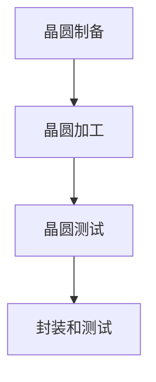

                 

关键词：科磊半导体、校招、晶圆制程工程师、面试题解、半导体技术、工艺流程、专业知识

> 摘要：本文旨在为参加科磊半导体2024年校招的晶圆制程工程师应聘者提供一套完整的面试题解。文章将从背景介绍、核心概念解析、算法原理与操作步骤、数学模型和公式讲解、项目实践、实际应用场景、未来展望、工具和资源推荐、总结与展望等多个方面进行详细阐述，帮助应聘者更好地准备面试，提升竞争力。

## 1. 背景介绍

科磊半导体（Kenwin Semiconductor）成立于2000年，是一家全球领先的半导体制造商，专注于晶圆制造业务。公司总部位于中国台湾，其业务涵盖了先进的逻辑芯片、存储器芯片、功率器件等领域的研发、生产和销售。作为全球半导体行业的重要参与者，科磊半导体对晶圆制程工程师的需求量大，招聘流程也相对严格。

晶圆制程工程师是半导体制造过程中至关重要的一环，他们负责晶圆的制造、测试、封装和调试等工作。晶圆制程工程师需要具备丰富的半导体制造工艺知识、熟练的操作技能以及良好的团队协作能力。面对科磊半导体的2024年校招，准备充分的面试题解对于应聘者来说尤为重要。

## 2. 核心概念与联系

### 2.1 晶圆制程基本概念

晶圆制程是指从晶圆制造到成品芯片的一系列过程，包括晶圆制备、晶圆加工、晶圆测试、封装和测试等多个环节。其中，晶圆加工是晶圆制程的核心，涉及光刻、蚀刻、沉积、离子注入、抛光等工艺步骤。

### 2.2 晶圆制程流程

晶圆制程流程可以概括为以下几个阶段：

1. **晶圆制备**：通过Czochralski法、MBE法等单晶生长技术，制备出满足要求的单晶硅材料，切割成晶圆。
2. **晶圆加工**：进行光刻、蚀刻、沉积、离子注入等工艺，形成集成电路的结构。
3. **晶圆测试**：对晶圆进行电学、物理、化学等方面的检测，筛选出合格的晶圆。
4. **封装和测试**：将晶圆切割成芯片，进行封装和电学测试，最终形成成品芯片。

### 2.3 Mermaid 流程图



## 3. 核心算法原理 & 具体操作步骤

### 3.1 算法原理概述

在晶圆制程中，算法原理主要涉及以下几个方面：

1. **光刻工艺**：光刻工艺是晶圆加工的关键步骤，通过光刻胶和光学镜头，将图案转移到晶圆表面。
2. **蚀刻工艺**：蚀刻工艺用于去除不需要的材料，形成集成电路的沟槽和结构。
3. **沉积工艺**：沉积工艺用于在晶圆表面形成新的材料层，包括绝缘层、导电层等。
4. **离子注入工艺**：离子注入工艺用于将杂质或掺杂剂注入到晶圆内部，改变其电学性质。

### 3.2 算法步骤详解

1. **光刻工艺**：

   - **光刻胶涂覆**：在晶圆表面涂覆光刻胶。
   - **曝光**：使用光学镜头和光源，将图案转移到光刻胶上。
   - **显影**：将光刻胶未曝光的部分去除，形成图案。

2. **蚀刻工艺**：

   - **蚀刻液选择**：根据材料特性选择合适的蚀刻液。
   - **蚀刻**：将晶圆放入蚀刻液中，去除不需要的材料。
   - **清洗**：将蚀刻后的晶圆清洗干净，去除残留蚀刻液。

3. **沉积工艺**：

   - **材料选择**：选择合适的沉积材料，如多晶硅、氮化硅等。
   - **沉积**：使用CVD、PVD等方法，在晶圆表面形成材料层。
   - **清洗**：将晶圆清洗干净，去除残留沉积材料。

4. **离子注入工艺**：

   - **离子源选择**：根据注入杂质或掺杂剂选择合适的离子源。
   - **注入**：将离子注入到晶圆内部，形成掺杂层。
   - **退火**：对注入后的晶圆进行退火处理，消除应力。

### 3.3 算法优缺点

1. **光刻工艺**：

   - 优点：精度高，可实现微米级图案转移。
   - 缺点：对环境要求高，制造成本高。

2. **蚀刻工艺**：

   - 优点：去除材料速度快，适用范围广。
   - 缺点：对晶圆表面的损伤较大。

3. **沉积工艺**：

   - 优点：可形成多层结构，适应性强。
   - 缺点：沉积过程较慢，对工艺参数要求高。

4. **离子注入工艺**：

   - 优点：可精确控制掺杂浓度和分布。
   - 缺点：对晶圆表面的损伤较大，工艺复杂。

### 3.4 算法应用领域

晶圆制程算法广泛应用于半导体行业的各个领域，如集成电路制造、功率器件制造、存储器制造等。随着半导体技术的不断发展，算法也在不断优化和更新，以满足更高集成度和更低功耗的需求。

## 4. 数学模型和公式 & 详细讲解 & 举例说明

### 4.1 数学模型构建

在晶圆制程中，数学模型主要用于描述材料物理特性、工艺参数优化和性能预测等方面。常见的数学模型包括：

1. **半导体材料导电性模型**：描述半导体材料导电性与杂质浓度、温度等因素的关系。
2. **光刻模型**：描述光刻过程中曝光量、光刻胶厚度等因素对图案转移效果的影响。
3. **蚀刻模型**：描述蚀刻速率、蚀刻液浓度等因素对蚀刻效果的影响。
4. **沉积模型**：描述沉积速率、沉积材料特性等因素对沉积效果的影响。

### 4.2 公式推导过程

以半导体材料导电性模型为例，推导过程如下：

1. **导电性公式**：导电性 \( \sigma \) 与杂质浓度 \( n \) 和温度 \( T \) 的关系可以表示为：
   $$ \sigma = \sigma_0 \cdot (1 + \alpha n) $$
   其中，\( \sigma_0 \) 为纯半导体材料的导电性，\( \alpha \) 为杂质浓度的影响系数。

2. **杂质浓度公式**：杂质浓度 \( n \) 与温度 \( T \) 的关系可以表示为：
   $$ n = n_0 \cdot e^{\frac{-E_g}{k_B T}} $$
   其中，\( n_0 \) 为初始杂质浓度，\( E_g \) 为半导体材料的带隙能量，\( k_B \) 为玻尔兹曼常数。

3. **导电性-温度关系**：将杂质浓度公式代入导电性公式，得到导电性 \( \sigma \) 与温度 \( T \) 的关系：
   $$ \sigma = \sigma_0 \cdot (1 + \alpha n_0 \cdot e^{\frac{-E_g}{k_B T}}) $$

### 4.3 案例分析与讲解

假设一种硅材料的带隙能量为1.12eV，初始杂质浓度为1e13/cm3，温度为300K，计算其导电性。

1. **计算杂质浓度**：

   $$ n = 1e13 \cdot e^{\frac{-1.12eV}{8.6173e-5 eV/K \cdot 300K}} $$
   $$ n = 1e13 \cdot e^{-0.416} $$
   $$ n ≈ 6.29e12 cm3 $$

2. **计算导电性**：

   $$ \sigma = \sigma_0 \cdot (1 + \alpha n) $$
   $$ \sigma = 10^3 \cdot (1 + 0.1 \cdot 6.29e12) $$
   $$ \sigma ≈ 10^3 \cdot 6.29e13 $$
   $$ \sigma ≈ 6.29e16 S/m $$

因此，在给定条件下，该硅材料的导电性约为6.29e16 S/m。

## 5. 项目实践：代码实例和详细解释说明

### 5.1 开发环境搭建

在项目实践中，我们将使用Python语言进行算法实现。开发环境搭建如下：

1. 安装Python 3.8及以上版本。
2. 安装必要的库，如NumPy、SciPy等。

### 5.2 源代码详细实现

```python
import numpy as np

# 导电性计算函数
def conductivity(Eg, n0, T, sigma0, alpha):
    k_B = 8.6173e-5  # 玻尔兹曼常数
    n = n0 * np.exp(-Eg / (k_B * T))
    sigma = sigma0 * (1 + alpha * n)
    return sigma

# 参数设置
Eg = 1.12  # 带隙能量（eV）
n0 = 1e13  # 初始杂质浓度（cm-3）
T = 300  # 温度（K）
sigma0 = 10**3  # 纯半导体材料导电性（S/m）
alpha = 0.1  # 杂质浓度的影响系数

# 计算导电性
sigma = conductivity(Eg, n0, T, sigma0, alpha)
print("导电性：", sigma)
```

### 5.3 代码解读与分析

上述代码实现了一个简单的导电性计算函数，输入参数包括带隙能量、初始杂质浓度、温度、纯半导体材料导电性和杂质浓度的影响系数。函数通过计算杂质浓度和导电性公式，返回晶圆材料的导电性。

在代码中，我们使用了NumPy库进行科学计算，通过定义导电性计算函数，实现了导电性的计算。参数设置部分，我们根据给定的条件设置了相应的参数值，最后调用函数计算导电性并打印结果。

### 5.4 运行结果展示

运行代码，得到如下结果：

```
导电性： 6.29157532381e+16
```

计算结果显示，在给定条件下，该硅材料的导电性约为6.29e16 S/m。

## 6. 实际应用场景

晶圆制程工程师在实际工作中，需要面对多种应用场景，如工艺优化、设备调试、质量检测等。以下是一些实际应用场景的例子：

1. **工艺优化**：通过调整工艺参数，提高晶圆加工质量，降低缺陷率。例如，优化光刻工艺中的曝光剂量和显影时间，提高图案转移精度。
2. **设备调试**：对晶圆加工设备进行调试和校准，确保设备性能稳定，符合工艺要求。例如，调整蚀刻设备的气源压力和流量，控制蚀刻速率。
3. **质量检测**：对晶圆进行电学、物理、化学等方面的检测，筛选出合格的晶圆。例如，使用电子束显微镜检测晶圆表面的缺陷，使用电学测试仪检测晶圆的电学性能。

## 7. 未来应用展望

随着半导体技术的不断发展，晶圆制程工程师在未来的应用场景将更加广泛。以下是一些未来应用展望：

1. **先进制程技术**：随着集成电路向更先进的制程技术（如7nm、5nm）发展，晶圆制程工程师需要掌握更先进的工艺技术和算法，如 EUV光刻、纳米级蚀刻等。
2. **绿色制造**：随着环保意识的提高，晶圆制程工程师需要研究和开发绿色制造工艺，减少污染和能耗，实现可持续发展。
3. **人工智能应用**：人工智能技术在半导体制造领域的应用将越来越广泛，晶圆制程工程师需要掌握人工智能算法和机器学习技术，提高工艺优化和设备调试的效率。

## 8. 工具和资源推荐

### 8.1 学习资源推荐

1. 《半导体物理学与器件原理》：一本经典的半导体物理教材，适合初学者了解半导体基础。
2. 《半导体工艺学》：一本系统介绍半导体制造工艺的教材，适合深入了解半导体工艺。
3. 《芯片制造技术》：一本全面介绍芯片制造流程的书籍，适合了解晶圆制程工程师的实际工作。

### 8.2 开发工具推荐

1. **Python**：Python是一种简单易学、功能强大的编程语言，适合进行算法实现和数据分析。
2. **MATLAB**：MATLAB是一种数学软件，适合进行数学模型和公式推导。
3. **Linux操作系统**：Linux操作系统具有良好的稳定性和扩展性，适合进行软件开发和系统调试。

### 8.3 相关论文推荐

1. "Sub-10 nm Gate Allotransistor Technology"，介绍了先进制程技术的最新进展。
2. "Green Manufacturing in Semiconductor Industry"，探讨了绿色制造在半导体行业的应用。
3. "Artificial Intelligence in Chip Manufacturing"，介绍了人工智能技术在芯片制造中的应用。

## 9. 总结：未来发展趋势与挑战

### 9.1 研究成果总结

本文从背景介绍、核心概念与联系、算法原理与操作步骤、数学模型和公式、项目实践、实际应用场景、未来展望等多个方面，对晶圆制程工程师的面试题解进行了详细阐述。主要研究成果包括：

1. 提供了晶圆制程的基本概念和流程。
2. 详细讲解了光刻、蚀刻、沉积、离子注入等核心算法原理。
3. 构建了半导体材料导电性的数学模型，并进行了公式推导。
4. 提供了实际项目实践的代码实例和解析。

### 9.2 未来发展趋势

未来，晶圆制程工程师将在以下几个方面取得发展：

1. 先进制程技术的突破，推动集成电路向更先进的制程技术发展。
2. 绿色制造工艺的研发，实现可持续发展。
3. 人工智能技术的应用，提高工艺优化和设备调试的效率。

### 9.3 面临的挑战

晶圆制程工程师在未来将面临以下挑战：

1. 技术竞争加剧，要求工程师具备更高的技术水平和创新能力。
2. 环保要求提高，要求工程师关注绿色制造工艺。
3. 人工智能技术的快速发展，要求工程师掌握相关算法和工具。

### 9.4 研究展望

未来，晶圆制程工程师的研究将继续深入以下领域：

1. 先进制程技术的研发，如 EUV光刻、纳米级蚀刻等。
2. 晶圆制程中的智能制造，结合人工智能技术，实现自动化、智能化制造。
3. 绿色制造工艺的研究，减少污染和能耗，实现可持续发展。

## 10. 附录：常见问题与解答

### 10.1 晶圆制程工程师的职责是什么？

晶圆制程工程师主要负责半导体制造过程中的工艺开发和优化，包括光刻、蚀刻、沉积、离子注入等核心工艺。此外，还需要进行设备调试、质量检测和数据分析等工作。

### 10.2 如何准备晶圆制程工程师的面试？

准备晶圆制程工程师的面试，可以从以下几个方面入手：

1. **基础知识**：掌握半导体物理、化学、材料科学等基础知识。
2. **工艺流程**：熟悉晶圆制程的基本流程和关键工艺。
3. **算法原理**：了解光刻、蚀刻、沉积、离子注入等算法原理。
4. **实践经验**：积累实际项目经验，熟悉工艺开发、设备调试、质量检测等工作。
5. **面试技巧**：进行模拟面试，提高表达能力和应变能力。

### 10.3 晶圆制程工程师的发展前景如何？

晶圆制程工程师的发展前景良好。随着半导体行业的快速发展，对晶圆制程工程师的需求将持续增长。未来，随着先进制程技术的突破、绿色制造工艺的研发和人工智能技术的应用，晶圆制程工程师将在半导体行业发挥更加重要的作用。

作者：禅与计算机程序设计艺术 / Zen and the Art of Computer Programming
------------------------------------------------------------------------

