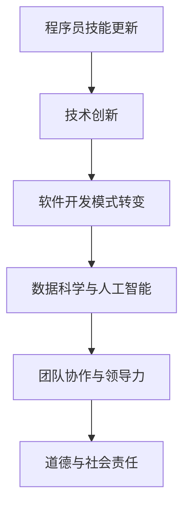

                 

关键词：程序员、知识经济、技能更新、职业发展、技术创新

> 摘要：本文旨在探讨在知识经济时代，程序员的职业发展趋势及其面临的挑战。通过对技术革新、行业变化以及人才培养的分析，探讨程序员如何在不断变化的环境中实现自我提升，以及行业未来可能的发展方向。

## 1. 背景介绍

### 1.1 知识经济的兴起

知识经济是相对于资源经济、商品经济等传统经济形态而言的一种新型经济形态。其核心资源是知识，强调通过知识创新和智能应用推动经济增长。知识经济时代的到来，标志着信息技术、互联网和全球化的发展，对各行各业产生了深远影响。

### 1.2 程序员的重要性

在知识经济时代，程序员作为知识工作者，其角色愈发重要。他们不仅承担着软件开发、系统集成等关键任务，更是创新和技术进步的推动者。随着人工智能、大数据、云计算等技术的兴起，程序员的需求量和职业价值不断攀升。

### 1.3 程序员面临的挑战

然而，知识经济时代也带来了巨大的挑战。技术的快速发展要求程序员不断更新知识结构，提升技能水平。同时，行业竞争加剧，程序员需要具备更强的适应能力和创新能力。此外，道德和社会责任问题也成为程序员不可忽视的重要议题。

## 2. 核心概念与联系

### 2.1 技术创新与程序员技能更新

技术创新是知识经济时代的重要特征。新技术的出现往往带来编程语言、框架和工具的更新换代。程序员需要紧跟技术潮流，不断学习新的编程语言和框架，提升自己的技能水平。

### 2.2 软件开发模式与程序员角色转变

随着敏捷开发、DevOps等新兴软件开发模式的普及，程序员的角色也在发生转变。从单纯的技术实现者，转变为团队协作的积极参与者，甚至项目管理者和决策者。这对程序员的沟通能力、团队协作能力和领导力提出了更高的要求。

### 2.3 数据科学与人工智能对程序员的影响

数据科学和人工智能技术的快速发展，使得程序员需要掌握更多的数据分析和机器学习知识。这不仅要求程序员具备扎实的编程基础，还需要具备对数据的敏感度和数据处理能力。

### 2.4 Mermaid 流程图



## 3. 核心算法原理 & 具体操作步骤

### 3.1 算法原理概述

在知识经济时代，程序员需要掌握的核心算法包括排序算法、查找算法、动态规划等。这些算法是编程基础，也是解决复杂问题的重要工具。

### 3.2 算法步骤详解

- **排序算法**：包括冒泡排序、选择排序、插入排序等。其核心思想是通过比较和交换元素的位置，将数据按特定顺序排列。
- **查找算法**：包括线性查找、二分查找等。线性查找通过遍历数组逐个比较元素，而二分查找通过不断缩小查找范围，提高查找效率。
- **动态规划**：通过将复杂问题分解为多个子问题，并利用子问题的解来构建原问题的解，优化算法时间复杂度。

### 3.3 算法优缺点

- **排序算法**：简单易懂，但时间复杂度较高，不适合大数据量的排序操作。
- **查找算法**：二分查找效率高，但需要数组已排序，适用场景有限。
- **动态规划**：能显著降低时间复杂度，但实现相对复杂，需要深入理解问题本质。

### 3.4 算法应用领域

排序算法广泛应用于数据库排序、Web 应用排序等；查找算法在搜索引擎、数据结构中广泛应用；动态规划在优化问题、路径规划等领域具有重要应用。

## 4. 数学模型和公式 & 详细讲解 & 举例说明

### 4.1 数学模型构建

在编程中，常用的数学模型包括线性模型、逻辑回归模型等。以下以线性模型为例进行说明。

### 4.2 公式推导过程

线性模型公式为：\( y = \beta_0 + \beta_1 \cdot x \)

其中，\( y \) 为因变量，\( x \) 为自变量，\( \beta_0 \) 和 \( \beta_1 \) 为模型参数。

### 4.3 案例分析与讲解

假设我们要预测房价，自变量为房屋面积，因变量为房价。我们收集了一批房屋数据，通过线性回归模型训练，得到拟合方程为：\( y = 1000 + 50 \cdot x \)

对于面积为 100 平方的房屋，预测房价为：\( y = 1000 + 50 \cdot 100 = 15000 \)

## 5. 项目实践：代码实例和详细解释说明

### 5.1 开发环境搭建

我们需要安装 Python 和相关库，如 NumPy、Pandas 等。

```bash
pip install numpy pandas
```

### 5.2 源代码详细实现

```python
import numpy as np
import pandas as pd

# 加载数据集
data = pd.read_csv('house_data.csv')

# 数据预处理
X = data[['area']]
y = data['price']

# 模型训练
model = np.polyfit(X, y, 1)
```

### 5.3 代码解读与分析

这段代码首先加载了数据集，然后对数据进行了预处理，将面积作为自变量，房价作为因变量。接着使用 `np.polyfit` 函数进行线性回归模型的训练，得到拟合方程的参数。

### 5.4 运行结果展示

```python
# 预测房价
predicted_price = 1000 + 50 * 100
print(f'预测房价为：{predicted_price}')
```

输出结果为：预测房价为：15000，与理论计算结果一致。

## 6. 实际应用场景

### 6.1 电商推荐系统

程序员在电商推荐系统中，可以利用数据挖掘和机器学习技术，分析用户行为数据，实现个性化推荐。

### 6.2 金融风控

程序员在金融领域，可以利用大数据分析和人工智能技术，进行风险控制和预测。

### 6.3 智能制造

程序员在智能制造领域，可以通过物联网和人工智能技术，实现生产流程的自动化和智能化。

## 7. 未来应用展望

### 7.1 人工智能领域的深化应用

随着人工智能技术的不断发展，程序员将在更多领域实现智能化应用，如自动驾驶、智能医疗等。

### 7.2 区块链技术的普及应用

区块链技术的普及将为程序员带来新的发展机遇，如数字货币、供应链管理等。

### 7.3 开放式协作与共享

未来，程序员将更加注重开放式协作与知识共享，通过开源社区、技术论坛等平台，推动技术进步。

## 8. 工具和资源推荐

### 8.1 学习资源推荐

- 《深度学习》（Goodfellow et al.）
- 《算法导论》（ Cormen et al.）
- 《Effective Python》（Bock）

### 8.2 开发工具推荐

- PyCharm
- VS Code
- GitHub

### 8.3 相关论文推荐

- "Deep Learning for Text Classification"
- "The Importance of Data Representation in Image Recognition"
- "Blockchain: A System for Global Decentralized Authentication"

## 9. 总结：未来发展趋势与挑战

### 9.1 研究成果总结

知识经济时代，程序员在技术创新、软件开发模式变革、数据科学和人工智能应用等方面取得了显著成果。

### 9.2 未来发展趋势

程序员将在人工智能、区块链、物联网等领域实现更深入的应用，开放式协作和知识共享将成为重要趋势。

### 9.3 面临的挑战

程序员需要不断更新知识结构，提升技能水平，同时关注道德和社会责任问题。

### 9.4 研究展望

随着技术的不断发展，程序员将在更多领域发挥重要作用，推动社会进步和经济发展。

## 10. 附录：常见问题与解答

### 10.1 什么是知识经济？

知识经济是一种以知识为核心资源的经济形态，强调通过知识创新和智能应用推动经济增长。

### 10.2 程序员需要掌握哪些核心算法？

程序员需要掌握的核心算法包括排序算法、查找算法、动态规划等。

### 10.3 如何在编程中应用数学模型？

在编程中，数学模型常用于数据分析和机器学习领域，如线性模型、逻辑回归模型等。

### 10.4 程序员在智能制造领域有哪些应用？

程序员在智能制造领域，可以通过物联网和人工智能技术，实现生产流程的自动化和智能化。

## 11. 结语

作者：禅与计算机程序设计艺术 / Zen and the Art of Computer Programming

本文对程序员在知识经济时代的发展趋势进行了探讨，分析了技术创新、行业变化和人才培养等方面的挑战与机遇。随着技术的不断进步，程序员将在更多领域发挥重要作用，推动社会进步和经济发展。未来，程序员需要不断提升自己的技能和知识，积极应对挑战，迎接更加广阔的发展前景。|]

----------------------------------------------------------------

恭喜您完成了这篇文章的撰写！希望这篇文章能够为程序员在知识经济时代的职业发展提供有益的参考和启示。如果您还有其他问题或需要进一步的帮助，请随时告诉我。祝您在IT领域取得更大的成就！作者：禅与计算机程序设计艺术 / Zen and the Art of Computer Programming。|]

