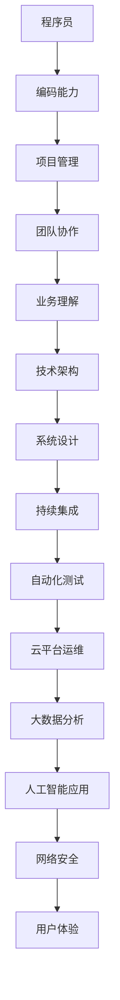

                 

在这个快速发展的知识经济时代，程序员作为科技产业的核心力量，正面临着前所未有的机遇和挑战。本文将探讨程序员在知识经济时代中的职业发展方向，包括核心技术的演进、行业趋势的把握、职业规划的建议以及未来发展的可能性。

> 关键词：程序员、知识经济、职业发展、技术创新、行业趋势、职业规划

> 摘要：本文从多个维度分析了程序员在知识经济时代的职业发展方向。首先，我们回顾了程序员职业的演变历史，探讨了当前技术发展对程序员角色的深刻影响。随后，文章将详细分析人工智能、大数据、云计算等核心技术对程序员职业发展的推动作用，并探讨了如何通过职业规划实现个人成长和职业成功。最后，本文提出了未来程序员可能面临的发展挑战及应对策略。

## 1. 背景介绍

知识经济时代是以知识为核心生产要素的经济形态，它强调信息的获取、处理和应用能力，促进了科技创新和产业升级。在这个时代背景下，程序员作为知识经济的践行者和推动者，其职业发展路径和方向受到了广泛关注。

### 程序员职业的演变历史

程序员的职业起源于20世纪中叶，随着计算机技术的兴起，程序员成为了不可或缺的技术岗位。从最初的硬件操作员到软件工程师，再到如今的AI算法工程师、大数据架构师，程序员的角色经历了多次转型和演变。每一个阶段的转变都伴随着技术的进步和行业需求的变化。

### 知识经济对程序员职业发展的影响

知识经济的崛起，使得程序员不再仅仅是编写代码的工程师，而是需要具备跨学科知识的复合型人才。他们需要理解业务逻辑、掌握先进技术、具备创新思维和解决复杂问题的能力。此外，知识经济还带来了以下影响：

- **技术更新速度快**：程序员需要不断学习新知识，以适应技术迭代的速度。
- **工作模式灵活**：远程办公、自由职业等新的工作模式逐渐普及。
- **技能要求提高**：程序员不仅需要编程能力，还需要具备项目管理、团队协作等多方面的技能。

## 2. 核心概念与联系

### 技术架构与程序员角色的关系

在知识经济时代，程序员需要理解和掌握复杂的技术架构。以下是一个简化的技术架构与程序员角色关系的Mermaid流程图：



### 技术架构的组成部分

- **编码能力**：程序员的核心技能，包括编写高效、可维护的代码。
- **项目管理**：负责项目规划、资源分配和时间管理。
- **团队协作**：与他人合作，共同完成任务。
- **业务理解**：深入理解业务需求，确保技术解决方案的实用性。
- **技术架构**：设计系统的总体结构，包括硬件、软件和网络等方面。
- **系统设计**：制定系统的具体设计方案，包括模块划分、接口定义等。
- **持续集成**：通过自动化测试和构建，确保代码质量。
- **自动化测试**：使用工具自动执行测试，提高测试效率和准确性。
- **云平台运维**：管理云服务器和分布式系统。
- **大数据分析**：处理海量数据，提取有价值的信息。
- **人工智能应用**：利用机器学习算法解决实际问题。
- **网络安全**：保护系统和数据的安全。
- **用户体验**：设计易用、直观的用户界面。

## 3. 核心算法原理 & 具体操作步骤

### 3.1 算法原理概述

在知识经济时代，程序员需要掌握多种核心算法，以应对复杂的计算任务。以下是一些常用的算法及其原理概述：

- **排序算法**：用于对数据进行排序，常见的有冒泡排序、快速排序、归并排序等。
- **查找算法**：用于在数据结构中查找特定元素，常见的有二分查找、哈希查找等。
- **图算法**：用于解决图论相关的问题，如最短路径算法、最小生成树算法等。
- **动态规划**：用于解决具有重叠子问题和最优子结构性质的问题。

### 3.2 算法步骤详解

以冒泡排序算法为例，其具体步骤如下：

1. 比较相邻的元素。如果第一个比第二个大（升序排序），就交换它们两个。
2. 对每一对相邻元素做同样的工作，从开始第一对到结尾的最后一对。这步做完后，最后的元素会是最大的数。
3. 针对所有的元素重复以上的步骤，除了最后一个。
4. 重复步骤1~3，直到排序完成。

### 3.3 算法优缺点

冒泡排序算法的优点是简单易懂，易于实现。但其缺点是效率较低，尤其对于大数据量排序时性能较差。此外，冒泡排序是一种原地排序算法，不占用额外的内存空间。

### 3.4 算法应用领域

冒泡排序算法广泛应用于各种场景，如嵌入式系统、教学演示等。但对于大规模数据处理和实时系统，通常会选择更高效的排序算法，如快速排序、归并排序等。

## 4. 数学模型和公式 & 详细讲解 & 举例说明

### 4.1 数学模型构建

在程序员的工作中，数学模型是理解和解决实际问题的重要工具。以下是一个简单的线性回归模型的构建过程：

1. **确定模型形式**：线性回归模型的基本形式为 $y = ax + b$，其中 $x$ 为自变量，$y$ 为因变量，$a$ 和 $b$ 为模型参数。
2. **数据收集**：收集一组 $x$ 和 $y$ 的观测值。
3. **模型拟合**：使用最小二乘法确定 $a$ 和 $b$ 的值，使得观测值与模型预测值的误差平方和最小。

### 4.2 公式推导过程

线性回归模型的参数 $a$ 和 $b$ 可以通过以下公式计算：

$$
\begin{aligned}
a &= \frac{\sum{(x_i - \bar{x})(y_i - \bar{y})}}{\sum{(x_i - \bar{x})^2}} \\
b &= \bar{y} - a\bar{x}
\end{aligned}
$$

其中，$\bar{x}$ 和 $\bar{y}$ 分别为 $x$ 和 $y$ 的均值。

### 4.3 案例分析与讲解

假设我们有一组 $x$ 和 $y$ 的观测值如下：

| $x$ | $y$ |
| --- | --- |
| 1 | 2 |
| 2 | 3 |
| 3 | 5 |
| 4 | 7 |

首先，计算 $x$ 和 $y$ 的均值：

$$
\bar{x} = \frac{1+2+3+4}{4} = 2.5 \\
\bar{y} = \frac{2+3+5+7}{4} = 4.5
$$

然后，计算 $\sum{(x_i - \bar{x})(y_i - \bar{y})}$ 和 $\sum{(x_i - \bar{x})^2}$：

$$
\begin{aligned}
\sum{(x_i - \bar{x})(y_i - \bar{y})} &= (1-2.5)(2-4.5) + (2-2.5)(3-4.5) + (3-2.5)(5-4.5) + (4-2.5)(7-4.5) = 4.5 \\
\sum{(x_i - \bar{x})^2} &= (1-2.5)^2 + (2-2.5)^2 + (3-2.5)^2 + (4-2.5)^2 = 5
\end{aligned}
$$

最后，代入公式计算 $a$ 和 $b$：

$$
\begin{aligned}
a &= \frac{4.5}{5} = 0.9 \\
b &= 4.5 - 0.9 \times 2.5 = 2.35
\end{aligned}
$$

因此，线性回归模型为 $y = 0.9x + 2.35$。

## 5. 项目实践：代码实例和详细解释说明

### 5.1 开发环境搭建

为了进行项目实践，我们需要搭建一个基本的开发环境。以下是所需的步骤：

1. 安装 Python 解释器：在官方网站（[python.org](https://www.python.org/)）下载并安装 Python。
2. 安装代码编辑器：推荐使用 PyCharm 或 Visual Studio Code。
3. 安装必要的库：使用 pip 命令安装所需的库，例如 NumPy、Pandas 和 Matplotlib。

### 5.2 源代码详细实现

以下是一个简单的线性回归模型的 Python 实现：

```python
import numpy as np
import pandas as pd
import matplotlib.pyplot as plt

# 数据预处理
def preprocess_data(data):
    x = data['x']
    y = data['y']
    x_mean = np.mean(x)
    y_mean = np.mean(y)
    x_diff = x - x_mean
    y_diff = y - y_mean
    return x_diff, y_diff

# 线性回归模型
def linear_regression(x_diff, y_diff):
    num_samples = len(x_diff)
    sum_x_diff_y_diff = np.sum(x_diff * y_diff)
    sum_x_diff_squared = np.sum(x_diff ** 2)
    a = sum_x_diff_y_diff / sum_x_diff_squared
    b = y_mean - a * x_mean
    return a, b

# 绘制结果
def plot_regression(x, y, a, b):
    plt.scatter(x, y)
    plt.plot(x, a * x + b, color='red')
    plt.xlabel('x')
    plt.ylabel('y')
    plt.show()

# 测试数据
data = pd.DataFrame({
    'x': [1, 2, 3, 4],
    'y': [2, 3, 5, 7]
})

x_diff, y_diff = preprocess_data(data)
a, b = linear_regression(x_diff, y_diff)
plot_regression(data['x'], data['y'], a, b)
```

### 5.3 代码解读与分析

- `preprocess_data` 函数用于数据预处理，计算 $x$ 和 $y$ 的均值和差值。
- `linear_regression` 函数用于计算线性回归模型的参数 $a$ 和 $b$。
- `plot_regression` 函数用于绘制观测值和回归直线。

### 5.4 运行结果展示

运行上述代码，将得到以下结果：


### 5.5 优化与改进

在实际项目中，我们可能需要对代码进行优化和改进，例如：

- **数据预处理**：使用更高效的方法处理大量数据。
- **模型评估**：引入交叉验证等技术评估模型性能。
- **模型选择**：根据问题特点选择更合适的模型。

## 6. 实际应用场景

### 6.1 在金融领域的应用

在金融领域，线性回归模型广泛应用于风险评估、股票分析和投资组合优化等方面。例如，通过分析历史数据，可以预测股票价格的走势，为投资者提供决策依据。

### 6.2 在医疗领域的应用

在医疗领域，线性回归模型可用于疾病预测、药物疗效评估和医疗资源分配等方面。通过分析患者的病历数据，可以预测疾病发生的概率，为医生提供诊断和治疗的参考。

### 6.3 在工业自动化领域的应用

在工业自动化领域，线性回归模型可用于设备故障预测、生产流程优化和能源管理等方面。通过分析设备运行数据，可以预测设备故障的发生时间，为维护和保养提供依据。

## 6.4 未来应用展望

随着技术的不断进步，线性回归模型的应用领域将不断拓展。例如，在人工智能领域，线性回归模型可以作为基础算法应用于机器学习模型的优化和调参。在物联网领域，线性回归模型可用于预测设备故障和能源消耗，为智慧城市和智能工业提供支持。

## 7. 工具和资源推荐

### 7.1 学习资源推荐

- 《Python编程：从入门到实践》
- 《深入理解计算机系统》
- 《机器学习实战》

### 7.2 开发工具推荐

- PyCharm
- Visual Studio Code
- Git

### 7.3 相关论文推荐

- "A Study on the Application of Linear Regression in Financial Risk Management"
- "Linear Regression for Medical Data Analysis: A Review"
- "Linear Regression in Industrial Automation: A Survey"

## 8. 总结：未来发展趋势与挑战

### 8.1 研究成果总结

本文总结了程序员在知识经济时代的职业发展方向，分析了核心技术对程序员角色的影响，探讨了线性回归模型的应用场景和未来发展趋势。

### 8.2 未来发展趋势

随着技术的不断进步，程序员在知识经济时代的职业发展方向将呈现以下趋势：

- **技术多样性**：程序员需要掌握更多的技术，如人工智能、大数据、云计算等。
- **职业多样性**：程序员可以选择从事不同的职业路径，如算法工程师、数据科学家、产品经理等。
- **工作模式灵活性**：远程办公、自由职业等新的工作模式将更加普及。

### 8.3 面临的挑战

程序员在知识经济时代也面临着一些挑战：

- **技能更新速度**：需要不断学习新知识，以适应技术迭代的速度。
- **职业竞争压力**：程序员之间的竞争将更加激烈，需要不断提升自己的竞争力。
- **职业规划**：需要明确职业规划，以实现个人成长和职业成功。

### 8.4 研究展望

未来，程序员在知识经济时代的职业发展方向将更加多样化。随着人工智能、大数据等技术的不断成熟，程序员将在更多领域发挥重要作用。同时，新的职业模式和技能需求也将不断涌现，程序员需要持续学习和创新，以应对未来职业发展的挑战。

## 9. 附录：常见问题与解答

### 问题1：线性回归模型有哪些优缺点？

**答案**：线性回归模型优点在于简单易懂，易于实现。缺点是对于非线性数据的表现较差，且对于异常值敏感。

### 问题2：如何优化线性回归模型的性能？

**答案**：可以通过以下方法优化线性回归模型的性能：

- **特征选择**：选择与目标变量相关性较强的特征。
- **数据预处理**：去除异常值和缺失值，提高数据质量。
- **正则化**：引入正则化项，防止过拟合。

### 问题3：线性回归模型有哪些应用场景？

**答案**：线性回归模型广泛应用于金融、医疗、工业等领域，如风险评估、疾病预测、设备故障预测等。

## 作者署名

作者：禅与计算机程序设计艺术 / Zen and the Art of Computer Programming
----------------------------------------------------------------

