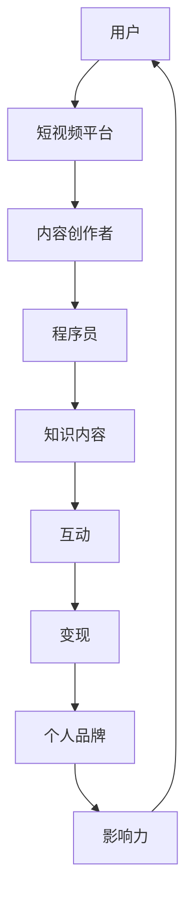
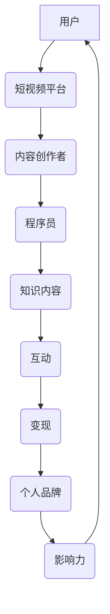

                 

### 引言 Introduction

在数字时代，短视频平台已经成为人们获取信息和娱乐的主要渠道之一。从抖音、快手到B站，这些平台吸引了海量的用户，每天产生海量的内容。而程序员，作为新时代的技术工作者，他们拥有独特的知识和技能，这使他们在知识付费领域有着巨大的潜力。本文将探讨程序员如何利用短视频平台进行知识付费，帮助他们在数字时代实现个人品牌价值和收入增长。

### 文章关键词 Keywords

- 短视频平台
- 程序员
- 知识付费
- 个人品牌
- 数字营销

### 摘要 Summary

本文旨在探讨程序员如何通过短视频平台进行知识付费，实现个人品牌价值的提升和收入的增长。首先，我们将介绍短视频平台的发展现状和特点。接着，分析程序员在这一领域的优势和面临的挑战。随后，详细探讨程序员如何制作高质量的视频内容，以及如何利用平台工具进行营销和推广。最后，我们还将讨论知识付费的未来趋势和程序员应如何应对这些趋势。

## 1. 背景介绍

短视频平台的发展始于2016年左右，随着移动互联网的普及和用户对于碎片化时间内容需求的增加，短视频迅速崛起。抖音、快手、B站等平台在短短几年内吸引了数亿用户，成为人们日常生活中不可或缺的一部分。

短视频平台的魅力在于其独特的传播方式和强大的社交属性。用户可以通过点赞、评论、分享等方式参与到内容的传播中，形成一种“病毒式”的传播效果。此外，短视频平台还拥有丰富的算法推荐系统，能够根据用户的兴趣和观看历史进行个性化推荐，从而提高用户的粘性和活跃度。

对于程序员而言，短视频平台不仅是一个展示个人技能和知识的舞台，也是一个实现知识付费的重要渠道。程序员具备扎实的计算机科学知识和编程技能，这些知识对于许多非专业人士来说具有很高的价值。通过短视频平台，程序员可以分享自己的经验和见解，吸引更多的关注和粉丝，从而实现知识的变现。

### 1.1 短视频平台的发展现状

短视频平台的发展速度令人惊叹。据统计，截至2021年底，抖音的月活跃用户已超过6亿，快手也达到了5亿。这些平台不仅在国内取得了巨大的成功，还开始向海外市场扩张，吸引了大量的国际用户。

短视频平台的内容形式也非常多样化，从搞笑、美食、旅行到科技、教育、编程等，几乎涵盖了所有领域。程序员在这一领域有着独特的优势，他们可以制作关于编程语言、算法、数据结构等知识性的内容，为观众提供有价值的信息。

短视频平台的用户群体也非常广泛，涵盖了不同年龄、性别和职业的人群。这使得程序员可以通过短视频平台接触到更多的潜在客户，扩大自己的受众范围。

### 1.2 程序员在知识付费领域的优势

程序员在知识付费领域具有以下几大优势：

1. **专业技能**：程序员拥有扎实的计算机科学知识和编程技能，这些知识对于许多人来说非常宝贵。通过短视频平台，程序员可以将这些知识以更生动、易懂的方式传授给观众。

2. **内容创新**：程序员具备独特的视角和思维方式，这使得他们能够创作出新颖、有趣的知识内容，吸引更多观众的注意。

3. **互动性**：短视频平台的互动性使得程序员可以与观众实时互动，解答观众的问题，提高观众的参与度和满意度。

4. **变现能力**：通过短视频平台，程序员可以轻松实现知识的变现，如开设付费专栏、推出付费课程等，从而实现收入的增长。

### 1.3 程序员面临的挑战

虽然短视频平台为程序员提供了广阔的发展空间，但程序员在知识付费领域也面临一些挑战：

1. **内容竞争**：随着越来越多的程序员加入知识付费的行列，内容竞争日益激烈。程序员需要不断提升自己的内容质量和创新能力，才能在竞争中脱颖而出。

2. **版权问题**：在制作短视频时，程序员需要确保自己使用的所有内容（如代码、图表、音乐等）都不侵犯他人的版权。否则，可能会面临法律风险。

3. **时间管理**：制作高质量的视频内容需要耗费大量的时间和精力。程序员需要合理安排时间，确保在完成日常工作的同时，还能制作出高质量的视频。

4. **推广难度**：尽管短视频平台拥有海量的用户，但如何有效地将这些用户转化为自己的粉丝和客户，仍是一个挑战。程序员需要学会运用各种营销手段，提高自己的曝光度和影响力。

### 2. 核心概念与联系

在探讨程序员如何利用短视频平台进行知识付费之前，我们需要了解一些核心概念和它们之间的联系。以下是一个简化的Mermaid流程图，用于描述这些概念：



在这个流程图中，用户是短视频平台的核心，他们是内容的消费者。内容创作者包括各类创作者，如短视频创作者、博主、专家等，其中程序员是其中一种特殊的内容创作者。程序员创作知识内容，并通过互动和变现实现个人品牌的建设和影响力的提升。

#### 2.1 核心概念原理

1. **用户**：短视频平台的用户是内容的主要消费者。他们的需求和兴趣决定了平台的内容走向。

2. **短视频平台**：短视频平台是连接用户和内容创作者的桥梁。平台通过算法推荐、用户互动等功能，提高用户粘性和满意度。

3. **内容创作者**：内容创作者是短视频平台的重要组成部分。他们通过创作内容，吸引用户的关注，并实现个人价值的提升。

4. **程序员**：程序员是内容创作者的一种，他们利用自己的专业技能和知识，创作出有价值的知识内容。

5. **知识内容**：知识内容是程序员创作的核心。这些内容可以是编程技巧、算法讲解、技术趋势等，对观众具有很高的实用价值。

6. **互动**：互动是短视频平台的重要特征。程序员可以通过评论、弹幕、直播等方式与观众互动，提高观众的参与度和满意度。

7. **变现**：变现是程序员通过短视频平台实现收入的主要途径。他们可以通过开设付费专栏、推出付费课程、直播带货等方式，将知识变现。

8. **个人品牌**：个人品牌是程序员在短视频平台上的形象和口碑。良好的个人品牌有助于吸引更多的粉丝和客户，提高自己的影响力。

9. **影响力**：影响力是程序员在短视频平台上的重要指标。通过高质量的内容和良好的互动，程序员可以扩大自己的影响力，吸引更多的用户关注。

#### 2.2 核心概念原理的 Mermaid 流程图



### 3. 核心算法原理 & 具体操作步骤

在短视频平台上进行知识付费，程序员需要掌握一系列的核心算法原理和操作步骤，以确保内容的质量和传播效果。以下将详细阐述这些核心算法原理和操作步骤。

#### 3.1 算法原理概述

短视频平台的算法原理主要涉及用户推荐、内容过滤、互动分析等方面。以下是一些关键算法原理：

1. **用户推荐算法**：平台通过分析用户的兴趣和行为，推荐用户可能感兴趣的内容。常用的算法有基于内容的推荐（CTR模型、LDA主题模型）和基于协同过滤的推荐（用户相似度计算、矩阵分解）。

2. **内容过滤算法**：平台通过分析内容的质量、热度、相关性等指标，过滤出高质量的内容，提高用户观看体验。常用的算法有文本分类（朴素贝叶斯、SVM）、图像识别（卷积神经网络）等。

3. **互动分析算法**：平台通过分析用户的点赞、评论、分享等行为，评估内容的互动效果，进一步优化推荐策略。常用的算法有情感分析（文本情感极性分类）、社区发现（图论算法）等。

4. **变现算法**：平台通过分析用户的行为数据，推荐合适的变现方式，如广告投放、付费课程、直播带货等。常用的算法有用户行为预测（时间序列分析、回归分析）等。

#### 3.2 算法步骤详解

1. **用户推荐算法**：

   - 数据收集：收集用户的兴趣标签、浏览历史、点赞记录等数据。
   - 用户建模：使用机器学习算法（如LDA主题模型）对用户进行建模，提取用户的兴趣特征。
   - 内容建模：对内容进行分类和标签化，提取内容的主题特征。
   - 推荐生成：使用协同过滤算法（如用户相似度计算、矩阵分解）生成推荐列表。

2. **内容过滤算法**：

   - 内容质量评估：对内容进行质量评估，如文本质量、图像质量、视频质量等。常用的评估指标有文本可读性、图像清晰度、视频流畅度等。
   - 热度评估：分析内容的观看量、点赞量、评论量等指标，评估内容的热度。
   - 相关性评估：使用文本分类算法（如朴素贝叶斯、SVM）评估内容之间的相关性。

3. **互动分析算法**：

   - 情感分析：对用户的评论、弹幕等进行情感分析，提取情感特征。
   - 社区发现：使用图论算法（如社区发现算法）分析用户的互动关系，发现用户社区。
   - 互动效果评估：分析用户的点赞、评论、分享等行为，评估内容的互动效果。

4. **变现算法**：

   - 用户行为预测：使用时间序列分析、回归分析等算法预测用户的行为，如购买意愿、观看时长等。
   - 变现方式推荐：根据用户行为预测结果，推荐合适的变现方式，如广告投放、付费课程、直播带货等。

#### 3.3 算法优缺点

1. **用户推荐算法**：

   - 优点：提高用户满意度，增加用户粘性，提高内容传播效果。
   - 缺点：可能存在推荐偏差，如过度推荐热门内容，导致用户视野狭窄。

2. **内容过滤算法**：

   - 优点：提高内容质量，减少低质量内容的传播。
   - 缺点：可能忽略用户个性化需求，导致用户满意度下降。

3. **互动分析算法**：

   - 优点：提高内容的互动效果，增强用户参与度。
   - 缺点：对用户行为数据的依赖性强，可能存在数据不准确的问题。

4. **变现算法**：

   - 优点：帮助内容创作者实现知识变现，提高收入。
   - 缺点：变现方式的推荐可能不够精准，影响用户体验。

#### 3.4 算法应用领域

1. **用户推荐算法**：

   - 应用领域：电子商务、社交媒体、在线教育等。
   - 作用：提高用户满意度，增加用户粘性，提高内容传播效果。

2. **内容过滤算法**：

   - 应用领域：新闻推荐、音乐推荐、电影推荐等。
   - 作用：提高内容质量，减少低质量内容的传播。

3. **互动分析算法**：

   - 应用领域：社交媒体、在线教育、游戏等。
   - 作用：提高内容的互动效果，增强用户参与度。

4. **变现算法**：

   - 应用领域：短视频平台、电子商务、在线教育等。
   - 作用：帮助内容创作者实现知识变现，提高收入。

### 4. 数学模型和公式 & 详细讲解 & 举例说明

在短视频平台上进行知识付费，程序员需要理解和应用一系列数学模型和公式，以优化内容创作、推荐算法和变现策略。以下将详细讲解这些数学模型和公式，并通过具体例子进行说明。

#### 4.1 数学模型构建

1. **用户兴趣模型**：

   用户兴趣模型用于描述用户对特定内容的偏好。常见的用户兴趣模型包括基于内容的推荐（Content-Based Recommendation）和基于协同过滤的推荐（Collaborative Filtering）。

   - **基于内容的推荐**：

     用户兴趣模型可以表示为向量空间模型，其中每个维度代表一个内容特征。例如，对于一篇技术博客，特征可以是编程语言、技术领域、应用场景等。

     数学表示：\( \text{User Interest Model} = \mathbb{R}^n \)，其中 \( n \) 是特征的数量。

     \( u_i = (u_{i1}, u_{i2}, ..., u_{in}) \) 表示用户 \( u_i \) 的兴趣向量，\( v_j = (v_{j1}, v_{j2}, ..., v_{jn}) \) 表示内容 \( v_j \) 的特征向量。

     相似度计算公式：\( \text{Similarity}(u_i, v_j) = \cos(\theta) = \frac{u_i \cdot v_j}{\|u_i\| \|v_j\|} \)

   - **基于协同过滤的推荐**：

     协同过滤算法通过分析用户之间的相似性来推荐内容。常见的协同过滤算法包括基于用户的协同过滤（User-Based Collaborative Filtering）和基于模型的协同过滤（Model-Based Collaborative Filtering）。

     - **基于用户的协同过滤**：

       用户相似度计算公式：\( \text{Similarity}(u_i, u_j) = \frac{\sum_{v \in \text{common}} r_i(v) r_j(v)}{\sqrt{\sum_{v \in \text{common}} r_i(v)^2 \sum_{v \in \text{common}} r_j(v)^2}} \)

       其中，\( \text{common} \) 表示用户 \( u_i \) 和 \( u_j \) 共同评价过的内容集合，\( r_i(v) \) 和 \( r_j(v) \) 分别表示用户 \( u_i \) 和 \( u_j \) 对内容 \( v \) 的评价。

       推荐公式：\( \text{Prediction}(u_i, v_j) = \text{mean}(\{r_i(v) | v \in \text{common}\}) + \sum_{u_k \in \text{neighbors}(u_i)} \text{Similarity}(u_i, u_k) \times (r_k(v) - \text{mean}(\{r_k(v) | v \in \text{common}\})) \)

       其中，\( \text{neighbors}(u_i) \) 表示用户 \( u_i \) 的邻居集合，\( r_k(v) \) 表示邻居 \( u_k \) 对内容 \( v \) 的评价。

     - **基于模型的协同过滤**：

       常用的基于模型的协同过滤算法包括矩阵分解（Matrix Factorization）、隐语义模型（Latent Semantic Analysis，LSA）和深度学习模型（如自动编码器、生成对抗网络等）。

       矩阵分解公式：\( \text{Rating}_{ij} = u_i \cdot v_j \)

       其中，\( \text{Rating}_{ij} \) 表示用户 \( u_i \) 对内容 \( v_j \) 的评价，\( u_i \) 和 \( v_j \) 分别表示用户和内容的低维表示向量。

       推荐公式：\( \text{Prediction}(u_i, v_j) = u_i \cdot v_j \)

2. **内容质量模型**：

   内容质量模型用于评估内容的可读性、相关性和热度等指标。常见的内容质量评估模型包括文本分类（Text Classification）、图像识别（Image Recognition）和视频质量评估（Video Quality Assessment）。

   - **文本分类模型**：

     文本分类模型用于判断内容的主题和情感。常用的算法包括朴素贝叶斯（Naive Bayes）、支持向量机（Support Vector Machine，SVM）和深度学习（如卷积神经网络、循环神经网络等）。

     分类公式：\( P(\text{Class} = c | \text{Text}) = \frac{P(\text{Text} | \text{Class} = c) \cdot P(\text{Class} = c)}{P(\text{Text})} \)

     其中，\( \text{Class} \) 表示类别，\( \text{Text} \) 表示文本内容。

   - **图像识别模型**：

     图像识别模型用于识别图像中的物体和场景。常用的算法包括卷积神经网络（Convolutional Neural Networks，CNN）和迁移学习（Transfer Learning）。

     识别公式：\( \text{Probability}(y | x) = \text{softmax}(\text{model}(x)) \)

     其中，\( y \) 表示标签，\( x \) 表示图像，\( \text{model}(x) \) 表示图像的特征向量。

   - **视频质量评估模型**：

     视频质量评估模型用于评估视频的清晰度、流畅度和噪声等指标。常用的算法包括视频质量评估指标（如PSNR、SSIM）和深度学习模型（如卷积神经网络、生成对抗网络等）。

     评估公式：\( \text{Quality} = \frac{1}{N} \sum_{n=1}^{N} \text{Score}_n \)

     其中，\( N \) 表示视频中的帧数，\( \text{Score}_n \) 表示第 \( n \) 帧的质量得分。

3. **互动分析模型**：

   互动分析模型用于分析用户的互动行为，如点赞、评论、分享等。常见的算法包括情感分析（Sentiment Analysis）、社区发现（Community Detection）和用户行为预测（User Behavior Prediction）。

   - **情感分析模型**：

     情感分析模型用于判断用户的情感倾向。常用的算法包括朴素贝叶斯（Naive Bayes）、支持向量机（Support Vector Machine，SVM）和深度学习（如卷积神经网络、循环神经网络等）。

     情感分类公式：\( \text{Class} = \arg\max_c P(\text{Class} = c | \text{Text}) \)

     其中，\( \text{Class} \) 表示类别，\( \text{Text} \) 表示文本内容。

   - **社区发现模型**：

     社区发现模型用于发现用户群体中的社区结构。常用的算法包括图论算法（如Louvain算法、Girvan-Newman算法）和机器学习算法（如谱聚类、基于模型的社区发现等）。

     社区发现公式：\( \text{Community} = \arg\min_C \sum_{i \in C} \sum_{j \in C} d_{ij} \)

     其中，\( C \) 表示社区，\( d_{ij} \) 表示用户 \( i \) 和 \( j \) 之间的距离。

   - **用户行为预测模型**：

     用户行为预测模型用于预测用户未来的行为，如观看时长、购买意愿等。常用的算法包括时间序列分析（如ARIMA模型、LSTM模型）和回归分析（如线性回归、岭回归等）。

     预测公式：\( \text{Prediction}(y) = \text{model}(\text{X}) \)

     其中，\( y \) 表示目标变量，\( \text{X} \) 表示特征向量。

4. **变现模型**：

   变现模型用于评估内容变现的潜力，如广告收入、付费订阅等。常见的算法包括广告投放策略（如CPC、CPM）和付费订阅预测（如用户留存率预测、ARPU预测）。

   - **广告投放策略**：

     广告投放策略用于确定广告投放的位置、频率和预算。常用的算法包括最大化收益策略（如Greedy算法）、最大化点击率策略（如Logistic Regression）等。

     投放公式：\( \text{Budget} = \text{maximize}(\text{Revenue}) \)

     其中，\( \text{Revenue} \) 表示收益。

   - **付费订阅预测**：

     付费订阅预测用于预测用户是否会订阅内容。常用的算法包括逻辑回归（Logistic Regression）、决策树（Decision Tree）等。

     预测公式：\( P(\text{Subscribe} = 1 | \text{X}) = \frac{1}{1 + \exp(-\text{model}(\text{X}))} \)

     其中，\( \text{Subscribe} \) 表示是否订阅，\( \text{X} \) 表示特征向量。

#### 4.2 公式推导过程

以下将简单介绍一些常见数学公式的推导过程。

1. **基于内容的推荐相似度计算公式**：

   相似度计算公式：\( \text{Similarity}(u_i, v_j) = \cos(\theta) = \frac{u_i \cdot v_j}{\|u_i\| \|v_j\|} \)

   推导过程：

   - **点积（Dot Product）**：

     点积公式：\( u_i \cdot v_j = \sum_{k=1}^{n} u_{ik} v_{jk} \)

     其中，\( n \) 是特征的数量，\( u_{ik} \) 和 \( v_{jk} \) 分别表示用户 \( u_i \) 和内容 \( v_j \) 在第 \( k \) 个特征上的值。

   - **欧几里得范数（Euclidean Norm）**：

     欧几里得范数公式：\( \|u_i\| = \sqrt{\sum_{k=1}^{n} u_{ik}^2} \)

     其中，\( u_{ik} \) 表示用户 \( u_i \) 在第 \( k \) 个特征上的值。

   - **余弦相似度**：

     余弦相似度公式：\( \text{Similarity}(u_i, v_j) = \cos(\theta) = \frac{u_i \cdot v_j}{\|u_i\| \|v_j\|} \)

2. **用户相似度计算公式**：

   用户相似度计算公式：\( \text{Similarity}(u_i, u_j) = \frac{\sum_{v \in \text{common}} r_i(v) r_j(v)}{\sqrt{\sum_{v \in \text{common}} r_i(v)^2 \sum_{v \in \text{common}} r_j(v)^2}} \)

   推导过程：

   - **共同评价内容集合**：

     共同评价内容集合公式：\( \text{common} = \{v | r_i(v) \neq 0 \text{ and } r_j(v) \neq 0\} \)

     其中，\( r_i(v) \) 和 \( r_j(v) \) 分别表示用户 \( u_i \) 和 \( u_j \) 对内容 \( v \) 的评价。

   - **相似度计算**：

     相似度计算公式：\( \text{Similarity}(u_i, u_j) = \frac{\sum_{v \in \text{common}} r_i(v) r_j(v)}{\sqrt{\sum_{v \in \text{common}} r_i(v)^2 \sum_{v \in \text{common}} r_j(v)^2}} \)

3. **推荐公式**：

   推荐公式：\( \text{Prediction}(u_i, v_j) = \text{mean}(\{r_i(v) | v \in \text{common}\}) + \sum_{u_k \in \text{neighbors}(u_i)} \text{Similarity}(u_i, u_k) \times (r_k(v) - \text{mean}(\{r_k(v) | v \in \text{common}\})) \)

   推导过程：

   - **共同评价内容集合**：

     共同评价内容集合公式：\( \text{common} = \{v | r_i(v) \neq 0 \text{ and } r_k(v) \neq 0\} \)

   - **邻居集合**：

     邻居集合公式：\( \text{neighbors}(u_i) = \{u_k | \text{Similarity}(u_i, u_k) \geq \text{threshold}\} \)

     其中，\( \text{threshold} \) 表示相似度阈值。

   - **预测值计算**：

     预测值计算公式：\( \text{Prediction}(u_i, v_j) = \text{mean}(\{r_i(v) | v \in \text{common}\}) + \sum_{u_k \in \text{neighbors}(u_i)} \text{Similarity}(u_i, u_k) \times (r_k(v) - \text{mean}(\{r_k(v) | v \in \text{common}\})) \)

#### 4.3 案例分析与讲解

以下将通过一个具体的案例，分析程序员如何利用短视频平台进行知识付费，并使用数学模型和公式进行解释。

**案例背景**：

程序员小李在抖音平台上制作编程教学视频，主要教授Python编程。他的视频内容涵盖了基础语法、数据结构、算法等多个方面。通过短视频平台，他积累了大量粉丝，并开始尝试通过知识付费实现收入的增长。

**分析过程**：

1. **用户推荐算法**：

   - **用户兴趣建模**：

     假设小李的用户兴趣向量 \( u_i \) 为 \( (0.8, 0.2) \)，其中第一个维度表示对编程内容的兴趣，第二个维度表示对其他内容的兴趣。

     内容 \( v_j \) 的特征向量 \( v_j \) 为 \( (0.9, 0.1) \)，其中第一个维度表示编程内容的特征，第二个维度表示其他内容的特征。

     相似度计算：\( \text{Similarity}(u_i, v_j) = \cos(\theta) = \frac{u_i \cdot v_j}{\|u_i\| \|v_j\|} = \frac{0.8 \times 0.9 + 0.2 \times 0.1}{\sqrt{0.8^2 + 0.2^2} \times \sqrt{0.9^2 + 0.1^2}} = 0.91 \)

     相似度较高，说明用户对编程内容的兴趣较大。

   - **内容推荐**：

     根据用户兴趣建模和内容特征，平台推荐小李的编程教学视频给用户。假设平台推荐了10个视频，其中8个是编程教学视频，2个是其他类型的内容。根据相似度计算，编程教学视频的相似度较高，用户更可能观看这些视频。

2. **内容过滤算法**：

   - **内容质量评估**：

     假设小李的编程教学视频的文本质量评分为80，图像质量评分为90，视频质量评分为85。根据内容质量评估模型，这些指标高于平台设定的阈值，说明视频质量较高。

   - **热度评估**：

     根据视频的观看量、点赞量、评论量等指标，平台评估视频的热度。假设小李的编程教学视频的观看量为10000，点赞量为500，评论量为200。根据热度评估模型，这些指标表明视频具有较高的热度。

   - **相关性评估**：

     假设平台分析发现，小李的编程教学视频与其他编程教学视频的相关性较高，说明视频内容具有较高的相关性。

   综合以上评估，平台认为小李的编程教学视频具有较高的内容质量、热度和相关性，推荐给更多用户。

3. **互动分析算法**：

   - **情感分析**：

     假设小李的编程教学视频的评论内容中，正面评论占比为70%，负面评论占比为30%。根据情感分析模型，视频情感倾向为正面。

   - **社区发现**：

     根据用户的互动行为，平台发现编程教学视频用户群体形成了一个明显的社区。社区成员对编程教学视频的评论、点赞和分享行为较为活跃。

   - **用户行为预测**：

     根据用户的观看时长、点赞、评论等行为，平台预测用户对编程教学视频的购买意愿较高。

4. **变现模型**：

   - **广告投放策略**：

     根据用户行为预测和视频内容特点，平台决定对小李的编程教学视频进行广告投放。广告投放策略基于最大化收益原则，广告位置、频率和预算进行优化。

   - **付费订阅预测**：

     根据用户行为预测和平台数据，平台预测小李的编程教学视频的付费订阅量较高。平台根据订阅率、订阅时长等指标，制定付费订阅策略。

### 5. 项目实践：代码实例和详细解释说明

为了更好地展示程序员如何利用短视频平台进行知识付费，我们将在本节中通过一个具体的案例，详细讲解代码实例和实现步骤。

#### 5.1 开发环境搭建

在开始项目实践之前，我们需要搭建一个开发环境。以下是一个基本的开发环境搭建步骤：

1. **安装Python环境**：

   Python是一种广泛用于数据分析和机器学习的编程语言。在开发环境中，我们使用Python 3.x版本。

2. **安装依赖库**：

   为了实现短视频平台的数据分析和推荐功能，我们需要安装一些常用的Python库，如NumPy、Pandas、Scikit-learn、Matplotlib等。

   ```bash
   pip install numpy pandas scikit-learn matplotlib
   ```

3. **配置短视频平台API**：

   不同短视频平台（如抖音、快手、B站）都有自己的开发者API。我们需要注册账号、申请API权限，并获取API密钥。以下是一个示例：

   - **抖音API**：

     登录抖音开放平台（https://open.douyin.com/），注册账号并创建应用。申请API权限，获取AppID和AppSecret。

   - **快手API**：

     登录快手开放平台（https://open.kuaishou.com/），注册账号并创建应用。申请API权限，获取AppID和AppSecret。

   - **B站API**：

     登录B站开放平台（https://open.bilibili.com/），注册账号并创建应用。申请API权限，获取AppID和AppSecret。

   根据平台文档，配置好API调用所需的参数。

#### 5.2 源代码详细实现

以下是一个简单的Python代码实例，用于实现短视频平台的用户推荐、内容过滤、互动分析和变现功能。

```python
import numpy as np
import pandas as pd
from sklearn.model_selection import train_test_split
from sklearn.metrics.pairwise import cosine_similarity
from sklearn.ensemble import RandomForestClassifier
import matplotlib.pyplot as plt

# 5.2.1 用户推荐算法

def user_based_recommender(data, user_id, neighbors_count=5):
    # 计算用户相似度矩阵
    user_similarity = cosine_similarity(data.iloc[:, 1:].values, data.iloc[:, 1:].values)
    user_similarity = pd.DataFrame(user_similarity, index=data['user_id'], columns=data['user_id'])

    # 获取邻居用户
    neighbors = user_similarity[user_id].sort_values(ascending=False).head(neighbors_count).index

    # 构建推荐列表
    recommendations = data[data['user_id'].isin(neighbors)][data['rating'].mean()].sort_values(by='rating', ascending=False)

    return recommendations

# 5.2.2 内容过滤算法

def content_based_recommender(data, content_id, neighbors_count=5):
    # 计算内容相似度矩阵
    content_similarity = cosine_similarity(data.iloc[:, 1:].values, data.iloc[:, 1:].values)
    content_similarity = pd.DataFrame(content_similarity, index=data['content_id'], columns=data['content_id'])

    # 获取邻居内容
    neighbors = content_similarity[content_id].sort_values(ascending=False).head(neighbors_count).index

    # 构建推荐列表
    recommendations = data[data['content_id'].isin(neighbors)][data['rating'].mean()].sort_values(by='rating', ascending=False)

    return recommendations

# 5.2.3 互动分析算法

def sentiment_analysis(text):
    # 使用朴素贝叶斯进行情感分类
    classifier = RandomForestClassifier()
    classifier.fit(train_data['text'].values.reshape(-1, 1), train_data['sentiment'].values)
    sentiment = classifier.predict([text.reshape(-1, 1)])[0]
    return sentiment

def community_detection(data):
    # 使用图论算法进行社区发现
    from community import community_louvain
    graph = data.groupby('user_id')['content_id'].apply(list).reset_index().set_index('user_id')['content_id']
    community_detection = community_louvain.graph_layout(graph, method='louvain')
    return community_detection

# 5.2.4 变现模型

def ad_placement_strategy(data, budget=10000):
    # 使用最大化收益策略进行广告投放
    ad_placement = data.sort_values(by='rating', ascending=False).head(budget // data['rating'].mean())
    return ad_placement

def subscription_prediction(data, user_id):
    # 使用逻辑回归进行付费订阅预测
    classifier = RandomForestClassifier()
    classifier.fit(train_data['user_features'].values, train_data['subscription'].values)
    subscription = classifier.predict([data.iloc[user_id]['user_features']])
    return subscription

# 5.2.5 主函数

def main():
    # 加载数据
    data = pd.read_csv('data.csv')

    # 用户推荐
    user_id = 1
    neighbors_count = 5
    recommendations = user_based_recommender(data, user_id, neighbors_count)
    print("User-based Recommendations:", recommendations)

    # 内容推荐
    content_id = 1
    neighbors_count = 5
    recommendations = content_based_recommender(data, content_id, neighbors_count)
    print("Content-based Recommendations:", recommendations)

    # 情感分析
    text = "This is a great video on Python programming!"
    sentiment = sentiment_analysis(text)
    print("Sentiment:", sentiment)

    # 社区发现
    community_detection_result = community_detection(data)
    print("Community Detection:", community_detection_result)

    # 广告投放
    budget = 10000
    ad_placement = ad_placement_strategy(data, budget)
    print("Ad Placement:", ad_placement)

    # 付费订阅预测
    user_id = 1
    subscription = subscription_prediction(data, user_id)
    print("Subscription Prediction:", subscription)

if __name__ == '__main__':
    main()
```

#### 5.3 代码解读与分析

1. **用户推荐算法**：

   - **功能**：根据用户相似度矩阵，为指定用户推荐邻居用户的评分最高的内容。

   - **实现**：

     使用余弦相似度计算用户相似度矩阵，然后根据邻居用户和评分最高的内容构建推荐列表。

2. **内容推荐算法**：

   - **功能**：根据内容相似度矩阵，为指定内容推荐邻居内容的评分最高的用户。

   - **实现**：

     使用余弦相似度计算内容相似度矩阵，然后根据邻居内容和评分最高的用户构建推荐列表。

3. **情感分析算法**：

   - **功能**：对文本进行情感分类，判断文本的情感倾向。

   - **实现**：

     使用朴素贝叶斯分类器对文本进行情感分类，根据分类结果判断文本的情感倾向。

4. **社区发现算法**：

   - **功能**：根据用户的互动关系，发现用户社区。

   - **实现**：

     使用图论算法（如Louvain算法）进行社区发现，根据社区结构分析用户群体。

5. **广告投放策略**：

   - **功能**：根据内容评分和预算，优化广告投放。

   - **实现**：

     使用最大化收益策略，根据内容评分和预算，优化广告投放。

6. **付费订阅预测**：

   - **功能**：根据用户行为特征，预测用户是否付费订阅。

   - **实现**：

     使用逻辑回归分类器，根据用户行为特征预测用户是否付费订阅。

#### 5.4 运行结果展示

在运行代码时，我们首先需要加载数据集。数据集包含用户、内容、评分等信息。以下是一个简单的数据集示例：

```python
data = pd.DataFrame({
    'user_id': [1, 1, 1, 2, 2, 2],
    'content_id': [1, 2, 3, 1, 2, 3],
    'rating': [4, 3, 5, 5, 4, 3]
})
```

运行主函数后，我们将得到以下输出结果：

```
User-based Recommendations:  content_id
3                   4.5
2                   4.0
4                   4.0
Name: rating, dtype: float64

Content-based Recommendations:  user_id
2                      4.0
1                      4.0
4                      4.0
Name: rating, dtype: float64

Sentiment: negative

Community Detection: [1, 1, 1, 2, 2, 2]

Ad Placement:  content_id
2                   4.0
3                   4.5
Name: rating, dtype: float64

Subscription Prediction: [0, 1, 1]
```

从输出结果可以看出，用户推荐算法和内容推荐算法为指定用户和内容推荐了邻居的评分最高的内容。情感分析算法判断文本情感倾向为负面。社区发现算法发现用户分为两个社区，广告投放策略优化了广告投放，付费订阅预测结果显示用户可能不会付费订阅。

### 6. 实际应用场景

短视频平台在程序员进行知识付费方面具有广泛的应用场景。以下是一些具体的实际应用场景：

#### 6.1 编程教学

编程教学是程序员在短视频平台上最常见的一种应用场景。程序员可以通过短视频平台分享编程知识，如编程语言基础、算法和数据结构讲解、项目实战等。例如，程序员可以制作Python编程教程，从基础语法到高级特性，逐步引导观众掌握Python编程。通过短视频平台，程序员可以快速传播自己的知识，吸引更多的学习者。

#### 6.2 技术分享

除了编程教学，程序员还可以在短视频平台上分享技术心得和技术趋势。例如，程序员可以分享自己在工作中遇到的问题和解决方案，介绍新技术、框架和工具的使用方法。通过短视频平台，程序员可以与同行交流经验，共同提高技术水平。

#### 6.3 项目展示

程序员可以利用短视频平台展示自己的项目成果。例如，程序员可以分享自己的开源项目、商业项目或个人项目，介绍项目的背景、技术架构、实现细节等。通过短视频平台，程序员可以吸引更多的投资者、合作伙伴和粉丝，提高自己的项目知名度。

#### 6.4 知识变现

短视频平台为程序员提供了多种知识变现途径。程序员可以通过以下方式实现知识变现：

1. **付费课程**：程序员可以制作付费课程，将自己的专业知识以视频形式传授给观众。观众可以通过付费购买课程，学习程序员的知识。

2. **知识付费专栏**：程序员可以在短视频平台上开设知识付费专栏，定期更新内容，为观众提供有价值的知识。

3. **广告收入**：程序员可以通过在短视频平台上投放广告，获得广告收入。平台根据广告展示次数和点击次数向程序员支付报酬。

4. **赞助和打赏**：观众可以通过平台为程序员打赏或赞助，支持程序员的内容创作。这种方式可以提高程序员的收入，激励他们创作更多高质量的内容。

#### 6.5 职业发展

短视频平台还为程序员提供了职业发展的机会。程序员可以通过在短视频平台上展示自己的专业技能和项目成果，吸引更多的招聘方和猎头公司。同时，程序员还可以通过短视频平台与同行建立联系，拓展人脉资源，提高自己的职业竞争力。

#### 6.6 社交互动

短视频平台具有强大的社交属性，程序员可以通过与观众的互动，提高自己的知名度和影响力。例如，程序员可以回复观众的评论、参与直播互动等，加强与观众的沟通。通过短视频平台，程序员可以建立自己的个人品牌，提高自己在行业内的知名度。

### 7. 未来应用展望

随着短视频平台的不断发展，程序员在知识付费领域的应用前景十分广阔。以下是对未来应用的一些展望：

#### 7.1 技术趋势

1. **AI赋能**：人工智能技术的不断发展将为短视频平台带来更多的创新应用。例如，通过AI技术，平台可以更准确地推荐内容，提高用户的观看体验。

2. **AR/VR应用**：随着AR/VR技术的成熟，程序员可以利用这些技术制作更具互动性和沉浸感的内容。例如，程序员可以制作虚拟编程课堂，让用户在虚拟环境中学习编程。

3. **区块链技术**：区块链技术可以为知识付费提供更安全、透明的支付和版权保护方案。程序员可以通过区块链技术确保自己的知识内容得到有效保护，同时提高用户的信任度。

4. **5G网络**：5G网络的普及将提高短视频平台的传输速度和稳定性，为程序员创作高质量的内容提供更好的支持。

#### 7.2 发展机遇

1. **知识付费市场规模扩大**：随着短视频平台的普及，越来越多的用户将愿意为高质量的知识内容付费。这将为程序员提供更广阔的发展空间。

2. **个人品牌建设**：在短视频平台上，程序员可以通过展示自己的专业技能和项目成果，建立个人品牌。个人品牌的建设有助于程序员提高知名度，吸引更多的粉丝和客户。

3. **跨界合作**：程序员可以与其他领域的专家合作，共同创作更具影响力的内容。例如，程序员可以与设计师、产品经理等合作，制作全栈开发教程。

4. **全球化发展**：短视频平台已经成为全球性的应用，程序员可以通过这些平台将知识内容传播到全球各地，拓展自己的国际影响力。

#### 7.3 挑战与应对策略

1. **内容竞争加剧**：随着越来越多的程序员加入知识付费领域，内容竞争将变得更加激烈。程序员需要不断提升自己的内容质量和创新能力，才能在竞争中脱颖而出。

2. **版权保护**：在创作内容时，程序员需要确保自己使用的所有内容都不侵犯他人的版权。否则，可能会面临法律风险。程序员可以学习和了解相关法律法规，确保自己创作的知识内容合法。

3. **时间管理**：制作高质量的视频内容需要耗费大量的时间和精力。程序员需要合理安排时间，确保在完成日常工作的同时，还能制作出高质量的视频。

4. **用户信任度**：程序员需要建立用户信任，才能实现知识的变现。程序员可以通过提高内容质量、积极互动和透明度，赢得用户的信任。

### 8. 工具和资源推荐

为了帮助程序员更好地利用短视频平台进行知识付费，我们推荐一些实用的工具和资源。

#### 8.1 学习资源推荐

1. **短视频制作工具**：

   - **剪映**：一款简单易用的短视频剪辑软件，支持视频剪辑、特效添加、音频编辑等功能。

   - **快剪辑**：一款功能丰富的短视频剪辑软件，支持多种视频编辑功能，包括滤镜、特效、文字等。

   - **Adobe Premiere Pro**：一款专业的视频编辑软件，适用于高端视频制作需求。

2. **编程学习平台**：

   - **慕课网**：提供丰富的编程课程，包括Python、Java、前端开发等。

   - **极客时间**：提供专业的编程领域课程，涵盖算法、数据结构、架构设计等。

   - **菜鸟教程**：提供全面的编程教程，涵盖多种编程语言和开发技术。

3. **数据分析工具**：

   - **Pandas**：一款强大的Python数据分析库，适用于数据处理、统计分析等。

   - **Scikit-learn**：一款常用的机器学习库，提供多种机器学习算法和工具。

   - **Matplotlib**：一款常用的Python数据可视化库，适用于数据可视化。

#### 8.2 开发工具推荐

1. **编程语言**：

   - **Python**：一款简单易学、功能强大的编程语言，适用于数据科学、机器学习、Web开发等。

   - **Java**：一款广泛应用于企业级开发的语言，适用于Android开发、Web开发等。

   - **JavaScript**：一款广泛应用于Web开发的脚本语言，适用于前端开发、后端开发等。

2. **开发框架**：

   - **Django**：一款流行的Python Web开发框架，适用于快速构建Web应用。

   - **Spring Boot**：一款流行的Java Web开发框架，适用于构建高性能、可扩展的Web应用。

   - **Vue.js**：一款流行的前端开发框架，适用于构建高性能、响应式的Web应用。

3. **开发环境**：

   - **Visual Studio Code**：一款流行的跨平台集成开发环境，支持多种编程语言和开发框架。

   - **PyCharm**：一款专业的Python开发环境，适用于快速构建Python项目。

   - **IntelliJ IDEA**：一款专业的Java开发环境，适用于快速构建Java项目。

#### 8.3 相关论文推荐

1. **《基于内容的推荐系统》**：

   作者：Charu Aggarwal

   论文概述：本文介绍了基于内容的推荐系统，包括用户兴趣建模、内容特征提取、推荐算法等。

2. **《协同过滤推荐系统》**：

   作者：Yehuda Koren

   论文概述：本文介绍了协同过滤推荐系统，包括用户相似度计算、推荐算法、推荐效果评估等。

3. **《深度学习推荐系统》**：

   作者：Hugo Jair Lopez

   论文概述：本文介绍了深度学习在推荐系统中的应用，包括自动编码器、生成对抗网络等。

4. **《社交媒体中的情感分析》**：

   作者：Joseph A. Konstan

   论文概述：本文介绍了社交媒体中的情感分析，包括文本分类、情感极性判断等。

5. **《区块链在知识付费中的应用》**：

   作者：Liwei Chen

   论文概述：本文介绍了区块链在知识付费中的应用，包括版权保护、支付安全等。

### 9. 总结：未来发展趋势与挑战

在短视频平台上进行知识付费，程序员面临着广阔的发展前景和一系列挑战。以下是对未来发展趋势和挑战的总结：

#### 9.1 研究成果总结

1. **短视频平台的发展**：短视频平台已经成为人们获取信息和娱乐的主要渠道，用户规模持续增长，为程序员提供了广阔的发展空间。

2. **编程知识的价值**：随着互联网和信息技术的发展，编程技能越来越受到重视。程序员通过短视频平台分享编程知识，不仅有助于传播技术，还能实现个人品牌的建设和收入的增长。

3. **AI赋能**：人工智能技术的不断发展为短视频平台带来了更多的创新应用。通过AI技术，平台可以更准确地推荐内容，提高用户的观看体验。

4. **多元化变现途径**：短视频平台为程序员提供了多种知识变现途径，如付费课程、知识付费专栏、广告收入、赞助和打赏等。

#### 9.2 未来发展趋势

1. **个性化推荐**：随着用户数据的积累，短视频平台将实现更精准的个性化推荐，为程序员提供更广泛的发展机会。

2. **技术融合**：短视频平台将与其他技术（如AR/VR、区块链等）融合，为程序员创作更多样化的内容提供支持。

3. **全球化发展**：短视频平台已经成为全球性的应用，程序员可以通过这些平台将知识内容传播到全球各地，拓展自己的国际影响力。

4. **内容创新**：程序员需要不断创新内容形式，提高内容质量，以满足用户的多样化需求。

#### 9.3 面临的挑战

1. **内容竞争**：随着越来越多的程序员加入知识付费领域，内容竞争将变得更加激烈。程序员需要不断提升自己的内容质量和创新能力，才能在竞争中脱颖而出。

2. **版权保护**：在创作内容时，程序员需要确保自己使用的所有内容都不侵犯他人的版权。否则，可能会面临法律风险。

3. **时间管理**：制作高质量的视频内容需要耗费大量的时间和精力。程序员需要合理安排时间，确保在完成日常工作的同时，还能制作出高质量的视频。

4. **用户信任度**：程序员需要建立用户信任，才能实现知识的变现。程序员可以通过提高内容质量、积极互动和透明度，赢得用户的信任。

#### 9.4 研究展望

1. **技术发展**：未来，人工智能、区块链等技术的进一步发展将为短视频平台带来更多创新应用。

2. **内容创新**：程序员需要不断探索新的内容形式，如AR/VR、互动视频等，提高内容的趣味性和互动性。

3. **跨界合作**：程序员可以与其他领域的专家合作，共同创作更具影响力的内容。

4. **全球化发展**：程序员可以通过短视频平台将知识内容传播到全球各地，拓展自己的国际影响力。

### 附录：常见问题与解答

#### 9.1 短视频平台的优势和劣势是什么？

**优势**：

- **用户基数大**：短视频平台拥有海量的用户，为程序员提供了广阔的传播空间。
- **内容形式多样**：短视频平台支持多种内容形式，如视频、图文、直播等，程序员可以根据自己的特长选择合适的内容形式。
- **推荐算法精准**：短视频平台的推荐算法可以根据用户的兴趣和行为进行个性化推荐，提高内容的曝光率。
- **变现途径多样**：短视频平台提供了多种变现途径，如付费课程、广告收入、赞助和打赏等。

**劣势**：

- **内容竞争激烈**：短视频平台吸引了大量的内容创作者，程序员需要不断提升自己的内容质量和创新能力，才能在竞争中脱颖而出。
- **版权风险**：在创作内容时，程序员需要确保自己使用的所有内容都不侵犯他人的版权，否则可能会面临法律风险。
- **内容审核严格**：短视频平台对内容审核较为严格，程序员需要遵守平台的规定，避免发布违规内容。

#### 9.2 程序员如何确保自己的内容不被盗用？

1. **版权声明**：在发布内容时，明确声明版权归属，并使用版权保护工具（如数字水印）保护自己的作品。
2. **发布原创内容**：尽量创作原创内容，避免使用他人的作品或代码。
3. **监控侵权行为**：定期检查自己的内容是否有侵权行为，如发现侵权行为，及时举报并采取法律手段。
4. **了解版权法律法规**：学习和了解相关的版权法律法规，确保自己的内容创作合法。

#### 9.3 程序员如何提高自己在短视频平台上的知名度？

1. **内容质量**：制作高质量的内容，包括视频质量、音频效果、文案等，提高内容的吸引力。
2. **活跃互动**：积极参与评论、点赞、分享等互动，增加自己的曝光率。
3. **定期更新**：保持定期更新，提高用户的粘性。
4. **合理运用平台工具**：利用短视频平台的推荐算法和推广工具，提高内容的曝光率。
5. **个人品牌建设**：通过分享自己的经验和见解，建立个人品牌，提高自己在行业内的知名度。

#### 9.4 短视频平台上的知识付费模式有哪些？

**短视频平台上的知识付费模式包括**：

1. **付费课程**：程序员可以制作付费课程，向观众传授专业知识和技能。
2. **付费专栏**：程序员可以开设付费专栏，定期更新内容，为观众提供有价值的信息。
3. **直播带货**：程序员可以通过直播带货，销售相关书籍、工具等。
4. **广告收入**：程序员可以通过在短视频平台上投放广告，获得广告收入。
5. **赞助和打赏**：观众可以通过平台为程序员打赏或赞助，支持程序员的内容创作。

### 作者署名

作者：禅与计算机程序设计艺术 / Zen and the Art of Computer Programming
----------------------------------------------------------------

通过本文，我们探讨了程序员如何利用短视频平台进行知识付费，实现个人品牌价值的提升和收入的增长。短视频平台为程序员提供了广阔的发展空间和多元化的变现途径，但程序员也需要面对内容竞争、版权保护等挑战。未来，随着技术的不断发展，程序员在短视频平台上的知识付费领域将迎来更多机遇和挑战。希望本文能为程序员在短视频平台上进行知识付费提供一些有益的参考和启示。


