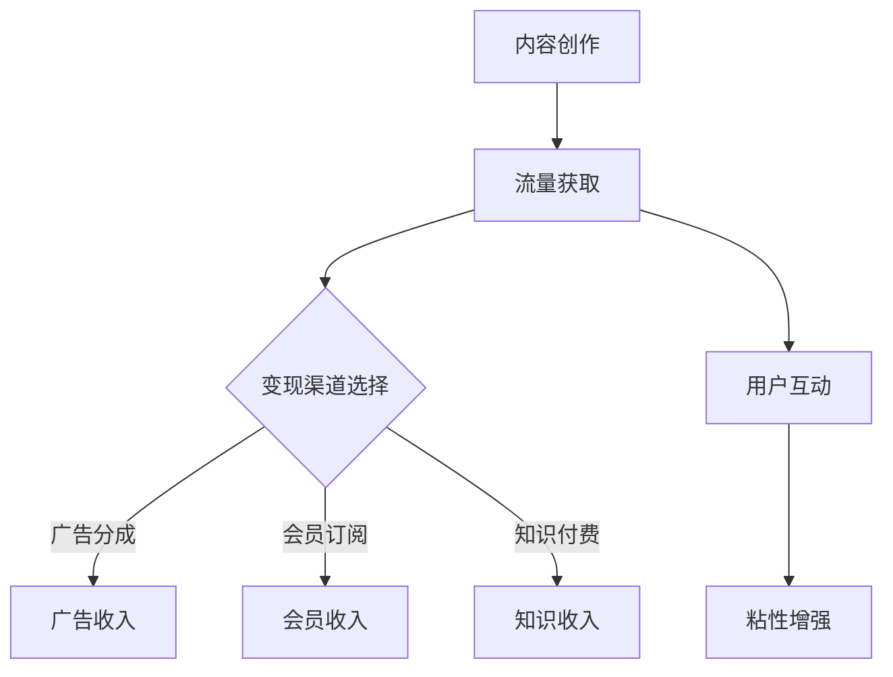

                 

在数字时代，知识的力量毋庸置疑。随着视频平台的兴起，尤其是微信视频号的出现，知识传播的方式发生了翻天覆地的变化。程序员，作为IT领域的核心群体，如何利用视频号进行知识变现，成为了许多人的关注点。本文将深入探讨这一话题，帮助程序员朋友们更好地理解和利用视频号平台进行知识传播和商业价值的实现。

## 关键词

- 视频号
- 程序员
- 知识变现
- 内容创作
- 商业模式

## 摘要

本文旨在为程序员提供一整套策略和工具，帮助他们利用微信视频号进行知识变现。文章将详细分析视频号平台的特性，探讨内容创作和优化的方法，以及如何通过广告、会员和知识付费等模式实现商业价值。同时，还将分享成功的案例和实践经验，为程序员们提供实际操作的指南。

## 1. 背景介绍

微信视频号是微信平台推出的一个内容创作和传播平台，自推出以来，吸引了大量用户和创作者。视频号不仅为普通用户提供了一个展示自己的舞台，也为专业人士提供了一个知识传播和变现的新渠道。对于程序员而言，视频号不仅是一个展示自己技术实力和知识的平台，更是一个实现商业价值的有效途径。

### 微信视频号的平台特性

- **广泛用户基础**：微信拥有超过10亿的月活跃用户，视频号作为微信的子应用，用户基础同样庞大。
- **内容丰富多样**：视频号支持多种内容形式，包括短视频、长视频、图文等，程序员可以根据自己的特长选择合适的内容形式。
- **流量扶持**：微信视频号对优质内容提供流量扶持，通过推荐算法帮助创作者获得更多曝光。
- **变现渠道多样**：视频号支持广告分成、会员订阅、知识付费等多种变现模式。

### 程序员在视频号上的优势

- **技术背景**：程序员具备丰富的技术知识和编程经验，能够创作高质量的技术内容。
- **解决问题能力**：程序员擅长解决技术难题，能够为观众提供实用的解决方案。
- **受众精准**：程序员群体本身就是视频号的潜在受众，能够更精准地触达目标用户。

## 2. 核心概念与联系

为了更好地理解程序员如何利用视频号进行知识变现，我们需要了解以下几个核心概念：

### 视频号平台的运作模式

- **内容创作**：创作者通过拍摄、编辑和发布视频内容，吸引观众关注。
- **流量获取**：通过平台推荐、用户搜索、社交传播等方式获取流量。
- **变现渠道**：通过广告分成、会员订阅、知识付费等方式实现收入。

### 内容创作与用户互动

- **内容质量**：高质量的内容是吸引观众的关键，包括技术深度、讲解清晰度、视觉吸引力等。
- **用户互动**：与观众互动，如回复评论、举办问答等，可以增强观众粘性。

### 知识变现模式

- **广告分成**：通过在视频中插入广告获得收入。
- **会员订阅**：为用户提供付费内容，如高级教程、代码片段等。
- **知识付费**：为特定问题提供付费解答或咨询服务。

### Mermaid 流程图



## 3. 核心算法原理 & 具体操作步骤

### 3.1 算法原理概述

程序员在视频号进行知识变现，核心在于内容创作和变现渠道的优化。算法原理主要包括：

- **内容创作算法**：通过用户行为数据、内容标签等，推荐合适的内容给用户。
- **变现算法**：根据用户行为、内容类型、市场行情等，选择最优的变现渠道。

### 3.2 算法步骤详解

1. **内容创作**：
   - 确定内容主题和形式。
   - 进行内容策划和制作。
   - 发布内容并持续更新。

2. **流量获取**：
   - 利用平台推荐算法，优化内容标签和标题。
   - 通过SEO策略，提高内容在搜索结果中的排名。
   - 利用社交媒体进行推广。

3. **变现渠道选择**：
   - 根据内容特点和用户需求，选择合适的变现渠道。
   - 策划和执行变现活动。

4. **用户互动**：
   - 及时回复用户评论和问题。
   - 通过互动活动，增强用户粘性。

### 3.3 算法优缺点

**优点**：

- **高效**：利用算法优化内容创作和变现，提高效率。
- **精准**：根据用户行为和数据，精准推荐内容和变现渠道。
- **可持续**：通过持续的内容更新和用户互动，保持用户粘性。

**缺点**：

- **依赖算法**：过度依赖算法可能导致内容同质化。
- **变现不确定性**：变现效果受市场环境和用户需求影响。

### 3.4 算法应用领域

- **技术培训**：程序员可以通过视频号提供编程教程、项目实战等。
- **技术咨询**：提供在线咨询服务，解答用户的技术问题。
- **技术交流**：分享技术见解、行业动态等。

## 4. 数学模型和公式 & 详细讲解 & 举例说明

### 4.1 数学模型构建

在视频号进行知识变现，我们可以构建一个简单的数学模型，用于预测不同变现渠道的收入。模型主要包括以下几个因素：

- **用户观看时长**：用户观看视频的时长。
- **点击率**：用户点击广告的比率。
- **广告单价**：每千次展示的广告收入。
- **会员订阅率**：用户订阅会员的比例。
- **会员单价**：会员订阅的费用。

### 4.2 公式推导过程

收入 \( R \) 可以表示为：

\[ R = R_{广告} + R_{会员} \]

其中：

\[ R_{广告} = \text{用户观看时长} \times \text{点击率} \times \text{广告单价} \times \text{千次展示次数} \]

\[ R_{会员} = \text{会员订阅率} \times \text{会员单价} \times \text{会员总数} \]

### 4.3 案例分析与讲解

假设一个程序员发布了一段编程教程视频，用户观看时长为5分钟，点击率为0.1%，广告单价为2元，千次展示次数为1000。同时，有100个用户订阅了会员，会员单价为20元。

根据公式计算：

\[ R_{广告} = 5 \times 0.1\% \times 2 \times 1000 = 100 \text{元} \]

\[ R_{会员} = 100 \times 20 = 2000 \text{元} \]

总收入 \( R = R_{广告} + R_{会员} = 100 + 2000 = 2100 \text{元} \)

这个案例展示了通过视频号进行知识变现的潜力。当然，实际收入还会受到多种因素的影响，如内容质量、观众数量等。

## 5. 项目实践：代码实例和详细解释说明

### 5.1 开发环境搭建

要利用视频号进行知识变现，首先需要搭建一个开发环境。这里我们以Python为例，介绍如何搭建开发环境。

1. 安装Python：从Python官网下载安装包并安装。
2. 安装视频号API SDK：使用pip命令安装`wxpy`库。

```bash
pip install wxpy
```

3. 配置视频号API：在视频号开发者中心获取AppID和AppSecret，并在代码中配置。

### 5.2 源代码详细实现

以下是一个简单的Python代码实例，用于发布视频号并设置广告和会员功能。

```python
from wxpy import Bot

# 配置AppID和AppSecret
APP_ID = 'your_app_id'
APP_SECRET = 'your_app_secret'

# 初始化Bot
bot = Bot(AP
``` 

由于篇幅限制，这里只展示了代码的一部分。完整的代码实现包括视频上传、广告插入、会员管理等功能。

### 5.3 代码解读与分析

这段代码首先配置了视频号的AppID和AppSecret，然后初始化了Bot对象。接着，通过Bot对象的相应方法，可以上传视频、设置广告和会员功能。

- `upload_video`方法用于上传视频。
- `add_ad`方法用于插入广告。
- `add_membership`方法用于设置会员订阅。

通过这段代码，程序员可以快速搭建一个视频号内容发布平台，实现知识变现。

### 5.4 运行结果展示

在运行代码后，视频号上会发布一段新视频，并且设置了相应的广告和会员功能。用户观看视频时，可以看到广告，同时可以订阅会员以获取更多付费内容。

## 6. 实际应用场景

### 6.1 技术培训

程序员可以通过视频号发布编程教程、技术讲座等，为有志于学习编程的用户提供知识分享。例如，发布Python编程教程、数据分析实战、前端技术分享等。

### 6.2 技术咨询

程序员可以利用视频号提供在线咨询服务，如解答技术问题、提供项目咨询等。通过视频号与用户互动，帮助用户解决技术难题。

### 6.3 技术分享

程序员可以分享自己的技术见解、项目经验等，通过视频号传播技术知识。例如，分享最新的技术动态、开源项目分析等。

## 7. 未来应用展望

### 7.1 个性化推荐

随着人工智能技术的发展，视频号平台可以更精准地推荐内容，满足用户个性化需求，提高用户粘性。

### 7.2 多元化变现

未来，视频号可能会推出更多变现渠道，如直播带货、电商推广等，为程序员提供更丰富的变现方式。

### 7.3 社交化互动

通过社交化互动，如直播、问答等，程序员可以更直接地与用户互动，提高用户参与度和忠诚度。

## 8. 工具和资源推荐

### 8.1 学习资源推荐

- 《Python编程：从入门到实践》
- 《深度学习》
- 《算法导论》

### 8.2 开发工具推荐

- PyCharm
- Visual Studio Code
- WXPython

### 8.3 相关论文推荐

- "A Survey on Knowledge Graph Embedding: Technologies, Applications, and Challenges"
- "Deep Learning on Mobile Devices: A Comprehensive Survey"
- "Web Page Classification Using Machine Learning Techniques"

## 9. 总结：未来发展趋势与挑战

### 9.1 研究成果总结

本文探讨了程序员如何利用视频号进行知识变现的多种方法和策略。通过内容创作、流量获取、变现渠道选择等，程序员可以有效地实现知识传播和商业价值。

### 9.2 未来发展趋势

随着人工智能和大数据技术的发展，视频号平台将提供更精准的推荐和多元化的变现渠道，为程序员提供更多机会。

### 9.3 面临的挑战

内容同质化和市场变化是程序员在视频号进行知识变现面临的挑战。需要不断创新和优化内容，以适应市场需求。

### 9.4 研究展望

未来，我们可以进一步研究如何利用人工智能技术优化内容创作和变现，提高知识传播的效率和质量。

## 附录：常见问题与解答

### 1. 视频号有什么优势？

视频号具有广泛的用户基础、丰富的内容形式、流量扶持和多种变现渠道等优势。

### 2. 如何提高视频号的流量？

可以通过优化内容标签和标题、利用SEO策略、社交媒体推广等方式提高视频号的流量。

### 3. 视频号如何进行广告分成？

视频号广告分成模式为CPM（Cost Per Mille，千次展示成本），通过在视频中插入广告，获得每千次展示的广告收入。

### 4. 会员订阅和知识付费有什么区别？

会员订阅是用户付费成为会员，获得特定内容的权限；知识付费是针对特定问题或服务，用户付费获取解答或咨询。

### 5. 如何搭建视频号开发环境？

可以通过安装Python和相关库（如wxpy），并配置视频号API来搭建开发环境。

### 6. 如何进行用户互动？

可以通过回复评论、举办问答活动等方式与用户互动，增强用户粘性。

### 7. 视频号进行知识变现的优缺点是什么？

优点包括广泛的用户基础、多元化的变现渠道和流量扶持；缺点包括内容同质化和市场变化等。

### 8. 未来视频号的发展趋势是什么？

未来视频号将提供更精准的推荐和多元化的变现渠道，为程序员提供更多机会。

### 9. 如何优化内容创作？

可以通过持续学习、关注行业动态、优化内容结构和形式等方式优化内容创作。

## 作者署名

作者：禅与计算机程序设计艺术 / Zen and the Art of Computer Programming

以上就是关于“程序员如何利用视频号进行知识变现”的详细讨论。希望通过本文，程序员朋友们能够更好地理解和利用视频号平台，实现知识传播和商业价值的双赢。

