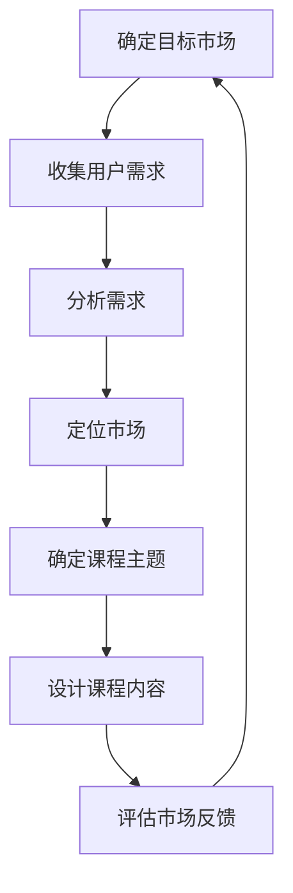
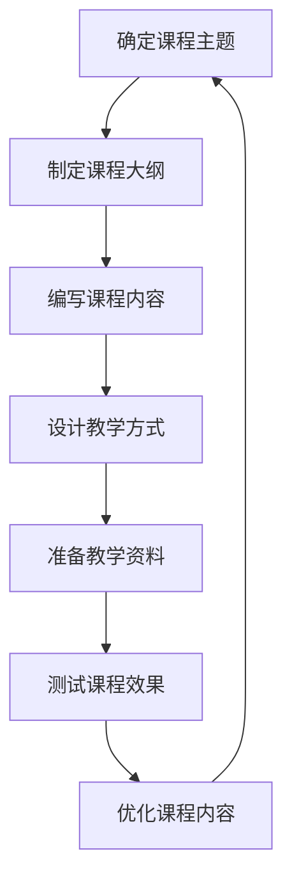
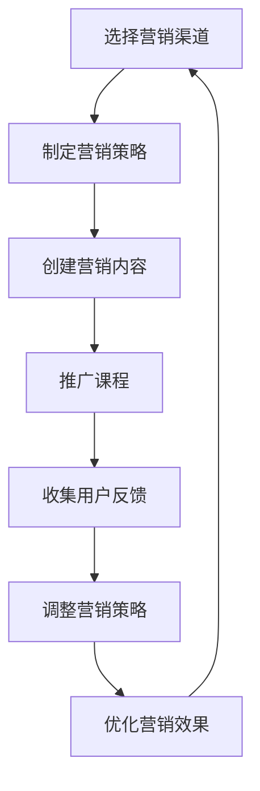
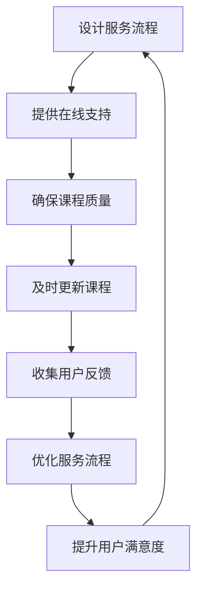

                 

关键词：知识付费，技术咨询，商业模式，用户体验，营销策略，盈利模式

摘要：在数字化时代，程序员的技能和经验已成为宝贵的知识资源。本文将探讨如何将程序员的技术咨询转化为知识付费服务，从而创造额外的收入来源。通过深入分析市场需求、构建优质的课程内容、实施有效的营销策略和优化用户体验，程序员可以成功地将自己的专业知识转化为付费服务，实现个人品牌价值和商业价值的双重提升。

## 1. 背景介绍

随着信息技术产业的快速发展，程序员不仅需要具备扎实的技术能力，还需具备一定的市场敏感度。传统的技术咨询服务虽然能够为个人带来一定的收入，但随着市场竞争的加剧和用户需求的多样化，单纯依靠技术咨询服务难以实现持续盈利。因此，越来越多的程序员开始探索将技术咨询转化为知识付费服务的新模式。

知识付费服务，即通过提供有价值的内容，如课程、教程、研究报告等，吸引用户付费订阅或购买，从而实现收入。这种模式不仅能够为程序员带来稳定的收入，还能够提升其个人品牌价值和行业影响力。

本文旨在探讨程序员如何通过以下步骤将技术咨询转化为知识付费服务：

1. **了解市场需求**：分析潜在用户的需求，定位目标市场。
2. **构建课程内容**：根据市场需求，设计并开发高质量的课程内容。
3. **实施营销策略**：利用多种渠道和工具，吸引并留住用户。
4. **优化用户体验**：提供便捷的服务流程，确保用户满意度。
5. **持续迭代与优化**：根据用户反馈和市场变化，不断调整和优化课程内容和营销策略。

## 2. 核心概念与联系

### 2.1 市场需求分析

市场需求分析是知识付费服务成功的基础。通过分析潜在用户的需求，程序员可以准确定位目标市场，从而设计出符合用户期望的课程内容。

#### Mermaid 流程图：



### 2.2 课程内容构建

课程内容是知识付费服务的核心。程序员需要结合自身技术专长和市场调研结果，设计出既具专业性又具吸引力的课程内容。

#### Mermaid 流程图：



### 2.3 营销策略实施

营销策略是知识付费服务成功的关键。程序员需要利用多种渠道和工具，制定并实施有效的营销策略，以吸引并留住用户。

#### Mermaid 流�程图：



### 2.4 用户体验优化

用户体验是知识付费服务长期发展的关键。程序员需要提供便捷的服务流程，确保用户满意度，从而增强用户黏性。

#### Mermaid 流程图：



## 3. 核心算法原理 & 具体操作步骤

### 3.1 算法原理概述

将技术咨询转化为知识付费服务的过程可以视为一个算法，其核心原理包括以下几个方面：

1. **需求分析**：通过市场调研，收集潜在用户的需求，为课程内容设计提供依据。
2. **内容构建**：结合市场需求，设计和开发高质量的课程内容。
3. **营销策略**：利用多种渠道和工具，制定并实施有效的营销策略，吸引目标用户。
4. **用户体验**：提供优质的服务流程，确保用户满意度，增强用户黏性。

### 3.2 算法步骤详解

1. **需求分析**：
   - 进行市场调研，了解潜在用户的需求和痛点。
   - 收集用户反馈，分析市场趋势。

2. **内容构建**：
   - 根据市场需求，确定课程主题和内容。
   - 设计课程大纲，编写课程内容。
   - 选择合适的教学方式，准备教学资料。

3. **营销策略**：
   - 选择适合的营销渠道，制定营销策略。
   - 创建有吸引力的营销内容，进行课程推广。
   - 收集用户反馈，调整和优化营销策略。

4. **用户体验**：
   - 设计便捷的服务流程，提供在线支持。
   - 确保课程质量，及时更新课程内容。
   - 收集用户反馈，优化服务流程，提升用户满意度。

### 3.3 算法优缺点

**优点**：
1. **稳定收入**：通过知识付费服务，程序员可以获得稳定的收入来源。
2. **个人品牌提升**：高质量的课程内容和优质的用户体验有助于提升程序员的个人品牌价值。
3. **灵活性强**：程序员可以根据市场需求，灵活调整课程内容和营销策略。

**缺点**：
1. **前期投入大**：进行市场调研、课程设计、营销推广等需要一定的时间和资源投入。
2. **竞争压力大**：随着知识付费市场的日益成熟，竞争压力逐渐加大。
3. **用户维护成本高**：保持用户的满意度和黏性需要持续投入时间和精力。

### 3.4 算法应用领域

1. **在线教育平台**：程序员可以通过在线教育平台，将自己的知识转化为付费课程，吸引学员报名学习。
2. **企业培训**：为企业提供定制化的技术培训服务，帮助企业提升员工的技术能力。
3. **个人咨询服务**：为有技术需求的个人提供一对一的技术咨询服务，帮助其解决实际问题。

## 4. 数学模型和公式 & 详细讲解 & 举例说明

### 4.1 数学模型构建

为了更好地理解将技术咨询转化为知识付费服务的过程，我们可以构建一个简单的数学模型。假设：

- \( P \) 为潜在用户数量。
- \( C \) 为课程单价。
- \( U \) 为用户转化率。
- \( R \) 为课程收入。

则课程收入 \( R \) 可以表示为：

\[ R = P \times C \times U \]

### 4.2 公式推导过程

1. **潜在用户数量 \( P \)**：
   - 通过市场调研，确定潜在用户数量。
   - \( P \) 受市场需求、竞争环境等因素影响。

2. **课程单价 \( C \)**：
   - 根据课程内容、市场定价策略等因素确定课程单价。
   - \( C \) 受课程质量、市场供需关系等因素影响。

3. **用户转化率 \( U \)**：
   - 通过营销策略、用户体验等因素影响用户转化率。
   - \( U \) 受课程推广效果、用户满意度等因素影响。

### 4.3 案例分析与讲解

以某程序员开设的一门Python编程课程为例，进行具体分析和讲解。

#### 4.3.1 潜在用户数量 \( P \)

- 市场调研显示，Python编程在开发领域有较高的需求，潜在用户数量约为1000人。

#### 4.3.2 课程单价 \( C \)

- 结合市场情况和课程内容，设定课程单价为200元。

#### 4.3.3 用户转化率 \( U \)

- 通过有效的营销策略和优质的用户体验，预期用户转化率为30%。

#### 4.3.4 课程收入 \( R \)

- 根据公式 \( R = P \times C \times U \)，计算得出课程收入为：

\[ R = 1000 \times 200 \times 0.3 = 60000 \text{元} \]

通过上述分析，我们可以看出，通过有效的市场调研、定价策略和营销推广，程序员可以成功地将其技术咨询服务转化为知识付费服务，实现可观的收入。

## 5. 项目实践：代码实例和详细解释说明

### 5.1 开发环境搭建

在开始构建知识付费服务之前，我们需要搭建一个合适的开发环境。以下是一个基本的开发环境搭建步骤：

#### 5.1.1 硬件要求

- 服务器：1核 CPU，2GB 内存，20GB 存储。
- 数据库：MySQL 5.7 或更高版本。

#### 5.1.2 软件要求

- 开发工具：Visual Studio Code。
- 服务器软件：Apache HTTP Server 2.4 或更高版本。
- 编程语言：Python 3.8 或更高版本。

#### 5.1.3 搭建步骤

1. **安装服务器软件**：
   - 在服务器上安装 Apache HTTP Server。
   - 配置虚拟主机，以便用户访问。

2. **安装开发工具**：
   - 在本地电脑上安装 Visual Studio Code。
   - 安装必要的插件，如 Python 扩展、Git 扩展等。

3. **安装数据库**：
   - 在服务器上安装 MySQL 数据库。
   - 创建数据库和用户，并授权相应权限。

4. **安装编程语言**：
   - 在服务器上安装 Python 3.8 或更高版本。
   - 安装必要的依赖库，如 Flask、Django 等。

### 5.2 源代码详细实现

以下是一个简单的知识付费服务框架的示例代码，使用 Python 的 Flask 框架实现。

```python
from flask import Flask, request, jsonify

app = Flask(__name__)

# 用户注册接口
@app.route('/register', methods=['POST'])
def register():
    data = request.json
    username = data['username']
    password = data['password']
    # 数据库操作，存储用户信息
    # ...
    return jsonify({'status': 'success', 'message': '注册成功'})

# 用户登录接口
@app.route('/login', methods=['POST'])
def login():
    data = request.json
    username = data['username']
    password = data['password']
    # 数据库操作，验证用户信息
    # ...
    return jsonify({'status': 'success', 'message': '登录成功'})

# 课程购买接口
@app.route('/buy_course', methods=['POST'])
def buy_course():
    data = request.json
    course_id = data['course_id']
    user_id = data['user_id']
    # 数据库操作，更新用户课程信息
    # ...
    return jsonify({'status': 'success', 'message': '购买成功'})

if __name__ == '__main__':
    app.run(host='0.0.0.0', port=80)
```

### 5.3 代码解读与分析

上述代码是一个简单的 Flask Web 应用程序，用于实现用户注册、登录和课程购买的功能。以下是代码的主要组成部分及其功能解读：

- **Flask 框架**：用于构建 Web 应用程序。
- **用户注册接口**：接收用户注册信息，并将信息存储在数据库中。
- **用户登录接口**：接收用户登录信息，并验证用户身份。
- **课程购买接口**：接收用户购买课程的信息，并更新用户课程信息。

通过这些接口，用户可以完成注册、登录和购买课程的流程，从而实现知识付费服务的功能。

### 5.4 运行结果展示

以下是运行结果示例：

- 用户注册：
  ```bash
  curl -X POST -H "Content-Type: application/json" -d '{"username": "user1", "password": "password1"}' http://localhost:80/register
  ```
  返回结果：
  ```json
  {"status": "success", "message": "注册成功"}
  ```

- 用户登录：
  ```bash
  curl -X POST -H "Content-Type: application/json" -d '{"username": "user1", "password": "password1"}' http://localhost:80/login
  ```
  返回结果：
  ```json
  {"status": "success", "message": "登录成功"}
  ```

- 课程购买：
  ```bash
  curl -X POST -H "Content-Type: application/json" -d '{"course_id": "course1", "user_id": "user1"}' http://localhost:80/buy_course
  ```
  返回结果：
  ```json
  {"status": "success", "message": "购买成功"}
  ```

## 6. 实际应用场景

### 6.1 在线教育平台

在线教育平台是程序员提供知识付费服务的主要渠道之一。通过搭建在线教育平台，程序员可以面向广泛的用户群体，提供各种技术课程，如编程语言、数据库管理、云计算等。以下是一些实际应用场景：

- **编程语言课程**：针对初学者和进阶者，提供从入门到高级的编程语言课程，如 Python、Java、C++ 等。
- **数据库课程**：介绍各种数据库管理技术，包括 MySQL、Oracle、MongoDB 等。
- **云计算课程**：讲解云计算基础和云计算平台的使用，如 AWS、Azure、Google Cloud 等。

### 6.2 企业培训

企业培训是程序员提供知识付费服务的另一个重要场景。通过为企业提供定制化的技术培训服务，程序员可以帮助企业提升员工的技术能力，从而提高企业的竞争力。以下是一些实际应用场景：

- **企业内部培训**：为企业员工提供定制化的内部培训，涵盖各种技术领域。
- **技术认证培训**：为员工提供技术认证培训，如 PMP、SCJP、MCSE 等。
- **项目管理培训**：为项目经理提供项目管理培训，提高项目管理和协调能力。

### 6.3 个人咨询服务

个人咨询服务是程序员利用专业知识解决实际问题的途径。通过提供个人咨询服务，程序员可以为企业和个人提供定制化的技术解决方案。以下是一些实际应用场景：

- **软件开发咨询**：为企业提供软件开发咨询服务，包括需求分析、系统设计、代码审查等。
- **系统集成咨询**：为系统集成项目提供技术咨询，包括设备选型、系统调试、性能优化等。
- **技术支持**：为企业和个人提供技术支持服务，解决他们在使用技术产品过程中遇到的问题。

## 7. 工具和资源推荐

### 7.1 学习资源推荐

- **在线课程平台**：如 Coursera、edX、Udemy 等，提供丰富的技术课程资源。
- **技术博客**：如 GitHub、Medium、Stack Overflow 等，可以获取最新的技术资讯和实战经验。
- **技术论坛**：如 CSDN、51CTO、开源中国等，可以交流学习和技术问题。

### 7.2 开发工具推荐

- **集成开发环境（IDE）**：如 Visual Studio Code、PyCharm、Eclipse 等，提供便捷的开发工具。
- **版本控制系统**：如 Git、GitHub、GitLab 等，用于代码管理和协作开发。
- **数据库管理工具**：如 MySQL Workbench、Oracle SQL Developer、MongoDB Compass 等，用于数据库管理和查询。

### 7.3 相关论文推荐

- **《编程：艺术与科学》**：Donald E. Knuth 的经典著作，介绍了编程的基本原则和技巧。
- **《深度学习》**：Ian Goodfellow、Yoshua Bengio、Aaron Courville 的著作，介绍了深度学习的基本原理和应用。
- **《人工智能：一种现代方法》**：Stuart Russell 和 Peter Norvig 的著作，介绍了人工智能的基本概念和技术。

## 8. 总结：未来发展趋势与挑战

### 8.1 研究成果总结

随着信息技术的快速发展，知识付费服务已成为一个重要的商业模式。程序员通过将技术咨询转化为知识付费服务，不仅能够实现稳定的收入，还能够提升个人品牌价值和行业影响力。本文从市场需求分析、课程内容构建、营销策略实施、用户体验优化等方面，详细探讨了程序员如何成功实现这一转变。

### 8.2 未来发展趋势

1. **个性化服务**：随着用户需求的多样化，知识付费服务将更加注重个性化，提供更加定制化的课程内容和服务。
2. **人工智能应用**：人工智能技术在知识付费服务中的应用将越来越广泛，如智能推荐、智能客服等。
3. **跨界合作**：程序员与其他行业（如教育、金融、医疗等）的合作将不断深化，实现知识付费服务的多元化发展。

### 8.3 面临的挑战

1. **内容质量**：高质量的课程内容是知识付费服务的核心竞争力，程序员需要不断提升自己的专业素养和教学能力。
2. **市场竞争**：随着知识付费市场的日益成熟，竞争压力将不断增大，程序员需要不断创新和优化服务，以应对市场竞争。
3. **用户维护**：保持用户的满意度和黏性需要持续投入时间和精力，程序员需要建立完善的用户服务体系。

### 8.4 研究展望

1. **技术创新**：积极探索和利用新兴技术（如区块链、虚拟现实等）在知识付费服务中的应用。
2. **跨界融合**：促进程序员与其他行业的融合，拓展知识付费服务的新领域。
3. **可持续发展**：关注知识付费服务的可持续发展，探索更为合理和可持续的商业模式。

## 9. 附录：常见问题与解答

### 9.1 如何进行市场需求分析？

- **市场调研**：通过问卷调查、访谈等方式，收集潜在用户的需求和痛点。
- **数据分析**：利用大数据技术和工具，分析市场趋势和用户行为。

### 9.2 如何构建高质量的课程内容？

- **内容设计**：结合市场需求，设计具有吸引力和实用性的课程内容。
- **教学方式**：选择合适的教学方式，如视频教学、直播教学等，提高用户参与度。

### 9.3 如何实施有效的营销策略？

- **选择合适的营销渠道**：如社交媒体、搜索引擎等，扩大课程影响力。
- **创建有吸引力的营销内容**：如课程海报、课程大纲等，提高用户兴趣。
- **持续优化**：根据用户反馈和市场变化，不断调整和优化营销策略。

### 9.4 如何提升用户体验？

- **设计便捷的服务流程**：简化用户操作流程，提高用户满意度。
- **提供优质的服务支持**：如在线问答、实时支持等，解决用户问题。
- **收集用户反馈**：定期收集用户反馈，了解用户需求，优化服务流程。

### 9.5 如何保持用户的满意度和黏性？

- **持续优化课程内容**：根据用户反馈，不断更新和改进课程内容。
- **提供额外的价值**：如赠送相关资料、举办线下活动等，增强用户黏性。
- **建立用户社区**：建立用户社区，促进用户间的互动和交流，增强用户归属感。

