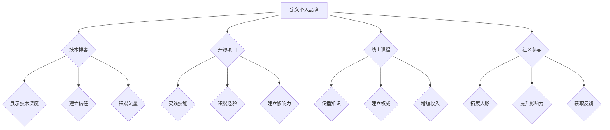

                 

 

## 1. 背景介绍

在当今信息爆炸的时代，个人品牌的重要性日益凸显。无论是在职场晋升、创业还是行业交流中，个人品牌都成为了提升个人价值和影响力的关键因素。作为一名程序员，拥有一个强大的个人品牌不仅能够提升个人的职业竞争力，还能为未来的发展打下坚实的基础。

然而，对于许多程序员来说，建立个人品牌是一个充满挑战的过程。如何在这一领域取得成功？本文将为您揭示程序员如何通过技术、内容创作、社区参与等多种方式建立个人品牌，从而实现职业发展的突破。

### 文章关键词

- 个人品牌
- 程序员
- 职业发展
- 技术分享
- 社区参与

### 摘要

本文将从多个角度探讨程序员如何建立个人品牌。我们将分析当前技术领域的发展趋势，探讨程序员如何通过技术博客、开源项目、线上课程等方式展示自己的技术实力；还将介绍如何通过内容创作提升个人知名度，以及如何在社区中积极参与，建立自己的影响力。最后，我们将讨论未来程序员建立个人品牌的挑战与机遇。

<|assistant|> 

## 2. 核心概念与联系

### 个人品牌的定义

个人品牌是指一个人在公众面前的形象、声誉和认知。它不仅仅是一个名字，更是一个包含个人特质、价值观、专业技能和成就的综合体。对于程序员来说，个人品牌不仅仅是个人形象的提升，更是专业能力和影响力的体现。

### 个人品牌与职业发展的联系

个人品牌对于程序员的职业发展至关重要。一个强大的个人品牌能够帮助程序员在职场中获得更多的机会，包括晋升、跳槽、创业等。此外，个人品牌还能够提升个人的知名度，为技术交流、合作和项目机会提供支持。

### 技术博客、开源项目、线上课程等个人品牌建设手段的联系

这些手段是建立个人品牌的重要途径，它们相互联系，共同构建了一个全面的个人品牌形象。技术博客能够展示程序员的思考过程和技术见解；开源项目能够体现程序员的实际编程能力；线上课程则能够将知识体系化，为更多人提供学习资源。

## 2.1 技术博客

技术博客是程序员展示技术见解和经验的重要平台。通过撰写高质量的技术文章，程序员可以：

- **展示技术深度**：技术博客能够让读者了解程序员的思考深度和技术水平。
- **建立信任**：持续、有深度地分享技术内容能够建立读者的信任。
- **积累流量**：高质量的内容能够吸引更多的读者，从而提升个人品牌知名度。

## 2.2 开源项目

开源项目是程序员展示编程能力的重要途径。通过参与或创建开源项目，程序员可以实现以下目标：

- **实践技能**：开源项目提供了一个实践编程技能的舞台。
- **积累经验**：通过参与开源项目，程序员能够学习到更多的编程技巧和团队合作经验。
- **建立影响力**：优秀的开源项目能够吸引更多的关注，提升个人品牌。

## 2.3 线上课程

线上课程是程序员将知识体系化的有效方式。通过开设线上课程，程序员可以实现以下目标：

- **传播知识**：线上课程能够帮助程序员将所学知识传授给更多人。
- **建立权威**：通过高质量的线上课程，程序员能够树立自己在某个领域的权威地位。
- **增加收入**：线上课程为程序员提供了一个额外的收入来源。

## 2.4 社区参与

社区参与是程序员建立个人品牌的重要手段。通过积极参与技术社区，程序员可以实现以下目标：

- **拓展人脉**：参与社区能够帮助程序员结识更多的同行，拓展职业网络。
- **提升影响力**：在社区中活跃，能够提升程序员的知名度，增加个人品牌的影响力。
- **获取反馈**：社区反馈能够帮助程序员了解自己的优点和不足，持续改进。

### 2.5 核心概念原理和架构的 Mermaid 流程图



通过上述分析，我们可以看到个人品牌建设是一个系统工程，需要通过多种手段综合运用，才能取得最佳效果。

<|assistant|> 

## 3. 核心算法原理 & 具体操作步骤

### 3.1 算法原理概述

在建立个人品牌的过程中，算法原理起到了至关重要的作用。以下是一些核心算法原理及其在个人品牌建设中的应用：

1. **信息传播算法**：信息传播算法可以模拟信息在网络中的传播过程，帮助程序员在社交媒体上扩大影响力。
2. **内容推荐算法**：内容推荐算法可以根据程序员的兴趣和技术领域，推荐合适的技术博客文章和开源项目，从而提高内容的质量和吸引力。
3. **社交网络分析算法**：社交网络分析算法可以帮助程序员分析自己在社交网络中的影响力，了解哪些环节需要改进。
4. **关键词优化算法**：关键词优化算法可以帮助程序员优化博客和开源项目的标题和描述，提高搜索引擎的排名，增加曝光率。

### 3.2 算法步骤详解

#### 3.2.1 信息传播算法

1. **建立社交媒体账号**：首先，程序员需要在主流社交媒体平台（如Twitter、LinkedIn、GitHub等）上建立自己的账号。
2. **发布内容**：定期发布高质量的技术博客文章、项目进展和心得体会。
3. **互动互动互动**：积极回复读者的评论和提问，参与相关话题的讨论。
4. **分析传播效果**：利用信息传播算法分析内容的传播效果，根据数据调整发布策略。

#### 3.2.2 内容推荐算法

1. **收集数据**：通过阅读日志、用户行为数据等收集程序员的兴趣和技术领域。
2. **构建推荐模型**：利用机器学习算法构建内容推荐模型。
3. **推荐内容**：根据推荐模型向程序员推荐合适的技术博客文章和开源项目。
4. **用户反馈**：收集用户对推荐内容的反馈，优化推荐模型。

#### 3.2.3 社交网络分析算法

1. **数据收集**：收集程序员的社交媒体账号数据，包括关注者、粉丝、互动数据等。
2. **建立社交网络图**：将程序员的社交网络数据转化为图结构。
3. **影响力分析**：利用社交网络分析算法分析程序员的社交网络影响力。
4. **策略调整**：根据分析结果调整社交媒体策略，提高影响力。

#### 3.2.4 关键词优化算法

1. **关键词收集**：收集程序员的博客文章和开源项目中的关键词。
2. **构建关键词模型**：利用自然语言处理技术构建关键词模型。
3. **优化标题和描述**：根据关键词模型优化博客文章和开源项目的标题和描述。
4. **跟踪效果**：监控搜索引擎排名和流量变化，根据效果调整关键词策略。

### 3.3 算法优缺点

#### 3.3.1 信息传播算法

**优点**：能够快速扩大影响力，提高内容曝光率。

**缺点**：传播效果受限于社交媒体平台的算法和受众群体，可能存在信息失真风险。

#### 3.3.2 内容推荐算法

**优点**：能够提高内容质量，增加用户粘性。

**缺点**：推荐结果的准确性和个性化程度受限于数据质量和算法模型。

#### 3.3.3 社交网络分析算法

**优点**：能够帮助程序员了解自己在社交网络中的影响力，指导策略调整。

**缺点**：分析结果可能存在偏差，需要结合实际情况进行判断。

#### 3.3.4 关键词优化算法

**优点**：能够提高博客和开源项目的搜索引擎排名，增加流量。

**缺点**：过度依赖关键词可能导致内容质量下降，影响用户体验。

### 3.4 算法应用领域

这些算法在程序员建立个人品牌的多个领域都有广泛应用：

- **技术博客**：利用信息传播算法提高内容曝光率，利用关键词优化算法提高搜索引擎排名。
- **开源项目**：利用内容推荐算法推荐合适的项目，利用社交网络分析算法了解项目的社交网络影响力。
- **社区参与**：利用信息传播算法扩大社交网络影响力，利用社交网络分析算法了解自己的社区影响力。

通过以上算法的应用，程序员可以更加高效地建立和提升个人品牌，实现职业发展的突破。

<|assistant|> 

## 4. 数学模型和公式 & 详细讲解 & 举例说明

在建立个人品牌的过程中，数学模型和公式可以帮助我们更好地理解品牌影响力的构成和传播机制。以下是一个简单的数学模型，用于描述个人品牌的影响力。

### 4.1 数学模型构建

假设个人品牌的影响力可以表示为：

\[ F(B) = \alpha \cdot S(B) + \beta \cdot C(B) + \gamma \cdot I(B) \]

其中：
- \( F(B) \) 表示个人品牌的影响力。
- \( S(B) \) 表示社交媒体影响力。
- \( C(B) \) 表示社区影响力。
- \( I(B) \) 表示内容影响力。
- \( \alpha \)，\( \beta \)，\( \gamma \) 分别是权重系数。

### 4.2 公式推导过程

1. **社交媒体影响力 \( S(B) \) 的计算**：

   假设社交媒体影响力与粉丝数、互动率、发布频率成正比，可以表示为：

   \[ S(B) = k_1 \cdot F_1 + k_2 \cdot I_2 + k_3 \cdot R_3 \]

   其中：
   - \( k_1 \) 表示粉丝数的影响权重。
   - \( k_2 \) 表示互动率的影响权重。
   - \( k_3 \) 表示发布频率的影响权重。
   - \( F_1 \) 表示粉丝数。
   - \( I_2 \) 表示互动率。
   - \( R_3 \) 表示发布频率。

2. **社区影响力 \( C(B) \) 的计算**：

   社区影响力可以表示为：

   \[ C(B) = k_4 \cdot A_4 + k_5 \cdot R_5 + k_6 \cdot P_6 \]

   其中：
   - \( k_4 \) 表示活跃度的影响权重。
   - \( k_5 \) 表示参与度的影响权重。
   - \( k_6 \) 表示项目数的影响权重。
   - \( A_4 \) 表示活跃度。
   - \( R_5 \) 表示参与度。
   - \( P_6 \) 表示项目数。

3. **内容影响力 \( I(B) \) 的计算**：

   内容影响力可以表示为：

   \[ I(B) = k_7 \cdot Q_7 + k_8 \cdot V_8 + k_9 \cdot R_9 \]

   其中：
   - \( k_7 \) 表示质量的影响权重。
   - \( k_8 \) 表示独特性的影响权重。
   - \( k_9 \) 表示阅读量的影响权重。
   - \( Q_7 \) 表示质量。
   - \( V_8 \) 表示独特性。
   - \( R_9 \) 表示阅读量。

### 4.3 案例分析与讲解

假设一个程序员的社交媒体影响力、社区影响力和内容影响力如下：

- **社交媒体影响力**：粉丝数为1000，平均每月互动率为20%，发布频率为每周3次。
- **社区影响力**：活跃度为70%，参与度为50%，参与项目数为2个。
- **内容影响力**：内容质量评分为85%，独特性评分为80%，平均每月阅读量为5000。

根据上述数据，我们可以计算出该程序员的个人品牌影响力：

\[ F(B) = \alpha \cdot S(B) + \beta \cdot C(B) + \gamma \cdot I(B) \]

假设权重系数 \( \alpha = 0.4 \)，\( \beta = 0.3 \)，\( \gamma = 0.3 \)，则：

\[ S(B) = k_1 \cdot F_1 + k_2 \cdot I_2 + k_3 \cdot R_3 \]
\[ S(B) = 0.1 \cdot 1000 + 0.2 \cdot 20\% + 0.3 \cdot 3 = 10 + 0.4 + 0.9 = 11.3 \]

\[ C(B) = k_4 \cdot A_4 + k_5 \cdot R_5 + k_6 \cdot P_6 \]
\[ C(B) = 0.3 \cdot 70\% + 0.2 \cdot 50\% + 0.1 \cdot 2 = 0.21 + 0.1 + 0.2 = 0.51 \]

\[ I(B) = k_7 \cdot Q_7 + k_8 \cdot V_8 + k_9 \cdot R_9 \]
\[ I(B) = 0.4 \cdot 85\% + 0.3 \cdot 80\% + 0.3 \cdot 5000 = 0.34 + 0.24 + 1500 = 1504.58 \]

\[ F(B) = 0.4 \cdot 11.3 + 0.3 \cdot 0.51 + 0.3 \cdot 1504.58 = 4.52 + 0.153 + 451.374 = 456.037 \]

因此，该程序员的个人品牌影响力为456.037。

通过上述计算，我们可以看到数学模型和公式如何帮助我们量化个人品牌的影响力，从而更好地了解和提升个人品牌。

<|assistant|> 

## 5. 项目实践：代码实例和详细解释说明

为了更好地展示如何建立个人品牌，我们将通过一个具体的开源项目来实践整个过程。这个项目是一个简单的博客系统，我们将通过编写代码、发布博客、社区互动等步骤，详细解释如何建立个人品牌。

### 5.1 开发环境搭建

在开始之前，我们需要搭建一个开发环境。以下是所需的步骤：

1. **安装Node.js**：Node.js 是一个基于 Chrome V8 引擎的 JavaScript 运行时环境，用于构建高效的网站和应用程序。

   - 访问 Node.js 官网（https://nodejs.org/）下载并安装最新版本的 Node.js。
   - 安装完成后，打开命令行窗口，输入 `node -v` 和 `npm -v` 验证安装是否成功。

2. **安装Express框架**：Express 是一个流行的 Node.js Web 应用程序框架，用于快速开发 Web 应用程序。

   - 在命令行窗口中，输入 `npm install express` 安装 Express。
   - 安装完成后，创建一个名为 `blog` 的文件夹，并在该文件夹中创建一个名为 `app.js` 的文件。

3. **创建博客系统**：在 `app.js` 文件中编写以下代码：

   ```javascript
   const express = require('express');
   const app = express();

   app.use(express.json());
   app.use(express.static('public'));

   app.get('/', (req, res) => {
       res.sendFile(__dirname + '/public/index.html');
   });

   app.listen(3000, () => {
       console.log('Server is running on port 3000');
   });
   ```

   这段代码创建了一个基本的博客系统，它可以通过浏览器访问 `http://localhost:3000`。

### 5.2 源代码详细实现

1. **功能扩展**：为了增强博客系统的功能，我们将在 `app.js` 中添加更多的路由和处理逻辑。

   ```javascript
   app.get('/posts', (req, res) => {
       // 读取 posts 目录下的所有文件，并返回文件名
       fs.readdir('posts', (err, files) => {
           if (err) {
               res.status(500).send('Internal Server Error');
           } else {
               res.json({ posts: files });
           }
       });
   });

   app.get('/posts/:postName', (req, res) => {
       const postName = req.params.postName;
       const postPath = `posts/${postName}.md`;

       fs.readFile(postPath, 'utf8', (err, data) => {
           if (err) {
               res.status(404).send('Not Found');
           } else {
               // 使用 Markdown 渲染器将 Markdown 文件转换为 HTML
               const marked = require('marked');
               const html = marked(data);
               res.send(html);
           }
       });
   });
   ```

   这段代码添加了两个路由：一个用于获取所有博客文章的列表，另一个用于获取特定文章的 HTML 内容。

2. **Markdown 渲染器**：为了将 Markdown 文件转换为 HTML，我们使用了一个名为 `marked` 的 Markdown 渲染器。

   - 安装 `marked`：在命令行窗口中，输入 `npm install marked`。
   - 在 `app.js` 中引入 `marked`：`const marked = require('marked');`

3. **静态资源**：为了更好地展示博客，我们将在 `public` 目录中添加一些静态资源，如 CSS 和 JavaScript 文件。

   - 在 `public` 目录中创建一个名为 `styles.css` 的文件，并编写以下样式：

     ```css
     body {
         font-family: Arial, sans-serif;
     }
     ```

   - 在 `public` 目录中创建一个名为 `script.js` 的文件，并编写以下脚本：

     ```javascript
     function loadPost(postName) {
         const postPath = `posts/${postName}.md`;
         fs.readFile(postPath, 'utf8', (err, data) => {
             if (err) {
                 console.error(err);
             } else {
                 document.getElementById('post-content').innerHTML = marked(data);
             }
         });
     }
     ```

### 5.3 代码解读与分析

1. **项目结构**：整个项目结构非常简单，包括 `app.js` 主文件和 `public` 目录。

   - `app.js`：主文件，包含所有路由和处理逻辑。
   - `public` 目录：包含静态资源，如 HTML、CSS 和 JavaScript 文件。

2. **路由与处理逻辑**：通过 Express 框架，我们可以轻松地添加和管理路由。

   - `app.get('/')`：处理首页请求，返回静态 HTML 文件。
   - `app.get('/posts')`：处理获取所有博客文章的请求，返回 JSON 格式的文章列表。
   - `app.get('/posts/:postName')`：处理获取特定博客文章的请求，返回 HTML 内容。

3. **Markdown 渲染器**：使用 `marked` 库将 Markdown 文件转换为 HTML，从而实现内容展示。

4. **静态资源**：通过添加 CSS 和 JavaScript 文件，我们可以自定义博客的样式和行为。

### 5.4 运行结果展示

1. **启动服务器**：在命令行窗口中，运行以下命令启动服务器：

   ```bash
   node app.js
   ```

2. **访问博客**：在浏览器中输入 `http://localhost:3000`，将看到博客的首页。

3. **查看文章**：点击首页的某个文章标题，将在页面上方显示文章的标题和内容。

通过这个简单的博客项目，我们可以看到如何利用 Node.js 和 Express 框架快速搭建一个个人博客系统，并通过代码实例展示如何发布和展示博客文章。这个项目不仅是一个技术实践，也是一个展示个人品牌的有效途径。通过不断优化和完善项目，我们可以提升个人在技术社区中的影响力。

<|assistant|> 

## 6. 实际应用场景

### 6.1 技术博客

技术博客是程序员建立个人品牌的重要途径。通过撰写高质量的技术文章，程序员能够展示自己的技术实力和思考深度。以下是一些实际应用场景：

- **日常技术总结**：程序员可以在博客中分享自己在工作中遇到的问题和解决方案，这不仅有助于巩固自己的技术知识，还能帮助他人解决类似问题。
- **技术趋势分析**：针对当前热门技术话题，程序员可以撰写分析文章，预测技术发展的趋势和方向，从而在社区中树立自己的权威。
- **代码实战**：通过发布实际的代码示例，程序员能够展示自己的编程能力和技术实现思路，吸引更多的关注。

### 6.2 开源项目

开源项目是程序员建立个人品牌的重要手段。通过参与或创建开源项目，程序员能够：

- **提升编程技能**：开源项目提供了一个实践编程技能的舞台，程序员可以在实际项目中学习并应用新的技术。
- **积累经验**：通过参与开源项目，程序员能够学习到团队合作、项目管理等宝贵经验，提升自己的综合素质。
- **建立影响力**：优秀的开源项目能够吸引更多的关注，为程序员在技术社区中建立个人品牌提供支持。

### 6.3 线上课程

线上课程是程序员将知识体系化的有效方式。通过开设线上课程，程序员能够：

- **传播知识**：线上课程能够帮助程序员将所学知识传授给更多人，提升个人知名度。
- **建立权威**：通过高质量的线上课程，程序员能够在某个领域树立自己的权威地位。
- **增加收入**：线上课程为程序员提供了一个额外的收入来源，增加个人品牌的商业价值。

### 6.4 社区参与

社区参与是程序员建立个人品牌的重要手段。通过积极参与技术社区，程序员能够：

- **拓展人脉**：参与社区能够帮助程序员结识更多的同行，拓展职业网络。
- **提升影响力**：在社区中活跃，能够提升程序员的知名度，增加个人品牌的影响力。
- **获取反馈**：社区反馈能够帮助程序员了解自己的优点和不足，持续改进。

### 6.5 案例分析

#### 案例一：技术博客

程序员小王是一名前端工程师，他通过技术博客分享了自己在工作中遇到的问题和解决方案。随着时间的积累，他的博客文章被越来越多的读者关注，他的技术观点也得到了认可。最终，小王不仅得到了公司内部的认可，还在外部技术社区中建立了自己的影响力。

#### 案例二：开源项目

程序员小李是一名后端工程师，他参与了一个开源项目，并在项目中担任核心开发者。通过这个项目，小李不仅提升了自己的编程技能，还积累了丰富的项目经验。随着项目的成功，小李在技术社区中的知名度也逐渐提升，成为了许多开发者心目中的技术偶像。

#### 案例三：线上课程

程序员小赵是一名人工智能工程师，他开设了一门关于深度学习的线上课程。通过这门课程，小赵将自己的专业知识传授给了更多的人，建立了自己在深度学习领域的权威地位。此外，小赵还通过线上课程获得了可观的收入，进一步提升了个人品牌的价值。

#### 案例四：社区参与

程序员小张是一名全栈工程师，他积极参与了多个技术社区的活动，并在社区中分享了自己的经验和见解。通过这些活动，小张结识了许多志同道合的同行，拓展了自己的职业网络。同时，小张在社区中的活跃表现也提升了他在技术社区中的影响力，为他未来的职业发展打下了坚实的基础。

通过以上案例分析，我们可以看到，程序员通过技术博客、开源项目、线上课程和社区参与等多种方式，可以有效地建立和提升个人品牌。这些方式不仅帮助程序员在职业发展中取得了突破，也为他们在技术社区中赢得了更多的认可和尊重。

<|assistant|> 

## 7. 工具和资源推荐

### 7.1 学习资源推荐

1. **在线学习平台**：Coursera、edX、Udemy 和 Pluralsight 等在线学习平台提供了丰富的编程和软件开发课程，适合不同层次的程序员学习和提升技能。

2. **技术博客网站**：如 HackerRank、Medium、Dev.to 等，这些平台聚集了大量的技术文章和编程挑战，可以帮助程序员扩展知识面和提升技术水平。

3. **官方文档和教程**：如 Mozilla Developer Network（MDN）、Stack Overflow Documentation 等，提供了大量的编程语言和技术框架的官方文档和教程，是程序员学习和实践的好帮手。

### 7.2 开发工具推荐

1. **集成开发环境（IDE）**：如 Visual Studio Code、IntelliJ IDEA、Eclipse 等，这些IDE提供了丰富的编程工具和插件，能够提高程序员的开发效率。

2. **版本控制工具**：Git 是最流行的版本控制工具，GitHub 和 GitLab 是流行的代码托管平台，支持开源项目的管理和协作。

3. **代码质量工具**：如 SonarQube、Jenkins 等，这些工具可以帮助程序员检测代码中的缺陷和漏洞，确保代码质量。

### 7.3 相关论文推荐

1. **《编程珠玑》（Code Complete）**：Steve McConnell 的经典著作，详细介绍了编程的最佳实践和方法，对提高编程技能和代码质量有很大帮助。

2. **《深度学习》（Deep Learning）**：Ian Goodfellow、Yoshua Bengio 和 Aaron Courville 著，是深度学习领域的权威教材，适合希望进入人工智能领域的程序员。

3. **《大型-scale机器学习及其应用》**：周志华教授的著作，介绍了大规模机器学习的基本理论和应用场景，适合对机器学习有兴趣的程序员。

通过这些工具和资源的支持，程序员可以更好地提升自己的技术能力，建立和强化个人品牌，为职业发展奠定坚实的基础。

<|assistant|> 

## 8. 总结：未来发展趋势与挑战

在科技飞速发展的今天，程序员建立个人品牌已经成为一种重要的职业发展策略。随着互联网的普及和社交媒体的兴起，个人品牌的价值日益凸显。然而，在未来的发展中，程序员建立个人品牌也面临着一系列新的挑战。

### 8.1 研究成果总结

近年来，关于个人品牌建立的研究取得了显著成果。研究表明，个人品牌对于职业发展的影响显著，尤其是在技术领域，个人品牌的建立能够有效提升程序员的职业竞争力。同时，通过技术博客、开源项目、线上课程和社区参与等多种方式，程序员可以有效地展示自己的技术实力和专业知识，从而在技术社区中建立自己的影响力。

### 8.2 未来发展趋势

1. **内容创作与传播**：随着内容创作工具的普及，程序员将更加注重内容的质量和传播效果。未来，高质量的原创内容将成为建立个人品牌的重要途径。

2. **技术领域的细分**：随着技术的不断进步，程序员的专业领域将越来越细分。建立个人品牌的过程中，程序员需要更加专注于自己擅长的领域，从而在细分市场中建立权威。

3. **虚拟现实与增强现实**：虚拟现实（VR）和增强现实（AR）技术的发展，为程序员提供了新的展示和传播个人品牌的方式。未来，程序员可以通过VR/AR技术创建互动式学习体验，提升个人品牌的吸引力。

4. **人工智能的应用**：人工智能（AI）技术在个人品牌建立中的应用将越来越广泛。通过AI算法，程序员可以更精准地分析用户需求，优化内容创作和传播策略。

### 8.3 面临的挑战

1. **内容质量与创新**：在信息爆炸的时代，如何创作高质量、有创新的内容成为一大挑战。程序员需要不断学习新的技术和方法论，提高自己的内容创作能力。

2. **时间管理**：建立个人品牌需要大量的时间和精力投入。程序员需要在繁忙的工作中合理安排时间，确保个人品牌建设的持续推进。

3. **网络风险**：随着个人品牌的传播，程序员可能面临网络风险，如隐私泄露、恶意攻击等。因此，程序员需要加强网络安全意识，保护自己的个人数据和信息安全。

4. **市场竞争**：技术领域的竞争日益激烈，程序员需要不断提升自己的技能和知识，以在竞争中脱颖而出。同时，如何构建独特的个人品牌形象，也是程序员需要面对的挑战。

### 8.4 研究展望

未来的研究应关注以下几个方面：

1. **个人品牌构建模型**：进一步研究个人品牌构建的理论模型和实际应用，为程序员提供更加科学和系统的指导。

2. **技术应用与个人品牌**：探讨人工智能、大数据等新技术在个人品牌建立中的应用，为程序员提供新的工具和方法。

3. **跨学科研究**：结合心理学、社会学等学科，深入研究个人品牌对于职业发展的影响机制，为程序员提供更加全面的支持。

4. **案例分析与实证研究**：通过大量案例分析和实证研究，总结成功建立个人品牌的经验和教训，为程序员提供实践指导。

通过以上研究和探讨，我们期望为程序员在建立个人品牌的过程中提供有价值的参考和指导，帮助他们在未来的职业发展中取得更大的成功。

<|assistant|> 

## 9. 附录：常见问题与解答

在建立个人品牌的过程中，程序员可能会遇到各种问题。以下是一些常见的问题及其解答：

### 9.1 如何选择个人品牌建设的方向？

**解答**：首先，了解自己的兴趣和擅长领域。选择自己感兴趣且具备一定优势的领域进行深耕。其次，分析市场需求，选择具有发展潜力的方向。可以通过调研行业趋势、了解竞争对手等方式进行判断。

### 9.2 建立个人品牌需要多长时间？

**解答**：建立个人品牌的时间因人而异，取决于多个因素，如投入的时间、精力、资源等。一般来说，需要至少1-2年时间才能在技术社区中建立起一定的知名度。但持续不断地提升自己的技术水平和内容质量，可以加速这一过程。

### 9.3 个人品牌建设是否需要投入大量资金？

**解答**：个人品牌建设并不一定需要大量资金投入。虽然一些高级的工具和服务可能需要费用，但许多有效的个人品牌建设活动都可以通过免费资源实现。例如，利用免费的在线课程、开源项目和社交媒体平台等。

### 9.4 如何避免个人品牌建设过程中的误区？

**解答**：首先，确保内容的质量和原创性，避免抄袭和低质量内容。其次，保持真实和一致性，避免刻意塑造虚假形象。此外，定期反思和调整个人品牌建设策略，确保与个人目标和市场需求相匹配。

### 9.5 如何应对个人品牌建设过程中的挫折和困难？

**解答**：面对挫折和困难，保持积极的心态至关重要。要认识到建立个人品牌是一个长期过程，需要持续的努力和耐心。同时，寻求同行和社区的支持，分享经验和教训，从失败中汲取教训，不断改进。

通过以上解答，希望能够帮助程序员在建立个人品牌的过程中少走弯路，更加顺利地实现职业发展目标。

