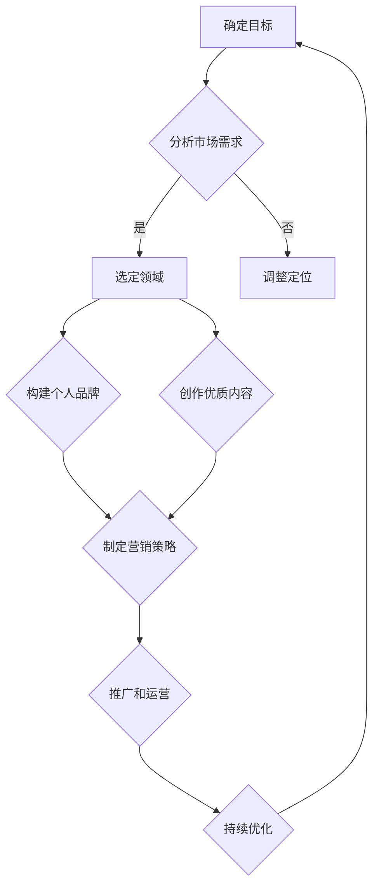

                 

随着互联网和技术的不断发展，知识付费已经成为一种流行的商业模式。对于程序员而言，打造个人知识付费IP不仅可以实现自我价值的提升，还能带来可观的收入。本文将围绕如何打造个人知识付费IP，从多个方面进行深入探讨。

> 关键词：程序员、知识付费、个人品牌、内容创作、营销策略

> 摘要：本文旨在为程序员提供一套系统性的方法论，帮助他们在竞争激烈的知识付费市场中脱颖而出，打造出具有独特吸引力的个人知识付费IP。

## 1. 背景介绍

知识付费，简单来说，就是用户为获取特定知识或服务而付费的行为。随着互联网的普及，人们获取知识的渠道变得多样化，知识付费也应运而生。如今，知识付费已成为一种重要的商业模式，涉及领域广泛，包括教育、科技、金融、健康等。

程序员作为知识工作者，具有丰富的技术背景和解决问题的能力。在知识付费领域，程序员可以凭借自身的技术特长，为用户提供专业的知识服务和培训。然而，如何在众多竞争者中脱颖而出，打造出个人知识付费IP，是每个程序员都需要面对的问题。

### 1.1 知识付费市场现状

当前，知识付费市场呈现出以下几个特点：

- **市场规模不断扩大**：随着用户消费习惯的改变，知识付费市场规模逐年增长。
- **内容多样化**：知识付费内容涵盖了各个领域，包括专业技能、兴趣爱好、生活百科等。
- **用户需求多样化**：用户对知识的需求不再局限于传统的教育课程，更偏向于个性化、实用性的内容。
- **竞争日益激烈**：知识付费市场的竞争日益激烈，平台和创作者数量不断增加。

### 1.2 程序员的竞争优势

作为程序员，在知识付费市场中具备以下竞争优势：

- **技术背景**：程序员具备丰富的技术知识和实践经验，能够为用户提供专业的技术培训和解决方案。
- **解决问题的能力**：程序员擅长分析和解决问题，能够为用户解决实际问题。
- **创新能力**：程序员具备较强的创新能力，能够不断更新和优化知识内容。
- **社群优势**：程序员之间具有较强的社群联系，有助于共享资源和推广知识内容。

## 2. 核心概念与联系

在打造个人知识付费IP的过程中，我们需要了解以下几个核心概念，并探讨它们之间的联系。

### 2.1 个人品牌

个人品牌是指个人在公众心目中的形象和认知。在知识付费领域，个人品牌是吸引用户的重要因素。一个成功的个人品牌应该具备以下特征：

- **独特性**：个人品牌应具有独特性，能够与其他人区分开来。
- **专业性**：个人品牌应体现专业性和权威性，让用户信服。
- **一致性**：个人品牌在传播过程中应保持一致性，确保形象的稳定。

### 2.2 内容创作

内容创作是知识付费的核心。一个优质的课程或知识产品应具备以下特点：

- **实用性**：内容应具备实用性，能够帮助用户解决实际问题。
- **系统性**：内容应具备系统性，使学习者能够系统地掌握知识。
- **创新性**：内容应具备创新性，避免同质化竞争。
- **互动性**：内容应具备互动性，促进用户参与和反馈。

### 2.3 营销策略

营销策略是知识付费成功的关键。一个有效的营销策略应具备以下特点：

- **精准定位**：定位准确，找到目标用户群体。
- **差异化**：与竞争对手形成差异化，突出自身优势。
- **持续创新**：不断优化和调整营销策略，适应市场变化。
- **合作共赢**：与平台和其他创作者建立合作关系，实现共赢。

### 2.4 Mermaid 流程图

以下是个人知识付费IP打造的 Mermaid 流程图：



## 3. 核心算法原理 & 具体操作步骤

### 3.1 算法原理概述

在打造个人知识付费IP的过程中，我们可以借鉴以下核心算法原理：

- **用户画像**：通过分析用户的行为数据和需求，构建用户画像，实现精准定位。
- **内容推荐**：利用推荐算法，根据用户兴趣和需求，为用户推荐合适的内容。
- **社交网络**：利用社交网络传播知识，扩大影响力。
- **数据分析**：通过数据分析，了解用户需求和市场动态，不断优化内容和营销策略。

### 3.2 算法步骤详解

以下是打造个人知识付费IP的具体操作步骤：

1. **确定目标**：明确自己的目标，如成为某个领域的专家、建立自己的课程体系等。
2. **分析市场需求**：研究市场趋势和用户需求，确定自己的定位。
3. **选定领域**：根据市场需求和自身优势，选定一个具有发展潜力的领域。
4. **构建个人品牌**：设计个人品牌形象，包括头像、签名、简介等。
5. **创作优质内容**：根据用户需求和自身优势，创作有价值的知识内容。
6. **制定营销策略**：制定适合自身品牌的营销策略，如社交媒体推广、合作推广等。
7. **推广和运营**：通过多种渠道推广自己的知识产品，持续运营和优化。
8. **持续优化**：根据用户反馈和市场变化，不断优化内容和营销策略。

### 3.3 算法优缺点

- **优点**：
  - 精准定位：通过用户画像和内容推荐，实现精准定位，提高转化率。
  - 社交网络传播：利用社交网络传播知识，扩大影响力。
  - 数据驱动：通过数据分析，优化内容和营销策略，提高效果。

- **缺点**：
  - 需要一定技术背景：需要掌握相关算法和工具，有一定的技术门槛。
  - 数据隐私问题：在收集和分析用户数据时，需要注意数据隐私问题。

### 3.4 算法应用领域

- **在线教育**：利用用户画像和内容推荐，为用户提供个性化的教育服务。
- **社交媒体**：通过社交网络传播知识，扩大影响力。
- **电商平台**：利用推荐算法，为用户提供个性化的商品推荐。
- **内容创作**：利用算法辅助创作，提高内容质量和效率。

## 4. 数学模型和公式 & 详细讲解 & 举例说明

### 4.1 数学模型构建

在打造个人知识付费IP的过程中，我们可以使用以下数学模型：

- **用户画像模型**：通过分析用户的行为数据和需求，构建用户画像。
- **内容推荐模型**：利用协同过滤、矩阵分解等算法，为用户推荐合适的内容。
- **社交网络模型**：利用社交网络分析，评估知识传播效果。

### 4.2 公式推导过程

以下是用户画像模型的推导过程：

1. **用户行为数据收集**：收集用户的浏览、购买、评论等行为数据。
2. **特征提取**：对用户行为数据进行特征提取，如浏览时间、购买频次、评论热度等。
3. **特征工程**：对提取的特征进行归一化、标准化等处理。
4. **用户画像构建**：利用机器学习算法，如决策树、支持向量机等，构建用户画像。

### 4.3 案例分析与讲解

以在线教育平台为例，我们可以通过以下步骤构建用户画像：

1. **数据收集**：收集用户的注册信息、浏览记录、学习进度、评分和评论等数据。
2. **特征提取**：提取用户的性别、年龄、职业、学习时长、科目偏好等特征。
3. **特征工程**：对特征进行归一化处理，如将年龄范围映射到0-1之间。
4. **用户画像构建**：利用决策树算法，将用户分为不同类型，如学习积极型、轻度学习型等。

通过用户画像，教育平台可以为用户提供个性化的课程推荐，提高学习效果和用户满意度。

## 5. 项目实践：代码实例和详细解释说明

### 5.1 开发环境搭建

在构建个人知识付费IP时，我们需要搭建一个合适的开发环境。以下是一个简单的开发环境搭建步骤：

1. 安装Python环境：下载并安装Python，配置好pip。
2. 安装相关库：使用pip安装所需库，如NumPy、Pandas、Scikit-learn等。
3. 配置Jupyter Notebook：安装Jupyter Notebook，方便代码编写和调试。

### 5.2 源代码详细实现

以下是一个简单的用户画像构建示例：

```python
import numpy as np
import pandas as pd
from sklearn.tree import DecisionTreeClassifier
from sklearn.model_selection import train_test_split

# 1. 数据收集
data = pd.DataFrame({
    '用户ID': [1, 2, 3, 4, 5],
    '年龄': [25, 30, 20, 35, 28],
    '职业': ['工程师', '学生', '教师', '医生', '公务员'],
    '学习时长': [100, 200, 50, 150, 300],
    '科目偏好': ['Python', '算法', '数据结构', '前端', '后端']
})

# 2. 特征提取
data['年龄区间'] = data['年龄'].apply(lambda x: 1 if x < 30 else 0)
data['职业类别'] = data['职业'].apply(lambda x: {'工程师': 1, '学生': 2, '教师': 3, '医生': 4, '公务员': 5}[x])

# 3. 特征工程
X = data[['年龄区间', '职业类别', '学习时长']]
y = data['科目偏好']

# 4. 用户画像构建
clf = DecisionTreeClassifier()
clf.fit(X, y)

# 5. 预测
new_user = pd.DataFrame({
    '年龄区间': [1],
    '职业类别': [1],
    '学习时长': [150]
})
print(clf.predict(new_user))
```

### 5.3 代码解读与分析

- **数据收集**：从数据源中读取用户信息，包括用户ID、年龄、职业、学习时长和科目偏好。
- **特征提取**：提取用户的年龄区间、职业类别和学习时长等特征。
- **特征工程**：对提取的特征进行归一化处理，以便后续建模。
- **用户画像构建**：使用决策树算法构建用户画像模型。
- **预测**：利用构建好的用户画像模型，对新的用户进行预测。

通过这个示例，我们可以看到如何利用Python和机器学习算法构建用户画像，为知识付费IP的个性化推荐提供支持。

### 5.4 运行结果展示

运行上述代码后，可以得到如下预测结果：

```python
array(['算法'], dtype=object)
```

这意味着新的用户（年龄区间为1，职业类别为1，学习时长为150）可能对算法课程感兴趣。

## 6. 实际应用场景

### 6.1 在线教育

在线教育是知识付费的重要领域。程序员可以通过在线平台，如慕课网、网易云课堂等，打造个人知识付费IP。以下是一个实际应用场景：

- **课程内容**：针对编程语言、算法、数据结构等主题，创作系统化的课程内容。
- **课程推广**：利用社交媒体、博客、微信群等渠道，推广自己的课程。
- **用户互动**：在课程中设置讨论区、问答环节，促进用户互动。

### 6.2 技术博客

技术博客是程序员展示个人技术能力和知识储备的重要平台。以下是一个实际应用场景：

- **博客主题**：围绕程序员关心的技术话题，如人工智能、大数据、区块链等，撰写博客文章。
- **博客推广**：利用SEO优化、社交媒体推广等手段，提高博客的曝光度。
- **内容互动**：鼓励读者在评论区提问和讨论，增加用户粘性。

### 6.3 技术咨询服务

技术咨询服务是程序员利用个人技术优势，为用户提供专业服务的途径。以下是一个实际应用场景：

- **服务内容**：提供编程问题解决、技术方案设计、项目评估等服务。
- **服务推广**：通过个人网站、社交媒体、行业论坛等渠道，推广自己的服务。
- **客户互动**：与客户保持沟通，了解客户需求，提供高质量的服务。

## 7. 未来应用展望

随着技术的不断进步，知识付费领域将迎来更多的发展机遇。以下是对未来应用场景的展望：

- **个性化推荐**：通过大数据和人工智能技术，实现更加精准的个性化推荐。
- **互动式学习**：利用虚拟现实、增强现实等技术，提供更加互动和沉浸式的学习体验。
- **在线社区**：建立线上技术社区，促进用户互动和知识共享。
- **跨界融合**：与其他领域（如艺术、文学、娱乐等）融合，创造出更加多样化的知识产品。

## 8. 工具和资源推荐

在打造个人知识付费IP的过程中，以下工具和资源可能对您有所帮助：

### 8.1 学习资源推荐

- **书籍**：《深度学习》、《数据科学入门》等。
- **在线课程**：网易云课堂、慕课网、Coursera等。
- **博客**：CSDN、博客园、GitHub博客等。

### 8.2 开发工具推荐

- **编程语言**：Python、Java、JavaScript等。
- **开发框架**：Django、Spring Boot、React等。
- **数据分析工具**：Pandas、NumPy、Matplotlib等。

### 8.3 相关论文推荐

- **用户画像**：《基于大数据的用户画像构建技术研究》。
- **推荐系统**：《推荐系统实践》、《协同过滤算法研究》。

## 9. 总结：未来发展趋势与挑战

### 9.1 研究成果总结

本文从多个角度探讨了如何打造个人知识付费IP，包括背景介绍、核心概念与联系、算法原理与步骤、数学模型与公式、项目实践、实际应用场景和未来展望。通过这些内容，程序员可以系统地了解知识付费市场的现状和趋势，掌握打造个人知识付费IP的方法和技巧。

### 9.2 未来发展趋势

- **个性化**：知识付费将更加注重个性化推荐和定制化服务。
- **互动性**：用户互动和社区建设将成为知识付费的重要方向。
- **跨界融合**：知识付费与其他领域的融合将带来更多创新。

### 9.3 面临的挑战

- **竞争激烈**：知识付费市场竞争激烈，程序员需要不断提升自身竞争力。
- **内容质量**：高质量的内容是吸引用户的关键，程序员需要不断优化和创新。
- **技术门槛**：掌握相关技术和工具，是打造个人知识付费IP的必要条件。

### 9.4 研究展望

未来，知识付费领域将继续发展，为程序员提供更多机遇。程序员应紧跟市场趋势，不断提升自身能力，抓住发展机遇，打造出具有独特吸引力的个人知识付费IP。

## 附录：常见问题与解答

### 9.1 什么是知识付费？

知识付费是指用户为获取特定知识或服务而付费的行为。在互联网时代，知识付费已成为一种重要的商业模式。

### 9.2 程序员如何打造个人知识付费IP？

程序员可以通过以下步骤打造个人知识付费IP：

1. **确定目标**：明确自己的目标，如成为某个领域的专家。
2. **分析市场需求**：研究市场趋势和用户需求。
3. **选定领域**：根据市场需求和自身优势，选定一个领域。
4. **构建个人品牌**：设计个人品牌形象，如头像、签名等。
5. **创作优质内容**：根据用户需求和自身优势，创作有价值的知识内容。
6. **制定营销策略**：制定适合自身品牌的营销策略。
7. **推广和运营**：通过多种渠道推广自己的知识产品。
8. **持续优化**：根据用户反馈和市场变化，不断优化内容和营销策略。

### 9.3 如何确保内容质量？

确保内容质量的关键在于：

1. **深入调研**：在创作内容前，对相关领域进行深入调研。
2. **专业度**：确保内容具备专业性和权威性。
3. **实用性**：内容应具备实用性，能够帮助用户解决实际问题。
4. **更新频率**：定期更新内容，保持内容的时效性和吸引力。

### 9.4 如何推广个人知识付费IP？

推广个人知识付费IP的方法包括：

1. **社交媒体**：利用社交媒体平台（如微博、微信公众号等）推广。
2. **博客**：在技术博客、个人网站等平台发布优质文章。
3. **合作推广**：与其他创作者或平台进行合作推广。
4. **线下活动**：参加行业活动、讲座等，扩大影响力。

### 9.5 如何确保用户满意度？

确保用户满意度的关键在于：

1. **优质内容**：提供高质量、有价值的知识内容。
2. **互动沟通**：与用户保持良好的互动沟通，了解用户需求。
3. **及时反馈**：对用户反馈及时回应，解决问题。
4. **持续改进**：根据用户反馈，不断优化内容和服务。

---

通过本文的探讨，希望程序员能够更好地理解如何打造个人知识付费IP，抓住机遇，实现个人价值的提升。作者：禅与计算机程序设计艺术 / Zen and the Art of Computer Programming。
----------------------------------------------------------------

