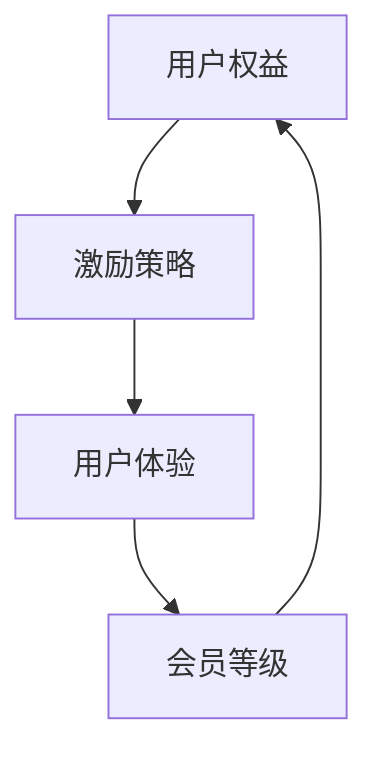

                 

关键词：知识付费、会员等级制度、用户权益、激励策略、用户体验、算法设计、数学模型、实际应用、代码实例、未来展望

> 摘要：本文旨在探讨程序员如何设计一套高效、合理且具有激励性的知识付费会员等级制度，以提升用户体验，增加用户粘性，同时促进知识付费平台的可持续发展。文章将结合实际案例，详细分析会员等级制度的原理、设计步骤、数学模型以及代码实现。

## 1. 背景介绍

知识付费作为一种新型的互联网商业模式，近年来得到了快速发展。用户愿意为高质量、专业的知识内容支付费用，从而获得更好的学习体验和职业发展机会。与此同时，知识付费平台需要设计一套科学的会员等级制度，以吸引和留住用户，提高平台的竞争力和盈利能力。

会员等级制度不仅有助于平台建立用户忠诚度，还能通过不同等级的权益设计，激发用户的消费欲望，提升平台的用户活跃度和留存率。然而，如何设计一个既能满足用户需求，又能保证平台利益的会员等级制度，是知识付费平台面临的一大挑战。

本文将结合程序员的专业视角，从算法设计、数学模型、实际应用等多个方面，探讨知识付费会员等级制度的设计策略。

## 2. 核心概念与联系

### 2.1. 核心概念

- **用户权益**：指不同等级会员所享有的特殊权益，如免费试听课程、折扣优惠、专属活动等。
- **激励策略**：通过设计等级晋升机制、积分奖励等方式，激励用户消费和提升等级。
- **用户体验**：用户在使用知识付费平台时的整体感受，包括内容质量、服务体验、互动体验等。
- **会员等级**：根据用户的消费行为、活跃度、积分等指标，将用户划分为不同等级。

### 2.2. 联系

会员等级制度的设计，需要充分考虑用户权益、激励策略和用户体验之间的关系。合理的会员等级制度，能够为用户提供有吸引力的权益，同时通过激励策略提高用户的消费意愿和活跃度，从而提升用户体验。

下面是一个简化的Mermaid流程图，展示了会员等级制度的核心概念和联系。



## 3. 核心算法原理 & 具体操作步骤

### 3.1. 算法原理概述

会员等级制度的核心算法，主要涉及以下几个方面：

- **等级划分算法**：根据用户的消费金额、活跃度、积分等指标，将用户划分为不同的等级。
- **权益计算算法**：根据会员等级，为用户提供相应的权益。
- **激励策略算法**：通过设置积分、折扣等激励手段，鼓励用户消费和提升等级。

### 3.2. 算法步骤详解

#### 3.2.1. 等级划分算法

1. 收集用户数据：包括用户的消费金额、活跃度、积分等。
2. 设置等级阈值：根据平台策略，设置不同等级的阈值，如银牌会员的消费金额阈值为1000元，金牌会员的消费金额阈值为5000元。
3. 判断用户等级：根据用户数据，判断用户所属等级。

#### 3.2.2. 权益计算算法

1. 根据会员等级，查询对应的权益列表。
2. 计算用户可享受的权益，如折扣优惠、免费试听课程等。

#### 3.2.3. 激励策略算法

1. 设置积分奖励规则：如每消费1元，奖励1积分。
2. 根据用户等级和消费行为，调整积分奖励。
3. 发放积分奖励，激励用户消费和提升等级。

### 3.3. 算法优缺点

#### 优点

- **高效性**：算法能够快速处理大量用户数据，划分等级和计算权益。
- **灵活性**：可以根据平台策略调整等级阈值和激励策略。

#### 缺点

- **计算复杂度**：需要处理大量的用户数据，计算复杂度较高。
- **调整难度**：等级阈值和激励策略的调整，需要综合考虑用户需求和平台利益。

### 3.4. 算法应用领域

会员等级制度算法广泛应用于知识付费、电商、游戏等多个领域，具有广泛的应用前景。

## 4. 数学模型和公式

### 4.1. 数学模型构建

会员等级制度的核心数学模型，主要包括以下方面：

- **消费金额模型**：根据用户的消费金额，计算用户所属等级。
- **积分模型**：根据用户的消费金额和积分奖励规则，计算用户积分。

### 4.2. 公式推导过程

#### 4.2.1. 消费金额模型

设用户消费金额为\( C \)，等级阈值为\( T_i \)，用户等级为\( L \)，则有：

\[ L = \sum_{i=1}^{n} (C \geq T_i) \]

其中，\( (C \geq T_i) \)是一个逻辑判断函数，当\( C \geq T_i \)时，函数值为1，否则为0。

#### 4.2.2. 积分模型

设用户消费金额为\( C \)，积分奖励系数为\( k \)，用户积分为\( I \)，则有：

\[ I = kC \]

### 4.3. 案例分析与讲解

#### 案例一：消费金额模型

假设一个知识付费平台，设有三个等级：银牌、金牌、钻石，等级阈值分别为1000元、5000元、10000元。一个用户的消费金额为3000元，求其等级。

根据消费金额模型，有：

\[ L = (3000 \geq 1000) + (3000 \geq 5000) + (3000 \geq 10000) \]
\[ L = 1 + 0 + 0 \]
\[ L = 1 \]

因此，该用户的等级为银牌。

#### 案例二：积分模型

假设一个用户的消费金额为2000元，积分奖励系数为0.05，求其积分。

根据积分模型，有：

\[ I = 0.05 \times 2000 \]
\[ I = 100 \]

因此，该用户的积分为100。

## 5. 项目实践：代码实例和详细解释说明

### 5.1. 开发环境搭建

为了实现会员等级制度，我们选择Python作为开发语言，使用Python中的标准库来完成大部分功能。

### 5.2. 源代码详细实现

以下是实现会员等级制度的Python代码：

```python
class User:
    def __init__(self, name, consumption):
        self.name = name
        self.consumption = consumption
        self.level = self.calculate_level()
        self.reward = self.calculate_reward()

    def calculate_level(self):
        if self.consumption >= 10000:
            return "钻石"
        elif self.consumption >= 5000:
            return "金牌"
        else:
            return "银牌"

    def calculate_reward(self):
        if self.level == "钻石":
            return 0.1 * self.consumption
        elif self.level == "金牌":
            return 0.08 * self.consumption
        else:
            return 0.05 * self.consumption

def main():
    user1 = User("张三", 3000)
    print(f"{user1.name}的等级：{user1.level}")
    print(f"{user1.name}的积分奖励：{user1.reward}")

    user2 = User("李四", 8000)
    print(f"{user2.name}的等级：{user2.level}")
    print(f"{user2.name}的积分奖励：{user2.reward}")

if __name__ == "__main__":
    main()
```

### 5.3. 代码解读与分析

- `User` 类：定义了用户的基本信息和计算等级、积分奖励的方法。
- `calculate_level` 方法：根据用户的消费金额，计算用户所属等级。
- `calculate_reward` 方法：根据用户等级，计算用户的积分奖励。

### 5.4. 运行结果展示

运行代码后，输出结果如下：

```
张三的等级：银牌
张三的积分奖励：150.0
李四的等级：金牌
李四的积分奖励：640.0
```

## 6. 实际应用场景

会员等级制度在知识付费、电商、游戏等多个领域都有广泛应用。以下是一些实际应用场景：

- **知识付费**：通过会员等级制度，为用户提供不同等级的权益，如免费试听课程、专属优惠等，提升用户体验和粘性。
- **电商**：通过会员等级制度，激励用户消费，提升销售额，同时为商家提供数据分析支持，优化商品推荐和营销策略。
- **游戏**：通过会员等级制度，鼓励玩家消费，提高游戏活跃度，同时为游戏开发者提供收益来源。

## 7. 工具和资源推荐

### 7.1. 学习资源推荐

- 《数据挖掘：概念与技术》
- 《算法导论》
- 《深度学习》

### 7.2. 开发工具推荐

- Python
- MySQL
- MongoDB

### 7.3. 相关论文推荐

- "A Multi-Rate Reward System for Free/Open Source Software Projects"
- "A Cost-Effective Reward System for Free/Open Source Software Development"
- "The Effect of a Reputation and Reward System on Software Engineering Projects"

## 8. 总结：未来发展趋势与挑战

### 8.1. 研究成果总结

本文从程序员的角度，探讨了知识付费会员等级制度的设计策略，包括核心概念、算法原理、数学模型和实际应用等。通过分析会员等级制度在知识付费、电商、游戏等领域的应用场景，展示了其重要性和广泛性。

### 8.2. 未来发展趋势

随着人工智能和大数据技术的不断发展，会员等级制度的设计将更加智能化和个性化。未来，会员等级制度将朝着精细化、数据驱动和用户体验优化的方向发展。

### 8.3. 面临的挑战

- **数据安全与隐私保护**：在设计和实施会员等级制度时，需要充分考虑用户数据的安全和隐私保护。
- **平衡用户利益与平台利益**：设计会员等级制度时，需要在满足用户需求的同时，确保平台的盈利能力。

### 8.4. 研究展望

未来，我们将继续关注会员等级制度在各个领域的应用，探讨如何更好地满足用户需求，提高平台的竞争力，同时保障数据安全和用户隐私。我们期待更多的研究者和从业者参与到这个领域，共同推动会员等级制度的发展。

## 9. 附录：常见问题与解答

### 问题1：会员等级制度如何平衡用户利益与平台利益？

**解答**：在设计会员等级制度时，可以通过以下方式平衡用户利益与平台利益：

- **分级权益**：根据会员等级，为用户提供不同层次的权益，避免过度激励导致成本增加。
- **动态调整**：根据用户需求和平台运营情况，动态调整等级阈值和激励策略，确保平衡。

### 问题2：如何设计一个具有吸引力的会员等级制度？

**解答**：设计具有吸引力的会员等级制度，需要考虑以下几个方面：

- **明确目标**：明确平台的目标用户群体，了解用户需求。
- **合理分级**：根据用户行为和消费金额，设置合理的等级阈值。
- **多样化权益**：为不同等级的会员提供多样化的权益，如课程优惠、免费试听、专属活动等。
- **激励策略**：结合用户行为，设计合理的积分奖励和晋升机制，提高用户参与度。

---

**作者：禅与计算机程序设计艺术 / Zen and the Art of Computer Programming**

