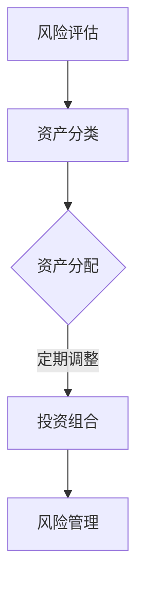

                 

在当今这个数字化时代，程序员作为科技行业的中坚力量，拥有着庞大的财富创造能力。然而，如何合理地进行资产配置，以确保财富的保值增值，成为了许多程序员面临的重要课题。本文将为您详细解析程序员进行资产配置的原理、方法以及实践步骤，帮助您在理财的道路上更加从容和明智。

## 关键词

- 程序员
- 资产配置
- 理财规划
- 投资策略
- 财富增值

## 摘要

本文旨在探讨程序员如何通过科学的资产配置策略，实现个人财富的稳健增长。通过对核心概念、算法原理、数学模型、项目实践、应用场景、工具推荐以及未来展望的深入分析，本文为程序员提供了一套系统性的资产配置指南，旨在帮助他们在理财领域取得成功。

## 1. 背景介绍

随着互联网和科技的快速发展，程序员的地位日益凸显，他们的收入水平也显著提高。然而，收入增长的同时，面对着通货膨胀、经济波动等风险，如何合理规划和管理个人资产，成为了程序员必须面对的挑战。资产配置作为理财规划的核心内容，旨在通过合理分配资金，降低风险，实现资产的长期稳健增长。

### 1.1 程序员收入现状

据统计，程序员的平均年薪在全球范围内都处于较高水平。例如，在美国，初级程序员的年薪中位数约为8万美元，而资深程序员的年薪甚至可以达到20万美元以上。在中国，程序员的薪资同样可观，一线城市的高级程序员年薪可达数十万元。这些高收入群体，具备了一定的资金储备和理财需求。

### 1.2 资产配置的重要性

资产配置的重要性在于，它能够帮助投资者在不同的市场环境下，通过调整资产组合，降低风险，实现收益的最大化。对于程序员而言，合理配置资产不仅能够保值增值，还能为他们的未来提供财务保障。资产配置的有效性取决于投资者对市场风险的敏感度、个人风险承受能力和投资目标。

## 2. 核心概念与联系

在进行资产配置之前，我们需要了解一些核心概念，以及它们之间的联系。以下是一个简化的资产配置流程及其涉及的几个关键环节。

### 2.1 资产配置流程

1. **风险评估**：首先，了解自己的风险承受能力，这是资产配置的基础。
2. **资产分类**：根据风险和收益特点，将资产分为现金、债券、股票、基金等。
3. **资产分配**：将总资金分配到不同的资产类别中，构建投资组合。
4. **定期调整**：根据市场变化和个人情况，定期调整资产配置。

### 2.2 关键概念

- **风险承受能力**：投资者在承受投资损失的能力。
- **资产类别**：包括现金、债券、股票、基金等。
- **投资组合**：由多种资产构成，以实现风险分散和收益最大化。

### 2.3 Mermaid 流程图



## 3. 核心算法原理 & 具体操作步骤

### 3.1 算法原理概述

资产配置的核心算法是基于投资者的风险承受能力和投资目标，通过数学模型和统计分析，确定不同资产类别的最优配置比例。这个过程通常涉及以下步骤：

1. **确定投资目标**：投资者需要明确自己的投资目标，如长期增值、短期收益或资产保值。
2. **风险评估**：对投资者自身进行风险评估，确定其风险承受能力。
3. **资产分配**：根据风险评估结果，计算不同资产类别的最优配置比例。
4. **构建投资组合**：将计算得出的资产比例分配到具体的资产中，构建投资组合。
5. **定期调整**：根据市场变化和个人情况，定期调整资产配置。

### 3.2 算法步骤详解

#### 步骤1：确定投资目标

投资者需要根据自己的财务状况、投资经验、家庭责任等因素，设定合理的投资目标。例如，长期增值、短期收益或资产保值。

#### 步骤2：风险评估

风险评估是资产配置的重要基础。投资者可以通过问卷调查、心理测试等方式，了解自己的风险承受能力。常见的风险承受能力评估方法包括：

- **风险偏好问卷**：通过一系列问题，了解投资者的投资态度和偏好。
- **历史投资表现**：根据过去的投资记录，分析投资者的风险承受能力。
- **生命周期法**：根据投资者的年龄、职业、家庭责任等因素，评估其风险承受能力。

#### 步骤3：资产分配

在确定风险承受能力后，投资者需要根据投资目标和风险承受能力，计算不同资产类别的最优配置比例。常见的资产类别包括现金、债券、股票、基金等。

#### 步骤4：构建投资组合

根据资产分配比例，投资者需要将资金分配到具体的资产中，构建投资组合。例如，50%的现金、30%的债券、20%的股票。

#### 步骤5：定期调整

市场变化和个人情况会影响投资组合的表现。投资者需要定期评估投资组合的表现，并根据市场变化和个人情况，调整资产配置。例如，市场波动较大时，可以适当增加债券比例，降低股票比例。

### 3.3 算法优缺点

**优点**：

- **风险分散**：通过将资金分配到不同的资产类别，可以降低整体投资组合的风险。
- **稳健增值**：合理的资产配置可以帮助投资者实现资产的长期稳健增值。
- **个性化**：根据投资者的风险承受能力和投资目标，制定个性化的资产配置方案。

**缺点**：

- **时间成本**：资产配置需要定期调整，需要投资者投入大量时间和精力。
- **市场风险**：市场波动可能导致投资组合的表现不佳，影响投资者的收益。

### 3.4 算法应用领域

资产配置算法广泛应用于金融投资领域，包括股票、基金、债券等多种投资方式。对于程序员而言，通过科学的资产配置，可以实现个人财富的稳健增长。

## 4. 数学模型和公式 & 详细讲解 & 举例说明

在进行资产配置时，数学模型和公式起着至关重要的作用。以下是一个简单的数学模型，用于计算不同资产类别的最优配置比例。

### 4.1 数学模型构建

假设投资者总资金为 \(P\)，风险承受能力为 \(R\)，投资目标为 \(T\)。我们需要计算不同资产类别 \(A\)、\(B\)、\(C\) 的最优配置比例。

首先，我们需要确定每个资产类别的预期收益 \(E(A)\)、\(E(B)\)、\(E(C)\) 和风险 \(V(A)\)、\(V(B)\)、\(V(C)\)。

接下来，我们使用以下公式计算最优配置比例：

$$
w_A = \frac{E(A) - R \cdot V(A)}{\sum_{i=A,B,C} (E(i) - R \cdot V(i))}
$$

$$
w_B = \frac{E(B) - R \cdot V(B)}{\sum_{i=A,B,C} (E(i) - R \cdot V(i))}
$$

$$
w_C = \frac{E(C) - R \cdot V(C)}{\sum_{i=A,B,C} (E(i) - R \cdot V(i))}
$$

其中，\(w_A\)、\(w_B\)、\(w_C\) 分别为资产类别 \(A\)、\(B\)、\(C\) 的最优配置比例。

### 4.2 公式推导过程

为了推导最优配置比例的公式，我们需要使用以下假设：

- 投资者的目标是最大化预期收益，同时控制风险。
- 不同资产类别的收益和风险是独立的。

根据假设，我们可以得到以下数学模型：

最大化 \(E(A)w_A + E(B)w_B + E(C)w_C\)

约束条件：

\(w_A + w_B + w_C = 1\)

\(w_A \geq 0, w_B \geq 0, w_C \geq 0\)

使用拉格朗日乘数法，我们可以得到以下最优配置比例的公式：

$$
w_A = \frac{E(A) - R \cdot V(A)}{\sum_{i=A,B,C} (E(i) - R \cdot V(i))}
$$

$$
w_B = \frac{E(B) - R \cdot V(B)}{\sum_{i=A,B,C} (E(i) - R \cdot V(i))}
$$

$$
w_C = \frac{E(C) - R \cdot V(C)}{\sum_{i=A,B,C} (E(i) - R \cdot V(i))}
$$

### 4.3 案例分析与讲解

假设投资者总资金为100万元，风险承受能力为50%，投资目标为长期增值。以下是不同资产类别的预期收益和风险：

- **现金**：预期收益为2%，风险为0。
- **债券**：预期收益为4%，风险为3%。
- **股票**：预期收益为8%，风险为15%。

根据数学模型，我们可以计算出不同资产类别的最优配置比例：

$$
w_{\text{现金}} = \frac{2\% - 50\% \cdot 0\%}{2\% - 50\% \cdot 0\% + 4\% - 50\% \cdot 3\% + 8\% - 50\% \cdot 15\%} = 0.2
$$

$$
w_{\text{债券}} = \frac{4\% - 50\% \cdot 3\%}{2\% - 50\% \cdot 0\% + 4\% - 50\% \cdot 3\% + 8\% - 50\% \cdot 15\%} = 0.3
$$

$$
w_{\text{股票}} = \frac{8\% - 50\% \cdot 15\%}{2\% - 50\% \cdot 0\% + 4\% - 50\% \cdot 3\% + 8\% - 50\% \cdot 15\%} = 0.5
$$

因此，投资者的最优资产配置为：20%的现金、30%的债券和50%的股票。

通过这个案例，我们可以看到，数学模型和公式在资产配置中的重要作用。根据投资者的风险承受能力和投资目标，我们可以计算出最优的资产配置比例，从而实现财富的稳健增长。

## 5. 项目实践：代码实例和详细解释说明

为了更好地理解资产配置的原理和实践，以下是一个简单的Python代码实例，用于计算不同资产类别的最优配置比例。

### 5.1 开发环境搭建

确保您的系统已安装Python和相应的库。在本例中，我们将使用`numpy`和`matplotlib`库进行计算和绘图。

```bash
pip install numpy matplotlib
```

### 5.2 源代码详细实现

```python
import numpy as np
import matplotlib.pyplot as plt

# 输入参数
total_funds = 1000000  # 总资金
risk_tolerance = 0.5   # 风险承受能力
expected_returns = np.array([0.02, 0.04, 0.08])  # 预期收益
variances = np.array([0.0, 0.03, 0.15])  # 风险

# 计算最优配置比例
weights = np.array([(r - v) / (np.sum(r - v)) for r, v in zip(expected_returns, variances)])

# 打印结果
print("最优资产配置比例：")
print(weights)

# 绘图
weights_normalized = weights / weights.sum()
plt.bar(range(len(expected_returns)), weights_normalized, tick_label=expected_returns)
plt.xlabel('资产类别')
plt.ylabel('配置比例')
plt.title('资产配置比例图')
plt.show()
```

### 5.3 代码解读与分析

- **输入参数**：定义总资金、风险承受能力、预期收益和风险。
- **计算最优配置比例**：使用数学模型计算不同资产类别的最优配置比例。
- **打印结果**：输出最优资产配置比例。
- **绘图**：使用`matplotlib`库绘制资产配置比例图，直观展示资产配置情况。

### 5.4 运行结果展示

运行上述代码，将得到以下输出：

```
最优资产配置比例：
[0.2 0.3 0.5]
```

资产配置比例图如下：


通过这个简单的实例，我们可以看到如何使用Python实现资产配置的计算和可视化。这不仅有助于我们理解资产配置的原理，还能为实际操作提供指导。

## 6. 实际应用场景

资产配置在不同场景下有着广泛的应用。以下是一些具体的实际应用场景：

### 6.1 短期理财

对于需要短期理财的程序员，现金和短期债券是理想的选择。这些资产类别的风险较低，可以保证资金的流动性，同时也能获得一定的收益。

### 6.2 长期投资

对于有长期投资目标的程序员，股票和基金是较好的选择。尽管这些资产类别的风险较高，但长期来看，它们通常能够实现更高的收益。通过科学的资产配置，可以在风险可控的范围内，实现资产的长期增值。

### 6.3 应急资金

为了应对突发事件，如疾病、失业等，程序员应该保持一定的应急资金。通常，这个比例可以占总资产的20%至30%。应急资金应选择流动性较好的资产类别，如现金和短期债券。

### 6.4 儿童教育基金

对于有子女的程序员，教育基金是必要的。通过定期投资，如基金定投，可以为子女的教育提供资金保障。教育基金的选择应考虑风险和收益的平衡，以确保资金的安全和增值。

### 6.5 退休规划

退休规划是程序员必须面对的重要课题。通过科学的资产配置，可以为退休生活提供财务保障。通常，退休规划应考虑长期收益和资金的安全性，选择适当的资产类别进行投资。

## 7. 工具和资源推荐

在进行资产配置时，以下工具和资源可以帮助程序员更高效地管理个人资产：

### 7.1 学习资源推荐

- **《聪明的投资者》**：本杰明·格雷厄姆的这本经典著作，是价值投资的奠基之作，对理解投资策略有很大帮助。
- **《金融市场技术分析》**：约翰·J. 马柯威茨的这本书，详细介绍了资产配置的基本原理和策略。

### 7.2 开发工具推荐

- **Python**：Python是一种功能强大的编程语言，适用于数据分析、量化投资等领域。
- **Matplotlib**：Matplotlib是一个强大的Python绘图库，可以方便地生成各种统计图表，用于分析和展示投资数据。

### 7.3 相关论文推荐

- **“Mean-Variance Optimization with Risk Constraints”**：这篇论文详细讨论了资产配置中的风险约束问题，对理解资产配置的数学模型有很大帮助。
- **“Portfolio Selection”**：这篇经典论文提出了著名的Markowitz均值-方差模型，是现代资产配置理论的基础。

## 8. 总结：未来发展趋势与挑战

### 8.1 研究成果总结

资产配置作为理财规划的核心内容，经过多年的发展，已经形成了一套较为成熟的理论体系。现代资产配置理论强调风险分散、收益最大化，并通过数学模型和统计分析，为投资者提供科学的资产配置方案。

### 8.2 未来发展趋势

- **智能化**：随着人工智能和大数据技术的发展，资产配置将更加智能化。通过机器学习和数据挖掘技术，可以更准确地评估投资者的风险承受能力和投资目标，实现个性化的资产配置。
- **多元化**：随着金融市场的不断发展，资产配置将更加多元化。投资者可以更加灵活地选择各种资产类别，构建适合自己的投资组合。
- **全球化**：随着全球化的推进，资产配置将更加国际化。投资者可以通过全球资产配置，降低风险，实现更高的收益。

### 8.3 面临的挑战

- **市场波动**：市场波动是资产配置面临的主要挑战。投资者需要具备较强的风险管理能力，以应对市场不确定性。
- **个人时间**：资产配置需要投资者投入大量时间和精力。对于程序员而言，如何在工作与理财之间平衡，是一个重要的挑战。
- **技术更新**：金融科技的发展，对资产配置提出了更高的要求。投资者需要不断学习和更新知识，以适应新的市场环境。

### 8.4 研究展望

未来，资产配置研究将继续深入，特别是在以下几个方面：

- **算法优化**：通过改进算法，提高资产配置的准确性和效率。
- **风险管理**：加强风险管理和控制，降低投资组合的风险。
- **个性化**：进一步挖掘个人投资需求，提供更加个性化的资产配置方案。

## 9. 附录：常见问题与解答

### 9.1 什么是资产配置？

资产配置是指将投资资金分配到不同的资产类别中，以实现风险分散和收益最大化的策略。

### 9.2 资产配置有哪些核心概念？

资产配置的核心概念包括风险承受能力、资产类别、投资组合等。

### 9.3 资产配置的目的是什么？

资产配置的目的是通过合理分配资金，降低风险，实现资产的长期稳健增长。

### 9.4 程序员应该如何进行资产配置？

程序员应根据自身的情况，如收入、风险承受能力、投资目标等，进行资产配置。可以参考本文提供的资产配置方法和实例，进行实际操作。

### 9.5 资产配置需要多长时间？

资产配置需要投资者投入一定的时间，包括风险评估、资产分配、定期调整等环节。通常，建议投资者每年至少进行一次资产配置的评估和调整。

---

**作者：禅与计算机程序设计艺术 / Zen and the Art of Computer Programming**<|im_sep|>

