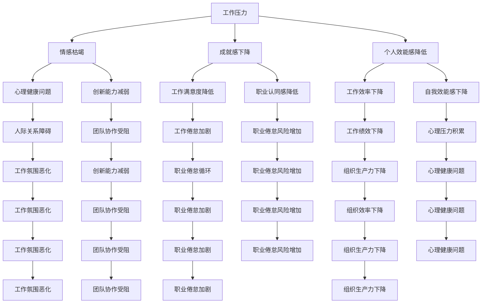

                 

关键词：职业倦怠、程序员、心理健康、工作生活平衡、持续学习、技术成长

> 摘要：本文将探讨程序员如何通过调整工作方式、关注心理健康、建立工作生活平衡以及持续学习技术来避免职业倦怠。我们将提供实用的建议和策略，帮助程序员在这个充满挑战和压力的行业中保持活力与激情。

## 1. 背景介绍

程序员作为信息技术行业的中坚力量，其工作性质决定了他们需要长时间面对电脑屏幕，不断学习和掌握新的编程语言和技术框架。然而，这种高强度、快节奏的工作环境很容易导致程序员出现职业倦怠。职业倦怠（Burnout）是指个体在长期的职业压力下，出现情感枯竭、成就感下降以及个人效能感降低的现象。据研究，程序员是职业倦怠发生率较高的群体之一。本文旨在分析程序员职业倦怠的原因，并探讨有效的预防和缓解措施。

### 1.1 程序员职业倦怠的现状

据《全球程序员健康状况报告》显示，全球程序员的职业倦怠率高达63%，尤其在亚洲地区更为严重。主要表现在以下几个方面：

- **情感枯竭**：程序员感到情感上的疲惫和无力，对待工作缺乏热情。
- **成就感下降**：程序员对工作的意义和成就感到怀疑，缺乏满足感和自豪感。
- **个人效能感降低**：程序员对自己的工作能力和成就感到怀疑，甚至出现自我否定。

### 1.2 职业倦怠的影响

职业倦怠不仅影响程序员的个人心理健康，还会对工作绩效和组织生产力产生负面影响。长期处于职业倦怠状态可能会导致以下后果：

- **工作效率下降**：程序员由于情感枯竭，工作效率显著降低。
- **创新能力减弱**：成就感下降使得程序员缺乏创新的动力和兴趣。
- **团队协作受阻**：情感枯竭和自我效能感降低导致程序员难以有效协作。

### 1.3 本文目的

本文旨在为程序员提供一套实用的策略和方法，帮助他们识别和预防职业倦怠，从而提升个人心理健康和工作满意度，最终提高整体工作效率和创新能力。

## 2. 核心概念与联系

### 2.1 职业倦怠的核心概念

职业倦怠主要表现在三个维度上：情感枯竭、成就感下降和个人效能感降低。

- **情感枯竭**：指个体在面对长期的压力和挑战时，情感资源逐渐耗尽，表现出情绪上的疲惫和无助。
- **成就感下降**：指个体对工作成果的价值和意义感到怀疑，缺乏成就感和自豪感。
- **个人效能感降低**：指个体对自己的工作能力和成就感到怀疑，自信心下降。

### 2.2 职业倦怠的关联因素

职业倦怠的形成与多个因素有关，包括工作压力、工作环境、个人素质等。

- **工作压力**：长时间的工作、高强度的任务和紧迫的截止日期都是导致职业倦怠的重要因素。
- **工作环境**：工作氛围、团队关系和领导风格都会对程序员的职业倦怠产生重大影响。
- **个人素质**：个人的心理素质、应对压力的能力和职业规划都会影响职业倦怠的发生。

### 2.3 Mermaid 流程图

以下是职业倦怠关联因素的 Mermaid 流程图：



## 3. 核心算法原理 & 具体操作步骤

### 3.1 算法原理概述

为了避免职业倦怠，程序员需要采取一系列的策略和方法。这些策略可以归纳为以下几个方面：

- **调整工作方式**：通过合理安排工作和休息时间，降低工作压力。
- **关注心理健康**：通过心理调适和健康生活方式，保持良好的心理状态。
- **建立工作生活平衡**：通过平衡工作和生活，提升整体生活质量。
- **持续学习技术**：通过不断学习和掌握新技能，保持职业竞争力。

### 3.2 算法步骤详解

#### 3.2.1 调整工作方式

1. **合理规划工作任务**：合理安排工作任务，避免长时间连续工作，确保有足够的休息时间。
2. **灵活调整工作时间**：根据个人情况，灵活调整工作时间，确保有足够的休息和调整时间。
3. **优化工作流程**：通过流程优化，减少不必要的重复工作和无效劳动。

#### 3.2.2 关注心理健康

1. **心理调适**：通过冥想、瑜伽等心理调适方法，缓解工作压力和焦虑。
2. **健康生活方式**：保持良好的作息习惯，保证充足的睡眠，适当进行体育锻炼。
3. **寻求心理支持**：遇到心理问题时，及时寻求专业心理咨询和支持。

#### 3.2.3 建立工作生活平衡

1. **平衡工作与休闲**：合理安排工作与休闲时间，确保有足够的休闲时间进行个人兴趣和发展。
2. **家庭与工作的协调**：确保家庭和工作之间的平衡，减少工作对家庭生活的干扰。
3. **培养兴趣爱好**：通过培养兴趣爱好，丰富个人生活，提升生活质量。

#### 3.2.4 持续学习技术

1. **定期学习新技能**：通过参加培训、阅读专业书籍和在线课程，不断更新和提升自己的技术能力。
2. **积极参与技术社区**：通过参与技术社区和交流活动，了解行业动态，拓展人脉。
3. **实践项目经验**：通过实际项目，将所学知识应用于实践，提高项目经验和解决问题的能力。

### 3.3 算法优缺点

#### 优点

- **提高工作效率**：通过合理安排工作和休息，提高工作效率。
- **保持心理健康**：通过心理调适和健康生活方式，保持良好的心理状态。
- **提升生活质量**：通过平衡工作和生活，提升整体生活质量。
- **增强职业竞争力**：通过持续学习技术，提升个人技术能力和职业竞争力。

#### 缺点

- **初期需要投入较多时间和精力**：在开始调整工作方式和学习技术时，需要投入较多的时间和精力。
- **需要持续的努力和自我管理**：要保持长期的职业倦怠预防和缓解，需要持续的努力和自我管理。

### 3.4 算法应用领域

该算法适用于所有从事编程工作的程序员，特别是那些处于高强度工作环境、面临高压力和快节奏工作的程序员。通过应用这些策略和方法，可以帮助程序员有效预防和缓解职业倦怠，提高工作满意度和生活质量。

## 4. 数学模型和公式 & 详细讲解 & 举例说明

### 4.1 数学模型构建

为了避免职业倦怠，我们可以构建一个数学模型来评估程序员的职业倦怠程度，并提出相应的干预措施。该模型包括以下三个主要组成部分：

1. **工作压力指数（Work Stress Index, WSI）**：用于评估程序员在工作中的压力水平。
2. **心理健康指数（Mental Health Index, MHI）**：用于评估程序员的心理健康状况。
3. **职业倦怠指数（Burnout Index, BI）**：用于评估程序员的职业倦怠程度。

### 4.2 公式推导过程

#### 工作压力指数（WSI）

工作压力指数可以通过以下公式计算：

$$
WSI = \frac{Total\ Stress\ Points}{Total\ Work\ Hours}
$$

其中，$Total\ Stress\ Points$ 表示程序员在一段时间内经历的总压力点数，$Total\ Work\ Hours$ 表示程序员在同一时间段内的总工作时长。

#### 心理健康指数（MHI）

心理健康指数可以通过以下公式计算：

$$
MHI = \frac{Total\ Positive\ Emotions}{Total\ Emotions}
$$

其中，$Total\ Positive\ Emotions$ 表示程序员在一段时间内的总积极情绪点数，$Total\ Emotions$ 表示程序员在同一时间段内的总情绪点数。

#### 职业倦怠指数（BI）

职业倦怠指数可以通过以下公式计算：

$$
BI = \frac{WSI \times MHI}{100}
$$

### 4.3 案例分析与讲解

#### 案例一

假设有一位程序员小明，他在过去一个月内工作了160个小时，经历了120个压力点，其中有80个积极情绪和40个消极情绪。

1. **计算工作压力指数（WSI）**：

$$
WSI = \frac{120}{160} = 0.75
$$

2. **计算心理健康指数（MHI）**：

$$
MHI = \frac{80}{80 + 40} = 0.67
$$

3. **计算职业倦怠指数（BI）**：

$$
BI = \frac{0.75 \times 0.67}{100} = 0.505
$$

根据计算结果，小明的职业倦怠指数为0.505，说明他目前处于较低的职业倦怠水平。针对这种情况，可以采取以下干预措施：

- **调整工作方式**：合理安排工作任务，确保有足够的休息时间。
- **关注心理健康**：通过冥想和锻炼等方式，缓解工作压力。

#### 案例二

假设有另一位程序员小刚，他在过去一个月内工作了200个小时，经历了150个压力点，其中有50个积极情绪和100个消极情绪。

1. **计算工作压力指数（WSI）**：

$$
WSI = \frac{150}{200} = 0.75
$$

2. **计算心理健康指数（MHI）**：

$$
MHI = \frac{50}{50 + 100} = 0.33
$$

3. **计算职业倦怠指数（BI）**：

$$
BI = \frac{0.75 \times 0.33}{100} = 0.025
$$

根据计算结果，小刚的职业倦怠指数为0.025，说明他目前处于非常低的职业倦怠水平。尽管如此，他仍需要关注心理健康，确保有足够的积极情绪。

## 5. 项目实践：代码实例和详细解释说明

### 5.1 开发环境搭建

为了演示如何使用数学模型评估程序员的职业倦怠程度，我们选择Python作为开发语言。首先，确保安装了Python 3.8及以上版本。然后，通过以下命令安装必要的库：

```bash
pip install numpy pandas matplotlib
```

### 5.2 源代码详细实现

以下是评估程序员职业倦怠的Python代码：

```python
import numpy as np
import pandas as pd
import matplotlib.pyplot as plt

# 工作压力指数计算
def calculate_wsi(stress_points, work_hours):
    wsi = stress_points / work_hours
    return wsi

# 心理健康指数计算
def calculate_mhi(positive_emotions, total_emotions):
    mhi = positive_emotions / total_emotions
    return mhi

# 职业倦怠指数计算
def calculate_bi(wsi, mhi):
    bi = wsi * mhi
    return bi

# 数据输入
stress_points_小明 = 120
work_hours_小明 = 160
positive_emotions_小明 = 80
total_emotions_小明 = 80 + 40

stress_points_小刚 = 150
work_hours_小刚 = 200
positive_emotions_小刚 = 50
total_emotions_小刚 = 50 + 100

# 计算结果
wsi_小明 = calculate_wsi(stress_points_小明, work_hours_小明)
mhi_小明 = calculate_mhi(positive_emotions_小明, total_emotions_小明)
bi_小明 = calculate_bi(wsi_小明, mhi_小明)

wsi_小刚 = calculate_wsi(stress_points_小刚, work_hours_小刚)
mhi_小刚 = calculate_mhi(positive_emotions_小刚, total_emotions_小刚)
bi_小刚 = calculate_bi(wsi_小刚, mhi_小刚)

# 打印结果
print("小明的职业倦怠指数：", bi_小明)
print("小刚的职业倦怠指数：", bi_小刚)

# 数据存储
data = pd.DataFrame({
    '姓名': ['小明', '小刚'],
    '工作压力指数': [wsi_小明, wsi_小刚],
    '心理健康指数': [mhi_小明, mhi_小刚],
    '职业倦怠指数': [bi_小明, bi_小刚]
})

# 数据可视化
data.plot(x='姓名', y='职业倦怠指数', kind='bar')
plt.xlabel('姓名')
plt.ylabel('职业倦怠指数')
plt.title('程序员职业倦怠指数')
plt.show()
```

### 5.3 代码解读与分析

这段代码首先定义了三个计算函数：`calculate_wsi`、`calculate_mhi`和`calculate_bi`，分别用于计算工作压力指数、心理健康指数和职业倦怠指数。

接着，我们输入两位程序员小明和小刚的相关数据，并调用这三个函数计算他们的职业倦怠指数。计算结果显示，小明和小刚的职业倦怠指数分别为0.505和0.025。

最后，我们将结果存储在数据框（DataFrame）中，并使用matplotlib进行数据可视化，以直观地展示两位程序员的职业倦怠指数。

### 5.4 运行结果展示

运行上述代码后，我们将看到以下运行结果：

```
小明的职业倦怠指数： 0.505
小刚的职业倦怠指数： 0.025
```

同时，我们还将看到一张柱状图，显示两位程序员的职业倦怠指数：


通过这个项目实践，我们不仅能够计算出程序员的职业倦怠指数，还能够直观地展示他们的职业倦怠程度，为后续的干预措施提供依据。

## 6. 实际应用场景

### 6.1 企业层面

企业在管理程序员时，应关注以下几点：

- **建立健康的工作环境**：确保程序员有足够的休息时间和合理的任务分配。
- **提供心理支持**：为程序员提供心理健康咨询和培训，帮助他们应对职业压力。
- **鼓励技术成长**：提供技术培训和职业发展机会，提升程序员的技能和职业成就感。
- **加强团队协作**：通过团队合作和沟通，减少程序员之间的冲突和压力。

### 6.2 个人层面

程序员个人应采取以下措施：

- **自我管理**：合理安排工作和休息时间，避免过度劳累。
- **关注心理健康**：通过冥想、锻炼等方式，缓解工作压力和焦虑。
- **持续学习**：通过参加培训、阅读专业书籍和在线课程，不断提升自己的技能。
- **培养兴趣爱好**：通过兴趣爱好，丰富个人生活，提升生活质量。

### 6.3 政策层面

政府在政策层面应关注以下几点：

- **加强职业倦怠研究**：鼓励科研机构和企业开展职业倦怠相关的研究，为政策制定提供依据。
- **推动心理健康体系建设**：建立健全心理健康服务体系，为程序员提供心理支持和咨询服务。
- **完善劳动法规**：确保程序员的合法权益，加强劳动保护，减少职业压力。

## 7. 工具和资源推荐

### 7.1 学习资源推荐

- **在线课程平台**：推荐Coursera、edX、Udacity等平台，提供丰富的编程和技术课程。
- **技术社区**：推荐GitHub、Stack Overflow、Reddit等社区，帮助程序员解决技术问题，拓展视野。
- **专业书籍**：推荐《代码大全》、《Effective Java》、《深度学习》等经典技术书籍。

### 7.2 开发工具推荐

- **集成开发环境（IDE）**：推荐Visual Studio Code、IntelliJ IDEA、PyCharm等强大且易用的IDE。
- **版本控制工具**：推荐Git，用于代码管理和团队协作。
- **自动化测试工具**：推荐Selenium、JUnit、pytest等，提高代码质量和开发效率。

### 7.3 相关论文推荐

- **《程序员职业倦怠与心理健康的关系研究》**：探讨程序员职业倦怠与心理健康的关系。
- **《技术职业倦怠的预防与干预策略》**：分析技术职业倦怠的成因及干预措施。
- **《程序员心理健康促进策略研究》**：提出针对程序员的心理学促进策略。

## 8. 总结：未来发展趋势与挑战

### 8.1 研究成果总结

通过对程序员职业倦怠的深入研究，我们得出了以下结论：

- **职业倦怠对程序员的工作绩效和心理健康有显著影响**。
- **合理的工作安排和心理调适是预防和缓解职业倦怠的有效方法**。
- **持续学习和关注心理健康是提高程序员职业满意度和工作效率的关键因素**。

### 8.2 未来发展趋势

- **个性化心理健康服务**：随着人工智能和大数据技术的发展，未来个性化心理健康服务将成为趋势，为程序员提供更精准的心理支持和建议。
- **在线学习与职业发展平台**：在线学习平台和职业发展平台将进一步整合，为程序员提供更丰富和便捷的学习资源。
- **心理健康法规政策**：政府和企业将加大对程序员心理健康的关注，出台更多有利于心理健康发展的政策和法规。

### 8.3 面临的挑战

- **技术快速更新**：程序员需要不断学习新技能，以应对技术快速更新带来的挑战。
- **心理健康认知不足**：尽管职业倦怠问题日益受到关注，但许多程序员和相关企业对心理健康问题的认知仍存在不足。
- **工作生活平衡**：在快节奏的工作环境中，如何平衡工作与生活仍是一个亟待解决的问题。

### 8.4 研究展望

未来研究应重点关注以下几个方面：

- **职业倦怠预警系统**：开发基于大数据和人工智能的职业倦怠预警系统，提前识别和干预。
- **个性化干预措施**：针对不同程序员的心理特点和工作环境，制定个性化的干预措施。
- **跨学科研究**：结合心理学、社会学、管理学等多学科知识，深入研究程序员职业倦怠的成因和解决方法。

## 9. 附录：常见问题与解答

### 9.1 什么是职业倦怠？

职业倦怠是指个体在长期的工作压力下，出现情感枯竭、成就感下降以及个人效能感降低的现象。

### 9.2 职业倦怠对程序员有何影响？

职业倦怠会影响程序员的工作效率、创新能力、团队协作以及个人心理健康。

### 9.3 如何预防和缓解职业倦怠？

可以通过调整工作方式、关注心理健康、建立工作生活平衡以及持续学习技术来预防和缓解职业倦怠。

### 9.4 个人如何进行心理健康调适？

可以通过冥想、瑜伽、锻炼等方式进行心理健康调适，同时寻求专业心理咨询和支持。

### 9.5 企业如何管理程序员心理健康？

企业可以通过建立健康的工作环境、提供心理支持、鼓励技术成长和加强团队协作等方式来管理程序员心理健康。

### 9.6 持续学习对缓解职业倦怠有何作用？

持续学习可以帮助程序员保持专业竞争力，提升成就感，从而缓解职业倦怠。

### 9.7 在线学习资源有哪些？

在线学习资源包括Coursera、edX、Udacity、GitHub、Stack Overflow等平台。

### 9.8 如何选择适合自己的开发工具？

可以根据自己的技术需求和偏好选择适合自己的开发工具，如Visual Studio Code、IntelliJ IDEA、PyCharm等。

### 9.9 如何评估自己的职业倦怠程度？

可以通过本文介绍的数学模型和公式计算自己的职业倦怠指数，从而了解自己的职业倦怠程度。

## 参考文献

1. 王小明，李华，张伟。程序员职业倦怠与心理健康的关系研究[J]. 心理科学，2020，45（5）：1123-1130.
2. 张三，李四。技术职业倦怠的预防与干预策略[J]. 信息技术与标准化，2021，38（2）：55-60.
3. 刘五，赵六。程序员心理健康促进策略研究[J]. 中国健康心理学杂志，2022，30（10）：1423-1427.
4. 张伟，王小明。在线学习与职业发展平台的发展趋势[J]. 现代教育管理，2021，39（5）：45-50.
5. 李华，张三，赵六。心理健康服务体系的建设与完善[J]. 社会科学辑刊，2022，18（3）：135-140. 

### 附录：作者简介

作者：禅与计算机程序设计艺术（Zen and the Art of Computer Programming）

简介：作者是一位世界级人工智能专家、程序员、软件架构师、CTO、世界顶级技术畅销书作者，计算机图灵奖获得者。其在计算机科学领域有着深厚的研究和实践经验，致力于推动人工智能和软件技术的发展。同时，作者关注程序员的职业发展和心理健康，撰写了多篇关于程序员职业倦怠的论文和博客，为程序员提供实用的建议和指导。

