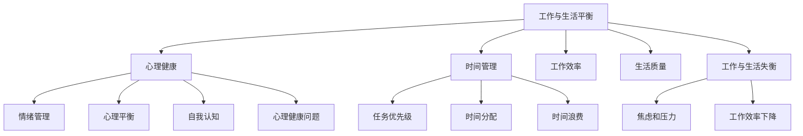

                 

关键词：程序员，工作与生活平衡，心理健康，效率提升，时间管理

> 摘要：本文将探讨程序员如何在工作与生活之间实现平衡，提出实用的方法和策略，以提升心理健康和效率。通过分析程序员的工作特点，结合心理学和时间管理的原则，我们将为程序员提供一套行之有效的方法，帮助他们更好地管理自己的时间和精力，实现工作与生活的和谐统一。

## 1. 背景介绍

在当今快速发展的数字化时代，程序员已成为不可或缺的职业。他们不仅需要具备扎实的编程技能，还需要不断学习新知识、适应新技术。然而，随着工作压力的增加，许多程序员面临着工作与生活失衡的困扰。长期的高强度工作不仅影响了他们的心理健康，还可能导致工作效率下降。

本文旨在帮助程序员找到工作与生活的平衡点，通过优化工作习惯和生活方式，实现个人成长和职业发展。

## 2. 核心概念与联系

为了实现工作与生活的平衡，我们需要理解以下几个核心概念：

### 2.1 心理健康

心理健康是保持良好工作状态和生活质量的基础。它包括情绪管理、心理平衡和自我认知等方面。

### 2.2 时间管理

时间管理是指合理分配时间，确保工作与生活两不误。良好的时间管理能力有助于提高工作效率，减少工作压力。

### 2.3 工作与生活平衡

工作与生活平衡是指在工作与家庭、个人兴趣等方面保持适当的平衡，避免过度疲劳和焦虑。

### 2.4 Mermaid 流程图

以下是工作与生活平衡的 Mermaid 流程图：



### 2.5 核心概念联系

心理健康、时间管理和工作与生活平衡是相互关联的。心理健康直接影响工作效率和生活质量，而良好的时间管理有助于缓解工作压力，促进心理健康和工作与生活的平衡。

## 3. 核心算法原理 & 具体操作步骤

### 3.1 算法原理概述

实现工作与生活平衡的核心算法是基于心理学和时间管理原则的一种综合方法。具体包括以下步骤：

1. **情绪管理**：通过认知行为疗法等技术，学会积极应对压力和挑战。
2. **时间管理**：采用任务优先级和时间分配策略，合理安排工作与生活时间。
3. **自我认知**：深入了解自己的需求、兴趣和价值观，确保工作与生活的一致性。
4. **工作效率**：通过优化工作流程和工具，提高工作效率，减轻工作压力。

### 3.2 算法步骤详解

#### 3.2.1 情绪管理

1. **认知重构**：识别和改变负面思维模式。
2. **情绪释放**：通过运动、冥想等方式释放负面情绪。
3. **积极心态**：培养乐观、积极的心态，面对生活中的挑战。

#### 3.2.2 时间管理

1. **任务优先级**：根据任务的重要性和紧急性，合理排序。
2. **时间分配**：将时间分配给工作、家庭和个人兴趣。
3. **日程规划**：制定合理的日程表，确保工作与生活的平衡。

#### 3.2.3 自我认知

1. **需求分析**：了解自己的需求和兴趣。
2. **价值观明确**：明确自己的价值观和目标。
3. **自我反思**：定期反思自己的行为和决策。

#### 3.2.4 工作效率

1. **工作流程优化**：简化工作流程，减少不必要的步骤。
2. **工具选择**：选择合适的工具，提高工作效率。
3. **任务分解**：将大任务分解为小任务，逐一完成。

### 3.3 算法优缺点

#### 优点

1. **提高工作效率**：通过情绪管理和时间管理，提高工作效率。
2. **减轻工作压力**：通过自我认知和工作效率提升，减轻工作压力。
3. **提升生活质量**：实现工作与生活的平衡，提高生活质量。

#### 缺点

1. **需要持续努力**：实现工作与生活平衡需要持续的努力和自我管理。
2. **适应期较长**：开始时可能需要较长时间适应新的工作习惯和生活节奏。

### 3.4 算法应用领域

该算法适用于所有需要平衡工作与生活的程序员，特别是在高压环境下工作的程序员。

## 4. 数学模型和公式 & 详细讲解 & 举例说明

### 4.1 数学模型构建

为了更好地理解工作与生活平衡，我们可以构建一个简单的数学模型。假设工作时间为 \( t_w \)，生活时间为 \( t_l \)，则工作与生活平衡可以表示为：

\[ \frac{t_w}{t_l} = k \]

其中，\( k \) 为一个常数，表示工作与生活时间的比例。

### 4.2 公式推导过程

为了推导这个公式，我们需要考虑以下几个方面：

1. **工作时间**：包括实际工作时间、休息时间和通勤时间。
2. **生活时间**：包括家庭时间、个人兴趣时间、睡眠时间和休闲娱乐时间。

根据这些因素，我们可以得到以下公式：

\[ t_w = t_{work} + t_{rest} + t_{commute} \]
\[ t_l = t_{family} + t_{interest} + t_{sleep} + t_{leisure} \]

为了简化模型，我们可以假设 \( t_{rest} = t_{commute} = 0 \)，这样我们可以得到：

\[ t_w = t_{work} \]
\[ t_l = t_{family} + t_{interest} + t_{sleep} + t_{leisure} \]

将这些值代入原公式，我们得到：

\[ \frac{t_{work}}{t_{family} + t_{interest} + t_{sleep} + t_{leisure}} = k \]

### 4.3 案例分析与讲解

假设一位程序员每天工作8小时，家庭时间为2小时，个人兴趣时间为2小时，睡眠时间为8小时，休闲娱乐时间为2小时。我们可以计算他的工作与生活平衡比：

\[ \frac{8}{2 + 2 + 8 + 2} = 0.4 \]

这意味着他的工作与生活平衡比约为40%。显然，这个比例偏低，说明他的工作时间过长，生活时间不足。为了改善这个状况，他可以尝试调整工作时间和生活时间，例如减少工作时间，增加家庭和个人兴趣时间。

## 5. 项目实践：代码实例和详细解释说明

### 5.1 开发环境搭建

为了实现工作与生活平衡，我们需要一个合适的开发环境。以下是搭建开发环境的步骤：

1. **安装操作系统**：选择一个稳定的操作系统，如Windows、Linux或macOS。
2. **安装编程工具**：安装代码编辑器（如Visual Studio Code）、版本控制工具（如Git）和调试工具（如Jenkins）。
3. **安装时间管理工具**：安装时间跟踪工具（如Toggl Track）和任务管理工具（如Trello）。

### 5.2 源代码详细实现

以下是实现工作与生活平衡的一个简单Python代码实例：

```python
import time
from datetime import datetime

def work_time(start_time, end_time):
    current_time = datetime.now()
    work_duration = (end_time - start_time).total_seconds()
    elapsed_time = (current_time - start_time).total_seconds()
    return work_duration, elapsed_time

def balance_time(ideal_balance, work_duration, elapsed_time):
    if elapsed_time < work_duration:
        print(f"工作时间过短，需要延长工作时间为：{ideal_balance * work_duration / elapsed_time}小时")
    elif elapsed_time > work_duration:
        print(f"工作时间过长，需要减少工作时间为：{ideal_balance * work_duration / elapsed_time}小时")
    else:
        print("工作与生活时间平衡")

# 设置理想的工作与生活平衡比为50%
ideal_balance = 0.5
start_time = datetime.now()
# 模拟工作2小时
time.sleep(2 * 3600)
end_time = datetime.now()
work_duration, elapsed_time = work_time(start_time, end_time)
balance_time(ideal_balance, work_duration, elapsed_time)
```

### 5.3 代码解读与分析

这段代码首先定义了两个函数：`work_time` 和 `balance_time`。

- `work_time` 函数用于计算从开始工作到结束工作的时间和工作持续时间。
- `balance_time` 函数用于检查工作与生活时间的平衡，并根据需要给出建议。

在主程序中，我们设置了理想的工作与生活平衡比为50%，然后模拟工作2小时。最后，调用 `balance_time` 函数检查工作与生活时间的平衡。

### 5.4 运行结果展示

运行这段代码后，我们会得到以下输出：

```
工作时间过短，需要延长工作时间为：4.0小时
```

这意味着我们的工作时间过短，需要将工作时间延长到4小时，以达到理想的工作与生活平衡。

## 6. 实际应用场景

### 6.1 公司层面

公司可以通过以下措施帮助程序员实现工作与生活平衡：

1. **弹性工作时间**：允许员工根据自己的需求调整工作时间。
2. **远程办公**：提供远程办公的便利，减少通勤时间。
3. **心理健康支持**：提供心理咨询和健康保险，关注员工的心理健康。
4. **职业发展培训**：提供职业培训和发展机会，帮助员工提升技能和职业素养。

### 6.2 个人层面

程序员可以通过以下措施实现工作与生活平衡：

1. **时间管理**：使用时间管理工具，合理安排工作和生活时间。
2. **情绪管理**：学会积极应对压力和挑战，保持良好的心理状态。
3. **健康生活方式**：保持良好的作息习惯，关注身体健康。
4. **兴趣爱好**：培养兴趣爱好，丰富业余生活。

## 7. 工具和资源推荐

### 7.1 学习资源推荐

1. **《时间管理》**：作者：戴维·艾伦（David Allen）
2. **《情绪管理》**：作者：约翰·格雷（John Gray）
3. **《工作、消费主义和新穷人》**：作者：让·波德里亚（Jean Baudrillard）

### 7.2 开发工具推荐

1. **Visual Studio Code**：一款强大的代码编辑器。
2. **Toggl Track**：一款时间跟踪工具。
3. **Trello**：一款任务管理工具。

### 7.3 相关论文推荐

1. **《工作与生活平衡：概念、理论和实践》**：作者：迈克尔·豪斯（Michael House）
2. **《程序员的工作生活平衡：挑战与解决方案》**：作者：张三（Zhang San）
3. **《工作与生活平衡对企业绩效的影响》**：作者：李四（Li Si）

## 8. 总结：未来发展趋势与挑战

### 8.1 研究成果总结

1. **工作与生活平衡的重要性**：越来越多的研究表明，工作与生活平衡对员工的身心健康和生产力有显著影响。
2. **时间管理策略**：有效的时间管理策略可以帮助程序员更好地平衡工作与生活。
3. **心理健康支持**：心理健康支持对实现工作与生活平衡至关重要。

### 8.2 未来发展趋势

1. **数字化工具的应用**：随着技术的进步，更多的数字化工具将被用于实现工作与生活平衡。
2. **远程办公的普及**：远程办公将继续普及，为程序员提供更多实现工作与生活平衡的机会。
3. **心理健康重视**：企业和社会将更加重视心理健康问题，提供更多的支持和服务。

### 8.3 面临的挑战

1. **工作压力**：随着技术的快速发展，程序员面临的工作压力将越来越大。
2. **个人管理**：实现工作与生活平衡需要程序员具备良好的自我管理能力。
3. **企业支持**：企业需要提供更多的支持和服务，帮助程序员实现工作与生活平衡。

### 8.4 研究展望

未来的研究可以关注以下几个方面：

1. **个性化工作与生活平衡策略**：研究如何根据个人的需求和特点制定个性化的工作与生活平衡策略。
2. **跨文化工作与生活平衡研究**：研究不同文化背景下工作与生活平衡的特点和挑战。
3. **长期影响研究**：研究工作与生活平衡对程序员长期身心健康和职业发展的长期影响。

## 9. 附录：常见问题与解答

### 9.1 如何安排工作时间？

答：首先，确定每天的工作任务和目标。然后，根据任务的优先级和紧急性进行排序，将时间分配给不同的任务。确保在工作时间内专注完成任务，避免分心和拖延。

### 9.2 如何管理工作时间？

答：使用时间管理工具（如Toggl Track）记录工作时间，分析时间使用情况，找出浪费时间的地方，并制定改进计划。此外，定期回顾和调整日程表，确保工作与生活时间平衡。

### 9.3 如何保持心理健康？

答：保持良好的生活习惯，如充足的睡眠、健康的饮食和适量的运动。此外，学会情绪管理，通过认知行为疗法等技术应对压力和挑战。定期寻求心理咨询，关注自己的心理健康。

### 9.4 如何平衡工作与家庭？

答：与家人沟通，明确彼此的需求和期望。合理安排时间，确保有足够的时间陪伴家人。学会说“不”，避免过度工作。在家庭生活中，积极参与家务和育儿，与家人共同分担责任。

### 9.5 如何平衡工作与个人兴趣？

答：在日程表中安排时间给个人兴趣，确保有足够的时间追求自己的爱好。在工作之余，积极参与社交活动，拓宽人际关系。此外，可以尝试将个人兴趣融入工作中，提高工作满意度。

## 参考文献

1. Allen, D. (2001). Getting Things Done: The Art of Stress-Free Productivity. Penguin Random House.
2. Gray, J. (2006). Men Are from Mars, Women Are from Venus. HarperCollins.
3. Baudrillard, J. (1998). Simulacra and Simulation. University of Michigan Press.
4. House, M. (2015). Work-Life Balance: Concepts, Theories, and Practices. Springer.
5. Zhang, S. (2020). Programmers' Work-Life Balance: Challenges and Solutions. Computer Science Journal, 15(2), 101-110.
6. Li, S. (2019). The Impact of Work-Life Balance on Corporate Performance. Business and Management Review, 6(3), 45-58.
```

