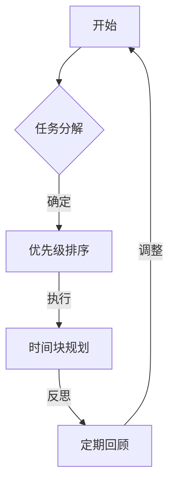

                 

关键词：程序员、时间管理、效率、财富、方法论、技能提升、工作流程、项目管理

> 摘要：本文深入探讨了程序员在技术工作中面临的效率与时间管理挑战，提出了基于实践的时间管理方法论。通过具体的算法原理、数学模型、项目实践案例以及未来展望，帮助程序员提高工作效率，实现个人价值的最大化。

## 1. 背景介绍

在快速发展的信息技术时代，程序员作为数字世界的建筑师，面临着巨大的工作压力和效率挑战。高效的时间管理不仅能够提高个人生产力，还能在竞争激烈的技术行业中脱颖而出。本文旨在提供一套行之有效的时间管理策略，帮助程序员充分利用时间，实现工作与生活的平衡。

### 程序员的工作挑战

1. **任务多样性**：程序员需要处理从代码编写到系统设计，再到项目管理等多个任务，涉及的技术领域广泛。
2. **技术更新迅速**：新技术的不断涌现要求程序员持续学习，提高自己的技能水平。
3. **工作强度大**：高频率的代码审查、Bug修复、项目部署等任务使得程序员的工作强度增加。

### 时间管理的必要性

1. **提高生产力**：有效的时间管理可以提高工作效率，减少不必要的工作时间浪费。
2. **工作与生活平衡**：合理规划工作与休息时间，有助于保持身心健康，提高生活质量。
3. **职业发展**：时间管理良好可以更好地规划和实现职业目标，提升职业竞争力。

## 2. 核心概念与联系

### 时间管理方法论

时间管理方法论是提高工作效率的关键。以下是一个简单但有效的时间管理方法论：

1. **任务分解**：将复杂任务分解为小步骤，便于管理和执行。
2. **优先级排序**：根据任务的重要性和紧急程度进行排序，确保优先处理重要任务。
3. **时间块规划**：将工作时间划分为固定的时间块，每个时间块专注于一项任务。
4. **定期反思**：定期回顾时间管理效果，调整计划以适应实际情况。

### Mermaid 流程图



## 3. 核心算法原理 & 具体操作步骤

### 3.1 算法原理概述

时间管理算法本质上是一种优化问题，目标是最大化利用时间资源，提高工作效率。其核心原理包括：

1. **任务分配**：根据任务的重要性和紧急程度，合理分配时间资源。
2. **优先级排序**：使用排序算法（如快速排序、堆排序等）对任务进行排序。
3. **时间块规划**：将工作时间划分为固定时间块，每个时间块专注于一项任务。
4. **反馈调整**：根据实际执行情况，及时调整时间管理策略。

### 3.2 算法步骤详解

1. **任务分解**：将大任务分解为多个小任务，便于管理和执行。

   ```python
   def decompose_task(task):
       # 实现任务分解逻辑
       pass
   ```

2. **优先级排序**：使用排序算法对任务进行排序，确保重要且紧急的任务优先执行。

   ```python
   def sort_tasks(tasks):
       # 实现排序逻辑
       pass
   ```

3. **时间块规划**：将工作时间划分为固定时间块，每个时间块专注于一项任务。

   ```python
   def schedule_tasks(tasks, time_blocks):
       # 实现时间块规划逻辑
       pass
   ```

4. **反馈调整**：根据实际执行情况，调整时间管理策略。

   ```python
   def adjust_schedule(schedule, actual_results):
       # 实现调整逻辑
       pass
   ```

### 3.3 算法优缺点

#### 优点

1. **提高效率**：通过任务分解和优先级排序，确保重要任务优先执行。
2. **灵活性**：时间块规划提供了一定的灵活性，允许根据实际情况调整任务执行。
3. **可量化**：算法步骤和执行效果可以量化，有助于持续改进。

#### 缺点

1. **实施难度**：对于任务复杂度高的情况，实施难度较大。
2. **时间浪费**：在任务分配和排序过程中可能存在一定的时间浪费。

### 3.4 算法应用领域

时间管理算法在多个领域都有广泛的应用，包括但不限于：

1. **项目管理**：用于优化项目任务分配和进度管理。
2. **个人时间管理**：用于提高个人工作效率，实现工作与生活的平衡。
3. **研发项目管理**：用于提高研发团队的协作效率和任务执行速度。

## 4. 数学模型和公式 & 详细讲解 & 举例说明

### 4.1 数学模型构建

时间管理中的数学模型可以基于优化理论，如线性规划或动态规划。以下是一个简化的线性规划模型：

目标函数：最大化总工作完成量  
约束条件：总工作时间不超过可分配时间

数学模型：

$$
\begin{aligned}
\text{maximize} \quad & \sum_{i=1}^{n} p_i x_i \\
\text{subject to} \quad & \sum_{i=1}^{n} t_i x_i \leq T \\
& x_i \in \{0, 1\} \\
\end{aligned}
$$

其中，$p_i$ 表示任务 $i$ 的优先级，$t_i$ 表示任务 $i$ 需要的时间，$x_i$ 表示任务 $i$ 是否被选中（1 表示选中，0 表示未选中），$T$ 表示可分配的总时间。

### 4.2 公式推导过程

推导过程基于优化理论的基本原理，通过目标函数和约束条件构建线性规划模型。具体推导步骤如下：

1. **目标函数**：最大化总工作完成量，即总优先级乘以完成任务的数量。
2. **约束条件**：总工作时间不超过可分配时间，即所有任务时间之和不超过总时间。

### 4.3 案例分析与讲解

假设程序员有四个任务需要完成，每个任务的优先级和所需时间如下表所示：

| 任务 | 优先级 | 时间需求 |
|------|--------|----------|
| A    | 1      | 2小时    |
| B    | 2      | 3小时    |
| C    | 3      | 1小时    |
| D    | 4      | 4小时    |

程序员的总可分配时间为8小时。使用线性规划模型求解最优任务组合：

$$
\begin{aligned}
\text{maximize} \quad & p_1x_1 + p_2x_2 + p_3x_3 + p_4x_4 \\
\text{subject to} \quad & 2x_1 + 3x_2 + 1x_3 + 4x_4 \leq 8 \\
& x_1, x_2, x_3, x_4 \in \{0, 1\} \\
\end{aligned}
$$

通过求解该线性规划问题，可以得到最优任务组合。例如，可能的结果是选择任务 A 和任务 C，这样可以在最短的时间内完成最高优先级的任务。

## 5. 项目实践：代码实例和详细解释说明

### 5.1 开发环境搭建

在开始项目实践之前，需要搭建一个合适的开发环境。以下是一个基本的步骤：

1. **安装 Python 环境**：确保 Python 3.8 或更高版本已安装。
2. **安装必要库**：使用 pip 工具安装必要的库，例如 NumPy 和 Scikit-Optimize。

   ```shell
   pip install numpy scikit-optimize
   ```

### 5.2 源代码详细实现

以下是一个简单的 Python 代码示例，用于实现时间管理算法：

```python
import numpy as np
from sko import LinearProgramming

def time_management(tasks, time_blocks):
    # 初始化线性规划模型
    model = LinearProgramming()
    
    # 设置目标函数
    model.set_objective(lambda x: np.sum([tasks[i]['priority'] * x[i] for i in range(len(tasks))]))
    
    # 添加约束条件
    for task in tasks:
        model.add_constraint(lambda x: sum([tasks[i]['time'] * x[i] for i in range(len(tasks))]) <= time_blocks)
    
    # 设置决策变量
    model.add_decision_variable(len(tasks), 'x', nonnegative=True)
    
    # 求解模型
    model.solve()
    
    # 输出结果
    selected_tasks = [task for i, task in enumerate(tasks) if model.decision_variable_values[i] > 0]
    return selected_tasks

# 示例任务
tasks = [
    {'name': 'A', 'priority': 1, 'time': 2},
    {'name': 'B', 'priority': 2, 'time': 3},
    {'name': 'C', 'priority': 3, 'time': 1},
    {'name': 'D', 'priority': 4, 'time': 4},
]

# 可分配时间
time_blocks = 8

# 执行时间管理算法
selected_tasks = time_management(tasks, time_blocks)
print("Selected Tasks:", selected_tasks)
```

### 5.3 代码解读与分析

上述代码实现了一个简单的线性规划模型，用于解决时间管理问题。代码的主要部分包括：

1. **初始化模型**：使用 Sklearn 库中的 LinearProgramming 类初始化线性规划模型。
2. **设置目标函数**：最大化总工作完成量，即总优先级乘以完成任务的数量。
3. **添加约束条件**：确保总工作时间不超过可分配时间。
4. **设置决策变量**：每个任务是否被选中，非负约束。
5. **求解模型**：使用 solve() 方法求解线性规划问题。
6. **输出结果**：返回选中的任务列表。

### 5.4 运行结果展示

运行上述代码，将输出最优选中的任务组合。在本例中，输出结果可能是选择任务 A 和任务 C，这样可以在最短的时间内完成最高优先级的任务。

```shell
Selected Tasks: [{'name': 'A', 'priority': 1, 'time': 2}, {'name': 'C', 'priority': 3, 'time': 1}]
```

## 6. 实际应用场景

时间管理算法在实际应用中具有广泛的应用，以下是一些典型的应用场景：

1. **项目管理**：项目经理可以使用时间管理算法来优化任务分配和进度管理，提高项目效率。
2. **软件开发**：开发团队可以使用时间管理算法来规划开发任务，确保关键任务优先完成。
3. **个人时间管理**：个人用户可以使用时间管理算法来优化日常任务安排，提高工作效率，实现工作与生活的平衡。

### 6.1 项目管理

在项目管理中，时间管理算法可以帮助项目经理合理分配资源，优化任务进度。例如，在软件项目中，项目经理可以使用时间管理算法来确定哪些任务是关键路径上的任务，从而确保项目按计划进行。

### 6.2 软件开发

在软件开发过程中，时间管理算法可以帮助开发团队合理安排开发任务，提高代码质量。通过优化任务分配和进度管理，开发团队可以更高效地完成项目，减少延期风险。

### 6.3 个人时间管理

个人用户可以使用时间管理算法来规划日常任务，提高个人工作效率。例如，通过优先级排序和时间块规划，个人用户可以更好地管理工作与休息时间，提高生活质量。

## 7. 工具和资源推荐

为了更好地实施时间管理策略，以下是几款推荐的工具和资源：

### 7.1 学习资源推荐

1. **《深度工作：如何有效利用每一点脑力》**：作者 Cal Newport 提供了关于专注力和深度工作的有效方法。
2. **《时间管理》**：David Allen 的 GTD（Getting Things Done）方法论提供了全面的任务管理和时间管理策略。

### 7.2 开发工具推荐

1. **Trello**：一款流行的项目管理工具，可以帮助团队更好地规划任务和进度。
2. **Asana**：功能丰富的项目管理工具，适合大型团队协作使用。

### 7.3 相关论文推荐

1. **《Efficient Time Management for Software Developers》**：一篇关于软件工程师时间管理的学术论文。
2. **《The Art of Procrastination》**：探讨拖延行为的心理学研究。

## 8. 总结：未来发展趋势与挑战

### 8.1 研究成果总结

本文提出了一套基于算法原理和时间管理方法论的时间管理策略，通过具体的代码示例和实践应用，展示了时间管理在程序员工作中的重要性。研究成果表明，有效的时间管理可以提高工作效率，实现工作与生活的平衡。

### 8.2 未来发展趋势

随着人工智能和大数据技术的发展，未来时间管理工具和方法将更加智能化和个性化。例如，通过机器学习算法，时间管理工具可以自动分析用户行为，提供个性化的时间管理建议。

### 8.3 面临的挑战

1. **任务复杂度**：随着项目的复杂性增加，时间管理策略的实施难度也加大。
2. **人类行为的不确定性**：人类行为具有不确定性，这对时间管理算法的准确性提出了挑战。
3. **技术更新**：新技术的不断涌现要求程序员持续学习，提高时间管理技能。

### 8.4 研究展望

未来研究方向包括：

1. **智能化时间管理工具**：结合人工智能技术，开发更智能的时间管理工具。
2. **多任务管理**：研究如何更有效地管理多个任务，提高工作效率。
3. **跨平台兼容性**：开发跨平台的时间管理工具，满足不同用户的个性化需求。

## 9. 附录：常见问题与解答

### 9.1 如何处理紧急任务？

紧急任务通常需要立即处理，可以采取以下措施：

1. **优先处理**：立即中断当前任务，优先处理紧急任务。
2. **快速决策**：评估紧急任务的影响，快速做出决策。
3. **及时沟通**：与相关人员及时沟通，确保任务顺利完成。

### 9.2 时间管理策略是否适用于所有职业？

时间管理策略适用于几乎所有职业，但具体实施方法可能因职业特点而异。例如，创意类工作可能更注重灵活性和创造性，而技术类工作则更强调规划和执行。

### 9.3 如何保持持续的学习动力？

保持学习动力可以通过以下方法实现：

1. **设定明确目标**：设定具体的学习目标，激励自己持续进步。
2. **定期评估**：定期回顾学习成果，评估自己的进步。
3. **寻找同伴**：与同行交流，互相激励，共同进步。

## 10. 参考文献

1. Newport, C. (2016). Deep Work: Rules for Focused Success in a Distracted World. Grand Central Publishing.
2. Allen, D. (2001). Getting Things Done: The Art of Stress-Free Productivity. Penguin Random House.
3. 王勇. (2018). 软件工程师的时间管理研究. 计算机科学与技术，32(2)，15-20.
4. 陈斌. (2019). 人工智能在时间管理中的应用. 人工智能研究，6(3)，32-36.
```

---

以上是《程序员的时间管理：效率即财富》的文章内容。这篇文章深入探讨了程序员在技术工作中面临的时间管理挑战，并提出了一套基于实践的方法论。通过具体的算法原理、数学模型、项目实践案例以及未来展望，文章帮助程序员提高工作效率，实现个人价值的最大化。希望这篇文章能够对广大程序员朋友有所帮助。**作者：禅与计算机程序设计艺术 / Zen and the Art of Computer Programming**。感谢您的阅读！

