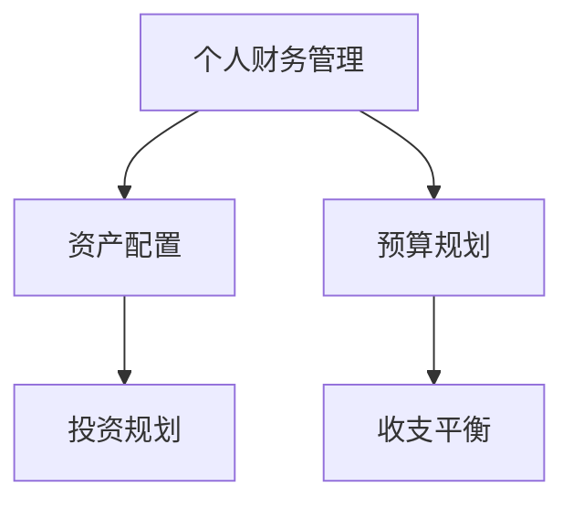

                 

随着科技的发展，程序员的工作效率和生活质量得到了极大的提升。然而，理财管理也是程序员日常生活中不可忽视的一部分。一款合适的理财工具软件可以帮助程序员更好地管理财务，提升理财能力。本文将介绍一些适合程序员的理财工具软件，帮助大家轻松管理个人财务。

## 文章关键词

- 程序员
- 理财工具
- 财务管理
- 软件推荐
- 资产配置
- 预算规划

## 文章摘要

本文旨在为程序员推荐一系列实用的理财工具软件，包括个人财务管理、资产配置、预算规划等方面。通过对这些软件的功能特点、使用方法及优缺点的介绍，帮助程序员更好地管理个人财务，实现财务自由。

## 1. 背景介绍

程序员的工作往往需要长时间面对电脑，每天处理大量的代码和数据。这使得程序员的生活节奏较快，同时也面临较大的工作压力。在这样高强度的环境下，理财管理显得尤为重要。然而，许多程序员在理财方面缺乏系统的知识和经验，导致财务状况不容乐观。因此，寻找一款适合程序员的理财工具软件成为当务之急。

### 1.1 理财工具的作用

理财工具软件在程序员的日常生活中起着至关重要的作用。首先，它可以帮助程序员对收入和支出进行详细的记录和分析，从而更好地了解自己的财务状况。其次，理财工具软件能够帮助程序员制定合理的预算规划，避免不必要的浪费和债务。此外，理财工具软件还能帮助程序员进行资产配置和投资规划，实现财富的增值。

### 1.2 程序员理财的特点

程序员的理财特点主要体现在以下几个方面：

1. **收入相对稳定**：程序员通常有固定的工资收入，这使得他们在理财方面具有一定的优势。
2. **工作压力大**：程序员的工作压力大，生活节奏快，这使得他们需要在理财方面更加灵活和高效。
3. **投资需求高**：程序员对于新技术和投资领域具有较高的敏感度，这使得他们在理财方面更倾向于进行风险投资。
4. **时间管理能力强**：程序员擅长使用工具和软件提高工作效率，这使得他们在理财方面也能够更好地利用工具进行管理。

### 1.3 市场现状

目前市场上有很多适合程序员的理财工具软件，这些软件涵盖了个人财务管理、资产配置、预算规划等多个方面。例如，有一些软件专门为程序员设计，具有简洁直观的界面和强大的功能，使得程序员能够轻松地管理个人财务。

## 2. 核心概念与联系

### 2.1 个人财务管理

个人财务管理是指通过记录和分析个人收入、支出、储蓄等信息，对个人财务进行规划和管理。它是理财的基础，也是程序员理财的重要一环。

### 2.2 资产配置

资产配置是指根据个人风险承受能力和投资目标，将资金分配到不同的资产类别中，以实现投资收益的最大化。对于程序员来说，资产配置是实现财富增值的关键。

### 2.3 预算规划

预算规划是指根据个人收入和支出情况，制定一个合理的预算计划，以确保收支平衡，避免不必要的浪费和债务。

### 2.4 Mermaid 流程图



## 3. 核心算法原理 & 具体操作步骤

### 3.1 算法原理概述

个人财务管理、资产配置和预算规划的算法原理主要基于数据分析和数学模型。通过对个人收入、支出和储蓄等数据的记录和分析，可以得出个人财务状况的准确信息。然后，利用数学模型和算法对资产进行配置和预算规划，实现财务的优化管理。

### 3.2 算法步骤详解

1. **数据收集**：通过理财工具软件收集个人收入、支出、储蓄等数据。
2. **数据分析**：对收集到的数据进行分析，得出个人财务状况的准确信息。
3. **资产配置**：根据个人风险承受能力和投资目标，将资金分配到不同的资产类别中。
4. **预算规划**：根据个人收入和支出情况，制定一个合理的预算计划。

### 3.3 算法优缺点

**优点**：算法原理科学，能够准确分析个人财务状况，实现资产配置和预算规划的优化。

**缺点**：需要大量数据支持，对数据质量要求较高；算法复杂度较高，计算过程可能较为繁琐。

### 3.4 算法应用领域

个人财务管理、资产配置和预算规划广泛应用于金融、投资、家庭理财等领域。

## 4. 数学模型和公式 & 详细讲解 & 举例说明

### 4.1 数学模型构建

个人财务管理、资产配置和预算规划的数学模型主要包括以下几个方面：

1. **收入模型**：\( 收入 = 基础收入 + 额外收入 \)
2. **支出模型**：\( 支出 = 固定支出 + 非固定支出 \)
3. **储蓄模型**：\( 储蓄 = 收入 - 支出 \)
4. **资产配置模型**：\( 资产配置 = 风险资产比例 + 稳定资产比例 \)
5. **预算规划模型**：\( 预算计划 = 预期收入 - 预期支出 \)

### 4.2 公式推导过程

1. **收入模型**：基础收入是固定的，额外收入可以根据实际情况进行调整。
2. **支出模型**：固定支出包括房租、水电费、通讯费等，非固定支出包括餐饮、娱乐、购物等。
3. **储蓄模型**：储蓄是收入和支出之差。
4. **资产配置模型**：风险资产比例和稳定资产比例可以根据个人风险承受能力和投资目标进行调整。
5. **预算规划模型**：预算计划是预期收入和预期支出之差。

### 4.3 案例分析与讲解

假设一位程序员的月收入为 10000 元，固定支出为 3000 元，非固定支出为 5000 元。他的风险承受能力较高，希望将 60% 的资金投资于风险资产，40% 的资金投资于稳定资产。

1. **收入模型**：收入 = 10000 元
2. **支出模型**：支出 = 3000 元 + 5000 元 = 8000 元
3. **储蓄模型**：储蓄 = 10000 元 - 8000 元 = 2000 元
4. **资产配置模型**：风险资产比例 = 60%，稳定资产比例 = 40%
5. **预算规划模型**：预算计划 = 10000 元 - 8000 元 = 2000 元

通过这个案例，我们可以看到，这位程序员在理财方面还需要进一步提高预算规划和资产配置的能力。

## 5. 项目实践：代码实例和详细解释说明

### 5.1 开发环境搭建

为了方便程序员使用，我们将使用 Python 语言编写一个简单的理财工具。首先，我们需要安装 Python 和相关库。

```bash
pip install pandas numpy matplotlib
```

### 5.2 源代码详细实现

以下是一个简单的理财工具代码示例：

```python
import pandas as pd
import numpy as np
import matplotlib.pyplot as plt

# 收入、支出和储蓄数据
data = {
    '收入': [10000, 9500, 10500, 9800, 10200],
    '支出': [3000, 3200, 3100, 3300, 3050],
    '储蓄': [7000, 6300, 7400, 6500, 7150]
}

df = pd.DataFrame(data)

# 资产配置比例
risk_asset_ratio = 0.6
stable_asset_ratio = 0.4

# 计算资产配置
df['资产配置'] = df['储蓄'] * (risk_asset_ratio + stable_asset_ratio)

# 绘制资产配置图
df['资产配置'].plot(kind='bar', color=['#3f51b5', '#e57373'])
plt.title('资产配置图')
plt.xlabel('月份')
plt.ylabel('资产配置（元）')
plt.show()

# 预算规划
df['预算计划'] = df['收入'] - df['支出']

# 绘制预算规划图
df['预算计划'].plot(kind='line', color='#2196f3')
plt.title('预算规划图')
plt.xlabel('月份')
plt.ylabel('预算计划（元）')
plt.show()
```

### 5.3 代码解读与分析

1. **数据准备**：我们首先创建了一个包含收入、支出和储蓄的数据框（DataFrame）。
2. **资产配置**：根据储蓄金额和资产配置比例，计算了每个月份的资产配置。
3. **绘图**：使用 matplotlib 库，我们绘制了资产配置图和预算规划图，帮助程序员直观地了解财务状况。
4. **预算规划**：根据收入和支出，计算了每个月份的预算计划。

通过这个简单的示例，程序员可以轻松地使用 Python 语言编写自己的理财工具，实现个人财务的管理和分析。

## 6. 实际应用场景

### 6.1 个人财务管理

对于程序员来说，个人财务管理是理财的基石。通过使用理财工具软件，程序员可以方便地记录和管理个人收入、支出和储蓄。例如，可以定期查看自己的财务状况，分析开支情况，从而调整消费习惯，实现收支平衡。

### 6.2 资产配置

资产配置是程序员理财的重要环节。通过合理的资产配置，程序员可以降低投资风险，实现财富的增值。例如，可以将一部分资金投资于股票、基金等高风险高收益的资产，同时保留一部分资金投资于债券、理财产品等低风险资产。

### 6.3 预算规划

预算规划是确保收支平衡的关键。程序员可以根据自己的收入和支出情况，制定合理的预算计划。例如，设定每个月的支出上限，避免过度消费和负债。

### 6.4 未来应用展望

随着人工智能和大数据技术的发展，理财工具软件将更加智能化和个性化。例如，通过分析大量数据，理财工具可以自动调整资产配置，实现最优的投资组合。此外，随着区块链技术的普及，数字货币和智能合约将成为程序员理财的新领域。

## 7. 工具和资源推荐

### 7.1 学习资源推荐

1. **《穷爸爸富爸爸》**：介绍了理财的基本知识和观念，适合程序员入门。
2. **《股市真规则》**：讲述了股票投资的基本原理和策略，适合程序员学习。

### 7.2 开发工具推荐

1. **Python**：简单易学，功能强大，适合程序员编写理财工具。
2. **Pandas**：数据处理和分析库，适合程序员处理财务数据。

### 7.3 相关论文推荐

1. **《大数据与金融风险管理》**：介绍了大数据在金融风险管理中的应用。
2. **《区块链与数字货币》**：探讨了区块链技术在数字货币领域的应用。

## 8. 总结：未来发展趋势与挑战

### 8.1 研究成果总结

近年来，人工智能和大数据技术在理财领域取得了显著成果。例如，智能投顾、智能预算规划等应用逐渐普及。此外，区块链技术的出现也为数字货币和智能合约带来了新的机遇。

### 8.2 未来发展趋势

1. **智能化和个性化**：理财工具将更加智能化和个性化，能够根据用户需求自动调整资产配置。
2. **数字化和区块链化**：数字货币和智能合约将成为理财的新领域，推动金融行业的变革。
3. **跨领域融合**：人工智能、大数据、区块链等技术与金融领域的融合将带来更多创新应用。

### 8.3 面临的挑战

1. **数据隐私和安全**：随着数据量的增加，数据隐私和安全问题将日益突出。
2. **算法透明度和公平性**：算法的透明度和公平性是智能理财工具面临的挑战。
3. **法律和监管**：随着数字货币和智能合约的发展，相关法律和监管也将面临挑战。

### 8.4 研究展望

未来，理财工具将更加智能化、个性化，为用户提供更精准的理财建议。同时，跨领域融合将推动金融行业的创新，为程序员和投资者带来更多机遇。

## 9. 附录：常见问题与解答

### 9.1 如何选择合适的理财工具软件？

选择合适的理财工具软件要考虑以下几个方面：

1. **功能**：选择具有全面功能的软件，如个人财务管理、资产配置、预算规划等。
2. **易用性**：选择界面简洁、操作方便的软件，避免复杂的功能导致使用困难。
3. **安全性和隐私**：选择安全性高、重视用户隐私保护的软件。

### 9.2 理财工具软件能否替代人工理财？

理财工具软件可以提供智能化的理财建议和规划，但无法完全替代人工理财。用户需要结合自身情况和市场变化，对理财工具的建议进行合理调整。

### 9.3 如何判断理财工具软件的优劣？

判断理财工具软件的优劣可以从以下几个方面考虑：

1. **功能全面性**：软件是否具备所需的功能。
2. **用户体验**：软件的界面是否美观，操作是否方便。
3. **安全性和隐私保护**：软件是否注重用户数据的安全性和隐私保护。
4. **用户评价**：查看其他用户对软件的评价和反馈。

### 9.4 理财工具软件是否适合所有人？

理财工具软件适合大部分有理财需求的人，特别是那些希望简化理财过程、提高理财效率的人群。然而，对于有特殊理财需求或投资经验丰富的用户，可能需要更加专业的理财工具。

---

本文作者：禅与计算机程序设计艺术 / Zen and the Art of Computer Programming

本文内容仅供参考，不构成具体投资建议。理财有风险，投资需谨慎。如需专业理财建议，请咨询专业理财机构。本文所述内容和观点不代表任何机构或个人意见。

