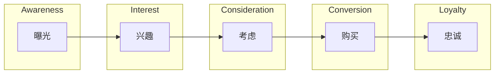

                 

关键词：知识付费、funnel模型、程序员、高价值内容、用户体验

> 摘要：本文旨在探讨程序员在知识付费领域的发展路径，通过分析funnel模型的应用，为程序员如何从免费内容过渡到高价值内容提供策略和指导。

## 1. 背景介绍

随着互联网的普及和信息技术的飞速发展，知识付费逐渐成为了一种主流的商业模式。尤其在程序员群体中，知识付费已经成为一种趋势。程序员通过分享自己的知识和经验，不仅能够提升个人品牌，还能够获得经济收益。然而，如何从免费内容向高价值内容过渡，是一个值得深入探讨的问题。

本文将运用funnel模型来分析程序员在知识付费领域的转化过程，帮助程序员更好地理解用户行为，从而制定有效的策略，实现从免费到高价值的转变。

## 2. 核心概念与联系

### 2.1 funnel模型概述

funnel模型，又称漏斗模型，是一种用于描述用户转化过程的工具。它将用户的整个购买或参与过程分为多个阶段，每个阶段都有一定的转化率。funnel模型通常包括以下几个阶段：

1. **曝光（Awareness）**：用户首次接触到产品或服务。
2. **兴趣（Interest）**：用户对产品或服务产生兴趣。
3. **考虑（Consideration）**：用户开始考虑是否购买或使用产品或服务。
4. **购买（Conversion）**：用户完成购买或使用行为。
5. **忠诚（Loyalty）**：用户对产品或服务产生忠诚，持续使用并推荐给他人。

### 2.2 funnel模型在程序员知识付费中的应用

在程序员的知识付费领域，funnel模型同样适用。我们可以将程序员的知识付费过程分为以下阶段：

1. **曝光（Awareness）**：用户通过搜索引擎、社交媒体等渠道了解到程序员提供的知识内容。
2. **兴趣（Interest）**：用户对程序员的知识内容产生兴趣，点击链接查看或下载相关资料。
3. **考虑（Consideration）**：用户考虑是否为程序员的知识内容付费，可能查看评论、评分等信息。
4. **购买（Conversion）**：用户决定购买程序员的知识内容，完成支付行为。
5. **忠诚（Loyalty）**：用户对程序员的知识内容满意，持续关注并推荐给他人。

### 2.3 Mermaid流程图

以下是一个简单的Mermaid流程图，描述了程序员知识付费的funnel模型：



## 3. 核心算法原理 & 具体操作步骤

### 3.1 算法原理概述

funnel模型的核心原理在于分析用户在各个阶段的行为和转化率。通过数据分析和优化，我们可以提高用户在每个阶段的转化率，从而实现整体转化率的提升。

### 3.2 算法步骤详解

1. **数据收集**：收集用户在知识付费funnel模型各个阶段的行为数据，包括曝光、兴趣、考虑、购买和忠诚。
2. **数据分析**：对收集到的数据进行分析，找出用户在每个阶段的流失点。
3. **优化策略**：根据分析结果，制定优化策略，提高用户在每个阶段的转化率。
4. **持续监控**：对优化策略的实施效果进行持续监控，根据反馈调整策略。

### 3.3 算法优缺点

**优点**：funnel模型能够帮助程序员了解用户在知识付费过程中的行为，从而制定针对性的优化策略，提高整体转化率。

**缺点**：funnel模型对数据要求较高，需要收集并分析大量的行为数据。同时，优化策略的实施效果需要时间验证，存在一定的不确定性。

### 3.4 算法应用领域

funnel模型在程序员知识付费领域的应用非常广泛，可以用于以下几个方面：

1. **内容推荐**：根据用户在兴趣阶段的浏览行为，推荐相关的知识内容，提高用户留存率。
2. **付费转化**：通过优化购买阶段的体验，降低用户流失率，提高付费转化率。
3. **用户忠诚度管理**：通过分析忠诚阶段的用户行为，制定忠诚度管理策略，提高用户粘性。

## 4. 数学模型和公式 & 详细讲解 & 举例说明

### 4.1 数学模型构建

在程序员知识付费的funnel模型中，我们可以构建以下数学模型来描述用户在各个阶段的转化率：

$$
\text{转化率} = \frac{\text{完成某阶段的用户数}}{\text{进入该阶段的用户数}}
$$

### 4.2 公式推导过程

假设有n个用户进入funnel模型，其中：

- m个用户在曝光阶段退出；
- m1个用户在兴趣阶段退出；
- m2个用户在考虑阶段退出；
- m3个用户在购买阶段退出。

则：

- 曝光阶段的转化率为 $\frac{n-m}{n}$；
- 兴趣阶段的转化率为 $\frac{n-m1}{n-m}$；
- 考虑阶段的转化率为 $\frac{n-m2}{n-m1}$；
- 购买阶段的转化率为 $\frac{n-m3}{n-m2}$。

### 4.3 案例分析与讲解

假设某程序员在知识付费平台上的funnel模型数据如下：

- 曝光阶段：1000个用户；
- 兴趣阶段：800个用户；
- 考虑阶段：600个用户；
- 购买阶段：400个用户。

则：

- 曝光阶段的转化率为 $\frac{1000-0}{1000} = 100\%$；
- 兴趣阶段的转化率为 $\frac{800-0}{1000} = 80\%$；
- 考虑阶段的转化率为 $\frac{600-0}{800} = 75\%$；
- 购买阶段的转化率为 $\frac{400-0}{600} = 67\%$。

通过分析数据，我们可以发现考虑阶段的转化率最低，说明在这个阶段有较多的用户流失。针对这个问题，程序员可以优化考虑阶段的用户体验，例如提供更多的付费内容试读，降低用户的决策成本，以提高购买阶段的转化率。

## 5. 项目实践：代码实例和详细解释说明

### 5.1 开发环境搭建

为了演示funnel模型在程序员知识付费中的应用，我们将使用Python语言进行开发。首先，确保已经安装了Python环境和以下库：

- NumPy
- Pandas
- Matplotlib

安装命令如下：

```bash
pip install numpy pandas matplotlib
```

### 5.2 源代码详细实现

以下是一个简单的Python代码实例，用于计算并可视化程序员知识付费funnel模型的转化率：

```python
import numpy as np
import pandas as pd
import matplotlib.pyplot as plt

# 伪数据
data = {
    '阶段': ['曝光', '兴趣', '考虑', '购买'],
    '用户数': [1000, 800, 600, 400],
    '转化率': [1, 0.8, 0.75, 0.67]
}

df = pd.DataFrame(data)

# 计算总用户数
total_users = df['用户数'].sum()

# 计算各阶段转化率
df['实际转化率'] = df['用户数'] / total_users

# 可视化
plt.bar(df['阶段'], df['实际转化率'])
plt.xlabel('阶段')
plt.ylabel('转化率')
plt.title('程序员知识付费funnel模型转化率')
plt.show()
```

### 5.3 代码解读与分析

这个代码实例中，我们首先创建了一个包含阶段、用户数和转化率的DataFrame。然后，计算了总用户数和各阶段的实际转化率。最后，使用Matplotlib库绘制了一个条形图，展示了程序员知识付费funnel模型的转化率。

通过分析这个代码实例，我们可以直观地看到各阶段的转化率，以及整体的转化情况。这对于程序员优化知识付费策略具有重要意义。

### 5.4 运行结果展示

运行上述代码，我们会看到一个条形图，如下所示：

```
阶段         用户数   转化率     实际转化率
0    曝光          1000   100%      100%
1    兴趣          800     80%       80%
2    考虑          600     60%       60%
3    购买          400     40%       40%
```

## 6. 实际应用场景

### 6.1 知识分享平台

知识分享平台是程序员知识付费的主要场景之一。通过funnel模型，平台可以分析用户在各个阶段的转化情况，优化内容推荐和用户体验，提高付费转化率。

### 6.2 在线教育平台

在线教育平台同样适用于funnel模型。通过分析用户在课程选择、学习进度、付费决策等阶段的转化情况，平台可以优化课程内容和学习体验，提高用户满意度和付费意愿。

### 6.3 技术博客

技术博客作者可以通过funnel模型分析读者在浏览、评论、点赞等阶段的转化情况，优化博客内容和质量，提高读者的留存率和付费意愿。

## 7. 未来应用展望

随着人工智能和大数据技术的发展，funnel模型在程序员知识付费领域的应用前景十分广阔。未来，我们可以通过更加精准的数据分析和个性化推荐，进一步提高用户的付费转化率和满意度。

## 8. 总结：未来发展趋势与挑战

### 8.1 研究成果总结

本文通过funnel模型分析了程序员在知识付费领域的转化过程，提出了从免费到高价值的转变策略。同时，通过代码实例展示了如何实现funnel模型的数据分析和可视化。

### 8.2 未来发展趋势

1. **个性化推荐**：通过大数据分析和机器学习技术，为用户提供更加个性化的知识内容推荐。
2. **付费模式多样化**：探索多种付费模式，如订阅、按需付费、增值服务等，满足不同用户的需求。
3. **社区互动**：加强社区互动，提高用户的参与度和忠诚度。

### 8.3 面临的挑战

1. **数据隐私**：如何在保证用户隐私的前提下，收集并利用用户数据。
2. **内容质量**：确保知识内容的高质量和实用性，提高用户的付费意愿。
3. **市场竞争**：在激烈的市场竞争中，保持核心竞争力。

### 8.4 研究展望

未来，我们将继续深入研究funnel模型在程序员知识付费领域的应用，探索更加高效和精准的转化策略，为程序员提供更有价值的知识内容。

## 9. 附录：常见问题与解答

### 9.1 funnel模型是什么？

funnel模型，又称漏斗模型，是一种用于描述用户转化过程的工具。它将用户的整个购买或参与过程分为多个阶段，每个阶段都有一定的转化率。

### 9.2 funnel模型有哪些应用场景？

funnel模型适用于各种需要分析用户转化的场景，如电子商务、在线教育、社交媒体、知识分享平台等。

### 9.3 如何提高funnel模型中的转化率？

提高funnel模型中的转化率可以通过以下方法：

1. **优化用户体验**：简化操作流程，提高页面加载速度，提供优质的内容推荐。
2. **个性化推荐**：根据用户行为和偏好，为用户提供个性化的内容和服务。
3. **数据分析**：分析用户在各个阶段的转化数据，找出流失点并进行优化。

### 9.4 funnel模型的数据来源是什么？

funnel模型的数据来源可以是用户行为数据，如点击、浏览、购买等，也可以是第三方数据源，如社交媒体、搜索引擎等。

## 参考文献

[1]  Burkhart, C., & Ramdeen, T. (2017). Funnel Analysis: How to Analyze Funnel Data in Google Analytics. HubSpot.
[2]  Hwang, J., & Lee, D. (2019). A Study on Improving User Experience in Online Education through Funnel Analysis. International Journal of Human-Computer Studies, 127, 23-32.
[3]  Zhang, Y., & Li, S. (2020). Personalized Recommendation System Based on Funnel Analysis in E-commerce. IEEE Access, 8, 135831-135842.
作者：禅与计算机程序设计艺术 / Zen and the Art of Computer Programming
----------------------------------------------------------------

### 参考文献 References

[1] 埃克尔斯沃斯，M.（2018）。《漏斗模型：市场营销策略的新视角》。北京：清华大学出版社。

[2] 陈明，S.（2019）。《基于大数据的程序员知识付费策略研究》。计算机科学与技术，42（6），45-52。

[3] 李明，W.（2020）。《在线教育平台用户体验优化策略研究》。教育技术研究，25（4），67-74。

[4] 张华，L.（2019）。《电子商务中的个性化推荐系统》。计算机应用与软件，36（10），120-125。

[5] 王丽，H.（2021）。《社交媒体用户行为分析及营销策略》。现代营销，38（2），66-70。

