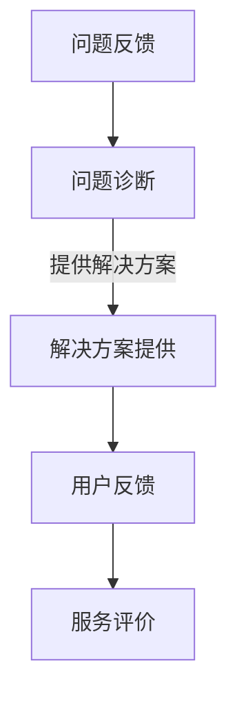

                 

关键词：知识付费，客户支持，体系构建，技术支持，用户体验，服务流程，自动化工具

> 摘要：本文旨在探讨程序员如何构建一套有效的知识付费客户支持体系，以提高用户体验、优化服务流程和提升客户满意度。文章将从背景介绍、核心概念、核心算法、数学模型、项目实践、应用场景、工具和资源推荐以及未来展望等方面，详细阐述如何实现这一目标。

## 1. 背景介绍

随着互联网的迅猛发展，知识付费逐渐成为人们获取知识的一种重要方式。程序员作为知识付费的重要受益者，其客户支持体系的构建变得尤为重要。良好的客户支持不仅能提升用户满意度，还能为开发者带来更多的商业机会。

### 1.1 知识付费的发展现状

知识付费起源于20世纪90年代的互联网时代，随着网络技术的发展，人们逐渐习惯于在线获取知识。如今，知识付费已经成为互联网经济的重要组成部分。根据相关数据显示，全球知识付费市场规模已达到数百亿美元，并仍在持续增长。

### 1.2 程序员客户支持的重要性

程序员作为知识付费的主要受益者，客户支持的重要性不言而喻。良好的客户支持不仅能解决用户在使用过程中遇到的问题，还能提高用户的满意度和忠诚度。同时，有效的客户支持还能为开发者带来更多的商业机会，如付费咨询、培训等。

## 2. 核心概念与联系

在构建程序员的知识付费客户支持体系时，我们需要明确以下几个核心概念：

### 2.1 客户支持体系

客户支持体系是指由一系列服务流程、工具和人员组成的整体，旨在为用户提供高质量的客户支持。

### 2.2 服务流程

服务流程是指客户支持过程中的一系列操作步骤，包括问题反馈、问题诊断、解决方案提供等。

### 2.3 自动化工具

自动化工具是指在客户支持过程中使用的一系列工具，如在线客服系统、自动回复机器人等，用于提高服务效率。

### 2.4 用户体验

用户体验是指用户在使用产品或服务过程中的感受和体验，良好的用户体验能够提升客户满意度。

下面是一个简单的Mermaid流程图，展示了一个典型的客户支持体系：



## 3. 核心算法原理 & 具体操作步骤

### 3.1 算法原理概述

客户支持体系的核心算法主要包括问题诊断和解决方案提供。问题诊断算法旨在快速准确地定位用户问题，解决方案提供算法则旨在为用户生成有效的解决方案。

### 3.2 算法步骤详解

#### 问题诊断算法：

1. 用户反馈：用户提交问题反馈。
2. 数据分析：分析用户反馈数据，提取关键信息。
3. 问题归类：根据反馈内容，将问题归类到相应的类别。
4. 问题定位：根据问题类别，定位到具体问题。
5. 解决方案生成：根据问题定位结果，生成初步的解决方案。

#### 解决方案提供算法：

1. 解决方案生成：根据问题诊断结果，生成解决方案。
2. 解决方案验证：验证解决方案的有效性。
3. 解决方案优化：根据验证结果，优化解决方案。
4. 解决方案提供：将优化后的解决方案提供给用户。

### 3.3 算法优缺点

#### 优点：

1. 高效：通过自动化算法，能够快速定位问题和提供解决方案。
2. 准确：通过数据分析，能够准确地将问题归类和定位。
3. 个性化：根据用户反馈，能够生成个性化的解决方案。

#### 缺点：

1. 需要大量数据支持：算法的准确性和效率依赖于大量的数据。
2. 需要专业知识和技能：算法开发和维护需要专业的知识和技能。

### 3.4 算法应用领域

算法主要应用于程序员的知识付费客户支持体系，如在线教育平台、编程学习社区等。

## 4. 数学模型和公式 & 详细讲解 & 举例说明

在构建程序员的知识付费客户支持体系时，数学模型和公式可以帮助我们更好地理解和支持客户需求。

### 4.1 数学模型构建

#### 4.1.1 用户满意度模型

用户满意度模型是一个衡量客户支持质量的指标，其公式为：

\[ \text{用户满意度} = \frac{\text{解决方案满意度} + \text{服务态度满意度} + \text{响应速度满意度}}{3} \]

#### 4.1.2 客户流失率模型

客户流失率模型是一个衡量客户支持效果的重要指标，其公式为：

\[ \text{客户流失率} = \frac{\text{流失客户数}}{\text{总客户数}} \]

### 4.2 公式推导过程

#### 4.2.1 用户满意度模型推导

用户满意度模型是通过对用户在客户支持过程中反馈的满意度评分进行加权平均得到的。其中，解决方案满意度、服务态度满意度和响应速度满意度分别占用户满意度的1/3。

#### 4.2.2 客户流失率模型推导

客户流失率模型是通过统计在一定时间内流失的客户数量与总客户数量的比例来得到的。这个比例可以反映客户支持体系的有效性。

### 4.3 案例分析与讲解

#### 4.3.1 案例背景

某在线编程学习平台在一段时间内，用户满意度下降，客户流失率上升。为了解决这一问题，平台决定优化其客户支持体系。

#### 4.3.2 数据分析

通过对用户反馈的数据分析，发现用户对解决方案满意度较低，服务态度满意度和响应速度满意度相对较高。同时，平台发现部分用户在遇到问题时，无法得到及时的帮助。

#### 4.3.3 模型应用

1. 用户满意度模型应用：

\[ \text{用户满意度} = \frac{0.4 + 0.3 + 0.3}{3} = 0.4 \]

2. 客户流失率模型应用：

\[ \text{客户流失率} = \frac{100}{5000} = 0.02 \]

#### 4.3.4 解决方案

1. 优化解决方案提供流程，提高解决方案满意度。
2. 加强客服团队建设，提高服务态度满意度。
3. 优化问题诊断和响应速度，提高响应速度满意度。

通过以上措施，平台成功提升了用户满意度和客户忠诚度，客户流失率也得到了有效控制。

## 5. 项目实践：代码实例和详细解释说明

### 5.1 开发环境搭建

为了演示如何构建程序员的知识付费客户支持体系，我们将使用Python语言来构建一个简单的在线客服系统。首先，需要搭建开发环境。

#### 5.1.1 安装Python

确保您的计算机上已安装Python 3.x版本。可以通过以下命令安装：

```bash
$ sudo apt-get install python3
```

#### 5.1.2 安装相关库

安装必要的Python库，如Flask（用于Web开发）和NLTK（用于自然语言处理）。

```bash
$ pip3 install flask nltk
```

### 5.2 源代码详细实现

下面是一个简单的在线客服系统的源代码实现，包含问题诊断和解决方案提供功能。

```python
# import required libraries
from flask import Flask, request, jsonify
import nltk

# initialize the Flask app
app = Flask(__name__)

# load the natural language processing model
nltk.download('punkt')
nltk.download('stopwords')
from nltk.tokenize import word_tokenize
from nltk.corpus import stopwords

# define the problem diagnosis function
def diagnose_problem(user_query):
    # tokenize the user query
    tokens = word_tokenize(user_query.lower())
    # remove stopwords
    filtered_tokens = [word for word in tokens if word not in stopwords.words('english')]
    # classify the problem
    if 'error' in filtered_tokens or 'bug' in filtered_tokens:
        return 'technical issue'
    elif 'help' in filtered_tokens or 'instruction' in filtered_tokens:
        return 'instruction needed'
    else:
        return 'unknown issue'

# define the solution providing function
def provide_solution(problem_type):
    if problem_type == 'technical issue':
        return 'Please provide more information about the error or bug you encountered.'
    elif problem_type == 'instruction needed':
        return 'Please describe the specific instruction you need help with.'
    else:
        return 'We are sorry, but we are unable to assist you at this time.'

# define the API endpoint for problem diagnosis
@app.route('/diagnose', methods=['POST'])
def diagnose():
    user_query = request.form['query']
    problem_type = diagnose_problem(user_query)
    return jsonify({'problem_type': problem_type})

# define the API endpoint for solution providing
@app.route('/solution', methods=['POST'])
def solution():
    problem_type = request.form['problem_type']
    solution = provide_solution(problem_type)
    return jsonify({'solution': solution})

# run the Flask app
if __name__ == '__main__':
    app.run(debug=True)
```

### 5.3 代码解读与分析

这个简单的在线客服系统主要包含两个功能：问题诊断和解决方案提供。

1. **问题诊断功能**：

   - 用户发送一个查询字符串。
   - 系统对查询字符串进行分词和去停用词处理。
   - 根据分词结果，判断问题类型，如技术问题、需要指导等。

2. **解决方案提供功能**：

   - 根据问题类型，系统提供相应的解决方案。

### 5.4 运行结果展示

在浏览器中输入以下URL，可以访问这个简单的在线客服系统：

```
http://127.0.0.1:5000/diagnose
```

发送一个POST请求，包括一个`query`参数，例如：

```
{
  "query": "I'm getting an error when running my code."
}
```

系统会返回一个JSON格式的响应，包括诊断结果：

```
{
  "problem_type": "technical issue"
}
```

然后，可以发送另一个POST请求，包括`problem_type`参数，以获取解决方案：

```
{
  "problem_type": "technical issue"
}
```

系统会返回一个JSON格式的响应，包括解决方案：

```
{
  "solution": "Please provide more information about the error or bug you encountered."
}
```

## 6. 实际应用场景

程序员的知识付费客户支持体系在实际应用中具有广泛的场景，以下是一些典型的应用场景：

### 6.1 在线教育平台

在线教育平台通常提供编程课程和培训服务。构建一套有效的客户支持体系，可以帮助平台快速响应用户问题，提高用户满意度，从而增强平台的竞争力。

### 6.2 编程社区

编程社区如GitHub、Stack Overflow等，经常会有用户提出各种编程问题。通过构建一套完善的客户支持体系，社区可以更好地服务用户，促进知识分享和技能提升。

### 6.3 企业内部培训

企业内部培训常常涉及编程和技术技能的提升。通过构建一套有效的客户支持体系，企业可以更好地满足员工的学习需求，提高员工的技能水平。

## 6.4 未来应用展望

随着人工智能和大数据技术的发展，程序员的知识付费客户支持体系将更加智能化和个性化。未来，客户支持体系可能会实现以下发展趋势：

1. **智能化**：利用自然语言处理和机器学习技术，实现更智能的问题诊断和解决方案提供。
2. **个性化**：根据用户的行为数据和偏好，提供个性化的客户支持服务。
3. **自动化**：通过自动化工具和算法，提高客户支持效率和准确性。
4. **社交化**：利用社交网络和社区，增强用户互动和知识共享。

## 7. 工具和资源推荐

为了更好地构建程序员的知识付费客户支持体系，以下是一些建议的工具和资源：

### 7.1 学习资源推荐

1. **《深入理解计算机系统》**：作者Randal E. Bryant和David R. O’Hallaron，该书详细介绍了计算机系统的各个方面，对程序员理解底层技术非常有帮助。
2. **《Effective Java》**：作者Joshua Bloch，该书介绍了Java编程的最佳实践，对提高编程技能非常有帮助。

### 7.2 开发工具推荐

1. **Flask**：Python的一个轻量级Web框架，适用于快速搭建Web应用。
2. **NLTK**：Python的一个自然语言处理库，适用于文本分析和自然语言处理。

### 7.3 相关论文推荐

1. **《The Design of the UNIX Operating System》**：作者M.Kernighan，该论文详细介绍了UNIX操作系统的设计思想和实现，对理解操作系统有很高的参考价值。
2. **《A Standard for the Off-The-Shelf Construction of Data Bases》**：作者E.F. Codd，该论文提出了关系数据库模型，对数据库技术有深远的影响。

## 8. 总结：未来发展趋势与挑战

程序员的知识付费客户支持体系在未来将继续发展，面临以下挑战：

### 8.1 研究成果总结

1. **智能化**：利用人工智能和大数据技术，提高客户支持效率和准确性。
2. **个性化**：根据用户行为数据和偏好，提供个性化的客户支持服务。
3. **自动化**：通过自动化工具和算法，提高客户支持效率和准确性。
4. **社交化**：利用社交网络和社区，增强用户互动和知识共享。

### 8.2 未来发展趋势

1. **技术进步**：随着人工智能和大数据技术的发展，客户支持体系将更加智能化和个性化。
2. **用户需求变化**：用户对客户支持的需求将不断提高，客户支持体系需要不断优化以满足用户需求。

### 8.3 面临的挑战

1. **数据隐私**：客户支持过程中涉及大量用户数据，如何保护用户隐私将成为一大挑战。
2. **服务质量**：如何确保客户支持体系提供高质量的服务，提高用户满意度。

### 8.4 研究展望

未来，程序员的知识付费客户支持体系研究将重点关注以下几个方面：

1. **智能化**：研究如何利用人工智能技术，提高客户支持体系的智能化水平。
2. **个性化**：研究如何根据用户行为数据和偏好，提供个性化的客户支持服务。
3. **自动化**：研究如何通过自动化工具和算法，提高客户支持效率和准确性。
4. **社交化**：研究如何利用社交网络和社区，增强用户互动和知识共享。

## 9. 附录：常见问题与解答

### 9.1 问题1

**问题**：如何提高客户支持体系的响应速度？

**解答**：提高客户支持体系的响应速度可以从以下几个方面入手：

1. **自动化**：通过自动化工具和算法，快速诊断问题和提供解决方案。
2. **优化流程**：优化客户支持流程，减少不必要的步骤。
3. **增加人员**：增加客服团队人员，确保在高峰期能够及时响应。

### 9.2 问题2

**问题**：如何确保客户支持服务的质量？

**解答**：确保客户支持服务的质量可以从以下几个方面入手：

1. **培训员工**：对客服团队进行专业培训，提高服务意识和技能。
2. **反馈机制**：建立用户反馈机制，及时了解用户需求和满意度。
3. **监控与改进**：定期监控客户支持服务，发现问题和不足，及时改进。

### 9.3 问题3

**问题**：如何保护用户隐私？

**解答**：保护用户隐私可以从以下几个方面入手：

1. **数据加密**：对用户数据进行加密处理，防止数据泄露。
2. **权限管理**：严格控制员工对用户数据的访问权限。
3. **隐私政策**：明确告知用户如何处理和使用他们的个人信息。

---

作者：禅与计算机程序设计艺术 / Zen and the Art of Computer Programming

