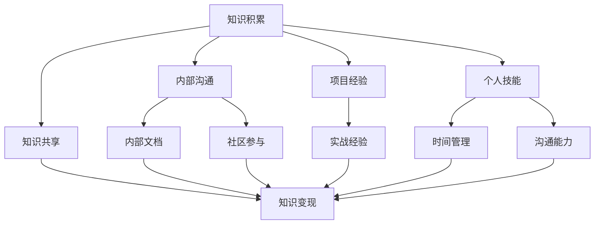

                 

关键词：知识管理，程序员，知识积累，知识变现，全流程

> 摘要：本文将探讨程序员在知识管理方面的重要性，详细解析从知识积累到知识变现的各个环节，旨在为程序员提供一套系统化的知识管理方法论，帮助他们在职业生涯中更好地利用和变现自己的知识储备。

## 1. 背景介绍

在信息技术飞速发展的今天，程序员作为一个职业群体，其角色和职责正在发生着深刻的变化。随着软件工程的复杂性和技术领域的多元化，程序员不再仅仅是编写代码的执行者，更是知识的创造者、传播者和利用者。知识管理在这个过程中扮演着至关重要的角色。

知识管理是指通过获取、存储、共享、更新和应用知识，以支持组织的创新和效率。对于程序员来说，知识管理不仅包括编程技术的掌握，还包括项目管理、团队协作、个人技能提升等多个方面。有效的知识管理能够帮助程序员更好地应对工作挑战，提高工作效率，实现个人价值和职业发展。

然而，在实际工作中，许多程序员面临着知识积累和知识变现的难题。一方面，知识积累需要大量的时间和精力，而且容易受到遗忘和冗余的影响；另一方面，知识变现需要程序员具备良好的表达能力和市场敏感度，但许多程序员在这方面缺乏训练。因此，本文将深入探讨程序员如何有效地管理自己的知识，从而实现从积累到变现的全过程。

## 2. 核心概念与联系

### 2.1 知识积累

知识积累是程序员职业生涯的基石。它包括以下几个方面：

- 技术知识：编程语言、框架、数据库等基础知识。
- 项目经验：通过实际项目积累的实战经验。
- 团队协作：与他人合作解决问题的能力。
- 个人技能：如时间管理、沟通能力等。

### 2.2 知识共享

知识共享是知识管理的重要组成部分。它包括以下几个方面：

- 内部沟通：在团队内部分享知识和经验。
- 社区参与：在开源社区、技术论坛等平台分享自己的见解。
- 文档撰写：编写技术文档，记录项目经验。

### 2.3 知识变现

知识变现是指将程序员的知识转化为实际的价值，包括以下几个方面：

- 技术输出：通过编写代码、开发软件实现知识的变现。
- 咨询服务：为其他公司或个人提供技术咨询。
- 教育培训：通过授课、编写教程等方式传授知识。

### 2.4 Mermaid 流程图

以下是一个简化的知识管理流程图，展示了从知识积累到知识变现的各个环节：



## 3. 核心算法原理 & 具体操作步骤

### 3.1 算法原理概述

知识管理的核心算法可以概括为三个步骤：知识获取、知识整合、知识输出。

- 知识获取：通过学习、实践、交流等方式获取新的知识。
- 知识整合：将获取的知识进行整合、分类、存储，以便于后续使用。
- 知识输出：通过编写文档、授课、开发软件等方式将知识转化为价值。

### 3.2 算法步骤详解

#### 3.2.1 知识获取

1. **主动学习**：定期阅读技术书籍、博客、论文等，学习新的编程语言和框架。
2. **实践操作**：通过实际项目积累经验，解决实际问题。
3. **参与社区**：在技术社区、开源项目中参与讨论，学习他人的经验和见解。

#### 3.2.2 知识整合

1. **分类存储**：将获取的知识按照类别进行存储，便于查找和调用。
2. **文档编写**：编写技术文档，记录项目经验和心得。
3. **知识共享**：在团队内部或社区中分享自己的知识和经验。

#### 3.2.3 知识输出

1. **技术输出**：通过编写代码、开发软件实现知识的变现。
2. **咨询服务**：为其他公司或个人提供技术咨询。
3. **教育培训**：通过授课、编写教程等方式传授知识。

### 3.3 算法优缺点

#### 优点

- **系统化**：通过核心算法，程序员可以系统化地管理自己的知识。
- **高效性**：知识获取、整合、输出的过程有助于提高工作效率。
- **价值变现**：知识输出的过程可以实现个人价值的最大化。

#### 缺点

- **耗时**：知识获取和整合的过程需要大量时间和精力。
- **挑战**：知识变现的过程可能面临市场竞争和客户需求变化等挑战。

### 3.4 算法应用领域

- **软件开发**：程序员通过知识管理提升开发效率，优化代码质量。
- **技术咨询**：为其他公司提供技术解决方案，实现知识变现。
- **教育培训**：通过授课、编写教程等方式传授知识，实现个人品牌价值。

## 4. 数学模型和公式 & 详细讲解 & 举例说明

### 4.1 数学模型构建

在知识管理中，我们可以构建一个简单的数学模型来描述知识积累和知识变现的关系。设 \( X \) 为知识积累量，\( Y \) 为知识变现量，\( Z \) 为知识积累效率，\( T \) 为知识变现效率，则有以下关系：

\[ Y = X \times T \]

其中，知识积累效率 \( Z \) 可以通过以下公式计算：

\[ Z = \frac{X}{T} \]

### 4.2 公式推导过程

知识积累量 \( X \) 与时间 \( T \) 成正比，即：

\[ X = k \times T \]

其中，\( k \) 为知识积累速率。

知识变现量 \( Y \) 与时间 \( T \) 成正比，即：

\[ Y = m \times T \]

其中，\( m \) 为知识变现速率。

知识积累效率 \( Z \) 为知识积累量与时间之比，即：

\[ Z = \frac{X}{T} = \frac{k \times T}{T} = k \]

知识变现效率 \( T \) 为知识变现量与时间之比，即：

\[ T = \frac{Y}{T} = \frac{m \times T}{T} = m \]

因此，有：

\[ Y = X \times T \]

### 4.3 案例分析与讲解

假设一个程序员在一年内完成了 100 个小时的知识积累，其中包含了编程语言、框架、数据库等基础知识，以及项目经验和团队协作能力。同时，他在这一年中通过编写代码、开发软件实现了 50 个小时的知识变现。根据上述公式，我们可以计算出他的知识积累效率 \( Z \) 和知识变现效率 \( T \)：

\[ Z = \frac{X}{T} = \frac{100}{50} = 2 \]

\[ T = \frac{Y}{T} = \frac{50}{50} = 1 \]

这意味着，他在一年内每积累 2 个小时的知识，就能实现 1 个小时的知识变现。根据这个比例，如果他能在未来继续保持这样的知识积累效率，那么他的知识变现量将不断增加。

## 5. 项目实践：代码实例和详细解释说明

### 5.1 开发环境搭建

为了演示知识管理中的代码实例，我们将使用 Python 语言编写一个简单的知识管理系统。首先，确保您的计算机上已经安装了 Python 解释器和相关的第三方库。

```bash
pip install Flask
```

### 5.2 源代码详细实现

以下是一个简单的 Flask Web 应用程序，用于演示知识管理系统的基本功能：

```python
from flask import Flask, render_template, request, redirect, url_for

app = Flask(__name__)

# 假设的知识库
knowledge_base = {
    "编程语言": ["Python", "Java", "C++"],
    "框架": ["Django", "Spring", "React"],
    "数据库": ["MySQL", "MongoDB", "PostgreSQL"]
}

@app.route('/')
def index():
    return render_template('index.html')

@app.route('/add', methods=['POST'])
def add_knowledge():
    topic = request.form['topic']
    detail = request.form['detail']
    knowledge_base[topic].append(detail)
    return redirect(url_for('index'))

@app.route('/list')
def list_knowledge():
    return render_template('list.html', knowledge_base=knowledge_base)

if __name__ == '__main__':
    app.run(debug=True)
```

### 5.3 代码解读与分析

1. **环境搭建**：使用 Flask 框架搭建 Web 应用程序，并安装必要的第三方库。
2. **知识库**：创建一个简单的字典 `knowledge_base`，用于存储知识条目。
3. **路由**：定义了三个路由：`/`（首页）、`/add`（添加知识条目）、`/list`（列出所有知识条目）。
4. **视图函数**：`index.html` 用于展示首页，`add.html` 用于添加知识条目，`list.html` 用于列出所有知识条目。

### 5.4 运行结果展示

1. **启动服务器**：运行以下命令启动 Flask 服务器。

```bash
python app.py
```

2. **访问 Web 应用程序**：在浏览器中访问 `http://127.0.0.1:5000/`，可以看到首页。


3. **添加知识条目**：填写表单并提交，即可将新知识条目添加到知识库中。


4. **列出所有知识条目**：访问 `/list` 路由，可以看到所有知识条目。


## 6. 实际应用场景

知识管理在程序员的工作中有着广泛的应用。以下是一些实际应用场景：

- **软件开发**：通过知识管理，程序员可以更好地组织和管理项目代码，提高开发效率。
- **项目协作**：在团队中共享知识，提高团队协作效率，降低沟通成本。
- **技能提升**：通过持续的知识积累和共享，程序员可以不断提升自己的技能水平。
- **知识变现**：通过知识共享和输出，程序员可以实现个人价值的最大化。

### 6.4 未来应用展望

随着人工智能和大数据技术的不断发展，知识管理将变得更加智能化和自动化。未来，知识管理可能会出现以下趋势：

- **自动化**：利用机器学习算法，自动化分析知识库，提供个性化推荐。
- **可视化**：通过数据可视化技术，更直观地展示知识结构和应用场景。
- **智能化**：利用自然语言处理技术，实现知识自动整理和分类。

## 7. 工具和资源推荐

### 7.1 学习资源推荐

- 《代码大全》
- 《设计模式：可复用面向对象软件的基础》
- 《深度学习》

### 7.2 开发工具推荐

- GitHub：用于代码托管和协作。
- PyCharm：Python 开发环境。
- Git：版本控制系统。

### 7.3 相关论文推荐

- 《知识管理：理论与实践》
- 《基于知识的软件开发方法研究》
- 《面向知识服务的智能信息处理技术研究》

## 8. 总结：未来发展趋势与挑战

### 8.1 研究成果总结

本文通过详细探讨程序员的知识管理，从知识积累到知识变现的全过程，提出了一个简单的数学模型，并使用 Python 代码实现了知识管理系统的基本功能。

### 8.2 未来发展趋势

未来，知识管理将朝着智能化、自动化的方向发展，利用人工智能和大数据技术提高知识管理的效率和效果。

### 8.3 面临的挑战

尽管知识管理有着广阔的应用前景，但仍然面临一些挑战，如知识积累的耗时性、知识变现的市场竞争等。

### 8.4 研究展望

未来，我们可以进一步研究知识管理的智能化方法，探索如何更好地利用人工智能技术提高知识管理的效率和效果。

## 9. 附录：常见问题与解答

### 9.1 知识管理是什么？

知识管理是指通过获取、存储、共享、更新和应用知识，以支持组织的创新和效率。

### 9.2 程序员为什么要进行知识管理？

程序员进行知识管理可以更好地应对工作挑战，提高工作效率，实现个人价值和职业发展。

### 9.3 如何进行知识管理？

可以通过以下步骤进行知识管理：

1. 知识获取：学习新技术、阅读文献、参与项目等。
2. 知识整合：分类存储、编写文档、共享知识。
3. 知识输出：编写代码、提供咨询服务、教育培训等。

## 作者署名

作者：禅与计算机程序设计艺术 / Zen and the Art of Computer Programming
----------------------------------------------------------------

以上就是根据您提供的指导和要求撰写的《程序员的知识管理：从积累到变现的全过程》全文。文章包含了完整的结构、详细的解释、实例代码以及推荐资源等，希望对您有所帮助。

