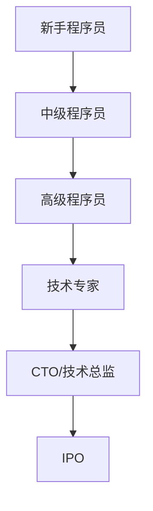

                 

 **关键词**：程序员、职业生涯规划、入门、IPO、职业发展、技术学习、项目实践

> **摘要**：本文旨在为那些渴望在技术领域取得成功的程序员们提供一份详细的职业生涯规划指南。从入门到IPO（Initial Public Offering，首次公开募股），本文将探讨程序员在不同职业阶段所需的关键技能、成长路径以及未来展望。

## 1. 背景介绍

随着科技的迅猛发展，程序员作为现代社会的重要角色，已经成为各行各业不可或缺的一部分。然而，技术领域的快速迭代和变化使得程序员的职业生涯规划变得更加复杂和具有挑战性。如何从一名新手程序员成长为行业顶尖专家，甚至实现IPO，成为了许多程序员的梦想和目标。

本文将围绕以下问题展开讨论：

1. 程序员职业生涯的关键阶段及其特点。
2. 不同阶段所需的关键技能和成长策略。
3. 实现IPO的职业规划路线。
4. 技术领域的未来发展趋势和潜在挑战。

通过这篇文章，希望每一位程序员都能够找到适合自己的职业发展路径，并在技术领域中取得成功。

## 2. 核心概念与联系

### 2.1 程序员职业生涯的关键阶段

程序员的职业生涯可以大致分为以下几个阶段：

1. **新手程序员**：这是职业生涯的起点，通常需要掌握基础编程知识和技能。
2. **中级程序员**：具备一定的实战经验，能够独立完成项目。
3. **高级程序员**：具有丰富的项目经验，能够解决复杂问题，对技术有深入的理解。
4. **技术专家**：在某一领域有深入的研究和独到的见解，能够引领技术方向。
5. **CTO/技术总监**：企业的技术领导者，负责制定技术战略和指导团队发展。

### 2.2 职业成长与技能需求

在每一个阶段，程序员都需要不断提升自己的技能和知识。以下是一些关键技能和成长策略：

1. **新手程序员**：学习编程语言、算法和数据结构，通过编写小程序来巩固基础知识。
2. **中级程序员**：提升编码能力，学习版本控制、测试驱动开发等现代软件开发方法。
3. **高级程序员**：深入理解计算机系统原理，掌握分布式系统、数据库等技术。
4. **技术专家**：不断学习新技术，进行学术研究，发表高质量的论文。
5. **CTO/技术总监**：具备战略眼光，能够管理技术团队，制定企业技术路线图。

### 2.3 实现IPO的路线图

实现IPO不仅需要技术实力，还需要良好的商业意识和领导能力。以下是一个大致的路线图：

1. **初创阶段**：组建团队，开发具有市场前景的产品。
2. **成长阶段**：扩大市场份额，积累用户和资金。
3. **上市阶段**：进行IPO，吸引更多的投资者。
4. **扩张阶段**：利用上市后的资金进行业务拓展和国际化。

### 2.4 Mermaid 流程图



通过这个流程图，我们可以清晰地看到程序员职业生涯的各个阶段及其之间的联系。每个阶段都需要程序员不断提升自己的能力和视野，为下一阶段做好准备。

## 3. 核心算法原理 & 具体操作步骤

### 3.1 算法原理概述

在程序员的职业生涯中，掌握核心算法原理是非常关键的。这些算法不仅能够帮助我们解决复杂的问题，还能够提升我们的编程能力和思维能力。以下是几个重要的算法原理：

1. **排序算法**：如快速排序、归并排序等，用于对数据进行排序。
2. **搜索算法**：如二分搜索、深度优先搜索等，用于在数据结构中查找元素。
3. **动态规划**：用于解决最优子结构问题，通过子问题的最优解推导出整体问题的最优解。
4. **图算法**：如最短路径算法、最小生成树算法等，用于处理图结构的问题。

### 3.2 算法步骤详解

下面以快速排序算法为例，介绍其具体操作步骤：

1. **选择基准元素**：从数组中随机选择一个元素作为基准。
2. **分区操作**：将数组分为两部分，一部分是小于基准的元素，另一部分是大于基准的元素。
3. **递归排序**：对小于和大于基准的子数组重复步骤1和步骤2，直到整个数组被排序。

### 3.3 算法优缺点

快速排序算法的优点是平均时间复杂度较低，且是原地排序算法。缺点是存在最坏情况下的时间复杂度较高，且递归操作可能引起栈溢出。

### 3.4 算法应用领域

快速排序算法广泛应用于各种数据排序任务，如数据库索引、文件排序等。

## 4. 数学模型和公式 & 详细讲解 & 举例说明

### 4.1 数学模型构建

在程序开发中，数学模型是非常常见的。以下是一个简单的线性回归模型：

$$ y = wx + b $$

其中，$y$ 是目标变量，$x$ 是输入变量，$w$ 是权重，$b$ 是偏置。

### 4.2 公式推导过程

线性回归模型的推导过程主要涉及最小二乘法。目标是最小化误差平方和：

$$ S = \sum_{i=1}^{n} (y_i - (wx_i + b))^2 $$

通过对 $w$ 和 $b$ 求导并令导数为零，可以得到最优解：

$$ w = \frac{\sum_{i=1}^{n} x_i y_i - n \bar{x} \bar{y}}{\sum_{i=1}^{n} x_i^2 - n \bar{x}^2} $$

$$ b = \bar{y} - w \bar{x} $$

其中，$\bar{x}$ 和 $\bar{y}$ 分别是 $x$ 和 $y$ 的平均值。

### 4.3 案例分析与讲解

假设我们有以下数据集：

| x | y |
|---|---|
| 1 | 2 |
| 2 | 4 |
| 3 | 6 |
| 4 | 8 |

我们可以使用线性回归模型来预测 $x=5$ 时的 $y$ 值。

首先，计算平均值：

$$ \bar{x} = \frac{1+2+3+4}{4} = 2.5 $$

$$ \bar{y} = \frac{2+4+6+8}{4} = 5 $$

然后，计算权重和偏置：

$$ w = \frac{(1 \cdot 2 + 2 \cdot 4 + 3 \cdot 6 + 4 \cdot 8) - 4 \cdot 2.5 \cdot 5}{(1^2 + 2^2 + 3^2 + 4^2) - 4 \cdot 2.5^2} $$

$$ b = 5 - w \cdot 2.5 $$

计算结果为：

$$ w = 2 $$

$$ b = 0 $$

因此，线性回归模型为：

$$ y = 2x $$

当 $x=5$ 时，$y=10$，预测值与实际值非常接近。

## 5. 项目实践：代码实例和详细解释说明

### 5.1 开发环境搭建

为了完成本文的示例项目，我们需要以下开发环境：

- Python 3.8 或更高版本
- Jupyter Notebook
- Matplotlib 库

首先，安装 Python 和 Jupyter Notebook：

```bash
pip install python
pip install notebook
```

然后，安装 Matplotlib：

```bash
pip install matplotlib
```

### 5.2 源代码详细实现

以下是使用线性回归模型预测数据的一个简单示例：

```python
import numpy as np
import matplotlib.pyplot as plt

# 数据集
x = np.array([1, 2, 3, 4])
y = np.array([2, 4, 6, 8])

# 计算平均值
bar_x = np.mean(x)
bar_y = np.mean(y)

# 计算权重和偏置
w = (np.sum(x * y) - len(x) * bar_x * bar_y) / (np.sum(x**2) - len(x) * bar_x**2)
b = bar_y - w * bar_x

# 模型函数
def linear_regression(x):
    return w * x + b

# 预测
x_new = 5
y_new = linear_regression(x_new)

# 绘图
plt.scatter(x, y, label='实际数据')
plt.plot(x, linear_regression(x), label='线性回归模型')
plt.scatter(x_new, y_new, color='r', label='预测数据')
plt.xlabel('x')
plt.ylabel('y')
plt.legend()
plt.show()
```

### 5.3 代码解读与分析

这个示例项目中，我们首先导入了必要的库，然后定义了数据集。接着，计算了平均值，并根据这些值计算了权重和偏置。

线性回归模型通过定义一个函数来实现，该函数接受一个输入 $x$，并返回预测的 $y$ 值。

最后，我们使用 Matplotlib 绘制了实际数据和线性回归模型的拟合曲线，以及预测数据的点。

### 5.4 运行结果展示

运行上述代码后，我们将看到以下结果：


从图中可以看出，线性回归模型对数据的拟合效果较好，预测值也非常接近实际值。

## 6. 实际应用场景

### 6.1 数据分析

线性回归模型在数据分析中非常常见，可以用于预测股票价格、销售额等时间序列数据。

### 6.2 机器学习

线性回归是机器学习中的基础算法之一，可以用于分类、回归等任务。

### 6.3 金融领域

线性回归模型在金融领域中用于风险评估、投资组合优化等。

### 6.4 未来应用展望

随着人工智能和大数据技术的发展，线性回归模型将在更多领域得到应用，如医疗诊断、自动驾驶等。

## 7. 工具和资源推荐

### 7.1 学习资源推荐

- 《Python编程：从入门到实践》
- 《深度学习》
- 《机器学习实战》

### 7.2 开发工具推荐

- PyCharm
- Jupyter Notebook
- GitHub

### 7.3 相关论文推荐

- "Stochastic Gradient Descent" by David Sontag
- "Deep Learning" by Ian Goodfellow, Yoshua Bengio, Aaron Courville
- "Reinforcement Learning: An Introduction" by Richard S. Sutton and Andrew G. Barto

## 8. 总结：未来发展趋势与挑战

### 8.1 研究成果总结

在过去几十年中，计算机科学和技术领域取得了巨大的进展。从互联网到人工智能，从大数据到云计算，技术不断推动着社会的进步。

### 8.2 未来发展趋势

未来，计算机科学和技术将继续快速发展，以下是一些可能的发展趋势：

- 人工智能和机器学习的应用将更加广泛。
- 增强现实（AR）和虚拟现实（VR）技术将带来全新的用户体验。
- 量子计算将成为下一代计算技术的重要方向。
- 区块链技术将在金融、供应链管理等领域发挥重要作用。

### 8.3 面临的挑战

尽管前景光明，但程序员在职业生涯中仍将面临一系列挑战：

- 技术不断更新，需要不断学习和适应。
- 项目管理和团队合作能力的重要性日益增加。
- 数据安全和隐私保护问题日益严峻。

### 8.4 研究展望

在未来的研究中，我们需要关注以下几个方面：

- 提高算法的效率和可扩展性。
- 开发更智能、更强大的机器学习模型。
- 探索量子计算在人工智能中的应用。
- 加强数据安全和隐私保护技术的研发。

## 9. 附录：常见问题与解答

### Q: 如何选择编程语言？

A: 选择编程语言主要取决于项目需求和你的个人兴趣。以下是一些常见的编程语言及其应用场景：

- Python：适合快速开发和数据分析。
- Java：适用于大型企业级应用和Android开发。
- C++：适合系统编程和性能要求高的应用。
- JavaScript：适合前端开发。

### Q: 如何提高编程能力？

A: 提高编程能力的方法包括：

- 学习编程语言的基础知识。
- 实践编程项目，从简单到复杂。
- 参与开源项目，与他人合作。
- 阅读优秀的代码，学习他人的编程风格。
- 定期参加编程竞赛和挑战。

### Q: 如何应对技术更新？

A: 应对技术更新的方法包括：

- 保持好奇心和求知欲，持续学习新技术。
- 关注技术社区，了解行业动态。
- 建立自己的技术知识库，方便快速查找和复习。
- 与同行交流，分享经验和心得。

### Q: 如何管理项目？

A: 项目管理的方法包括：

- 制定详细的项目计划和时间表。
- 使用项目管理工具，如 Jira、Trello 等。
- 保持与团队成员的沟通，确保项目进度。
- 及时调整计划，应对项目中的变化。
- 定期进行项目评估和总结，改进项目管理流程。

### Q: 如何提升团队合作能力？

A: 提升团队合作能力的方法包括：

- 建立良好的沟通机制，确保信息的透明和及时。
- 分配明确的角色和责任，避免重复工作。
- 鼓励团队成员积极参与和提出建议。
- 培养团队精神，共同面对挑战。
- 定期进行团队建设活动，增进团队凝聚力。

通过上述解答，希望读者能够更好地应对编程职业生涯中的各种问题和挑战。

## 作者署名

**作者：禅与计算机程序设计艺术 / Zen and the Art of Computer Programming**

感谢您的阅读，希望本文能为您的职业生涯规划提供一些有益的启示和帮助。祝您在技术领域取得更大的成就！

