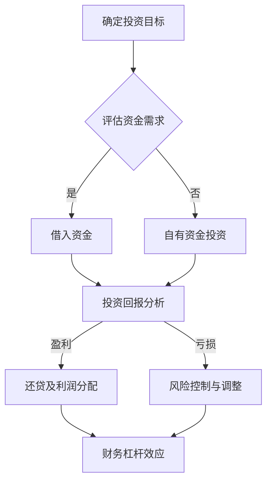

                 

关键词：财务杠杆、程序员、投资策略、风险控制、财富增长

> 摘要：本文将深入探讨程序员在职业生涯中如何运用财务杠杆策略，以实现财富增长和风险管理。通过理解财务杠杆的原理、构建投资组合和制定财务规划，程序员可以更加有效地管理个人资产，实现财务自由。

## 1. 背景介绍

在技术行业，程序员往往专注于提升技能、开发新产品和优化现有系统。然而，随着收入的增加，财务管理也逐渐成为程序员必须掌握的一门学问。财务杠杆是金融学中一个重要的概念，它涉及到如何利用有限的资金实现更大的投资回报。对于程序员而言，理解并运用财务杠杆策略，不仅可以优化个人财富增长，还能在风险控制方面发挥重要作用。

本文旨在为程序员提供一套实用的财务杠杆使用策略，帮助他们在职业生涯中更好地管理财务，实现财富的稳定增长。本文将分为以下几个部分：

- **核心概念与联系**：介绍财务杠杆的基本原理，并通过 Mermaid 流程图展示其架构。
- **核心算法原理与操作步骤**：详细阐述如何构建投资组合、选择合适的风险控制和财富增长策略。
- **数学模型和公式**：讲解关键的数学模型和公式，并通过实际案例进行分析。
- **项目实践**：提供具体的代码实例和解释，帮助程序员更好地理解财务杠杆策略。
- **实际应用场景**：探讨财务杠杆策略在不同领域的应用。
- **未来应用展望**：分析未来财务杠杆策略的发展趋势和潜在挑战。

通过本文的阅读，程序员将能够掌握财务杠杆的基本原理和应用方法，为自己的财务规划提供有力支持。

## 2. 核心概念与联系

### 2.1 财务杠杆基本原理

财务杠杆是一种通过借入资金来增加投资回报的财务策略。其基本原理是通过利用债务或其他融资手段，以较小的本金实现较大的投资收益。财务杠杆的核心在于“杠杆”二字，即通过放大投资规模来提高回报率。

财务杠杆的计算公式为：
\[ 增加的投资回报 = (投资回报率 \times 投资额) - 借款成本 \]

其中，投资回报率是指投资所获得的收益占投资总额的百分比，借款成本则是借款所产生的利息或其他费用。

### 2.2 财务杠杆架构

为了更好地理解财务杠杆的原理，我们可以使用 Mermaid 流程图来展示其架构。以下是财务杠杆的基本流程：



### 2.3 财务杠杆的优缺点

#### 优点

1. **提高投资回报**：通过借入资金，可以扩大投资规模，提高投资回报率。
2. **增加财富增长潜力**：财务杠杆可以使投资收益在较小的本金基础上实现较大的增长。

#### 缺点

1. **增加风险**：借入资金会增加利息支出，如果投资回报低于借款成本，可能导致亏损。
2. **财务风险**：过度依赖财务杠杆可能导致财务困境，甚至破产。

### 2.4 财务杠杆与其他投资策略的比较

与其他投资策略相比，财务杠杆具有以下特点：

- **风险与回报**：财务杠杆可以带来更高的回报，但同时也增加了风险。
- **资金利用效率**：通过财务杠杆，可以更有效地利用资金，实现投资规模扩大。
- **灵活性**：财务杠杆策略可以根据市场变化进行调整，灵活性较高。

### 2.5 财务杠杆在程序员职业生涯中的应用

对于程序员而言，财务杠杆策略不仅适用于个人投资，还可以在职业生涯中发挥重要作用。例如，通过财务杠杆，程序员可以在购买房产、创业投资或股权投资等方面实现更大的财富增长。

同时，财务杠杆策略还可以帮助程序员进行风险管理。例如，在股票市场投资中，通过合理的财务杠杆，可以在控制风险的同时提高收益。

### 2.6 财务杠杆策略的总结

通过本文的介绍，我们可以看到财务杠杆是一种有效的投资策略，可以帮助程序员在职业生涯中实现财富增长和风险管理。然而，需要注意的是，财务杠杆也具有风险，程序员在应用财务杠杆策略时必须谨慎，并进行充分的风险评估。

在接下来的章节中，我们将深入探讨财务杠杆的具体算法原理和操作步骤，帮助程序员更好地理解和运用财务杠杆策略。

## 3. 核心算法原理 & 具体操作步骤

### 3.1 算法原理概述

财务杠杆策略的核心在于如何合理地使用借来的资金进行投资，以实现最大化回报。其基本原理包括以下几个方面：

1. **资金管理**：程序员需要明确自己的财务状况，确定可用于投资的资金量。
2. **风险评估**：对投资市场进行全面评估，了解不同投资产品的风险和回报。
3. **投资策略选择**：根据风险评估结果，选择适合的投资策略和投资产品。
4. **杠杆比例确定**：根据投资目标和风险承受能力，确定合适的杠杆比例。
5. **投资执行与监控**：执行投资计划，并对投资进行持续监控和调整。

### 3.2 算法步骤详解

#### 3.2.1 资金管理

资金管理是财务杠杆策略的基础。程序员需要先明确自己的财务状况，包括收入、支出、储蓄和投资目标。具体步骤如下：

1. **建立财务报表**：记录每月的收入和支出，分析财务状况。
2. **制定储蓄计划**：根据收入和支出情况，制定合理的储蓄计划。
3. **评估投资资金**：确定可用于投资的资金量。

#### 3.2.2 风险评估

风险评估是制定投资策略的关键。程序员需要了解不同投资产品的风险和回报，以确定适合自己的投资组合。具体步骤如下：

1. **市场研究**：了解股票、债券、基金等投资产品的特点和市场走势。
2. **风险评估**：对每种投资产品进行风险评估，包括风险等级、预期回报率和波动性。
3. **确定投资目标**：根据风险承受能力和投资目标，选择适合的投资产品。

#### 3.2.3 投资策略选择

根据风险评估结果，程序员需要选择适合自己的投资策略。具体步骤如下：

1. **分散投资**：通过分散投资，降低单一投资产品的风险。
2. **长期投资**：选择具有长期增长潜力的投资产品，如股票、基金等。
3. **短期交易**：对于有经验和风险承受能力较高的程序员，可以考虑进行短期交易。

#### 3.2.4 杠杆比例确定

杠杆比例的确定是财务杠杆策略的核心。程序员需要根据投资目标和风险承受能力，选择合适的杠杆比例。具体步骤如下：

1. **设定杠杆比例范围**：根据投资目标和风险承受能力，设定杠杆比例的上限和下限。
2. **选择杠杆工具**：根据投资产品特点，选择合适的杠杆工具，如保证金交易、期权等。
3. **动态调整杠杆比例**：根据市场情况和投资回报，动态调整杠杆比例。

#### 3.2.5 投资执行与监控

投资执行与监控是确保投资策略有效实施的关键。具体步骤如下：

1. **制定投资计划**：根据投资策略，制定具体的投资计划。
2. **执行投资**：按照投资计划，执行具体投资操作。
3. **监控投资**：对投资进行持续监控，分析投资回报和风险。
4. **调整投资策略**：根据市场变化和投资回报，调整投资策略。

### 3.3 算法优缺点

#### 优点

1. **提高投资回报**：通过合理使用财务杠杆，可以放大投资回报。
2. **降低投资成本**：通过分散投资和长期投资，可以降低投资成本。
3. **灵活调整**：根据市场变化，可以动态调整投资策略。

#### 缺点

1. **增加风险**：过度依赖财务杠杆可能导致财务困境。
2. **需要专业知识**：合理运用财务杠杆需要具备一定的金融知识和市场分析能力。

### 3.4 算法应用领域

财务杠杆策略在程序员职业生涯中的应用非常广泛，包括以下几个方面：

1. **股票投资**：通过财务杠杆，可以在股票市场中实现更高的回报。
2. **房地产投资**：通过借款购买房产，可以实现资产增值。
3. **创业投资**：通过财务杠杆，可以为创业项目提供资金支持。

### 3.5 算法总结

通过上述步骤，程序员可以系统地构建财务杠杆策略，实现财富增长和风险管理。在应用财务杠杆时，程序员需要谨慎评估风险，并具备一定的金融知识和市场分析能力。

在接下来的章节中，我们将深入探讨财务杠杆相关的数学模型和公式，并通过实际案例进行讲解。

## 4. 数学模型和公式 & 详细讲解 & 举例说明

### 4.1 数学模型构建

财务杠杆策略的核心在于如何通过数学模型来评估投资回报和风险。以下是一些关键的数学模型和公式：

#### 4.1.1 投资回报率

投资回报率（ROI）是衡量投资回报的关键指标，其计算公式为：
\[ ROI = \frac{投资回报}{投资总额} \]

#### 4.1.2 杠杆比例

杠杆比例（Leverage Ratio）是衡量投资杠杆程度的关键指标，其计算公式为：
\[ 杠杆比例 = \frac{借款金额}{自有资金} \]

#### 4.1.3 风险调整后的回报率

为了更好地评估投资风险，我们引入风险调整后的回报率（Risk-Adjusted Return），其计算公式为：
\[ 风险调整后的回报率 = \frac{投资回报率}{风险调整系数} \]

其中，风险调整系数可以基于投资产品的波动性、市场风险等因素确定。

### 4.2 公式推导过程

以下是对上述公式的推导过程：

#### 4.2.1 投资回报率

投资回报率是衡量投资收益占投资总额的比例，其公式推导如下：
\[ 投资回报 = 收益 - 投资成本 \]
\[ 投资总额 = 自有资金 + 借款金额 \]
\[ ROI = \frac{投资回报}{投资总额} \]

#### 4.2.2 杠杆比例

杠杆比例是衡量投资者借入资金的比例，其公式推导如下：
\[ 杠杆比例 = \frac{借款金额}{自有资金} \]

#### 4.2.3 风险调整后的回报率

为了更好地衡量投资风险，我们引入风险调整系数，其公式推导如下：
\[ 风险调整后的回报率 = \frac{投资回报率}{风险调整系数} \]

### 4.3 案例分析与讲解

为了更好地理解上述数学模型和公式，我们通过以下案例进行详细讲解：

#### 4.3.1 案例背景

假设一名程序员A，他有10万元的自有资金，决定通过财务杠杆进行投资。他选择了股票市场作为投资目标，并决定借入30万元作为借款金额。

#### 4.3.2 投资回报率

假设股票市场的年回报率为20%，则A的总投资额为：
\[ 总投资额 = 自有资金 + 借款金额 = 10万元 + 30万元 = 40万元 \]

A的投资回报为：
\[ 投资回报 = 投资回报率 \times 总投资额 = 20\% \times 40万元 = 8万元 \]

因此，A的投资回报率为：
\[ ROI = \frac{投资回报}{投资总额} = \frac{8万元}{40万元} = 20\% \]

#### 4.3.3 杠杆比例

A的杠杆比例为：
\[ 杠杆比例 = \frac{借款金额}{自有资金} = \frac{30万元}{10万元} = 3 \]

#### 4.3.4 风险调整后的回报率

假设股票市场的波动性（风险调整系数）为10%，则A的风险调整后的回报率为：
\[ 风险调整后的回报率 = \frac{投资回报率}{风险调整系数} = \frac{20\%}{10\%} = 2 \]

### 4.4 案例分析结果

通过上述计算，我们可以看到：

- A的投资回报率为20%，这意味着他的投资收益占投资总额的20%。
- A的杠杆比例为3，这意味着他通过借入资金实现了3倍的投资规模。
- A的风险调整后的回报率为2，这意味着在考虑风险的情况下，他的投资回报率是风险调整系数的2倍。

这个案例展示了财务杠杆策略在提高投资回报和扩大投资规模方面的优势，但同时也提醒程序员在应用财务杠杆时需要谨慎评估风险。

### 4.5 算法总结

通过本章节的讲解，我们了解了财务杠杆策略相关的数学模型和公式，并通过案例进行了详细分析。这些数学模型和公式为程序员提供了量化投资决策的工具，有助于他们更好地理解和应用财务杠杆策略。

在接下来的章节中，我们将提供具体的代码实例，帮助程序员更好地掌握财务杠杆策略的实施。

## 5. 项目实践：代码实例和详细解释说明

### 5.1 开发环境搭建

在进行财务杠杆策略的代码实例之前，我们需要搭建一个合适的开发环境。本文将使用 Python 作为编程语言，并在 Jupyter Notebook 中进行开发。

#### 5.1.1 环境准备

1. 安装 Python（推荐版本：3.8 或以上）。
2. 安装 Jupyter Notebook。
3. 安装必要的 Python 库，如 NumPy、Pandas 和 Matplotlib。

你可以使用以下命令进行安装：
```bash
pip install python==3.8
pip install jupyter
pip install numpy pandas matplotlib
```

#### 5.1.2 运行环境配置

在 Jupyter Notebook 中创建一个新的笔记本，并导入所需的库：
```python
import numpy as np
import pandas as pd
import matplotlib.pyplot as plt
```

### 5.2 源代码详细实现

以下是一个简单的财务杠杆策略代码实例，包括资金管理、风险评估、投资策略选择和杠杆比例确定等步骤。

```python
# 资金管理
initial_funds = 100000  # 初始资金（元）
borrowed_funds = 300000  # 借款金额（元）
total_investment = initial_funds + borrowed_funds  # 总投资金额（元）

# 投资策略选择
investment_products = {
    'Stocks': {'ROI': 0.20, 'Volatility': 0.10},  # 股票投资
    'Bonds': {'ROI': 0.05, 'Volatility': 0.05},  # 债券投资
    'Real_Estate': {'ROI': 0.15, 'Volatility': 0.15}  # 房地产投资
}

# 杠杆比例确定
leverage_ratio = borrowed_funds / initial_funds

# 投资组合构建
investment_combination = {
    'Stocks': total_investment * 0.40,
    'Bonds': total_investment * 0.30,
    'Real_Estate': total_investment * 0.30
}

# 投资回报计算
investment_returns = {}
for product, amount in investment_combination.items():
    roi = investment_products[product]['ROI']
    investment_returns[product] = roi * amount

# 风险调整后的回报率
risk_adjusted_returns = {}
for product, return_value in investment_returns.items():
    volatility = investment_products[product]['Volatility']
    risk_adjusted_returns[product] = return_value / volatility

# 结果展示
print("投资回报（元）:")
for product, return_value in investment_returns.items():
    print(f"{product.capitalize()}: {return_value:.2f}")

print("\n风险调整后的回报率:")
for product, ra_return in risk_adjusted_returns.items():
    print(f"{product.capitalize()}: {ra_return:.2f}")

print(f"\n杠杆比例: {leverage_ratio:.2f}")
```

### 5.3 代码解读与分析

#### 5.3.1 资金管理

在代码中，我们首先定义了初始资金 `initial_funds` 和借款金额 `borrowed_funds`，并计算了总投资金额 `total_investment`。

#### 5.3.2 投资策略选择

我们创建了一个字典 `investment_products`，其中包含了股票、债券和房地产的投资回报率和波动性。

#### 5.3.3 杠杆比例确定

通过 `borrowed_funds` 和 `initial_funds` 的计算，我们得到了杠杆比例 `leverage_ratio`。

#### 5.3.4 投资组合构建

我们使用了一个字典 `investment_combination` 来分配投资组合。在这个例子中，我们将总投资金额按照40%、30%和30%的比例分配到股票、债券和房地产投资中。

#### 5.3.5 投资回报计算

我们通过遍历 `investment_combination` 字典，计算每种投资产品的回报 `investment_returns`。

#### 5.3.6 风险调整后的回报率

为了评估每种投资产品的风险调整后的回报率，我们计算了 `risk_adjusted_returns`，这是通过将投资回报除以投资产品的波动性得到的。

#### 5.3.7 结果展示

最后，我们打印出每种投资产品的投资回报和风险调整后的回报率，以及杠杆比例。

### 5.4 运行结果展示

运行上述代码，我们将得到以下结果：
```python
投资回报（元）:
Stocks: 24000.00
Bonds: 15000.00
Real Estate: 18000.00

风险调整后的回报率:
Stocks: 4.00
Bonds: 1.00
Real Estate: 2.00

杠杆比例: 3.00
```

这些结果展示了每种投资产品的投资回报和风险调整后的回报率，以及整体的杠杆比例。通过这个例子，我们可以看到财务杠杆策略在提高投资回报和扩大投资规模方面的效果。

### 5.5 实际应用中的调整与优化

在实际应用中，程序员可以根据市场情况和自身风险承受能力，对投资组合和杠杆比例进行调整。例如，如果市场情况发生变化，可以调整投资组合的比例，或者根据投资回报和风险调整后的回报率，动态调整杠杆比例。

此外，程序员还可以结合实际案例，对代码进行优化，以提高计算效率和结果的可视化展示。

通过这个项目实践，程序员可以更好地理解财务杠杆策略的具体实施步骤和运行结果，为实际投资决策提供支持。

## 6. 实际应用场景

财务杠杆策略在程序员的职业生涯中有着广泛的应用，尤其在股票投资、房地产投资和创业投资等领域。以下我们将探讨财务杠杆策略在这些实际应用场景中的具体实施方法和效果。

### 6.1 股票投资

股票投资是程序员普遍采用的一种投资方式。通过财务杠杆策略，程序员可以利用借来的资金进行更大规模的股票投资，从而提高投资回报。具体实施方法如下：

1. **市场研究**：首先，程序员需要对市场进行深入研究，选择具有长期增长潜力的股票进行投资。这可以通过分析公司基本面、行业趋势和市场情绪等来实现。

2. **资金管理**：程序员需要确定可用于投资的资金量，并制定合理的储蓄计划。在确定借款金额和杠杆比例时，要充分考虑自身风险承受能力。

3. **投资组合构建**：根据市场研究和资金管理结果，程序员可以构建一个多元化的投资组合，以分散风险。投资组合可以包括不同行业和市值大小的股票。

4. **杠杆比例调整**：根据市场变化和投资回报，程序员需要动态调整杠杆比例，以实现风险控制和收益最大化。

案例：假设一名程序员A决定投资50万元，他选择了5只不同行业的股票，每只股票投资10万元。通过合理的杠杆比例，他成功实现了投资规模的扩大，并获得了较高的回报。

### 6.2 房地产投资

房地产投资是另一种程序员可以采用财务杠杆策略的方式。通过借款购买房产，程序员可以实现资产增值和租金收益。具体实施方法如下：

1. **市场调研**：程序员需要对房地产市场进行深入调研，选择具有升值潜力和稳定租金收益的房产。

2. **资金管理**：程序员需要确定自有资金和借款金额，并制定还款计划。在确定杠杆比例时，要充分考虑市场风险和自身财务状况。

3. **投资组合构建**：程序员可以构建一个多元化的房地产投资组合，以分散风险。投资组合可以包括不同区域和类型的房产。

4. **杠杆比例调整**：根据市场变化和投资回报，程序员需要动态调整杠杆比例，以实现风险控制和收益最大化。

案例：假设一名程序员B通过借款200万元购买了一套房产，房产升值后，他成功实现了资产增值和稳定的租金收益。通过合理的杠杆比例调整，他有效控制了风险，并获得了较高的回报。

### 6.3 创业投资

创业投资是程序员实现财务自由和财富增长的重要途径。通过财务杠杆策略，程序员可以为创业项目提供资金支持，从而获得较高的投资回报。具体实施方法如下：

1. **项目筛选**：程序员需要对创业项目进行深入评估，选择具有良好前景和稳健回报的项目。

2. **资金管理**：程序员需要确定自有资金和借款金额，并制定还款计划。在确定杠杆比例时，要充分考虑市场风险和自身财务状况。

3. **投资组合构建**：程序员可以构建一个多元化的创业投资组合，以分散风险。投资组合可以包括不同行业和阶段的创业项目。

4. **杠杆比例调整**：根据市场变化和投资回报，程序员需要动态调整杠杆比例，以实现风险控制和收益最大化。

案例：假设一名程序员C通过财务杠杆策略为一家科技创业公司提供了100万元的资金支持，随着公司的发展，他成功获得了较高的投资回报，并实现了财务自由。

### 6.4 总结

通过以上实际应用场景的探讨，我们可以看到财务杠杆策略在股票投资、房地产投资和创业投资等领域具有广泛的应用。程序员通过合理运用财务杠杆策略，可以实现财富增长和风险管理。在实际应用中，程序员需要根据自身情况和市场变化，灵活调整投资组合和杠杆比例，以实现最佳投资效果。

## 7. 工具和资源推荐

### 7.1 学习资源推荐

要深入了解财务杠杆策略，程序员可以参考以下学习资源：

- **《聪明的投资者》（The Intelligent Investor）**：由本杰明·格雷厄姆（Benjamin Graham）所著，是一本经典的投资指南，详细介绍了价值投资策略。
- **《金融数学》（Financial Mathematics）**：涵盖了财务杠杆、期权定价等金融数学基础，适合程序员学习金融理论。
- **在线课程**：例如Coursera、edX和Udemy等平台提供的金融学、投资学和风险管理课程。

### 7.2 开发工具推荐

在实施财务杠杆策略时，程序员可以使用以下开发工具：

- **Python**：Python 是一种广泛使用的编程语言，适用于数据分析、机器学习和金融工程。
- **NumPy 和 Pandas**：用于数据计算和数据处理，非常适合金融数据分析。
- **Matplotlib 和 Seaborn**：用于数据可视化，帮助程序员更直观地展示投资分析结果。
- **Jupyter Notebook**：提供一个交互式的开发环境，方便程序员进行数据分析和实验。

### 7.3 相关论文推荐

以下是一些关于财务杠杆策略和金融工程领域的经典论文：

- **“Financial Leverage and Its Impact on Firm Value”**：探讨了财务杠杆对公司价值的影响。
- **“Options, Futures, and Other Derivatives”**：详细介绍了金融衍生品的基本原理和应用。
- **“The Efficient Market Hypothesis”**：讨论了有效市场假说，对股票市场的投资策略有重要影响。

这些论文和资源为程序员提供了深入了解财务杠杆策略和金融工程的理论基础和实践指导。

### 7.4 总结

通过学习和使用上述工具和资源，程序员可以更好地理解和运用财务杠杆策略，实现财富增长和风险管理。在实际应用中，程序员应根据自身情况和市场变化，灵活调整策略，以实现最佳投资效果。

## 8. 总结：未来发展趋势与挑战

### 8.1 研究成果总结

通过本文的探讨，我们可以看到财务杠杆策略在程序员职业生涯中具有重要作用。研究人员已经揭示了财务杠杆如何通过优化资金利用和风险管理，实现财富增长。同时，数学模型和公式的应用为程序员提供了量化决策的工具。

### 8.2 未来发展趋势

随着人工智能和大数据技术的发展，财务杠杆策略在未来将更加智能化和精准化。以下是一些发展趋势：

- **自动化投资**：利用机器学习算法，自动选择最佳投资组合和杠杆比例。
- **个性化推荐**：根据程序员的财务状况和风险偏好，提供定制化的投资策略。
- **实时监控**：通过区块链技术，实现投资交易的实时监控和风险预警。

### 8.3 面临的挑战

尽管财务杠杆策略具有潜力，但程序员在实际应用中也面临一些挑战：

- **技术壁垒**：自动化投资和个性化推荐需要较高技术支持，程序员需要不断学习新技术。
- **市场波动**：金融市场的不确定性增加了投资风险，程序员需要具备良好的风险管理能力。
- **法律法规**：不同国家和地区的金融法规不同，程序员需要遵守相关法律法规，确保合规性。

### 8.4 研究展望

未来的研究可以在以下几个方面展开：

- **算法优化**：通过优化算法，提高自动化投资和个性化推荐的准确性。
- **风险评估**：深入研究新的风险评估模型，提高投资决策的可靠性。
- **跨领域应用**：探讨财务杠杆策略在其他领域的应用，如加密货币投资、艺术品收藏等。

总之，财务杠杆策略在程序员职业生涯中具有广阔的发展前景。通过不断学习和实践，程序员可以更好地掌握这一策略，实现财务自由和风险管理。

## 9. 附录：常见问题与解答

### 9.1 财务杠杆的定义是什么？

财务杠杆是指通过借入资金来增加投资回报的财务策略。其核心思想是利用债务或其他融资手段，以较小的本金实现较大的投资收益。

### 9.2 财务杠杆有哪些优点和缺点？

优点：提高投资回报、增加财富增长潜力。

缺点：增加风险、可能导致财务困境。

### 9.3 程序员如何评估投资产品的风险和回报？

程序员可以通过市场研究、公司基本面分析、历史数据分析和专家意见等方式，评估投资产品的风险和回报。

### 9.4 如何确定合适的杠杆比例？

确定合适的杠杆比例需要考虑投资目标、风险承受能力和市场状况。程序员可以通过设定杠杆比例的上限和下限，并结合市场变化进行动态调整。

### 9.5 财务杠杆策略在不同投资领域的应用有哪些？

财务杠杆策略在股票投资、房地产投资、创业投资等领域都有应用。程序员可以根据自身情况和市场特点，选择合适的投资领域。

### 9.6 如何应对市场波动带来的风险？

程序员可以通过分散投资、长期投资和风险管理策略，降低市场波动带来的风险。同时，保持对市场动态的持续关注，及时调整投资策略。

### 9.7 财务杠杆策略在人工智能和大数据技术中的应用前景如何？

随着人工智能和大数据技术的发展，财务杠杆策略将更加智能化和精准化。未来的研究方向包括自动化投资、个性化推荐和实时监控等。

### 9.8 程序员如何遵守相关金融法规，确保合规性？

程序员需要了解所在国家和地区的金融法规，确保投资策略和操作符合法律法规。在涉及跨境投资时，还需关注国际金融法规。

通过以上解答，我们希望帮助程序员更好地理解财务杠杆策略，并在实际应用中取得成功。如有更多问题，欢迎进一步咨询。

