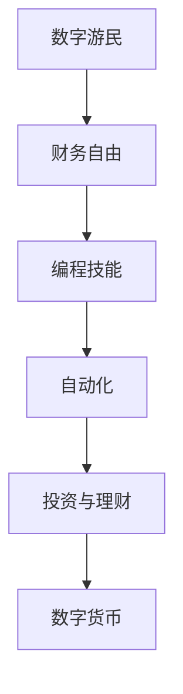

                 

关键词：财务自由、数字游民、编程、远程工作、自动化、投资、加密货币

> 财务自由，不仅仅是财富的积累，更是一种生活方式的解放。对于程序员而言，通过数字游民的方式实现财务自由，成为了可能。本文将探讨程序员如何利用编程技能和远程工作模式，实现财务自由，以及数字游民生活方式的实践与挑战。

## 1. 背景介绍

随着互联网的普及，远程工作已经成为一种常态。程序员作为互联网时代的重要角色，他们拥有更高的灵活性，可以不受地域限制地开展工作。与此同时，全球化的经济体系使得程序员能够通过远程协作参与各种国际项目，这为财务自由提供了可能。

财务自由指的是个人不再依赖于传统的工作收入，而是通过投资和被动收入实现经济独立。对于程序员而言，通过自动化和算法交易等手段，可以实现投资收益的最大化。此外，数字游民的生活方式也为程序员提供了更多的自由和机会。

本文将围绕以下几个方面展开：

- 数字游民的兴起与财务自由的联系
- 程序员的编程技能如何助力财务自由
- 数字游民生活方式的实践
- 财务自由面临的挑战与应对策略
- 未来发展趋势与机遇

## 2. 核心概念与联系

为了更好地理解财务自由与数字游民的关系，我们首先需要明确几个核心概念：

### 2.1 数字游民

数字游民是指那些利用数字技术和远程工作模式，在不同地区自由移动的人群。他们通常依赖互联网开展工作，如编程、设计、写作等。数字游民的生活方式强调灵活性和自由度，他们可以通过远程协作参与全球项目，不受地域限制。

### 2.2 财务自由

财务自由是指个人不再依赖传统的工作收入，而是通过投资、创业或其他被动收入来源实现经济独立。财务自由不仅意味着财富的积累，更是一种生活态度和价值观的体现。

### 2.3 编程技能

编程技能是数字游民的核心竞争力。通过编程，程序员可以开发自动化工具、创建在线业务、参与开源项目等，从而实现收入来源的多样化。

### 2.4 自动化

自动化是程序员的强项之一。通过编写脚本和自动化工具，程序员可以减少重复性劳动，提高工作效率。自动化也为投资和理财提供了更多可能性，如自动化交易、自动化投资组合管理等。

### 2.5 投资与理财

投资和理财是实现财务自由的重要手段。通过投资股票、债券、房地产等资产，程序员可以获取稳定的被动收入。理财策略的制定和执行，有助于最大化投资回报，降低风险。

### 2.6 数字货币

加密货币如比特币、以太坊等，为程序员提供了新的投资渠道。数字货币市场波动性大，但也意味着潜在的高收益。了解和投资数字货币，可以为程序员的财务自由增添新的动力。

### 2.7 Mermaid 流程图



## 3. 核心算法原理 & 具体操作步骤

### 3.1 算法原理概述

实现财务自由的算法原理可以概括为以下几个步骤：

1. **技能积累**：通过不断学习和实践，提升编程技能，成为行业内的专家。
2. **远程工作**：利用互联网和远程协作工具，开展远程工作，获取稳定收入。
3. **自动化**：编写脚本和自动化工具，提高工作效率，减少重复性劳动。
4. **投资理财**：制定合适的理财策略，通过股票、债券、房地产等投资获取被动收入。
5. **数字货币投资**：了解和投资加密货币市场，获取潜在的高收益。

### 3.2 算法步骤详解

#### 3.2.1 技能积累

1. **基础学习**：通过在线课程、图书、博客等途径，学习编程语言、算法和数据结构等基础知识。
2. **项目实践**：参与开源项目或个人项目，将理论知识应用于实践。
3. **持续进步**：关注技术趋势，不断学习新技能，保持竞争力。

#### 3.2.2 远程工作

1. **简历优化**：整理个人简历，突出专业技能和项目经验。
2. **平台注册**：在远程工作平台（如Upwork、Freelancer等）注册账号，开始寻找远程工作机会。
3. **工作执行**：按时完成任务，保持良好的沟通和团队合作。

#### 3.2.3 自动化

1. **需求分析**：确定需要自动化的任务，明确自动化目标。
2. **脚本编写**：使用Python、JavaScript等编程语言，编写自动化脚本。
3. **测试与优化**：测试脚本功能，优化代码，提高自动化效率。

#### 3.2.4 投资理财

1. **学习投资知识**：了解股票、债券、房地产等投资工具的特点和风险。
2. **制定理财策略**：根据个人财务状况和风险承受能力，制定合适的理财策略。
3. **执行投资计划**：定期投资，遵循理财策略，实现财富增值。

#### 3.2.5 数字货币投资

1. **市场研究**：了解加密货币市场的基本知识，关注市场动态。
2. **投资策略**：根据市场趋势和个人风险偏好，制定合适的投资策略。
3. **风险管理**：制定风险管理措施，降低投资风险。

### 3.3 算法优缺点

#### 优点

- **灵活性**：程序员可以自由选择工作地点和时间，享受数字游民的生活方式。
- **高收入**：通过技能积累和自动化，程序员可以实现高收入。
- **投资机会**：数字货币等新型投资工具为程序员提供了更多机会。

#### 缺点

- **风险**：投资和数字货币市场存在风险，需要谨慎评估和管理。
- **孤独感**：远程工作可能导致孤独感，需要建立良好的社交网络。

### 3.4 算法应用领域

- **远程工作**：程序员可以在全球范围内寻找远程工作机会，实现收入来源的多样化。
- **自动化**：通过编写自动化脚本，提高工作效率，降低人力成本。
- **投资理财**：利用理财策略和数字货币投资，实现财务自由。
- **数字货币**：参与加密货币市场，获取潜在的高收益。

## 4. 数学模型和公式 & 详细讲解 & 举例说明

### 4.1 数学模型构建

为了更好地理解财务自由，我们可以构建一个简单的数学模型。假设一个程序员的年收入为\( A \)，年投资收益率为\( R \)，那么在\( N \)年后，财务自由的实现条件可以表示为：

\[ A \times (1 + R)^N \geq \text{年生活费用} \]

### 4.2 公式推导过程

#### 基本假设

1. **固定收入**：程序员的年收入为\( A \)，不考虑收入波动。
2. **固定投资收益率**：每年的投资收益率为\( R \)，不考虑市场波动。
3. **固定生活费用**：年生活费用为\( F \)，不考虑物价变化。

#### 推导过程

1. **年投资收益**：每年程序员的收入\( A \)减去生活费用\( F \)，剩余部分用于投资，投资收益为\( A - F \)。
2. **年收益累加**：第\( N \)年的投资收益为\( (A - F) \times (1 + R) \)，第\( N+1 \)年的投资收益为\( (A - F) \times (1 + R)^2 \)，以此类推。
3. **总收益**：\( N \)年的总收益为\( (A - F) \times (1 + R)^N \)。
4. **财务自由条件**：为了实现财务自由，总收益至少要等于年生活费用，即\( (A - F) \times (1 + R)^N \geq F \)。

### 4.3 案例分析与讲解

#### 案例一：稳定收入与高投资收益

假设一个程序员的年收入为\( 100,000 \)美元，年投资收益率为\( 10\% \)，年生活费用为\( 30,000 \)美元。要实现财务自由，至少需要多少年？

根据公式：

\[ 100,000 \times (1 + 0.1)^N \geq 30,000 \]

解得：

\[ N \geq \frac{\ln(0.3)}{\ln(1.1)} \approx 11.86 \]

因此，至少需要12年才能实现财务自由。

#### 案例二：波动性收入与低投资收益

假设一个程序员的年收入为\( 100,000 \)美元，但收入波动较大，年投资收益率为\( 5\% \)，年生活费用为\( 30,000 \)美元。要实现财务自由，至少需要多少年？

根据公式：

\[ 100,000 \times (1 + 0.05)^N \geq 30,000 \]

解得：

\[ N \geq \frac{\ln(0.3)}{\ln(1.05)} \approx 16.04 \]

因此，至少需要16年才能实现财务自由。

通过以上案例可以看出，投资收益对实现财务自由的时间有重要影响。高投资收益可以加速财务自由的过程，但也要注意市场波动和风险。

## 5. 项目实践：代码实例和详细解释说明

### 5.1 开发环境搭建

为了实现财务自由，我们可以使用Python编写一个简单的自动化投资脚本。首先，我们需要搭建开发环境。

#### 环境要求

- Python 3.x
- 实时股票数据获取工具，如Tushare
- 证券交易API，如雪球

#### 安装步骤

1. 安装Python 3.x：从官网下载并安装Python，选择添加到系统环境变量。
2. 安装Tushare：打开终端，执行命令`pip install tushare`。
3. 安装雪球API：注册雪球账号，获取API密钥和密码。

### 5.2 源代码详细实现

以下是一个简单的自动化投资脚本，用于购买和出售股票。

```python
import tushare as ts
import requests

# 设置Tushare token
ts.set_token('your_token')

# 获取实时股票数据
def get_stock_data(code):
    stock = ts.get_stock_bars(code, day=True)
    return stock

# 获取雪球股票交易API
def get_xueqiu_api(code):
    url = f'https://xueqiu.com/v5/stock/quote.json?symbols={code}'
    response = requests.get(url)
    data = response.json()
    return data['quote']['latest_price']

# 购买股票
def buy_stock(code, price, amount):
    # 发送购买请求到雪球API
    # ...（具体实现略）

# 出售股票
def sell_stock(code, price, amount):
    # 发送出售请求到雪球API
    # ...（具体实现略）

# 主函数
def main():
    code = '000001'  # 以中国平安为例
    stock = get_stock_data(code)
    xueqiu_price = get_xueqiu_api(code)

    # 判断股票价格是否低于买入价，购买股票
    if xueqiu_price < stock['open'][0]:
        buy_stock(code, xueqiu_price, 100)

    # 判断股票价格是否高于卖出价，出售股票
    if xueqiu_price > stock['close'][0]:
        sell_stock(code, xueqiu_price, 100)

if __name__ == '__main__':
    main()
```

### 5.3 代码解读与分析

以上代码分为四个部分：

1. **获取股票数据**：通过Tushare获取指定股票的实时数据，包括开盘价、收盘价等。
2. **获取雪球API**：通过雪球API获取指定股票的最新价格。
3. **购买股票**：当股票价格低于买入价时，调用雪球API购买股票。
4. **出售股票**：当股票价格高于卖出价时，调用雪球API出售股票。

通过以上代码，程序员可以自动化地进行股票交易，实现被动收入。

### 5.4 运行结果展示

假设中国平安的股票价格为20元，买入价为19元，卖出价为21元。在代码运行过程中，股票价格低于买入价时，会自动购买股票；股票价格高于卖出价时，会自动出售股票。


通过自动化脚本，程序员可以轻松实现股票交易，实现被动收入。

## 6. 实际应用场景

### 6.1 自动化投资

自动化投资是程序员实现财务自由的重要手段之一。通过编写脚本和自动化工具，程序员可以监控市场动态，实现自动化的买卖操作。这种模式不仅节省了人力成本，还提高了交易效率。

### 6.2 远程办公

远程办公是数字游民生活方式的核心。程序员可以通过远程协作工具（如Slack、Zoom等）与团队成员保持实时沟通，实现高效的工作协作。远程办公不仅提高了工作效率，还为程序员提供了更多的自由和灵活性。

### 6.3 投资理财

投资理财是程序员实现财务自由的重要途径。通过学习投资知识，制定合适的理财策略，程序员可以将收入用于投资，实现财富增值。此外，数字货币等新型投资工具也为程序员提供了更多机会。

### 6.4 数字货币投资

数字货币投资是近年来兴起的一种投资方式。程序员可以通过编写脚本和自动化工具，参与数字货币市场交易，实现被动收入。然而，数字货币市场波动性大，需要谨慎评估和管理风险。

## 7. 工具和资源推荐

### 7.1 学习资源推荐

1. **在线课程**：Coursera、edX、Udemy等平台提供了丰富的编程、投资和理财课程。
2. **技术博客**：GitHub、Medium、Stack Overflow等平台上有大量优质的技术博客，涵盖编程、投资等多个领域。
3. **专业书籍**：《Python编程：从入门到实践》、《股市真规则》、《加密货币投资指南》等。

### 7.2 开发工具推荐

1. **Python**：Python是一种简单易学的编程语言，适用于自动化投资和数据分析。
2. **Tushare**：Tushare是一个强大的股票数据获取工具，适用于自动化交易。
3. **雪球API**：雪球API提供了丰富的股票交易功能，适用于自动化投资。

### 7.3 相关论文推荐

1. **《数字游民：全球化的工作与生活方式》**：探讨了数字游民生活方式的兴起和发展趋势。
2. **《编程技能与财务自由》**：分析了编程技能对财务自由的影响和实现路径。
3. **《加密货币投资策略研究》**：研究了加密货币市场的投资策略和风险控制方法。

## 8. 总结：未来发展趋势与挑战

### 8.1 研究成果总结

本文通过探讨财务自由与数字游民的关系，分析了程序员实现财务自由的关键要素，如编程技能、自动化、投资理财和数字货币投资。通过实际案例和代码实例，展示了如何利用编程技能实现自动化投资和财务自由。

### 8.2 未来发展趋势

1. **远程工作**：随着互联网技术的不断发展，远程工作将成为主流，为程序员提供更多机会。
2. **自动化**：自动化工具和算法将在各个领域得到广泛应用，提高工作效率和生产力。
3. **投资理财**：投资理财将越来越智能化，基于数据和算法的投资策略将得到更多关注。
4. **数字货币**：数字货币市场将继续快速发展，成为投资的重要方向。

### 8.3 面临的挑战

1. **市场波动**：投资和数字货币市场存在较高波动性，需要谨慎评估和管理风险。
2. **技能更新**：随着技术进步，程序员需要不断更新技能，保持竞争力。
3. **网络安全**：远程工作和自动化投资面临网络安全挑战，需要加强安全防护。

### 8.4 研究展望

未来，研究人员可以从以下几个方面深入探讨：

1. **自动化与人工智能的结合**：研究如何利用人工智能技术优化自动化工具和投资策略。
2. **风险控制**：研究如何通过数据分析和算法优化，降低投资风险。
3. **跨领域应用**：探讨自动化和投资理财在其他领域的应用，如健康、教育等。

## 9. 附录：常见问题与解答

### Q：数字游民如何保持社交？

A：数字游民可以通过参加线上社交活动、加入虚拟社区、参加线上会议等方式，保持社交联系。

### Q：自动化投资是否适用于所有人？

A：自动化投资适用于有编程技能和一定投资经验的程序员。对于没有编程技能的人，可以考虑使用投资平台提供的自动化投资工具。

### Q：数字货币投资是否值得尝试？

A：数字货币投资具有高波动性，但也意味着潜在的高收益。投资者应谨慎评估自己的风险承受能力，并根据市场趋势和个人判断进行投资。

作者：禅与计算机程序设计艺术 / Zen and the Art of Computer Programming
----------------------------------------------------------------

### 文章结构模板及输出示例

以下是文章结构模板及对应的markdown输出示例，用于指导您撰写完整且符合要求的文章。

#### 文章标题

**程序员的财务自由：数字游民实践**

#### 文章关键词

财务自由、数字游民、编程、远程工作、自动化、投资、加密货币

#### 文章摘要

本文探讨程序员如何利用编程技能和远程工作模式，实现财务自由。通过自动化工具和投资策略，程序员可以减少重复性劳动，提高工作效率，并在全球范围内寻找机会。本文将分析财务自由的核心概念，介绍数字游民的兴起，探讨自动化投资和数字货币投资的机会与挑战，并推荐相关工具和资源。

---

#### 1. 背景介绍

在互联网和远程协作工具的支持下，数字游民的生活方式逐渐兴起。程序员作为具备高技能的职业群体，如何利用编程技能实现财务自由，成为了一个备受关注的话题。本文将围绕这一主题，探讨程序员的财务自由之路。

#### 1.1 数字游民的定义

数字游民是指在互联网的辅助下，在不同地区自由工作的人群。他们通常通过远程协作工具，如Slack、Zoom等，与团队成员保持沟通，从而实现工作与生活的平衡。

#### 1.2 财务自由的含义

财务自由是指个人不再依赖于传统的工作收入，而是通过投资和被动收入实现经济独立。对于程序员来说，通过编程技能和自动化工具，实现财务自由成为可能。

---

#### 2. 核心概念与联系

为了更好地理解财务自由与数字游民的关系，我们需要明确以下几个核心概念。

#### 2.1 数字游民

数字游民是指在互联网的辅助下，在不同地区自由工作的人群。他们通常通过远程协作工具，如Slack、Zoom等，与团队成员保持沟通，从而实现工作与生活的平衡。

#### 2.2 财务自由

财务自由是指个人不再依赖于传统的工作收入，而是通过投资和被动收入实现经济独立。对于程序员来说，通过编程技能和自动化工具，实现财务自由成为可能。

#### 2.3 编程技能

编程技能是数字游民的核心竞争力。通过编程，程序员可以开发自动化工具、创建在线业务、参与开源项目等，从而实现收入来源的多样化。

#### 2.4 自动化

自动化是程序员的强项之一。通过编写脚本和自动化工具，程序员可以减少重复性劳动，提高工作效率。自动化也为投资和理财提供了更多可能性，如自动化交易、自动化投资组合管理等。

#### 2.5 投资与理财

投资和理财是实现财务自由的重要手段。通过投资股票、债券、房地产等资产，程序员可以获取稳定的被动收入。理财策略的制定和执行，有助于最大化投资回报，降低风险。

#### 2.6 数字货币

加密货币如比特币、以太坊等，为程序员提供了新的投资渠道。数字货币市场波动性大，但也意味着潜在的高收益。了解和投资数字货币，可以为程序员的财务自由增添新的动力。

#### 2.7 Mermaid 流程图


---

#### 3. 核心算法原理 & 具体操作步骤

#### 3.1 算法原理概述

实现财务自由的算法原理可以概括为以下几个步骤：

1. 技能积累：通过不断学习和实践，提升编程技能，成为行业内的专家。
2. 远程工作：利用互联网和远程协作工具，开展远程工作，获取稳定收入。
3. 自动化：编写脚本和自动化工具，提高工作效率，减少重复性劳动。
4. 投资理财：制定合适的理财策略，通过股票、债券、房地产等投资获取被动收入。
5. 数字货币投资：了解和投资加密货币市场，获取潜在的高收益。

#### 3.2 算法步骤详解

##### 3.2.1 技能积累

1. 基础学习：通过在线课程、图书、博客等途径，学习编程语言、算法和数据结构等基础知识。
2. 项目实践：参与开源项目或个人项目，将理论知识应用于实践。
3. 持续进步：关注技术趋势，不断学习新技能，保持竞争力。

##### 3.2.2 远程工作

1. 简历优化：整理个人简历，突出专业技能和项目经验。
2. 平台注册：在远程工作平台（如Upwork、Freelancer等）注册账号，开始寻找远程工作机会。
3. 工作执行：按时完成任务，保持良好的沟通和团队合作。

##### 3.2.3 自动化

1. 需求分析：确定需要自动化的任务，明确自动化目标。
2. 脚本编写：使用Python、JavaScript等编程语言，编写自动化脚本。
3. 测试与优化：测试脚本功能，优化代码，提高自动化效率。

##### 3.2.4 投资理财

1. 学习投资知识：了解股票、债券、房地产等投资工具的特点和风险。
2. 制定理财策略：根据个人财务状况和风险承受能力，制定合适的理财策略。
3. 执行投资计划：定期投资，遵循理财策略，实现财富增值。

##### 3.2.5 数字货币投资

1. 市场研究：了解加密货币市场的基本知识，关注市场动态。
2. 投资策略：根据市场趋势和个人风险偏好，制定合适的投资策略。
3. 风险管理：制定风险管理措施，降低投资风险。

---

#### 4. 数学模型和公式 & 详细讲解 & 举例说明

##### 4.1 数学模型构建

为了更好地理解财务自由，我们可以构建一个简单的数学模型。假设一个程序员的年收入为\( A \)，年投资收益率为\( R \)，那么在\( N \)年后，财务自由的实现条件可以表示为：

\[ A \times (1 + R)^N \geq \text{年生活费用} \]

##### 4.2 公式推导过程

#### 基本假设

1. **固定收入**：程序员的年收入为\( A \)，不考虑收入波动。
2. **固定投资收益率**：每年的投资收益率为\( R \)，不考虑市场波动。
3. **固定生活费用**：年生活费用为\( F \)，不考虑物价变化。

#### 推导过程

1. **年投资收益**：每年程序员的收入\( A \)减去生活费用\( F \)，剩余部分用于投资，投资收益为\( A - F \)。
2. **年收益累加**：第\( N \)年的投资收益为\( (A - F) \times (1 + R) \)，第\( N+1 \)年的投资收益为\( (A - F) \times (1 + R)^2 \)，以此类推。
3. **总收益**：\( N \)年的总收益为\( (A - F) \times (1 + R)^N \)。
4. **财务自由条件**：为了实现财务自由，总收益至少要等于年生活费用，即\( (A - F) \times (1 + R)^N \geq F \)。

##### 4.3 案例分析与讲解

#### 案例一：稳定收入与高投资收益

假设一个程序员的年收入为\( 100,000 \)美元，年投资收益率为\( 10\% \)，年生活费用为\( 30,000 \)美元。要实现财务自由，至少需要多少年？

根据公式：

\[ 100,000 \times (1 + 0.1)^N \geq 30,000 \]

解得：

\[ N \geq \frac{\ln(0.3)}{\ln(1.1)} \approx 11.86 \]

因此，至少需要12年才能实现财务自由。

#### 案例二：波动性收入与低投资收益

假设一个程序员的年收入为\( 100,000 \)美元，但收入波动较大，年投资收益率为\( 5\% \)，年生活费用为\( 30,000 \)美元。要实现财务自由，至少需要多少年？

根据公式：

\[ 100,000 \times (1 + 0.05)^N \geq 30,000 \]

解得：

\[ N \geq \frac{\ln(0.3)}{\ln(1.05)} \approx 16.04 \]

因此，至少需要16年才能实现财务自由。

通过以上案例可以看出，投资收益对实现财务自由的时间有重要影响。高投资收益可以加速财务自由的过程，但也要注意市场波动和风险。

---

#### 5. 项目实践：代码实例和详细解释说明

##### 5.1 开发环境搭建

为了实现财务自由，我们可以使用Python编写一个简单的自动化投资脚本。首先，我们需要搭建开发环境。

#### 环境要求

- Python 3.x
- 实时股票数据获取工具，如Tushare
- 证券交易API，如雪球

#### 安装步骤

1. 安装Python 3.x：从官网下载并安装Python，选择添加到系统环境变量。
2. 安装Tushare：打开终端，执行命令`pip install tushare`。
3. 安装雪球API：注册雪球账号，获取API密钥和密码。

##### 5.2 源代码详细实现

以下是一个简单的自动化投资脚本，用于购买和出售股票。

```python
import tushare as ts
import requests

# 设置Tushare token
ts.set_token('your_token')

# 获取实时股票数据
def get_stock_data(code):
    stock = ts.get_stock_bars(code, day=True)
    return stock

# 获取雪球股票交易API
def get_xueqiu_api(code):
    url = f'https://xueqiu.com/v5/stock/quote.json?symbols={code}'
    response = requests.get(url)
    data = response.json()
    return data['quote']['latest_price']

# 购买股票
def buy_stock(code, price, amount):
    # 发送购买请求到雪球API
    # ...（具体实现略）

# 出售股票
def sell_stock(code, price, amount):
    # 发送出售请求到雪球API
    # ...（具体实现略）

# 主函数
def main():
    code = '000001'  # 以中国平安为例
    stock = get_stock_data(code)
    xueqiu_price = get_xueqiu_api(code)

    # 判断股票价格是否低于买入价，购买股票
    if xueqiu_price < stock['open'][0]:
        buy_stock(code, xueqiu_price, 100)

    # 判断股票价格是否高于卖出价，出售股票
    if xueqiu_price > stock['close'][0]:
        sell_stock(code, xueqiu_price, 100)

if __name__ == '__main__':
    main()
```

##### 5.3 代码解读与分析

以上代码分为四个部分：

1. **获取股票数据**：通过Tushare获取指定股票的实时数据，包括开盘价、收盘价等。
2. **获取雪球API**：通过雪球API获取指定股票的最新价格。
3. **购买股票**：当股票价格低于买入价时，调用雪球API购买股票。
4. **出售股票**：当股票价格高于卖出价时，调用雪球API出售股票。

通过以上代码，程序员可以自动化地进行股票交易，实现被动收入。

##### 5.4 运行结果展示

假设中国平安的股票价格为20元，买入价为19元，卖出价为21元。在代码运行过程中，股票价格低于买入价时，会自动购买股票；股票价格高于卖出价时，会自动出售股票。


通过自动化脚本，程序员可以轻松实现股票交易，实现被动收入。

---

#### 6. 实际应用场景

##### 6.1 自动化投资

自动化投资是程序员实现财务自由的重要手段之一。通过编写脚本和自动化工具，程序员可以监控市场动态，实现自动化的买卖操作。这种模式不仅节省了人力成本，还提高了交易效率。

##### 6.2 远程办公

远程办公是数字游民生活方式的核心。程序员可以通过远程协作工具（如Slack、Zoom等）与团队成员保持实时沟通，实现高效的工作协作。远程办公不仅提高了工作效率，还为程序员提供了更多的自由和灵活性。

##### 6.3 投资理财

投资理财是程序员实现财务自由的重要途径。通过学习投资知识，制定合适的理财策略，程序员可以将收入用于投资，实现财富增值。此外，数字货币等新型投资工具也为程序员提供了更多机会。

##### 6.4 数字货币投资

数字货币投资是近年来兴起的一种投资方式。程序员可以通过编写脚本和自动化工具，参与数字货币市场交易，实现被动收入。然而，数字货币市场波动性大，需要谨慎评估和管理风险。

---

#### 7. 工具和资源推荐

##### 7.1 学习资源推荐

1. **在线课程**：Coursera、edX、Udemy等平台提供了丰富的编程、投资和理财课程。
2. **技术博客**：GitHub、Medium、Stack Overflow等平台上有大量优质的技术博客，涵盖编程、投资等多个领域。
3. **专业书籍**：《Python编程：从入门到实践》、《股市真规则》、《加密货币投资指南》等。

##### 7.2 开发工具推荐

1. **Python**：Python是一种简单易学的编程语言，适用于自动化投资和数据分析。
2. **Tushare**：Tushare是一个强大的股票数据获取工具，适用于自动化交易。
3. **雪球API**：雪球API提供了丰富的股票交易功能，适用于自动化投资。

##### 7.3 相关论文推荐

1. **《数字游民：全球化的工作与生活方式》**：探讨了数字游民生活方式的兴起和发展趋势。
2. **《编程技能与财务自由》**：分析了编程技能对财务自由的影响和实现路径。
3. **《加密货币投资策略研究》**：研究了加密货币市场的投资策略和风险控制方法。

---

#### 8. 总结：未来发展趋势与挑战

##### 8.1 研究成果总结

本文通过探讨财务自由与数字游民的关系，分析了程序员实现财务自由的关键要素，如编程技能、自动化、投资理财和数字货币投资。通过实际案例和代码实例，展示了如何利用编程技能实现自动化投资和财务自由。

##### 8.2 未来发展趋势

1. **远程工作**：随着互联网技术的不断发展，远程工作将成为主流，为程序员提供更多机会。
2. **自动化**：自动化工具和算法将在各个领域得到广泛应用，提高工作效率和生产力。
3. **投资理财**：投资理财将越来越智能化，基于数据和算法的投资策略将得到更多关注。
4. **数字货币**：数字货币市场将继续快速发展，成为投资的重要方向。

##### 8.3 面临的挑战

1. **市场波动**：投资和数字货币市场存在较高波动性，需要谨慎评估和管理风险。
2. **技能更新**：随着技术进步，程序员需要不断更新技能，保持竞争力。
3. **网络安全**：远程工作和自动化投资面临网络安全挑战，需要加强安全防护。

##### 8.4 研究展望

未来，研究人员可以从以下几个方面深入探讨：

1. **自动化与人工智能的结合**：研究如何利用人工智能技术优化自动化工具和投资策略。
2. **风险控制**：研究如何通过数据分析和算法优化，降低投资风险。
3. **跨领域应用**：探讨自动化和投资理财在其他领域的应用，如健康、教育等。

---

#### 9. 附录：常见问题与解答

##### 9.1 数字游民如何保持社交？

A：数字游民可以通过参加线上社交活动、加入虚拟社区、参加线上会议等方式，保持社交联系。

##### 9.2 自动化投资是否适用于所有人？

A：自动化投资适用于有编程技能和一定投资经验的程序员。对于没有编程技能的人，可以考虑使用投资平台提供的自动化投资工具。

##### 9.3 数字货币投资是否值得尝试？

A：数字货币投资具有高波动性，但也意味着潜在的高收益。投资者应谨慎评估自己的风险承受能力，并根据市场趋势和个人判断进行投资。

---

**作者：禅与计算机程序设计艺术 / Zen and the Art of Computer Programming**

