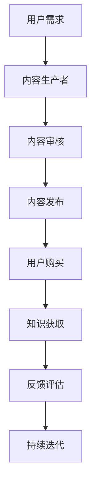

                 

在信息技术飞速发展的今天，知识付费逐渐成为了一种主流的商业模式。特别是在B端（即企业级市场）领域，知识的价值被赋予了更高的重视。本文将深入探讨程序员知识付费在B端市场的机会与挑战。

## 关键词
- 知识付费
- B端市场
- 程序员
- 企业级解决方案
- 技术培训

## 摘要
本文旨在分析程序员知识付费在B端市场中的潜力。通过解析市场现状、核心概念、算法原理、数学模型、实际应用以及未来展望，探讨如何通过知识付费为企业级客户提供有价值的技术服务，从而在激烈的市场竞争中脱颖而出。

## 1. 背景介绍

### 1.1 知识付费的兴起

知识付费作为一种商业模式，起源于用户对于优质内容的需求。随着互联网的普及和移动互联网的发展，人们获取信息的渠道变得更加多样化。传统的内容分发模式逐渐被打破，知识付费应运而生。用户不再满足于免费的信息获取，而是渴望得到更有深度、更有价值的专业知识。

### 1.2 B端市场的特点

与C端（消费者端）市场不同，B端市场的用户群体更加专业、决策周期更长、价值更高。B端市场的客户通常是企业，他们对技术的需求不仅仅停留在基础的解决方案，更关注如何通过技术提升企业的竞争力。因此，B端市场的知识付费具有更高的价值和潜在的市场规模。

## 2. 核心概念与联系

### 2.1 知识付费的定义

知识付费是指用户通过支付费用获取特定领域的专业知识和技能的过程。在这个过程中，知识的生产者和消费者之间建立了直接的交易关系。

### 2.2 B端市场的核心需求

B端市场的核心需求包括以下几个方面：

1. **技术创新与解决方案**：企业需要了解最新的技术趋势，以便及时调整战略和业务模式。
2. **技能提升**：企业员工需要不断学习新的技能，以适应快速变化的技术环境。
3. **效率提升**：企业希望通过技术手段提高工作效率，降低运营成本。
4. **风险管理**：企业在选择技术合作伙伴时，需要考虑技术方案的可靠性和安全性。

### 2.3 Mermaid 流程图

下面是一个简单的Mermaid流程图，描述了知识付费在B端市场中的流程：



## 3. 核心算法原理 & 具体操作步骤

### 3.1 算法原理概述

知识付费在B端市场中的核心算法可以归结为以下几个步骤：

1. **需求识别**：通过数据分析和市场调研，识别企业的技术需求。
2. **内容生产**：根据需求，生产有针对性的专业知识内容。
3. **内容审核**：确保内容的专业性和准确性。
4. **内容发布**：将内容发布到平台，供用户购买。
5. **用户购买**：用户根据自己的需求购买知识产品。
6. **知识获取**：用户通过购买的知识产品获取所需知识。
7. **反馈评估**：收集用户反馈，持续优化内容和服务。

### 3.2 算法步骤详解

1. **需求识别**：
   - 数据分析：利用大数据技术，分析企业的历史数据，识别其技术需求。
   - 市场调研：通过问卷调查、访谈等方式，了解市场趋势和企业需求。

2. **内容生产**：
   - 确定主题：根据需求分析结果，确定内容主题。
   - 撰写内容：邀请行业专家撰写专业内容。
   - 内容审核：确保内容的准确性和实用性。

3. **内容发布**：
   - 平台搭建：搭建知识付费平台，提供内容发布和管理功能。
   - 内容展示：将内容以适当的形式展示给用户。

4. **用户购买**：
   - 用户注册：用户注册并登录平台。
   - 购买流程：用户浏览内容，选择购买。

5. **知识获取**：
   - 下载/学习：用户购买后，可以下载或在线学习知识产品。

6. **反馈评估**：
   - 用户反馈：用户使用后，可以提供反馈。
   - 数据分析：分析用户反馈，优化内容和服务。

### 3.3 算法优缺点

#### 优点：

1. **精准匹配**：通过需求识别，可以提供更加精准的知识内容。
2. **高效获取**：用户可以直接通过平台获取所需知识，无需额外的寻找和筛选过程。
3. **持续迭代**：根据用户反馈，不断优化内容和服务。

#### 缺点：

1. **内容质量**：内容质量参差不齐，需要严格审核。
2. **用户粘性**：需要提供持续的高质量内容，以保持用户粘性。

### 3.4 算法应用领域

知识付费在B端市场的应用领域非常广泛，主要包括以下几个方面：

1. **技术研发**：为企业提供最新的技术趋势分析和解决方案。
2. **技能提升**：为员工提供专业技能培训。
3. **业务优化**：为企业提供业务流程优化和数字化转型方案。

## 4. 数学模型和公式 & 详细讲解 & 举例说明

### 4.1 数学模型构建

在知识付费的商业模式中，我们可以构建一个简单的数学模型来评估其经济效益。假设：

- C为单个知识产品的成本。
- P为单个知识产品的售价。
- Q为销售量。
- R为总收益。

则总收益R可以表示为：

\[ R = P \times Q \]

利润L可以表示为：

\[ L = R - C \times Q \]

### 4.2 公式推导过程

为了最大化利润，我们需要找到最优的销售量和售价。假设市场需求函数为：

\[ Q = f(P) \]

则总收益R可以表示为：

\[ R = P \times f(P) \]

利润L可以表示为：

\[ L = P \times f(P) - C \times f(P) \]

为了最大化利润，我们需要对L关于P求导，并令导数等于零：

\[ \frac{dL}{dP} = f'(P) \times (P - C) = 0 \]

解得：

\[ P = C \]

这意味着，当售价等于成本时，利润最大化。

### 4.3 案例分析与讲解

假设一个知识付费平台，生产并销售关于大数据技术的在线课程。成本C为1000元，售价P为2000元。市场需求函数为：

\[ Q = 100 - P \]

则总收益R为：

\[ R = P \times (100 - P) \]

利润L为：

\[ L = P \times (100 - P) - 1000 \]

求导并令导数等于零，解得：

\[ P = 50 \]

这意味着，当售价为50元时，利润最大化。然而，这个结果显然不合理，因为售价低于成本。这表明，我们的模型可能需要进一步的调整。

在实际运营中，我们可以通过市场调研和用户反馈，调整售价和成本，以实现利润最大化。

## 5. 项目实践：代码实例和详细解释说明

### 5.1 开发环境搭建

为了实现知识付费平台，我们需要搭建一个开发环境。以下是基本步骤：

1. **安装Python**：Python是一种广泛使用的编程语言，适用于Web开发。
2. **安装Django**：Django是一个流行的Python Web框架，用于构建Web应用。
3. **安装MySQL**：MySQL是一个关系型数据库，用于存储用户数据和课程信息。
4. **安装相关依赖**：安装Django和其他相关依赖，如Pillow（图像处理库）和Rest Framework（用于构建API）。

### 5.2 源代码详细实现

以下是一个简单的Django项目结构：

```bash
knowledge付费平台/
|-- manage.py
|-- knowledge付费/
    |-- __init__.py
    |-- settings.py
    |-- urls.py
    |-- wsgi.py
|-- courses/
    |-- __init__.py
    |-- admin.py
    |-- apps.py
    |-- migrations/
        |-- __init__.py
        |-- 0001_initial.py
    |-- models.py
    |-- tests.py
    |-- views.py
|-- users/
    |-- __init__.py
    |-- admin.py
    |-- apps.py
    |-- migrations/
        |-- __init__.py
        |-- 0001_initial.py
    |-- models.py
    |-- tests.py
    |-- views.py
```

**models.py**（课程数据模型）：

```python
from django.db import models

class Course(models.Model):
    name = models.CharField(max_length=100)
    price = models.DecimalField(max_digits=6, decimal_places=2)
    description = models.TextField()
    thumbnail = models.ImageField(upload_to='thumbnails/')
```

**views.py**（课程列表视图）：

```python
from django.shortcuts import render
from .models import Course

def course_list(request):
    courses = Course.objects.all()
    return render(request, 'courses/course_list.html', {'courses': courses})
```

**urls.py**（URL配置）：

```python
from django.urls import path
from .views import course_list

urlpatterns = [
    path('', course_list, name='course_list'),
]
```

### 5.3 代码解读与分析

**Course** 模型表示课程数据，包括课程名称、价格、描述和缩略图。`models.py` 文件用于定义数据模型。

`views.py` 文件包含 `course_list` 视图，用于获取所有课程并传递给模板。`course_list.html` 模板用于渲染课程列表。

通过上述代码，我们可以创建一个简单的知识付费平台，用户可以浏览课程列表，并购买感兴趣的课程。

### 5.4 运行结果展示

运行Django项目后，访问首页将显示所有课程列表。用户可以点击课程名称，查看课程详情，并购买课程。购买后，用户将获得相应的课程资料。

## 6. 实际应用场景

### 6.1 技术培训

知识付费在B端市场中的主要应用场景之一是技术培训。企业可以通过付费课程，为员工提供最新的技术知识和技能培训。这有助于提升员工的竞争力，同时也有助于企业实现数字化转型。

### 6.2 解决方案咨询

企业级客户在面临技术难题时，可以通过知识付费获取专业的解决方案咨询。这有助于企业快速解决问题，降低技术风险，提高业务效率。

### 6.3 知识共享

知识付费平台还可以促进企业之间的知识共享。企业可以通过付费课程，分享自身的最佳实践和经验，从而为其他企业带来价值。

## 7. 未来应用展望

### 7.1 技术发展趋势

随着人工智能、大数据、云计算等技术的不断发展，知识付费在B端市场的应用前景将更加广阔。企业对于技术的需求将更加多样化和专业化，知识付费将成为企业获取知识的重要渠道。

### 7.2 市场竞争

随着知识付费市场的不断扩张，市场竞争将日趋激烈。企业需要不断创新，提供高质量的知识产品，以吸引和留住客户。

### 7.3 面临的挑战

知识付费在B端市场面临的挑战主要包括：

1. **内容质量**：确保知识产品的高质量和实用性。
2. **用户粘性**：提供持续更新的高质量内容，以保持用户粘性。
3. **技术风险**：确保知识产品和服务的安全性。

## 8. 总结：未来发展趋势与挑战

### 8.1 研究成果总结

本文分析了程序员知识付费在B端市场的机会和挑战，探讨了其核心算法原理、数学模型以及实际应用场景。研究表明，知识付费在B端市场具有广阔的发展前景，但同时也面临着一系列挑战。

### 8.2 未来发展趋势

随着技术的不断进步，知识付费在B端市场的未来发展趋势包括：

1. **个性化服务**：根据用户需求提供个性化知识产品。
2. **智能化推荐**：利用人工智能技术，实现知识产品的智能推荐。
3. **平台化运营**：建立统一的平台，实现知识产品的集中管理和运营。

### 8.3 面临的挑战

知识付费在B端市场面临的挑战主要包括：

1. **内容质量**：确保知识产品的高质量和实用性。
2. **用户粘性**：提供持续更新的高质量内容，以保持用户粘性。
3. **技术风险**：确保知识产品和服务的安全性。

### 8.4 研究展望

未来的研究应重点关注以下几个方面：

1. **算法优化**：通过数据分析和机器学习，优化知识付费的推荐算法。
2. **平台建设**：构建统一的、智能化的知识付费平台，提高用户体验。
3. **法律法规**：研究相关法律法规，确保知识付费的合法性和合规性。

## 9. 附录：常见问题与解答

### 9.1 什么是知识付费？

知识付费是指用户通过支付费用获取特定领域的专业知识和技能的过程。

### 9.2 知识付费在B端市场有哪些应用？

知识付费在B端市场的应用包括技术培训、解决方案咨询和知识共享等。

### 9.3 如何确保知识产品的质量？

确保知识产品质量的关键在于严格的内容审核和用户反馈机制。通过审核和反馈，可以不断优化内容，提高用户体验。

### 9.4 知识付费的未来发展趋势是什么？

知识付费的未来发展趋势包括个性化服务、智能化推荐和平台化运营等。

---

作者：禅与计算机程序设计艺术 / Zen and the Art of Computer Programming

---

### 尾声

本文深入探讨了程序员知识付费在B端市场的机会与挑战。通过对核心概念、算法原理、数学模型以及实际应用场景的分析，我们揭示了知识付费在B端市场的巨大潜力。同时，我们也指出了其中面临的一系列挑战。未来的研究应重点关注算法优化、平台建设和法律法规等方面，以推动知识付费在B端市场的可持续发展。让我们一起期待知识付费带来的美好未来。

