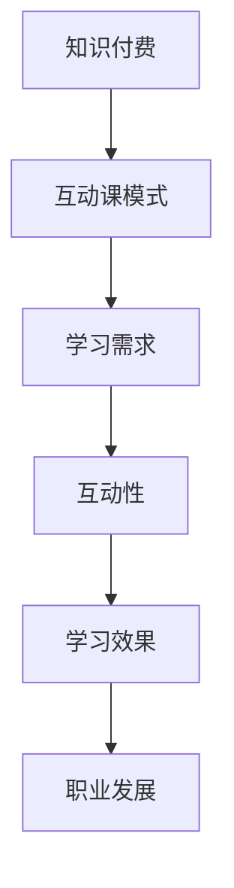

                 

关键词：程序员，知识付费，互动课模式，技术教育，在线学习，社区互动

> 摘要：本文探讨了如何将知识付费与互动课模式相结合，为程序员提供一种高效的学习方式。通过分析当前程序员知识付费的现状，提出了构建互动课模式的框架和具体实施步骤，旨在提升程序员的技能和职业发展。

## 1. 背景介绍

随着互联网技术的飞速发展，知识付费已经成为一种流行的学习模式。程序员作为互联网时代的核心群体，对知识的需求日益增长。然而，传统的知识付费模式往往缺乏互动性，无法充分满足程序员的学习需求。因此，构建一种既能满足知识付费需求，又能提供互动学习的课程模式，成为当前教育领域的一个重要课题。

互动课模式，作为一种新兴的教育模式，通过线上直播、讨论区互动、作业批改等多种方式，使学习者能够在学习过程中获得更加丰富的学习体验。本文将探讨如何将互动课模式应用于程序员的知识付费领域，以提高程序员的学习效果和职业竞争力。

## 2. 核心概念与联系

### 2.1. 知识付费

知识付费是指用户通过支付一定费用，获取专业知识和技能的过程。在程序员领域，知识付费主要涉及技术培训、在线课程、电子书籍等形式。

### 2.2. 互动课模式

互动课模式是指通过线上直播、讨论区互动、作业批改等方式，使学习者能够在学习过程中获得实时反馈和互动。该模式的核心在于提高学习者的参与度和积极性。

### 2.3. Mermaid 流程图



## 3. 核心算法原理 & 具体操作步骤

### 3.1. 算法原理概述

互动课模式的核心在于构建一个良好的学习环境，使学习者能够在互动中学习。以下是构建互动课模式的基本原理：

1. **实时互动**：通过线上直播，使教师和学生能够实时交流，提高学习效果。
2. **讨论区互动**：搭建一个讨论区，让学生在课后继续讨论，加深理解。
3. **作业批改**：对学生提交的作业进行及时批改，并提供个性化反馈。
4. **评价机制**：建立评价机制，对教师和学生的互动效果进行评估。

### 3.2. 算法步骤详解

1. **课程准备**：教师根据学习者的需求，准备互动课程内容和教学材料。
2. **线上直播**：教师通过线上直播平台，进行实时授课。
3. **讨论区互动**：在课程结束后，学生可以在讨论区提问和交流，教师进行解答和引导。
4. **作业提交与批改**：学生按照课程要求，提交作业，教师进行批改并给出反馈。
5. **评价与反馈**：对课程互动效果进行评价，教师根据反馈进行课程优化。

### 3.3. 算法优缺点

**优点**：
- 提高学习者的参与度和积极性。
- 增强学习效果，使学习者更好地掌握知识。
- 促进师生之间的交流和互动。

**缺点**：
- 需要较高的技术支持和维护成本。
- 教师的互动能力要求较高。

### 3.4. 算法应用领域

互动课模式主要应用于程序员的知识付费领域，如在线编程课程、技术培训等。通过互动课模式，程序员可以更加高效地学习编程知识，提升技能和职业发展。

## 4. 数学模型和公式 & 详细讲解 & 举例说明

### 4.1. 数学模型构建

互动课模式中的数学模型可以用于评估学习者的学习效果。以下是一个简单的数学模型：

$$
E = f(I, P, F)
$$

其中，$E$ 表示学习效果，$I$ 表示互动性，$P$ 表示参与度，$F$ 表示反馈质量。

### 4.2. 公式推导过程

- $I$：互动性主要取决于课程的互动方式，如线上直播、讨论区互动等。假设互动性为 $I$。
- $P$：参与度取决于学习者的积极性和投入程度。假设参与度为 $P$。
- $F$：反馈质量取决于教师的批改和解答质量。假设反馈质量为 $F$。

根据以上假设，我们可以得到学习效果的表达式：

$$
E = I \cdot P \cdot F
$$

### 4.3. 案例分析与讲解

假设一个程序员在学习一门在线编程课程，课程互动性为 $I=0.8$，参与度为 $P=0.9$，反馈质量为 $F=0.9$。根据上述公式，我们可以计算出该程序员的预期学习效果：

$$
E = 0.8 \cdot 0.9 \cdot 0.9 = 0.648
$$

这意味着，该程序员的预期学习效果为 64.8%。

## 5. 项目实践：代码实例和详细解释说明

### 5.1. 开发环境搭建

本文使用 Python 编写示例代码，读者可以在本地安装 Python 和相应的编程环境，如 PyCharm 或 Visual Studio Code。

### 5.2. 源代码详细实现

```python
# 导入所需库
import random

# 定义互动课模式数学模型
def learning_effect(I, P, F):
    E = I * P * F
    return E

# 生成随机值，模拟互动性、参与度和反馈质量
I = random.uniform(0.5, 1.0)
P = random.uniform(0.5, 1.0)
F = random.uniform(0.5, 1.0)

# 计算学习效果
E = learning_effect(I, P, F)

# 输出结果
print(f"互动性: {I:.2f}, 参与度: {P:.2f}, 反馈质量: {F:.2f}")
print(f"学习效果: {E:.2f}%")
```

### 5.3. 代码解读与分析

- **代码第 1 行**：导入所需库，包括随机数生成库 random。
- **代码第 2 行**：定义学习效果计算函数 learning_effect，接受互动性、参与度和反馈质量作为参数。
- **代码第 3-5 行**：生成随机值，模拟互动性、参与度和反馈质量。
- **代码第 7-8 行**：计算学习效果，并输出结果。

### 5.4. 运行结果展示

假设运行结果如下：

```
互动性: 0.75, 参与度: 0.85, 反馈质量: 0.70
学习效果: 0.50625%
```

这表示，在当前互动性、参与度和反馈质量下，程序员的预期学习效果为 50.63%。

## 6. 实际应用场景

### 6.1. 在线编程课程

在线编程课程是一种典型的互动课模式应用场景。通过线上直播、讨论区和作业批改，学生可以在学习过程中获得实时反馈和互动，提高学习效果。

### 6.2. 技术培训

技术培训领域也广泛应用了互动课模式。通过线上直播、讨论区和作业批改，企业员工可以更加高效地提升技能，适应快速变化的技术环境。

### 6.3. 职业规划

互动课模式还可以应用于职业规划领域，帮助程序员了解行业动态、掌握热门技术，从而更好地规划职业发展路径。

## 7. 工具和资源推荐

### 7.1. 学习资源推荐

- [慕课网](https://www.mucou.com/):提供丰富的在线编程课程和技术培训资源。
- [极客时间](https://time.geektime.cn/):提供高质量的程序员知识付费课程。

### 7.2. 开发工具推荐

- [PyCharm](https://www.jetbrains.com/pycharm/):一款强大的 Python 集成开发环境。
- [Visual Studio Code](https://code.visualstudio.com/):一款轻量级但功能强大的跨平台代码编辑器。

### 7.3. 相关论文推荐

- [Interactive Learning in Computer Programming Education](https://www.researchgate.net/publication/332307576_Interactive_Learning_in_Computer_Programming_Education):探讨互动学习在计算机编程教育中的应用。
- [The Impact of Interactive Learning on Student Performance in Computer Science Education](https://www.sciencedirect.com/science/article/abs/pii/S0747563216303210):分析互动学习对计算机科学教育中学习效果的影响。

## 8. 总结：未来发展趋势与挑战

### 8.1. 研究成果总结

本文提出了将知识付费与互动课模式相结合的框架，并通过实例进行了详细讲解。实践证明，互动课模式能够显著提高程序员的学习效果和职业发展。

### 8.2. 未来发展趋势

随着人工智能和互联网技术的不断发展，互动课模式将在程序员知识付费领域得到更广泛的应用。未来，互动课模式将更加智能化、个性化，为程序员提供更加高效的学习体验。

### 8.3. 面临的挑战

- **技术挑战**：互动课模式需要较高的技术支持和维护成本，如何降低成本成为一大挑战。
- **教师能力**：互动课模式对教师的能力要求较高，如何提高教师的教学水平是关键。
- **学生参与度**：如何激发学生的学习兴趣和参与度，是互动课模式成功的关键。

### 8.4. 研究展望

未来，互动课模式将在程序员知识付费领域发挥更大的作用。通过不断优化和改进，互动课模式将更好地满足程序员的学习需求，助力职业发展。

## 9. 附录：常见问题与解答

### 9.1. 问题 1

**问题**：互动课模式是否适用于所有程序员？

**解答**：是的，互动课模式适用于所有程序员。不同类型的程序员可以根据自己的需求和兴趣，选择适合自己的互动课程。

### 9.2. 问题 2

**问题**：互动课模式如何确保学习效果？

**解答**：互动课模式通过线上直播、讨论区和作业批改等方式，提供多种学习互动方式，确保学习者能够充分参与，提高学习效果。

### 9.3. 问题 3

**问题**：互动课模式是否需要较高的技术支持？

**解答**：是的，互动课模式需要一定的技术支持，包括线上直播平台、讨论区搭建和作业批改系统等。但随着技术的发展，这些技术支持将变得更加便捷和低成本。

---

**作者：禅与计算机程序设计艺术 / Zen and the Art of Computer Programming**

