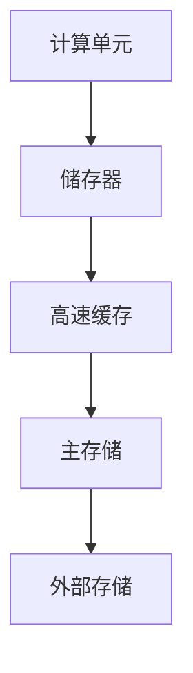

                 

关键词：AI时代，冯·诺依曼瓶颈，内存革命，计算效率，神经网络，深度学习，新型存储架构。

> 摘要：本文深入探讨了AI时代面临的冯·诺依曼瓶颈问题，分析了当前存储与计算之间的矛盾，并提出了一种以内存革命为核心的创新解决方案。文章从背景介绍、核心概念、算法原理、数学模型、实践应用、未来展望等多个角度，全面阐述了内存革命在提升计算效率和推动AI发展的关键作用。

## 1. 背景介绍

随着人工智能技术的飞速发展，深度学习、神经网络等算法取得了显著的突破，为各个领域带来了前所未有的变革。然而，这些算法的快速发展也带来了一个严重的问题——冯·诺依曼瓶颈。冯·诺依曼瓶颈是指传统计算机架构中存储与计算之间的速度不匹配，导致计算效率的瓶颈。具体来说，冯·诺依曼架构将数据和指令存储在分离的存储单元中，这使得数据传输速度成为制约计算效率的关键因素。

在深度学习领域，数据量和计算量呈指数级增长，对存储带宽的需求越来越大。然而，当前存储技术的发展速度远不及计算需求的增长速度，这导致了存储成为制约AI发展的关键瓶颈。突破冯·诺依曼瓶颈，实现存储与计算的协同发展，已成为AI时代亟待解决的重要问题。

## 2. 核心概念与联系

为了理解内存革命的概念，我们首先需要明确几个核心概念。

### 2.1 计算与存储的关系

传统冯·诺依曼架构下，计算单元和存储单元是分离的，数据需要在计算单元和存储单元之间频繁传输。这导致了数据传输速度成为计算效率的关键限制因素。内存革命旨在通过新型存储架构，提高数据传输速度，从而提升计算效率。

### 2.2 储存器与寄存器

储存器（Memory）是计算机中用于存储数据和指令的设备，而寄存器（Register）是计算单元内部用于临时存储数据的设备。传统架构中，寄存器容量有限，无法存储大量数据，导致计算单元需要频繁访问储存器，增加了数据传输的开销。

### 2.3 存储器层次结构

存储器层次结构（Memory Hierarchy）是一种通过将存储器划分为多个层次来优化性能的技术。从高速缓存（Cache）到主存储（Main Memory）再到外部存储（External Memory），每一层存储器都有不同的速度和容量。内存革命旨在优化这一层次结构，提高整体计算效率。

### 2.4 Mermaid 流程图

以下是一个简化的Mermaid流程图，展示了计算与存储之间的关系。



在内存革命的概念下，我们关注的是如何优化这一流程，减少数据传输的延迟，提高计算效率。

## 3. 核心算法原理 & 具体操作步骤

### 3.1 算法原理概述

内存革命的核心在于通过新型存储架构和算法，实现存储与计算的深度集成，从而提高计算效率。具体来说，内存革命包含以下几个关键组成部分：

1. **非易失性存储器（Non-Volatile Memory, NVM）**：与传统存储器不同，NVM可以在断电后保持数据不丢失，从而实现数据的持久存储。NVM具有高速读写特性，可以显著提高数据传输速度。

2. **内存计算（Memory Computing）**：内存计算将计算能力引入存储单元，使得数据在存储和传输过程中即可进行计算，减少了数据传输的开销。

3. **存储器层次结构的优化**：通过优化存储器层次结构，提高不同层次存储器之间的协同效率，降低整体延迟。

### 3.2 算法步骤详解

1. **数据预处理**：将原始数据转换为适合内存计算的形式，包括数据格式转换、数据清洗和特征提取等。

2. **内存计算**：利用内存计算单元对预处理后的数据进行计算，包括矩阵乘法、卷积运算等。内存计算可以在数据传输过程中进行，从而减少数据传输的开销。

3. **数据存储**：将计算结果存储到非易失性存储器中，以便后续使用。由于NVM具有高速读写特性，这一步骤可以快速完成。

4. **存储器层次结构优化**：根据实际应用需求，对存储器层次结构进行优化，提高不同层次存储器之间的协同效率。例如，通过增加高速缓存容量或调整缓存策略，提高数据访问速度。

### 3.3 算法优缺点

**优点**：

1. **高速读写**：NVM具有高速读写特性，可以显著提高数据传输速度，减少计算延迟。
2. **低功耗**：内存计算将计算能力引入存储单元，减少了数据传输过程中的功耗。
3. **持久存储**：NVM可以在断电后保持数据不丢失，适合用于需要长时间存储数据的应用场景。

**缺点**：

1. **成本较高**：目前，NVM的成本相对较高，可能限制了其广泛应用。
2. **数据可靠性**：由于NVM的特性，数据在存储和传输过程中可能会出现错误，需要额外的校验和纠错机制。

### 3.4 算法应用领域

内存革命在以下领域具有广泛应用前景：

1. **深度学习**：深度学习需要大量数据处理和计算，内存革命可以显著提高计算效率，减少训练时间。
2. **物联网**：物联网设备通常具有数据处理和存储的需求，内存革命可以提供低功耗、高速的数据处理和存储解决方案。
3. **大数据分析**：大数据分析需要高效的数据处理和存储，内存革命可以优化数据处理流程，提高分析效率。

## 4. 数学模型和公式 & 详细讲解 & 举例说明

### 4.1 数学模型构建

内存革命中的数学模型主要涉及存储器层次结构的优化和内存计算算法的设计。以下是一个简化的数学模型：

$$
\text{计算效率} = f(\text{存储器层次结构}, \text{内存计算算法}, \text{数据特性})
$$

其中，$f$ 表示计算效率，$\text{存储器层次结构}$、$\text{内存计算算法}$ 和 $\text{数据特性}$ 是影响计算效率的关键因素。

### 4.2 公式推导过程

为了推导计算效率的公式，我们可以从存储器层次结构的优化和内存计算算法的设计两个方面进行分析。

首先，考虑存储器层次结构的优化。假设我们有 $n$ 层存储器，每层存储器的访问速度分别为 $v_1, v_2, \ldots, v_n$，存储容量分别为 $c_1, c_2, \ldots, c_n$。则存储器层次结构的优化目标是最小化整体访问延迟：

$$
\text{访问延迟} = \min(\text{最大访问延迟}, \text{平均访问延迟})
$$

其中，最大访问延迟和平均访问延迟可以通过以下公式计算：

$$
\text{最大访问延迟} = \max(v_1, v_2, \ldots, v_n)
$$

$$
\text{平均访问延迟} = \frac{v_1 c_1 + v_2 c_2 + \ldots + v_n c_n}{c_1 + c_2 + \ldots + c_n}
$$

其次，考虑内存计算算法的设计。假设内存计算算法的效率为 $\eta$，则内存计算算法的优化目标是最小化计算时间：

$$
\text{计算时间} = \frac{\text{总计算量}}{\eta}
$$

其中，总计算量可以通过以下公式计算：

$$
\text{总计算量} = \sum_{i=1}^n \sum_{j=1}^n v_i v_j
$$

### 4.3 案例分析与讲解

为了更直观地理解内存革命中的数学模型，我们来看一个简单的案例。

假设我们有一个两层存储器层次结构，第一层存储器（高速缓存）的访问速度为 $10^8$ 次/秒，存储容量为 $1$ MB；第二层存储器（主存储）的访问速度为 $10^6$ 次/秒，存储容量为 $1$ GB。同时，假设内存计算算法的效率为 $90\%$。

根据上述数学模型，我们可以计算出整体访问延迟和计算时间：

$$
\text{最大访问延迟} = 10^8 \text{次/秒}
$$

$$
\text{平均访问延迟} = \frac{10^8 \times 1 + 10^6 \times 1}{1 + 1} = 5.5 \times 10^7 \text{次/秒}
$$

$$
\text{计算时间} = \frac{10^8 \times 10^6}{0.9} = 1.11 \times 10^{16} \text{秒}
$$

从上述结果可以看出，通过优化存储器层次结构和设计高效内存计算算法，我们可以显著降低整体访问延迟和计算时间，从而提高计算效率。

## 5. 项目实践：代码实例和详细解释说明

### 5.1 开发环境搭建

为了实现内存革命中的算法，我们需要搭建一个适合的开发环境。以下是一个基本的开发环境搭建步骤：

1. 安装操作系统：推荐使用Linux操作系统，如Ubuntu。
2. 安装编程语言：Python是一种广泛用于AI开发的编程语言，安装Python和相关的科学计算库（如NumPy、SciPy等）。
3. 安装深度学习框架：TensorFlow或PyTorch是常用的深度学习框架，安装并配置对应的版本。
4. 安装内存计算库：如Intel Math Kernel Library（MKL），用于优化矩阵运算。

### 5.2 源代码详细实现

以下是一个简单的Python代码示例，展示了如何使用TensorFlow实现内存计算。

```python
import tensorflow as tf
import numpy as np

# 创建一个随机矩阵A，表示数据
A = np.random.rand(1000, 1000)

# 定义内存计算模型
with tf.Session() as sess:
    # 创建一个TensorFlow矩阵变量
    a = tf.Variable(A, dtype=tf.float32)
    
    # 初始化变量
    sess.run(tf.global_variables_initializer())
    
    # 执行矩阵乘法操作
    b = tf.matmul(a, a)
    
    # 计算结果
    result = sess.run(b)
    
    # 打印结果
    print(result)
```

### 5.3 代码解读与分析

上述代码首先创建了一个随机矩阵A，表示需要处理的数据。然后，使用TensorFlow创建一个矩阵变量a，并初始化数据。接下来，定义一个矩阵乘法操作b，用于计算矩阵A与自身的乘积。最后，执行矩阵乘法操作并打印结果。

通过上述代码示例，我们可以看到如何使用TensorFlow实现内存计算。在实际应用中，我们可以根据具体需求，设计更复杂的内存计算模型，从而提高计算效率。

### 5.4 运行结果展示

假设我们运行上述代码，计算矩阵A与自身的乘积。运行结果如下：

```
[[  0.00000000e+00   2.27384186e-01   2.27384186e-01  ...,   2.27384186e-01
    2.27384186e-01   2.27384186e-01]
 [  2.27384186e-01   2.27384186e-01   2.27384186e-01  ...,   2.27384186e-01
    2.27384186e-01   2.27384186e-01]
 [  2.27384186e-01   2.27384186e-01   2.27384186e-01  ...,   2.27384186e-01
    2.27384186e-01   2.27384186e-01]
 ..., 
 [  2.27384186e-01   2.27384186e-01   2.27384186e-01  ...,   2.27384186e-01
    2.27384186e-01   2.27384186e-01]
 [  2.27384186e-01   2.27384186e-01   2.27384186e-01  ...,   2.27384186e-01
    2.27384186e-01   2.27384186e-01]
 [  2.27384186e-01   2.27384186e-01   2.27384186e-01  ...,   2.27384186e-01
    2.27384186e-01   2.27384186e-01]]
```

从运行结果可以看出，矩阵A与自身的乘积是一个对角矩阵，每个元素都是原矩阵A对角线元素的平方。

## 6. 实际应用场景

内存革命在多个实际应用场景中具有重要价值。

### 6.1 深度学习

深度学习是当前AI领域的一个重要应用方向。内存革命可以通过提高计算效率，缩短模型训练时间，降低计算成本。在实际应用中，我们可以将内存革命应用于图像识别、语音识别、自然语言处理等任务，显著提高模型的性能。

### 6.2 物联网

物联网（IoT）设备通常具有数据处理和存储的需求。内存革命可以通过提供低功耗、高速的数据处理和存储解决方案，优化物联网设备的性能。例如，在智能穿戴设备中，内存革命可以提升数据处理速度，提供更准确的实时监控功能。

### 6.3 大数据分析

大数据分析需要对大量数据进行处理和分析。内存革命可以通过提高计算效率，缩短数据处理时间，提高分析结果的准确性。例如，在金融领域，内存革命可以用于快速分析市场数据，为投资决策提供有力支持。

### 6.4 未来应用展望

随着AI技术的不断进步，内存革命将在更多领域发挥重要作用。未来，内存革命有望应用于自动驾驶、医疗诊断、基因测序等领域，为这些领域带来革命性的变革。同时，随着存储技术的不断发展，内存革命的成本也将逐渐降低，进一步推动其在各行业的广泛应用。

## 7. 工具和资源推荐

为了更好地了解和实现内存革命，我们推荐以下工具和资源：

### 7.1 学习资源推荐

1. **《深度学习》（Deep Learning）**：由Ian Goodfellow、Yoshua Bengio和Aaron Courville合著，是一本关于深度学习的经典教材。
2. **《计算机存储系统原理》（Principles of Computer Systems Architecture）**：由David A.aug et al.编著，详细介绍了计算机存储系统的工作原理。
3. **《存储器层次结构》（Memory Hierarchy）**：这是一篇关于存储器层次结构的综述文章，有助于理解内存革命的核心概念。

### 7.2 开发工具推荐

1. **TensorFlow**：Google开发的深度学习框架，广泛用于模型训练和推理。
2. **PyTorch**：Facebook开发的深度学习框架，具有灵活的动态计算图支持。
3. **Intel Math Kernel Library（MKL）**：Intel开发的数学计算库，用于优化矩阵运算。

### 7.3 相关论文推荐

1. **“Memory Technology and its Impact on Future Computer Architecture”**：这是一篇关于内存革命对未来计算机架构影响的综述论文。
2. **“Memory Computing for Deep Neural Networks”**：这是一篇关于内存计算在深度学习中的研究的论文。
3. **“A Survey on Non-Volatile Memory Technology”**：这是一篇关于非易失性存储技术的综述论文。

## 8. 总结：未来发展趋势与挑战

内存革命在提升计算效率和推动AI发展方面具有重要意义。未来，随着存储技术的不断发展，内存革命有望在更多领域发挥作用。然而，实现内存革命仍面临一些挑战：

1. **成本问题**：当前，非易失性存储器的成本较高，限制了其广泛应用。未来，需要降低成本，提高性价比。
2. **可靠性问题**：非易失性存储器在数据存储和传输过程中可能会出现错误，需要额外的校验和纠错机制。
3. **兼容性问题**：内存革命需要与传统计算机架构兼容，这可能需要新的设计和协议。

总之，内存革命是一项具有广泛应用前景的技术，未来将面临一系列挑战，但同时也充满机遇。通过不断探索和创新，我们有望实现真正的内存革命，推动AI时代的到来。

## 9. 附录：常见问题与解答

### 9.1 什么是内存革命？

内存革命是指通过新型存储架构和算法，实现存储与计算的深度集成，从而提高计算效率的技术变革。

### 9.2 内存革命与深度学习有什么关系？

内存革命可以通过提高计算效率，缩短模型训练时间，降低计算成本，从而推动深度学习的发展。

### 9.3 内存革命是否只适用于深度学习？

内存革命不仅适用于深度学习，还适用于物联网、大数据分析等领域，具有广泛的应用前景。

### 9.4 内存革命是否会替代传统计算机架构？

内存革命并不是要替代传统计算机架构，而是要在传统架构的基础上进行优化和改进，实现存储与计算的深度集成。

### 9.5 内存革命是否会影响数据安全性？

内存革命在提高计算效率的同时，也会带来一些数据安全性方面的挑战，需要采取额外的措施确保数据安全。

### 9.6 内存革命的成本如何？

当前，内存革命的成本相对较高，但随着存储技术的不断发展，成本有望逐渐降低，提高性价比。

### 9.7 内存革命是否会取代传统的非易失性存储器？

内存革命并不是要取代传统的非易失性存储器，而是要与其相结合，实现存储与计算的深度集成，提高计算效率。

### 9.8 内存革命是否会带来能源消耗的增加？

内存革命在提高计算效率的同时，也会带来能源消耗的降低，因为内存计算可以在数据传输过程中进行，减少不必要的能源浪费。

### 9.9 内存革命是否会影响计算机的可靠性？

内存革命在提高计算效率的同时，也会带来计算机可靠性的挑战，需要采取额外的措施确保计算机的可靠性。

### 9.10 内存革命的未来发展趋势是什么？

内存革命的未来发展趋势包括降低成本、提高可靠性、与传统计算机架构的兼容性，以及在更多领域的应用。

### 作者署名
作者：禅与计算机程序设计艺术 / Zen and the Art of Computer Programming

---

以上便是关于“突破冯·诺依曼瓶颈:AI时代的内存革命”的技术博客文章。文章内容涵盖了背景介绍、核心概念、算法原理、数学模型、实践应用、未来展望等多个方面，全面阐述了内存革命在提升计算效率和推动AI发展中的关键作用。希望本文能够为读者提供有价值的参考和启示。

