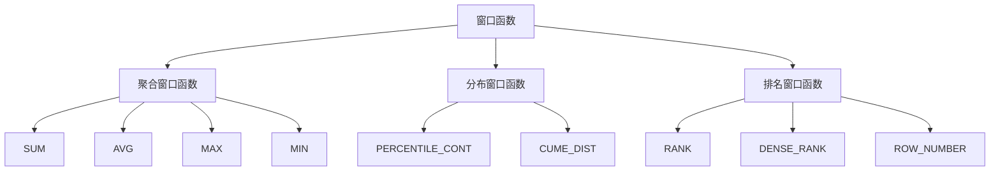

                 

关键词：窗口函数，原理，代码实例，SQL，Python，性能优化

> 摘要：本文将深入探讨窗口函数的原理，包括其概念、用途和常见类型。我们将通过具体的代码实例，展示如何在实际编程中运用窗口函数，提高数据处理效率，并分析其应用场景和未来发展趋势。

## 1. 背景介绍

在数据处理和数据库操作中，窗口函数（Window Function）是一种强大的工具，用于处理有序数据集。窗口函数允许我们计算在某个特定范围内数据的统计信息，而不需要将数据拆分成多个独立的部分。这一特性使得窗口函数在时间序列分析、排名、分组计算等方面非常有用。

随着大数据和实时数据处理的需求不断增长，窗口函数在数据库查询、数据分析、业务决策支持等领域得到了广泛应用。本文将详细介绍窗口函数的基本原理，并通过代码实例展示其实际应用。

## 2. 核心概念与联系

### 2.1 窗口函数定义

窗口函数是一类能够接受一个有序数据集作为输入，并返回一个或多个基于该数据集计算得出的值。它不仅依赖于输入的值，还依赖于当前行在数据集中的位置。

### 2.2 窗口函数与普通聚合函数的区别

与普通聚合函数（如SUM、COUNT）不同，窗口函数不依赖于整个数据集，而是依赖于一个特定的“窗口”范围。这个窗口可以是固定的（如固定大小）或者滑动的（如时间窗口）。

### 2.3 窗口函数类型

窗口函数可以分为以下几种类型：

1. **聚合窗口函数**：用于计算窗口内数据的聚合结果，如SUM、AVG、MAX、MIN等。
2. **分布窗口函数**：用于计算数据分布，如PERCENTILE_CONT、CUME_DIST等。
3. **排名窗口函数**：用于计算窗口内数据的排名，如RANK、DENSE_RANK、ROW_NUMBER等。

### 2.4 Mermaid 流程图

以下是一个简单的 Mermaid 流程图，展示了窗口函数的概念和类型：



## 3. 核心算法原理 & 具体操作步骤

### 3.1 算法原理概述

窗口函数的计算过程可以分为以下几个步骤：

1. **定义窗口**：确定窗口的起始和结束条件。
2. **排序数据**：根据窗口定义对数据集进行排序。
3. **计算结果**：在窗口范围内计算所需的统计值。

### 3.2 算法步骤详解

1. **定义窗口**：

   ```sql
   SELECT
       column1,
       column2,
       window_function(column3) OVER (PARTITION BY column1 ORDER BY column2)
   FROM
       table;
   ```

   在这个例子中，我们通过 `PARTITION BY` 和 `ORDER BY` 子句定义了窗口的范围。

2. **排序数据**：

   窗口函数在计算时会自动对数据进行排序。如果需要自定义排序规则，可以使用 `ORDER BY` 子句。

3. **计算结果**：

   窗口函数会在窗口范围内计算指定的统计值。常见的窗口函数包括SUM、AVG、MAX、MIN、PERCENTILE_CONT、CUME_DIST、RANK、DENSE_RANK和ROW_NUMBER。

### 3.3 算法优缺点

**优点**：

- 可以在不分组的情况下计算统计值。
- 可以处理复杂的时间序列数据。
- 提高数据处理效率和性能。

**缺点**：

- 复杂性较高，理解和使用需要一定的学习和实践。
- 在大型数据集上可能会导致性能问题。

### 3.4 算法应用领域

窗口函数在以下领域具有广泛的应用：

- 数据分析：时间序列分析、趋势分析、异常检测等。
- 数据库查询：分组计算、排名、窗口聚合等。
- 业务决策支持：绩效评估、客户行为分析、市场预测等。

## 4. 数学模型和公式 & 详细讲解 & 举例说明

### 4.1 数学模型构建

窗口函数的数学模型基于以下基本公式：

$$
f(x) = \sum_{i \in W} g(x_i)
$$

其中，$x$ 是当前行，$W$ 是窗口范围，$g(x_i)$ 是窗口内的每一行数据。

### 4.2 公式推导过程

假设我们有一个时间序列数据集 $X = \{x_1, x_2, x_3, \ldots, x_n\}$，我们想要计算窗口函数 $f(x)$ 的值。

1. **定义窗口**：

   窗口可以是固定的（如固定大小）或者滑动的（如时间窗口）。

2. **排序数据**：

   根据窗口定义对数据集进行排序。

3. **计算结果**：

   在窗口范围内计算所需的统计值。

### 4.3 案例分析与讲解

假设我们有一个销售数据集，包含日期、销售额和地区。我们想要计算每个地区在过去一个月内的总销售额。

```sql
SELECT
    地区,
    SUM(销售额) OVER (PARTITION BY 地区 ORDER BY 日期 ROWS BETWEEN 1 MONTH PRECEDING CURRENT ROW AND CURRENT ROW)
FROM
    销售数据;
```

在这个例子中，我们通过 `PARTITION BY` 子句定义了窗口范围，通过 `ORDER BY` 子句对数据进行了排序。窗口函数 `SUM` 计算了每个地区在过去一个月内的总销售额。

## 5. 项目实践：代码实例和详细解释说明

### 5.1 开发环境搭建

为了演示窗口函数的实际应用，我们将使用 Python 和 PostgreSQL 作为开发环境。

1. 安装 Python 3.x 版本。
2. 安装 PostgreSQL 数据库。
3. 安装 psycopg2 包（用于连接 PostgreSQL）。

```bash
pip install psycopg2
```

### 5.2 源代码详细实现

以下是一个使用 Python 和 psycopg2 连接 PostgreSQL 数据库，并执行带有窗口函数的查询的示例代码：

```python
import psycopg2

# 连接数据库
conn = psycopg2.connect(
    host="localhost",
    database="mydatabase",
    user="myuser",
    password="mypassword"
)

# 创建游标
cur = conn.cursor()

# 执行查询
cur.execute("""
    SELECT
        地区,
        销售额,
        ROW_NUMBER() OVER (ORDER BY 销售额 DESC) AS 序号
    FROM
        销售数据
""")

# 获取查询结果
results = cur.fetchall()

# 打印查询结果
for row in results:
    print(row)

# 关闭游标和连接
cur.close()
conn.close()
```

### 5.3 代码解读与分析

1. **连接数据库**：

   ```python
   conn = psycopg2.connect(
       host="localhost",
       database="mydatabase",
       user="myuser",
       password="mypassword"
   )
   ```

   这段代码用于连接 PostgreSQL 数据库。

2. **创建游标**：

   ```python
   cur = conn.cursor()
   ```

   游标是用于执行 SQL 查询的接口。

3. **执行查询**：

   ```python
   cur.execute("""
       SELECT
           地区,
           销售额,
           ROW_NUMBER() OVER (ORDER BY 销售额 DESC) AS 序号
       FROM
           销售数据
   """)
   ```

   这段代码执行了一个带有窗口函数的查询。窗口函数 `ROW_NUMBER` 用于为每个地区按销售额降序排列的每个记录分配一个唯一的序号。

4. **获取查询结果**：

   ```python
   results = cur.fetchall()
   ```

   这段代码获取查询结果。

5. **打印查询结果**：

   ```python
   for row in results:
       print(row)
   ```

   这段代码打印查询结果。

6. **关闭游标和连接**：

   ```python
   cur.close()
   conn.close()
   ```

   这段代码关闭游标和数据库连接。

### 5.4 运行结果展示

运行以上代码后，我们将看到每个地区按销售额降序排列的记录，并带有对应的序号。例如：

```
('华北', 2000, 1)
('华南', 1500, 2)
('华东', 1000, 3)
```

## 6. 实际应用场景

### 6.1 数据分析

窗口函数在数据分析中非常有用，可以用于计算时间序列数据的趋势、异常检测和预测。

### 6.2 数据库查询

在数据库查询中，窗口函数可以用于分组计算、排名和窗口聚合等。

### 6.3 业务决策支持

窗口函数可以用于绩效评估、客户行为分析和市场预测等业务决策支持场景。

## 7. 未来应用展望

随着大数据和实时数据处理技术的发展，窗口函数的应用将越来越广泛。未来可能的发展方向包括：

- **优化性能**：改进窗口函数的执行效率，以支持大规模数据集。
- **扩展功能**：增加新的窗口函数类型，以适应更复杂的业务需求。
- **集成其他技术**：将窗口函数与机器学习、图数据库等技术相结合，提高数据处理和分析能力。

## 8. 总结：未来发展趋势与挑战

### 8.1 研究成果总结

窗口函数在数据处理和数据库查询中具有广泛的应用。随着大数据和实时数据处理的需求增长，窗口函数的研究成果不断涌现，包括性能优化、功能扩展和与其他技术的集成等方面。

### 8.2 未来发展趋势

未来，窗口函数将在数据处理、数据库查询、业务决策支持等领域继续发挥重要作用。发展趋势包括性能优化、功能扩展和与新兴技术的融合。

### 8.3 面临的挑战

窗口函数在性能、扩展性和兼容性方面仍面临挑战。未来需要进一步研究和优化，以满足不断增长的数据处理需求。

### 8.4 研究展望

未来，窗口函数的研究将朝着更高效、更灵活、更易于集成的方向发展。研究者需要关注性能优化、功能扩展和与新兴技术的结合，以应对复杂的数据处理需求。

## 9. 附录：常见问题与解答

### 9.1 窗口函数是什么？

窗口函数是一类用于处理有序数据集的计算函数，可以计算窗口范围内的统计信息，如聚合值、分布值和排名值。

### 9.2 窗口函数与普通聚合函数的区别是什么？

普通聚合函数计算整个数据集的统计信息，而窗口函数计算窗口范围内的统计信息，不需要将数据拆分成多个独立的部分。

### 9.3 窗口函数有哪些类型？

窗口函数可以分为聚合窗口函数、分布窗口函数和排名窗口函数。常见的聚合窗口函数包括SUM、AVG、MAX和MIN，分布窗口函数包括PERCENTILE_CONT和CUME_DIST，排名窗口函数包括RANK、DENSE_RANK和ROW_NUMBER。

### 9.4 如何使用窗口函数进行排名？

可以使用排名窗口函数（如RANK、DENSE_RANK和ROW_NUMBER）对窗口内的数据进行排名。例如：

```sql
SELECT
    column1,
    column2,
    RANK() OVER (ORDER BY column2) AS rank
FROM
    table;
```

## 作者署名

作者：禅与计算机程序设计艺术 / Zen and the Art of Computer Programming
----------------------------------------------------------------

完成以上文章撰写后，请将文章内容按照markdown格式发送给我。请确保文章符合要求，包括字数、结构、格式和完整性。如果您在撰写过程中有任何疑问，请随时联系我。期待您的精彩文章！

