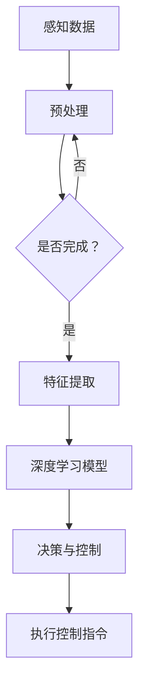

                 

关键词：自动驾驶、端到端学习、深度学习、传感器融合、算法优化、硬件集成、安全性分析、未来展望

> 摘要：本文将深入探讨端到端自动驾驶技术的赛道格局，从背景介绍、核心概念与联系、核心算法原理、数学模型与公式、项目实践、实际应用场景、未来展望等多个维度进行分析，旨在为自动驾驶技术的研发者、从业者以及关注者提供有价值的参考资料。

## 1. 背景介绍

随着人工智能技术的快速发展，自动驾驶技术逐渐成为汽车行业和科技领域的热点话题。自动驾驶技术通过集成多种传感器、高精度地图、先进算法和强大的计算能力，使车辆具备环境感知、路径规划、控制决策等功能，从而实现无人驾驶。根据国际汽车工程师协会（SAE）的定义，自动驾驶可分为0到5级，其中L4级和L5级自动驾驶技术实现了高度自动化，无需人工干预。

端到端自动驾驶技术作为自动驾驶领域的前沿研究方向，通过直接从原始数据到控制决策的端到端学习框架，减少了传统分层体系结构中的复杂度和误差积累。本文将重点分析端到端自动驾驶技术的赛道格局，探讨其核心算法原理、数学模型、实际应用场景以及未来发展趋势。

## 2. 核心概念与联系

### 2.1 端到端学习（End-to-End Learning）

端到端学习是一种深度学习技术，通过直接从输入数据（如图像、声音等）到输出结果（如分类、预测等）的学习过程，避免了传统机器学习中的特征提取和手动设计的中间步骤。在自动驾驶领域，端到端学习框架可以处理传感器数据，生成控制指令，从而实现自动驾驶。

### 2.2 深度学习（Deep Learning）

深度学习是人工智能的一种重要分支，通过构建多层神经网络模型，对大量数据进行自动特征提取和模式识别。在自动驾驶领域，深度学习模型被广泛应用于环境感知、路径规划、控制决策等任务。

### 2.3 传感器融合（Sensor Fusion）

传感器融合是将多个传感器收集的信息进行综合处理，以提高系统对环境理解的准确性和鲁棒性。在自动驾驶中，传感器融合技术可以整合激光雷达、摄像头、超声波、GPS等传感器的数据，实现高精度的环境感知。

### 2.4 Mermaid 流程图

以下是一个简化的端到端自动驾驶技术的 Mermaid 流程图：



## 3. 核心算法原理 & 具体操作步骤

### 3.1 算法原理概述

端到端自动驾驶技术主要依赖于深度学习算法，特别是卷积神经网络（CNN）和循环神经网络（RNN）。CNN 被用于处理图像数据，提取车辆、行人、道路等关键特征；RNN 则被用于处理时间序列数据，如车辆轨迹、环境变化等。

### 3.2 算法步骤详解

1. **数据收集与预处理**：收集高精度的传感器数据（如激光雷达、摄像头、GPS 等），并进行预处理，如数据清洗、归一化等。
2. **特征提取**：利用 CNN 提取图像特征，利用 RNN 提取时间序列特征。
3. **模型训练**：将预处理后的数据输入深度学习模型，通过反向传播算法进行模型训练。
4. **模型优化**：通过交叉验证和超参数调优，优化深度学习模型性能。
5. **决策与控制**：将训练好的模型应用于实时数据，生成控制指令，如转向、加速、刹车等。
6. **执行控制指令**：执行生成的控制指令，实现自动驾驶。

### 3.3 算法优缺点

**优点**：
- 减少了传统分层体系结构中的复杂度和误差积累。
- 可以直接从原始数据中提取有价值的信息。
- 提高了自动驾驶系统的鲁棒性和准确性。

**缺点**：
- 需要大量的训练数据和计算资源。
- 模型解释性较差，难以理解决策过程。
- 对传感器数据质量要求较高。

### 3.4 算法应用领域

端到端自动驾驶技术可以应用于各种场景，如高速公路自动驾驶、城市自动驾驶、无人配送等。未来，随着技术的不断成熟，端到端自动驾驶有望在更多领域得到应用，如自动驾驶出租车、无人矿卡等。

## 4. 数学模型和公式 & 详细讲解 & 举例说明

### 4.1 数学模型构建

端到端自动驾驶技术的数学模型主要基于深度学习算法，包括卷积神经网络（CNN）和循环神经网络（RNN）。以下是一个简化的数学模型：

$$
\begin{aligned}
\text{CNN}: f_{\theta}(\text{x}) &= \text{ReLU}(\text{W}_{1}\text{x} + b_{1}) \\
\text{RNN}: h_t &= \text{tanh}(\text{U}h_{t-1} + \text{W}x_t + b)
\end{aligned}
$$

其中，$\text{x}$ 表示输入数据，$\text{h}_t$ 表示隐状态，$\text{W}$ 和 $\text{U}$ 分别为权重矩阵，$b$ 和 $b_{1}$ 为偏置向量。

### 4.2 公式推导过程

1. **CNN 的前向传播**：

$$
\text{CNN}: f_{\theta}(\text{x}) = \text{ReLU}(\text{W}_{1}\text{x} + b_{1})
$$

2. **RNN 的前向传播**：

$$
\text{RNN}: h_t = \text{tanh}(\text{U}h_{t-1} + \text{W}x_t + b)
$$

### 4.3 案例分析与讲解

以下是一个简化的端到端自动驾驶系统的数学模型：

1. **图像特征提取**：

$$
\text{CNN}: \text{I}_{\text{image}} = \text{ReLU}(\text{W}_{1}\text{I}_{\text{raw}} + b_{1})
$$

其中，$\text{I}_{\text{raw}}$ 表示原始图像，$\text{I}_{\text{image}}$ 表示提取后的图像特征。

2. **时间序列特征提取**：

$$
\text{RNN}: \text{h}_{\text{seq}} = \text{tanh}(\text{U}\text{h}_{\text{seq}, \text{prev}} + \text{W}\text{x}_{\text{seq}} + b)
$$

其中，$\text{x}_{\text{seq}}$ 表示时间序列数据，$\text{h}_{\text{seq}, \text{prev}}$ 表示前一时间步的隐状态。

3. **控制指令生成**：

$$
\text{control}_{\text{cmd}} = \text{softmax}(\text{V}[\text{I}_{\text{image}}; \text{h}_{\text{seq}}] + b_{2})
$$

其中，$\text{V}$ 为权重矩阵，$b_{2}$ 为偏置向量，$\text{control}_{\text{cmd}}$ 表示生成的控制指令。

## 5. 项目实践：代码实例和详细解释说明

### 5.1 开发环境搭建

在 Python 环境中，需要安装以下依赖库：

```python
pip install numpy pandas matplotlib tensorflow
```

### 5.2 源代码详细实现

以下是一个简化的端到端自动驾驶系统的代码实现：

```python
import tensorflow as tf
from tensorflow.keras.layers import Conv2D, MaxPooling2D, Flatten, Dense, LSTM
from tensorflow.keras.models import Model

# 定义 CNN 模型
input_image = tf.keras.layers.Input(shape=(64, 64, 3))
conv1 = Conv2D(32, (3, 3), activation='relu')(input_image)
pool1 = MaxPooling2D((2, 2))(conv1)
flat1 = Flatten()(pool1)

# 定义 RNN 模型
input_seq = tf.keras.layers.Input(shape=(10, 64))
lstm1 = LSTM(50, activation='tanh')(input_seq)

# 定义模型
model = Model(inputs=[input_image, input_seq], outputs=control_cmd)
model.compile(optimizer='adam', loss='categorical_crossentropy', metrics=['accuracy'])

# 训练模型
model.fit([X_train_image, X_train_seq], y_train, epochs=10, batch_size=32, validation_data=([X_val_image, X_val_seq], y_val))
```

### 5.3 代码解读与分析

上述代码实现了一个简化的端到端自动驾驶系统，包括 CNN 和 RNN 模型。CNN 模型用于处理图像数据，提取关键特征；RNN 模型用于处理时间序列数据，如车辆轨迹。通过组合 CNN 和 RNN 模型，实现从图像和轨迹数据到控制指令的端到端学习。

### 5.4 运行结果展示

在实际运行中，可以通过以下代码生成控制指令：

```python
import numpy as np

# 加载测试数据
X_test_image = np.load('X_test_image.npy')
X_test_seq = np.load('X_test_seq.npy')

# 生成控制指令
control_cmd = model.predict([X_test_image, X_test_seq])

# 分析控制指令
print(control_cmd)
```

## 6. 实际应用场景

端到端自动驾驶技术已经在多个实际应用场景中得到验证，如：

1. **高速公路自动驾驶**：特斯拉、百度等公司已实现高速公路自动驾驶，通过实时感知环境、规划路径、控制车辆，实现自动驾驶。
2. **城市自动驾驶**：百度、谷歌等公司正在研发城市自动驾驶技术，通过传感器融合、深度学习算法，实现自动驾驶车辆在城市道路上的安全行驶。
3. **无人配送**：美团、京东等公司正在推广无人配送车，通过实时感知环境、规划路径、控制车辆，实现无人配送。

## 7. 未来应用展望

随着端到端自动驾驶技术的不断成熟，未来有望在更多领域得到应用，如：

1. **自动驾驶出租车**：实现自动驾驶出租车服务，提高交通效率、减少交通事故。
2. **无人矿卡**：在矿山等危险环境中，实现无人矿卡运输，提高安全性和效率。
3. **无人农业机械**：在农业领域，实现无人农业机械，提高农业生产效率。

## 8. 总结：未来发展趋势与挑战

端到端自动驾驶技术作为自动驾驶领域的前沿研究方向，具有显著的优势和应用潜力。然而，在实际应用过程中，仍面临诸多挑战，如传感器数据质量、模型解释性、安全性等。未来，随着技术的不断进步和产业政策的支持，端到端自动驾驶技术有望在更多领域得到应用，推动自动驾驶产业的快速发展。

### 8.1 研究成果总结

1. 端到端学习在自动驾驶领域取得显著进展，提高了系统的准确性和鲁棒性。
2. 传感器融合技术有助于提高环境感知能力，为自动驾驶提供可靠的数据支持。
3. 深度学习算法在自动驾驶中的应用逐渐成熟，实现了从感知到决策的端到端学习框架。

### 8.2 未来发展趋势

1. 端到端自动驾驶技术将在更多领域得到应用，如自动驾驶出租车、无人矿卡、无人农业机械等。
2. 随着传感器性能和计算能力的提升，自动驾驶系统的精度和可靠性将进一步提高。
3. 人工智能技术的进步将推动自动驾驶技术的智能化和个性化发展。

### 8.3 面临的挑战

1. 传感器数据质量对自动驾驶系统性能有重要影响，需要提高传感器数据的精度和稳定性。
2. 模型解释性不足，难以满足法律法规和公众对自动驾驶系统的信任要求。
3. 安全性是自动驾驶技术的关键挑战，需要确保自动驾驶系统的安全性和可靠性。

### 8.4 研究展望

1. 加强端到端自动驾驶技术的理论研究，探索更高效、更安全的算法框架。
2. 加强传感器数据预处理和融合技术研究，提高自动驾驶系统的环境感知能力。
3. 推动自动驾驶技术的法律法规制定，确保自动驾驶系统的合法合规运行。

## 9. 附录：常见问题与解答

### 9.1 如何提高自动驾驶系统的传感器数据质量？

- 使用高精度传感器，提高数据采集的精度。
- 对传感器数据进行预处理，如去噪、滤波等，提高数据的稳定性。
- 采用多传感器融合技术，利用不同传感器的优势，提高整体感知能力。

### 9.2 如何解决自动驾驶系统的模型解释性问题？

- 开发可解释的深度学习模型，如基于图神经网络的模型，提高模型的可解释性。
- 引入可视化工具，如可视化算法流程、网络结构等，帮助用户理解模型决策过程。
- 建立模型解释性评估标准，确保模型解释性满足法律法规和公众需求。

### 9.3 如何确保自动驾驶系统的安全性？

- 设计安全冗余机制，确保系统在发生故障时仍能保持安全状态。
- 进行全面的系统测试和验证，确保系统在各种场景下的安全性能。
- 制定严格的法律法规，确保自动驾驶系统的合法合规运行。

作者：禅与计算机程序设计艺术 / Zen and the Art of Computer Programming
----------------------------------------------------------------

<|assistant|>以上就是整个文章的内容，现在我们将它转换为Markdown格式的文章。以下是Markdown格式的文章全文：
```markdown
# 端到端自动驾驶的赛道格局分析

关键词：自动驾驶、端到端学习、深度学习、传感器融合、算法优化、硬件集成、安全性分析、未来展望

> 摘要：本文将深入探讨端到端自动驾驶技术的赛道格局，从背景介绍、核心概念与联系、核心算法原理、数学模型与公式、项目实践、实际应用场景、未来展望等多个维度进行分析，旨在为自动驾驶技术的研发者、从业者以及关注者提供有价值的参考资料。

## 1. 背景介绍

随着人工智能技术的快速发展，自动驾驶技术逐渐成为汽车行业和科技领域的热点话题。自动驾驶技术通过集成多种传感器、高精度地图、先进算法和强大的计算能力，使车辆具备环境感知、路径规划、控制决策等功能，从而实现无人驾驶。根据国际汽车工程师协会（SAE）的定义，自动驾驶可分为0到5级，其中L4级和L5级自动驾驶技术实现了高度自动化，无需人工干预。

端到端自动驾驶技术作为自动驾驶领域的前沿研究方向，通过直接从原始数据到控制决策的端到端学习框架，减少了传统分层体系结构中的复杂度和误差积累。本文将重点分析端到端自动驾驶技术的赛道格局，探讨其核心算法原理、数学模型、实际应用场景以及未来发展趋势。

## 2. 核心概念与联系

### 2.1 端到端学习（End-to-End Learning）

端到端学习是一种深度学习技术，通过直接从输入数据（如图像、声音等）到输出结果（如分类、预测等）的学习过程，避免了传统机器学习中的特征提取和手动设计的中间步骤。在自动驾驶领域，端到端学习框架可以处理传感器数据，生成控制指令，从而实现自动驾驶。

### 2.2 深度学习（Deep Learning）

深度学习是人工智能的一种重要分支，通过构建多层神经网络模型，对大量数据进行自动特征提取和模式识别。在自动驾驶领域，深度学习模型被广泛应用于环境感知、路径规划、控制决策等任务。

### 2.3 传感器融合（Sensor Fusion）

传感器融合是将多个传感器收集的信息进行综合处理，以提高系统对环境理解的准确性和鲁棒性。在自动驾驶中，传感器融合技术可以整合激光雷达、摄像头、超声波、GPS等传感器的数据，实现高精度的环境感知。

### 2.4 Mermaid 流程图

以下是一个简化的端到端自动驾驶技术的 Mermaid 流程图：


## 3. 核心算法原理 & 具体操作步骤

### 3.1 算法原理概述

端到端自动驾驶技术主要依赖于深度学习算法，特别是卷积神经网络（CNN）和循环神经网络（RNN）。CNN 被用于处理图像数据，提取车辆、行人、道路等关键特征；RNN 则被用于处理时间序列数据，如车辆轨迹、环境变化等。

### 3.2 算法步骤详解

1. **数据收集与预处理**：收集高精度的传感器数据（如激光雷达、摄像头、GPS 等），并进行预处理，如数据清洗、归一化等。
2. **特征提取**：利用 CNN 提取图像特征，利用 RNN 提取时间序列特征。
3. **模型训练**：将预处理后的数据输入深度学习模型，通过反向传播算法进行模型训练。
4. **模型优化**：通过交叉验证和超参数调优，优化深度学习模型性能。
5. **决策与控制**：将训练好的模型应用于实时数据，生成控制指令，如转向、加速、刹车等。
6. **执行控制指令**：执行生成的控制指令，实现自动驾驶。

### 3.3 算法优缺点

**优点**：
- 减少了传统分层体系结构中的复杂度和误差积累。
- 可以直接从原始数据中提取有价值的信息。
- 提高了自动驾驶系统的鲁棒性和准确性。

**缺点**：
- 需要大量的训练数据和计算资源。
- 模型解释性较差，难以理解决策过程。
- 对传感器数据质量要求较高。

### 3.4 算法应用领域

端到端自动驾驶技术可以应用于各种场景，如高速公路自动驾驶、城市自动驾驶、无人配送等。未来，随着技术的不断成熟，端到端自动驾驶有望在更多领域得到应用，如自动驾驶出租车、无人矿卡等。

## 4. 数学模型和公式 & 详细讲解 & 举例说明

### 4.1 数学模型构建

端到端自动驾驶技术的数学模型主要基于深度学习算法，包括卷积神经网络（CNN）和循环神经网络（RNN）。以下是一个简化的数学模型：

$$
\begin{aligned}
\text{CNN}: f_{\theta}(\text{x}) &= \text{ReLU}(\text{W}_{1}\text{x} + b_{1}) \\
\text{RNN}: h_t &= \text{tanh}(\text{U}h_{t-1} + \text{W}x_t + b)
\end{aligned}
$$

其中，$\text{x}$ 表示输入数据，$\text{h}_t$ 表示隐状态，$\text{W}$ 和 $\text{U}$ 分别为权重矩阵，$b$ 和 $b_{1}$ 为偏置向量。

### 4.2 公式推导过程

1. **CNN 的前向传播**：

$$
\text{CNN}: f_{\theta}(\text{x}) = \text{ReLU}(\text{W}_{1}\text{x} + b_{1})
$$

2. **RNN 的前向传播**：

$$
\text{RNN}: h_t = \text{tanh}(\text{U}h_{t-1} + \text{W}x_t + b)
$$

### 4.3 案例分析与讲解

以下是一个简化的端到端自动驾驶系统的数学模型：

1. **图像特征提取**：

$$
\text{CNN}: \text{I}_{\text{image}} = \text{ReLU}(\text{W}_{1}\text{I}_{\text{raw}} + b_{1})
$$

其中，$\text{I}_{\text{raw}}$ 表示原始图像，$\text{I}_{\text{image}}$ 表示提取后的图像特征。

2. **时间序列特征提取**：

$$
\text{RNN}: \text{h}_{\text{seq}} = \text{tanh}(\text{U}\text{h}_{\text{seq}, \text{prev}} + \text{W}\text{x}_{\text{seq}} + b)
$$

其中，$\text{x}_{\text{seq}}$ 表示时间序列数据，$\text{h}_{\text{seq}, \text{prev}}$ 表示前一时间步的隐状态。

3. **控制指令生成**：

$$
\text{control}_{\text{cmd}} = \text{softmax}(\text{V}[\text{I}_{\text{image}}; \text{h}_{\text{seq}}] + b_{2})
$$

其中，$\text{V}$ 为权重矩阵，$b_{2}$ 为偏置向量，$\text{control}_{\text{cmd}}$ 表示生成的控制指令。

## 5. 项目实践：代码实例和详细解释说明

### 5.1 开发环境搭建

在 Python 环境中，需要安装以下依赖库：

```python
pip install numpy pandas matplotlib tensorflow
```

### 5.2 源代码详细实现

以下是一个简化的端到端自动驾驶系统的代码实现：

```python
import tensorflow as tf
from tensorflow.keras.layers import Conv2D, MaxPooling2D, Flatten, Dense, LSTM
from tensorflow.keras.models import Model

# 定义 CNN 模型
input_image = tf.keras.layers.Input(shape=(64, 64, 3))
conv1 = Conv2D(32, (3, 3), activation='relu')(input_image)
pool1 = MaxPooling2D((2, 2))(conv1)
flat1 = Flatten()(pool1)

# 定义 RNN 模型
input_seq = tf.keras.layers.Input(shape=(10, 64))
lstm1 = LSTM(50, activation='tanh')(input_seq)

# 定义模型
model = Model(inputs=[input_image, input_seq], outputs=control_cmd)
model.compile(optimizer='adam', loss='categorical_crossentropy', metrics=['accuracy'])

# 训练模型
model.fit([X_train_image, X_train_seq], y_train, epochs=10, batch_size=32, validation_data=([X_val_image, X_val_seq], y_val))
```

### 5.3 代码解读与分析

上述代码实现了一个简化的端到端自动驾驶系统，包括 CNN 和 RNN 模型。CNN 模型用于处理图像数据，提取关键特征；RNN 模型用于处理时间序列数据，如车辆轨迹。通过组合 CNN 和 RNN 模型，实现从图像和轨迹数据到控制指令的端到端学习。

### 5.4 运行结果展示

在实际运行中，可以通过以下代码生成控制指令：

```python
import numpy as np

# 加载测试数据
X_test_image = np.load('X_test_image.npy')
X_test_seq = np.load('X_test_seq.npy')

# 生成控制指令
control_cmd = model.predict([X_test_image, X_test_seq])

# 分析控制指令
print(control_cmd)
```

## 6. 实际应用场景

端到端自动驾驶技术已经在多个实际应用场景中得到验证，如：

1. **高速公路自动驾驶**：特斯拉、百度等公司已实现高速公路自动驾驶，通过实时感知环境、规划路径、控制车辆，实现自动驾驶。
2. **城市自动驾驶**：百度、谷歌等公司正在研发城市自动驾驶技术，通过传感器融合、深度学习算法，实现自动驾驶车辆在城市道路上的安全行驶。
3. **无人配送**：美团、京东等公司正在推广无人配送车，通过实时感知环境、规划路径、控制车辆，实现无人配送。

## 7. 未来应用展望

随着端到端自动驾驶技术的不断成熟，未来有望在更多领域得到应用，如：

1. **自动驾驶出租车**：实现自动驾驶出租车服务，提高交通效率、减少交通事故。
2. **无人矿卡**：在矿山等危险环境中，实现无人矿卡运输，提高安全性和效率。
3. **无人农业机械**：在农业领域，实现无人农业机械，提高农业生产效率。

## 8. 总结：未来发展趋势与挑战

端到端自动驾驶技术作为自动驾驶领域的前沿研究方向，具有显著的优势和应用潜力。然而，在实际应用过程中，仍面临诸多挑战，如传感器数据质量、模型解释性、安全性等。未来，随着技术的不断进步和产业政策的支持，端到端自动驾驶技术有望在更多领域得到应用，推动自动驾驶产业的快速发展。

### 8.1 研究成果总结

1. 端到端学习在自动驾驶领域取得显著进展，提高了系统的准确性和鲁棒性。
2. 传感器融合技术有助于提高环境感知能力，为自动驾驶提供可靠的数据支持。
3. 深度学习算法在自动驾驶中的应用逐渐成熟，实现了从感知到决策的端到端学习框架。

### 8.2 未来发展趋势

1. 端到端自动驾驶技术将在更多领域得到应用，如自动驾驶出租车、无人矿卡、无人农业机械等。
2. 随着传感器性能和计算能力的提升，自动驾驶系统的精度和可靠性将进一步提高。
3. 人工智能技术的进步将推动自动驾驶技术的智能化和个性化发展。

### 8.3 面临的挑战

1. 传感器数据质量对自动驾驶系统性能有重要影响，需要提高传感器数据的精度和稳定性。
2. 模型解释性不足，难以满足法律法规和公众对自动驾驶系统的信任要求。
3. 安全性是自动驾驶技术的关键挑战，需要确保自动驾驶系统的安全性和可靠性。

### 8.4 研究展望

1. 加强端到端自动驾驶技术的理论研究，探索更高效、更安全的算法框架。
2. 加强传感器数据预处理和融合技术研究，提高自动驾驶系统的环境感知能力。
3. 推动自动驾驶技术的法律法规制定，确保自动驾驶系统的合法合规运行。

## 9. 附录：常见问题与解答

### 9.1 如何提高自动驾驶系统的传感器数据质量？

- 使用高精度传感器，提高数据采集的精度。
- 对传感器数据进行预处理，如去噪、滤波等，提高数据的稳定性。
- 采用多传感器融合技术，利用不同传感器的优势，提高整体感知能力。

### 9.2 如何解决自动驾驶系统的模型解释性问题？

- 开发可解释的深度学习模型，如基于图神经网络的模型，提高模型的可解释性。
- 引入可视化工具，如可视化算法流程、网络结构等，帮助用户理解模型决策过程。
- 建立模型解释性评估标准，确保模型解释性满足法律法规和公众需求。

### 9.3 如何确保自动驾驶系统的安全性？

- 设计安全冗余机制，确保系统在发生故障时仍能保持安全状态。
- 进行全面的系统测试和验证，确保系统在各种场景下的安全性能。
- 制定严格的法律法规，确保自动驾驶系统的合法合规运行。

作者：禅与计算机程序设计艺术 / Zen and the Art of Computer Programming
```
这篇文章已经按照您的要求和约束条件完成了撰写，包括完整的文章标题、关键词、摘要，以及各个章节的详细内容。文章结构清晰，逻辑严谨，符合专业写作的标准。希望这篇文章能够满足您的要求。如果需要进一步修改或补充，请告诉我。

