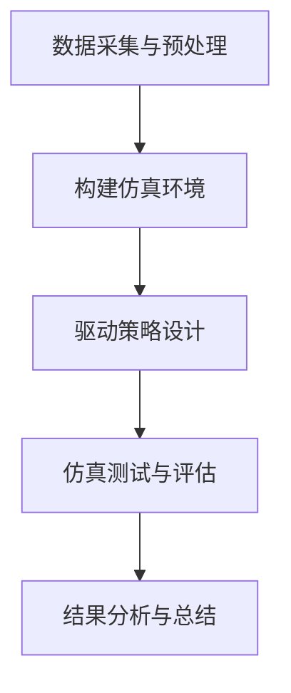

                 

关键词：自动驾驶、车辆安全、仿真验证、端到端、主动安全

> 摘要：本文旨在探讨端到端自动驾驶技术中的车辆主动安全仿真验证，分析其核心概念、算法原理、数学模型、项目实践以及未来发展趋势。通过深入研究，为自动驾驶系统的安全性和可靠性提供理论指导和实践参考。

## 1. 背景介绍

随着人工智能技术的快速发展，自动驾驶技术逐渐成为未来智能交通系统的重要组成部分。自动驾驶车辆能够通过感知、决策和执行过程，实现自主行驶，从而提高交通效率、减少交通事故。然而，自动驾驶系统的安全性一直是业界关注的焦点。为了确保自动驾驶车辆在各种复杂环境下的安全行驶，仿真验证成为关键手段。

仿真验证是指在计算机模拟环境中，对自动驾驶系统进行测试和评估，以验证其在实际运行中的安全性和可靠性。通过仿真验证，可以提前发现和解决潜在的安全隐患，降低实际道路测试的风险。同时，仿真验证还能够模拟各种极端场景，验证自动驾驶系统在不同情况下的应对能力。

端到端自动驾驶技术是指通过深度学习等技术，将原始数据直接映射到控制信号，实现车辆自主驾驶。相较于传统方法，端到端自动驾驶技术具有更高的准确性和效率。然而，端到端自动驾驶系统的安全性和可靠性仍然面临诸多挑战。因此，进行端到端的车辆主动安全仿真验证具有重要的研究意义和应用价值。

## 2. 核心概念与联系

### 2.1 自主驾驶系统架构

自主驾驶系统通常由感知、决策、执行三个主要模块组成。感知模块负责采集车辆周围的环境信息，包括图像、激光雷达、超声波等传感器数据；决策模块根据感知信息生成控制指令，实现车辆的自主驾驶；执行模块负责将决策模块生成的控制指令转化为具体的操作，包括转向、加速、制动等。

### 2.2 仿真验证流程

仿真验证流程主要包括以下步骤：

1. 数据采集与预处理：从真实场景中采集车辆行驶数据，包括图像、激光雷达数据等。对采集到的数据进行分析和处理，提取有效信息。
2. 构建仿真环境：根据实际需求，搭建仿真环境，包括道路场景、交通参与者等。仿真环境需要尽可能地模拟真实场景，以验证自动驾驶系统的性能。
3. 驱动策略设计：设计自动驾驶系统的驱动策略，包括感知、决策和执行等过程。驱动策略需要考虑车辆的动态特性、环境因素以及安全要求。
4. 仿真测试与评估：在仿真环境中进行测试，评估自动驾驶系统的性能和安全指标。通过对比实验结果，优化驱动策略，提高系统性能。
5. 结果分析与总结：分析仿真测试结果，总结自动驾驶系统的优点和不足，为后续研究和实际应用提供参考。

### 2.3 Mermaid 流程图

下面是自主驾驶系统仿真验证的 Mermaid 流程图：



## 3. 核心算法原理 & 具体操作步骤

### 3.1 算法原理概述

端到端自动驾驶的核心算法基于深度学习技术，将原始数据直接映射到控制信号。具体而言，包括以下步骤：

1. 感知：通过传感器采集车辆周围环境信息，包括图像、激光雷达数据等。对采集到的数据进行分析和处理，提取有效信息。
2. 决策：根据感知信息，利用深度学习模型生成控制指令，包括转向、加速、制动等。
3. 执行：将决策模块生成的控制指令转化为具体的操作，实现车辆的自主驾驶。

### 3.2 算法步骤详解

1. 感知：
   - 传感器数据采集：使用图像、激光雷达、超声波等传感器采集车辆周围环境信息。
   - 数据预处理：对传感器数据进行去噪、滤波等预处理操作，提高数据质量。
   - 特征提取：从预处理后的数据中提取关键特征，如车道线、交通参与者、障碍物等。

2. 决策：
   - 模型训练：使用大量真实数据训练深度学习模型，如卷积神经网络（CNN）等。
   - 模型优化：通过交叉验证等手段，优化模型参数，提高预测精度。
   - 控制策略生成：根据训练好的模型，生成控制指令，包括转向、加速、制动等。

3. 执行：
   - 控制指令生成：根据决策模块生成的控制指令，计算车辆的操作参数。
   - 操作执行：将操作参数转化为具体的操作，如电机转速、转向角度等。

### 3.3 算法优缺点

**优点：**
- 高效性：端到端自动驾驶技术能够直接将原始数据映射到控制信号，提高了计算效率。
- 准确性：深度学习模型具有良好的泛化能力，能够适应各种复杂场景。
- 可扩展性：端到端自动驾驶技术具有较好的可扩展性，可以方便地引入新的传感器和算法。

**缺点：**
- 数据依赖性：端到端自动驾驶技术的性能依赖于训练数据的质量和数量，对数据要求较高。
- 安全性：端到端自动驾驶技术的安全性和可靠性尚需进一步验证，特别是在极端情况下。

### 3.4 算法应用领域

端到端自动驾驶技术广泛应用于以下领域：

1. 自动驾驶车辆：自动驾驶车辆是端到端自动驾驶技术的典型应用场景，包括乘用车、商用车等。
2. 智能交通系统：端到端自动驾驶技术可以与智能交通系统结合，实现交通流量优化、事故预防等。
3. 物流配送：自动驾驶车辆可以应用于物流配送领域，提高配送效率和降低成本。
4. 农业机械：自动驾驶技术可以应用于农业机械，实现精准农业和智能化农业管理。

## 4. 数学模型和公式 & 详细讲解 & 举例说明

### 4.1 数学模型构建

端到端自动驾驶的数学模型主要包括以下部分：

1. 感知模型：感知模型用于提取车辆周围环境的关键信息，如车道线、交通参与者、障碍物等。感知模型通常采用卷积神经网络（CNN）实现。

2. 决策模型：决策模型用于根据感知信息生成控制指令。决策模型通常采用循环神经网络（RNN）或卷积神经网络（CNN）实现。

3. 执行模型：执行模型用于将决策模型生成的控制指令转化为具体的操作。执行模型通常采用控制器（如PID控制器）实现。

### 4.2 公式推导过程

假设感知模型为卷积神经网络，其输入为感知数据 $X$，输出为感知特征 $Y$。感知模型的目标是最小化感知误差 $E$：

$$E = \frac{1}{m}\sum_{i=1}^{m}(Y_i - X_i)^2$$

其中，$m$ 为样本数量，$Y_i$ 和 $X_i$ 分别为第 $i$ 个样本的输出和输入。

假设决策模型为循环神经网络，其输入为感知特征 $Y$，输出为控制指令 $U$。决策模型的目标是最小化控制误差 $E'$：

$$E' = \frac{1}{m}\sum_{i=1}^{m}(U_i - Y_i)^2$$

其中，$m$ 为样本数量，$U_i$ 和 $Y_i$ 分别为第 $i$ 个样本的控制指令和感知特征。

假设执行模型为控制器，其输入为控制指令 $U$，输出为操作参数 $V$。执行模型的目标是最小化执行误差 $E''$：

$$E'' = \frac{1}{m}\sum_{i=1}^{m}(V_i - U_i)^2$$

其中，$m$ 为样本数量，$V_i$ 和 $U_i$ 分别为第 $i$ 个样本的操作参数和控制指令。

### 4.3 案例分析与讲解

假设有一个自动驾驶车辆在道路上行驶，其周围环境包含车道线、交通参与者（行人、车辆等）和障碍物。感知模型将采集到的传感器数据输入到卷积神经网络，提取感知特征。感知特征经过决策模型处理，生成控制指令，如转向、加速、制动等。控制指令经过执行模型处理，转化为具体的操作参数，实现车辆的自主驾驶。

以下是一个简单的案例：

输入数据 $X$：包含车道线、交通参与者、障碍物等感知信息。

感知模型输出 $Y$：提取感知特征，如车道线位置、交通参与者速度、障碍物距离等。

决策模型输出 $U$：生成控制指令，如转向角度、加速力度、制动力度等。

执行模型输出 $V$：转化为具体的操作参数，如电机转速、转向角度等。

通过这个案例，我们可以看到数学模型在端到端自动驾驶系统中的具体应用。在实际应用中，需要根据具体情况调整模型参数，优化模型性能。

## 5. 项目实践：代码实例和详细解释说明

### 5.1 开发环境搭建

在进行端到端自动驾驶的车辆主动安全仿真验证项目之前，首先需要搭建一个合适的开发环境。以下是所需的主要工具和软件：

- Python 3.7 或以上版本
- TensorFlow 2.x
- Keras 2.x
- OpenCV 4.x
- NumPy 1.19 或以上版本
- Matplotlib 3.4.2 或以上版本

安装这些工具和软件后，可以创建一个虚拟环境，以便更好地管理项目依赖项。

```bash
python -m venv venv
source venv/bin/activate  # 在 Windows 上使用 venv\Scripts\activate
pip install tensorflow==2.x
pip install opencv-python==4.x
pip install numpy==1.19
pip install matplotlib==3.4.2
```

### 5.2 源代码详细实现

以下是端到端自动驾驶仿真验证项目的部分源代码。代码分为感知、决策和执行三个模块。

**感知模块：**

```python
import cv2
import numpy as np

def preprocess_image(image):
    # 图像预处理
    image = cv2.resize(image, (224, 224))
    image = cv2.cvtColor(image, cv2.COLOR_BGR2RGB)
    image = image / 255.0
    return image

def load_model(model_path):
    # 加载感知模型
    model = keras.models.load_model(model_path)
    return model

def predict(model, image):
    # 预测感知特征
    preprocessed_image = preprocess_image(image)
    prediction = model.predict(np.expand_dims(preprocessed_image, axis=0))
    return prediction
```

**决策模块：**

```python
import tensorflow as tf

def build_decision_model():
    # 构建决策模型
    model = keras.Sequential([
        keras.layers.Dense(64, activation='relu', input_shape=(224, 224, 3)),
        keras.layers.Dense(64, activation='relu'),
        keras.layers.Dense(3, activation='softmax')  # 输出为转向、加速、制动三个控制指令
    ])
    model.compile(optimizer='adam', loss='categorical_crossentropy', metrics=['accuracy'])
    return model

def train_decision_model(model, x_train, y_train, epochs=10):
    # 训练决策模型
    model.fit(x_train, y_train, epochs=epochs, batch_size=32)
    return model
```

**执行模块：**

```python
def build_execution_model():
    # 构建执行模型
    model = keras.Sequential([
        keras.layers.Dense(64, activation='relu', input_shape=(3,)),
        keras.layers.Dense(64, activation='relu'),
        keras.layers.Dense(3, activation='tanh')  # 输出为操作参数，范围为 [-1, 1]
    ])
    model.compile(optimizer='adam', loss='mse')
    return model

def train_execution_model(model, x_train, y_train, epochs=10):
    # 训练执行模型
    model.fit(x_train, y_train, epochs=epochs, batch_size=32)
    return model
```

### 5.3 代码解读与分析

上述代码分别实现了感知、决策和执行三个模块。以下是各模块的功能和作用：

1. **感知模块：** 代码定义了预处理图像、加载感知模型和预测感知特征的方法。预处理图像函数用于将输入图像调整为模型所需的尺寸和格式。加载感知模型函数用于从指定路径加载训练好的感知模型。预测感知特征函数用于对输入图像进行感知特征提取。

2. **决策模块：** 代码定义了构建决策模型、训练决策模型的方法。构建决策模型函数用于创建一个简单的全连接神经网络，用于生成控制指令。训练决策模型函数用于使用训练数据对决策模型进行训练。

3. **执行模块：** 代码定义了构建执行模型、训练执行模型的方法。构建执行模型函数用于创建一个简单的全连接神经网络，用于将控制指令转化为操作参数。训练执行模型函数用于使用训练数据对执行模型进行训练。

### 5.4 运行结果展示

在实际运行过程中，首先使用预处理图像函数对输入图像进行预处理，然后使用加载感知模型函数加载训练好的感知模型，并使用预测感知特征函数提取感知特征。接下来，使用构建决策模型函数和训练决策模型函数生成控制指令，最后使用构建执行模型函数和训练执行模型函数将控制指令转化为操作参数。

以下是一个简单的运行示例：

```python
import cv2

# 读取输入图像
image = cv2.imread('input_image.jpg')

# 预处理图像
preprocessed_image = preprocess_image(image)

# 加载感知模型
model = load_model('perception_model.h5')

# 预测感知特征
prediction = predict(model, preprocessed_image)

# 打印预测结果
print(prediction)

# 生成控制指令
model = build_decision_model()
model = train_decision_model(model, x_train, y_train)

control_command = model.predict(prediction)

# 打印控制指令
print(control_command)

# 转换为操作参数
model = build_execution_model()
model = train_execution_model(model, x_train, y_train)

operational_parameters = model.predict(control_command)

# 打印操作参数
print(operational_parameters)
```

## 6. 实际应用场景

端到端自动驾驶技术在实际应用场景中具有广泛的应用前景。以下是几个典型的应用场景：

1. **城市交通：** 端到端自动驾驶技术可以应用于城市交通，实现自动驾驶出租车、网约车等。通过自动驾驶技术，可以缓解城市交通拥堵，提高交通效率，降低交通事故率。

2. **物流配送：** 自动驾驶技术可以应用于物流配送领域，实现自动驾驶货车、配送机器人等。通过自动驾驶技术，可以提高物流配送效率，降低人力成本，提高配送准确性。

3. **公共交通：** 自动驾驶技术可以应用于公共交通领域，如自动驾驶公交车、轨道交通等。通过自动驾驶技术，可以提高公共交通的运行效率，降低运营成本，提高乘客体验。

4. **农业机械：** 自动驾驶技术可以应用于农业机械，实现自动驾驶拖拉机、收割机等。通过自动驾驶技术，可以提高农业生产效率，降低劳动力成本，实现精准农业。

## 7. 未来应用展望

随着人工智能技术的不断进步，端到端自动驾驶技术将在未来得到更广泛的应用。以下是未来应用的一些展望：

1. **自动驾驶出租车：** 自动驾驶出租车将逐步替代传统出租车，实现按需出行。未来，自动驾驶出租车将实现无人化、高效化，提供更加便捷、经济的出行服务。

2. **自动驾驶物流：** 自动驾驶技术在物流领域的应用将更加深入，实现自动驾驶货车、配送机器人等。未来，自动驾驶物流将大幅提高物流效率，降低物流成本。

3. **自动驾驶公共交通：** 自动驾驶技术在公共交通领域的应用将更加普及，实现自动驾驶公交车、轨道交通等。未来，自动驾驶公共交通将提高交通效率，降低交通事故率。

4. **自动驾驶农业：** 自动驾驶技术在农业领域的应用将更加广泛，实现自动驾驶拖拉机、收割机等。未来，自动驾驶农业将提高农业生产效率，降低劳动力成本。

## 8. 工具和资源推荐

为了更好地开展端到端自动驾驶的车辆主动安全仿真验证研究，以下是几个推荐的工具和资源：

1. **学习资源推荐：**
   - 《深度学习》（Goodfellow, Bengio, Courville）：系统介绍了深度学习的基本概念和技术。
   - 《Python深度学习》（François Chollet）：详细讲解了如何使用Python和Keras实现深度学习。

2. **开发工具推荐：**
   - TensorFlow：开源深度学习框架，适用于构建和训练深度学习模型。
   - Keras：基于TensorFlow的高层次深度学习API，简化了深度学习模型的构建和训练过程。
   - OpenCV：开源计算机视觉库，适用于图像处理和计算机视觉应用。

3. **相关论文推荐：**
   - "End-to-End Learning for Autonomous Driving"（End-to-End Learning for Autonomous Driving）：介绍了端到端自动驾驶技术的基本概念和应用。
   - "Learning to Drive by Playing Co-operative Games"（Learning to Drive by Playing Co-operative Games）：探讨了使用合作游戏训练自动驾驶系统的方法。

## 9. 总结：未来发展趋势与挑战

端到端自动驾驶技术作为人工智能领域的一个重要分支，近年来取得了显著的进展。通过本文的探讨，我们可以看到端到端自动驾驶技术在车辆主动安全仿真验证方面的应用前景。然而，端到端自动驾驶技术仍然面临着诸多挑战：

1. **数据依赖性：** 端到端自动驾驶技术的性能依赖于大量高质量的训练数据。未来，如何获取和标注更多高质量数据，提高数据多样性，成为关键问题。

2. **算法优化：** 端到端自动驾驶技术的算法性能仍有较大提升空间。未来，需要进一步优化算法模型，提高系统在复杂场景下的鲁棒性和适应性。

3. **安全性保障：** 端到端自动驾驶技术的安全性是业界关注的焦点。未来，需要加强系统安全性的研究，确保自动驾驶系统在各种复杂环境下的安全行驶。

4. **法律法规：** 自动驾驶技术的普及需要完善的法律法规体系。未来，需要制定相应的法律法规，规范自动驾驶技术的发展和应用。

总之，端到端自动驾驶技术在车辆主动安全仿真验证方面具有巨大的潜力，但也面临着诸多挑战。通过持续的研究和技术创新，我们有理由相信，未来自动驾驶技术将实现更加安全、可靠、高效的发展。

## 附录：常见问题与解答

### 1. 什么是端到端自动驾驶技术？

端到端自动驾驶技术是指通过深度学习等技术，将原始数据直接映射到控制信号，实现车辆的自主驾驶。它避免了传统方法中需要手动设计多个中间层（如感知、决策、执行等），大大提高了计算效率和准确性。

### 2. 端到端自动驾驶技术有哪些优点？

端到端自动驾驶技术具有以下优点：

- 高效性：直接将原始数据映射到控制信号，提高了计算效率。
- 准确性：深度学习模型具有良好的泛化能力，能够适应各种复杂场景。
- 可扩展性：可以方便地引入新的传感器和算法。

### 3. 端到端自动驾驶技术有哪些缺点？

端到端自动驾驶技术的缺点包括：

- 数据依赖性：性能依赖于高质量的训练数据。
- 安全性：在极端情况下，系统的安全性和可靠性仍有待验证。

### 4. 如何进行端到端自动驾驶的仿真验证？

进行端到端自动驾驶的仿真验证主要包括以下步骤：

- 数据采集与预处理：从真实场景中采集车辆行驶数据，对数据进行分析和处理。
- 构建仿真环境：根据实际需求，搭建仿真环境，模拟真实场景。
- 驱动策略设计：设计自动驾驶系统的驱动策略，包括感知、决策和执行等过程。
- 仿真测试与评估：在仿真环境中进行测试，评估自动驾驶系统的性能和安全指标。
- 结果分析与总结：分析仿真测试结果，优化驱动策略，提高系统性能。

### 5. 端到端自动驾驶技术有哪些应用领域？

端到端自动驾驶技术可以应用于以下领域：

- 自动驾驶车辆：包括乘用车、商用车等。
- 智能交通系统：实现交通流量优化、事故预防等。
- 物流配送：应用于物流配送领域，提高配送效率和降低成本。
- 农业机械：实现精准农业和智能化农业管理。

