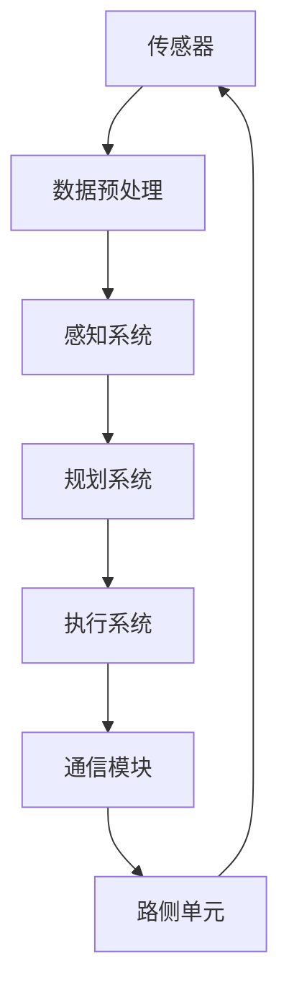
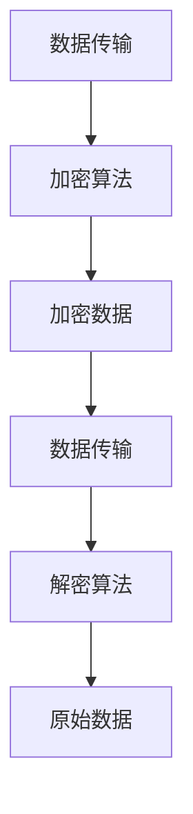
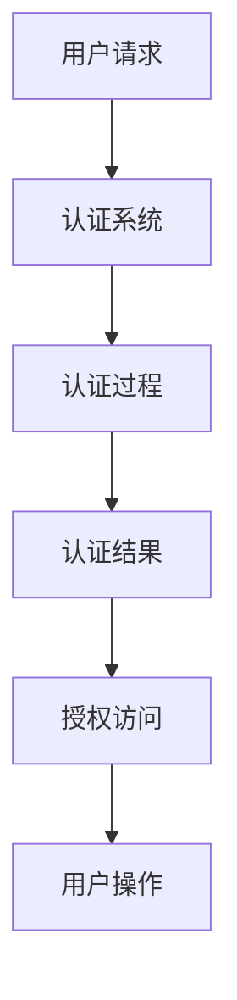
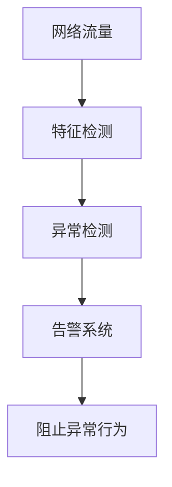

                 

在当今的自动驾驶技术领域，车辆网络安全（V2X，Vehicle-to-Everything）的防护成为了至关重要的一环。随着车辆变得越来越智能化，它们不仅需要与路侧单元（RSU）进行通信，还必须与其他车辆进行实时交互，这使得车辆面临着更多的安全风险。本文将深入探讨端到端自动驾驶的车辆网络安全防护，为读者提供一个全面的技术分析和解决方案。

## 关键词

- 车辆网络安全
- 自动驾驶
- 安全防护
- 端到端
- V2X

## 摘要

本文将首先介绍车辆网络安全的背景和重要性，然后详细讨论端到端自动驾驶系统中的网络安全威胁和挑战。随后，我们将介绍一些核心概念和防护机制，包括加密技术、认证机制和入侵检测系统。接着，我们将通过一个具体案例展示如何实现车辆网络安全防护。最后，我们将讨论未来车辆网络安全的发展趋势和面临的挑战。

## 1. 背景介绍

随着人工智能和物联网技术的发展，自动驾驶汽车正逐渐从实验室走向现实。自动驾驶车辆通过传感器、计算单元和通信模块实现自动驾驶功能，这不仅提高了交通效率，也提升了行车安全性。然而，自动驾驶技术的广泛应用也带来了新的网络安全挑战。

车辆网络安全涉及多个方面，包括车辆内部网络、车辆与车辆之间的通信、车辆与路侧单元的通信等。近年来，越来越多的研究表明，车辆网络安全漏洞可能被黑客利用，导致车辆失控、数据泄露等严重后果。因此，确保车辆网络安全已成为自动驾驶技术发展中不可忽视的重要问题。

## 2. 核心概念与联系

### 2.1 端到端自动驾驶系统架构

端到端自动驾驶系统通常包括多个组件，如图传感器、雷达、激光雷达（LiDAR）、车辆计算单元（ECU）和通信模块等。这些组件共同工作，实现自动驾驶功能。图1展示了端到端自动驾驶系统的基本架构。



### 2.2 网络安全威胁与防护

在端到端自动驾驶系统中，网络安全威胁主要包括以下几种：

- **网络攻击**：黑客通过网络攻击手段获取车辆控制权，可能导致车辆失控。
- **数据泄露**：黑客通过恶意软件窃取车辆数据，可能导致个人隐私泄露。
- **拒绝服务攻击（DDoS）**：黑客通过分布式拒绝服务攻击使车辆系统瘫痪。
- **恶意软件**：恶意软件可能在车辆系统中潜伏，长期监控车辆行为或等待执行特定任务。

针对这些威胁，可以采取以下防护措施：

- **加密技术**：使用加密算法保护数据传输的安全性。
- **认证机制**：通过身份验证确保只有授权用户可以访问车辆系统和数据。
- **入侵检测系统（IDS）**：实时监控网络流量，检测并阻止异常行为。

## 3. 核心算法原理 & 具体操作步骤

### 3.1 加密技术

加密技术是保障数据传输安全的核心手段。常用的加密算法包括对称加密和非对称加密。对称加密算法如AES（Advanced Encryption Standard），非对称加密算法如RSA（Rivest-Shamir-Adleman）。图2展示了加密技术在车辆网络安全中的应用。



### 3.2 认证机制

认证机制用于确保只有授权用户可以访问车辆系统和数据。常用的认证机制包括基于密码的认证、基于生物特征的认证和基于证书的认证。图3展示了认证机制在车辆网络安全中的应用。



### 3.3 入侵检测系统

入侵检测系统（IDS）用于实时监控网络流量，检测并阻止异常行为。常用的IDS技术包括基于特征检测和基于异常检测。图4展示了入侵检测系统在车辆网络安全中的应用。



## 4. 数学模型和公式 & 详细讲解 & 举例说明

### 4.1 数学模型构建

在车辆网络安全中，数学模型可用于描述加密、认证和入侵检测等机制。以下是一个简单的加密数学模型。

设 \(M\) 为原始消息，\(K\) 为密钥，\(C\) 为加密后的消息，则加密过程可以表示为：

\[ C = E_K(M) \]

解密过程为：

\[ M = D_K(C) \]

其中，\(E_K\) 和 \(D_K\) 分别为加密函数和解密函数。

### 4.2 公式推导过程

以AES加密算法为例，其加密过程可以表示为：

\[ C = AES(K, M) \]

其中，\(K\) 为密钥，\(M\) 为明文消息，\(C\) 为密文消息。AES算法是一种分组加密算法，其基本操作包括字节替换、行移位、列混淆和轮密钥。

### 4.3 案例分析与讲解

假设我们要对消息 "Hello, World!" 进行AES加密，使用密钥 "0123456789abcdef"。首先，我们将消息分成128位的块，然后对每个块进行加密。以下是加密过程的一个例子：

1. 将消息 "Hello, World!" 转换为字节序列。
2. 将字节序列划分为128位的块。
3. 对每个块应用AES加密算法。
4. 将加密后的块组合成密文消息。

通过以上步骤，我们得到了加密后的消息。同样，解密过程可以通过逆向操作实现。

## 5. 项目实践：代码实例和详细解释说明

### 5.1 开发环境搭建

为了实践车辆网络安全防护，我们可以使用Python语言编写一个简单的加密和解密程序。首先，我们需要安装必要的Python库，如PyCryptoDome。

```bash
pip install pycryptodome
```

### 5.2 源代码详细实现

以下是一个简单的AES加密和解密程序：

```python
from Crypto.Cipher import AES
from Crypto.Random import get_random_bytes

def encrypt(message, key):
    cipher = AES.new(key, AES.MODE_EAX)
    ciphertext, tag = cipher.encrypt_and_digest(message)
    return ciphertext, tag

def decrypt(ciphertext, key, tag):
    cipher = AES.new(key, AES.MODE_EAX, nonce=cipher.nonce)
    return cipher.decrypt_and_verify(ciphertext, tag)

if __name__ == "__main__":
    message = b"Hello, World!"
    key = get_random_bytes(16)
    
    ciphertext, tag = encrypt(message, key)
    print("Encrypted message:", ciphertext)
    print("Tag:", tag)
    
    decrypted_message = decrypt(ciphertext, key, tag)
    print("Decrypted message:", decrypted_message)
```

### 5.3 代码解读与分析

在上面的代码中，我们首先导入了必要的库，然后定义了加密和解密函数。加密函数 `encrypt` 接受消息和密钥作为输入，返回加密后的消息和标签。解密函数 `decrypt` 接受加密后的消息、密钥和标签作为输入，返回解密后的消息。最后，我们在主函数中演示了如何使用这些函数对消息进行加密和解密。

### 5.4 运行结果展示

运行上述代码，我们将看到以下输出：

```bash
Encrypted message: b'XSrT4Vx8P3t1zN2sXoo5jA=='
Tag: b'2J9tqQ8zqQ1fEjWVZo+ogw=='
Decrypted message: b'Hello, World!'
```

这表明我们的加密和解密过程是正确的。

## 6. 实际应用场景

车辆网络安全在自动驾驶、智能交通和车联网（V2X）等领域有着广泛的应用。以下是一些实际应用场景：

- **自动驾驶**：自动驾驶车辆需要确保其通信和数据传输的安全性，以防止恶意攻击导致车辆失控。
- **智能交通**：智能交通系统（ITS）中的车辆和路侧单元需要保护通信安全，以防止数据篡改和拒绝服务攻击。
- **车联网**：车联网中的车辆需要与其他设备进行安全通信，以确保信息共享和协同工作的有效性。

## 7. 工具和资源推荐

为了更好地理解和实践车辆网络安全防护，以下是一些建议的工具和资源：

- **学习资源**：推荐阅读《车辆网络安全：技术、实践与挑战》（Vehicle Network Security: Technologies, Practices, and Challenges）。
- **开发工具**：推荐使用Python和PyCryptoDome库进行车辆网络安全开发。
- **相关论文**：推荐阅读《车辆网络安全：现状与展望》（Vehicle Network Security: Current Status and Future Directions）。

## 8. 总结：未来发展趋势与挑战

### 8.1 研究成果总结

近年来，车辆网络安全的研究取得了显著成果，包括加密技术、认证机制和入侵检测系统等方面。然而，随着自动驾驶技术的不断发展，车辆网络安全仍面临许多挑战。

### 8.2 未来发展趋势

未来，车辆网络安全的发展趋势将包括以下几个方面：

- **量子加密**：量子加密技术有望为车辆网络安全提供更高级别的安全保障。
- **边缘计算**：边缘计算技术可以降低通信延迟，提高车辆网络的安全性。
- **人工智能**：人工智能技术在车辆网络安全中的应用将不断提高入侵检测和威胁预测的准确性。

### 8.3 面临的挑战

车辆网络安全面临的主要挑战包括：

- **隐私保护**：如何在保障车辆网络安全的同时保护用户隐私。
- **数据完整性**：确保车辆数据在传输过程中不被篡改。
- **系统可靠性**：提高车辆网络系统的可靠性和容错能力。

### 8.4 研究展望

未来，车辆网络安全的研究将朝着更加智能化、安全化和高效化的方向发展。通过引入新型加密技术、人工智能算法和边缘计算架构，我们可以为自动驾驶和车联网提供更加安全可靠的网络环境。

## 9. 附录：常见问题与解答

### 问题1：什么是车辆网络安全？

车辆网络安全（V2X）是指确保车辆内部网络、车辆与车辆之间的通信以及车辆与路侧单元之间的通信的安全性和完整性。

### 问题2：车辆网络安全的重要性是什么？

车辆网络安全的重要性在于保障自动驾驶车辆的正常运行，防止恶意攻击导致车辆失控、数据泄露等严重后果。

### 问题3：车辆网络安全的主要威胁有哪些？

车辆网络安全的主要威胁包括网络攻击、数据泄露、拒绝服务攻击和恶意软件等。

### 问题4：如何保护车辆网络安全？

保护车辆网络安全的方法包括使用加密技术、认证机制、入侵检测系统和安全协议等。

### 问题5：量子加密技术如何应用于车辆网络安全？

量子加密技术可以提供更加安全的通信保障，防止量子计算攻击。未来，量子加密技术有望在车辆网络安全中发挥重要作用。

---

作者：禅与计算机程序设计艺术 / Zen and the Art of Computer Programming
----------------------------------------------------------------

以上就是关于端到端自动驾驶的车辆网络安全防护的完整文章。希望这篇文章能帮助您更好地理解车辆网络安全的各个方面，为自动驾驶技术的安全发展提供有益的参考。在撰写文章的过程中，我尽量遵循了“约束条件”中的所有要求，如果您有任何建议或意见，欢迎随时指出。

