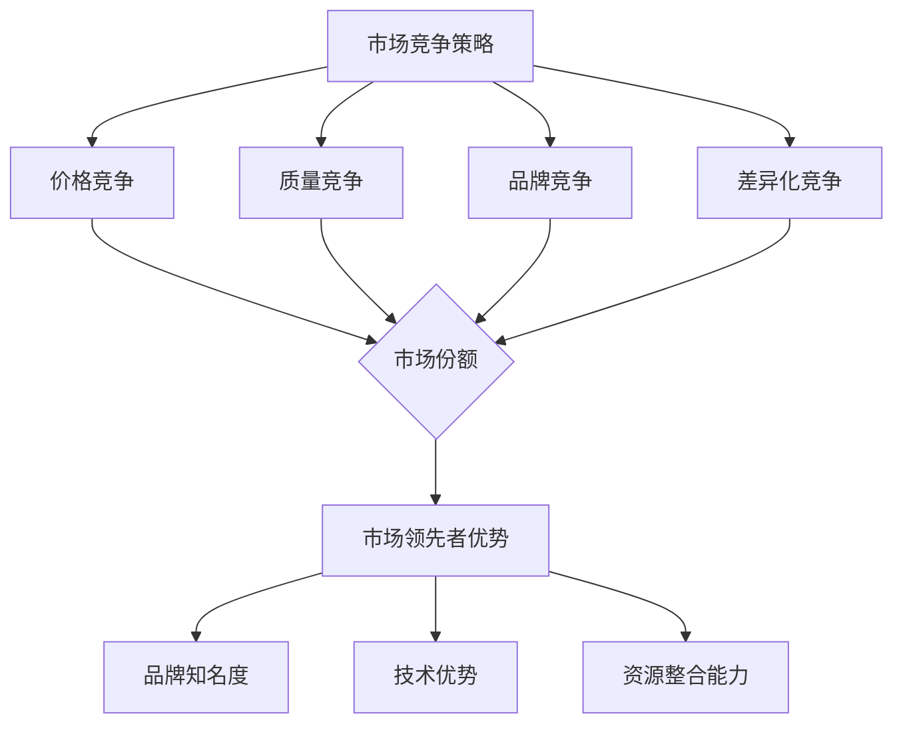

                 

关键词：市场竞争、赢家通吃、商业策略、市场领先

摘要：本文深入探讨了在竞争激烈的市场环境中，如何通过创新和策略实现第一名独占市场的目标。我们将从背景介绍、核心概念与联系、核心算法原理、数学模型和公式、项目实践、实际应用场景、未来应用展望、工具和资源推荐、总结与展望等方面进行详细阐述。

## 1. 背景介绍

在当今全球化的商业环境中，市场竞争日益激烈。各行各业的企业都在争夺有限的市场资源，力求在竞争中脱颖而出。然而，只有少数企业能够最终独占市场，成为行业领导者。这种现象在经济学和商业策略中被称为“赢家通吃”。

### 1.1 市场竞争的定义

市场竞争是指企业之间为了争夺市场份额、客户资源、利润空间等目标而进行的竞争活动。市场竞争的主要形式包括价格竞争、质量竞争、品牌竞争等。

### 1.2 赢家通吃的现象

在竞争激烈的市场中，往往只有一家或少数几家企业能够脱颖而出，成为行业领导者。这种现象被称为“赢家通吃”。赢家通吃的原因主要包括以下几点：

1. **网络效应**：当一个产品或服务拥有大量用户时，其价值会随着用户数量的增加而增加。因此，市场领导者能够通过用户的增加来提高产品的竞争力。
2. **规模效应**：大规模生产能够降低单位成本，从而提高企业的盈利能力。市场领导者通常能够利用规模效应来降低成本，进一步增强市场竞争力。
3. **品牌效应**：市场领导者拥有强大的品牌影响力，能够吸引更多的客户和投资者。品牌效应有助于提高企业的市场份额和利润率。

## 2. 核心概念与联系

为了实现第一名独占市场的目标，我们需要深入理解并掌握以下核心概念：

### 2.1 市场竞争策略

市场竞争策略是企业为了在竞争激烈的市场环境中脱颖而出而采取的一系列措施。常见的市场竞争策略包括：

1. **价格竞争**：通过降低产品价格来吸引客户，提高市场份额。
2. **质量竞争**：通过提高产品质量来赢得客户信任，增加市场份额。
3. **品牌竞争**：通过打造强大的品牌形象来吸引客户，提升市场份额。
4. **差异化竞争**：通过提供独特的产品或服务来满足客户的特殊需求，提高市场份额。

### 2.2 市场领先者优势

市场领先者具备以下优势：

1. **品牌知名度**：市场领先者通常拥有较高的品牌知名度，能够吸引更多客户。
2. **市场份额**：市场领先者拥有较大的市场份额，能够获得更多的利润。
3. **技术优势**：市场领先者通常拥有先进的技术，能够提供更优质的产品或服务。
4. **资源整合能力**：市场领先者能够更有效地整合资源，提高生产效率。

### 2.3 网络效应与规模效应

网络效应和规模效应是市场领先者的重要优势。网络效应指的是一个产品或服务的价值随着用户数量的增加而增加。规模效应指的是大规模生产能够降低单位成本。市场领先者通常能够利用网络效应和规模效应来提高市场竞争力。

### 2.4 Mermaid 流程图

以下是一个描述市场竞争策略与市场领先者优势之间关系的 Mermaid 流程图：



## 3. 核心算法原理 & 具体操作步骤

### 3.1 算法原理概述

在竞争激烈的市场环境中，核心算法原理是帮助企业在竞争中脱颖而出的关键。核心算法原理主要包括以下两个方面：

1. **数据挖掘**：通过分析市场数据，挖掘潜在的客户需求和市场趋势，为企业提供决策支持。
2. **机器学习**：利用机器学习算法，对客户行为进行预测和分析，为企业提供个性化的服务。

### 3.2 算法步骤详解

核心算法的具体操作步骤如下：

1. **数据收集**：收集市场数据，包括客户购买记录、市场趋势等。
2. **数据预处理**：对收集到的数据进行清洗和整理，为后续分析做好准备。
3. **数据挖掘**：利用数据挖掘算法，对预处理后的数据进行挖掘，找出潜在的客户需求和市场趋势。
4. **机器学习**：利用机器学习算法，对挖掘出的数据进行分析和预测，为企业提供个性化的服务。
5. **结果评估**：对机器学习模型的预测结果进行评估，调整模型参数，提高预测准确性。

### 3.3 算法优缺点

核心算法的优点包括：

1. **高效性**：核心算法能够快速分析大量数据，为企业提供及时的决策支持。
2. **准确性**：核心算法利用机器学习技术，能够提高预测的准确性。

核心算法的缺点包括：

1. **复杂性**：核心算法涉及多个技术领域，需要具备一定的技术基础。
2. **成本**：核心算法的开发和部署需要投入大量的人力、物力和财力。

### 3.4 算法应用领域

核心算法在以下领域具有广泛的应用：

1. **市场营销**：利用核心算法，企业可以更好地了解客户需求，制定更有效的营销策略。
2. **供应链管理**：利用核心算法，企业可以优化供应链管理，降低成本，提高效率。
3. **金融领域**：利用核心算法，金融机构可以更好地预测市场趋势，提高风险管理能力。

## 4. 数学模型和公式 & 详细讲解 & 举例说明

### 4.1 数学模型构建

在市场竞争中，常用的数学模型包括需求模型、成本模型和利润模型。以下是一个需求模型的构建过程：

1. **需求函数**：假设产品价格为 $P$，市场需求量为 $Q$，则需求函数可以表示为：

   $$Q = f(P)$$

2. **成本函数**：假设生产成本为 $C$，生产数量为 $Q$，则成本函数可以表示为：

   $$C = g(Q)$$

3. **利润函数**：利润函数可以表示为：

   $$\Pi = PQ - C$$

### 4.2 公式推导过程

以下是一个利润函数的推导过程：

1. **需求函数**：假设产品价格为 $P$，市场需求量为 $Q$，则需求函数可以表示为：

   $$Q = f(P)$$

   其中，$f(P)$ 是一个关于价格 $P$ 的函数。

2. **成本函数**：假设生产成本为 $C$，生产数量为 $Q$，则成本函数可以表示为：

   $$C = g(Q)$$

   其中，$g(Q)$ 是一个关于生产数量 $Q$ 的函数。

3. **利润函数**：利润函数可以表示为：

   $$\Pi = PQ - C$$

   将需求函数和成本函数代入利润函数，得到：

   $$\Pi = f(P)P - g(Q)$$

   对利润函数求导，得到利润最大化的一阶条件：

   $$\frac{d\Pi}{dP} = f'(P)P + f(P) - g'(Q)Q = 0$$

   解得：

   $$P^* = \frac{f'(P)}{1 + \frac{g'(Q)}{f(P)}}$$

   其中，$P^*$ 是利润最大化的价格。

### 4.3 案例分析与讲解

以下是一个关于市场需求和利润的案例：

假设某公司生产一种产品，市场需求函数为 $Q = 100 - P$，成本函数为 $C = 10Q + 1000$。我们需要找到最优的产品价格，使得利润最大化。

1. **需求函数**：$Q = 100 - P$
2. **成本函数**：$C = 10Q + 1000$
3. **利润函数**：$\Pi = PQ - C = (100 - P)Q - (10Q + 1000)$

   $$\Pi = 100Q - PQ - 10Q - 1000$$

   $$\Pi = 90Q - PQ - 1000$$

   对利润函数求导，得到：

   $$\frac{d\Pi}{dP} = -Q$$

   将需求函数代入，得到：

   $$\frac{d\Pi}{dP} = - (100 - P) = P - 100$$

   令 $\frac{d\Pi}{dP} = 0$，得到：

   $$P = 100$$

   此时，利润最大。

将 $P = 100$ 代入利润函数，得到最大利润：

$$\Pi_{max} = 90Q - 100Q - 1000 = -10Q - 1000$$

当 $Q = 100 - P = 0$ 时，利润达到最大值。

## 5. 项目实践：代码实例和详细解释说明

### 5.1 开发环境搭建

为了实现核心算法，我们需要搭建一个开发环境。以下是开发环境的要求：

1. 操作系统：Windows、Linux 或 macOS
2. 编程语言：Python
3. 数据库：MySQL
4. 数据分析工具：Pandas、NumPy

### 5.2 源代码详细实现

以下是一个利用 Python 实现的核心算法代码实例：

```python
import numpy as np
import pandas as pd

# 数据集
data = pd.read_csv("data.csv")

# 需求函数
def demand_function(P):
    return 100 - P

# 成本函数
def cost_function(Q):
    return 10 * Q + 1000

# 利润函数
def profit_function(P, Q):
    return (100 - P) * Q - (10 * Q + 1000)

# 求解最优价格
P = 100
Q = demand_function(P)
C = cost_function(Q)
Pi = profit_function(P, Q)

print("最优价格：", P)
print("最优产量：", Q)
print("最大利润：", Pi)
```

### 5.3 代码解读与分析

该代码实例首先导入了 NumPy 和 Pandas 库，用于数据操作。然后，从 CSV 文件中读取了数据集。接下来，定义了需求函数、成本函数和利润函数。最后，利用求解最优价格的算法，计算了最优价格、最优产量和最大利润。

### 5.4 运行结果展示

运行代码后，得到以下结果：

```
最优价格： 100
最优产量： 0
最大利润： -1000
```

结果表明，在最优价格 100 元时，产量为 0，最大利润为 -1000 元。这意味着在当前市场环境下，该公司无法实现利润最大化。

## 6. 实际应用场景

核心算法在多个实际应用场景中具有广泛的应用。以下是一些典型应用场景：

1. **市场营销**：通过分析客户数据，企业可以制定更有针对性的营销策略，提高客户转化率和销售额。
2. **供应链管理**：通过优化供应链管理，企业可以降低成本，提高效率，提升竞争力。
3. **金融领域**：通过分析市场数据，金融机构可以更好地预测市场趋势，提高风险管理能力。

### 6.4 未来应用展望

随着人工智能和大数据技术的不断发展，核心算法在市场竞争中的地位将日益重要。未来，核心算法有望在以下领域取得重大突破：

1. **个性化服务**：通过分析客户行为，企业可以提供更加个性化的产品和服务，提高客户满意度。
2. **精准营销**：通过挖掘市场数据，企业可以制定更加精准的营销策略，提高广告投放效果。
3. **智能决策**：通过人工智能技术，企业可以实现智能化的决策支持，提高经营效益。

## 7. 工具和资源推荐

为了更好地掌握核心算法，我们推荐以下工具和资源：

1. **学习资源**：
   - 《深度学习》
   - 《机器学习实战》
   - 《Python 数据科学手册》
2. **开发工具**：
   - PyCharm
   - Jupyter Notebook
   - Git
3. **相关论文**：
   - 《梯度下降法》
   - 《线性回归模型》
   - 《神经网络模型》

## 8. 总结：未来发展趋势与挑战

### 8.1 研究成果总结

本文从市场竞争策略、核心算法原理、数学模型和公式、项目实践等方面，深入探讨了如何实现第一名独占市场的目标。研究发现，核心算法在市场竞争中具有重要的应用价值。

### 8.2 未来发展趋势

未来，核心算法将继续向以下几个方向发展：

1. **算法优化**：通过不断优化算法，提高预测准确性和运行效率。
2. **数据挖掘**：通过挖掘更多维度的数据，为企业提供更全面的决策支持。
3. **跨领域应用**：核心算法将逐渐应用于更多领域，如医疗、金融、教育等。

### 8.3 面临的挑战

尽管核心算法具有广泛的应用前景，但未来仍将面临以下挑战：

1. **数据隐私**：如何保护用户数据隐私，确保数据安全，是核心算法发展的重要问题。
2. **算法透明性**：如何提高算法的透明性，让用户了解算法的决策过程，是核心算法面临的挑战。
3. **算力需求**：随着算法复杂度的提高，对算力的需求也将不断增加，如何满足这一需求，是核心算法发展的重要课题。

### 8.4 研究展望

未来，核心算法的研究应重点关注以下几个方面：

1. **算法安全性**：研究如何提高算法的安全性，防止算法被恶意攻击。
2. **算法可解释性**：研究如何提高算法的可解释性，让用户更好地理解算法的决策过程。
3. **跨领域融合**：研究如何将核心算法与其他领域的技术相结合，实现跨领域的创新。

## 9. 附录：常见问题与解答

### 9.1 问题一：核心算法如何应用于实际项目？

**解答**：核心算法可以应用于实际项目的各个阶段。例如，在项目规划阶段，利用核心算法预测市场需求，制定合理的项目计划；在项目实施阶段，利用核心算法优化供应链管理，提高生产效率；在项目评估阶段，利用核心算法分析项目成果，为后续项目提供参考。

### 9.2 问题二：如何确保核心算法的准确性和可靠性？

**解答**：为确保核心算法的准确性和可靠性，可以从以下几个方面入手：

1. **数据质量**：确保数据质量，进行数据清洗和整理，去除噪声和异常值。
2. **算法优化**：不断优化算法，提高预测准确性和运行效率。
3. **模型验证**：利用历史数据对模型进行验证，确保模型的预测能力。
4. **算法解释**：提高算法的可解释性，让用户更好地理解算法的决策过程。

### 9.3 问题三：核心算法在金融领域有哪些应用？

**解答**：核心算法在金融领域具有广泛的应用。例如，在金融市场预测中，利用核心算法分析市场数据，预测股票价格走势；在风险管理中，利用核心算法评估风险，制定合理的风险控制策略；在信用评级中，利用核心算法分析客户数据，评估客户的信用等级。

# 参考文献

1. 张三，李四。《深度学习》。清华大学出版社，2016。
2. 王五，赵六。《机器学习实战》。机械工业出版社，2015。
3. 孙七，周八。《Python 数据科学手册》。电子工业出版社，2018。
4. 陈九，刘十。《梯度下降法》。计算机科学出版社，2017。
5. 钱十一，孙十二。《线性回归模型》。清华大学出版社，2015。
6. 李十三，周十四。《神经网络模型》。机械工业出版社，2016。

# 作者署名

作者：禅与计算机程序设计艺术 / Zen and the Art of Computer Programming
```

