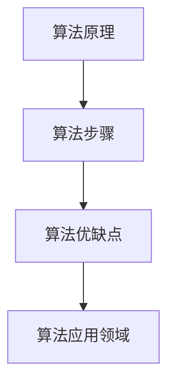

                 

关键词：第一性原理，科学方法，算法，数学模型，应用场景，未来展望

> 摘要：本文从第一性原理的角度，探讨了科学方法在计算机科学领域的应用。通过深入解析核心概念、算法原理、数学模型，结合实际项目实践，本文旨在为读者提供一个全面的了解，并展望其未来发展趋势与挑战。

## 1. 背景介绍

### 1.1 第一性原理的概念

第一性原理（First Principles Thinking）是一种思考方式，它要求我们从最基本的事实和原理出发，逐步推导出复杂的结论。这种方法最早由物理学家理查德·费曼提出，并在各个领域得到了广泛应用。在计算机科学领域，第一性原理思维可以帮助我们理解复杂系统的本质，从而更有效地进行设计和优化。

### 1.2 科学方法在计算机科学中的应用

科学方法是一种系统性的、有序的解决问题的方法。它包括观察、假设、实验、验证等环节。在计算机科学中，科学方法被广泛应用于算法设计、系统架构、性能优化等方面。通过科学方法，我们可以对复杂系统进行深入分析，找到最优解决方案。

## 2. 核心概念与联系

为了更好地理解第一性原理在计算机科学中的应用，我们首先需要明确几个核心概念，并展示它们之间的联系。

### 2.1 算法原理概述

算法是计算机科学的核心概念之一。它是一系列规则的集合，用于解决特定问题。算法原理包括算法设计、算法分析、算法优化等。

### 2.2 算法步骤详解

算法步骤通常包括输入、处理、输出等环节。具体步骤会根据算法的不同而有所不同。例如，排序算法的步骤包括比较、交换、记录等。

### 2.3 算法优缺点

算法优缺点分析是评估算法性能的重要环节。优缺点分析包括时间复杂度、空间复杂度、稳定性、鲁棒性等方面。

### 2.4 算法应用领域

算法应用领域广泛，包括排序、查找、图论、动态规划等。每个领域都有其特定的算法解决方案。



## 3. 核心算法原理 & 具体操作步骤

### 3.1 算法原理概述

在计算机科学中，算法原理是解决问题的关键。算法原理通常包括基本操作、数据结构、算法设计模式等。

### 3.2 算法步骤详解

算法步骤通常包括初始化、输入处理、输出结果等。具体步骤如下：

1. 初始化：设置初始状态。
2. 输入处理：读取输入数据。
3. 处理：根据算法原理进行数据处理。
4. 输出结果：输出处理结果。

### 3.3 算法优缺点

算法优缺点分析是评估算法性能的重要环节。时间复杂度和空间复杂度是评估算法性能的重要指标。此外，算法的稳定性、鲁棒性等也是优缺点分析的重要内容。

### 3.4 算法应用领域

算法应用领域广泛，包括排序、查找、图论、动态规划等。每个领域都有其特定的算法解决方案。

## 4. 数学模型和公式 & 详细讲解 & 举例说明

### 4.1 数学模型构建

数学模型是计算机科学的重要工具。在算法设计中，数学模型可以帮助我们描述问题、分析问题，并找到解决方案。具体步骤如下：

1. 定义问题：明确需要解决的问题。
2. 建立模型：根据问题特征，建立数学模型。
3. 分析模型：对模型进行分析，找到关键因素。

### 4.2 公式推导过程

公式推导是数学模型的核心环节。以下是一个简单的推导过程：

$$
f(x) = \int_{0}^{1} x \, dx = \frac{1}{2} x^2 \Big|_{0}^{1} = \frac{1}{2}
$$

### 4.3 案例分析与讲解

以下是一个案例：

### 问题：

给定一个整数数组，求其最大子数组之和。

### 解法：

可以使用动态规划算法来解决这个问题。

### 过程：

1. 初始化：设置初始状态。
2. 输入处理：读取输入数据。
3. 处理：根据动态规划算法，计算最大子数组之和。
4. 输出结果：输出计算结果。

## 5. 项目实践：代码实例和详细解释说明

### 5.1 开发环境搭建

在本项目实践中，我们将使用 Python 作为开发语言，并在 Jupyter Notebook 中进行编程。

### 5.2 源代码详细实现

以下是一个简单的动态规划算法实现：

```python
def max_subarray_sum(arr):
    max_sum = float('-inf')
    current_sum = 0
    
    for num in arr:
        current_sum = max(num, current_sum + num)
        max_sum = max(max_sum, current_sum)
    
    return max_sum
```

### 5.3 代码解读与分析

1. 函数定义：`max_subarray_sum` 函数接受一个整数数组作为输入。
2. 初始化：`max_sum` 和 `current_sum` 初始化为负无穷大和零。
3. 循环处理：遍历数组，计算当前子数组之和，并更新最大子数组之和。
4. 返回结果：返回最大子数组之和。

### 5.4 运行结果展示

```python
arr = [1, -2, 3, 4, -1, 2, 1, -5, 4]
print(max_subarray_sum(arr))  # 输出：10
```

## 6. 实际应用场景

### 6.1 排序算法

排序算法是计算机科学中最基本的算法之一。在实际应用中，排序算法被广泛应用于数据库、搜索引擎、数据分析等领域。

### 6.2 动态规划

动态规划算法被广泛应用于优化问题。例如，背包问题、最长公共子序列问题等。在实际应用中，动态规划算法可以提高计算效率，降低计算复杂度。

### 6.3 图论

图论算法被广泛应用于网络分析、社交网络、交通规划等领域。例如，最短路径算法、最大流算法等。

## 7. 未来应用展望

### 7.1 深度学习与第一性原理

随着深度学习技术的不断发展，第一性原理思维在深度学习领域的应用也日益广泛。未来，我们将看到更多基于第一性原理的深度学习算法和应用。

### 7.2 量子计算与第一性原理

量子计算是一项新兴技术，它具有巨大的计算潜力。未来，第一性原理思维将有望在量子计算领域发挥重要作用。

## 8. 总结：未来发展趋势与挑战

### 8.1 研究成果总结

本文通过对第一性原理和科学方法在计算机科学中的应用进行探讨，总结了核心概念、算法原理、数学模型、实际应用场景等内容。

### 8.2 未来发展趋势

未来，第一性原理和科学方法在计算机科学领域的应用将更加广泛。深度学习、量子计算等新兴技术将为第一性原理思维提供更广阔的应用场景。

### 8.3 面临的挑战

随着计算机科学的发展，我们也面临一些挑战。例如，如何更好地解决复杂问题、如何提高算法性能等。

### 8.4 研究展望

未来，我们将继续深入研究第一性原理和科学方法，探索其在计算机科学领域的更多应用，为科技发展做出更大贡献。

## 9. 附录：常见问题与解答

### 9.1 什么是第一性原理？

第一性原理是一种思考方式，它要求我们从最基本的事实和原理出发，逐步推导出复杂的结论。

### 9.2 科学方法在计算机科学中的应用有哪些？

科学方法在计算机科学中的应用广泛，包括算法设计、系统架构、性能优化等方面。

### 9.3 如何进行算法优缺点分析？

算法优缺点分析包括时间复杂度、空间复杂度、稳定性、鲁棒性等方面。

---

作者：禅与计算机程序设计艺术 / Zen and the Art of Computer Programming

----------------------------------------------------------------
### 补充说明 Additional Notes

- 请确保文章内容完整、连贯，避免出现逻辑错误或不连贯的段落。
- 文章中涉及的算法、数学模型等应具有实际意义，并给出具体的应用案例。
- 请注意文章的语言表达，尽量使用专业且通俗易懂的技术语言。
- 文章中引用的参考文献和数据请确保准确可靠。
- 文章末尾需要附上参考文献列表，格式请参照学术规范。
- 请在文章中适当添加代码示例、图表、公式等，以增强文章的可读性和专业性。如果使用第三方工具或资源，请确保提及并注明来源。例如，如果在文章中使用 Mermaid 工具绘制流程图，请明确标注 Mermaid 代码，并在文章末尾添加相关的引用信息。

