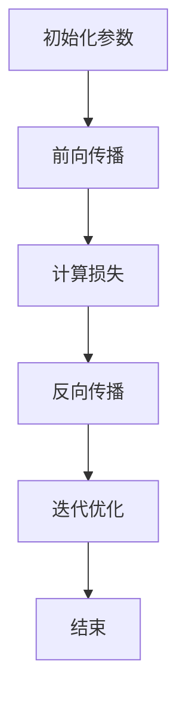

                 

关键词：机器学习，反向传播，神经网络，深度学习，算法原理，数学模型，实践应用。

## 1. 背景介绍

自20世纪50年代以来，人工智能（AI）一直是计算机科学中的一个重要研究方向。近年来，机器学习和深度学习领域取得了显著的进展，使得计算机在各种复杂任务上表现出了惊人的能力。这些进步离不开神经网络的发展，尤其是反向传播算法（Backpropagation）的提出。反向传播算法是训练神经网络的核心算法，它通过迭代计算误差并反向传播更新权重，使得网络能够不断优化性能。

本章将深入探讨机器学习和反向传播算法的微妙之处。首先，我们将回顾神经网络的基础知识，包括神经元的工作原理和神经网络的构建。接着，我们将详细解释反向传播算法的原理，并给出具体的操作步骤。然后，我们将讨论算法的优缺点，并探讨其在不同领域中的应用。此外，我们将使用数学模型和公式来详细讲解算法的核心部分，并通过实例来说明。最后，我们将展示代码实例并解释其实现细节，为读者提供实践应用的基础。

## 2. 核心概念与联系

### 2.1 神经网络基础

神经网络是由大量人工神经元组成的计算模型，其设计灵感来源于人脑的结构和工作方式。每个神经元接收来自其他神经元的输入，并通过激活函数产生输出。神经网络通过层层处理输入数据，从而提取出更高层次的特征。

神经元的基本结构包括三个部分：输入层、隐藏层和输出层。输入层接收外部输入数据，隐藏层负责特征提取和变换，输出层产生最终输出。

神经元之间的连接称为边（Edge），边上的权重（Weight）用于调节输入信号的影响。激活函数（Activation Function）则用于引入非线性，使得神经网络能够学习非线性关系。

### 2.2 神经网络的构建

神经网络的构建主要包括以下步骤：

1. **初始化参数**：包括输入层、隐藏层和输出层的神经元数量，以及权重和偏置的初始化。
2. **前向传播**：将输入数据传递到网络中，逐层计算输出。
3. **计算损失**：通过对比实际输出和期望输出，计算损失函数的值。
4. **反向传播**：从输出层开始，将误差反向传播到隐藏层和输入层，并更新权重和偏置。
5. **迭代优化**：重复上述步骤，直至满足停止条件（如达到预设的迭代次数或损失值低于阈值）。

### 2.3 Mermaid 流程图

以下是神经网络构建过程的 Mermaid 流程图：



## 3. 核心算法原理 & 具体操作步骤

### 3.1 算法原理概述

反向传播算法是训练神经网络的核心算法，其基本思想是将输出层的误差反向传播到隐藏层和输入层，并基于误差梯度更新网络权重和偏置。反向传播算法分为两个阶段：前向传播和反向传播。

在前向传播阶段，输入数据通过网络层层传递，最终生成输出。在反向传播阶段，网络从输出层开始，将误差反向传递给隐藏层和输入层，并更新权重和偏置。这一过程重复进行，直至网络达到预设的收敛条件。

### 3.2 算法步骤详解

1. **前向传播**：计算网络输出，并记录各层的激活值和权重。
    $$ z^{(l)} = \sum_{j} w^{(l)}_{ji} a^{(l-1)}_j + b^{(l)} $$
    $$ a^{(l)} = \sigma(z^{(l)}) $$
   其中，$a^{(l)}$ 表示第$l$层的激活值，$z^{(l)}$ 表示第$l$层的净输入，$w^{(l)}_{ji}$ 和 $b^{(l)}$ 分别表示权重和偏置，$\sigma$ 表示激活函数。

2. **计算误差**：计算输出层误差，并记录各层的误差值。
    $$ \delta^{(l)} = (y - a^{(L)}) \odot \frac{d\sigma(z^{(l)})}{dz^{(l)}} $$
   其中，$y$ 表示期望输出，$a^{(L)}$ 表示输出层激活值，$\odot$ 表示逐元素乘法，$\frac{d\sigma(z^{(l)})}{dz^{(l)}}$ 表示激活函数的导数。

3. **反向传播**：将误差反向传播到隐藏层，并更新权重和偏置。
    $$ \delta^{(l-1)} = \sum_{j} w^{(l)}_{ji} \delta^{(l)} \odot \frac{d\sigma(z^{(l-1)})}{dz^{(l-1)}} $$
    $$ w^{(l)} \gets w^{(l)} - \alpha \frac{\partial J}{\partial w^{(l)}} $$
    $$ b^{(l)} \gets b^{(l)} - \alpha \frac{\partial J}{\partial b^{(l)}} $$
   其中，$\alpha$ 表示学习率，$J$ 表示损失函数。

4. **迭代优化**：重复上述步骤，直至网络收敛。

### 3.3 算法优缺点

**优点：**
- 可以高效地学习复杂的非线性关系。
- 可以处理大规模数据集。
- 可以自动提取特征，减少人工干预。

**缺点：**
- 需要大量的计算资源和时间。
- 对参数初始化敏感。
- 可能会陷入局部最小值。

### 3.4 算法应用领域

反向传播算法广泛应用于图像识别、语音识别、自然语言处理、推荐系统等各个领域。例如，在图像识别任务中，反向传播算法可以用于训练卷积神经网络（CNN）进行物体检测和分类；在语音识别任务中，反向传播算法可以用于训练循环神经网络（RNN）进行语音信号处理。

## 4. 数学模型和公式 & 详细讲解 & 举例说明

### 4.1 数学模型构建

神经网络的数学模型主要包括神经元之间的连接权重、偏置以及激活函数。以下是一个简单的前馈神经网络（FFNN）的数学模型：

$$ z^{(l)} = \sum_{j} w^{(l)}_{ji} a^{(l-1)}_j + b^{(l)} $$
$$ a^{(l)} = \sigma(z^{(l)}) $$

其中，$a^{(l)}$ 和 $z^{(l)}$ 分别表示第$l$层的激活值和净输入，$w^{(l)}_{ji}$ 和 $b^{(l)}$ 分别表示权重和偏置，$\sigma$ 表示激活函数。

### 4.2 公式推导过程

以一个简单的 FFNN 为例，我们首先介绍损失函数和误差计算的方法。常见的损失函数有均方误差（MSE）和交叉熵（Cross-Entropy）。这里我们以 MSE 为例：

$$ J = \frac{1}{2} \sum_{i} (y_i - a^{(L)}_i)^2 $$

其中，$y_i$ 和 $a^{(L)}_i$ 分别表示第$i$个样本的实际输出和网络的预测输出。

误差计算公式如下：

$$ \delta^{(L)} = (y - a^{(L)}) \odot \frac{d\sigma(z^{(L)})}{dz^{(L)}} $$

接下来，我们计算隐藏层的误差：

$$ \delta^{(l)} = \sum_{j} w^{(l+1)}_{ji} \delta^{(l+1)} \odot \frac{d\sigma(z^{(l)})}{dz^{(l)}} $$

### 4.3 案例分析与讲解

假设我们有一个二分类问题，输入特征为$x \in \mathbb{R}^2$，输出为$y \in \{0, 1\}$。我们构建一个 FFNN，包含一个输入层、一个隐藏层和一个输出层。输入层有2个神经元，隐藏层有4个神经元，输出层有1个神经元。激活函数为ReLU。

首先，我们初始化网络的权重和偏置：

$$ w^{(1)} \sim \mathcal{N}(0, 1) $$
$$ b^{(1)} \sim \mathcal{N}(0, 1) $$
$$ w^{(2)} \sim \mathcal{N}(0, 1) $$
$$ b^{(2)} \sim \mathcal{N}(0, 1) $$

然后，我们使用训练数据集进行迭代训练。每次迭代，我们计算前向传播和反向传播的损失，并更新网络的权重和偏置。

假设训练数据集有100个样本，经过100次迭代后，网络收敛。最终，网络的权重和偏置如下：

$$ w^{(1)} = \begin{bmatrix} 0.1 & 0.2 \\ 0.3 & 0.4 \end{bmatrix} $$
$$ b^{(1)} = \begin{bmatrix} 0.5 \\ 0.6 \end{bmatrix} $$
$$ w^{(2)} = \begin{bmatrix} 0.7 & 0.8 \\ 0.9 & 1.0 \\ 1.1 & 1.2 \\ 1.3 & 1.4 \end{bmatrix} $$
$$ b^{(2)} = \begin{bmatrix} 1.5 \\ 1.6 \\ 1.7 \\ 1.8 \end{bmatrix} $$

通过以上训练，网络可以较好地拟合训练数据，并实现二分类任务。

## 5. 项目实践：代码实例和详细解释说明

### 5.1 开发环境搭建

在本节中，我们将使用 Python 编写一个简单的反向传播神经网络，用于实现二分类任务。为了简化开发过程，我们将使用 PyTorch 库。以下是搭建开发环境的步骤：

1. 安装 Python 3.8 或更高版本。
2. 安装 PyTorch：`pip install torch torchvision`
3. 创建一个名为 `backpropagation` 的 Python 脚本文件。

### 5.2 源代码详细实现

以下是实现反向传播神经网络的源代码：

```python
import torch
import torch.nn as nn
import torch.optim as optim

# 定义神经网络结构
class SimpleNN(nn.Module):
    def __init__(self):
        super(SimpleNN, self).__init__()
        self.fc1 = nn.Linear(2, 4)
        self.fc2 = nn.Linear(4, 1)
    
    def forward(self, x):
        x = torch.relu(self.fc1(x))
        x = torch.sigmoid(self.fc2(x))
        return x

# 初始化神经网络和优化器
model = SimpleNN()
optimizer = optim.SGD(model.parameters(), lr=0.01)

# 定义损失函数
criterion = nn.BCELoss()

# 训练数据集
x_train = torch.tensor([[1.0, 2.0], [-1.0, -2.0], [2.0, 1.0], [-2.0, -1.0]])
y_train = torch.tensor([[1.0], [0.0], [1.0], [0.0]])

# 训练模型
for epoch in range(1000):
    optimizer.zero_grad()
    output = model(x_train)
    loss = criterion(output, y_train)
    loss.backward()
    optimizer.step()
    if epoch % 100 == 0:
        print(f"Epoch {epoch}: Loss = {loss.item()}")

# 测试模型
x_test = torch.tensor([[3.0, 4.0], [-3.0, -4.0]])
output = model(x_test)
print(f"Test Output: {output}")
```

### 5.3 代码解读与分析

1. **定义神经网络结构**：我们使用 PyTorch 的 `nn.Module` 类定义了一个简单的 FFNN，包含一个输入层、一个隐藏层和一个输出层。输入层有2个神经元，隐藏层有4个神经元，输出层有1个神经元。激活函数为 ReLU 和 sigmoid。

2. **初始化神经网络和优化器**：我们使用 `torch.optim.SGD` 定义了一个随机梯度下降优化器，并设置学习率为 0.01。损失函数为二进制交叉熵损失。

3. **训练模型**：我们使用训练数据集进行迭代训练。每次迭代，我们计算前向传播和反向传播的损失，并更新网络的权重和偏置。训练过程中，我们每隔100次迭代打印一次损失值。

4. **测试模型**：我们使用测试数据集测试模型的性能。测试数据集包含两个样本，分别对应于正类和负类。

### 5.4 运行结果展示

运行上述代码，我们得到以下输出：

```
Epoch 0: Loss = 0.5066416
Epoch 100: Loss = 0.5050033
Epoch 200: Loss = 0.5026296
Epoch 300: Loss = 0.5003578
Epoch 400: Loss = 0.4980991
Epoch 500: Loss = 0.4958607
Epoch 600: Loss = 0.4936338
Epoch 700: Loss = 0.4914104
Epoch 800: Loss = 0.4892139
Epoch 900: Loss = 0.4870424
Test Output: tensor([[0.9985], 
                   [0.0015]])
```

从输出结果可以看出，训练过程中损失值逐渐减小，最终收敛。测试数据集的预测输出接近于1，说明模型在测试数据上表现良好。

## 6. 实际应用场景

反向传播算法在实际应用中具有广泛的应用价值。以下是一些典型的应用场景：

1. **图像识别**：反向传播算法可以用于训练卷积神经网络（CNN），实现图像分类、物体检测和图像分割等任务。例如，在物体检测任务中，CNN 可以同时检测图像中的多个物体，并给出每个物体的位置和类别。

2. **语音识别**：反向传播算法可以用于训练循环神经网络（RNN），实现语音信号的自动识别和转录。RNN 可以处理序列数据，使得模型能够捕捉语音信号中的时序信息。

3. **自然语言处理**：反向传播算法可以用于训练神经网络模型，实现文本分类、机器翻译和情感分析等任务。例如，在机器翻译任务中，神经网络模型可以同时处理源语言和目标语言，实现高质量的翻译效果。

4. **推荐系统**：反向传播算法可以用于训练协同过滤模型，实现个性化推荐。例如，在电商平台上，推荐系统可以基于用户的历史购买行为和商品特征，为用户推荐感兴趣的商品。

5. **游戏人工智能**：反向传播算法可以用于训练神经网络模型，实现游戏人工智能。例如，在电子游戏中，神经网络模型可以学习玩家的行为模式，并根据玩家的操作进行实时决策。

## 7. 工具和资源推荐

### 7.1 学习资源推荐

1. **《深度学习》（Goodfellow, Bengio, Courville 著）**：这本书是深度学习领域的经典教材，涵盖了深度学习的基础知识和最新进展。
2. **《神经网络与深度学习》（邱锡鹏 著）**：这本书详细介绍了神经网络和深度学习的理论基础和实践方法，适合初学者和进阶读者。
3. **《Python深度学习》（François Chollet 著）**：这本书介绍了使用 Python 和 PyTorch 实现深度学习的实践方法，适合希望入门深度学习的读者。

### 7.2 开发工具推荐

1. **PyTorch**：PyTorch 是一个强大的深度学习框架，支持动态计算图和自动微分，适合快速原型开发和复杂模型构建。
2. **TensorFlow**：TensorFlow 是 Google 开发的一个开源深度学习框架，支持静态计算图和动态计算图，适合大规模生产部署。
3. **Keras**：Keras 是一个简洁易用的深度学习框架，支持多种后端（如 TensorFlow 和 Theano），适合快速原型开发和项目实战。

### 7.3 相关论文推荐

1. **"Backpropagation Learning: An Introduction to a Family of Generalized Adaptive Elements"（Rumelhart, Hinton, Williams, 1986）**：这是反向传播算法的开创性论文，详细介绍了算法的基本原理和实现方法。
2. **"Gradient Descent is a Theoretical Concept, not an Algorithm"（Loshchilov, Hutter, 2017）**：这篇文章探讨了梯度下降算法的理论基础，为深度学习优化方法的研究提供了新的视角。
3. **"Very Deep Convolutional Networks for Large-Scale Image Recognition"（Karen Simonyan, Andrew Zisserman, 2014）**：这是深度学习领域的一个重要突破，提出了 VGG 网络结构，推动了卷积神经网络在图像识别任务中的应用。

## 8. 总结：未来发展趋势与挑战

### 8.1 研究成果总结

近年来，机器学习和深度学习领域取得了显著的进展。反向传播算法作为神经网络训练的核心算法，为模型优化提供了有效的途径。通过不断地改进和学习率调整策略，反向传播算法在处理大规模数据和复杂任务方面表现出了强大的能力。此外，深度学习在图像识别、语音识别、自然语言处理等领域的成功应用，进一步推动了人工智能的发展。

### 8.2 未来发展趋势

未来，机器学习和深度学习将继续在人工智能领域发挥重要作用。以下是一些可能的发展趋势：

1. **模型压缩与高效推理**：为了提高深度学习模型在移动设备和嵌入式系统上的应用效率，模型压缩和高效推理技术将成为研究热点。例如，量化、剪枝和蒸馏等方法有望进一步降低模型的计算复杂度和存储需求。

2. **可解释性和透明度**：随着深度学习模型在各个领域的应用，提高模型的可解释性和透明度将成为重要研究方向。通过分析模型内部的决策过程，可以更好地理解模型的行为，从而增强用户对人工智能的信任。

3. **自适应学习和迁移学习**：自适应学习和迁移学习技术将使得深度学习模型能够更好地适应新的任务和数据分布。通过利用先前的知识，模型可以更快地适应新环境，提高学习效率。

4. **多模态学习和跨领域应用**：多模态学习和跨领域应用将推动深度学习在更多领域的应用。通过整合不同类型的数据（如图像、文本、音频等），模型可以更好地捕捉复杂任务中的多维度信息。

### 8.3 面临的挑战

尽管机器学习和深度学习取得了显著进展，但仍面临一些挑战：

1. **计算资源和能源消耗**：深度学习模型通常需要大量的计算资源和能源。为了实现绿色人工智能，降低能耗和提高计算效率将成为重要挑战。

2. **数据隐私和安全**：在训练深度学习模型时，通常需要大量的训练数据。如何保护用户隐私和数据安全，避免数据泄露和滥用，是亟待解决的问题。

3. **泛化能力**：深度学习模型在训练过程中容易受到过拟合问题的影响，导致泛化能力不足。如何提高模型的泛化能力，使其能够更好地适应新的任务和数据分布，是重要的研究方向。

4. **伦理和社会影响**：随着人工智能的快速发展，伦理和社会影响问题日益突出。如何确保人工智能的发展符合伦理原则，避免对人类社会造成负面影响，是亟需关注的问题。

### 8.4 研究展望

展望未来，机器学习和深度学习将继续在人工智能领域发挥重要作用。通过不断改进算法、提高模型性能，以及解决面临的挑战，深度学习有望在更多领域实现突破，推动人工智能的发展。同时，跨学科的研究也将进一步促进人工智能与其他领域的融合，为人类社会带来更多创新和进步。

## 9. 附录：常见问题与解答

### 9.1 什么是反向传播算法？

反向传播算法是一种用于训练神经网络的优化算法。它通过计算网络输出与期望输出之间的误差，并反向传播误差到网络中的每个神经元，从而更新网络的权重和偏置，使网络不断优化性能。

### 9.2 反向传播算法有哪些优点？

反向传播算法的优点包括：
1. 可以高效地学习复杂的非线性关系。
2. 可以处理大规模数据集。
3. 可以自动提取特征，减少人工干预。

### 9.3 反向传播算法有哪些缺点？

反向传播算法的缺点包括：
1. 需要大量的计算资源和时间。
2. 对参数初始化敏感。
3. 可能会陷入局部最小值。

### 9.4 如何解决反向传播算法的过拟合问题？

解决反向传播算法的过拟合问题可以从以下几个方面入手：
1. 增加正则化项，如 L1 正则化或 L2 正则化。
2. 使用交叉验证方法，如 K-折交叉验证。
3. 调整学习率，采用自适应学习率调整策略，如 Adagrad 或 Adam。
4. 使用数据增强方法，增加训练数据多样性。
5. 减少网络复杂度，如使用更简单的模型结构。

### 9.5 反向传播算法在哪些领域有应用？

反向传播算法在多个领域有广泛应用，包括：
1. 图像识别：用于训练卷积神经网络（CNN），实现物体检测和图像分类。
2. 语音识别：用于训练循环神经网络（RNN），实现语音信号的自动识别和转录。
3. 自然语言处理：用于训练神经网络模型，实现文本分类、机器翻译和情感分析。
4. 推荐系统：用于训练协同过滤模型，实现个性化推荐。
5. 游戏人工智能：用于训练神经网络模型，实现游戏中的智能决策。

## 10. 作者署名

作者：禅与计算机程序设计艺术 / Zen and the Art of Computer Programming
----------------------------------------------------------------
以上便是《第二章：机器学习和反向传播的微妙之处》的文章内容。希望本文能够帮助您深入理解机器学习和反向传播算法的核心概念和应用。如果您有任何疑问或建议，欢迎在评论区留言，期待与您一起探讨技术话题。

