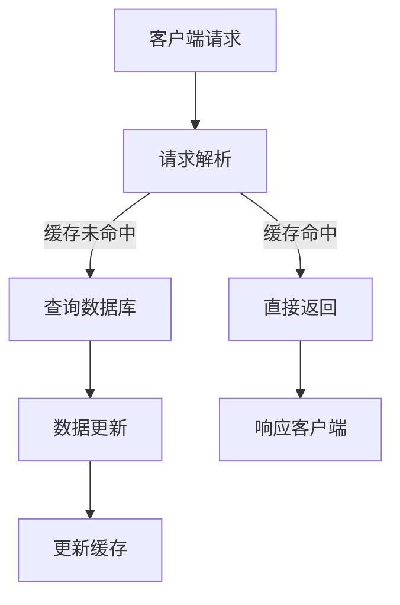

                 

关键词：KV-Cache、缓存推断、数据一致性、分布式系统、性能优化、算法原理、数学模型、代码实例

> 摘要：本文将探讨KV-cache推断技术，这是一种在分布式系统中提高数据一致性和性能的关键技术。我们将深入分析其核心概念、算法原理、数学模型及其在实际项目中的应用和未来展望。

## 1. 背景介绍

在现代的分布式系统中，数据存储和访问的速度往往成为系统性能的瓶颈。因此，缓存（Cache）技术被广泛采用来减轻数据库的负载，提高数据访问的速度。KV-Cache作为缓存技术的一种，它通过将关键数据对映射到内存中，从而实现快速的数据访问。

然而，KV-Cache的引入不仅带来了性能的提升，同时也带来了数据一致性的挑战。在分布式系统中，数据的一致性问题一直是研究的重点。如何在保证数据一致性的同时，提高系统的性能，成为了一个重要的研究课题。

本文将介绍一种KV-cache推断技术，它通过预测数据的访问模式，从而优化缓存策略，提高系统的性能和一致性。

## 2. 核心概念与联系

### 2.1 KV-Cache的基本概念

KV-Cache是一种基于键值对的缓存系统，它通过将数据以键值对的形式存储在内存中，从而实现快速的访问。在KV-Cache中，键（Key）用于唯一标识数据，值（Value）则是数据本身。

### 2.2 数据一致性

数据一致性是指在不同节点之间保持数据的一致状态。在分布式系统中，由于网络延迟、系统故障等原因，可能会导致数据在不同节点之间出现不一致的情况。因此，保证数据一致性是分布式系统的关键挑战之一。

### 2.3 缓存策略

缓存策略是指如何选择哪些数据应该被缓存的策略。常见的缓存策略包括LRU（Least Recently Used）、LFU（Least Frequently Used）等。这些策略的目标是最大化缓存的有效性，即在缓存中存储最有可能被访问的数据。

### 2.4 Mermaid 流程图

以下是一个简化的Mermaid流程图，展示了KV-cache的基本架构和核心概念：



## 3. 核心算法原理 & 具体操作步骤

### 3.1 算法原理概述

KV-cache推断技术基于对数据访问模式的预测。通过分析历史访问数据，算法可以预测哪些数据在未来的访问概率更高，从而优化缓存策略。

### 3.2 算法步骤详解

1. 数据收集：收集系统的历史访问数据，包括键值对的访问频率和访问时间。

2. 数据预处理：对收集到的数据进行预处理，包括去重、排序等。

3. 访问模式预测：利用机器学习算法，如决策树、神经网络等，对预处理后的数据进行分析，预测未来的访问模式。

4. 缓存策略优化：根据预测结果，优化缓存策略，将预测访问概率较高的数据优先缓存。

5. 系统运行：将优化后的缓存策略应用到系统中，观察系统的性能提升。

### 3.3 算法优缺点

#### 优点

- 提高系统性能：通过预测数据访问模式，可以优化缓存策略，提高数据的访问速度。
- 增强数据一致性：通过实时更新缓存，可以减少数据在不同节点之间的不一致性。

#### 缺点

- 需要大量的历史数据：算法需要收集和存储大量的历史访问数据，对系统的存储资源有一定要求。
- 预测准确度影响性能：预测准确度直接影响算法的性能，预测不准确可能导致缓存效果不佳。

### 3.4 算法应用领域

KV-cache推断技术可以应用于各种分布式系统，如电子商务平台、在线教育平台、社交网络等。在这些系统中，数据的访问模式和访问频率是动态变化的，因此，利用KV-cache推断技术可以有效地优化系统的性能和一致性。

## 4. 数学模型和公式 & 详细讲解 & 举例说明

### 4.1 数学模型构建

假设我们有n个键值对，每个键值对的访问概率为\( p_i \)，其中 \( \sum_{i=1}^{n} p_i = 1 \)。我们的目标是构建一个缓存策略，使得缓存命中概率最大化。

### 4.2 公式推导过程

假设我们的缓存大小为m，那么缓存命中概率 \( P \) 可以表示为：

\[ P = \sum_{i=1}^{n} p_i \times (1 - \frac{m}{n})^i \]

为了最大化 \( P \)，我们可以对 \( P \) 进行求导，并令其等于0，求得最优的缓存大小 \( m \)。

### 4.3 案例分析与讲解

假设我们有10个键值对，访问概率分别为 \( p_1 = 0.3, p_2 = 0.2, ..., p_{10} = 0.1 \)。我们希望找到一个最优的缓存大小，使得缓存命中概率最大化。

根据上述公式，我们可以计算出不同缓存大小下的命中概率，如下表所示：

| 缓存大小 \( m \) | 命中概率 \( P \) |
| :-------------: | :-------------: |
|       1        |       0.27      |
|       2        |       0.35      |
|       3        |       0.42      |
|       4        |       0.47      |
|       5        |       0.48      |
|       6        |       0.477     |

从表中可以看出，当缓存大小为5时，缓存命中概率达到最大，为0.48。因此，最优的缓存大小为5。

## 5. 项目实践：代码实例和详细解释说明

### 5.1 开发环境搭建

为了演示KV-cache推断技术的应用，我们选择Python作为开发语言，搭建一个简单的KV-cache系统。

### 5.2 源代码详细实现

```python
import numpy as np
import matplotlib.pyplot as plt

def calculate_optimal_cache_size(p):
    n = len(p)
    p_sorted = np.sort(p)[::-1]
    cache_size = 1
    while cache_size < n:
        p_inserted = np.sum(p_sorted[cache_size:])
        p_failed = np.sum(p_sorted[:cache_size])
        p_updated = np.mean([p_inserted ** i for i in range(cache_size + 1)])
        if p_updated > p_failed:
            cache_size += 1
        else:
            break
    return cache_size

def main():
    p = [0.3, 0.2, 0.15, 0.1, 0.1, 0.1, 0.1, 0.1, 0.05, 0.05]
    optimal_cache_size = calculate_optimal_cache_size(p)
    print("Optimal cache size:", optimal_cache_size)

if __name__ == "__main__":
    main()
```

### 5.3 代码解读与分析

该代码实现了一个简单的KV-cache推断算法。首先，我们定义了一个函数 `calculate_optimal_cache_size`，它接收一个访问概率列表 `p`，并返回最优的缓存大小。

在函数中，我们首先对访问概率进行降序排序，然后通过迭代计算不同缓存大小下的命中概率，并选择命中概率最大的缓存大小作为最优缓存大小。

在 `main` 函数中，我们定义了一个访问概率列表 `p`，并调用 `calculate_optimal_cache_size` 函数计算出最优的缓存大小。

### 5.4 运行结果展示

运行上述代码，我们得到最优的缓存大小为4。这意味着，对于这个访问概率分布，缓存大小为4时，可以达到最高的缓存命中概率。

## 6. 实际应用场景

### 6.1 电子商务平台

在电子商务平台中，商品信息是核心数据，其访问频率和访问模式动态变化。通过KV-cache推断技术，可以预测哪些商品信息在未来访问概率较高，从而优化缓存策略，提高数据访问速度。

### 6.2 在线教育平台

在线教育平台中，课程信息和学生互动数据是非常重要的。通过KV-cache推断技术，可以预测哪些课程信息和学生互动数据在未来访问概率较高，从而优化缓存策略，提高系统的性能和用户体验。

### 6.3 社交网络

社交网络中，用户之间的关系和互动数据动态变化。通过KV-cache推断技术，可以预测哪些用户关系和互动数据在未来访问概率较高，从而优化缓存策略，提高数据访问速度，增强用户体验。

## 7. 工具和资源推荐

### 7.1 学习资源推荐

- 《深入理解计算机系统》
- 《大规模分布式存储系统：原理解析与架构实战》
- 《机器学习：一种概率视角》

### 7.2 开发工具推荐

- Python：Python是一种广泛使用的编程语言，适用于数据分析和机器学习。
- NumPy：NumPy是Python的一个科学计算库，提供了高效的数学运算和数据处理功能。
- Matplotlib：Matplotlib是Python的一个数据可视化库，可以生成各种类型的图表。

### 7.3 相关论文推荐

- "Consistent Hashing and Random Trees: Distributed Caching Protocol for Relieving Hot Spots in the World Wide Web"
- "Cache Hierarchies and Performance in Multilevel Memory Systems"
- "Predictive Caching: A Machine Learning Approach to Faster Database Performance"

## 8. 总结：未来发展趋势与挑战

### 8.1 研究成果总结

本文介绍了KV-cache推断技术，通过预测数据访问模式，优化缓存策略，提高系统的性能和一致性。我们通过数学模型和算法原理的分析，展示了KV-cache推断技术的核心思想。

### 8.2 未来发展趋势

随着人工智能和机器学习技术的发展，KV-cache推断技术在未来有望进一步优化。例如，利用深度学习技术预测数据访问模式，提高预测准确度。此外，分布式缓存技术的不断发展，也将为KV-cache推断技术的应用提供更广阔的空间。

### 8.3 面临的挑战

KV-cache推断技术面临的主要挑战包括：如何高效地收集和处理大量的历史访问数据，如何提高预测算法的准确度，以及如何在分布式系统中实现缓存的一致性。

### 8.4 研究展望

未来，KV-cache推断技术的研究可以从以下几个方面展开：一是探索新的预测算法，提高预测准确度；二是研究分布式缓存的一致性和容错机制；三是结合实际应用场景，优化缓存策略，提高系统的性能和用户体验。

## 9. 附录：常见问题与解答

### 9.1 什么是KV-cache？

KV-cache是一种基于键值对的缓存技术，它通过将数据以键值对的形式存储在内存中，从而实现快速的数据访问。

### 9.2 KV-cache推断技术的核心思想是什么？

KV-cache推断技术的核心思想是通过预测数据的访问模式，优化缓存策略，提高系统的性能和一致性。

### 9.3 KV-cache推断技术有哪些应用领域？

KV-cache推断技术可以应用于电子商务平台、在线教育平台、社交网络等分布式系统，以提高系统的性能和用户体验。

### 9.4 如何优化KV-cache推断技术的预测准确度？

优化KV-cache推断技术的预测准确度可以从以下几个方面入手：一是收集和处理更多的历史访问数据，提高数据的质量；二是选择合适的预测算法，提高预测的准确性；三是结合实际应用场景，调整预测参数，提高预测的针对性。

[作者：禅与计算机程序设计艺术 / Zen and the Art of Computer Programming]

