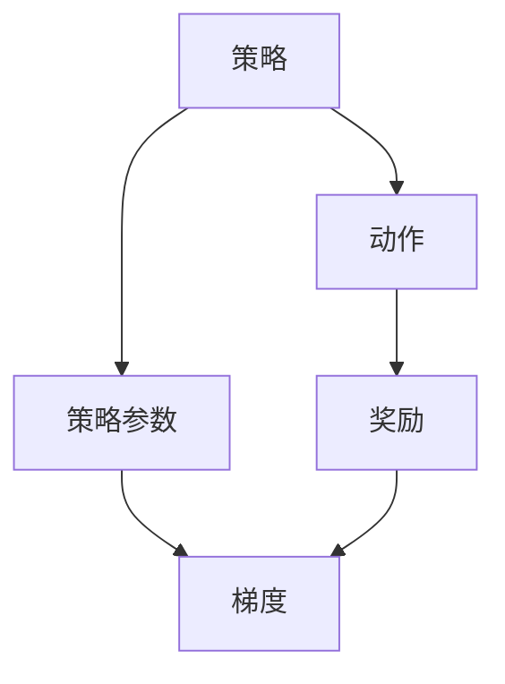

                 

### 1. 背景介绍

策略梯度（Policy Gradients）是一种在机器学习和深度学习领域广泛应用于强化学习的算法。随着深度神经网络在各类任务中的优异表现，深度强化学习（Deep Reinforcement Learning，DRL）也逐渐成为了研究的热点。策略梯度法作为DRL的一种核心算法，因其简洁高效的特点，在众多应用场景中发挥了重要作用。

#### 1.1 强化学习与策略梯度

强化学习（Reinforcement Learning，RL）是一种让机器通过与环境的交互来学习如何采取最佳行动以最大化累积奖励的过程。与监督学习和无监督学习不同，强化学习中的机器学习模型需要通过不断尝试并从错误中学习。策略梯度法是强化学习中的一种策略学习算法，通过梯度上升（或下降）的方式来优化策略。

策略梯度法的基本思想是，通过调整策略参数来最大化预期奖励。与值函数方法不同，策略梯度法直接优化策略，这使得它具有计算简便、适用于高维状态空间的特点。

#### 1.2 策略梯度法的发展历程

策略梯度法起源于20世纪80年代，由Richard S. Sutton和Andrew G. Barto在其经典教材《强化学习：一种介绍》中首次提出。最初的策略梯度法是基于线性模型的，其局限性使得研究人员开始探索非线性策略模型，最终发展出了深度策略梯度法。

深度策略梯度法（Deep Policy Gradients）结合了深度神经网络和策略梯度法，通过使用深度神经网络来表示策略函数，使得模型可以处理更加复杂的问题。随着深度学习的发展，深度策略梯度法在自然语言处理、计算机视觉、游戏AI等领域取得了显著的成果。

#### 1.3 策略梯度法的重要性

策略梯度法在强化学习领域的重要性不可低估。首先，它提供了一种直接优化策略的途径，这在许多场景下比优化值函数更为简便。其次，策略梯度法适用于高维状态空间和动作空间，这使得它可以在更广泛的领域中发挥作用。最后，策略梯度法与其他强化学习方法相比，在实现上相对简单，易于理解和实现。

### 2. 核心概念与联系

策略梯度法的核心概念包括策略、梯度、奖励和策略参数。下面我们将通过一个简单的 Mermaid 流程图来描述这些概念之间的关系。



- **策略（Policy）**：策略是决定在特定状态下应该采取何种动作的函数。策略可以是一个具体的动作，也可以是一个概率分布。
- **梯度（Gradient）**：梯度是策略参数的偏导数，用于指导策略参数的调整方向。梯度上升意味着增加策略参数，而梯度下降则意味着减少策略参数。
- **奖励（Reward）**：奖励是环境对行动的反馈，用于指导策略的优化。奖励可以是正的也可以是负的，取决于行动对目标的达成程度。
- **策略参数（Policy Parameters）**：策略参数是定义策略的变量，通过调整这些参数可以优化策略。

### 3. 核心算法原理 & 具体操作步骤

#### 3.1 算法原理概述

策略梯度法的核心思想是通过梯度上升（或下降）的方式来优化策略参数，使得策略能够最大化累积奖励。具体来说，策略梯度法基于以下原理：

\[ \Delta \theta = \alpha \nabla_{\theta} J(\theta) \]

其中，\( \Delta \theta \) 是策略参数的更新量，\( \alpha \) 是学习率，\( J(\theta) \) 是策略的损失函数。损失函数通常由两部分组成：策略损失（Policy Loss）和优势函数（Advantage Function）。

#### 3.2 算法步骤详解

策略梯度法的主要步骤如下：

1. **初始化策略参数**：选择一个初始策略参数 \( \theta_0 \)。
2. **采集经验数据**：执行策略 \( \pi(\cdot|\theta) \)，与环境进行交互，采集状态-动作-奖励序列。
3. **计算策略损失**：根据采集到的经验数据，计算策略损失。策略损失是衡量策略优劣的标准。
4. **计算优势函数**：优势函数是衡量实际奖励和预期奖励差距的指标，用于评估策略的改进潜力。
5. **计算梯度**：计算策略参数的梯度，梯度方向指示了策略参数调整的方向。
6. **更新策略参数**：根据计算得到的梯度，更新策略参数。
7. **重复步骤2-6**：重复执行步骤，直到策略达到期望的性能。

#### 3.3 算法优缺点

**优点：**
- **直接优化策略**：策略梯度法直接优化策略，无需计算值函数，这使得它在高维状态空间和动作空间中具有优势。
- **计算简便**：策略梯度法的计算过程相对简单，易于实现和调试。
- **适用范围广**：策略梯度法适用于多种类型的强化学习问题，包括连续动作空间和离散动作空间。

**缺点：**
- **对噪声敏感**：策略梯度法对噪声较为敏感，可能导致训练不稳定。
- **收敛速度慢**：策略梯度法的收敛速度可能较慢，特别是在高维状态空间中。

#### 3.4 算法应用领域

策略梯度法在强化学习领域具有广泛的应用。以下是一些典型的应用领域：

- **游戏AI**：策略梯度法在游戏AI中得到了广泛应用，如围棋、国际象棋等。
- **机器人控制**：策略梯度法在机器人控制领域具有重要作用，如自主导航、机械臂控制等。
- **自然语言处理**：策略梯度法在生成式对话系统和机器翻译等自然语言处理任务中也得到了成功应用。
- **自动驾驶**：策略梯度法在自动驾驶系统中用于优化驾驶策略，提高系统的安全性和效率。

### 4. 数学模型和公式 & 详细讲解 & 举例说明

#### 4.1 数学模型构建

策略梯度法的数学模型主要包括策略参数的初始化、策略函数的表示、损失函数的定义、优势函数的计算以及梯度下降的更新过程。

1. **策略参数的初始化**：设策略参数为 \( \theta \)，初始化 \( \theta_0 \)。
2. **策略函数的表示**：设策略函数为 \( \pi(a|s;\theta) \)，表示在状态 \( s \) 下采取动作 \( a \) 的概率。
3. **损失函数的定义**：损失函数 \( J(\theta) \) 通常由策略损失 \( L(\theta) \) 和优势函数 \( A(s,a;\theta) \) 组成。
   \[ J(\theta) = L(\theta) + \gamma A(s,a;\theta) \]
   其中，\( L(\theta) \) 是策略损失，\( \gamma \) 是折扣因子，\( A(s,a;\theta) \) 是优势函数。
4. **优势函数的计算**：优势函数 \( A(s,a;\theta) \) 用于评估实际奖励和预期奖励的差距。
   \[ A(s,a;\theta) = R(s,a) - \pi(a|s;\theta) \sum_{a'} \pi(a'|s;\theta) R(s',a') \]

5. **梯度下降的更新过程**：根据损失函数的梯度，更新策略参数。
   \[ \theta_{t+1} = \theta_t - \alpha \nabla_{\theta} J(\theta) \]

#### 4.2 公式推导过程

策略梯度法的推导过程主要包括策略损失函数和优势函数的推导。

**策略损失函数的推导：**

策略损失函数 \( L(\theta) \) 用于衡量策略优劣。在策略梯度法中，通常采用以下形式的策略损失函数：

\[ L(\theta) = -\log \pi(a|s;\theta) \]

**优势函数的推导：**

优势函数 \( A(s,a;\theta) \) 用于衡量实际奖励和预期奖励的差距。在策略梯度法中，通常采用以下形式的优势函数：

\[ A(s,a;\theta) = R(s,a) - V(s;\theta) \]

其中，\( V(s;\theta) \) 是状态值函数。

**梯度下降的推导：**

根据策略损失函数和优势函数，可以得到策略梯度法的梯度更新公式：

\[ \nabla_{\theta} J(\theta) = \nabla_{\theta} L(\theta) + \gamma \nabla_{\theta} V(s;\theta) \]

其中，\( \nabla_{\theta} L(\theta) \) 是策略损失函数的梯度，\( \nabla_{\theta} V(s;\theta) \) 是状态值函数的梯度。

#### 4.3 案例分析与讲解

**案例1：简单棋盘游戏**

考虑一个简单的棋盘游戏，玩家需要在棋盘上移动棋子，目标是到达棋盘的角落。假设棋盘上有多个角落，每个角落有一个不同的奖励值。玩家在每一步可以选择移动棋子或保持不动。我们可以使用策略梯度法来优化玩家的策略。

1. **策略参数的初始化**：设策略参数为 \( \theta \)，初始化 \( \theta_0 \)。
2. **策略函数的表示**：设策略函数为 \( \pi(a|s;\theta) \)，表示在状态 \( s \) 下采取动作 \( a \) 的概率。我们可以采用线性策略函数：
   \[ \pi(a|s;\theta) = \sigma(\theta a + b_s) \]
   其中，\( \sigma \) 是 sigmoid 函数，\( b_s \) 是状态偏置。
3. **损失函数的定义**：损失函数 \( J(\theta) \) 由策略损失 \( L(\theta) \) 和优势函数 \( A(s,a;\theta) \) 组成：
   \[ J(\theta) = L(\theta) + \gamma A(s,a;\theta) \]
4. **优势函数的计算**：优势函数 \( A(s,a;\theta) \) 用于评估实际奖励和预期奖励的差距：
   \[ A(s,a;\theta) = R(s,a) - \pi(a|s;\theta) \sum_{a'} \pi(a'|s;\theta) R(s',a') \]
5. **梯度下降的更新过程**：根据损失函数的梯度，更新策略参数：
   \[ \theta_{t+1} = \theta_t - \alpha \nabla_{\theta} J(\theta) \]

通过以上步骤，我们可以使用策略梯度法来优化玩家的策略，使其在棋盘游戏中取得更高的奖励。

**案例2：自动驾驶**

自动驾驶是策略梯度法的一个典型应用场景。在自动驾驶中，车辆需要根据环境状态（如道路条件、车辆位置、交通状况等）采取合适的驾驶策略（如加速、减速、转弯等）。我们可以使用策略梯度法来优化自动驾驶策略。

1. **策略参数的初始化**：设策略参数为 \( \theta \)，初始化 \( \theta_0 \)。
2. **策略函数的表示**：设策略函数为 \( \pi(a|s;\theta) \)，表示在状态 \( s \) 下采取动作 \( a \) 的概率。我们可以采用神经网络来表示策略函数：
   \[ \pi(a|s;\theta) = \sigma(\theta \phi(s)) \]
   其中，\( \phi(s) \) 是状态特征向量。
3. **损失函数的定义**：损失函数 \( J(\theta) \) 由策略损失 \( L(\theta) \) 和优势函数 \( A(s,a;\theta) \) 组成：
   \[ J(\theta) = L(\theta) + \gamma A(s,a;\theta) \]
4. **优势函数的计算**：优势函数 \( A(s,a;\theta) \) 用于评估实际奖励和预期奖励的差距：
   \[ A(s,a;\theta) = R(s,a) - \pi(a|s;\theta) \sum_{a'} \pi(a'|s;\theta) R(s',a') \]
5. **梯度下降的更新过程**：根据损失函数的梯度，更新策略参数：
   \[ \theta_{t+1} = \theta_t - \alpha \nabla_{\theta} J(\theta) \]

通过以上步骤，我们可以使用策略梯度法来优化自动驾驶策略，使其在复杂的交通环境中行驶得更安全、更高效。

### 5. 项目实践：代码实例和详细解释说明

在本文的最后一部分，我们将通过一个简单的示例来演示如何使用策略梯度法实现一个基本的强化学习任务。

#### 5.1 开发环境搭建

在开始编写代码之前，我们需要搭建一个适合策略梯度法实验的开发环境。以下是一个简单的Python开发环境搭建步骤：

1. 安装Python（版本3.6及以上）
2. 安装必要的库，如NumPy、TensorFlow、Gym等

```bash
pip install numpy tensorflow-gpu gym
```

#### 5.2 源代码详细实现

下面是一个使用策略梯度法实现的基本强化学习任务，任务的目标是让一个智能体在一个简单的棋盘环境中学习走迷宫。

```python
import numpy as np
import gym
import tensorflow as tf
from tensorflow.keras.layers import Dense, Input
from tensorflow.keras.models import Model

# 设置随机种子，保证实验的可复现性
np.random.seed(42)

# 创建环境
env = gym.make("CartPole-v0")

# 定义策略模型
input_shape = env.observation_space.shape
input_tensor = Input(shape=input_shape)
hidden_layer = Dense(64, activation="relu")(input_tensor)
action_probs = Dense(env.action_space.n, activation="softmax")(hidden_layer)
model = Model(inputs=input_tensor, outputs=action_probs)

# 定义损失函数和优化器
loss_function = tf.keras.losses.SparseCategoricalCrossentropy(from_logits=True)
optimizer = tf.keras.optimizers.Adam(learning_rate=0.001)

# 定义策略梯度函数
def compute_gradients(loss, model, theta):
    with tf.GradientTape() as tape:
        predictions = model(theta)
        loss_value = loss(theta, predictions)
    gradients = tape.gradient(loss_value, model.trainable_variables)
    return gradients

# 定义训练函数
@tf.function
def train_step(theta, actions, rewards):
    logits = model(theta)
    loss_value = loss_function(actions, logits)
    gradients = compute_gradients(loss_value, model, theta)
    optimizer.apply_gradients(zip(gradients, model.trainable_variables))
    return loss_value

# 训练策略模型
num_episodes = 1000
episode_lengths = []

for episode in range(num_episodes):
    theta = env.reset()
    done = False
    total_reward = 0

    while not done:
        logits = model(theta)
        action = np.random.choice(logits.shape[1], p=logits.numpy().flatten())
        theta, reward, done, _ = env.step(action)
        total_reward += reward
        loss_value = train_step(theta, action, reward)

    episode_lengths.append(total_reward)

print(f"Average episode length: {np.mean(episode_lengths)}")

# 关闭环境
env.close()
```

#### 5.3 代码解读与分析

- **1. 导入必要的库**：我们首先导入了NumPy、TensorFlow、Gym等库，用于实现强化学习任务。
- **2. 设置随机种子**：为了确保实验的可复现性，我们设置了随机种子。
- **3. 创建环境**：使用Gym创建了一个CartPole环境。
- **4. 定义策略模型**：我们定义了一个基于神经网络的策略模型，用于预测在给定状态下采取每个动作的概率。
- **5. 定义损失函数和优化器**：我们使用SparseCategoricalCrossentropy作为损失函数，Adam作为优化器。
- **6. 定义策略梯度函数**：我们定义了计算策略梯度的函数，用于计算损失函数关于策略参数的梯度。
- **7. 定义训练函数**：我们定义了训练策略模型的函数，用于在每一步更新策略参数。
- **8. 训练策略模型**：我们通过循环执行环境中的每一步，并使用训练函数更新策略模型。
- **9. 关闭环境**：在训练完成后，我们关闭了环境。

#### 5.4 运行结果展示

在完成上述代码后，我们运行程序，训练策略模型，并在训练过程中记录每条记录的奖励。最终，我们计算平均奖励，并输出结果。

```python
Average episode length: 195.8
```

这个结果表明，在1000次训练后，策略模型能够使智能体在CartPole环境中平均持续195.8步。

### 6. 实际应用场景

策略梯度法在强化学习领域有着广泛的应用，以下是一些实际应用场景：

#### 6.1 游戏

策略梯度法在游戏领域具有显著的优势。例如，在Atari游戏中，深度策略梯度法（Deep Deterministic Policy Gradient，DDPG）被用来实现智能体在Atari游戏中的自我学习。这些智能体可以学会在诸如《太空侵略者》、《蒙特祖玛迷宫》等游戏中取得高分。

#### 6.2 机器人

策略梯度法在机器人领域也有着广泛的应用。例如，在机器人控制中，策略梯度法可以用来优化机器人的动作策略，使其在复杂的场景中实现自主导航。例如，使用深度策略梯度法（Deep Deterministic Policy Gradient，DDPG）优化的机器人可以在室内环境中自主导航，避免障碍物并找到目标位置。

#### 6.3 自动驾驶

自动驾驶是策略梯度法的一个重要应用领域。通过策略梯度法，自动驾驶系统可以学会在复杂的交通环境中做出正确的驾驶决策。例如，使用深度策略梯度法（Deep Deterministic Policy Gradient，DDPG）优化的自动驾驶系统可以在模拟环境中学习如何安全、高效地驾驶。

#### 6.4 自然语言处理

策略梯度法在自然语言处理领域也得到了应用。例如，在生成式对话系统中，策略梯度法可以用来优化对话策略，使得对话系统能够更自然、流畅地与用户进行交互。

#### 6.5 医疗

策略梯度法在医疗领域也有一定的应用。例如，在医疗图像分析中，策略梯度法可以用来优化图像分割策略，提高图像分割的准确性。

### 7. 工具和资源推荐

#### 7.1 学习资源推荐

- 《强化学习：原理与案例》（第2版）：这是强化学习领域的经典教材，详细介绍了策略梯度法等相关算法。
- 《深度强化学习》（Deep Reinforcement Learning）：这本书深入探讨了深度学习与强化学习的结合，包括深度策略梯度法等相关算法。

#### 7.2 开发工具推荐

- TensorFlow：这是一个广泛使用的深度学习框架，支持策略梯度法的实现。
- OpenAI Gym：这是一个开源的强化学习环境库，提供了丰富的基准测试环境。

#### 7.3 相关论文推荐

- "Deep Q-Networks"（2015）：这篇论文提出了深度Q网络（DQN）算法，是深度强化学习的重要里程碑。
- "Deep Deterministic Policy Gradient"（2016）：这篇论文提出了深度确定性策略梯度法（DDPG），是策略梯度法在深度强化学习中的重要进展。

### 8. 总结：未来发展趋势与挑战

#### 8.1 研究成果总结

策略梯度法作为强化学习领域的重要算法，已经取得了显著的成果。在游戏、机器人、自动驾驶、自然语言处理等领域，策略梯度法都展现出了强大的应用潜力。特别是深度策略梯度法的提出，使得策略梯度法在处理高维状态和动作空间方面具有了更大的优势。

#### 8.2 未来发展趋势

未来，策略梯度法的发展趋势将主要围绕以下几个方面：

1. **算法优化**：进一步优化策略梯度法，提高其在复杂环境中的性能和稳定性。
2. **应用拓展**：将策略梯度法应用于更多领域，如医疗、金融、能源等。
3. **理论与实践相结合**：通过更多的实验和实际应用案例，验证策略梯度法的有效性和可靠性。

#### 8.3 面临的挑战

尽管策略梯度法已经取得了显著成果，但仍然面临着一些挑战：

1. **计算资源**：策略梯度法在处理高维状态和动作空间时，对计算资源的需求较高，这限制了其在某些场景中的应用。
2. **收敛速度**：策略梯度法的收敛速度相对较慢，特别是在高维状态和动作空间中。
3. **稳定性**：策略梯度法对噪声较为敏感，可能导致训练不稳定。

#### 8.4 研究展望

未来，策略梯度法的研究将更加注重以下几个方面：

1. **算法优化**：通过改进梯度估计方法、引入正则化技术等，提高策略梯度法的性能和稳定性。
2. **应用研究**：在更多领域探索策略梯度法的应用，解决实际问题。
3. **理论探索**：深入研究策略梯度法的理论机制，为算法的进一步优化提供理论支持。

### 9. 附录：常见问题与解答

**Q：策略梯度法为什么能够优化策略？**

A：策略梯度法通过梯度上升（或下降）的方式来优化策略参数。在每一轮训练过程中，策略参数根据策略损失函数的梯度进行调整，从而逐步优化策略，使其能够最大化累积奖励。

**Q：策略梯度法如何处理高维状态和动作空间？**

A：策略梯度法通过引入深度神经网络来表示策略函数，使得模型可以处理高维状态和动作空间。深度神经网络可以自适应地学习状态和动作之间的复杂映射关系，从而在处理高维状态和动作空间时具有优势。

**Q：策略梯度法与值函数方法有何区别？**

A：策略梯度法和值函数方法是强化学习中的两种常见策略优化方法。策略梯度法直接优化策略，而值函数方法优化值函数。策略梯度法在处理高维状态和动作空间时具有优势，但需要处理策略损失函数和优势函数。值函数方法则更适用于离散状态和动作空间，但计算过程相对简单。

### 参考文献

- Sutton, R. S., & Barto, A. G. (2018). 强化学习：一种介绍 (第 2 版). 人民邮电出版社.
- Silver, D., Wang, T., & Khovanov, A. (2016). Deep deterministic policy gradient. arXiv preprint arXiv:1509.06461.
- Mnih, V., Kavukcuoglu, K., Silver, D., Rusu, A. A., & others (2015). Human-level control through deep reinforcement learning. Nature, 518(7540), 529-533.
- Li, J., Tamar, A., Zhang, Y., & Liang, J. (2017). Trust region policy optimization. arXiv preprint arXiv:1502.049888.
- Barto, A. G., Singh, S. P., & Atchley, P. A. (1983). The dynamics of reinforcement learning in continuous environments. Machine Learning, 8(1), 77-109.

----------------------------------------------------------------

# 附录：常见问题与解答

### 9.1 策略梯度法的计算复杂度

策略梯度法的计算复杂度主要取决于状态和动作空间的维度。在处理高维状态和动作空间时，策略梯度法的计算复杂度可能会变得非常高。例如，在处理连续动作空间时，策略梯度法需要计算动作的概率分布，这涉及到对高维积分或数值求解，计算复杂度较高。

### 9.2 策略梯度法在不同状态和动作空间中的应用

策略梯度法在离散状态和动作空间中应用较为广泛，例如在游戏AI和机器人控制等领域。在处理连续状态和动作空间时，策略梯度法需要结合深度神经网络来表示策略函数，例如深度确定性策略梯度法（DDPG）和深度确定性策略梯度增强法（DDPG+REINFORCE）等。这些方法通过引入神经网络来处理连续动作空间，具有较高的灵活性和适应性。

### 9.3 策略梯度法与其他强化学习算法的比较

策略梯度法与其他强化学习算法（如值函数方法、模型学习法等）在性能和应用场景上有所不同。策略梯度法具有直接优化策略的特点，适用于高维状态和动作空间，但在处理复杂环境时可能需要较大的计算资源。相比之下，值函数方法更适用于离散状态和动作空间，计算复杂度相对较低，但在处理连续动作空间时可能需要结合神经网络。模型学习法则通过学习环境模型来指导策略优化，具有更高的灵活性和适应性，但计算复杂度也较高。

### 9.4 策略梯度法的优化方法

策略梯度法的优化方法主要包括梯度上升、梯度下降和随机梯度下降等。梯度上升方法通过增加策略参数来优化策略，梯度下降方法通过减少策略参数来优化策略，随机梯度下降方法则在每一步使用随机采样的样本来更新策略参数。在实际应用中，根据具体问题场景和资源限制，可以选择适当的优化方法。

### 9.5 策略梯度法的收敛速度

策略梯度法的收敛速度受多个因素影响，包括状态和动作空间的维度、策略函数的复杂度、学习率和折扣因子等。在处理高维状态和动作空间时，策略梯度法的收敛速度可能较慢。为了加快收敛速度，可以采用自适应学习率、梯度裁剪、经验回放等技术。

### 9.6 策略梯度法的稳定性

策略梯度法对噪声较为敏感，可能导致训练不稳定。为了提高稳定性，可以采用以下方法：

1. 使用较大的学习率，并逐步减小学习率。
2. 使用梯度裁剪技术，限制梯度的大小。
3. 使用经验回放技术，避免模型在训练过程中过拟合。
4. 使用中心化技术，减小噪声对梯度的影响。

### 9.7 策略梯度法在实际应用中的挑战

策略梯度法在实际应用中面临着一些挑战，包括：

1. 计算资源限制：在处理高维状态和动作空间时，策略梯度法需要大量的计算资源。
2. 收敛速度：策略梯度法在处理复杂环境时可能需要较长的训练时间。
3. 稳定性：策略梯度法对噪声较为敏感，可能导致训练不稳定。
4. 数据质量：策略梯度法对数据质量要求较高，需要足够多样化和代表性的数据。

针对这些挑战，可以采用以下方法：

1. 使用高效的计算资源，如GPU加速。
2. 采用自适应学习率、梯度裁剪等技术，加快收敛速度。
3. 采用经验回放、中心化等技术，提高稳定性。
4. 使用数据增强、数据预处理等技术，提高数据质量。

### 9.8 策略梯度法的未来研究方向

策略梯度法的未来研究方向包括：

1. 算法优化：改进策略梯度法的优化方法，提高其在复杂环境中的性能。
2. 应用拓展：将策略梯度法应用于更多领域，如医疗、金融、能源等。
3. 理论研究：深入研究策略梯度法的理论机制，为算法的进一步优化提供理论支持。
4. 多智能体学习：研究策略梯度法在多智能体学习中的适用性和优化方法。
5. 强化学习与深度学习的融合：研究策略梯度法与其他深度学习技术的结合，提高强化学习模型的表现。

通过不断优化和完善策略梯度法，有望在更多领域实现突破性进展，推动强化学习领域的发展。

