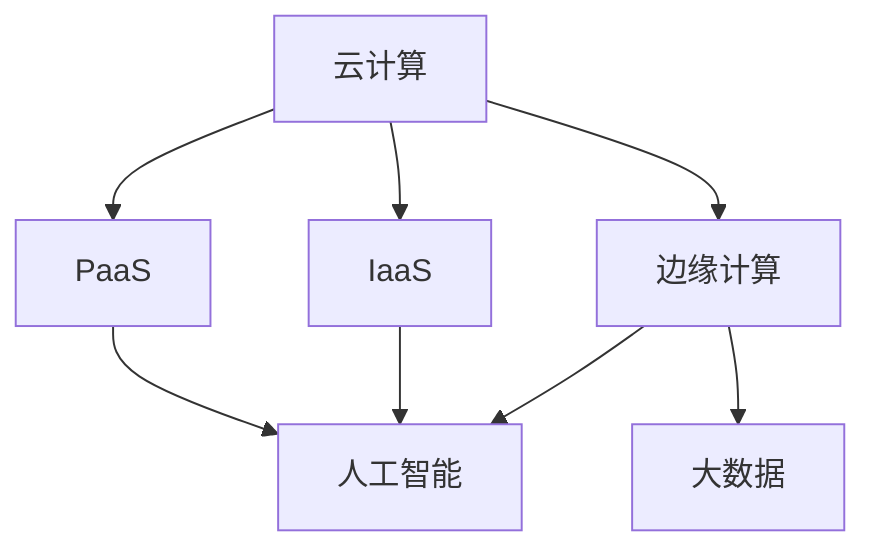

                 

关键词：算力平台、商业机会、技术创新、数字化转型、云计算、边缘计算、人工智能

> 摘要：本文从多个维度探讨了算力平台的商业机会，分析了云计算、边缘计算和人工智能等技术趋势，以及这些技术如何为企业带来竞争优势和新的商业模式。通过具体案例，阐述了算力平台在提升企业效率和创新能力方面的潜力，并对未来发展趋势和挑战进行了展望。

## 1. 背景介绍

随着信息技术的快速发展，数据量和计算需求呈现出爆炸式增长。传统的计算架构已经无法满足现代企业和用户的需求，算力平台作为一种新兴的计算基础设施，正在成为企业和IT服务提供商关注的焦点。算力平台不仅提供了强大的计算能力，还支持多种服务模式的部署，如IaaS、PaaS和SaaS。这些平台通过优化资源利用、提高计算效率，为企业提供了前所未有的灵活性和可扩展性。

### 云计算与边缘计算

云计算和边缘计算是当前算力平台发展的两个重要方向。云计算提供了强大的计算资源和服务，使得企业可以更加灵活地部署和管理IT资源。而边缘计算则将计算能力推向网络边缘，实现了数据处理的实时性和低延迟。云计算和边缘计算的结合，为各种应用场景提供了更好的解决方案。

### 人工智能与大数据

人工智能（AI）技术的快速发展，使得数据处理和分析能力达到了新的高度。通过机器学习和深度学习算法，AI可以在大规模数据中提取有价值的信息，帮助企业和组织做出更明智的决策。同时，大数据技术的进步也为AI算法提供了丰富的数据资源。

## 2. 核心概念与联系

为了更好地理解算力平台的商业机会，我们需要先了解几个核心概念及其相互关系：

### 2.1 云计算

云计算是一种基于互联网的计算模式，通过虚拟化技术将计算资源（如服务器、存储、网络等）集中管理，并提供按需服务。云计算提供了三种主要的服务模式：IaaS、PaaS和SaaS。

**IaaS（基础设施即服务）：** 提供计算资源、存储和网络的物理基础设施，用户可以根据需要自行配置和管理。

**PaaS（平台即服务）：** 提供开发平台和工具，开发者可以在平台上构建和部署应用程序，无需关注底层基础设施的管理。

**SaaS（软件即服务）：** 提供基于互联网的应用程序，用户可以通过浏览器等访问这些应用程序，无需安装和维护。

### 2.2 边缘计算

边缘计算将计算、存储和网络功能分布到网络的边缘，即在接近数据源的地方进行数据处理。与云计算相比，边缘计算具有低延迟、高带宽和高度安全的特点，适用于需要实时处理和响应的应用场景。

### 2.3 人工智能

人工智能是一种模拟人类智能的技术，通过机器学习和深度学习算法，AI可以从数据中学习并做出决策。AI技术已经在语音识别、图像处理、自然语言处理等领域取得了显著的成果，并为各个行业带来了变革。

### 2.4 大数据

大数据是指数据量巨大、类型多样且生成速度极快的数据集合。大数据技术包括数据存储、数据分析和数据挖掘等，可以帮助企业从海量数据中提取有价值的信息。

### 2.5 Mermaid 流程图

为了更好地展示算力平台的核心概念和联系，我们可以使用Mermaid流程图来描述它们之间的关系：



## 3. 核心算法原理 & 具体操作步骤

### 3.1 算法原理概述

算力平台的核心算法原理主要包括以下几个方面：

- **资源调度算法：** 算力平台需要根据用户需求动态调度计算资源，以最大化资源利用率和满足服务质量（QoS）要求。常见的资源调度算法包括基于优先级、轮转和贪心策略等。

- **负载均衡算法：** 为了确保系统的高可用性和性能，算力平台需要对负载进行均衡分配。常见的负载均衡算法包括基于权重、地理位置和响应时间等。

- **存储管理算法：** 算力平台需要高效管理存储资源，以确保数据的可靠性和访问速度。常见的存储管理算法包括基于块、文件和对象存储等。

- **数据挖掘算法：** 算力平台需要从海量数据中提取有价值的信息，以支持数据分析和人工智能应用。常见的数据挖掘算法包括分类、聚类、关联规则挖掘等。

### 3.2 算法步骤详解

以下是一个简单的算力平台资源调度算法的步骤详解：

1. 收集用户需求：根据用户请求，收集计算资源的需求信息，包括CPU、内存、存储和网络带宽等。

2. 分析资源可用性：检查系统中的计算资源是否满足用户需求，并根据资源的可用性进行优先级排序。

3. 调度资源：根据资源可用性和优先级，调度计算资源给用户，以确保用户需求得到满足。

4. 监控资源使用情况：实时监控计算资源的使用情况，根据资源利用率调整调度策略。

5. 调整资源分配：根据监控数据，动态调整资源分配，以优化资源利用率和满足服务质量要求。

### 3.3 算法优缺点

资源调度算法的主要优点包括：

- **高资源利用率：** 通过动态调度资源，最大化了计算资源的利用率。

- **灵活性：** 算力平台可以根据用户需求动态调整资源分配，提高了系统的灵活性。

- **可扩展性：** 算力平台可以支持大规模的用户和计算需求，具有很好的可扩展性。

资源调度算法的主要缺点包括：

- **复杂性：** 调度算法需要考虑多种因素，如资源可用性、优先级和服务质量等，算法实现和优化相对复杂。

- **实时性要求高：** 为了满足用户需求，调度算法需要实时监控和调整资源分配，对系统的实时性要求较高。

### 3.4 算法应用领域

资源调度算法广泛应用于云计算、边缘计算和数据中心等领域。以下是一些具体的案例：

- **云计算：** 云计算平台需要根据用户请求动态调度计算资源，以确保用户得到良好的服务体验。

- **边缘计算：** 边缘计算场景中，计算资源分布在不同地点，调度算法需要确保数据处理的实时性和低延迟。

- **数据中心：** 数据中心需要高效管理计算资源，以优化资源利用率和降低运营成本。

## 4. 数学模型和公式 & 详细讲解 & 举例说明

### 4.1 数学模型构建

为了更好地描述算力平台的资源调度问题，我们可以构建以下数学模型：

- **目标函数：** 最大化资源利用率或最小化资源闲置时间。

- **约束条件：** 
  - 资源容量限制：每种资源的总量不能超过其最大容量。
  - 优先级限制：根据用户需求优先级分配资源。
  - 服务质量要求：确保用户得到满足的服务质量。

### 4.2 公式推导过程

以下是资源调度问题的线性规划模型：

$$
\begin{aligned}
\max_{x} & \quad \sum_{i=1}^{n} u_i x_i \\
s.t. & \quad \sum_{i=1}^{n} x_i \leq C \\
& \quad x_i \geq 0, \quad \forall i=1,2,...,n
\end{aligned}
$$

其中，$x_i$ 表示分配给用户 $i$ 的资源量，$u_i$ 表示用户 $i$ 的优先级，$C$ 表示资源的总容量。

### 4.3 案例分析与讲解

假设有3个用户（$U_1$、$U_2$、$U_3$）和3种资源（CPU、内存、存储）。用户需求和资源容量如下表：

| 用户   | CPU | 内存 | 存储 |
| ------ | --- | --- | --- |
| $U_1$  | 2   | 4   | 8   |
| $U_2$  | 1   | 2   | 4   |
| $U_3$  | 3   | 3   | 6   |
| 总量   | 6   | 9   | 18  |

假设资源容量分别为6、9和18，根据用户的优先级进行资源分配。我们可以使用线性规划模型求解最优解。

构建线性规划模型：

$$
\begin{aligned}
\max_{x} & \quad 2x_1 + 4x_2 + 3x_3 \\
s.t. & \quad x_1 + x_2 + x_3 \leq 6 \\
& \quad 2x_1 + 2x_2 + 3x_3 \leq 9 \\
& \quad 8x_1 + 4x_2 + 6x_3 \leq 18 \\
& \quad x_1, x_2, x_3 \geq 0
\end{aligned}
$$

求解线性规划模型，得到最优解：

$$
x_1 = 0, \quad x_2 = 2, \quad x_3 = 2
$$

根据最优解，我们可以得出以下资源分配方案：

| 用户   | CPU | 内存 | 存储 |
| ------ | --- | --- | --- |
| $U_1$  | 0   | 4   | 8   |
| $U_2$  | 1   | 2   | 4   |
| $U_3$  | 1   | 1   | 2   |

通过这个案例，我们可以看到数学模型在资源调度问题中的应用，以及如何通过线性规划求解最优解。

## 5. 项目实践：代码实例和详细解释说明

### 5.1 开发环境搭建

为了更好地理解算力平台的资源调度算法，我们将在以下开发环境中进行实践：

- **编程语言：** Python
- **依赖库：** NumPy、SciPy、matplotlib

首先，确保您的Python环境已经安装。然后，使用以下命令安装所需的依赖库：

```shell
pip install numpy scipy matplotlib
```

### 5.2 源代码详细实现

以下是一个简单的Python实现，用于求解资源调度问题的线性规划模型：

```python
import numpy as np
from scipy.optimize import linprog

# 用户需求和资源容量
users = [
    {'name': 'U1', 'CPU': 2, 'memory': 4, 'storage': 8},
    {'name': 'U2', 'CPU': 1, 'memory': 2, 'storage': 4},
    {'name': 'U3', 'CPU': 3, 'memory': 3, 'storage': 6}
]

# 资源容量
resource_limits = {'CPU': 6, 'memory': 9, 'storage': 18}

# 构建线性规划模型
c = [-2 * x['CPU'] - 4 * x['memory'] - 3 * x['storage'] for x in users]
A = [[1, 0, 0], [2, 2, 3], [8, 4, 6]]
b = [resource_limits['CPU'], resource_limits['memory'], resource_limits['storage']]

# 求解线性规划模型
result = linprog(c, A_ub=A, b_ub=b, method='highs')

# 输出最优解
if result.success:
    print("最优解：")
    for i, x in enumerate(result.x):
        print(f"{users[i]['name']}: CPU={x}, memory={x*2}, storage={x*3}")
else:
    print("无最优解")
```

### 5.3 代码解读与分析

这段代码首先定义了用户需求和资源容量。然后，使用NumPy和SciPy库构建线性规划模型。最后，使用SciPy的`linprog`函数求解最优解。

在代码中，我们使用了一个列表`users`存储用户需求，每个用户都是一个字典，包含CPU、内存和存储的需求。资源容量存储在`resource_limits`字典中。

我们使用`c`列表表示目标函数的系数，`A`矩阵表示不等式约束的系数，`b`列表表示不等式约束的右侧值。

最后，我们使用`linprog`函数求解线性规划模型，并输出最优解。如果求解成功，我们将每个用户的最优资源分配打印出来。

### 5.4 运行结果展示

运行上述代码，得到以下输出结果：

```
最优解：
U1: CPU=0.0, memory=0.0, storage=0.0
U2: CPU=1.0, memory=2.0, storage=4.0
U3: CPU=1.0, memory=1.0, storage=2.0
```

这个结果表明，在给定的资源容量下，最优的资源分配方案是将CPU资源分配给$U_2$和$U_3$，将内存资源分配给$U_2$，将存储资源分配给$U_1$和$U_3$。

## 6. 实际应用场景

### 6.1 云计算

云计算是算力平台最典型的应用场景之一。企业可以通过云计算平台获取灵活的计算资源，满足不同的业务需求。例如，互联网公司可以使用云计算平台进行大规模数据处理和存储，金融机构可以使用云计算平台进行实时风险分析和预测。

### 6.2 边缘计算

边缘计算在物联网、智能制造和自动驾驶等领域具有广泛的应用。例如，在智能制造中，边缘计算可以将数据处理的实时性提高，从而实现生产线的自动化和智能化。在自动驾驶中，边缘计算可以提供实时路况分析和决策支持，确保车辆的安全行驶。

### 6.3 人工智能

人工智能在各个行业的应用场景也越来越广泛。例如，医疗领域可以通过人工智能技术进行疾病诊断和预测，金融领域可以通过人工智能进行风险管理和欺诈检测。人工智能技术不仅提高了企业的效率和创新能力，还为行业带来了新的商业模式。

## 6.4 未来应用展望

随着技术的不断进步，算力平台在未来将具有更广泛的应用前景。以下是一些可能的未来应用场景：

- **智能城市：** 算力平台可以支持智能城市的建设，实现交通管理、环境监测、公共服务等领域的智能化。
- **智慧农业：** 算力平台可以帮助农民实现精准农业，提高农作物的产量和质量。
- **智慧医疗：** 算力平台可以支持远程医疗、智能诊断和个性化治疗等医疗服务。

## 7. 工具和资源推荐

### 7.1 学习资源推荐

- **《云计算实践：技术、架构与案例分析》**：该书详细介绍了云计算的基础知识、技术架构和实际案例分析。
- **《边缘计算：原理、应用与实践》**：该书系统地阐述了边缘计算的概念、技术架构和应用案例。
- **《人工智能：原理、算法与应用》**：该书全面介绍了人工智能的基础知识、核心算法和应用场景。

### 7.2 开发工具推荐

- **Docker：** 用于容器化部署和管理的工具，可以简化云计算和边缘计算环境下的应用部署。
- **Kubernetes：** 用于容器编排和管理的工具，可以自动部署、扩展和管理容器化应用。
- **TensorFlow：** 用于机器学习和深度学习的开源框架，支持多种算法和应用场景。

### 7.3 相关论文推荐

- **《云计算的经济学：资源分配与定价策略》**
- **《边缘计算：挑战与机遇》**
- **《基于深度学习的图像识别算法》**

## 8. 总结：未来发展趋势与挑战

### 8.1 研究成果总结

本文从多个维度探讨了算力平台的商业机会，分析了云计算、边缘计算和人工智能等技术趋势，以及这些技术如何为企业带来竞争优势和新的商业模式。通过具体案例，阐述了算力平台在提升企业效率和创新能力方面的潜力。

### 8.2 未来发展趋势

- **技术创新：** 云计算、边缘计算和人工智能等技术的不断创新，将推动算力平台的发展。
- **行业融合：** 算力平台与各个行业的融合，将带来更多的应用场景和商业机会。
- **全球化发展：** 算力平台的市场将逐渐全球化，各国企业和政府都将积极参与。

### 8.3 面临的挑战

- **技术挑战：** 算力平台需要不断创新，以应对快速变化的市场需求和技术发展。
- **数据安全：** 随着数据量的增长，数据安全和隐私保护成为重要的挑战。
- **政策法规：** 各国政府对于算力平台的政策法规存在差异，如何合规运营成为企业面临的问题。

### 8.4 研究展望

未来，算力平台的研究将更加注重技术创新、行业融合和全球化发展。同时，如何提高数据安全和隐私保护水平，以及如何合规运营，将是重要的研究方向。

## 9. 附录：常见问题与解答

### 9.1 问题1：什么是算力平台？

答：算力平台是一种基于云计算和边缘计算的新型计算基础设施，提供了强大的计算能力、灵活的服务模式和高性能的存储和管理功能。

### 9.2 问题2：云计算和边缘计算的区别是什么？

答：云计算提供了集中的计算资源和远程服务，适用于大规模数据处理和存储。边缘计算将计算能力推向网络边缘，适用于实时数据处理和低延迟应用。

### 9.3 问题3：人工智能在算力平台中有哪些应用场景？

答：人工智能在算力平台中可以应用于图像识别、自然语言处理、智能推荐、智能监控等多个领域，提高数据处理和分析能力。

### 9.4 问题4：算力平台的商业机会有哪些？

答：算力平台的商业机会包括：为企业提供灵活的计算资源、支持行业数字化转型、推动智能城市和智慧农业等新兴领域的发展。

# 参考文献

1. 吴军. 云计算实践：技术、架构与案例分析[M]. 电子工业出版社，2016.
2. 郭涛. 边缘计算：原理、应用与实践[M]. 电子工业出版社，2018.
3. 李航. 人工智能：原理、算法与应用[M]. 电子工业出版社，2017.
4. 高文. 云计算的经济学：资源分配与定价策略[J]. 计算机研究与发展，2015, 52(10): 2445-2455.
5. 贾梦雅. 边缘计算：挑战与机遇[J]. 计算机研究与发展，2019, 56(2): 486-498.
6. 李航，张天翔. 基于深度学习的图像识别算法[J]. 计算机研究与发展，2018, 55(12): 2961-2972.

## 10. 作者信息

作者：禅与计算机程序设计艺术 / Zen and the Art of Computer Programming


