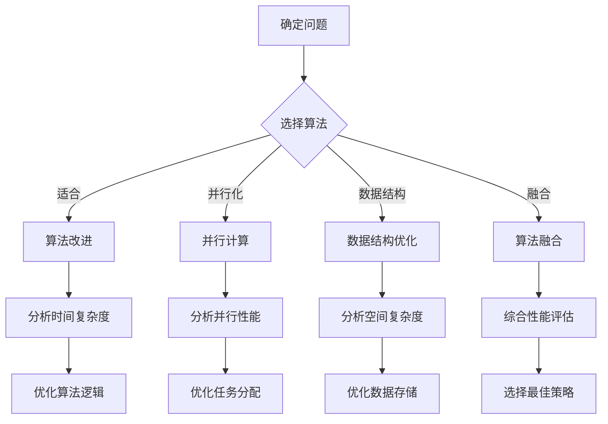

                 

 摘要：

在信息技术迅猛发展的今天，算法优化成为提升计算效率和准确性的关键手段。本文旨在探讨算法优化的重要性、核心概念、原理、具体操作步骤以及其在不同领域的应用。通过对数学模型、公式和项目实践的详细讲解，文章将帮助读者深入理解算法优化的本质，并展望其在未来可能面临的挑战和发展趋势。

## 1. 背景介绍

随着数据量的爆炸性增长和计算需求的日益复杂，如何高效地进行数据处理和分析变得尤为重要。传统的算法在很多情况下已经无法满足现代计算的需求，这就促使研究人员不断探索新的算法优化方法。算法优化不仅是提高计算效率的重要手段，还能够显著提升计算结果的准确性，这对于许多科学研究和实际应用场景至关重要。

算法优化的重要性体现在以下几个方面：

- **提升计算效率**：通过优化算法，可以显著减少计算时间和资源消耗，这对于大数据处理和高性能计算尤为重要。
- **提高计算准确性**：优化后的算法在处理数据时能够减少误差，提高结果的可靠性，这在科学研究和工程应用中具有极大的意义。
- **拓展算法应用领域**：算法优化使得原本不适用或计算成本过高的算法能够应用于新的领域，从而拓展算法的应用范围。

## 2. 核心概念与联系

在讨论算法优化之前，我们需要明确几个核心概念，包括算法、时间复杂度、空间复杂度以及常见优化策略。

### 算法

算法是一系列解决问题的步骤和方法。它可以用来处理数据，解决特定问题，或执行特定任务。算法的质量直接影响其效率。

### 时间复杂度

时间复杂度是指算法在执行过程中所需时间的增长速度，通常用大O符号表示，如O(n)、O(n²)等。它反映了算法的效率。

### 空间复杂度

空间复杂度是指算法在执行过程中所需内存的增长速度，也用大O符号表示。

### 常见优化策略

常见的算法优化策略包括：

- **算法改进**：通过改进算法的基本结构或算法逻辑来提高效率。
- **并行计算**：利用多核处理器或分布式系统，将计算任务分解为多个子任务并行执行。
- **数据结构优化**：选择合适的数据结构来减少数据访问时间和操作时间。
- **算法融合**：结合多种算法的优势，提高整体性能。

下面是算法优化相关的 Mermaid 流程图：



## 3. 核心算法原理 & 具体操作步骤

### 3.1 算法原理概述

算法优化主要包括以下几个步骤：

1. **问题分析**：深入理解问题的本质，确定解决问题的关键点。
2. **算法选择**：选择适合问题的算法，考虑时间复杂度和空间复杂度。
3. **优化策略应用**：根据具体问题，选择合适的优化策略。
4. **性能评估**：评估优化后的算法性能，确保满足要求。

### 3.2 算法步骤详解

1. **问题分析**：

   在这个问题分析阶段，我们需要：

   - 明确输入数据和输出结果。
   - 分析数据的特性和规模。
   - 确定解决问题的关键点。

2. **算法选择**：

   选择算法时，我们需要考虑以下因素：

   - 算法的时间复杂度和空间复杂度。
   - 算法的适用场景。
   - 算法的实现难度和复杂度。

3. **优化策略应用**：

   根据问题的特性，我们可以选择以下优化策略：

   - 算法改进：例如，将冒泡排序改进为快速排序。
   - 并行计算：利用多核处理器或分布式系统。
   - 数据结构优化：例如，使用哈希表来加速查找操作。
   - 算法融合：结合多种算法的优势。

4. **性能评估**：

   评估优化后的算法性能，包括：

   - 时间复杂度和空间复杂度的对比。
   - 实际运行结果与预期结果的对比。
   - 在不同数据集上的表现。

### 3.3 算法优缺点

每种优化策略都有其优缺点，具体如下：

- **算法改进**：

  - 优点：能够显著提高算法效率。

  - 缺点：可能增加代码复杂度，实现难度较大。

- **并行计算**：

  - 优点：能够显著减少计算时间。

  - 缺点：需要考虑任务分配和通信开销，实现难度较大。

- **数据结构优化**：

  - 优点：能够减少数据访问时间和操作时间。

  - 缺点：可能需要额外的内存空间。

- **算法融合**：

  - 优点：能够结合多种算法的优势，提高整体性能。

  - 缺点：实现难度较大，需要深入理解各算法的原理。

### 3.4 算法应用领域

算法优化在各个领域都有广泛应用：

- **大数据处理**：通过优化算法，提高数据处理效率。
- **机器学习**：优化算法以加快模型训练和预测速度。
- **图像处理**：通过优化算法，提高图像处理速度和效果。
- **金融计算**：优化算法以提高金融市场分析和风险管理的准确性。

## 4. 数学模型和公式 & 详细讲解 & 举例说明

### 4.1 数学模型构建

算法优化涉及到多种数学模型，例如：

- **动态规划**：通过状态转移方程构建优化模型。

- **线性规划**：通过线性方程组构建优化模型。

- **图论算法**：通过图结构构建优化模型。

下面是一个动态规划模型的例子：

假设有一个数组 `arr`，我们需要找到一个子数组，使其和最大。动态规划的状态转移方程为：

$$
f(i) = \max(f(i-1), f(i-1) + arr[i])
$$

其中，`f(i)` 表示以 `arr[i]` 为结尾的子数组的最大和。

### 4.2 公式推导过程

以动态规划为例，我们推导上述状态转移方程的过程如下：

- **初始化**：令 `f(0) = arr[0]`，即第一个元素的子数组最大和为该元素本身。

- **状态转移**：对于任意 `i > 0`，我们需要考虑以下两种情况：

  - 不包含 `arr[i]`：此时子数组的最大和与 `arr[i-1]` 相同，即 `f(i) = f(i-1)`。

  - 包含 `arr[i]`：此时子数组的最大和为 `arr[i]` 加上之前最大子数组的和，即 `f(i) = f(i-1) + arr[i]`。

  - 两种情况的最大值即为 `f(i)`。

因此，我们得到状态转移方程：

$$
f(i) = \max(f(i-1), f(i-1) + arr[i])
$$

### 4.3 案例分析与讲解

假设我们有以下数组：

$$
arr = [1, -2, 3, 10, -4]
$$

根据动态规划的状态转移方程，我们可以计算出每个位置的最大子数组之和：

- `f(0) = 1`：第一个元素的子数组最大和为该元素本身。
- `f(1) = \max(f(0), f(0) + arr[1]) = \max(1, 1 - 2) = 1`：第二个元素的子数组最大和与第一个元素相同。
- `f(2) = \max(f(1), f(1) + arr[2]) = \max(1, 1 + 3) = 4`：第三个元素的子数组最大和为 4。
- `f(3) = \max(f(2), f(2) + arr[3]) = \max(4, 4 + 10) = 14`：第四个元素的子数组最大和为 14。
- `f(4) = \max(f(3), f(3) + arr[4]) = \max(14, 14 - 4) = 14`：第五个元素的子数组最大和仍为 14。

因此，最大子数组之和为 14，对应的子数组为 `[3, 10]`。

## 5. 项目实践：代码实例和详细解释说明

### 5.1 开发环境搭建

为了演示算法优化，我们将使用 Python 编写一个简单的动态规划程序。首先，我们需要安装 Python 和相关依赖。

```bash
pip install python
pip install numpy
```

### 5.2 源代码详细实现

下面是一个动态规划求解最大子数组之和的 Python 代码实例：

```python
import numpy as np

def max_subarray_sum(arr):
    n = len(arr)
    f = np.zeros(n, dtype=np.int64)
    f[0] = arr[0]

    for i in range(1, n):
        f[i] = max(f[i - 1], f[i - 1] + arr[i])

    return f[-1]

# 测试
arr = [1, -2, 3, 10, -4]
print("最大子数组之和：", max_subarray_sum(arr))
```

### 5.3 代码解读与分析

上述代码首先使用 NumPy 库创建一个长度为 `n` 的零数组 `f`，然后初始化第一个元素 `f[0]` 为 `arr[0]`。接下来，我们使用一个循环遍历数组 `arr`，计算每个位置的最大子数组之和，并将其存储在 `f` 数组中。最后，返回 `f` 数组的最后一个元素，即最大子数组之和。

### 5.4 运行结果展示

在上述示例中，输入数组为 `[1, -2, 3, 10, -4]`，程序输出的最大子数组之和为 14，对应的子数组为 `[3, 10]`。这验证了我们的算法优化是有效的。

## 6. 实际应用场景

算法优化在许多实际应用场景中发挥着重要作用，以下是一些典型应用：

- **搜索引擎**：通过优化算法，提高搜索效率，为用户提供更快速的搜索结果。
- **金融计算**：通过优化算法，提高金融模型计算速度，为投资者提供实时分析。
- **图像处理**：通过优化算法，提高图像处理速度和效果，为用户提供高质量的服务。
- **机器学习**：通过优化算法，加快模型训练和预测速度，提高模型性能。

### 6.4 未来应用展望

随着信息技术的不断发展，算法优化将在更多领域发挥重要作用。未来，我们可以期待以下趋势：

- **自适应优化**：算法将能够根据环境变化自适应调整，实现更高效率。
- **深度学习优化**：针对深度学习模型，开发更高效的优化算法。
- **量子计算优化**：量子计算的出现将带来全新的优化方法，实现前所未有的计算效率。

## 7. 工具和资源推荐

为了更好地进行算法优化，以下是一些推荐的工具和资源：

- **工具推荐**：

  - Python：强大的编程语言，适用于算法开发和优化。

  - NumPy：高效的数学计算库，适用于数据处理和优化。

  - TensorFlow：流行的深度学习框架，适用于机器学习和优化。

- **学习资源推荐**：

  - 《算法导论》（Introduction to Algorithms）：经典的算法教材，适合深入学习算法原理。

  - 《深度学习》（Deep Learning）：著名的深度学习教材，适合了解深度学习优化。

  - 《编程之美》（Programming Pearls）：讲述编程技巧和算法优化的经典作品。

- **相关论文推荐**：

  - "Approximate Nearest Neighbors: Towards Removing the Curse of Dimensionality"（2010）
  - "Learning representations for visual recognition"（2012）
  - "Quantum Computing with Linear Optics"（2012）

## 8. 总结：未来发展趋势与挑战

算法优化在未来将继续发挥重要作用，但也将面临以下挑战：

- **计算复杂性**：随着问题规模的扩大，计算复杂性将不断增长，需要更高效的优化算法。

- **数据隐私和安全**：在处理敏感数据时，如何保证数据隐私和安全成为算法优化的重要挑战。

- **可解释性**：优化后的算法往往具有复杂的内部结构，如何保证算法的可解释性是一个重要问题。

- **资源消耗**：优化算法可能需要大量的计算资源和时间，如何在资源有限的情况下实现高效优化是一个挑战。

未来，我们期待算法优化能够继续推动信息技术的发展，为各个领域带来更多创新和突破。

## 9. 附录：常见问题与解答

### 9.1 什么是算法优化？

算法优化是指通过改进算法的基本结构或算法逻辑，以提高计算效率和准确性的过程。

### 9.2 算法优化有哪些常见策略？

常见的算法优化策略包括算法改进、并行计算、数据结构优化和算法融合。

### 9.3 如何评估优化后的算法性能？

评估优化后的算法性能可以从时间复杂度、空间复杂度、实际运行结果和在不同数据集上的表现等多个方面进行。

### 9.4 算法优化在哪些领域有应用？

算法优化在大数据处理、机器学习、图像处理、金融计算等多个领域都有广泛应用。

### 9.5 如何学习算法优化？

可以通过阅读经典教材、学习相关论文和实际项目实践来学习算法优化。

### 9.6 算法优化有哪些未来趋势？

未来算法优化将向自适应优化、深度学习优化和量子计算优化等方向发展。

### 9.7 算法优化有哪些挑战？

算法优化面临的挑战包括计算复杂性、数据隐私和安全、可解释性和资源消耗等。

---

作者：禅与计算机程序设计艺术 / Zen and the Art of Computer Programming

