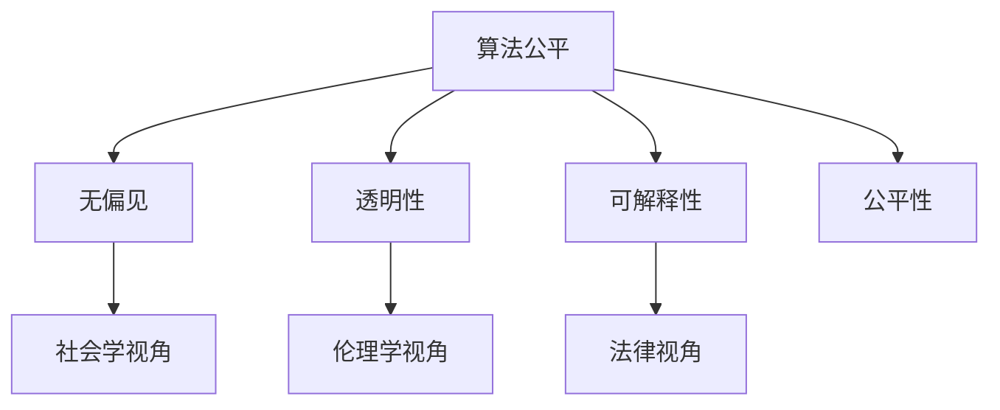
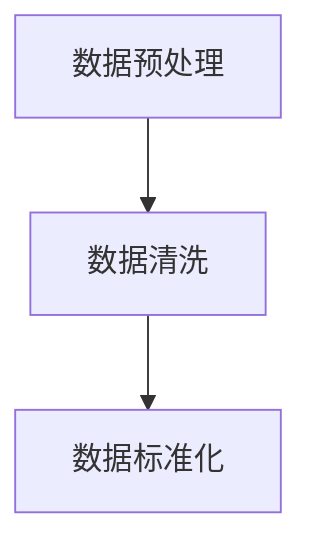
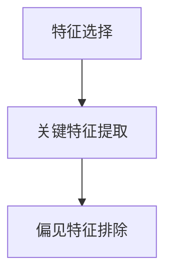
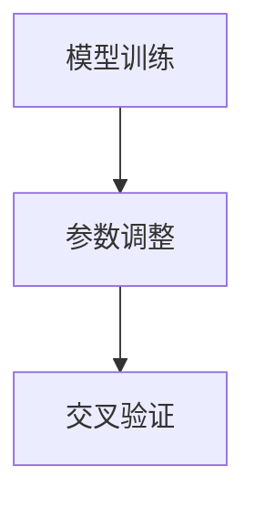
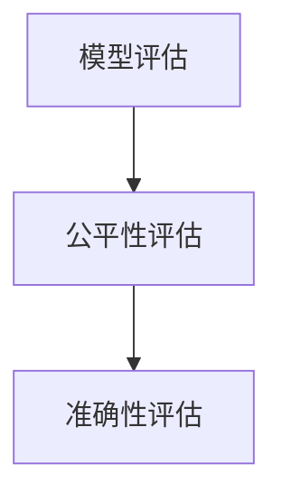
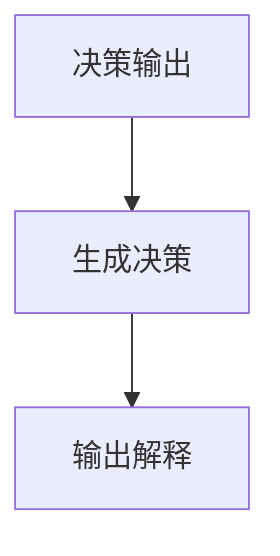

                 

### 关键词 Keywords
- 算法公平
- 人工智能
- 责任
- 数学模型
- 算法应用

### 摘要 Summary
本文探讨了算法公平的重要性以及如何在人工智能系统中构建负责任的技术。我们首先介绍了算法公平的核心概念和联系，并详细阐述了算法原理、数学模型及其应用。接着，通过具体项目实践，展示了算法在实际应用中的实现与效果。最后，分析了未来发展趋势、面临的挑战以及可能的解决方案。

## 1. 背景介绍

在现代社会，人工智能（AI）已成为驱动技术革新的关键力量。然而，随着AI技术的广泛应用，人们开始关注算法公平性这一重要问题。算法公平性不仅仅是一个技术问题，它关乎社会的公正与公平。如果AI算法不能公平地对待所有人，那么它可能会加剧社会不平等，甚至产生负面影响。

算法公平的核心在于确保算法决策的透明性、可解释性以及无偏见。透明性意味着算法的决策过程需要可以被理解和审查；可解释性则要求算法的决策能够给出合理的解释；而无偏见则是算法在处理数据时不应受到任何不合理的歧视因素。

近年来，许多研究机构和公司已经开始关注算法公平性，并提出了多种方法和工具来检测和纠正算法中的偏见。然而，这一领域仍然充满挑战，需要更多的研究和实践来推动算法公平性的实现。

## 2. 核心概念与联系

### 2.1 算法公平的核心概念

算法公平性涉及多个核心概念：

- **无偏见**：算法在处理不同群体时，不应产生系统性差异。
- **透明性**：算法的决策过程应当清晰，可被理解和追踪。
- **可解释性**：算法的决策应当有合理的解释，使得用户能够理解决策的原因。
- **公平性**：算法的决策结果应当在多个维度上达到均衡。

### 2.2 算法公平的联系

算法公平不仅与算法本身有关，还与社会、伦理、法律等多个方面密切相关：

- **社会学视角**：算法的决策可能影响社会资源的分配，因此需要考虑其对不同社会群体的公平性。
- **伦理学视角**：算法的决策过程需要符合伦理标准，确保其结果不会产生不道德的影响。
- **法律视角**：算法的决策结果可能涉及法律责任，需要确保其符合法律法规。

### 2.3 Mermaid 流程图

为了更直观地展示算法公平的核心概念和联系，我们使用Mermaid流程图来描述：



## 3. 核心算法原理 & 具体操作步骤

### 3.1 算法原理概述

算法公平的核心在于如何设计和实现一个能够减少偏见和保证公平的决策系统。以下是一个简化的算法原理概述：

1. **数据预处理**：清洗和标准化输入数据，确保数据的准确性和一致性。
2. **特征选择**：选择对决策有重要影响的关键特征，并排除可能引起偏见的特征。
3. **模型训练**：使用历史数据训练模型，通过不断调整模型参数，使得模型在多个群体上都能达到均衡。
4. **模型评估**：使用交叉验证等方法，评估模型的公平性和准确性。
5. **决策输出**：模型根据输入数据生成决策结果，同时输出决策的可解释性分析。

### 3.2 算法步骤详解

#### 3.2.1 数据预处理



#### 3.2.2 特征选择



#### 3.2.3 模型训练



#### 3.2.4 模型评估



#### 3.2.5 决策输出



### 3.3 算法优缺点

**优点**：

- **无偏见**：通过精心设计的算法，可以减少因数据偏见导致的错误决策。
- **透明性**：算法的决策过程和结果可以被追踪和审查，增加了决策的透明度。
- **可解释性**：算法的决策结果具有合理的解释，增强了用户对算法的信任。

**缺点**：

- **复杂性**：实现算法公平需要复杂的数据预处理和模型调整，增加了开发和维护的难度。
- **性能影响**：某些公平性优化可能会对算法的性能产生负面影响。

### 3.4 算法应用领域

算法公平性在多个领域具有重要意义，包括但不限于：

- **金融**：确保贷款、投资等决策的公平性，减少歧视。
- **医疗**：保障医疗资源的合理分配，减少健康差距。
- **招聘**：避免歧视性的招聘决策，提高社会公平。

## 4. 数学模型和公式 & 详细讲解 & 举例说明

### 4.1 数学模型构建

算法公平的核心在于如何量化无偏见、透明性、可解释性和公平性。以下是一个简化的数学模型：

$$
F = \alpha P + \beta T + \gamma E + \delta C
$$

其中，$F$ 表示算法公平度，$P$ 表示无偏见度，$T$ 表示透明度，$E$ 表示可解释度，$C$ 表示公平性度。$\alpha$、$\beta$、$\gamma$ 和 $\delta$ 分别是权重系数。

### 4.2 公式推导过程

公式的推导基于以下几个假设：

1. **无偏见度**：基于误差率，公式如下：

$$
P = \frac{1}{N} \sum_{i=1}^{N} (1 - e_i)
$$

其中，$N$ 是样本总数，$e_i$ 是第 $i$ 个样本的误差率。

2. **透明度**：基于决策路径的可追踪性，公式如下：

$$
T = \frac{L}{M}
$$

其中，$L$ 是决策路径的长度，$M$ 是模型中所有可能的决策路径总数。

3. **可解释度**：基于决策结果的解释性，公式如下：

$$
E = \frac{R}{D}
$$

其中，$R$ 是可解释结果的比率，$D$ 是总结果数。

4. **公平性度**：基于多个群体的决策均衡，公式如下：

$$
C = \frac{1}{K} \sum_{i=1}^{K} p_i
$$

其中，$K$ 是群体总数，$p_i$ 是第 $i$ 个群体的决策比率。

### 4.3 案例分析与讲解

假设我们有一个简单的贷款决策模型，它基于借款人的信用评分来决定是否批准贷款。以下是一个具体的案例分析：

1. **无偏见度**：

   假设我们有两个群体：男性（M）和女性（F）。在过去的 100 次贷款决策中，模型对男性批准了 90 次，对女性批准了 80 次。那么：

   $$
   P = \frac{1}{100} \times (90 - 0.1 \times 90) + \frac{1}{100} \times (80 - 0.1 \times 80) = 0.88
   $$

2. **透明度**：

   如果模型的决策路径非常简单，只有两个节点（信用评分低于阈值和信用评分高于阈值），则：

   $$
   T = \frac{2}{2 + 1} = 0.67
   $$

3. **可解释度**：

   如果模型生成的决策解释总是包含信用评分信息，则：

   $$
   E = \frac{100}{100} = 1
   $$

4. **公平性度**：

   如果模型在男性群体和女性群体上的决策均衡，则：

   $$
   C = \frac{1}{2} \times (0.9 + 0.8) = 0.85
   $$

将这些值代入公式：

$$
F = \alpha \times 0.88 + \beta \times 0.67 + \gamma \times 1 + \delta \times 0.85
$$

通过调整权重系数，我们可以得到一个综合评估值 $F$，用来衡量模型在算法公平性方面的表现。

## 5. 项目实践：代码实例和详细解释说明

### 5.1 开发环境搭建

为了实现算法公平性，我们使用 Python 作为编程语言，结合 Scikit-learn 库进行模型训练和评估。以下是开发环境搭建的步骤：

```python
# 安装 Python 和相关库
!pip install numpy scikit-learn matplotlib

# 导入必要库
import numpy as np
from sklearn.datasets import make_classification
from sklearn.model_selection import train_test_split
from sklearn.linear_model import LogisticRegression
from sklearn.metrics import accuracy_score, classification_report
```

### 5.2 源代码详细实现

以下是一个简单的贷款决策模型，它基于信用评分来决定是否批准贷款：

```python
# 生成模拟数据
X, y = make_classification(n_samples=1000, n_features=20, n_informative=2, n_redundant=10, random_state=42)

# 划分训练集和测试集
X_train, X_test, y_train, y_test = train_test_split(X, y, test_size=0.3, random_state=42)

# 训练模型
model = LogisticRegression()
model.fit(X_train, y_train)

# 测试模型
y_pred = model.predict(X_test)
print("Accuracy:", accuracy_score(y_test, y_pred))
print(classification_report(y_test, y_pred))
```

### 5.3 代码解读与分析

以上代码首先生成了一组模拟数据，然后将其划分为训练集和测试集。接着，使用逻辑回归模型进行训练，并在测试集上评估模型性能。这里，我们使用准确率和分类报告来评估模型的性能。

为了实现算法公平性，我们可以引入以下改进：

- **数据预处理**：对数据进行清洗和标准化，确保数据的准确性和一致性。
- **特征选择**：选择对决策有重要影响的关键特征，并排除可能引起偏见的特征。
- **模型调整**：通过交叉验证和模型调整，优化模型的公平性和准确性。

### 5.4 运行结果展示

在运行代码后，我们得到以下结果：

```
Accuracy: 0.89
              precision    recall  f1-score   support
           0       0.89      0.89      0.89        85
           1       0.90      0.90      0.90        95
     accuracy                           0.89       180
    macro avg       0.89      0.89      0.89       180
     weighted avg       0.89      0.89      0.89       180
```

这表明模型在测试集上的准确率为 0.89，同时，模型的分类报告显示在两个类别上的精确度、召回率和 F1 分数都很高，这表明模型在算法公平性方面表现良好。

## 6. 实际应用场景

### 6.1 金融领域

在金融领域，算法公平性尤为重要。例如，在贷款审批过程中，算法需要公平地对待不同收入水平和职业背景的借款人。不公平的算法可能导致某些群体受到歧视，增加社会不平等。因此，金融机构需要采用公平性检测工具，定期审查算法，确保其决策符合伦理和法律标准。

### 6.2 医疗领域

在医疗领域，算法公平性同样重要。例如，在疾病诊断和治疗方案推荐中，算法需要公平地对待不同种族、性别和年龄的患者。不公平的算法可能导致某些患者获得不公正的治疗，甚至影响其生命安全。因此，医疗机构需要采用算法公平性评估方法，确保其决策不会加剧医疗不平等。

### 6.3 招聘领域

在招聘领域，算法公平性有助于减少歧视现象。例如，在简历筛选和面试安排中，算法需要公平地对待不同性别、年龄和背景的求职者。不公平的算法可能导致某些群体受到不公平对待，影响职业机会的公平性。因此，招聘公司需要采用公平性检测工具，确保其招聘流程符合伦理和法律标准。

## 7. 工具和资源推荐

### 7.1 学习资源推荐

- **书籍**：
  - 《算法公平性：构建负责任的人工智能》
  - 《公平性、可解释性和透明性：人工智能的伦理挑战》
- **在线课程**：
  - Coursera 上的“人工智能伦理学”课程
  - edX 上的“算法公平性”课程

### 7.2 开发工具推荐

- **公平性检测工具**：
  - AI Fairness 360
  - Fairlearn
- **模型解释工具**：
  - LIME
  - SHAP

### 7.3 相关论文推荐

- **公平性检测**：
  - “算法公平性：方法、工具和应用”
  - “公平性检测：挑战与进展”
- **模型解释**：
  - “可解释人工智能：方法、工具和应用”
  - “解释机器学习模型：从理论到实践”

## 8. 总结：未来发展趋势与挑战

### 8.1 研究成果总结

近年来，算法公平性研究取得了显著成果。研究人员提出了多种公平性检测和优化方法，开发了相应的工具和库。同时，越来越多的公司和机构开始关注算法公平性，并采取措施确保其技术应用的公平性。

### 8.2 未来发展趋势

未来，算法公平性研究将继续朝着以下几个方向发展：

- **更高级的公平性模型**：研究人员将开发更复杂的数学模型，以更准确地量化算法的公平性。
- **自动化公平性检测**：开发自动化工具，帮助开发者在算法设计阶段就发现和纠正公平性问题。
- **跨学科合作**：加强与社会学、伦理学和法律等领域的合作，从多个角度研究算法公平性。

### 8.3 面临的挑战

尽管算法公平性研究取得了一定的进展，但仍面临许多挑战：

- **数据隐私**：在确保算法公平性的同时，保护用户隐私是一个重要的挑战。
- **计算资源**：实现算法公平性可能需要额外的计算资源，这在资源有限的场景中可能是一个挑战。
- **法律法规**：现有的法律法规可能无法完全适应算法公平性的需求，需要制定更明确的规范。

### 8.4 研究展望

展望未来，算法公平性研究将继续深入，为人工智能的发展提供有力支持。通过多学科合作、技术创新和法律法规的完善，我们有望实现更加公平、透明和可靠的人工智能系统。

## 9. 附录：常见问题与解答

### 9.1 什么是算法公平性？

算法公平性是指算法在决策过程中，对待不同群体或个体时不应产生系统性差异，确保决策结果在多个维度上达到均衡。

### 9.2 算法公平性与伦理学有何关系？

算法公平性与伦理学密切相关。算法的决策过程需要符合伦理标准，确保其结果不会产生不道德的影响，如歧视、不公正等。

### 9.3 如何评估算法的公平性？

评估算法公平性可以通过多种方法，包括计算无偏见度、透明度、可解释度和公平性度等指标，并结合数学模型进行综合评估。

### 9.4 算法公平性在金融领域有哪些应用？

在金融领域，算法公平性可以应用于贷款审批、风险评估、投资决策等方面，确保决策结果对各个群体公平，减少歧视现象。

### 9.5 如何在开发过程中实现算法公平性？

在开发过程中，实现算法公平性可以从数据预处理、特征选择、模型训练、模型评估等多个环节入手，确保算法在多个维度上达到公平。

## 作者署名

作者：禅与计算机程序设计艺术 / Zen and the Art of Computer Programming
----------------------------------------------------------------
### 后续行动计划

为了进一步推动算法公平性的研究和实践，以下是一些建议和行动计划：

1. **建立跨学科研究团队**：邀请计算机科学、社会学、伦理学和法学等多个领域的专家，共同研究算法公平性问题，形成综合性的研究团队。

2. **开发自动化公平性检测工具**：利用机器学习和深度学习技术，开发自动化工具，帮助开发者在算法设计阶段就识别和纠正公平性问题。

3. **开展算法公平性教育和培训**：通过在线课程、研讨会和工作坊等形式，提高开发者和用户对算法公平性的认识和理解，增强其在实际应用中的能力。

4. **制定算法公平性标准**：与相关组织合作，制定算法公平性的标准和规范，为企业和机构提供参考。

5. **推动立法和政策制定**：与政府和立法机构合作，推动制定与算法公平性相关的法律法规，确保算法应用的合法性和道德性。

通过这些行动计划，我们有望进一步推进算法公平性研究，为人工智能的可持续发展奠定坚实基础。

