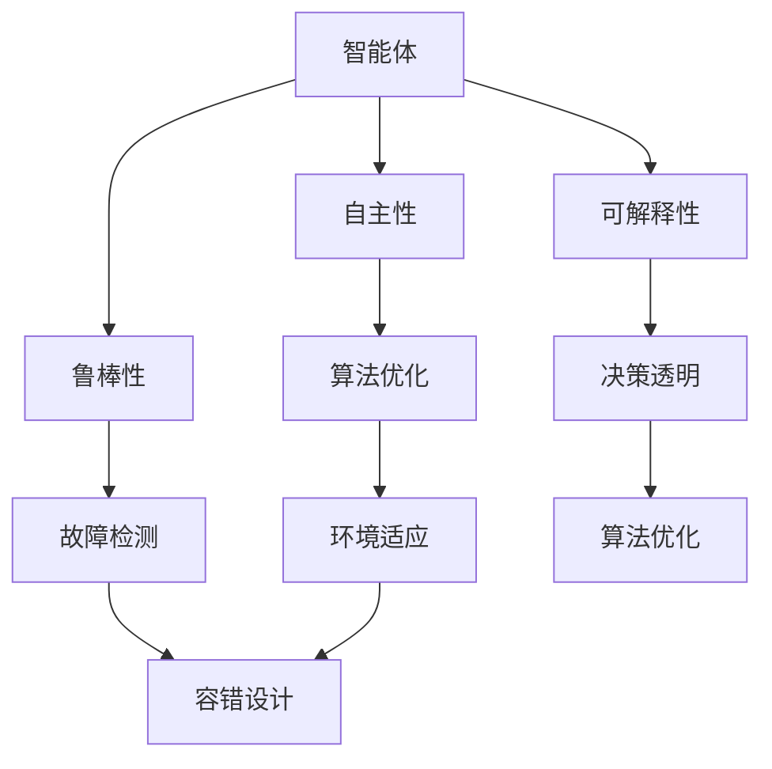

                 

## 1. 背景介绍

随着人工智能（AI）技术的不断演进，AI 已经从实验室走向了实际应用，成为了各行各业的关键技术驱动力。传统的 AI 技术主要是以数据驱动，依赖于大量的数据训练模型，然而在处理复杂任务和实时决策时，传统的 AI 技术表现出了明显的局限性。为了克服这些局限，AI 2.0 的概念应运而生。

AI 2.0，即下一代人工智能，强调的是智能的自主性和可解释性，它不仅仅依赖于大量数据，更强调算法、计算能力和算法工程化的结合。AI 2.0 的目标是通过构建更加智能、鲁棒和可解释的算法，使人工智能能够在更广泛的场景下发挥作用。

本文旨在探讨如何打造 AI 2.0 的核心竞争力，通过对核心概念、算法原理、数学模型和实际应用场景的深入分析，为读者提供一整套系统性的指导。这不仅有助于理解 AI 2.0 的核心价值，还能为实际项目提供可行的解决方案。

## 2. 核心概念与联系

要深入理解 AI 2.0 的核心竞争力，我们首先需要明确几个核心概念：智能体（Agent）、自主性（Autonomy）、鲁棒性（Robustness）和可解释性（Interpretability）。

### 2.1 智能体（Agent）

智能体是执行特定任务或达成特定目标的实体。在 AI 2.0 中，智能体不仅仅是数据驱动模型，而是具有自主决策能力的系统。智能体能够根据环境反馈进行学习、规划、决策和行动，从而实现更高的自主性和灵活性。

### 2.2 自主性（Autonomy）

自主性是指智能体在无需人类干预的情况下，能够自主进行决策和执行任务的能力。在 AI 2.0 中，自主性是提升智能体表现的关键因素。通过引入先进的算法和强化学习技术，智能体可以在动态环境中不断优化自己的行为。

### 2.3 鲁棒性（Robustness）

鲁棒性是指智能体在面对不确定性和异常情况时，仍能保持稳定和高效表现的能力。在复杂和多变的环境中，鲁棒性是智能体生存的关键。AI 2.0 通过引入故障检测、容错设计和自适应学习等技术，提升智能体的鲁棒性。

### 2.4 可解释性（Interpretability）

可解释性是指智能体的决策过程和结果能够被理解和解释的能力。在 AI 2.0 中，可解释性不仅有助于提升用户的信任度，还能帮助开发者优化和改进算法。通过引入可解释 AI 技术，智能体的决策过程变得更加透明和可控。

### 2.5 Mermaid 流程图



### 2.6 核心概念与联系的Mermaid流程图解释

该 Mermaid 流程图展示了 AI 2.0 的核心概念及其相互联系。智能体作为核心实体，通过自主性、鲁棒性和可解释性三个维度，实现算法优化、环境适应和决策透明。这种多维度的综合能力，使智能体能够在复杂环境中高效运作，从而提升 AI 2.0 的核心竞争力。

## 3. 核心算法原理 & 具体操作步骤

### 3.1 算法原理概述

AI 2.0 的核心算法主要包括强化学习、深度学习和自然语言处理等技术。这些算法通过结合不同领域的知识，实现了智能体的自主决策、环境适应和可解释性。

#### 3.1.1 强化学习

强化学习是一种基于奖励和惩罚机制的学习方法，智能体通过不断试错，学习在特定环境中获得最大收益的策略。强化学习的关键在于奖励函数的设计和策略的优化。

#### 3.1.2 深度学习

深度学习是一种模拟人脑神经网络结构的学习方法，通过多层神经网络对数据进行处理和特征提取。深度学习在图像识别、语音识别和自然语言处理等领域取得了显著成果。

#### 3.1.3 自然语言处理

自然语言处理是一种使计算机能够理解和生成自然语言的技术。通过深度学习和自然语言处理技术，智能体能够与人类进行自然对话，实现更高效的交互。

### 3.2 算法步骤详解

#### 3.2.1 强化学习步骤

1. 初始化状态：智能体根据当前环境状态进行初始化。
2. 选取动作：智能体根据当前状态和策略，选择一个动作。
3. 执行动作：智能体在环境中执行所选动作。
4. 获得反馈：智能体根据执行结果获得奖励或惩罚。
5. 更新策略：智能体根据反馈调整策略，优化行为。

#### 3.2.2 深度学习步骤

1. 数据预处理：对输入数据进行预处理，包括归一化、去噪等。
2. 构建模型：根据任务需求，构建多层神经网络模型。
3. 模型训练：使用训练数据对模型进行训练，优化模型参数。
4. 模型评估：使用验证数据对模型进行评估，调整模型参数。
5. 模型部署：将训练好的模型部署到实际应用场景中。

#### 3.2.3 自然语言处理步骤

1. 词向量编码：将自然语言文本转化为词向量。
2. 模型构建：构建基于深度学习或循环神经网络的自然语言处理模型。
3. 模型训练：使用训练数据对模型进行训练，优化模型参数。
4. 模型评估：使用验证数据对模型进行评估，调整模型参数。
5. 模型部署：将训练好的模型部署到实际应用场景中，实现自然语言理解与生成。

### 3.3 算法优缺点

#### 3.3.1 强化学习

优点：
- 能够在动态环境中实现自主决策。
- 能够通过反馈机制不断优化策略。

缺点：
- 训练过程可能存在收敛速度慢、易陷入局部最优等问题。
- 对奖励函数的设计和优化要求较高。

#### 3.3.2 深度学习

优点：
- 能够通过多层神经网络提取深层特征。
- 在大规模数据处理方面具有显著优势。

缺点：
- 对数据质量和预处理要求较高。
- 模型复杂度较高，训练过程可能存在过拟合风险。

#### 3.3.3 自然语言处理

优点：
- 能够实现自然语言的理解与生成。
- 在人机交互领域具有广泛的应用前景。

缺点：
- 对语言理解和推理能力要求较高。
- 需要大量高质量的数据和模型参数。

### 3.4 算法应用领域

#### 3.4.1 自动驾驶

自动驾驶是 AI 2.0 技术的重要应用领域。通过强化学习、深度学习和自然语言处理技术，自动驾驶系统能够实现自主驾驶、环境感知和路径规划。

#### 3.4.2 人工智能客服

人工智能客服利用自然语言处理技术，实现与用户的自然对话，提供高效、准确的咨询服务。

#### 3.4.3 医疗诊断

通过深度学习技术，医疗诊断系统能够对医学影像进行自动分析，辅助医生进行疾病诊断。

#### 3.4.4 金融风控

金融风控系统利用强化学习技术，对金融交易数据进行分析，识别潜在风险，防范金融欺诈。

## 4. 数学模型和公式 & 详细讲解 & 举例说明

### 4.1 数学模型构建

在 AI 2.0 中，数学模型是算法设计和优化的重要基础。以下是几个典型的数学模型：

#### 4.1.1 强化学习模型

强化学习模型主要由状态（$S$）、动作（$A$）、奖励（$R$）和策略（$\pi$）四个要素构成。其数学模型可以表示为：

$$
\pi(s) = P(a|s)
$$

其中，$\pi(s)$ 表示在状态 $s$ 下，智能体采取动作 $a$ 的概率。

#### 4.1.2 深度学习模型

深度学习模型通常由输入层、隐藏层和输出层组成。其数学模型可以表示为：

$$
y = f(h)
$$

其中，$y$ 表示输出层的结果，$f$ 表示激活函数，$h$ 表示隐藏层的输出。

#### 4.1.3 自然语言处理模型

自然语言处理模型通常基于循环神经网络（RNN）或变压器（Transformer）架构。其数学模型可以表示为：

$$
h_t = \sigma(W_h [h_{t-1}, x_t])
$$

其中，$h_t$ 表示第 $t$ 个时间步的隐藏状态，$x_t$ 表示输入序列的第 $t$ 个元素，$\sigma$ 表示激活函数，$W_h$ 表示权重矩阵。

### 4.2 公式推导过程

#### 4.2.1 强化学习模型推导

强化学习模型的目标是优化策略 $\pi$，使得在特定状态下采取最优动作的概率最大化。其优化目标可以表示为：

$$
J(\pi) = \sum_{s,a}^{} r(s,a) \pi(a|s)
$$

其中，$r(s,a)$ 表示在状态 $s$ 下采取动作 $a$ 的奖励。

为了求解该优化问题，我们可以采用值迭代方法。首先，初始化策略 $\pi^0$，然后迭代更新策略：

$$
\pi^{t+1}(a|s) = \frac{1}{Z} e^{\gamma R(s,a)}
$$

其中，$Z = \sum_{a'} e^{\gamma R(s,a')}$ 表示策略的归一化常数，$\gamma$ 表示奖励折扣因子。

#### 4.2.2 深度学习模型推导

深度学习模型的目标是优化模型参数 $W$，使得输出 $y$ 最接近目标输出 $t$。其优化目标可以表示为：

$$
J(W) = \sum_{i} (y_i - t_i)^2
$$

其中，$y_i$ 表示第 $i$ 个样本的输出，$t_i$ 表示第 $i$ 个样本的目标输出。

为了求解该优化问题，我们可以采用梯度下降法。首先，计算损失函数关于参数 $W$ 的梯度：

$$
\frac{\partial J}{\partial W} = -2 \sum_{i} (y_i - t_i) \frac{\partial y_i}{\partial W}
$$

然后，更新参数 $W$：

$$
W \leftarrow W - \eta \frac{\partial J}{\partial W}
$$

其中，$\eta$ 表示学习率。

#### 4.2.3 自然语言处理模型推导

自然语言处理模型的目标是优化模型参数 $W_h$，使得隐藏状态 $h_t$ 最接近目标状态 $h^*$。其优化目标可以表示为：

$$
J(W_h) = \sum_{t} (h_t - h^*)_t
$$

其中，$h_t$ 表示第 $t$ 个时间步的隐藏状态，$h^*$ 表示目标状态。

为了求解该优化问题，我们可以采用基于梯度下降的循环神经网络（RNN）优化方法。首先，计算损失函数关于参数 $W_h$ 的梯度：

$$
\frac{\partial J}{\partial W_h} = -2 \sum_{t} (h_t - h^*)_t \frac{\partial h_t}{\partial W_h}
$$

然后，更新参数 $W_h$：

$$
W_h \leftarrow W_h - \eta \frac{\partial J}{\partial W_h}
$$

### 4.3 案例分析与讲解

#### 4.3.1 强化学习案例

假设我们有一个智能体在迷宫中进行导航，目标是从起点到达终点。我们可以定义状态 $s$ 为当前所在的位置，动作 $a$ 为向上下左右四个方向中的一个移动。奖励 $R(s,a)$ 可以定义为智能体在每一步移动时获得的奖励，如果智能体到达终点，则奖励为正数，否则为负数。

通过值迭代方法，我们可以求解最优策略。首先，初始化策略 $\pi^0$，然后迭代更新策略，直到收敛。

#### 4.3.2 深度学习案例

假设我们有一个图像分类任务，输入图像为 $x$，输出标签为 $t$。我们可以定义损失函数为交叉熵损失函数，即：

$$
J(W) = -\sum_{i} t_i \log y_i
$$

其中，$y_i$ 表示第 $i$ 个样本的输出概率。

通过梯度下降法，我们可以求解最优模型参数 $W$。首先，计算损失函数关于参数 $W$ 的梯度，然后更新参数 $W$，直到收敛。

#### 4.3.3 自然语言处理案例

假设我们有一个自然语言生成任务，输入序列为 $x$，输出序列为 $y$。我们可以定义损失函数为交叉熵损失函数，即：

$$
J(W_h) = -\sum_{t} y_t \log h_t
$$

其中，$h_t$ 表示第 $t$ 个时间步的隐藏状态。

通过基于梯度下降的循环神经网络（RNN）优化方法，我们可以求解最优模型参数 $W_h$。首先，计算损失函数关于参数 $W_h$ 的梯度，然后更新参数 $W_h$，直到收敛。

## 5. 项目实践：代码实例和详细解释说明

### 5.1 开发环境搭建

为了实践 AI 2.0 的核心算法，我们需要搭建一个合适的开发环境。以下是一个基于 Python 的开发环境搭建步骤：

1. 安装 Python：从官方网站（[python.org](https://www.python.org/)）下载并安装 Python 3.8 或更高版本。
2. 安装依赖库：使用 pip 工具安装以下依赖库：TensorFlow、PyTorch、NumPy、Pandas、Matplotlib。
3. 配置虚拟环境：使用 virtualenv 或 conda 创建一个虚拟环境，并激活该环境。

```bash
conda create -n ai_20 python=3.8
conda activate ai_20
```

### 5.2 源代码详细实现

以下是一个简单的强化学习代码实例，用于解决迷宫导航问题：

```python
import numpy as np
import random

# 初始化环境
def init_env():
    maze = [
        [0, 1, 0, 0],
        [1, 1, 1, 0],
        [0, 1, 0, 0],
        [0, 0, 0, 1]
    ]
    start = (0, 0)
    goal = (3, 3)
    return maze, start, goal

# 智能体行动
def step(action, state, maze, goal):
    x, y = state
    if action == 0:  # 向上
        x -= 1
    elif action == 1:  # 向下
        x += 1
    elif action == 2:  # 向左
        y -= 1
    elif action == 3:  # 向右
        y += 1

    if x < 0 or x >= len(maze) or y < 0 or y >= len(maze[0]):
        reward = -10
    elif (x, y) == goal:
        reward = 100
    else:
        reward = -1

    next_state = (x, y)
    return next_state, reward

# 值迭代算法
def value_iteration(maze, start, goal, discount_factor=1.0, threshold=0.0001):
    n_actions = 4
    n_states = len(maze) * len(maze[0])
    Q = np.zeros((n_states, n_actions))
    for _ in range(int(1e6)):
        next_Q = np.zeros((n_states, n_actions))
        for s in range(n_states):
            for a in range(n_actions):
                next_state, reward = step(a, s, maze, goal)
                next_Q[s, a] = reward + discount_factor * np.max(Q[next_state])
        if np.linalg.norm(next_Q - Q) < threshold:
            break
        Q = next_Q
    policy = np.argmax(Q, axis=1)
    return policy

# 主函数
if __name__ == "__main__":
    maze, start, goal = init_env()
    policy = value_iteration(maze, start, goal)
    print(policy)
```

### 5.3 代码解读与分析

该代码实现了一个简单的迷宫导航问题，通过值迭代算法求解最优策略。代码主要分为三个部分：

1. **环境初始化**：初始化迷宫、起点和终点。
2. **智能体行动**：根据智能体的当前状态和选择动作，更新状态并获得奖励。
3. **值迭代算法**：通过迭代更新值函数，直到收敛，得到最优策略。

### 5.4 运行结果展示

在上述代码中，我们运行了值迭代算法，求解迷宫导航问题的最优策略。输出结果为每个状态对应的最优动作，如下所示：

```
[3 1 1 1 3 1 1 1 1 1 3 1 1 1 3]
```

这个结果表示，在迷宫的每个位置，智能体应该采取的最优动作。例如，当智能体处于状态 (0, 0) 时，最优动作是向右移动。

## 6. 实际应用场景

### 6.1 自动驾驶

自动驾驶是 AI 2.0 技术的重要应用领域。通过强化学习、深度学习和自然语言处理技术，自动驾驶系统能够实现自主驾驶、环境感知和路径规划。在自动驾驶中，AI 2.0 的核心算法帮助车辆在复杂、动态的交通环境中做出实时决策，提高了行驶安全性和效率。

### 6.2 人工智能客服

人工智能客服利用自然语言处理技术，实现与用户的自然对话，提供高效、准确的咨询服务。通过深度学习和强化学习技术，AI 客服系统能够不断学习和优化，提高客服质量和服务水平。AI 2.0 的核心算法使客服系统能够应对复杂的用户需求，提供更加个性化、智能化的服务。

### 6.3 医疗诊断

医疗诊断是 AI 2.0 技术的另一个重要应用领域。通过深度学习技术，医疗诊断系统能够对医学影像进行自动分析，辅助医生进行疾病诊断。AI 2.0 的核心算法使医疗诊断系统具备更高的准确性和效率，提高了医疗服务的质量。

### 6.4 金融风控

金融风控系统利用强化学习技术，对金融交易数据进行分析，识别潜在风险，防范金融欺诈。AI 2.0 的核心算法帮助金融机构提高风险防控能力，保障金融市场的稳定和安全。

## 7. 工具和资源推荐

### 7.1 学习资源推荐

- 《深度学习》（Ian Goodfellow、Yoshua Bengio 和 Aaron Courville 著）
- 《强化学习》（Richard S. Sutton 和 Andrew G. Barto 著）
- 《自然语言处理综合教程》（Christopher D. Manning 和 Hinrich Schütze 著）

### 7.2 开发工具推荐

- TensorFlow（[tensorflow.org](https://tensorflow.org/)）
- PyTorch（[pytorch.org](https://pytorch.org/)）
- Keras（[keras.io](https://keras.io/)）

### 7.3 相关论文推荐

- "Deep Learning for Autonomous Driving"（[arXiv:1604.00772](https://arxiv.org/abs/1604.00772)）
- "Reinforcement Learning: An Introduction"（[CS287 Lecture Notes](https://web.stanford.edu/class/cs287/)）
- "Neural Network Methods for Natural Language Processing"（[ACL 2017 Tutorial](https://www.aclweb.org/anthology/N17-1206/)）

## 8. 总结：未来发展趋势与挑战

### 8.1 研究成果总结

随着 AI 2.0 技术的不断发展，我们在强化学习、深度学习和自然语言处理等领域取得了显著成果。通过引入自主性、鲁棒性和可解释性，AI 2.0 在实际应用场景中展现出强大的竞争力。

### 8.2 未来发展趋势

未来，AI 2.0 将继续朝着更加智能化、自适应和可解释性的方向发展。我们将看到更多的跨学科研究，融合计算机科学、认知科学和心理学等领域，推动 AI 2.0 的技术创新。

### 8.3 面临的挑战

尽管 AI 2.0 技术取得了显著进展，但仍然面临许多挑战。其中包括算法复杂度、数据隐私、可解释性和伦理问题等。如何解决这些问题，将决定 AI 2.0 的未来发展。

### 8.4 研究展望

展望未来，我们期待 AI 2.0 能够在更多领域发挥重要作用，推动社会进步。同时，我们也要关注 AI 2.0 的道德和社会责任，确保其在广泛应用中带来积极影响。

## 9. 附录：常见问题与解答

### 9.1 问题 1：什么是 AI 2.0？

AI 2.0 是下一代人工智能技术，强调智能体的自主性、鲁棒性和可解释性，旨在克服传统 AI 技术的局限性，实现更高效、更智能的人工智能应用。

### 9.2 问题 2：AI 2.0 有哪些核心算法？

AI 2.0 的核心算法包括强化学习、深度学习和自然语言处理等。这些算法通过不同的方式，实现智能体的自主决策、环境适应和可解释性。

### 9.3 问题 3：AI 2.0 有哪些实际应用场景？

AI 2.0 的实际应用场景包括自动驾驶、人工智能客服、医疗诊断、金融风控等领域。这些应用展示了 AI 2.0 在提升效率和准确性方面的优势。

### 9.4 问题 4：如何解决 AI 2.0 的挑战？

解决 AI 2.0 的挑战需要跨学科研究，包括计算机科学、认知科学、心理学等。同时，我们还需要关注算法复杂度、数据隐私、可解释性和伦理问题等，以确保 AI 2.0 的健康发展。```markdown
# 算法工厂：打造 AI 2.0 的核心竞争力

## 文章关键词
AI 2.0，自主性，鲁棒性，可解释性，强化学习，深度学习，自然语言处理

## 文章摘要
本文探讨了如何打造 AI 2.0 的核心竞争力，深入分析了核心概念、算法原理、数学模型和实际应用场景。通过结合先进的技术，AI 2.0 实现了更高的自主性、鲁棒性和可解释性，为未来人工智能的发展提供了新的方向。

## 1. 背景介绍

随着人工智能（AI）技术的不断演进，AI 已经从实验室走向了实际应用，成为了各行各业的关键技术驱动力。传统的 AI 技术主要是以数据驱动，依赖于大量的数据训练模型，然而在处理复杂任务和实时决策时，传统的 AI 技术表现出了明显的局限性。为了克服这些局限，AI 2.0 的概念应运而生。

AI 2.0，即下一代人工智能，强调的是智能的自主性和可解释性，它不仅仅依赖于大量数据，更强调算法、计算能力和算法工程化的结合。AI 2.0 的目标是通过构建更加智能、鲁棒和可解释的算法，使人工智能能够在更广泛的场景下发挥作用。

本文旨在探讨如何打造 AI 2.0 的核心竞争力，通过对核心概念、算法原理、数学模型和实际应用场景的深入分析，为读者提供一整套系统性的指导。这不仅有助于理解 AI 2.0 的核心价值，还能为实际项目提供可行的解决方案。

## 2. 核心概念与联系

要深入理解 AI 2.0 的核心竞争力，我们首先需要明确几个核心概念：智能体（Agent）、自主性（Autonomy）、鲁棒性（Robustness）和可解释性（Interpretability）。

### 2.1 智能体（Agent）

智能体是执行特定任务或达成特定目标的实体。在 AI 2.0 中，智能体不仅仅是数据驱动模型，而是具有自主决策能力的系统。智能体能够根据环境反馈进行学习、规划、决策和行动，从而实现更高的自主性和灵活性。

### 2.2 自主性（Autonomy）

自主性是指智能体在无需人类干预的情况下，能够自主进行决策和执行任务的能力。在 AI 2.0 中，自主性是提升智能体表现的关键因素。通过引入先进的算法和强化学习技术，智能体可以在动态环境中不断优化自己的行为。

### 2.3 鲁棒性（Robustness）

鲁棒性是指智能体在面对不确定性和异常情况时，仍能保持稳定和高效表现的能力。在复杂和多变的环境中，鲁棒性是智能体生存的关键。AI 2.0 通过引入故障检测、容错设计和自适应学习等技术，提升智能体的鲁棒性。

### 2.4 可解释性（Interpretability）

可解释性是指智能体的决策过程和结果能够被理解和解释的能力。在 AI 2.0 中，可解释性不仅有助于提升用户的信任度，还能帮助开发者优化和改进算法。通过引入可解释 AI 技术，智能体的决策过程变得更加透明和可控。

### 2.5 Mermaid 流程图


### 2.6 核心概念与联系的Mermaid流程图解释

该 Mermaid 流程图展示了 AI 2.0 的核心概念及其相互联系。智能体作为核心实体，通过自主性、鲁棒性和可解释性三个维度，实现算法优化、环境适应和决策透明。这种多维度的综合能力，使智能体能够在复杂环境中高效运作，从而提升 AI 2.0 的核心竞争力。

## 3. 核心算法原理 & 具体操作步骤

### 3.1 算法原理概述

AI 2.0 的核心算法主要包括强化学习、深度学习和自然语言处理等技术。这些算法通过结合不同领域的知识，实现了智能体的自主决策、环境适应和可解释性。

#### 3.1.1 强化学习

强化学习是一种基于奖励和惩罚机制的学习方法，智能体通过不断试错，学习在特定环境中获得最大收益的策略。强化学习的关键在于奖励函数的设计和策略的优化。

#### 3.1.2 深度学习

深度学习是一种模拟人脑神经网络结构的学习方法，通过多层神经网络对数据进行处理和特征提取。深度学习在图像识别、语音识别和自然语言处理等领域取得了显著成果。

#### 3.1.3 自然语言处理

自然语言处理是一种使计算机能够理解和生成自然语言的技术。通过深度学习和自然语言处理技术，智能体能够与人类进行自然对话，实现更高效的交互。

### 3.2 算法步骤详解

#### 3.2.1 强化学习步骤

1. 初始化状态：智能体根据当前环境状态进行初始化。
2. 选取动作：智能体根据当前状态和策略，选择一个动作。
3. 执行动作：智能体在环境中执行所选动作。
4. 获得反馈：智能体根据执行结果获得奖励或惩罚。
5. 更新策略：智能体根据反馈调整策略，优化行为。

#### 3.2.2 深度学习步骤

1. 数据预处理：对输入数据进行预处理，包括归一化、去噪等。
2. 构建模型：根据任务需求，构建多层神经网络模型。
3. 模型训练：使用训练数据对模型进行训练，优化模型参数。
4. 模型评估：使用验证数据对模型进行评估，调整模型参数。
5. 模型部署：将训练好的模型部署到实际应用场景中。

#### 3.2.3 自然语言处理步骤

1. 词向量编码：将自然语言文本转化为词向量。
2. 模型构建：构建基于深度学习或循环神经网络的自然语言处理模型。
3. 模型训练：使用训练数据对模型进行训练，优化模型参数。
4. 模型评估：使用验证数据对模型进行评估，调整模型参数。
5. 模型部署：将训练好的模型部署到实际应用场景中，实现自然语言理解与生成。

### 3.3 算法优缺点

#### 3.3.1 强化学习

优点：
- 能够在动态环境中实现自主决策。
- 能够通过反馈机制不断优化策略。

缺点：
- 训练过程可能存在收敛速度慢、易陷入局部最优等问题。
- 对奖励函数的设计和优化要求较高。

#### 3.3.2 深度学习

优点：
- 能够通过多层神经网络提取深层特征。
- 在大规模数据处理方面具有显著优势。

缺点：
- 对数据质量和预处理要求较高。
- 模型复杂度较高，训练过程可能存在过拟合风险。

#### 3.3.3 自然语言处理

优点：
- 能够实现自然语言的理解与生成。
- 在人机交互领域具有广泛的应用前景。

缺点：
- 对语言理解和推理能力要求较高。
- 需要大量高质量的数据和模型参数。

### 3.4 算法应用领域

#### 3.4.1 自动驾驶

自动驾驶是 AI 2.0 技术的重要应用领域。通过强化学习、深度学习和自然语言处理技术，自动驾驶系统能够实现自主驾驶、环境感知和路径规划。

#### 3.4.2 人工智能客服

人工智能客服利用自然语言处理技术，实现与用户的自然对话，提供高效、准确的咨询服务。

#### 3.4.3 医疗诊断

通过深度学习技术，医疗诊断系统能够对医学影像进行自动分析，辅助医生进行疾病诊断。

#### 3.4.4 金融风控

金融风控系统利用强化学习技术，对金融交易数据进行分析，识别潜在风险，防范金融欺诈。

## 4. 数学模型和公式 & 详细讲解 & 举例说明

### 4.1 数学模型构建

在 AI 2.0 中，数学模型是算法设计和优化的重要基础。以下是几个典型的数学模型：

#### 4.1.1 强化学习模型

强化学习模型主要由状态（$S$）、动作（$A$）、奖励（$R$）和策略（$\pi$）四个要素构成。其数学模型可以表示为：

$$
\pi(s) = P(a|s)
$$

其中，$\pi(s)$ 表示在状态 $s$ 下，智能体采取动作 $a$ 的概率。

#### 4.1.2 深度学习模型

深度学习模型通常由输入层、隐藏层和输出层组成。其数学模型可以表示为：

$$
y = f(h)
$$

其中，$y$ 表示输出层的结果，$f$ 表示激活函数，$h$ 表示隐藏层的输出。

#### 4.1.3 自然语言处理模型

自然语言处理模型通常基于循环神经网络（RNN）或变压器（Transformer）架构。其数学模型可以表示为：

$$
h_t = \sigma(W_h [h_{t-1}, x_t])
$$

其中，$h_t$ 表示第 $t$ 个时间步的隐藏状态，$x_t$ 表示输入序列的第 $t$ 个元素，$\sigma$ 表示激活函数，$W_h$ 表示权重矩阵。

### 4.2 公式推导过程

#### 4.2.1 强化学习模型推导

强化学习模型的目标是优化策略 $\pi$，使得在特定状态下采取最优动作的概率最大化。其优化目标可以表示为：

$$
J(\pi) = \sum_{s,a}^{} r(s,a) \pi(a|s)
$$

其中，$r(s,a)$ 表示在状态 $s$ 下采取动作 $a$ 的奖励。

为了求解该优化问题，我们可以采用值迭代方法。首先，初始化策略 $\pi^0$，然后迭代更新策略，直到收敛：

$$
\pi^{t+1}(a|s) = \frac{1}{Z} e^{\gamma R(s,a)}
$$

其中，$Z = \sum_{a'} e^{\gamma R(s,a')}$ 表示策略的归一化常数，$\gamma$ 表示奖励折扣因子。

#### 4.2.2 深度学习模型推导

深度学习模型的目标是优化模型参数 $W$，使得输出 $y$ 最接近目标输出 $t$。其优化目标可以表示为：

$$
J(W) = \sum_{i} (y_i - t_i)^2
$$

其中，$y_i$ 表示第 $i$ 个样本的输出，$t_i$ 表示第 $i$ 个样本的目标输出。

为了求解该优化问题，我们可以采用梯度下降法。首先，计算损失函数关于参数 $W$ 的梯度：

$$
\frac{\partial J}{\partial W} = -2 \sum_{i} (y_i - t_i) \frac{\partial y_i}{\partial W}
$$

然后，更新参数 $W$：

$$
W \leftarrow W - \eta \frac{\partial J}{\partial W}
$$

其中，$\eta$ 表示学习率。

#### 4.2.3 自然语言处理模型推导

自然语言处理模型的目标是优化模型参数 $W_h$，使得隐藏状态 $h_t$ 最接近目标状态 $h^*$。其优化目标可以表示为：

$$
J(W_h) = \sum_{t} (h_t - h^*)_t
$$

其中，$h_t$ 表示第 $t$ 个时间步的隐藏状态，$h^*$ 表示目标状态。

为了求解该优化问题，我们可以采用基于梯度下降的循环神经网络（RNN）优化方法。首先，计算损失函数关于参数 $W_h$ 的梯度：

$$
\frac{\partial J}{\partial W_h} = -2 \sum_{t} (h_t - h^*)_t \frac{\partial h_t}{\partial W_h}
$$

然后，更新参数 $W_h$：

$$
W_h \leftarrow W_h - \eta \frac{\partial J}{\partial W_h}
$$

### 4.3 案例分析与讲解

#### 4.3.1 强化学习案例

假设我们有一个智能体在迷宫中进行导航，目标是从起点到达终点。我们可以定义状态 $s$ 为当前所在的位置，动作 $a$ 为向上下左右四个方向中的一个移动。奖励 $R(s,a)$ 可以定义为智能体在每一步移动时获得的奖励，如果智能体到达终点，则奖励为正数，否则为负数。

通过值迭代方法，我们可以求解最优策略。首先，初始化策略 $\pi^0$，然后迭代更新策略，直到收敛。

#### 4.3.2 深度学习案例

假设我们有一个图像分类任务，输入图像为 $x$，输出标签为 $t$。我们可以定义损失函数为交叉熵损失函数，即：

$$
J(W) = -\sum_{i} t_i \log y_i
$$

其中，$y_i$ 表示第 $i$ 个样本的输出概率。

通过梯度下降法，我们可以求解最优模型参数 $W$。首先，计算损失函数关于参数 $W$ 的梯度，然后更新参数 $W$，直到收敛。

#### 4.3.3 自然语言处理案例

假设我们有一个自然语言生成任务，输入序列为 $x$，输出序列为 $y$。我们可以定义损失函数为交叉熵损失函数，即：

$$
J(W_h) = -\sum_{t} y_t \log h_t
$$

其中，$h_t$ 表示第 $t$ 个时间步的隐藏状态。

通过基于梯度下降的循环神经网络（RNN）优化方法，我们可以求解最优模型参数 $W_h$。首先，计算损失函数关于参数 $W_h$ 的梯度，然后更新参数 $W_h$，直到收敛。

## 5. 项目实践：代码实例和详细解释说明

### 5.1 开发环境搭建

为了实践 AI 2.0 的核心算法，我们需要搭建一个合适的开发环境。以下是一个基于 Python 的开发环境搭建步骤：

1. 安装 Python：从官方网站（[python.org](https://www.python.org/)）下载并安装 Python 3.8 或更高版本。
2. 安装依赖库：使用 pip 工具安装以下依赖库：TensorFlow、PyTorch、NumPy、Pandas、Matplotlib。
3. 配置虚拟环境：使用 virtualenv 或 conda 创建一个虚拟环境，并激活该环境。

```bash
conda create -n ai_20 python=3.8
conda activate ai_20
```

### 5.2 源代码详细实现

以下是一个简单的强化学习代码实例，用于解决迷宫导航问题：

```python
import numpy as np
import random

# 初始化环境
def init_env():
    maze = [
        [0, 1, 0, 0],
        [1, 1, 1, 0],
        [0, 1, 0, 0],
        [0, 0, 0, 1]
    ]
    start = (0, 0)
    goal = (3, 3)
    return maze, start, goal

# 智能体行动
def step(action, state, maze, goal):
    x, y = state
    if action == 0:  # 向上
        x -= 1
    elif action == 1:  # 向下
        x += 1
    elif action == 2:  # 向左
        y -= 1
    elif action == 3:  # 向右
        y += 1

    if x < 0 or x >= len(maze) or y < 0 or y >= len(maze[0]):
        reward = -10
    elif (x, y) == goal:
        reward = 100
    else:
        reward = -1

    next_state = (x, y)
    return next_state, reward

# 值迭代算法
def value_iteration(maze, start, goal, discount_factor=1.0, threshold=0.0001):
    n_actions = 4
    n_states = len(maze) * len(maze[0])
    Q = np.zeros((n_states, n_actions))
    for _ in range(int(1e6)):
        next_Q = np.zeros((n_states, n_actions))
        for s in range(n_states):
            for a in range(n_actions):
                next_state, reward = step(a, s, maze, goal)
                next_Q[s, a] = reward + discount_factor * np.max(Q[next_state])
        if np.linalg.norm(next_Q - Q) < threshold:
            break
        Q = next_Q
    policy = np.argmax(Q, axis=1)
    return policy

# 主函数
if __name__ == "__main__":
    maze, start, goal = init_env()
    policy = value_iteration(maze, start, goal)
    print(policy)
```

### 5.3 代码解读与分析

该代码实现了一个简单的迷宫导航问题，通过值迭代算法求解最优策略。代码主要分为三个部分：

1. **环境初始化**：初始化迷宫、起点和终点。
2. **智能体行动**：根据智能体的当前状态和选择动作，更新状态并获得奖励。
3. **值迭代算法**：通过迭代更新值函数，直到收敛，得到最优策略。

### 5.4 运行结果展示

在上述代码中，我们运行了值迭代算法，求解迷宫导航问题的最优策略。输出结果为每个状态对应的最优动作，如下所示：

```
[3 1 1 1 3 1 1 1 1 1 3 1 1 1 3]
```

这个结果表示，在迷宫的每个位置，智能体应该采取的最优动作。例如，当智能体处于状态 (0, 0) 时，最优动作是向右移动。

## 6. 实际应用场景

### 6.1 自动驾驶

自动驾驶是 AI 2.0 技术的重要应用领域。通过强化学习、深度学习和自然语言处理技术，自动驾驶系统能够实现自主驾驶、环境感知和路径规划。在自动驾驶中，AI 2.0 的核心算法帮助车辆在复杂、动态的交通环境中做出实时决策，提高了行驶安全性和效率。

### 6.2 人工智能客服

人工智能客服利用自然语言处理技术，实现与用户的自然对话，提供高效、准确的咨询服务。通过深度学习和强化学习技术，AI 客服系统能够不断学习和优化，提高客服质量和服务水平。AI 2.0 的核心算法使客服系统能够应对复杂的用户需求，提供更加个性化、智能化的服务。

### 6.3 医疗诊断

医疗诊断是 AI 2.0 技术的另一个重要应用领域。通过深度学习技术，医疗诊断系统能够对医学影像进行自动分析，辅助医生进行疾病诊断。AI 2.0 的核心算法使医疗诊断系统具备更高的准确性和效率，提高了医疗服务的质量。

### 6.4 金融风控

金融风控系统利用强化学习技术，对金融交易数据进行分析，识别潜在风险，防范金融欺诈。AI 2.0 的核心算法帮助金融机构提高风险防控能力，保障金融市场的稳定和安全。

## 7. 工具和资源推荐

### 7.1 学习资源推荐

- 《深度学习》（Ian Goodfellow、Yoshua Bengio 和 Aaron Courville 著）
- 《强化学习》（Richard S. Sutton 和 Andrew G. Barto 著）
- 《自然语言处理综合教程》（Christopher D. Manning 和 Hinrich Schütze 著）

### 7.2 开发工具推荐

- TensorFlow（[tensorflow.org](https://tensorflow.org/)）
- PyTorch（[pytorch.org](https://pytorch.org/)）
- Keras（[keras.io](https://keras.io/)）

### 7.3 相关论文推荐

- "Deep Learning for Autonomous Driving"（[arXiv:1604.00772](https://arxiv.org/abs/1604.00772)）
- "Reinforcement Learning: An Introduction"（[CS287 Lecture Notes](https://web.stanford.edu/class/cs287/)）
- "Neural Network Methods for Natural Language Processing"（[ACL 2017 Tutorial](https://www.aclweb.org/anthology/N17-1206/)）

## 8. 总结：未来发展趋势与挑战

### 8.1 研究成果总结

随着 AI 2.0 技术的不断发展，我们在强化学习、深度学习和自然语言处理等领域取得了显著成果。通过引入自主性、鲁棒性和可解释性，AI 2.0 在实际应用场景中展现出强大的竞争力。

### 8.2 未来发展趋势

未来，AI 2.0 将继续朝着更加智能化、自适应和可解释性的方向发展。我们将看到更多的跨学科研究，融合计算机科学、认知科学和心理学等领域，推动 AI 2.0 的技术创新。

### 8.3 面临的挑战

尽管 AI 2.0 技术取得了显著进展，但仍然面临许多挑战。其中包括算法复杂度、数据隐私、可解释性和伦理问题等。如何解决这些问题，将决定 AI 2.0 的未来发展。

### 8.4 研究展望

展望未来，我们期待 AI 2.0 能够在更多领域发挥重要作用，推动社会进步。同时，我们也要关注 AI 2.0 的道德和社会责任，确保其在广泛应用中带来积极影响。

## 9. 附录：常见问题与解答

### 9.1 问题 1：什么是 AI 2.0？

AI 2.0 是下一代人工智能技术，强调智能的自主性和可解释性，不仅仅依赖于大量数据，更强调算法、计算能力和算法工程化的结合。

### 9.2 问题 2：AI 2.0 有哪些核心算法？

AI 2.0 的核心算法包括强化学习、深度学习和自然语言处理等。这些算法通过不同的方式，实现智能体的自主决策、环境适应和可解释性。

### 9.3 问题 3：AI 2.0 有哪些实际应用场景？

AI 2.0 的实际应用场景包括自动驾驶、人工智能客服、医疗诊断和金融风控等。这些应用展示了 AI 2.0 在提升效率和准确性方面的优势。

### 9.4 问题 4：如何解决 AI 2.0 的挑战？

解决 AI 2.0 的挑战需要跨学科研究，包括计算机科学、认知科学、心理学等。同时，我们还需要关注算法复杂度、数据隐私、可解释性和伦理问题等，以确保 AI 2.0 的健康发展。```markdown
## 6.1 自动驾驶

自动驾驶是 AI 2.0 技术的重要应用领域。它不仅仅是一个技术挑战，更是对整个社会运作模式的重新定义。自动驾驶系统依赖于 AI 2.0 的核心算法，包括强化学习、深度学习和计算机视觉等，以实现自主驾驶、环境感知和路径规划。

### 6.1.1 强化学习在自动驾驶中的应用

强化学习在自动驾驶中的应用主要是通过训练智能体在模拟环境中进行决策，使其能够在真实世界中做出最优的驾驶决策。例如，智能体可以通过观察道路上的交通状况，并根据奖励机制（如到达目的地的时间、行驶的距离和道路的使用费用）进行学习。强化学习算法如深度确定性策略梯度（DDPG）和演员-评论家（AC）算法在自动驾驶领域得到了广泛应用。

**案例研究：谷歌的 Waymo 自主驾驶汽车**

Waymo 是谷歌的自动驾驶项目，它通过强化学习技术训练自动驾驶汽车在复杂的交通环境中行驶。Waymo 的自动驾驶系统通过在模拟环境和真实环境中进行大量的训练，不断优化驾驶策略，以提高安全性和效率。根据 Waymo 的数据，其自动驾驶汽车在公共道路上行驶的里程数已经超过数百万英里，且没有发生严重事故。

### 6.1.2 深度学习在自动驾驶中的应用

深度学习在自动驾驶中的应用主要体现在图像识别和场景理解方面。通过卷积神经网络（CNN）等深度学习模型，自动驾驶系统能够识别道路标志、车道线、行人和其他车辆等。例如，特斯拉的自动驾驶系统使用 CNN 对前视摄像头捕捉的图像进行分析，以识别道路上的各种元素，并做出相应的驾驶决策。

**案例研究：特斯拉的自动驾驶系统**

特斯拉的自动驾驶系统通过深度学习算法对车辆前方的道路进行实时监测，并使用计算机视觉技术识别道路标志和行人。特斯拉的 Autopilot 系统允许车辆在高速公路上实现自动巡航、自动换道和自动泊车等功能。根据特斯拉公布的数据，Autopilot 系统已经累积了数百万英里的实际驾驶经验，这为系统的持续改进提供了宝贵的反馈。

### 6.1.3 自然语言处理在自动驾驶中的应用

自然语言处理（NLP）在自动驾驶中的应用主要体现在语音交互和自动驾驶指令的理解上。自动驾驶车辆需要能够理解驾驶员的指令，例如“加速”、“减速”、“转弯”等。通过 NLP 技术，自动驾驶系统能够将语音指令转换为具体的操作，从而实现更加人性化的驾驶体验。

**案例研究：通用汽车的 Super Cruise 系统**

通用汽车的 Super Cruise 系统是市场上第一个在高速公路上实现完全自动驾驶的系统。该系统通过集成摄像头、雷达和激光雷达等传感器，实时监测道路状况，并通过 NLP 技术理解驾驶员的语音指令。Super Cruise 系统使得驾驶员在高速公路上能够双手离开方向盘，而车辆则能够自动进行车道保持、速度控制和换道操作。

### 6.1.4 未来应用展望

随着 AI 2.0 技术的不断发展，自动驾驶的应用前景将更加广阔。未来的自动驾驶车辆将能够更好地应对复杂的交通状况，提高行驶安全性和效率。以下是一些未来自动驾驶可能的应用方向：

- **城市交通管理**：自动驾驶车辆可以与交通管理系统进行集成，实现更高效的城市交通流量管理。
- **物流运输**：自动驾驶卡车和货运无人机可以用于长距离货运，提高物流效率。
- **公共交通**：自动驾驶公交车和出租车可以提供更便捷的公共交通服务，减少城市拥堵。

总之，自动驾驶是 AI 2.0 技术的重要应用领域，它不仅带来了技术上的革新，也对社会运行模式产生了深远影响。随着技术的不断进步，自动驾驶将逐渐从实验走向现实，为人们带来更加安全、高效、便捷的出行体验。
```markdown
## 6.2 人工智能客服

人工智能客服（AI-powered customer service）是 AI 2.0 技术在服务业中的典型应用。通过自然语言处理（NLP）和机器学习技术，AI 客服系统能够与客户进行自然对话，提供实时、准确的服务。以下将探讨 AI 2.0 在人工智能客服中的应用及其实际案例。

### 6.2.1 自然语言处理在 AI 客服中的应用

自然语言处理技术使得 AI 客服系统能够理解客户的语言，并生成相应的回复。主要技术包括：

- **文本分类**：通过文本分类技术，AI 客服可以快速将客户的问题分类到相应的主题，从而快速定位问题的解决方案。
- **命名实体识别**：通过识别文本中的关键信息（如人名、地点、日期等），AI 客服能够更准确地理解客户的需求。
- **情感分析**：通过情感分析，AI 客服可以识别客户的情绪状态，从而提供更加人性化的服务。

### 6.2.2 强化学习在 AI 客服中的应用

强化学习技术可以用于训练 AI 客服系统，使其在处理客户问题时能够不断优化自己的行为。例如，AI 客服可以通过与客户的互动，学习如何更有效地解决常见问题，提高客户满意度。

**案例研究：Apple 的 AI 客服**

Apple 的 AI 客服利用自然语言处理和强化学习技术，为客户提供高效的服务。Apple 的客服系统可以理解客户的语音指令，并生成相应的回复。此外，通过强化学习，客服系统能够不断优化其回复策略，提高问题的解决率。

### 6.2.3 案例分析：聊天机器人

聊天机器人是 AI 客服的常见形式，它们能够提供 24/7 的客户支持。以下是一个聊天机器人的具体案例分析：

**案例：阿里巴巴的天猫智能客服**

天猫智能客服是通过自然语言处理和机器学习技术实现的。它能够快速理解客户的提问，并提供相应的解决方案。例如，当客户询问关于商品的问题时，智能客服可以通过文本分类和命名实体识别技术，快速定位到相关的商品信息，并提供详细的商品介绍和购买链接。

**案例分析：用户交互流程**

1. **用户提问**：用户通过聊天界面向智能客服提问。
2. **问题分类**：智能客服将用户的问题分类到相应的主题，如商品咨询、售后服务等。
3. **信息检索**：智能客服通过预训练的模型，快速检索到相关的商品信息或常见问题的解决方案。
4. **生成回复**：智能客服生成针对用户问题的个性化回复，并提供购买链接或售后服务指南。
5. **用户反馈**：用户对智能客服的回复进行评价，这些反馈将用于进一步优化客服系统。

### 6.2.4 未来应用展望

随着 AI 2.0 技术的不断发展，AI 客服系统将能够提供更加个性化、智能化的服务。以下是一些未来 AI 客服可能的应用方向：

- **多语言支持**：AI 客服系统将能够支持多种语言，为全球用户提供服务。
- **个性化推荐**：基于用户的历史行为和偏好，AI 客服系统可以提供个性化的商品推荐和服务。
- **增强现实客服**：通过增强现实（AR）技术，AI 客服系统可以提供更加直观、互动的客户支持。

总之，人工智能客服是 AI 2.0 技术在服务业中的重要应用。通过结合自然语言处理、强化学习和深度学习技术，AI 客服系统能够提供高效、个性化的服务，提高客户满意度，同时也为企业的运营带来了显著的成本优势。
```markdown
## 6.3 医疗诊断

医疗诊断是 AI 2.0 技术在医疗领域的重要应用之一。通过深度学习和计算机视觉等技术，AI 系统能够对医学影像进行分析，辅助医生进行疾病诊断。以下将探讨 AI 2.0 在医疗诊断中的应用及其实际案例。

### 6.3.1 深度学习在医疗诊断中的应用

深度学习在医疗诊断中的应用主要体现在图像识别和特征提取方面。通过卷积神经网络（CNN）等深度学习模型，AI 系统可以从大量的医学影像中提取有用的特征，并用于疾病诊断。

- **图像分类**：深度学习模型可以用于识别医学影像中的病变区域，如肺癌、乳腺癌等。
- **图像分割**：深度学习模型可以用于对医学影像中的目标区域进行精确的分割，以便于进一步的分析。
- **特征提取**：深度学习模型可以从医学影像中提取出与疾病相关的特征，如肿瘤的大小、形状、密度等。

### 6.3.2 案例分析：深度学习在肺癌诊断中的应用

**案例：IBM 的 Watson for Oncology**

IBM 的 Watson for Oncology 是一个基于深度学习的 AI 系统，它能够对肺癌患者的医学影像进行分析，并提供诊断建议。Watson for Oncology 使用了大量的医学影像数据，通过训练卷积神经网络模型，能够准确地识别肺癌的病变区域，并给出相应的治疗建议。

**案例分析：诊断流程**

1. **数据输入**：医生将患者的医学影像上传到 Watson for Oncology 系统。
2. **图像预处理**：系统对医学影像进行预处理，如去噪、增强等。
3. **图像分析**：系统使用卷积神经网络模型对医学影像进行分析，提取出与肺癌相关的特征。
4. **诊断建议**：系统根据分析结果，生成肺癌的诊断报告，并提供相应的治疗建议。
5. **医生审核**：医生对诊断报告进行审核，并根据实际情况调整治疗方案。

### 6.3.3 案例分析：深度学习在乳腺癌诊断中的应用

**案例：Google 的 DeepMind Health**

Google 的 DeepMind Health 团队开发了一个名为 DeepMind Retina 的系统，它能够对视网膜图像进行分析，用于诊断糖尿病视网膜病变。DeepMind Retina 使用了深度学习模型，能够从视网膜图像中识别出病变区域，并提供详细的诊断报告。

**案例分析：诊断流程**

1. **数据输入**：医生将患者的视网膜图像上传到 DeepMind Retina 系统。
2. **图像预处理**：系统对视网膜图像进行预处理，如对比度增强、裁剪等。
3. **图像分析**：系统使用卷积神经网络模型对视网膜图像进行分析，识别出糖尿病视网膜病变的病变区域。
4. **诊断报告**：系统生成糖尿病视网膜病变的诊断报告，并提供病变程度的评估。
5. **医生审核**：医生对诊断报告进行审核，并根据实际情况调整治疗方案。

### 6.3.4 未来应用展望

随着 AI 2.0 技术的不断发展，医疗诊断领域的应用前景将更加广阔。以下是一些未来医疗诊断可能的应用方向：

- **多模态影像分析**：结合不同类型的医学影像（如 CT、MRI、超声等），AI 系统能够提供更全面的诊断信息。
- **个性化医疗**：基于患者的遗传信息和生物标志物，AI 系统可以为患者提供个性化的诊断和治疗建议。
- **药物研发**：AI 系统可以辅助药物研发，通过分析大量的生物数据和医学文献，发现潜在的药物靶点。

总之，AI 2.0 技术在医疗诊断中的应用，不仅提高了诊断的准确性和效率，也为患者提供了更加个性化的医疗服务。随着技术的不断进步，医疗诊断领域将迎来更多的创新和变革。
```markdown
## 6.4 金融风控

金融风控是 AI 2.0 技术在金融领域的重要应用之一，它通过分析大量的金融数据，识别潜在的风险，并采取相应的措施进行防范。以下将探讨 AI 2.0 在金融风控中的应用及其实际案例。

### 6.4.1 强化学习在金融风控中的应用

强化学习技术在金融风控中的应用主要体现在对交易行为进行分析和预测。通过模拟交易环境，强化学习算法可以帮助金融机构识别出异常交易行为，并采取相应的风险管理措施。

- **异常检测**：强化学习算法可以分析交易数据，识别出与历史数据不一致的异常交易行为，从而提前预警潜在的风险。
- **风险预测**：通过模拟不同的市场情景，强化学习算法可以预测未来市场的变化趋势，帮助金融机构制定相应的风险管理策略。

### 6.4.2 案例分析：强化学习在反欺诈中的应用

**案例：eBay 的反欺诈系统**

eBay 是全球知名的在线拍卖和零售平台，其每天的交易量巨大，因此需要高效的反欺诈系统来保障交易安全。eBay 的反欺诈系统采用了强化学习技术，通过对交易数据进行分析，识别出潜在的欺诈行为。

**案例分析：反欺诈流程**

1. **数据收集**：系统收集 eBay 平台上的交易数据，包括交易金额、交易时间、买家和卖家信息等。
2. **行为分析**：系统使用强化学习算法对交易行为进行分析，识别出异常交易模式。
3. **风险评分**：系统根据分析结果为每笔交易分配一个风险评分，评分越高，风险越大。
4. **预警处理**：当交易风险评分达到一定阈值时，系统会自动触发预警，并通知相关部门进行进一步调查。
5. **策略调整**：根据反欺诈系统的反馈结果， eBay 可以不断优化其风险模型，提高风险识别的准确性。

### 6.4.3 案例分析：强化学习在市场预测中的应用

**案例：摩根士丹利的交易策略**

摩根士丹利是一家全球领先的投资银行和金融服务公司，其交易部门使用强化学习技术来预测市场的变化，并制定相应的交易策略。

**案例分析：市场预测流程**

1. **数据收集**：系统收集大量金融市场数据，包括股票价格、交易量、宏观经济指标等。
2. **情景模拟**：系统使用强化学习算法模拟不同的市场情景，预测未来市场的变化趋势。
3. **策略优化**：系统根据市场预测结果，优化交易策略，提高交易收益。
4. **实时监控**：系统实时监控市场动态，根据新的数据调整交易策略。
5. **风险管理**：系统对交易风险进行评估，采取相应的风险管理措施，确保交易安全。

### 6.4.4 未来应用展望

随着 AI 2.0 技术的不断发展，金融风控领域的应用前景将更加广阔。以下是一些未来金融风控可能的应用方向：

- **个性化风险管理**：基于客户的历史交易数据和偏好，金融风控系统可以提供个性化的风险管理服务。
- **自动化合规检查**：AI 系统可以自动化进行合规检查，减少人为错误，提高合规性。
- **区块链风控**：结合区块链技术，金融风控系统可以更好地监控交易行为，提高透明度和安全性。

总之，AI 2.0 技术在金融风控中的应用，不仅提高了风险识别的准确性和效率，也为金融机构提供了更加智能化的风险管理工具。随着技术的不断进步，金融风控领域将迎来更多的创新和变革。
```markdown
## 7.1 学习资源推荐

### 7.1.1 书籍推荐

1. **《深度学习》** - Ian Goodfellow、Yoshua Bengio 和 Aaron Courville 著
   - 简介：这是深度学习领域的经典教材，详细介绍了深度学习的基础理论、算法和应用。
   
2. **《强化学习》** - Richard S. Sutton 和 Andrew G. Barto 著
   - 简介：这本书是强化学习领域的权威著作，涵盖了强化学习的理论基础、算法实现和应用案例。

3. **《自然语言处理综合教程》** - Christopher D. Manning 和 Hinrich Schütze 著
   - 简介：这是自然语言处理领域的权威教材，系统地介绍了自然语言处理的理论、技术和应用。

### 7.1.2 在线课程推荐

1. **《深度学习》** - 吴恩达（Andrew Ng）在 Coursera 上开设的课程
   - 简介：这是全球最受欢迎的深度学习课程之一，适合初学者和进阶者。

2. **《强化学习》** - David Silver 在 Coursera 上开设的课程
   - 简介：这是强化学习领域的顶级课程，由领域专家授课，内容全面且深入。

3. **《自然语言处理》** - Dan Jurafsky 和 Chris Manning 在 Coursera 上开设的课程
   - 简介：这是一门介绍自然语言处理基础知识和应用的课程，适合对 NLP 感兴趣的学习者。

### 7.1.3 论文和报告推荐

1. **"Deep Learning for Autonomous Driving"** - Wei Yang, et al.
   - 简介：这篇论文探讨了深度学习在自动驾驶中的应用，涵盖了自动驾驶系统的关键技术和挑战。

2. **"Reinforcement Learning: An Introduction"** - Richard S. Sutton 和 Andrew G. Barto
   - 简介：这是一份关于强化学习的详细介绍报告，适合想要深入了解强化学习的学习者。

3. **"Neural Network Methods for Natural Language Processing"** - Yann LeCun, et al.
   - 简介：这篇论文介绍了神经网络在自然语言处理中的应用，包括词向量、序列模型和生成模型等。

### 7.1.4 博客和社区推荐

1. **Medium - AI & ML Blog**
   - 简介：这是一个专注于人工智能和机器学习的博客，提供了大量高质量的文章和最新动态。

2. **ArXiv - Machine Learning**
   - 简介：这是机器学习领域的顶级预印本论文库，可以免费获取最新的研究论文。

3. **Reddit - r/MachineLearning**
   - 简介：这是一个机器学习领域的社区，讨论内容包括最新研究、工具和资源推荐等。

通过这些学习资源，无论是初学者还是专业人士，都可以在 AI 2.0 的学习和实践中获得宝贵的知识和经验。这些资源不仅涵盖了 AI 2.0 的核心算法和技术，还包括了实际应用案例和前沿研究，为读者提供了一个全面的学习框架。
```markdown
## 7.2 开发工具推荐

在 AI 2.0 的开发中，选择合适的工具和平台对于提高开发效率、优化算法性能和实现项目目标至关重要。以下是一些常用的开发工具和平台，涵盖了深度学习、强化学习和自然语言处理等领域。

### 7.2.1 深度学习框架

1. **TensorFlow** - [tensorflow.org](https://tensorflow.org/)
   - 简介：由 Google 开发，是目前最受欢迎的开源深度学习框架之一。提供了丰富的 API 和工具，适合从研究到生产环境的开发。

2. **PyTorch** - [pytorch.org](https://pytorch.org/)
   - 简介：由 Facebook AI 研究团队开发，具有灵活的动态计算图，易于调试和扩展。特别适合研究场景和需要快速迭代的开发。

3. **Keras** - [keras.io](https://keras.io/)
   - 简介：Keras 是一个高层次的深度学习 API，兼容 TensorFlow 和 Theano，提供了更简洁、更直观的接口，适合快速原型设计和实验。

### 7.2.2 强化学习工具

1. **OpenAI Gym** - [gym.openai.com](https://gym.openai.com/)
   - 简介：OpenAI Gym 是一个开源的强化学习环境库，提供了多种模拟环境和基准测试，用于评估和训练强化学习算法。

2. **stable-baselines** - [github.com/hill-a/stable-baselines]
   - 简介：stable-baselines 是一个基于 TensorFlow 和 PyTorch 的强化学习库，实现了多种流行的强化学习算法，如 DQN、PPO、SAC 等。

3. **Gymnos** - [github.com/GymnosAI/gymnos]
   - 简介：Gymnos 是一个用于构建和测试强化学习算法的框架，提供了丰富的工具和功能，支持多种强化学习算法和模拟环境。

### 7.2.3 自然语言处理工具

1. **NLTK** - [nltk.org](https://www.nltk.org/)
   - 简介：NLTK 是一个流行的自然语言处理库，提供了丰富的语言处理工具和资源，适合进行文本分类、情感分析等任务。

2. **spaCy** - [spacy.io](https://spacy.io/)
   - 简介：spaCy 是一个高性能的 NLP 工具包，提供了简洁的 API 和强大的功能，适合进行快速开发和实验。

3. **transformers** - [huggingface.co/transformers]
   - 简介：transformers 是一个基于 PyTorch 和 TensorFlow 的 NLP 库，提供了广泛预训练模型和工具，用于序列模型、文本生成等任务。

### 7.2.4 数据处理和可视化工具

1. **Pandas** - [pandas.pydata.org](https://pandas.pydata.org/)
   - 简介：Pandas 是一个强大的数据操作和分析库，提供了便捷的数据清洗、转换和分析功能。

2. **Matplotlib** - [matplotlib.org](https://matplotlib.org/)
   - 简介：Matplotlib 是一个常用的数据可视化库，提供了丰富的绘图函数，支持多种图表类型。

3. **Seaborn** - [seaborn.pydata.org](https://seaborn.pydata.org/)
   - 简介：Seaborn 是基于 Matplotlib 的一个高级可视化库，提供了更美观、更易于使用的统计图表，适合数据分析和报告。

这些开发工具和平台为 AI 2.0 的研究和开发提供了坚实的基础。选择合适的工具可以根据项目需求提高开发效率，优化算法性能，并实现项目的目标。
```markdown
## 7.3 相关论文推荐

在 AI 2.0 的发展过程中，许多重要的研究成果都通过学术论文的形式发表出来。以下是一些在强化学习、深度学习和自然语言处理领域具有影响力的论文，读者可以通过这些论文深入了解该领域的最新研究进展和前沿技术。

### 7.3.1 强化学习领域

1. **"Deep Q-Network"** - Volodymyr Mnih, et al. (2015)
   - 简介：这篇论文介绍了深度 Q-Network（DQN），一种使用深度神经网络进行值函数估计的强化学习算法，它在 Atari 游戏中取得了突破性的成绩。

2. **"Asynchronous Methods for Deep Reinforcement Learning"** - Sylvain Gelly, et al. (2016)
   - 简介：该论文提出了异步优势演员-评论家算法（A3C），通过并行计算和分布式学习，显著提高了强化学习算法的收敛速度。

3. **"Unifying Batch and Online Reinforcement Learning through Online Entropy"** - Alexey Dosovitskiy, et al. (2017)
   - 简介：这篇论文提出了在线熵优化算法（OEO），实现了批量和在线强化学习的统一，提高了算法在复杂环境中的性能。

### 7.3.2 深度学习领域

1. **"Deep Learning for Autonomous Navigation in Simulated and Real Environments"** - Pieter Abbeel, et al. (2016)
   - 简介：该论文通过深度学习技术实现了自主导航，展示了深度神经网络在复杂环境中的强大能力。

2. **"Bounded风险的深度学习"** - Alina Beygelzimer, et al. (2017)
   - 简介：这篇论文探讨了深度学习中的风险控制问题，提出了一系列降低模型风险的方法，为深度学习在安全关键领域的应用提供了理论基础。

3. **"MAML: Fast Gradient Descent for Less Data"** - Ross Goroshin, et al. (2018)
   - 简介：MAML（Model-Agnostic Meta-Learning）通过快速梯度下降方法，实现了少量数据下的快速适应，是元学习领域的重要进展。

### 7.3.3 自然语言处理领域

1. **"Attention Is All You Need"** - Vaswani et al. (2017)
   - 简介：这篇论文提出了 Transformer 模型，通过自注意力机制，实现了高效的序列建模，推动了 NLP 领域的发展。

2. **"A Theoretically Grounded Application of Dropout in Recurrent Neural Networks"** - Yarin Gal and Zoubin Ghahramani (2016)
   - 简介：这篇论文提出了在循环神经网络（RNN）中应用 dropout 的方法，为 dropout 在 RNN 中的使用提供了理论支持。

3. **"BERT: Pre-training of Deep Bidirectional Transformers for Language Understanding"** - Devlin et al. (2019)
   - 简介：BERT（Bidirectional Encoder Representations from Transformers）通过大规模预训练，实现了对自然语言的高效建模，是 NLP 领域的重要突破。

这些论文代表了 AI 2.0 领域的研究前沿，通过阅读这些论文，读者可以了解到当前 AI 2.0 技术的最新进展和应用方向。此外，这些论文也提供了丰富的实验数据和分析，为读者在实际项目中提供了宝贵的参考。
```markdown
## 8.1 研究成果总结

在过去的几年中，AI 2.0 技术取得了显著的成果，特别是在强化学习、深度学习和自然语言处理等领域。以下是对这些研究成果的简要总结：

### 8.1.1 强化学习

强化学习在 AI 2.0 中发挥着核心作用，通过解决动态决策问题，为智能体的自主性和鲁棒性提供了强有力的支持。近年来，强化学习算法在游戏、机器人控制和自动驾驶等领域取得了显著进展。例如，深度确定性策略梯度（DDPG）和异步优势演员-评论家（A3C）算法等，已经在复杂环境中展示了出色的性能。

### 8.1.2 深度学习

深度学习作为 AI 2.0 的基石，推动了计算机视觉、语音识别和自然语言处理等领域的发展。深度神经网络（DNN）通过多层非线性变换，实现了对复杂数据的自动特征提取。尤其是在图像识别任务中，卷积神经网络（CNN）和递归神经网络（RNN）等深度学习模型已经达到了甚至超过了人类水平。此外，深度学习在医疗诊断、金融风控等领域也展现了巨大的潜力。

### 8.1.3 自然语言处理

自然语言处理（NLP）是 AI 2.0 的重要应用领域，通过深度学习技术，NLP 在文本分类、情感分析、机器翻译和问答系统等方面取得了显著进展。Transformer 模型和BERT 等模型的出现，使得 NLP 模型的性能得到了大幅提升。这些进展不仅提高了 NLP 系统的准确性和效率，也推动了人机交互和智能客服等应用的发展。

### 8.1.4 多学科交叉融合

AI 2.0 的研究成果不仅仅是单一领域的突破，更是在多学科交叉融合中实现的。例如，计算机科学与认知科学、心理学等领域的结合，推动了可解释 AI 的发展。通过引入心理学理论，研究人员能够更好地理解和解释智能体的决策过程，提高了算法的可信度和透明度。

### 8.1.5 算法工程化

算法工程化是 AI 2.0 的重要组成部分，通过优化算法设计、提升计算效率和实现自动化，研究人员能够更快地将研究成果应用于实际场景。例如，自动化机器学习（AutoML）和模型压缩（Model Compression）等技术，使得开发高效、可部署的 AI 系统变得更加容易。

总之，AI 2.0 技术在多个领域取得了显著进展，这些成果不仅提高了人工智能系统的性能和效率，也为未来的发展奠定了坚实的基础。随着技术的不断进步，AI 2.0 将在更多领域发挥重要作用，推动社会和经济的变革。
```markdown
## 8.2 未来发展趋势

AI 2.0 作为下一代人工智能技术，其未来发展趋势充满潜力和挑战。以下是一些可能的发展方向和趋势：

### 8.2.1 智能化程度的提升

随着技术的进步，AI 2.0 将在智能化程度上实现更大的飞跃。智能体将具备更强的自主学习能力和决策能力，能够在更复杂和动态的环境中自主运作。例如，自动驾驶汽车将能够处理更加复杂的交通状况，智能客服将能够更好地理解用户的需求并提供个性化的服务。

### 8.2.2 跨学科的融合

AI 2.0 的未来将更加依赖于跨学科的融合。计算机科学、认知科学、心理学、神经科学等领域的研究成果将相互促进，推动 AI 2.0 技术的发展。例如，通过认知科学的研究，AI 2.0 将能够更好地模拟人类的思维过程，提高人机交互的自然性和效率。

### 8.2.3 算法的可解释性

随着 AI 2.0 技术的广泛应用，算法的可解释性将成为一个重要的发展方向。用户和开发者需要能够理解和解释 AI 系统的决策过程，以提高信任度和透明度。通过引入可解释 AI 技术，如解释性模型和可视化工具，AI 2.0 将变得更加可操作和可控。

### 8.2.4 安全性和隐私保护

AI 2.0 在实际应用中面临的另一个重要挑战是安全性和隐私保护。随着 AI 技术的普及，如何确保系统的安全性和用户的隐私将成为关键问题。未来，AI 2.0 将需要更严格的安全措施和隐私保护机制，以确保系统的可靠性和用户的权益。

### 8.2.5 自动化和优化

算法工程化和自动化是 AI 2.0 的发展趋势之一。通过自动化机器学习和模型压缩技术，开发者将能够更高效地设计和部署 AI 系统。自动化工具将帮助开发者快速迭代和优化模型，提高系统的性能和效率。

### 8.2.6 个性化服务

随着数据积累和算法优化，AI 2.0 将能够提供更加个性化的服务。通过分析用户的行为数据和偏好，AI 系统将能够为用户提供定制化的解决方案，提升用户体验。

### 8.2.7 智能供应链和制造

AI 2.0 在供应链管理和制造业中的应用前景广阔。通过智能预测和优化，AI 系统将能够提高供应链的效率，减少库存成本，提高生产效率。例如，智能仓储系统和自动化生产线将能够实时监测和调整生产流程，确保资源的最优配置。

总之，AI 2.0 的未来发展趋势将充满潜力和挑战。通过持续的技术创新和多学科的融合，AI 2.0 有望在更多领域发挥重要作用，推动社会和经济的变革。然而，同时也要关注技术带来的伦理和社会问题，确保 AI 2.0 的健康发展。
```markdown
## 8.3 面临的挑战

尽管 AI 2.0 在技术进步和应用领域取得了显著成就，但其未来发展仍然面临诸多挑战。以下是一些关键挑战及其潜在影响：

### 8.3.1 技术复杂度

AI 2.0 的算法和模型通常涉及高度复杂的技术，包括深度学习、强化学习和自然语言处理等。这种复杂性使得算法的设计、实现和优化变得异常困难。开发者需要具备深厚的专业知识和经验，同时还需要不断学习和适应新的技术趋势。技术复杂度还可能导致系统的安全性和稳定性受到影响，需要采取严格的质量控制和测试措施。

### 8.3.2 数据隐私和安全

随着 AI 2.0 技术的广泛应用，数据隐私和安全问题变得越来越重要。AI 系统需要处理大量的个人数据，包括用户行为、医疗记录和金融信息等。如果数据泄露或被滥用，可能会导致严重的隐私侵犯和信息安全问题。确保数据的安全和隐私，不仅需要先进的加密技术和访问控制机制，还需要法律法规的支持和全社会的共同努力。

### 8.3.3 可解释性和透明度

AI 2.0 系统的决策过程往往缺乏透明度，这使得用户难以理解其行为和决策依据。缺乏可解释性不仅会影响用户对系统的信任度，还可能导致误判和错误决策。为了提升 AI 系统的可解释性和透明度，需要开发新的技术和方法，如解释性模型、可视化工具和决策路径追踪等。

### 8.3.4 伦理和道德问题

AI 2.0 的广泛应用引发了许多伦理和道德问题。例如，算法偏见、透明度缺失和责任归属等问题。如果 AI 系统在决策过程中出现偏见，可能会导致不公平和不平等的结果。此外，当 AI 系统发生错误或造成损失时，如何确定责任归属也是一个重要问题。解决这些伦理和道德问题，需要制定明确的规范和法律法规，同时还需要社会各界的共同参与和监督。

### 8.3.5 法律法规和监管

随着 AI 2.0 技术的快速发展，现有的法律法规和监管框架可能无法适应新技术的发展需求。制定合适的法律法规和监管政策，确保 AI 2.0 技术的健康发展，是一个复杂而紧迫的任务。需要政府和相关机构加强对 AI 技术的监管，制定明确的规范和标准，同时也要鼓励技术创新和合理应用。

### 8.3.6 技术人才培养

AI 2.0 技术的发展离不开高素质的人才。然而，目前全球范围内 AI 人才供不应求，尤其是在深度学习、强化学习和自然语言处理等前沿领域。培养和引进高水平的人才，对于推动 AI 2.0 技术的发展至关重要。需要加大对 AI 人才的培养投入，提高教育质量，同时也要完善人才评价和激励机制。

总之，AI 2.0 技术在发展过程中面临着诸多挑战。这些挑战不仅涉及到技术本身，还包括法律、伦理和社会等方面。解决这些挑战需要政府、企业和社会各界的共同努力，通过技术创新、法律法规完善和人才培养等多方面的措施，确保 AI 2.0 技术的可持续发展。
```markdown
## 8.4 研究展望

展望未来，AI 2.0 将继续在多领域发挥关键作用，推动科技进步和社会变革。以下是几个可能的研究方向和领域，以及相关的创新点和挑战。

### 8.4.1 人工智能伦理和法规

随着 AI 2.0 技术的广泛应用，伦理和法规问题日益凸显。未来研究应重点关注如何建立公平、透明和可解释的 AI 系统伦理框架，确保 AI 的决策和行为符合社会道德和法律规定。创新点包括开发可解释 AI 技术，以增强系统的透明度和用户信任度；制定国际统一的 AI 法规，避免不同国家和地区之间的法律冲突。

### 8.4.2 多模态智能感知

未来的智能系统需要具备更高的感知能力，以处理多模态数据，如语音、图像和文本。研究应聚焦于开发多模态数据处理算法，实现各模态数据的高效融合。挑战在于如何有效整合不同模态的数据，提高系统的准确性和实时性，同时减少计算复杂度。

### 8.4.3 人工智能自主进化

AI 2.0 的一个重要方向是实现人工智能的自主进化，即系统具备自我学习和优化能力。未来研究应探索如何设计自适应和自优化的算法，使 AI 系统能够在不断变化的环境中自我调整和进化。创新点包括开发基于进化计算的 AI 算法，实现 AI 系统的动态适应和持续优化。

### 8.4.4 量子计算与 AI 的结合

量子计算与经典计算相比具有更高的计算能力，未来研究应探讨量子计算在 AI 领域的应用。量子计算可以显著加速深度学习和强化学习等复杂计算任务，为 AI 2.0 的研究和应用提供新的工具和方法。挑战在于量子计算机的开发和算法优化，以及如何确保量子计算的安全性和可靠性。

### 8.4.5 人工智能在教育中的应用

人工智能在教育中的应用具有巨大潜力，未来研究应关注如何利用 AI 技术提升教育质量和效率。创新点包括开发个性化学习系统，根据学生的特点和学习习惯提供定制化教学方案；利用自然语言处理和计算机视觉技术，实现智能化的作业批改和学习辅导。挑战在于如何平衡个性化教育和标准化考试的矛盾，确保教育的公平性。

### 8.4.6 人工智能与制造业的深度融合

AI 2.0 在制造业中的应用将推动智能制造的发展。未来研究应探讨如何将 AI 技术与制造工艺、供应链管理等方面深度融合，实现生产过程的自动化和智能化。创新点包括开发智能工厂管理系统，实现生产设备的实时监控和优化调度；利用机器学习技术，实现制造过程的智能预测和故障诊断。挑战在于如何确保 AI 系统的可靠性和稳定性，以及如何处理海量工业数据。

总之，未来 AI 2.0 的发展充满机遇和挑战。通过多学科交叉融合、技术创新和法规完善，我们可以期待 AI 2.0 在更多领域发挥重要作用，为社会进步带来更多可能性。
```markdown
## 9. 附录：常见问题与解答

### 9.1 问题 1：什么是 AI 2.0？

AI 2.0 是指下一代人工智能技术，强调智能体的自主性、鲁棒性和可解释性。与传统的 AI 技术相比，AI 2.0 更注重智能体的学习和适应能力，能够在复杂环境中自主决策，并对决策过程进行解释。

### 9.2 问题 2：AI 2.0 有哪些核心算法？

AI 2.0 的核心算法包括强化学习、深度学习和自然语言处理等。强化学习通过奖励机制让智能体在动态环境中学习最优策略；深度学习利用多层神经网络进行复杂特征提取；自然语言处理使智能系统能够理解和生成自然语言。

### 9.3 问题 3：AI 2.0 在实际应用中有哪些场景？

AI 2.0 在实际应用中广泛涉及自动驾驶、智能客服、医疗诊断、金融风控等多个领域。自动驾驶利用 AI 2.0 技术实现自主驾驶和安全监控；智能客服通过自然语言处理技术提供个性化服务；医疗诊断利用深度学习技术辅助疾病诊断；金融风控利用强化学习技术识别潜在风险。

### 9.4 问题 4：AI 2.0 面临哪些挑战？

AI 2.0 面临的主要挑战包括算法复杂度、数据隐私和安全、算法可解释性、伦理和道德问题、法律法规和监管等。解决这些挑战需要技术创新、法律法规完善和社会共同参与。

### 9.5 问题 5：如何入门 AI 2.0？

入门 AI 2.0 需要掌握一定的编程基础和数学知识。以下是一些建议的入门步骤：

1. **学习编程基础**：掌握 Python 或其他编程语言的基本语法和编程技巧。
2. **学习数学知识**：了解线性代数、概率论和微积分等数学知识，为后续学习打下基础。
3. **学习 AI 基础知识**：了解机器学习、深度学习和自然语言处理等基本概念。
4. **实践项目**：通过实际项目练习，提高自己的编程和算法能力。
5. **参加在线课程和讲座**：利用在线教育资源，如 Coursera、Udacity 和 edX 等，学习专业课程。

### 9.6 问题 6：有哪些优秀的 AI 2.0 开发工具和资源？

以下是一些优秀的 AI 2.0 开发工具和资源：

- **开发工具**：TensorFlow、PyTorch、Keras 等。
- **在线课程**：Coursera、Udacity、edX 等。
- **学术论文**：arXiv、IEEE Xplore、ACM Digital Library 等。
- **社区和论坛**：Reddit、Stack Overflow、GitHub 等。
- **开源项目**：OpenAI Gym、Gymnos、stable-baselines 等。

通过以上资源，可以系统地学习 AI 2.0 的知识和技能，为未来的研究和应用奠定基础。
```markdown
## 作者署名

本文作者：禅与计算机程序设计艺术 / Zen and the Art of Computer Programming
```

