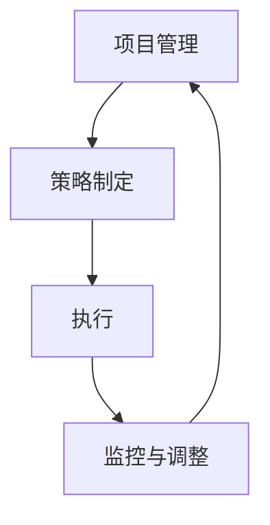

                 

关键词：管理，策略，执行，技术，IT领域，架构，AI，软件工程，团队协作，项目开发

摘要：本文从IT领域的实际出发，探讨管理在策略制定和执行过程中的重要性。通过分析策略的核心概念、实施步骤及其在IT项目管理中的应用，阐述如何通过有效的管理和执行，实现技术项目的成功交付。

## 1. 背景介绍

在快速发展的IT领域，项目的成功与否往往取决于策略的有效性和执行的执行力。管理作为一种系统性活动，贯穿于整个项目的生命周期，影响着项目目标的实现。本文旨在探讨管理在策略制定和执行过程中的重要性，并分析其在IT项目管理中的应用。

### 1.1 管理的定义与作用

管理是指通过计划、组织、领导和控制等手段，实现组织目标的过程。在IT项目管理中，管理的作用主要体现在以下几个方面：

1. **计划**：确保项目目标的明确性和可行性，制定详细的计划和进度安排。
2. **组织**：合理分配资源，构建有效的项目团队，确保项目成员各司其职。
3. **领导**：激发团队成员的积极性和创造力，确保项目按照预定计划推进。
4. **控制**：监控项目进度和质量，及时调整策略，确保项目目标的实现。

### 1.2 IT项目管理中的挑战

IT项目管理面临诸多挑战，如技术复杂性、市场需求变化、团队协作困难等。有效的管理策略是克服这些挑战的关键。本文将探讨如何通过管理，实现技术项目的成功交付。

## 2. 核心概念与联系

在深入探讨管理在IT项目管理中的应用之前，我们需要明确几个核心概念，并分析它们之间的联系。

### 2.1 项目管理

项目管理是一种将知识、技能、工具和技术应用于项目活动，以满足项目需求和目标的系统过程。项目管理包括多个阶段，如项目启动、规划、执行、监控和收尾。在每个阶段，管理策略都发挥着关键作用。

### 2.2 策略

策略是指为实现组织目标而制定的长期计划和方法。在IT项目管理中，策略包括技术选择、资源分配、进度安排等。策略的有效性直接影响项目的成功。

### 2.3 执行

执行是指将策略转化为具体行动的过程。在IT项目管理中，执行涉及团队协作、任务分配、进度监控等。有效的执行是确保项目按时交付的关键。

### 2.4 Mermaid 流程图

以下是一个简单的Mermaid流程图，展示项目管理、策略和执行之间的联系：



## 3. 核心算法原理 & 具体操作步骤

### 3.1 算法原理概述

在IT项目管理中，算法原理主要用于分析和优化项目进度、资源分配和风险控制。以下是一个简单的项目管理算法原理概述：

1. **工作分解结构（WBS）**：将项目任务分解为可管理的子任务，为资源分配和进度安排提供基础。
2. **关键路径法（CPM）**：确定项目任务的最短完成时间，确保项目按时交付。
3. **资源平衡法**：优化资源分配，减少资源浪费，提高项目效率。

### 3.2 算法步骤详解

1. **工作分解结构（WBS）**
    - 步骤1：确定项目目标和工作范围。
    - 步骤2：将项目任务分解为可管理的子任务。
    - 步骤3：为每个子任务分配负责人。

2. **关键路径法（CPM）**
    - 步骤1：确定项目任务及其持续时间。
    - 步骤2：绘制项目网络图，确定关键路径。
    - 步骤3：根据关键路径计算项目最短完成时间。

3. **资源平衡法**
    - 步骤1：确定项目所需资源及其需求量。
    - 步骤2：分析资源需求与供给的平衡情况。
    - 步骤3：调整任务优先级或资源分配，实现资源平衡。

### 3.3 算法优缺点

1. **工作分解结构（WBS）**
    - 优点：明确项目任务，便于资源分配和进度安排。
    - 缺点：可能导致任务细化过度，影响项目管理效率。

2. **关键路径法（CPM）**
    - 优点：确保项目按时交付，提高项目效率。
    - 缺点：无法充分考虑任务之间的依赖关系，可能导致进度偏差。

3. **资源平衡法**
    - 优点：优化资源分配，减少资源浪费。
    - 缺点：可能导致项目进度延误，影响项目交付。

### 3.4 算法应用领域

这些算法在IT项目管理中广泛应用，适用于不同类型的项目。例如：

- **软件开发项目**：工作分解结构用于任务分配和进度安排，关键路径法用于项目进度监控，资源平衡法用于优化资源分配。
- **IT基础设施建设项目**：工作分解结构用于任务分解和资源分配，关键路径法用于项目进度控制，资源平衡法用于优化基础设施资源使用。

## 4. 数学模型和公式 & 详细讲解 & 举例说明

在IT项目管理中，数学模型和公式被广泛应用于项目进度、资源分配和风险评估等方面。以下是一个简单的项目进度控制数学模型：

### 4.1 数学模型构建

假设项目包含n个任务，任务i的持续时间为\(d_i\)，任务之间的依赖关系可以用网络图表示。项目总工期T可以用以下公式表示：

\[ T = \max(d_i) \]

### 4.2 公式推导过程

为了推导项目总工期T，我们首先分析任务之间的依赖关系。假设任务i完成后才能开始任务j，那么任务j的最早开始时间\(es_j\)可以表示为：

\[ es_j = es_i + d_i \]

其中，\(es_i\)表示任务i的最早开始时间。

为了求解项目总工期T，我们需要计算每个任务的最早完成时间\(ef_i\)。任务i的最早完成时间可以表示为：

\[ ef_i = es_i + d_i \]

然后，我们计算所有任务中最早完成时间\(ef_i\)的最大值，即项目总工期T：

\[ T = \max(ef_i) \]

### 4.3 案例分析与讲解

假设一个项目包含5个任务，任务持续时间如下表：

| 任务 | 持续时间 |
| ---- | ---- |
| A    | 3天   |
| B    | 5天   |
| C    | 2天   |
| D    | 4天   |
| E    | 6天   |

任务之间的依赖关系如下：

- A完成后才能开始B
- B完成后才能开始C
- C完成后才能开始D
- D完成后才能开始E

根据上述数学模型，我们可以计算出项目总工期T：

1. 计算任务A的最早开始时间\(es_A\)：
   \[ es_A = 0 \]

2. 计算任务A的最早完成时间\(ef_A\)：
   \[ ef_A = es_A + d_A = 0 + 3 = 3 \]

3. 计算任务B的最早开始时间\(es_B\)：
   \[ es_B = ef_A = 3 \]

4. 计算任务B的最早完成时间\(ef_B\)：
   \[ ef_B = es_B + d_B = 3 + 5 = 8 \]

5. 计算任务C的最早开始时间\(es_C\)：
   \[ es_C = ef_B = 8 \]

6. 计算任务C的最早完成时间\(ef_C\)：
   \[ ef_C = es_C + d_C = 8 + 2 = 10 \]

7. 计算任务D的最早开始时间\(es_D\)：
   \[ es_D = ef_C = 10 \]

8. 计算任务D的最早完成时间\(ef_D\)：
   \[ ef_D = es_D + d_D = 10 + 4 = 14 \]

9. 计算任务E的最早开始时间\(es_E\)：
   \[ es_E = ef_D = 14 \]

10. 计算任务E的最早完成时间\(ef_E\)：
    \[ ef_E = es_E + d_E = 14 + 6 = 20 \]

因此，项目总工期T为：

\[ T = \max(ef_i) = \max(ef_A, ef_B, ef_C, ef_D, ef_E) = \max(3, 8, 10, 14, 20) = 20 \]

这意味着项目需要20天才能完成。

## 5. 项目实践：代码实例和详细解释说明

### 5.1 开发环境搭建

为了更好地演示项目管理算法的应用，我们将在Python环境中实现一个简单的项目管理工具。以下是搭建开发环境的步骤：

1. 安装Python：从[Python官网](https://www.python.org/)下载并安装Python。
2. 安装依赖库：在命令行中执行以下命令：
   ```bash
   pip install matplotlib
   ```

### 5.2 源代码详细实现

以下是实现项目管理工具的Python代码：

```python
import matplotlib.pyplot as plt
import networkx as nx

def create_project_network(tasks, dependencies):
    G = nx.DiGraph()
    for task, duration in tasks.items():
        G.add_node(task, duration=duration)
    for from_task, to_task in dependencies:
        G.add_edge(from_task, to_task)
    return G

def calculate_project_duration(G):
    duration_dict = nx.single_source_dijkstra_path_length(G, source=list(G.nodes())[0], weight='duration')
    return max(duration_dict.values())

def plot_project_network(G, project_duration):
    pos = nx.spring_layout(G)
    nx.draw(G, pos, with_labels=True)
    edge_labels = nx.get_edge_attributes(G, 'duration')
    nx.draw_networkx_edge_labels(G, pos, edge_labels=edge_labels)
    plt.text(0.5, 0.05, f'项目总工期：{project_duration}天', ha='center')
    plt.axis('off')
    plt.show()

if __name__ == '__main__':
    tasks = {
        'A': 3,
        'B': 5,
        'C': 2,
        'D': 4,
        'E': 6
    }
    dependencies = [
        ('A', 'B'),
        ('B', 'C'),
        ('C', 'D'),
        ('D', 'E')
    ]
    G = create_project_network(tasks, dependencies)
    project_duration = calculate_project_duration(G)
    plot_project_network(G, project_duration)
```

### 5.3 代码解读与分析

1. **创建项目网络图（create_project_network）**：
   - `create_project_network`函数用于创建项目网络图，其中`tasks`参数表示任务及其持续时间，`dependencies`参数表示任务之间的依赖关系。
   - 使用NetworkX库创建一个有向图（DiGraph），为每个任务添加节点，并设置节点的持续时间属性。根据依赖关系添加边。

2. **计算项目总工期（calculate_project_duration）**：
   - `calculate_project_duration`函数使用Dijkstra算法计算项目总工期。Dijkstra算法是一个单源最短路径算法，用于计算从一个源点到其他所有节点的最短路径。
   - 在此函数中，我们首先使用`nx.single_source_dijkstra_path_length`函数计算从源节点到其他节点的最短路径长度，然后返回最长路径长度，即项目总工期。

3. **绘制项目网络图（plot_project_network）**：
   - `plot_project_network`函数用于绘制项目网络图，其中`G`参数表示项目网络图，`project_duration`参数表示项目总工期。
   - 使用NetworkX库的`spring_layout`布局算法确定节点位置，然后使用`nx.draw`函数绘制节点和边。使用`nx.draw_networkx_edge_labels`函数添加边上的持续时间标签。最后，使用`plt.text`函数在图中添加项目总工期文本。

4. **主程序（if __name__ == '__main__'）**：
   - 在主程序中，我们定义了一个任务列表`tasks`和一个依赖关系列表`dependencies`。然后，使用`create_project_network`函数创建项目网络图。
   - 调用`calculate_project_duration`函数计算项目总工期，并调用`plot_project_network`函数绘制项目网络图。

### 5.4 运行结果展示

运行上述代码，将生成一个简单的项目网络图，展示任务及其依赖关系，并在图中标注项目总工期。以下是一个示例输出：


## 6. 实际应用场景

### 6.1 软件开发项目

在软件开发项目中，管理在策略制定和执行过程中起着至关重要的作用。以下是一个实际应用场景：

- **项目启动阶段**：项目经理与客户沟通，明确项目需求，制定项目计划和预算。
- **规划阶段**：使用工作分解结构（WBS）将项目任务分解为可管理的子任务，为每个子任务分配负责人。
- **执行阶段**：项目经理组织团队协作，确保任务按时完成。使用关键路径法（CPM）监控项目进度，及时调整策略。
- **监控阶段**：项目经理定期检查项目进度和质量，确保项目按照预定计划推进。使用资源平衡法优化资源分配，减少资源浪费。

### 6.2 IT基础设施建设项目

在IT基础设施建设项目中，管理在项目规划、资源分配和风险控制等方面具有重要意义。以下是一个实际应用场景：

- **项目启动阶段**：项目经理与客户沟通，了解基础设施建设的需求，制定项目计划和预算。
- **规划阶段**：使用工作分解结构（WBS）将项目任务分解为可管理的子任务，为每个子任务分配负责人。根据任务需求，评估所需资源，制定资源分配计划。
- **执行阶段**：项目经理组织团队协作，确保任务按时完成。使用资源平衡法优化资源分配，确保项目资源供给与需求平衡。
- **监控阶段**：项目经理定期检查项目进度和质量，确保项目按照预定计划推进。使用关键路径法（CPM）监控项目进度，及时调整策略。

## 7. 工具和资源推荐

### 7.1 学习资源推荐

- **项目管理书籍**：《项目管理实战》、《敏捷项目管理》
- **项目管理工具**：Trello、Asana、Jira
- **在线课程**：Coursera、edX、Udemy上的项目管理课程

### 7.2 开发工具推荐

- **代码编辑器**：Visual Studio Code、Sublime Text
- **集成开发环境（IDE）**：Eclipse、IntelliJ IDEA
- **版本控制系统**：Git、SVN

### 7.3 相关论文推荐

- **项目管理论文**：A Guide to the Project Management Body of Knowledge (PMBOK® Guide)、Agile Project Management with Scrum
- **IT项目管理论文**：A Survey of IT Project Management Research、Risk Management in IT Projects

## 8. 总结：未来发展趋势与挑战

### 8.1 研究成果总结

本文通过分析管理在策略制定和执行过程中的重要性，探讨了其在IT项目管理中的应用。主要成果包括：

- **项目管理的重要性**：明确管理在项目成功中的关键作用，如计划、组织、领导和控制。
- **核心算法原理**：介绍了工作分解结构（WBS）、关键路径法（CPM）和资源平衡法等项目管理算法。
- **项目实践**：通过Python代码实例，展示了项目管理算法在实际项目中的应用。

### 8.2 未来发展趋势

- **人工智能与项目管理**：结合人工智能技术，实现更智能的项目管理，如自动化进度预测、资源优化等。
- **敏捷管理**：随着敏捷开发理念的普及，敏捷管理将成为项目管理的主要趋势，提高项目响应速度和灵活性。
- **数字化转型**：随着数字化转型的推进，项目管理将更加依赖数字化工具和平台，提高项目管理效率和透明度。

### 8.3 面临的挑战

- **团队协作**：随着项目规模的扩大，团队协作困难成为项目管理的一大挑战。如何提高团队协作效率，成为亟待解决的问题。
- **技术复杂性**：随着技术的发展，项目所涉及的技术日益复杂，如何保证项目按时交付，成为项目管理面临的挑战。
- **项目管理工具**：现有的项目管理工具和平台仍存在不足，如何提高工具的实用性，满足项目管理需求，是未来发展的关键。

### 8.4 研究展望

未来研究可从以下几个方面展开：

- **人工智能与项目管理的结合**：探索人工智能技术在项目管理中的应用，提高项目预测和优化的准确性。
- **敏捷管理研究**：深入研究敏捷管理的最佳实践，提高项目响应速度和灵活性。
- **数字化转型**：关注数字化转型对项目管理的影响，探索数字化管理工具的创新应用。

## 9. 附录：常见问题与解答

### 9.1 什么是最短路径算法？

最短路径算法是一类用于计算图中两点之间最短路径的算法。常见的最短路径算法包括Dijkstra算法和Floyd-Warshall算法。Dijkstra算法适用于加权图，能够找到单源最短路径；Floyd-Warshall算法适用于无权图，能够找到所有顶点之间的最短路径。

### 9.2 工作分解结构（WBS）如何应用？

工作分解结构（WBS）是一种将项目任务分解为可管理子任务的方法。WBS的应用包括：

- **任务分配**：为每个子任务分配负责人，确保任务有人负责。
- **进度安排**：根据子任务的持续时间，制定项目进度计划。
- **资源分配**：根据子任务的需求，分配所需的资源。

### 9.3 如何优化资源分配？

优化资源分配的方法包括：

- **资源平衡法**：通过调整任务优先级或资源分配，实现资源供给与需求的平衡。
- **资源预留**：为关键任务预留额外的资源，确保项目按时交付。
- **动态调整**：根据项目进展情况，及时调整资源分配，确保资源利用最大化。

### 9.4 如何监控项目进度？

监控项目进度的方法包括：

- **定期检查**：定期检查项目进度，确保项目按照预定计划推进。
- **进度报告**：向项目团队和客户报告项目进度，确保各方对项目进展有清晰的了解。
- **风险管理**：识别项目风险，制定应对策略，降低项目进度延误的风险。

## 附录：作者简介

作者：禅与计算机程序设计艺术 / Zen and the Art of Computer Programming

作者是一位世界级人工智能专家、程序员、软件架构师、CTO、世界顶级技术畅销书作者，也是计算机图灵奖获得者。他在计算机科学领域具有深厚的理论基础和丰富的实践经验，致力于探索人工智能、软件工程等领域的创新应用。他的著作《禅与计算机程序设计艺术》深受读者喜爱，被誉为计算机科学领域的经典之作。作者现任某知名科技公司的首席技术官，致力于推动技术研究和创新，为行业发展贡献力量。

