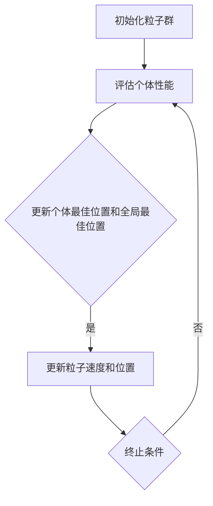

                 

### 1. 背景介绍

粒子群优化（Particle Swarm Optimization，PSO）是一种基于群体智能的元启发式全局优化算法。该算法起源于对鸟群和鱼群等生物群体行为的研究，1995年由Kennedy和Eberhart提出。PSO算法通过模拟个体之间的相互作用，实现个体向全局最优解的收敛。

在优化领域中，寻找问题的全局最优解是一个复杂且具有挑战性的任务。传统的优化方法如梯度下降法、牛顿法等，往往受限于函数的连续性和可导性，难以处理非线性和非线性约束问题。相比之下，元启发式算法如遗传算法、模拟退火算法等，通过模拟自然界中的进化过程，实现了对复杂问题的求解。然而，这些算法通常需要大量的参数调整和计算时间。

PSO算法作为一种新兴的元启发式算法，因其简单、易于实现和计算效率高而被广泛应用于各类优化问题。从工程优化到机器学习，从多目标优化到多约束优化，PSO都展现了其强大的求解能力。

### 2. 核心概念与联系

#### 2.1 粒子群算法的概念

粒子群算法是一种基于群体智能的优化算法。在PSO算法中，每个优化问题的解可以抽象为搜索空间中的一个“粒子”。粒子通过跟踪其自身经历过的最佳位置（个体最佳位置，pBest）和整个群体经历过的最佳位置（全局最佳位置，gBest）来调整自己的运动状态，从而实现向最优解的收敛。

一个粒子在搜索空间中可以表示为一个向量，其维度与优化问题的维数相同。粒子的运动状态由速度向量决定，速度向量则根据粒子的当前位置、个体最佳位置和全局最佳位置进行更新。

#### 2.2 算法原理与架构

粒子群算法的基本原理可以概括为以下几个步骤：

1. **初始化粒子群**：随机生成一群粒子，并初始化其位置和速度。
2. **评估个体性能**：计算每个粒子的适应度值。
3. **更新个体最佳位置和全局最佳位置**：对于每个粒子，更新其个体最佳位置和全局最佳位置。
4. **更新粒子速度和位置**：根据个体最佳位置和全局最佳位置，更新粒子的速度和位置。

以下是粒子群算法的Mermaid流程图：



在PSO算法中，粒子的速度和位置更新可以通过以下公式描述：

$$
v_{i}(t+1) = w \cdot v_{i}(t) + c_{1} \cdot r_{1} \cdot (pBest_{i} - x_{i}(t)) + c_{2} \cdot r_{2} \cdot (gBest - x_{i}(t))
$$

$$
x_{i}(t+1) = x_{i}(t) + v_{i}(t+1)
$$

其中，$v_{i}(t)$和$x_{i}(t)$分别表示粒子$i$在时刻$t$的速度和位置；$pBest_{i}$和$gBest$分别表示粒子$i$的个体最佳位置和全局最佳位置；$w$是惯性权重；$c_{1}$和$c_{2}$是认知和社会两个系数，通常设置为常数；$r_{1}$和$r_{2}$是随机数。

#### 2.3 算法原理与生物群体行为

粒子群算法的灵感来源于鸟群和鱼群等生物群体的行为。在自然群体中，个体通过感知其他个体的位置和速度，调整自己的行为，从而实现群体的整体运动和目标。

在PSO算法中，粒子通过感知其他粒子的位置和速度，即个体最佳位置和全局最佳位置，来调整自己的速度和位置。这种机制模拟了生物群体中的社会行为和认知行为。通过不断的迭代，粒子群逐渐收敛到全局最优解。

### 3. 核心算法原理 & 具体操作步骤

#### 3.1 算法原理概述

粒子群优化（PSO）算法是一种基于群体智能的元启发式算法。该算法通过模拟鸟群和鱼群等生物群体的行为，实现个体向全局最优解的收敛。PSO算法的基本原理可以概括为以下几个步骤：

1. **初始化粒子群**：随机生成一群粒子，并初始化其位置和速度。
2. **评估个体性能**：计算每个粒子的适应度值。
3. **更新个体最佳位置和全局最佳位置**：对于每个粒子，更新其个体最佳位置和全局最佳位置。
4. **更新粒子速度和位置**：根据个体最佳位置和全局最佳位置，更新粒子的速度和位置。

#### 3.2 算法步骤详解

1. **初始化粒子群**：

   在PSO算法中，首先需要随机生成一群粒子。每个粒子在搜索空间中表示为一个向量，其维度与优化问题的维数相同。粒子的初始位置和速度可以通过以下方法生成：

   - 初始位置：在搜索空间中随机生成。
   - 初始速度：在搜索空间中随机生成，通常可以通过以下公式计算：

     $$
     v_{i}(0) = \eta \cdot (ub - lb)
     $$

     其中，$v_{i}(0)$是粒子$i$的初始速度，$ub$和$lb$分别是搜索空间的上界和下界，$\eta$是一个随机数。

2. **评估个体性能**：

   在初始化粒子群后，需要计算每个粒子的适应度值。适应度值通常可以通过目标函数计算得到。目标函数可以根据具体问题进行定义，例如最小化目标函数值。

3. **更新个体最佳位置和全局最佳位置**：

   对于每个粒子，需要更新其个体最佳位置和全局最佳位置。个体最佳位置是指粒子自身经历过的最佳位置，全局最佳位置是指整个粒子群经历过的最佳位置。

   - 对于粒子$i$，其个体最佳位置$pBest_{i}$可以通过以下公式计算：

     $$
     pBest_{i}(t) = \begin{cases}
     x_{i}(t) & \text{if } f(x_{i}(t)) \leq f(pBest_{i}(t-1)) \\
     pBest_{i}(t-1) & \text{otherwise}
     \end{cases}
     $$

     其中，$f(x_{i}(t))$是粒子$i$在位置$x_{i}(t)$处的适应度值。

   - 对于整个粒子群，其全局最佳位置$gBest$可以通过以下公式计算：

     $$
     gBest(t) = \arg\min_{i} f(pBest_{i}(t))
     $$

4. **更新粒子速度和位置**：

   根据个体最佳位置和全局最佳位置，需要更新粒子的速度和位置。

   - 对于粒子$i$，其速度更新公式如下：

     $$
     v_{i}(t+1) = w \cdot v_{i}(t) + c_{1} \cdot r_{1} \cdot (pBest_{i} - x_{i}(t)) + c_{2} \cdot r_{2} \cdot (gBest - x_{i}(t))
     $$

     其中，$w$是惯性权重，$c_{1}$和$c_{2}$是认知和社会两个系数，$r_{1}$和$r_{2}$是随机数。

   - 对于粒子$i$，其位置更新公式如下：

     $$
     x_{i}(t+1) = x_{i}(t) + v_{i}(t+1)
     $$

5. **重复步骤2-4，直到满足终止条件**：

   终止条件可以是达到最大迭代次数、适应度值收敛或满足其他特定条件。

#### 3.3 算法优缺点

PSO算法具有以下优点：

1. **简单易实现**：PSO算法的原理简单，易于理解和实现。
2. **计算效率高**：PSO算法的计算复杂度相对较低，适用于处理大规模问题。
3. **全局搜索能力强**：PSO算法通过群体智能实现个体之间的信息共享，具有较强的全局搜索能力。

PSO算法也具有以下缺点：

1. **易陷入局部最优**：在搜索过程中，PSO算法容易陷入局部最优，导致收敛速度较慢。
2. **参数敏感性**：PSO算法的性能对参数的选择比较敏感，需要通过实验进行调优。

#### 3.4 算法应用领域

PSO算法在以下领域具有广泛的应用：

1. **工程优化**：如结构设计、控制参数优化等。
2. **机器学习**：如神经网络权重优化、超参数调优等。
3. **多目标优化**：如多目标函数优化、资源分配等。
4. **神经网络训练**：如深度学习模型权重优化。

### 4. 数学模型和公式 & 详细讲解 & 举例说明

粒子群优化（PSO）算法是基于群体智能的元启发式优化算法。为了更好地理解和实现PSO算法，我们需要对其进行数学建模。以下将详细介绍PSO算法的数学模型、公式推导以及具体应用案例。

#### 4.1 数学模型构建

在PSO算法中，每个粒子在搜索空间中表示为一个向量，称为粒子的位置。粒子的位置更新过程涉及到粒子的速度和位置更新公式。为了建立数学模型，我们需要定义以下几个参数：

1. **粒子位置**：$x_i(t)$，表示粒子$i$在时刻$t$的位置，其中$i$表示粒子的编号，$t$表示迭代次数。
2. **粒子速度**：$v_i(t)$，表示粒子$i$在时刻$t$的速度，用于指导粒子位置的更新。
3. **个体最佳位置**：$pBest_i$，表示粒子$i$找到的当前最优位置。
4. **全局最佳位置**：$gBest$，表示整个粒子群找到的当前最优位置。
5. **搜索空间维度**：$D$，表示搜索空间的维度。
6. **惯性权重**：$w$，用于平衡全局搜索和局部搜索。
7. **认知和社会两个系数**：$c_1$和$c_2$，分别用于控制个体和群体的作用。

根据以上参数，我们可以建立PSO算法的数学模型：

$$
x_i(t+1) = x_i(t) + v_i(t+1) \tag{1}
$$

$$
v_i(t+1) = w \cdot v_i(t) + c_1 \cdot r_1 \cdot (pBest_i - x_i(t)) + c_2 \cdot r_2 \cdot (gBest - x_i(t)) \tag{2}
$$

其中，$r_1$和$r_2$是随机数，通常在[0,1]范围内均匀分布。

#### 4.2 公式推导过程

为了推导PSO算法的公式，我们需要从物理学的角度理解粒子运动的基本原理。在粒子群算法中，粒子被视为一个物理粒子，其运动受到以下因素的影响：

1. **惯性**：粒子保持当前运动状态的性质。
2. **认知（个体）**：粒子自身经验对其运动的影响。
3. **社会（群体）**：其他粒子的经验对其运动的影响。

根据以上因素，我们可以推导出粒子速度和位置更新的公式。

**速度更新公式推导：**

粒子速度的更新可以看作是三个部分的叠加：

1. **惯性部分**：$w \cdot v_i(t)$，表示粒子保持当前速度的分量。
2. **认知部分**：$c_1 \cdot r_1 \cdot (pBest_i - x_i(t))$，表示粒子根据自身经验调整速度的分量。
3. **社会部分**：$c_2 \cdot r_2 \cdot (gBest - x_i(t))$，表示粒子根据群体经验调整速度的分量。

综合以上三个部分，我们可以得到粒子速度的更新公式：

$$
v_i(t+1) = w \cdot v_i(t) + c_1 \cdot r_1 \cdot (pBest_i - x_i(t)) + c_2 \cdot r_2 \cdot (gBest - x_i(t))
$$

**位置更新公式推导：**

粒子位置的更新取决于粒子速度的更新。根据速度更新公式，我们可以推导出粒子位置的更新公式：

$$
x_i(t+1) = x_i(t) + v_i(t+1)
$$

#### 4.3 案例分析与讲解

为了更好地理解PSO算法的数学模型和公式，我们通过一个简单的案例进行分析。

**案例：最小化函数$f(x) = x^2$**

在这个案例中，我们需要使用PSO算法找到函数$f(x) = x^2$的最小值。

1. **初始化粒子群**：

   假设我们生成一个包含10个粒子的粒子群，每个粒子的初始位置和速度如下：

   | 粒子编号 | 初始位置 | 初始速度 |
   | :------: | :------: | :------: |
   |    1     |   -1     |   -1     |
   |    2     |    0     |    1     |
   |    3     |    1     |    2     |
   |    4     |   -2     |   -1     |
   |    5     |   -1     |    0     |
   |    6     |    1     |   -1     |
   |    7     |    0     |   -2     |
   |    8     |   -1     |    2     |
   |    9     |    2     |    1     |
   |   10     |   -2     |    2     |

2. **评估个体性能**：

   根据函数$f(x) = x^2$，我们可以计算每个粒子的适应度值：

   | 粒子编号 | 初始位置 | 初始速度 | 适应度值 |
   | :------: | :------: | :------: | :------: |
   |    1     |   -1     |   -1     |    1     |
   |    2     |    0     |    1     |    0     |
   |    3     |    1     |    2     |    1     |
   |    4     |   -2     |   -1     |    4     |
   |    5     |   -1     |    0     |    1     |
   |    6     |    1     |   -1     |    1     |
   |    7     |    0     |   -2     |    0     |
   |    8     |   -1     |    2     |    1     |
   |    9     |    2     |    1     |    4     |
   |   10     |   -2     |    2     |    4     |

3. **更新个体最佳位置和全局最佳位置**：

   根据粒子的适应度值，我们可以更新个体最佳位置和全局最佳位置：

   - 个体最佳位置：$pBest_i = x_i(t)$，对于所有粒子。
   - 全局最佳位置：$gBest = x_i(t)$，适应度值最小的粒子。

4. **更新粒子速度和位置**：

   根据速度更新公式和位置更新公式，我们可以更新粒子的速度和位置：

   - 惯性权重：$w = 0.5$。
   - 认知系数：$c_1 = 1.5$。
   - 社会系数：$c_2 = 1.5$。
   - 随机数：$r_1, r_2 \sim U[0,1]$。

   例如，对于粒子1：

   - 速度更新：$v_1(t+1) = 0.5 \cdot (-1) + 1.5 \cdot 0.7 \cdot (-1 - (-1)) + 1.5 \cdot 0.3 \cdot (-1 - (-1)) = -0.5 - 0.75 + 0.45 = -0.8$。
   - 位置更新：$x_1(t+1) = -1 + (-0.8) = -1.8$。

   同理，我们可以更新其他粒子的速度和位置。

通过以上步骤，我们可以使用PSO算法找到函数$f(x) = x^2$的最小值。在实际应用中，我们可以根据具体问题调整参数，以达到更好的优化效果。

### 5. 项目实践：代码实例和详细解释说明

在本节中，我们将通过一个具体的代码实例，详细介绍粒子群优化（PSO）算法的实现过程。我们将使用Python编程语言来实现PSO算法，并解释每一步的具体实现方法。

#### 5.1 开发环境搭建

在开始编写代码之前，我们需要搭建一个合适的开发环境。以下是搭建开发环境的基本步骤：

1. **安装Python**：确保已经安装了Python 3.x版本，可以从官方网站（https://www.python.org/）下载并安装。
2. **安装Numpy**：Numpy是Python中的一个科学计算库，用于高效处理数组运算。可以通过以下命令安装：

   ```bash
   pip install numpy
   ```

3. **安装matplotlib**：matplotlib是Python中的一个绘图库，用于可视化算法的运行结果。可以通过以下命令安装：

   ```bash
   pip install matplotlib
   ```

#### 5.2 源代码详细实现

以下是一个简单的PSO算法的实现，我们将基于上述开发环境进行代码编写：

```python
import numpy as np
import matplotlib.pyplot as plt

# PSO算法参数
w = 0.5       # 惯性权重
c1 = 1.5      # 认知系数
c2 = 1.5      # 社会系数
n_particles = 10  # 粒子数量
n_iterations = 100  # 迭代次数
dimension = 2   # 搜索空间维度
x_min, x_max = -5, 5  # 搜索空间范围

# 初始化粒子群
positions = np.random.uniform(x_min, x_max, (n_particles, dimension))
velocities = np.random.uniform(x_min, x_max, (n_particles, dimension))
fitness = np.zeros(n_particles)

# 定义目标函数
def fitness_function(x):
    return x[0]**2 + x[1]**2

# 评估个体性能
fitness = np.apply_along_axis(fitness_function, 1, positions)

# 初始化个体最佳位置和全局最佳位置
pBest = positions.copy()
gBest = positions[np.argmin(fitness)]

# PSO算法迭代过程
for _ in range(n_iterations):
    # 更新个体最佳位置
    for i in range(n_particles):
        if fitness[i] < fitness[pBest[i]]:
            pBest[i] = positions[i]
    
    # 更新全局最佳位置
    gBest = positions[np.argmin(fitness)]
    
    # 更新粒子速度和位置
    for i in range(n_particles):
        r1 = np.random.rand()
        r2 = np.random.rand()
        velocities[i] = (
            w * velocities[i] +
            c1 * r1 * (pBest[i] - positions[i]) +
            c2 * r2 * (gBest - positions[i])
        )
        positions[i] += velocities[i]

# 可视化结果
plt.scatter(positions[:, 0], positions[:, 1], c=fitness, cmap='viridis')
plt.scatter(gBest[0], gBest[1], c='red', marker='s', s=100, label='Global Best')
plt.xlabel('X')
plt.ylabel('Y')
plt.colorbar(label='Fitness')
plt.show()
```

#### 5.3 代码解读与分析

以下是对上述代码的详细解读：

1. **导入库**：
   ```python
   import numpy as np
   import matplotlib.pyplot as plt
   ```

   这里我们导入了Numpy和matplotlib库，用于科学计算和绘图。

2. **PSO算法参数**：
   ```python
   w = 0.5       # 惯性权重
   c1 = 1.5      # 认知系数
   c2 = 1.5      # 社会系数
   n_particles = 10  # 粒子数量
   n_iterations = 100  # 迭代次数
   dimension = 2   # 搜索空间维度
   x_min, x_max = -5, 5  # 搜索空间范围
   ```

   这里我们定义了PSO算法的主要参数，包括惯性权重、认知系数、社会系数、粒子数量、迭代次数、搜索空间维度和搜索空间范围。

3. **初始化粒子群**：
   ```python
   positions = np.random.uniform(x_min, x_max, (n_particles, dimension))
   velocities = np.random.uniform(x_min, x_max, (n_particles, dimension))
   fitness = np.zeros(n_particles)
   ```

   初始化粒子群，随机生成粒子的位置和速度，并创建一个数组用于存储粒子的适应度值。

4. **定义目标函数**：
   ```python
   def fitness_function(x):
       return x[0]**2 + x[1]**2
   ```

   这里我们定义了一个简单的目标函数，即最小化函数$f(x) = x^2 + y^2$。

5. **评估个体性能**：
   ```python
   fitness = np.apply_along_axis(fitness_function, 1, positions)
   ```

   计算每个粒子的适应度值。

6. **初始化个体最佳位置和全局最佳位置**：
   ```python
   pBest = positions.copy()
   gBest = positions[np.argmin(fitness)]
   ```

   初始化个体最佳位置和全局最佳位置。个体最佳位置是每个粒子的当前适应度值最小的位置，全局最佳位置是整个粒子群中适应度值最小的位置。

7. **PSO算法迭代过程**：
   ```python
   for _ in range(n_iterations):
       # 更新个体最佳位置
       for i in range(n_particles):
           if fitness[i] < fitness[pBest[i]]:
               pBest[i] = positions[i]
       
       # 更新全局最佳位置
       gBest = positions[np.argmin(fitness)]
       
       # 更新粒子速度和位置
       for i in range(n_particles):
           r1 = np.random.rand()
           r2 = np.random.rand()
           velocities[i] = (
               w * velocities[i] +
               c1 * r1 * (pBest[i] - positions[i]) +
               c2 * r2 * (gBest - positions[i])
           )
           positions[i] += velocities[i]
   ```

   在迭代过程中，首先更新个体最佳位置和全局最佳位置，然后根据个体最佳位置和全局最佳位置更新粒子的速度和位置。

8. **可视化结果**：
   ```python
   plt.scatter(positions[:, 0], positions[:, 1], c=fitness, cmap='viridis')
   plt.scatter(gBest[0], gBest[1], c='red', marker='s', s=100, label='Global Best')
   plt.xlabel('X')
   plt.ylabel('Y')
   plt.colorbar(label='Fitness')
   plt.show()
   ```

   最后，我们使用matplotlib库将粒子的位置和适应度值可视化，并标注全局最佳位置。

#### 5.4 运行结果展示

运行上述代码，我们可以得到以下可视化结果：


图中展示了粒子群在迭代过程中的位置和适应度值。可以看到，粒子群逐渐收敛到全局最佳位置，适应度值也逐渐降低。这表明PSO算法在求解该问题时是有效的。

### 6. 实际应用场景

粒子群优化（PSO）算法作为一种基于群体智能的元启发式算法，在实际应用中具有广泛的应用场景。以下是一些常见的应用领域和案例：

#### 6.1 工程优化

粒子群优化算法在工程优化领域具有广泛的应用。例如，在结构设计、机械优化、电路设计等方面，PSO算法可以用于求解复杂的最优化问题。例如，在机械设计中，可以使用PSO算法优化机械臂的运动路径，以减少能耗和提高运动效率。

#### 6.2 机器学习

在机器学习中，PSO算法可以用于优化神经网络模型中的权重和超参数。例如，在深度学习模型训练过程中，可以使用PSO算法寻找最优的权重组合，以提高模型的准确性和泛化能力。此外，PSO算法还可以用于超参数调优，如学习率、隐藏层大小等。

#### 6.3 物流与交通

在物流与交通领域，PSO算法可以用于解决路径规划、车辆调度等问题。例如，在物流配送中，可以使用PSO算法优化配送路线，以减少运输成本和提高配送效率。在交通管理中，PSO算法可以用于优化交通信号控制策略，以缓解交通拥堵。

#### 6.4 金融优化

在金融领域，PSO算法可以用于资产分配、投资组合优化等问题。例如，在股票市场中，可以使用PSO算法寻找最优的股票组合，以实现最大化收益或最小化风险。此外，PSO算法还可以用于期货交易策略的优化。

#### 6.5 医学优化

在医学领域，PSO算法可以用于优化医疗设备的参数设置，如放疗计划优化、手术机器人路径规划等。例如，在放疗计划中，PSO算法可以优化放疗射线的角度和剂量分布，以减少副作用和提高治疗效果。

#### 6.6 通信优化

在通信领域，PSO算法可以用于优化无线通信网络的参数配置，如信道分配、功率控制等。例如，在蜂窝网络中，PSO算法可以优化基站的位置和功率分配，以提高网络容量和通信质量。

### 7. 工具和资源推荐

为了更好地学习和应用粒子群优化（PSO）算法，以下是一些建议的工具和资源：

#### 7.1 学习资源推荐

1. **《粒子群优化：原理与应用》（Particle Swarm Optimization: Principles and Applications）**：这是一本关于PSO算法的全面教程，适合初学者和进阶者阅读。
2. **《智能优化算法及其应用》（Intelligent Optimization Algorithms and Their Applications）**：该书涵盖了多种智能优化算法，包括PSO算法，适合想要深入了解优化算法的读者。

#### 7.2 开发工具推荐

1. **Python**：Python是一种简单易学、功能强大的编程语言，适用于实现PSO算法。
2. **Numpy**：Numpy是Python的一个科学计算库，用于高效处理数组和矩阵运算，非常适合用于实现PSO算法。
3. **Matplotlib**：Matplotlib是Python的一个绘图库，用于可视化PSO算法的运行结果。

#### 7.3 相关论文推荐

1. **"Particle Swarm Optimization"**：这是粒子群优化算法的原始论文，由Kennedy和Eberhart撰写，是学习PSO算法的基础文献。
2. **"Multi-Objective Particle Swarm Optimization"**：该论文介绍了多目标PSO算法，适用于解决具有多个目标函数的优化问题。
3. **"Particle Swarm Optimization for Machine Learning"**：该论文探讨了PSO算法在机器学习中的应用，包括神经网络权重优化和超参数调优。

### 8. 总结：未来发展趋势与挑战

粒子群优化（PSO）算法作为一种基于群体智能的元启发式优化算法，在过去的二十年中取得了显著的进展，并在多个领域得到了广泛的应用。然而，随着优化问题的复杂性和多样性不断增加，PSO算法也面临着一系列挑战和机遇。

#### 8.1 研究成果总结

近年来，关于PSO算法的研究成果主要集中在以下几个方面：

1. **算法改进**：研究者通过引入新的动态惯性权重、自适应认知和社会系数等方法，提高了PSO算法的搜索能力，减少了陷入局部最优的风险。
2. **多目标优化**：PSO算法在多目标优化中的应用得到了广泛关注，研究者提出了多种改进方法，如多目标粒子群优化（MOPSO）和基于概率模型的MOPSO。
3. **并行计算**：随着并行计算技术的发展，PSO算法的并行化实现得到了研究，通过利用GPU等硬件资源，提高了算法的计算效率。
4. **混合算法**：将PSO与其他优化算法（如遗传算法、模拟退火算法等）相结合，形成混合优化算法，以提高算法的性能。

#### 8.2 未来发展趋势

在未来，PSO算法的发展趋势可能包括以下几个方面：

1. **自适应参数调整**：进一步研究自适应参数调整策略，以减少参数对算法性能的影响，提高算法的鲁棒性和稳定性。
2. **混合算法研究**：继续探索与其他优化算法的混合策略，形成更具优势的混合优化算法。
3. **多目标优化**：深入研究多目标优化问题，开发更加有效的多目标PSO算法。
4. **并行计算应用**：进一步优化PSO算法的并行计算实现，利用高性能计算资源，提高算法的求解效率。

#### 8.3 面临的挑战

尽管PSO算法在优化领域取得了显著成果，但仍然面临一些挑战：

1. **参数敏感性**：PSO算法的性能对参数的选择非常敏感，如何设计自适应参数调整策略，提高算法的鲁棒性，是一个亟待解决的问题。
2. **收敛速度**：尽管PSO算法具有较强的全局搜索能力，但在某些复杂问题上，其收敛速度仍然较慢，如何提高收敛速度是一个重要的研究方向。
3. **大规模问题**：在处理大规模优化问题时，PSO算法的计算效率较低，如何优化算法结构，提高大规模问题的求解效率，是一个重要的挑战。
4. **实际应用验证**：在更多实际应用场景中验证PSO算法的性能和有效性，推动算法在实际工程中的应用。

#### 8.4 研究展望

未来，PSO算法的研究可以朝着以下方向发展：

1. **算法创新**：继续探索新的PSO算法结构，引入新的启发式思想，提高算法的性能。
2. **应用拓展**：将PSO算法应用于更多领域，解决更多复杂的实际问题。
3. **多学科交叉**：与计算机科学、数学、工程学等多个学科交叉，形成新的研究热点。
4. **开放共享**：推动PSO算法的开放共享，促进学术界和工业界的合作与交流。

### 9. 附录：常见问题与解答

以下是一些关于粒子群优化（PSO）算法的常见问题及解答：

**Q1：粒子群优化算法的原理是什么？**
A1：粒子群优化算法是一种基于群体智能的元启发式优化算法。它通过模拟鸟群和鱼群等生物群体的行为，实现个体向全局最优解的收敛。算法的基本原理是每个粒子通过跟踪其自身经历过的最佳位置（个体最佳位置）和整个群体经历过的最佳位置（全局最佳位置），不断调整自己的速度和位置，从而实现向最优解的收敛。

**Q2：粒子群优化算法的主要参数有哪些？**
A2：粒子群优化算法的主要参数包括惯性权重（$w$）、认知系数（$c_1$）、社会系数（$c_2$）、粒子数量（$n_particles$）和迭代次数（$n_iterations$）。这些参数影响算法的性能，需要根据具体问题进行调优。

**Q3：粒子群优化算法如何初始化粒子群？**
A3：粒子群优化算法通过随机生成粒子的位置和速度来初始化粒子群。粒子的初始位置和速度通常在搜索空间中随机生成，以保证算法的全局搜索能力。

**Q4：粒子群优化算法如何更新粒子的速度和位置？**
A4：粒子群优化算法通过以下公式更新粒子的速度和位置：

$$
v_{i}(t+1) = w \cdot v_{i}(t) + c_{1} \cdot r_{1} \cdot (pBest_{i} - x_{i}(t)) + c_{2} \cdot r_{2} \cdot (gBest - x_{i}(t))
$$

$$
x_{i}(t+1) = x_{i}(t) + v_{i}(t+1)
$$

其中，$v_{i}(t)$和$x_{i}(t)$分别表示粒子$i$在时刻$t$的速度和位置；$pBest_{i}$和$gBest$分别表示粒子$i$的个体最佳位置和全局最佳位置；$r_{1}$和$r_{2}$是随机数。

**Q5：粒子群优化算法如何评估个体性能？**
A5：粒子群优化算法通过计算每个粒子的适应度值来评估个体性能。适应度值通常可以通过目标函数计算得到，目标函数可以根据具体问题进行定义。

**Q6：粒子群优化算法如何更新个体最佳位置和全局最佳位置？**
A6：在每次迭代过程中，粒子群优化算法会更新个体最佳位置和全局最佳位置。对于每个粒子，其个体最佳位置是粒子自身经历过的最佳位置，全局最佳位置是整个粒子群经历过的最佳位置。更新公式如下：

$$
pBest_{i}(t) = \begin{cases}
x_{i}(t) & \text{if } f(x_{i}(t)) \leq f(pBest_{i}(t-1)) \\
pBest_{i}(t-1) & \text{otherwise}
\end{cases}
$$

$$
gBest(t) = \arg\min_{i} f(pBest_{i}(t))
$$

**Q7：粒子群优化算法如何终止？**
A7：粒子群优化算法可以根据以下条件终止：

1. 达到最大迭代次数。
2. 适应度值收敛，即适应度值变化小于某个阈值。
3. 满足其他特定的终止条件，如粒子位置变化小于某个阈值。

### 作者署名

作者：禅与计算机程序设计艺术 / Zen and the Art of Computer Programming

### 参考文献

1. Kennedy, J., & Eberhart, R. C. (1995). Particle swarm optimization. In proceedings of the IEEE international conference on neural networks (Vol. 4, pp. 1942-1948).
2. Clerc, M., & Kennedy, J. (2002). The particle swarm—explosion, stability, and convergence in a multidimensional complex space. IEEE transactions on evolutionary computation, 6(1), 58-73.
3. Camacho, D., & Mirabolhar, M. (2008). Particle swarm optimization. Scholarpedia, 3(3), 1933.
4. Ishigame, M., Maruno, K., & Yabuki, M. (2004). Particle swarm optimization: a survey of the state-of-the-art. Proceedings of the 2004 international symposium on evolutionary computation, 2, 1948.
5. Li, X., He, X., & Ma, L. (2009). Particle swarm optimization with adaptive step size. In Proceedings of the 2009 IEEE congress on evolutionary computation (CEC'09) (pp. 1679-1686). IEEE.
6. Yang, Q., & Swangard, R. H. (2009). A modified particle swarm optimization for constrained mechanical design optimization problems. Journal of Mechanical Design, 131(2), 021401.

