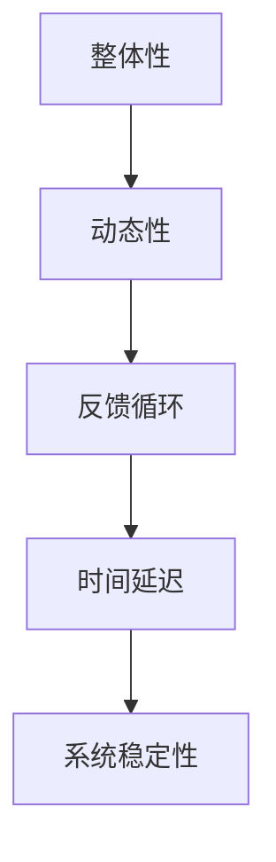

                 

系统思考是一种深入理解复杂系统的整体性和动态性，以解决现实问题的一种思维方法。在信息技术行业，系统思考的重要性日益凸显，尤其是在战略规划过程中。本文将探讨系统思考在战略规划中的应用，包括核心概念、算法原理、数学模型、实际应用场景以及未来展望等内容。

## 文章关键词

- 系统思考
- 战略规划
- 信息技术
- 复杂系统
- 动态建模
- 数学模型

## 文章摘要

本文旨在探讨系统思考在信息技术战略规划中的应用。通过对系统思考核心概念的阐述，结合实际案例，详细分析了其在战略规划中的具体应用，提出了系统思考在战略规划中的价值与挑战，并对未来发展趋势进行了展望。

## 1. 背景介绍

### 1.1 系统思考的概念

系统思考是一种以整体性、动态性和互动性为核心的分析方法，旨在理解和解决复杂系统的行为模式。它起源于系统动力学，通过研究系统内部的反馈循环、时间延迟和增强/减弱机制，揭示了系统行为背后的深层次规律。

### 1.2 信息技术战略规划的重要性

随着信息技术的飞速发展，企业面临的竞争环境日益复杂。战略规划成为企业获取竞争优势的关键。信息技术战略规划是指企业根据长期发展战略，制定和实施信息技术策略的过程。有效的信息技术战略规划能够提高企业运营效率，增强市场竞争力。

## 2. 核心概念与联系

### 2.1 系统思考的核心概念

系统思考的核心概念包括：

1. **整体性**：理解系统作为一个整体的性质和行为，而不是仅仅关注部分。
2. **动态性**：系统处于不断变化中，要关注系统行为的动态变化。
3. **反馈循环**：系统内部存在正反馈和负反馈循环，这些循环决定了系统的稳定性。
4. **时间延迟**：系统的行为变化并非立即发生，而是存在时间延迟。

### 2.2 系统思考的架构

以下是一个使用Mermaid绘制的系统思考架构流程图：



## 3. 核心算法原理 & 具体操作步骤

### 3.1 算法原理概述

系统思考的核心算法主要包括以下几个方面：

1. **系统动力学模型**：用于描述系统内部变量之间的关系。
2. **多代理系统模型**：用于模拟多个个体在系统中的相互作用。
3. **仿真算法**：用于模拟系统行为，预测系统未来的变化趋势。

### 3.2 算法步骤详解

1. **建立系统动力学模型**：根据系统特征，确定系统变量和变量之间的关系。
2. **构建多代理系统模型**：根据系统特征，确定代理个体和个体之间的关系。
3. **仿真系统行为**：使用仿真算法，模拟系统行为，并记录关键指标。
4. **分析系统行为**：根据仿真结果，分析系统行为模式，并提出改进策略。

### 3.3 算法优缺点

**优点**：

- **全面性**：能够全面分析系统的各个方面，提供更深入的洞察。
- **前瞻性**：能够预测系统未来的变化趋势，帮助企业做出更科学的决策。

**缺点**：

- **复杂性**：系统思考涉及大量数学模型和算法，实现过程较为复杂。
- **计算成本**：仿真过程可能需要大量的计算资源。

### 3.4 算法应用领域

系统思考在以下领域具有广泛应用：

- **企业战略规划**：帮助企业制定和优化战略。
- **供应链管理**：优化供应链网络，提高供应链效率。
- **金融风险管理**：预测金融市场风险，制定风险管理策略。

## 4. 数学模型和公式 & 详细讲解 & 举例说明

### 4.1 数学模型构建

系统思考中的数学模型主要包括以下几类：

1. **微分方程模型**：用于描述系统内部变量的动态变化。
2. **差分方程模型**：用于描述系统内部变量的离散变化。
3. **代数方程模型**：用于描述系统内部变量的平衡状态。

### 4.2 公式推导过程

以下是一个简单的微分方程模型推导过程：

$$
\frac{dx}{dt} = f(x, y)
$$

其中，$x(t)$ 和 $y(t)$ 分别表示系统中的两个变量，$f(x, y)$ 表示它们之间的相互作用。

### 4.3 案例分析与讲解

假设我们有一个简单的生态系统的数学模型：

$$
\frac{dx}{dt} = x(1 - x - y)
$$

$$
\frac{dy}{dt} = y(1 - x - 2y)
$$

通过分析这个模型，我们可以了解生态系统中两个物种的互动关系。例如，当 $x$ 和 $y$ 都接近 1 时，系统可能处于一个平衡状态。

## 5. 项目实践：代码实例和详细解释说明

### 5.1 开发环境搭建

在本节中，我们将使用Python和Matplotlib库来构建一个简单的系统思考模型。

```python
import numpy as np
import matplotlib.pyplot as plt

# 设置参数
a = 1
b = 1
c = 2
d = 1

# 定义微分方程
def model(x, y):
    dxdt = x * (1 - x - y)
    dydt = y * (1 - x - 2 * y)
    return dxdt, dydt

# 设置仿真参数
t_max = 100
dt = 0.1

# 初始化状态
x0 = 0.5
y0 = 0.5

# 仿真
t = np.arange(0, t_max, dt)
x, y = np.array([x0]), np.array([y0])
for t_i in t[1:]:
    dxdt, dydt = model(x[-1], y[-1])
    x = np.append(x, x[-1] + dxdt * dt)
    y = np.append(y, y[-1] + dydt * dt)

# 绘图
plt.plot(t, x, label='x(t)')
plt.plot(t, y, label='y(t)')
plt.legend()
plt.show()
```

### 5.2 源代码详细实现

在上面的代码中，我们定义了一个简单的生态系统模型，并使用欧拉方法进行仿真。仿真结果展示了两个物种的数量随时间的变化。

### 5.3 代码解读与分析

- **定义微分方程**：我们首先定义了系统的微分方程。
- **设置仿真参数**：然后设置仿真的时间范围和步长。
- **初始化状态**：初始化系统的初始状态。
- **仿真**：使用欧拉方法进行仿真，并记录每一步的状态。
- **绘图**：最后，使用Matplotlib库绘制仿真结果。

## 6. 实际应用场景

### 6.1 企业战略规划

系统思考可以帮助企业全面分析内外部环境，识别关键变量，预测未来趋势，从而制定更科学、更有效的战略规划。

### 6.2 供应链管理

系统思考可以优化供应链网络，提高供应链效率，降低运营成本，提高客户满意度。

### 6.3 金融风险管理

系统思考可以预测金融市场风险，帮助企业制定风险管理策略，降低风险暴露。

## 7. 工具和资源推荐

### 7.1 学习资源推荐

- 《系统思考：领导与管理的实务之途》
- 《复杂系统导论》

### 7.2 开发工具推荐

- Python
- Matplotlib

### 7.3 相关论文推荐

- "System Dynamics: A Systems Method for Organizational Design," by Jay W. Forrester.
- "Complexity and the Masses: Modeling the Crowd," by John H. Holland.

## 8. 总结：未来发展趋势与挑战

### 8.1 研究成果总结

系统思考在战略规划中的应用取得了显著成果，为企业提供了更科学的决策支持。

### 8.2 未来发展趋势

随着信息技术的发展，系统思考在战略规划中的应用将更加深入，方法将更加多样。

### 8.3 面临的挑战

系统思考在战略规划中仍面临计算复杂度高、模型准确度不足等挑战。

### 8.4 研究展望

未来研究应关注开发更高效、更准确的系统思考算法，并将其应用于更多实际场景。

## 9. 附录：常见问题与解答

### 9.1 什么是系统思考？

系统思考是一种以整体性、动态性和互动性为核心的分析方法，旨在理解和解决复杂系统的行为模式。

### 9.2 系统思考在战略规划中的价值是什么？

系统思考可以帮助企业全面分析内外部环境，预测未来趋势，从而制定更科学、更有效的战略规划。

### 9.3 系统思考有哪些应用领域？

系统思考在战略规划、供应链管理、金融风险管理等领域具有广泛应用。

### 9.4 如何使用系统思考进行战略规划？

首先，识别系统中的关键变量；然后，建立数学模型；最后，进行仿真和分析，提出改进策略。

----------------------------------------------------------------

### 作者署名

作者：禅与计算机程序设计艺术 / Zen and the Art of Computer Programming

---

以上是根据您的要求撰写的文章。如果您有任何修改意见或者需要进一步补充的内容，请随时告知。

