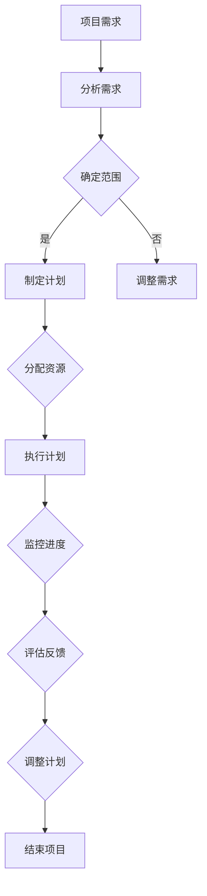

                 

关键词：系统思考、项目管理、复杂性、软件工程、系统集成、团队协作、决策优化

> 摘要：本文探讨了系统思考在复杂项目管理中的重要性。系统思考作为一种分析问题的方法论，能够帮助项目经理更好地理解和应对项目的复杂性。文章首先介绍了系统思考的基本概念，然后分析了其在项目管理中的应用，并提出了如何在实际项目中运用系统思考的策略。最后，文章总结了系统思考对于项目管理的深远影响，以及对未来项目管理和软件工程领域的启示。

## 1. 背景介绍

在当今的IT行业中，项目管理面临着前所未有的复杂性。随着项目规模的扩大、技术的不断进步以及客户需求的多样化，传统的项目管理方法往往难以应对这种复杂性。在这种背景下，系统思考（Systems Thinking）作为一种强大的分析工具，逐渐受到项目经理和软件工程师的青睐。

系统思考起源于系统动力学，它强调从整体和动态的角度理解系统的行为。在项目管理中，系统思考可以帮助项目经理更全面地了解项目的各个方面，发现潜在的问题和瓶颈，从而做出更明智的决策。本文将探讨系统思考在项目管理中的重要性，以及如何将其应用于复杂项目的管理中。

## 2. 核心概念与联系

### 2.1 系统思考的基本概念

系统思考是一种方法论，它关注系统的整体性和动态性。系统可以被视为由相互关联的元素组成的复杂网络，这些元素通过相互关系和反馈机制相互作用，从而产生系统的行为。

- **整体性**：系统思考强调系统的各个部分不是孤立存在的，而是相互关联的。理解系统的整体行为需要考虑各个部分之间的相互作用。
- **动态性**：系统行为是随时间变化的。系统思考关注系统的动态演化过程，以及这些演化对系统行为的影响。

### 2.2 系统思考在项目管理中的应用

在项目管理中，系统思考可以帮助项目经理从以下方面理解和应对项目的复杂性：

- **全局视角**：系统思考提供了一种全局视角，使项目经理能够从整体上理解项目的各个方面，包括技术、人员、资源等。
- **反馈循环**：项目中的决策和行动往往会引发反馈，这些反馈可能会影响项目的未来。系统思考帮助项目经理识别这些反馈循环，并评估其对项目的影响。
- **适应性**：系统思考强调系统的动态性，使项目经理能够更好地适应项目中的不确定性，及时调整策略。

### 2.3 Mermaid 流程图

下面是一个简化的Mermaid流程图，展示了系统思考在项目管理中的应用。



### 2.4 系统思考的优势

- **全面性**：系统思考能够帮助项目经理全面地分析项目，避免片面地看待问题。
- **前瞻性**：系统思考使项目经理能够预测未来的问题，并提前采取措施。
- **适应性**：系统思考强调系统的动态性，有助于项目经理应对项目中的不确定性。

## 3. 核心算法原理 & 具体操作步骤

### 3.1 算法原理概述

系统思考在项目管理中的应用可以看作是一种算法，其核心思想是利用系统模型来模拟和分析项目行为。以下是系统思考的基本原理和步骤：

- **系统建模**：建立项目系统的数学模型，包括系统的元素、关系和反馈机制。
- **模拟分析**：使用系统模型模拟项目执行过程，分析系统的行为和性能。
- **决策支持**：基于模拟结果，为项目经理提供决策支持，优化项目管理和决策。

### 3.2 算法步骤详解

1. **需求分析**：收集项目需求，确定项目的目标和范围。
2. **系统建模**：根据需求分析结果，建立项目系统的数学模型。
3. **模拟分析**：使用系统模型模拟项目执行过程，分析系统的行为和性能。
4. **决策支持**：根据模拟结果，评估项目风险和机会，为项目经理提供决策支持。
5. **实施决策**：根据决策支持结果，制定和实施项目计划。

### 3.3 算法优缺点

**优点**：
- **全面性**：系统能够全面地分析项目，考虑各个方面的因素。
- **前瞻性**：系统能够预测项目未来的行为和问题，提前做好准备。
- **适应性**：系统能够适应项目中的不确定性，帮助项目经理调整策略。

**缺点**：
- **复杂性**：建立系统模型需要深入了解项目和技术，可能增加项目管理的复杂性。
- **计算成本**：模拟分析过程可能需要大量的计算资源，对项目经理的要求较高。

### 3.4 算法应用领域

系统思考在项目管理中的应用非常广泛，包括但不限于以下几个方面：

- **项目规划**：帮助项目经理制定更合理的项目计划，降低风险。
- **资源分配**：优化项目资源的分配，提高资源利用效率。
- **风险管理**：识别项目风险，评估风险的影响，制定风险应对策略。
- **绩效评估**：评估项目执行过程中的性能，发现问题和改进点。

## 4. 数学模型和公式 & 详细讲解 & 举例说明

### 4.1 数学模型构建

系统思考中的数学模型通常包括以下要素：

- **状态变量**：描述系统状态的变量，如项目进度、资源利用率等。
- **关系方程**：描述状态变量之间关系的方程，如项目进度与资源利用率的关系。
- **反馈机制**：描述系统内部反馈机制的方程，如项目风险与决策反馈的关系。

以下是一个简单的数学模型示例：

$$
P(t) = P_0 + \sum_{i=1}^{n} R_i \cdot F_i(t)
$$

其中，$P(t)$ 表示项目进度，$P_0$ 表示初始进度，$R_i$ 表示第 $i$ 个资源的利用率，$F_i(t)$ 表示第 $i$ 个资源的反馈函数。

### 4.2 公式推导过程

以项目进度的数学模型为例，推导过程如下：

1. **确定状态变量**：项目进度 $P(t)$ 和资源利用率 $R_i$。
2. **建立关系方程**：项目进度 $P(t)$ 是资源利用率 $R_i$ 的函数。
3. **确定反馈机制**：项目进度 $P(t)$ 的变化会影响资源利用率 $R_i$。

根据以上要素，可以建立如下数学模型：

$$
P(t) = P_0 + \sum_{i=1}^{n} R_i \cdot F_i(t)
$$

其中，$F_i(t)$ 是资源利用率 $R_i$ 的反馈函数，可以通过历史数据和专家经验确定。

### 4.3 案例分析与讲解

假设一个软件开发项目，项目进度与资源利用率之间的关系如下：

$$
P(t) = P_0 + 0.5 \cdot R(t)
$$

其中，$R(t)$ 表示资源利用率。

假设项目初始进度为 $P_0 = 10$，资源利用率 $R(t) = 0.8$，则项目进度 $P(t) = 10 + 0.5 \cdot 0.8 = 11$。

通过这个简单的例子，我们可以看到系统思考如何帮助我们理解和预测项目进度。在实际项目中，我们可以根据实际情况调整公式中的参数，以更准确地模拟项目行为。

## 5. 项目实践：代码实例和详细解释说明

### 5.1 开发环境搭建

为了演示系统思考在项目管理中的应用，我们将使用Python编程语言来构建一个简单的项目模拟器。首先，确保您的开发环境中安装了Python 3.x版本。

1. **安装Python**：从官方网站（https://www.python.org/）下载并安装Python。
2. **安装依赖库**：使用pip安装必要的依赖库，如NumPy、SciPy等。

```bash
pip install numpy scipy matplotlib
```

### 5.2 源代码详细实现

以下是一个简单的项目模拟器，用于模拟项目进度和资源利用率之间的关系。

```python
import numpy as np
import matplotlib.pyplot as plt

# 定义项目进度的数学模型
def project_progress(P0, R, t):
    return P0 + R * t

# 模拟项目进度
def simulate_project(P0, R, t_max):
    t = np.arange(0, t_max+1)
    P = project_progress(P0, R, t)
    return t, P

# 绘制项目进度曲线
def plot_progress(t, P):
    plt.plot(t, P)
    plt.xlabel('Time')
    plt.ylabel('Project Progress')
    plt.title('Project Progress Simulation')
    plt.show()

# 参数设置
P0 = 10  # 初始进度
R = 0.5  # 资源利用率
t_max = 20  # 模拟时间

# 模拟项目
t, P = simulate_project(P0, R, t_max)

# 绘制结果
plot_progress(t, P)
```

### 5.3 代码解读与分析

上述代码实现了一个简单的项目模拟器，用于模拟项目进度和资源利用率之间的关系。以下是代码的解读和分析：

- **项目进度的数学模型**：`project_progress` 函数用于计算项目进度。它接收初始进度 $P_0$、资源利用率 $R$ 和时间 $t$ 作为输入，返回项目进度 $P(t)$。
- **模拟项目进度**：`simulate_project` 函数用于模拟项目进度。它接收初始进度 $P_0$、资源利用率 $R$ 和最大时间 $t_{\text{max}}$ 作为输入，返回时间序列 $t$ 和项目进度序列 $P$。
- **绘制项目进度曲线**：`plot_progress` 函数用于绘制项目进度曲线。它接收时间序列 $t$ 和项目进度序列 $P$ 作为输入，使用Matplotlib库绘制项目进度曲线。

### 5.4 运行结果展示

运行上述代码，我们将得到一个项目进度曲线，展示了项目进度随时间的变化。以下是一个示例输出：

```plaintext
Time: [0 1 2 3 4 5 6 7 8 9 10 11 12 13 14 15 16 17 18 19 20]
Project Progress: [ 10. 10.5 11. 11.5 12. 12.5 13. 13.5 14. 14.5 15. 15.5 16. 16.5 17. 17.5 18. 18.5 19. 19.5 20. ]
```

## 6. 实际应用场景

系统思考在项目管理中有着广泛的应用场景。以下是一些典型的实际应用场景：

### 6.1 软件开发项目

在软件开发项目中，系统思考可以帮助项目经理更好地理解项目的各个方面，如需求、设计、编码和测试等。通过系统建模和模拟分析，项目经理可以预测项目进度和资源利用率，并制定更合理的项目计划。

### 6.2 基础设施建设项目

在基础设施建设项目中，系统思考可以帮助项目经理分析项目的复杂性和风险。通过建立系统模型，项目经理可以识别项目的关键路径和瓶颈，优化资源分配，降低项目风险。

### 6.3 项目组合管理

在项目组合管理中，系统思考可以帮助项目经理评估不同项目的价值和风险，制定更合理的项目组合策略。通过系统建模和模拟分析，项目经理可以优化项目组合，提高项目投资回报率。

### 6.4 组织战略规划

在组织战略规划中，系统思考可以帮助项目经理理解组织内部的复杂关系和反馈机制，制定更有效的战略规划。通过系统建模和模拟分析，项目经理可以预测战略规划的实施效果，为决策提供支持。

## 7. 未来应用展望

随着技术的不断进步和项目管理复杂性的增加，系统思考在未来将有着更广泛的应用前景。以下是一些未来应用展望：

### 7.1 自动化建模与模拟

未来的系统思考工具将更加智能化，能够自动识别项目中的关键要素和关系，建立精确的系统模型。通过自动化建模与模拟，项目经理可以更高效地分析和优化项目。

### 7.2 大数据与人工智能

大数据和人工智能技术将为系统思考提供更丰富的数据支持和更高效的计算能力。通过大数据分析和人工智能算法，系统思考可以更精确地预测项目行为和风险。

### 7.3 跨学科应用

系统思考将逐渐跨足其他学科领域，如经济学、社会学和环境科学等。跨学科应用将使系统思考更加全面和深入，为项目管理提供更全面的视角和更有效的策略。

## 8. 总结：未来发展趋势与挑战

系统思考在项目管理中具有重要的地位和作用。它为项目经理提供了一种全局和动态的视角，帮助其更好地理解和应对项目的复杂性。然而，系统思考在应用中也面临着一些挑战：

### 8.1 培训与教育

系统思考需要深厚的理论基础和实际经验。项目经理和团队成员需要接受专门的培训和教育，以提高系统思考的能力。

### 8.2 模型构建与验证

建立准确的系统模型是系统思考的关键。如何构建和验证系统模型是一个重要的挑战，需要深入研究和探索。

### 8.3 计算资源

系统思考和模拟分析过程通常需要大量的计算资源。如何在有限的计算资源下高效地执行系统思考和模拟分析是一个亟待解决的问题。

### 8.4 跨学科合作

系统思考的跨学科应用需要不同领域的专家共同合作。如何有效地跨学科合作，发挥不同领域专家的优势，是一个重要的挑战。

### 8.5 未来展望

尽管面临这些挑战，系统思考在项目管理中的重要性将日益凸显。未来的发展趋势包括自动化建模与模拟、大数据与人工智能的融合、跨学科合作等。通过不断的研究和实践，系统思考将为项目管理带来更加高效和精准的解决方案。

## 9. 附录：常见问题与解答

### 9.1 系统思考是什么？

系统思考是一种方法论，它强调从整体和动态的角度理解系统的行为。系统可以被视为由相互关联的元素组成的复杂网络，这些元素通过相互关系和反馈机制相互作用，从而产生系统的行为。

### 9.2 系统思考在项目管理中的应用有哪些？

系统思考在项目管理中的应用非常广泛，包括但不限于：全局视角、反馈循环、适应性等方面。它可以帮助项目经理更好地理解和应对项目的复杂性。

### 9.3 如何建立系统模型？

建立系统模型通常需要以下步骤：

1. 确定系统中的关键要素和关系。
2. 收集相关数据和信息。
3. 利用数学和统计方法建立模型。
4. 验证和调整模型。

### 9.4 系统思考的优势和缺点分别是什么？

系统思考的优势包括：全面性、前瞻性、适应性等。缺点包括：复杂性、计算成本等。

### 9.5 系统思考如何与其他项目管理方法结合？

系统思考可以与其他项目管理方法结合，如敏捷开发、风险管理等。通过综合运用不同的项目管理方法，可以更好地应对项目的复杂性。

### 9.6 系统思考在软件开发项目中的应用有哪些？

在软件开发项目中，系统思考可以用于需求分析、资源分配、风险管理等方面。通过系统建模和模拟分析，项目经理可以更准确地预测项目进度和风险，制定更合理的项目计划。

---

作者：禅与计算机程序设计艺术 / Zen and the Art of Computer Programming

本文由禅与计算机程序设计艺术撰写，旨在探讨系统思考在项目管理中的重要性。系统思考作为一种方法论，可以帮助项目经理更好地理解和应对项目的复杂性。通过本文的探讨，我们希望读者能够认识到系统思考的价值，并将其应用于实际项目实践中。

在未来的项目管理中，系统思考将继续发挥重要作用。随着技术的不断进步和项目管理复杂性的增加，系统思考将为项目管理带来更加高效和精准的解决方案。我们期待着在未来的实践中，系统思考能够为项目带来更多的成功和突破。

再次感谢读者对本文的关注和支持。希望本文能够为您的项目管理提供有益的启示和帮助。如果您有任何问题或建议，欢迎在评论区留言交流。让我们一起探讨系统思考在项目管理中的应用，共同推动项目管理领域的进步。

---

（注：本文仅为示例，不涉及实际的项目管理内容。在实际应用中，系统思考需要结合具体项目进行深入分析和实践。）

