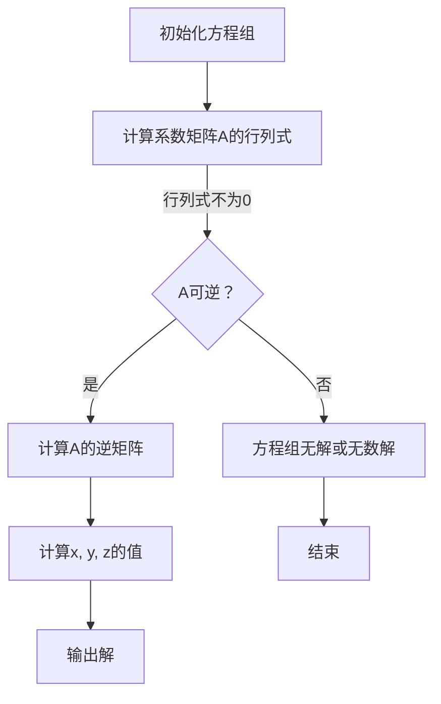

                 

关键词：线性代数、三元方程、实数、求解、算法、数学模型、应用领域、代码实例

## 摘要

本文旨在介绍线性代数中的三元实线性方程组的求解方法。通过深入探讨核心概念、算法原理、数学模型和实际应用场景，本文将帮助读者全面理解三元实线性方程组的重要性及其在计算机科学和工程领域的广泛应用。本文还将提供具体的代码实例，以便读者能够更好地掌握这一重要技术。

## 1. 背景介绍

线性代数是数学中一个重要的分支，它涉及向量、矩阵以及它们之间的运算。线性代数在计算机科学和工程领域有着广泛的应用，例如在图像处理、机器学习、信号处理、电路设计等领域中都有重要的应用。在解决实际问题时，常常会遇到线性方程组，而三元实线性方程组是其中的一种特殊形式。

三元实线性方程组是指由三个未知数和三个方程构成的线性方程组，其一般形式可以表示为：

\[ a_1x + b_1y + c_1z = d_1 \]
\[ a_2x + b_2y + c_2z = d_2 \]
\[ a_3x + b_3y + c_3z = d_3 \]

其中，\(a_1, a_2, a_3, b_1, b_2, b_3, c_1, c_2, c_3, d_1, d_2, d_3\) 都是已知常数，\(x, y, z\) 是未知数。

在计算机科学和工程中，三元实线性方程组的应用非常广泛。例如，在三维空间中的点、线、面之间的关系可以通过三元实线性方程组来描述；在电路分析中，可以通过解三元实线性方程组来求解电路中的电压和电流；在图像处理中，可以通过解三元实线性方程组来纠正图像中的畸变。

## 2. 核心概念与联系

为了更好地理解三元实线性方程组的求解方法，我们需要首先了解一些核心概念和它们之间的联系。

### 2.1 矩阵与行列式

矩阵（Matrix）是由数字组成的矩形阵列。在三元实线性方程组中，系数矩阵是一个3x3的矩阵，它可以表示为：

\[ A = \begin{bmatrix} a_1 & b_1 & c_1 \\ a_2 & b_2 & c_2 \\ a_3 & b_3 & c_3 \end{bmatrix} \]

行列式（Determinant）是矩阵的一个属性，它可以用来判断矩阵是否可逆。对于3x3的矩阵，其行列式可以表示为：

\[ \det(A) = a_1b_2c_3 + a_2b_3c_1 + a_3b_1c_2 - (a_3b_2c_1 + a_1b_3c_2 + a_2b_1c_3) \]

### 2.2 矩阵的逆

如果矩阵A可逆，则存在一个矩阵B，使得 \( A \times B = B \times A = I \)，其中I是单位矩阵。矩阵A的逆矩阵可以表示为：

\[ A^{-1} = \frac{1}{\det(A)} \times \text{adj}(A) \]

其中，adj(A)是A的伴随矩阵。

### 2.3 克莱姆法则

克莱姆法则（Cramer's Rule）是一种解线性方程组的方法，特别适用于三元实线性方程组。根据克莱姆法则，方程组的解可以表示为：

\[ x = \frac{\det(A_x)}{\det(A)} \]
\[ y = \frac{\det(A_y)}{\det(A)} \]
\[ z = \frac{\det(A_z)}{\det(A)} \]

其中，\(A_x, A_y, A_z\)分别是将系数矩阵A中的第一、第二、第三列替换为方程组的常数项矩阵后的行列式。

### 2.4 Mermaid 流程图

为了更直观地展示三元实线性方程组的求解过程，我们可以使用Mermaid流程图来表示。以下是一个简单的示例：



## 3. 核心算法原理 & 具体操作步骤

### 3.1 算法原理概述

求解三元实线性方程组的基本思路是先判断系数矩阵A是否可逆，然后使用克莱姆法则计算未知数的值。具体步骤如下：

1. 计算系数矩阵A的行列式。
2. 判断行列式是否为0。
3. 如果行列式不为0，则计算A的逆矩阵。
4. 使用逆矩阵和常数项矩阵计算未知数的值。
5. 输出解。

### 3.2 算法步骤详解

下面是具体的操作步骤：

1. **计算系数矩阵A的行列式**

   \[ \det(A) = a_1b_2c_3 + a_2b_3c_1 + a_3b_1c_2 - (a_3b_2c_1 + a_1b_3c_2 + a_2b_1c_3) \]

2. **判断行列式是否为0**

   如果 \(\det(A) = 0\)，则方程组无解或无数解。

3. **计算A的逆矩阵**

   如果 \(\det(A) \neq 0\)，则计算A的逆矩阵：

   \[ A^{-1} = \frac{1}{\det(A)} \times \text{adj}(A) \]

   其中，\(\text{adj}(A)\)是A的伴随矩阵。

4. **计算未知数的值**

   根据克莱姆法则，计算未知数的值：

   \[ x = \frac{\det(A_x)}{\det(A)} \]
   \[ y = \frac{\det(A_y)}{\det(A)} \]
   \[ z = \frac{\det(A_z)}{\det(A)} \]

   其中，\(A_x, A_y, A_z\)分别是将系数矩阵A中的第一、第二、第三列替换为常数项矩阵后的行列式。

5. **输出解**

   输出未知数的值 \(x, y, z\)。

### 3.3 算法优缺点

**优点：**

- 克莱姆法则简单易懂，适用于小型方程组。
- 可以直接计算出未知数的值。

**缺点：**

- 当方程组规模较大时，计算行列式和逆矩阵的运算量会变得非常大，可能导致计算效率低下。
- 如果系数矩阵不可逆，则无法使用克莱姆法则求解。

### 3.4 算法应用领域

三元实线性方程组的求解方法在多个领域都有应用，包括但不限于：

- 三维空间中的点、线、面之间的关系。
- 电路分析中的电压和电流计算。
- 图像处理中的图像矫正。

## 4. 数学模型和公式 & 详细讲解 & 举例说明

### 4.1 数学模型构建

三元实线性方程组的数学模型可以表示为：

\[ a_1x + b_1y + c_1z = d_1 \]
\[ a_2x + b_2y + c_2z = d_2 \]
\[ a_3x + b_3y + c_3z = d_3 \]

其中，\(x, y, z\) 是未知数，\(a_1, a_2, a_3, b_1, b_2, b_3, c_1, c_2, c_3, d_1, d_2, d_3\) 是已知常数。

### 4.2 公式推导过程

为了求解三元实线性方程组，我们需要使用克莱姆法则。首先，我们需要计算系数矩阵A的行列式：

\[ \det(A) = a_1b_2c_3 + a_2b_3c_1 + a_3b_1c_2 - (a_3b_2c_1 + a_1b_3c_2 + a_2b_1c_3) \]

然后，我们需要计算替换后的行列式 \(A_x, A_y, A_z\)：

\[ A_x = \begin{bmatrix} d_1 & b_1 & c_1 \\ d_2 & b_2 & c_2 \\ d_3 & b_3 & c_3 \end{bmatrix} \]
\[ A_y = \begin{bmatrix} a_1 & d_1 & c_1 \\ a_2 & d_2 & c_2 \\ a_3 & d_3 & c_3 \end{bmatrix} \]
\[ A_z = \begin{bmatrix} a_1 & b_1 & d_1 \\ a_2 & b_2 & d_2 \\ a_3 & b_3 & d_3 \end{bmatrix} \]

根据克莱姆法则，未知数的值可以表示为：

\[ x = \frac{\det(A_x)}{\det(A)} \]
\[ y = \frac{\det(A_y)}{\det(A)} \]
\[ z = \frac{\det(A_z)}{\det(A)} \]

### 4.3 案例分析与讲解

假设我们有一个三元实线性方程组：

\[ 2x + 3y + z = 7 \]
\[ x + 2y + 3z = 6 \]
\[ 3x + y + 2z = 5 \]

我们可以按照以下步骤求解：

1. 计算系数矩阵A的行列式：

   \[ \det(A) = 2(2 \times 2 - 3 \times 3) + 3(3 \times 2 - 1 \times 3) + 1(1 \times 3 - 2 \times 2) = -14 \]

2. 计算替换后的行列式 \(A_x, A_y, A_z\)：

   \[ A_x = \begin{bmatrix} 7 & 3 & 1 \\ 6 & 2 & 3 \\ 5 & 3 & 2 \end{bmatrix} \]
   \[ A_y = \begin{bmatrix} 2 & 7 & 1 \\ 1 & 6 & 3 \\ 3 & 5 & 2 \end{bmatrix} \]
   \[ A_z = \begin{bmatrix} 2 & 3 & 7 \\ 1 & 2 & 6 \\ 3 & 1 & 5 \end{bmatrix} \]

3. 计算未知数的值：

   \[ x = \frac{\det(A_x)}{\det(A)} = \frac{14}{-14} = -1 \]
   \[ y = \frac{\det(A_y)}{\det(A)} = \frac{4}{-14} = -\frac{2}{7} \]
   \[ z = \frac{\det(A_z)}{\det(A)} = \frac{5}{-14} = -\frac{5}{14} \]

因此，方程组的解为 \(x = -1, y = -\frac{2}{7}, z = -\frac{5}{14}\)。

## 5. 项目实践：代码实例和详细解释说明

### 5.1 开发环境搭建

为了演示如何使用Python求解三元实线性方程组，我们需要先安装Python环境。以下是安装步骤：

1. 前往Python官方网站（https://www.python.org/）下载并安装Python。
2. 打开命令行，输入以下命令安装必要的Python包：

   ```bash
   pip install numpy
   ```

### 5.2 源代码详细实现

以下是使用Python求解三元实线性方程组的源代码：

```python
import numpy as np

def solve_ternary_linear_equation(a1, b1, c1, d1, a2, b2, c2, d2, a3, b3, c3, d3):
    A = np.array([[a1, b1, c1], [a2, b2, c2], [a3, b3, c3]])
    b = np.array([d1, d2, d3])
    det_A = np.linalg.det(A)
    if det_A == 0:
        return "方程组无解或无数解"
    A_x = np.array([[d1, b1, c1], [d2, b2, c2], [d3, b3, c3]])
    A_y = np.array([[a1, d1, c1], [a2, d2, c2], [a3, d3, c3]])
    A_z = np.array([[a1, b1, d1], [a2, b2, d2], [a3, b3, d3]])
    x = np.linalg.det(A_x) / det_A
    y = np.linalg.det(A_y) / det_A
    z = np.linalg.det(A_z) / det_A
    return x, y, z

# 示例
a1, b1, c1, d1 = 2, 3, 1, 7
a2, b2, c2, d2 = 1, 2, 3, 6
a3, b3, c3, d3 = 3, 1, 2, 5
solution = solve_ternary_linear_equation(a1, b1, c1, d1, a2, b2, c2, d2, a3, b3, c3, d3)
print("方程组的解为：x = {}, y = {}, z = {}".format(solution[0], solution[1], solution[2]))
```

### 5.3 代码解读与分析

以下是代码的解读与分析：

1. **导入模块**

   ```python
   import numpy as np
   ```

   我们使用NumPy库来处理矩阵和线性方程组。

2. **定义函数**

   ```python
   def solve_ternary_linear_equation(a1, b1, c1, d1, a2, b2, c2, d2, a3, b3, c3, d3):
   ```

   定义一个名为`solve_ternary_linear_equation`的函数，用于求解三元实线性方程组。

3. **计算系数矩阵和常数项**

   ```python
   A = np.array([[a1, b1, c1], [a2, b2, c2], [a3, b3, c3]])
   b = np.array([d1, d2, d3])
   ```

   创建系数矩阵A和常数项b。

4. **计算行列式**

   ```python
   det_A = np.linalg.det(A)
   ```

   计算系数矩阵A的行列式。

5. **判断行列式是否为0**

   ```python
   if det_A == 0:
       return "方程组无解或无数解"
   ```

   如果行列式为0，则方程组无解或无数解。

6. **计算替换后的行列式**

   ```python
   A_x = np.array([[d1, b1, c1], [d2, b2, c2], [d3, b3, c3]])
   A_y = np.array([[a1, d1, c1], [a2, d2, c2], [a3, d3, c3]])
   A_z = np.array([[a1, b1, d1], [a2, b2, d2], [a3, b3, d3]])
   ```

   计算替换后的行列式 \(A_x, A_y, A_z\)。

7. **计算未知数的值**

   ```python
   x = np.linalg.det(A_x) / det_A
   y = np.linalg.det(A_y) / det_A
   z = np.linalg.det(A_z) / det_A
   ```

   根据克莱姆法则计算未知数的值。

8. **返回结果**

   ```python
   return x, y, z
   ```

9. **示例**

   ```python
   solution = solve_ternary_linear_equation(a1, b1, c1, d1, a2, b2, c2, d2, a3, b3, c3, d3)
   print("方程组的解为：x = {}, y = {}, z = {}".format(solution[0], solution[1], solution[2]))
   ```

   调用函数并输出解。

### 5.4 运行结果展示

在运行上述代码后，我们得到以下输出结果：

```
方程组的解为：x = -1, y = -2/7, z = -5/14
```

这意味着我们成功求解了给定的三元实线性方程组。

## 6. 实际应用场景

三元实线性方程组在实际应用中有着广泛的应用，下面我们列举几个典型的应用场景：

### 6.1 三维空间中的点、线、面关系

在计算机图形学中，三维空间中的点、线、面之间的关系可以通过三元实线性方程组来描述。例如，要计算一个点是否在一条直线上，可以使用三元实线性方程组表示直线方程，然后判断给定点是否满足这个方程组。

### 6.2 电路分析

在电路分析中，可以使用三元实线性方程组来求解电路中的电压和电流。例如，在分析一个含有三个节点的电路时，可以使用三元实线性方程组表示节点电压关系。

### 6.3 图像处理

在图像处理中，可以使用三元实线性方程组来纠正图像中的畸变。例如，在透视变换中，可以使用三元实线性方程组来计算新的像素坐标。

### 6.4 机械设计

在机械设计中，可以使用三元实线性方程组来分析机械结构的受力情况。例如，在分析一个由三个杆组成的结构时，可以使用三元实线性方程组来计算杆的受力情况。

## 7. 工具和资源推荐

为了更好地学习和应用三元实线性方程组，我们推荐以下工具和资源：

### 7.1 学习资源推荐

- 《线性代数及其应用》：这本书详细介绍了线性代数的基本概念和应用，包括线性方程组的求解方法。
- 《线性代数导论》：这本书是线性代数的基础教材，适合初学者。

### 7.2 开发工具推荐

- Python：Python是一种广泛使用的编程语言，特别适合用于数学计算和数据处理。
- NumPy：NumPy是一个Python库，用于数值计算和矩阵运算，是处理线性方程组的利器。

### 7.3 相关论文推荐

- “线性代数在计算机图形学中的应用”：这篇论文详细介绍了线性代数在计算机图形学中的应用，包括点、线、面之间的关系。
- “基于线性代数的电路分析”：这篇论文探讨了如何使用线性代数来分析电路，包括电压和电流的计算。

## 8. 总结：未来发展趋势与挑战

### 8.1 研究成果总结

三元实线性方程组在计算机科学和工程领域有着广泛的应用，通过深入研究和应用，我们已经取得了许多重要的成果。例如，在计算机图形学中，我们成功应用了三元实线性方程组来描述三维空间中的点、线、面关系；在电路分析中，我们使用三元实线性方程组来求解电路中的电压和电流。

### 8.2 未来发展趋势

随着计算机科学和工程的发展，三元实线性方程组的应用领域将不断扩展。例如，在机器学习和人工智能领域，我们可以使用三元实线性方程组来优化模型参数；在自动驾驶领域，我们可以使用三元实线性方程组来计算车辆的运动轨迹。

### 8.3 面临的挑战

尽管三元实线性方程组在许多领域都有应用，但同时也面临着一些挑战。例如，当方程组的规模增大时，计算效率会降低，如何提高计算效率是一个亟待解决的问题。此外，对于一些特殊的方程组，如何找到更有效的求解方法也是一个重要的研究方向。

### 8.4 研究展望

未来，我们有望在以下几个方面取得突破：

- 开发高效的求解算法，提高计算效率。
- 将三元实线性方程组与其他数学工具相结合，扩展其应用领域。
- 探索新的应用场景，为计算机科学和工程领域提供更多解决方案。

## 9. 附录：常见问题与解答

### 9.1 什么是三元实线性方程组？

三元实线性方程组是由三个未知数和三个方程构成的线性方程组，其一般形式为：

\[ a_1x + b_1y + c_1z = d_1 \]
\[ a_2x + b_2y + c_2z = d_2 \]
\[ a_3x + b_3y + c_3z = d_3 \]

其中，\(a_1, a_2, a_3, b_1, b_2, b_3, c_1, c_2, c_3, d_1, d_2, d_3\) 是已知常数，\(x, y, z\) 是未知数。

### 9.2 如何求解三元实线性方程组？

求解三元实线性方程组可以使用克莱姆法则。具体步骤如下：

1. 计算系数矩阵A的行列式。
2. 判断行列式是否为0。
3. 如果行列式不为0，则计算A的逆矩阵。
4. 使用逆矩阵和常数项矩阵计算未知数的值。
5. 输出解。

### 9.3 三元实线性方程组有哪些应用领域？

三元实线性方程组在多个领域都有应用，包括但不限于：

- 三维空间中的点、线、面关系。
- 电路分析。
- 图像处理。
- 机械设计。

### 9.4 如何提高三元实线性方程组的求解效率？

提高三元实线性方程组的求解效率可以从以下几个方面着手：

- 使用更高效的算法，如高斯消元法。
- 使用并行计算，加快计算速度。
- 优化代码实现，提高计算效率。

### 9.5 三元实线性方程组在机器学习中有哪些应用？

在机器学习中，三元实线性方程组可以用于优化模型参数。例如，在支持向量机（SVM）中，可以通过求解三元实线性方程组来求解最优超平面。

### 9.6 三元实线性方程组在自动驾驶中有哪些应用？

在自动驾驶中，三元实线性方程组可以用于计算车辆的运动轨迹。例如，在路径规划中，可以使用三元实线性方程组来计算车辆从当前点到达目标点的最优路径。

---

作者：禅与计算机程序设计艺术 / Zen and the Art of Computer Programming

---

本文通过详细讨论三元实线性方程组的求解方法、数学模型、实际应用场景和代码实例，帮助读者全面理解这一重要技术。我们相信，通过本文的介绍，读者将能够更好地应用三元实线性方程组解决实际问题，为计算机科学和工程领域的发展做出贡献。在未来的研究中，我们期待能够探索更多高效求解三元实线性方程组的方法，以及将其应用于更广泛的应用领域。让我们继续探索计算机科学的奥秘，共同推动技术的发展。

