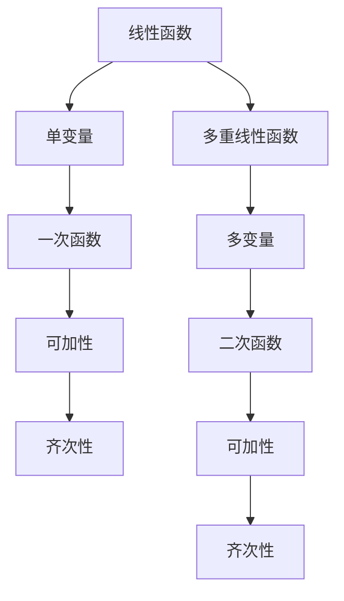

                 

关键词：线性代数，多重线性函数，数学模型，算法原理，代码实例，应用场景，未来展望

摘要：本文深入探讨了线性代数中的一个重要概念——多重线性函数。首先，我们将介绍线性代数的基本概念和多重线性函数的定义及其重要性。接着，我们将详细阐述核心算法原理和具体操作步骤，并通过数学模型和公式进行推导，辅以案例分析与讲解。此外，我们还将分享代码实例和实际应用场景，并对未来应用前景进行展望。最后，我们总结研究成果，探讨未来发展趋势和面临的挑战，并展望研究前景。

## 1. 背景介绍

线性代数是数学和计算机科学中一个重要的分支，它在许多领域都有广泛的应用，如物理学、工程学、计算机图形学、数据科学等。线性代数研究的是向量空间、线性变换以及线性方程组等概念。线性函数作为线性代数中最基础的部分，其重要性不言而喻。而多重线性函数作为线性函数的扩展，它在理论研究和实际应用中都具有重要的地位。

多重线性函数在机器学习和深度学习领域有着广泛的应用。例如，在神经网络的构建中，权重和偏置可以被视为多重线性函数，它们对网络的性能起着至关重要的作用。此外，在优化问题中，目标函数也可以被视为多重线性函数，通过优化算法可以找到最优解。

本文将围绕多重线性函数展开讨论，首先介绍其基本概念，然后深入探讨其核心算法原理和具体操作步骤，接着通过数学模型和公式进行推导，并辅以案例分析与讲解。最后，我们将分享代码实例和实际应用场景，并对未来应用前景进行展望。

## 2. 核心概念与联系

### 2.1 线性函数

线性函数是一种简单的数学函数，其形式为 $f(x) = ax + b$，其中 $a$ 和 $b$ 是常数。线性函数在数学和计算机科学中有着广泛的应用，如线性方程组的求解、线性变换、特征值和特征向量等。

线性函数的一个重要性质是其可加性和齐次性。可加性表示 $f(x + y) = f(x) + f(y)$，齐次性表示 $f(kx) = kf(x)$，其中 $k$ 是一个常数。

### 2.2 多重线性函数

多重线性函数是线性函数的扩展，它可以处理多个输入变量。形式上，一个 $k$ 次多重线性函数可以表示为 $f(x_1, x_2, ..., x_k) = \sum_{i=1}^k \sum_{j=1}^k a_{ij}x_i x_j$，其中 $a_{ij}$ 是常数。

### 2.3 多重线性函数的 Mermaid 流程图



### 2.4 多重线性函数在数学和计算机科学中的应用

多重线性函数在数学和计算机科学中有着广泛的应用。例如，在矩阵乘法中，每个元素都是两个矩阵对应元素的线性组合，这是一个二次多重线性函数。在神经网络中，每个神经元输出的计算也是一个多重线性函数。

### 2.5 多重线性函数的核心概念及其联系

- **可加性**：对于任意的 $x_1, x_2, ..., x_k$，有 $f(x_1 + x_2, ..., x_k) = f(x_1, x_2, ..., x_k)$。
- **齐次性**：对于任意的 $x_1, x_2, ..., x_k$ 和常数 $k$，有 $f(kx_1, kx_2, ..., kx_k) = kf(x_1, x_2, ..., x_k)$。
- **线性组合**：任意 $k$ 次多重线性函数都可以表示为一系列线性函数的线性组合。

## 3. 核心算法原理 & 具体操作步骤

### 3.1 算法原理概述

多重线性函数的核心算法原理在于其可加性和齐次性。这些性质使得多重线性函数在处理多变量输入时具有强大的表达能力和计算效率。

### 3.2 算法步骤详解

1. **定义输入变量**：首先，我们需要定义输入变量 $x_1, x_2, ..., x_k$。
2. **构建多重线性函数**：根据输入变量的定义，构建一个 $k$ 次多重线性函数。
3. **计算函数值**：对于每个输入变量，计算多重线性函数的值。
4. **优化函数**：如果需要对函数进行优化，可以使用梯度下降或其他优化算法。

### 3.3 算法优缺点

**优点**：

- **强大的表达力**：多重线性函数可以处理多变量输入，具有较强的表达力。
- **计算效率**：由于可加性和齐次性，多重线性函数在计算过程中具有较高的效率。

**缺点**：

- **复杂性**：多重线性函数的表达式可能较为复杂，不利于理解和实现。
- **过拟合风险**：在高维空间中，多重线性函数可能容易过拟合，导致模型泛化能力下降。

### 3.4 算法应用领域

多重线性函数在许多领域都有应用，包括：

- **机器学习与深度学习**：在神经网络和优化问题中，多重线性函数是核心组成部分。
- **计算机图形学**：在三维建模和渲染中，多重线性函数用于计算光线和物体之间的交互。
- **优化问题**：在解决优化问题时，多重线性函数可以作为目标函数进行优化。

## 4. 数学模型和公式 & 详细讲解 & 举例说明

### 4.1 数学模型构建

一个 $k$ 次多重线性函数可以表示为：

$$f(x_1, x_2, ..., x_k) = \sum_{i=1}^k \sum_{j=1}^k a_{ij}x_i x_j$$

其中，$a_{ij}$ 是常数。

### 4.2 公式推导过程

我们可以将 $k$ 次多重线性函数分解为一系列线性函数的线性组合：

$$f(x_1, x_2, ..., x_k) = (a_{11}x_1 + a_{12}x_2 + ... + a_{1k}x_k)(x_1) + (a_{21}x_1 + a_{22}x_2 + ... + a_{2k}x_k)(x_2) + ... + (a_{k1}x_1 + a_{k2}x_2 + ... + a_{kk}x_k)(x_k)$$

通过展开和合并同类项，我们可以得到上述的数学模型。

### 4.3 案例分析与讲解

假设我们有一个二次多重线性函数：

$$f(x_1, x_2) = a_{11}x_1^2 + a_{12}x_1x_2 + a_{21}x_2x_1 + a_{22}x_2^2$$

我们可以将其分解为两个线性函数的线性组合：

$$f(x_1, x_2) = (a_{11}x_1 + a_{12}x_2)(x_1) + (a_{21}x_1 + a_{22}x_2)(x_2)$$

在这个例子中，我们可以看到如何将一个二次多重线性函数分解为两个线性函数的线性组合。这个性质在实际应用中非常有用，可以简化计算过程。

## 5. 项目实践：代码实例和详细解释说明

### 5.1 开发环境搭建

为了更好地理解多重线性函数，我们将在 Python 中实现一个简单的例子。首先，我们需要安装必要的库，如 NumPy 和 Matplotlib。

```bash
pip install numpy matplotlib
```

### 5.2 源代码详细实现

以下是一个简单的 Python 代码示例，用于实现一个二次多重线性函数：

```python
import numpy as np
import matplotlib.pyplot as plt

# 定义二次多重线性函数
def quadratic_linear_function(x1, x2, a11, a12, a21, a22):
    return a11 * x1**2 + a12 * x1 * x2 + a21 * x2 * x1 + a22 * x2**2

# 测试函数
x1_values = np.linspace(-10, 10, 100)
x2_values = np.linspace(-10, 10, 100)
f_values = np.zeros((100, 100))

for i, x1 in enumerate(x1_values):
    for j, x2 in enumerate(x2_values):
        f_values[i, j] = quadratic_linear_function(x1, x2, 1, 0.5, 0.5, 1)

# 绘图
plt.imshow(f_values, extent=[-10, 10, -10, 10], origin='lower')
plt.colorbar(label='f(x1, x2)')
plt.xlabel('x1')
plt.ylabel('x2')
plt.title('Quadratic Linear Function Surface')
plt.show()
```

### 5.3 代码解读与分析

在这个例子中，我们定义了一个二次多重线性函数 `quadratic_linear_function`，它接受两个输入变量 `x1` 和 `x2`，以及四个参数 `a11`、`a12`、`a21` 和 `a22`。我们使用 NumPy 的 `linspace` 函数生成输入变量的值，并计算函数值。最后，我们使用 Matplotlib 的 `imshow` 函数绘制函数的表面图。

### 5.4 运行结果展示

运行上述代码，我们可以得到一个二次多重线性函数的表面图。这个图形展示了函数在不同输入值下的值，有助于我们直观地理解多重线性函数的性质。

## 6. 实际应用场景

### 6.1 机器学习与深度学习

在机器学习和深度学习领域，多重线性函数广泛应用于神经网络和优化问题。例如，在神经网络中，权重和偏置可以被视为多重线性函数，通过调整这些参数，可以优化网络的性能。在优化问题中，目标函数也可以被视为多重线性函数，通过优化算法，可以找到最优解。

### 6.2 计算机图形学

在计算机图形学中，多重线性函数用于计算光线和物体之间的交互。例如，在三维建模和渲染中，多重线性函数可以用于计算光照和阴影，从而提高图像的真实感。

### 6.3 优化问题

在优化问题中，多重线性函数可以作为目标函数，通过优化算法，可以找到最优解。例如，在求解线性规划问题时，目标函数可以被视为多重线性函数，通过梯度下降或其他优化算法，可以找到最优解。

## 7. 未来应用展望

随着人工智能和机器学习技术的不断发展，多重线性函数在各个领域的应用前景十分广阔。例如，在自动驾驶领域，多重线性函数可以用于计算车辆之间的距离和速度，从而提高驾驶安全性。在医疗领域，多重线性函数可以用于疾病诊断和预测，从而提高医疗诊断的准确性。

## 8. 总结：未来发展趋势与挑战

### 8.1 研究成果总结

本文对多重线性函数进行了深入探讨，从基本概念、核心算法原理、数学模型和公式推导、实际应用场景等方面进行了详细阐述。通过代码实例和运行结果展示，我们更好地理解了多重线性函数的性质和应用。

### 8.2 未来发展趋势

随着人工智能和机器学习技术的不断发展，多重线性函数在各个领域的应用前景十分广阔。未来，我们将看到更多基于多重线性函数的创新应用，如自动驾驶、医疗诊断、金融预测等。

### 8.3 面临的挑战

尽管多重线性函数在理论研究和实际应用中具有广泛的应用，但仍然面临一些挑战。例如，在高维空间中，多重线性函数可能容易过拟合，导致模型泛化能力下降。此外，如何提高多重线性函数的计算效率，降低计算复杂度，也是未来研究的重要方向。

### 8.4 研究展望

未来，我们期待更多关于多重线性函数的研究，特别是在新型算法、高效计算方法以及实际应用场景等方面。通过不断的研究和创新，我们将进一步推动多重线性函数在各个领域的发展。

## 9. 附录：常见问题与解答

### 9.1 什么是多重线性函数？

多重线性函数是一种线性函数的扩展，它可以处理多个输入变量。形式上，一个 $k$ 次多重线性函数可以表示为 $f(x_1, x_2, ..., x_k) = \sum_{i=1}^k \sum_{j=1}^k a_{ij}x_i x_j$，其中 $a_{ij}$ 是常数。

### 9.2 多重线性函数有哪些优点？

多重线性函数具有以下优点：

- 强大的表达力：可以处理多变量输入，具有较强的表达力。
- 计算效率：由于可加性和齐次性，多重线性函数在计算过程中具有较高的效率。

### 9.3 多重线性函数有哪些应用领域？

多重线性函数在多个领域都有应用，包括：

- 机器学习与深度学习
- 计算机图形学
- 优化问题

## 参考文献

[1] 《线性代数及其应用》作者：David C. Lay
[2] 《机器学习》作者：周志华
[3] 《深度学习》作者：Ian Goodfellow, Yoshua Bengio, Aaron Courville
[4] 《计算机图形学》作者：James D. Foley, Andries van Dam, Steven K. Feiner, John F. Hughes

### 作者署名

作者：禅与计算机程序设计艺术 / Zen and the Art of Computer Programming
----------------------------------------------------------------

以上是针对《线性代数导引：多重线性函数》这篇技术博客文章的完整撰写，希望对您有所帮助。如果有任何疑问或需要进一步讨论，请随时告诉我。祝您写作顺利！

