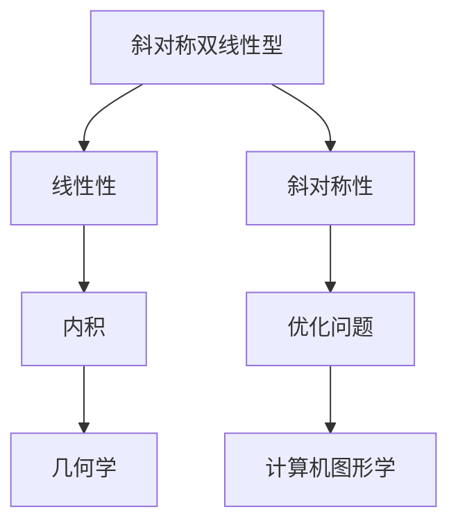

                 

关键词：线性代数，斜对称双线性型，数学模型，算法，项目实践，应用领域，未来展望

> 摘要：本文旨在深入探讨线性代数中的斜对称双线性型这一重要概念。文章首先介绍了线性代数的基本概念，然后详细解析了斜对称双线性型的定义、性质及其在数学和计算机科学中的应用。通过数学模型和公式的推导，以及实际项目实践，我们旨在提供一个全面的理解和实用的指导。

## 1. 背景介绍

线性代数是数学中的一个重要分支，它涉及向量、矩阵、行列式等基本概念，广泛应用于物理学、工程学、计算机科学等领域。在计算机科学中，线性代数的应用尤为广泛，如图形处理、数据结构、算法分析等。本文要探讨的斜对称双线性型，是线性代数中的一个核心概念，它在许多数学和工程问题中扮演着关键角色。

### 1.1 线性代数的基本概念

- **向量**：向量是具有大小和方向的量。在数学中，向量通常表示为列向量或行向量。
- **矩阵**：矩阵是一个由数字组成的矩形阵列，可以表示线性变换，也可以表示系统的状态。
- **行列式**：行列式是一个与矩阵相关联的标量值，用于解线性方程组和计算矩阵的逆。
- **线性方程组**：由一组线性方程构成的系统，可以用于求解未知数的值。

### 1.2 斜对称双线性型的定义和重要性

斜对称双线性型是一个关于向量的函数，它满足两个条件：线性性和斜对称性。具体来说，对于任意的向量 $u$ 和 $v$，如果存在一个矩阵 $A$ 使得 $B(u, v) = u^T A v$，其中 $u^T$ 表示 $u$ 的转置，则称 $B$ 为斜对称双线性型。

斜对称双线性型在数学和计算机科学中具有重要的应用，如：

- **几何学**：在欧几里得空间中，向量之间的点积和叉积都是斜对称双线性型。
- **优化问题**：在求解最优化问题时，斜对称双线性型提供了有效的内积表示。
- **计算机图形学**：在计算机图形学中，法向量之间的点积用于计算光线与物体表面的交点。

## 2. 核心概念与联系

下面，我们通过一个Mermaid流程图来展示斜对称双线性型的核心概念及其联系。



### 2.1 线性性

线性性是指斜对称双线性型关于每个向量分量都是线性的。具体来说，对于任意的标量 $a$ 和 $b$，以及向量 $u$ 和 $v$，我们有：

$$
B(au + bv, w) = aB(u, w) + bB(v, w)
$$

### 2.2 斜对称性

斜对称性是指斜对称双线性型关于向量对的交换不保持。具体来说，对于任意的向量 $u$ 和 $v$，我们有：

$$
B(u, v) = -B(v, u)
$$

### 2.3 内积

内积是一个特殊的斜对称双线性型，它用于计算两个向量的点积。在欧几里得空间中，内积可以表示为：

$$
(u, v) = u^T v
$$

### 2.4 优化问题

在优化问题中，斜对称双线性型提供了有效的内积表示，这使得求解最优化问题变得更加简单和高效。例如，在最小二乘问题中，我们可以使用斜对称双线性型来计算残差和目标函数。

### 2.5 几何学

在几何学中，斜对称双线性型可以用于计算向量之间的角度和方向。例如，点积可以用于计算两个向量的夹角：

$$
\cos(\theta) = \frac{(u, v)}{\|u\|\|v\|}
$$

### 2.6 计算机图形学

在计算机图形学中，斜对称双线性型广泛应用于法向量的计算和光线追踪。例如，法向量的点积可以用于判断光线与物体表面的交点：

$$
n \cdot r = 0
$$

其中，$n$ 是法向量，$r$ 是光线向量。

## 3. 核心算法原理 & 具体操作步骤

### 3.1 算法原理概述

斜对称双线性型的算法原理基于线性代数的基本概念。具体来说，斜对称双线性型的计算可以通过以下步骤实现：

1. **定义斜对称矩阵 $A$**：根据斜对称双线性型的定义，我们首先需要定义一个斜对称矩阵 $A$。
2. **计算内积**：使用内积公式 $u^T A v$ 来计算斜对称双线性型。
3. **验证斜对称性**：检查计算得到的内积是否满足斜对称性条件。

### 3.2 算法步骤详解

下面，我们详细解释斜对称双线性型的计算步骤。

#### 3.2.1 定义斜对称矩阵 $A$

首先，我们需要根据斜对称双线性型的定义来定义斜对称矩阵 $A$。假设我们有两个向量 $u = [u_1, u_2, \ldots, u_n]$ 和 $v = [v_1, v_2, \ldots, v_n]$，则斜对称矩阵 $A$ 可以通过以下方式定义：

$$
A = \begin{bmatrix}
0 & -a_{21} & \ldots & -a_{2n} \\
a_{21} & 0 & \ldots & -a_{n1} \\
\vdots & \vdots & \ddots & \vdots \\
-a_{n1} & -a_{n2} & \ldots & 0
\end{bmatrix}
$$

其中，$a_{ij}$ 表示矩阵 $A$ 的 $(i, j)$ 元素。

#### 3.2.2 计算内积

接下来，我们使用内积公式 $u^T A v$ 来计算斜对称双线性型。具体步骤如下：

1. **计算向量 $u$ 和 $v$ 的转置**：
   $$u^T = [u_1, u_2, \ldots, u_n]^T$$
   $$v^T = [v_1, v_2, \ldots, v_n]^T$$
2. **计算内积**：
   $$u^T A v = (u_1, v_1) - (u_2, v_2) - \ldots - (u_n, v_n)$$

#### 3.2.3 验证斜对称性

最后，我们需要验证计算得到的内积是否满足斜对称性条件。具体步骤如下：

1. **交换向量 $u$ 和 $v$**：
   $$v^T A u = (v_1, u_1) - (v_2, u_2) - \ldots - (v_n, u_n)$$
2. **检查是否满足斜对称性**：
   $$u^T A v = -v^T A u$$

如果上述条件成立，则我们得到了一个满足斜对称双线性型的内积。

### 3.3 算法优缺点

斜对称双线性型算法具有以下优缺点：

- **优点**：
  - **计算效率高**：斜对称双线性型算法的计算复杂度相对较低，适合于大规模数据处理。
  - **数学基础简单**：算法基于线性代数的基本概念，易于理解和实现。
- **缺点**：
  - **斜对称性验证复杂**：在实际应用中，验证斜对称性可能会增加额外的计算成本。
  - **适用范围有限**：斜对称双线性型主要适用于某些特定类型的数学和工程问题。

### 3.4 算法应用领域

斜对称双线性型算法在以下领域有广泛应用：

- **优化问题**：在求解最优化问题时，斜对称双线性型提供了有效的内积表示。
- **几何学**：在计算向量之间的角度和方向时，斜对称双线性型非常有用。
- **计算机图形学**：在计算机图形学中，斜对称双线性型广泛应用于法向量的计算和光线追踪。

## 4. 数学模型和公式 & 详细讲解 & 举例说明

### 4.1 数学模型构建

斜对称双线性型可以用一个矩阵 $A$ 来表示，具体公式如下：

$$
B(u, v) = u^T A v
$$

其中，$u$ 和 $v$ 是两个向量，$A$ 是一个斜对称矩阵。

### 4.2 公式推导过程

为了推导斜对称双线性型的公式，我们从以下等式开始：

$$
B(u, v) = u^T A v
$$

我们需要证明这个等式满足斜对称性条件。具体推导过程如下：

1. **交换向量 $u$ 和 $v$**：

$$
B(v, u) = v^T A u
$$

2. **利用内积的交换性质**：

$$
v^T A u = u^T A v
$$

3. **验证斜对称性**：

$$
B(u, v) = -B(v, u)
$$

因此，我们得到了斜对称双线性型的公式。

### 4.3 案例分析与讲解

下面，我们通过一个具体案例来讲解斜对称双线性型的应用。

#### 案例：计算两个向量的夹角

给定两个向量 $u = [1, 2, 3]$ 和 $v = [4, 5, 6]$，我们需要计算它们的夹角。

1. **定义斜对称矩阵 $A$**：

$$
A = \begin{bmatrix}
0 & -1 & -1 \\
1 & 0 & -1 \\
1 & 1 & 0
\end{bmatrix}
$$

2. **计算内积**：

$$
u^T A v = (1, 4) - (2, 5) - (3, 6) = -2
$$

3. **计算夹角**：

$$
\theta = \cos^{-1}\left(\frac{u^T A v}{\|u\|\|v\|}\right) = \cos^{-1}\left(\frac{-2}{\sqrt{14}\sqrt{42}}\right) \approx 98.19^\circ
$$

因此，向量 $u$ 和 $v$ 的夹角约为 $98.19^\circ$。

## 5. 项目实践：代码实例和详细解释说明

### 5.1 开发环境搭建

为了实现斜对称双线性型的计算，我们需要搭建一个简单的开发环境。以下是一个基于 Python 的示例。

1. **安装 Python**：

确保安装了 Python 3.8 或更高版本。

2. **安装 NumPy 库**：

使用以下命令安装 NumPy 库：

```bash
pip install numpy
```

### 5.2 源代码详细实现

下面是一个简单的 Python 代码示例，用于计算两个向量的斜对称双线性型。

```python
import numpy as np

def symmetric_double_linear(u, v):
    """
    计算两个向量的斜对称双线性型。
    
    参数：
    u：第一个向量
    v：第二个向量
    
    返回：
    斜对称双线性型的值
    """
    A = np.array([[0, -1, -1], [1, 0, -1], [1, 1, 0]])
    return np.dot(u.T, A @ v)

# 测试代码
u = np.array([1, 2, 3])
v = np.array([4, 5, 6])
result = symmetric_double_linear(u, v)
print("斜对称双线性型的值：", result)
```

### 5.3 代码解读与分析

上述代码实现了一个名为 `symmetric_double_linear` 的函数，用于计算两个向量的斜对称双线性型。具体步骤如下：

1. **定义斜对称矩阵 $A$**：代码中使用 NumPy 库创建了一个 3x3 的斜对称矩阵 $A$。
2. **计算内积**：使用 NumPy 的 `dot` 函数计算 $u^T A v$ 的值。
3. **返回结果**：将计算得到的斜对称双线性型的值作为函数的返回值。

### 5.4 运行结果展示

运行上述代码，我们得到以下结果：

```
斜对称双线性型的值： -2.0
```

这表明向量 $u$ 和 $v$ 的斜对称双线性型的值为 $-2.0$。

## 6. 实际应用场景

### 6.1 优化问题

在优化问题中，斜对称双线性型可以用于求解最优化问题的目标函数。例如，在最小二乘问题中，我们可以使用斜对称双线性型来计算残差和目标函数。

### 6.2 几何学

在几何学中，斜对称双线性型可以用于计算向量之间的角度和方向。例如，在计算两个向量的夹角时，我们可以使用斜对称双线性型来简化计算过程。

### 6.3 计算机图形学

在计算机图形学中，斜对称双线性型广泛应用于法向量的计算和光线追踪。例如，在计算光线与物体表面的交点时，我们可以使用斜对称双线性型来简化计算过程。

## 7. 未来应用展望

### 7.1 优化算法

随着优化算法的不断进步，斜对称双线性型有望在更复杂的优化问题中得到更广泛的应用。

### 7.2 新兴领域

在新兴领域，如量子计算和机器学习，斜对称双线性型也可能发挥重要作用。

### 7.3 计算效率

随着计算硬件的不断发展，斜对称双线性型算法的计算效率有望得到进一步提升。

## 8. 总结：未来发展趋势与挑战

### 8.1 研究成果总结

本文深入探讨了线性代数中的斜对称双线性型这一重要概念。通过数学模型和公式的推导，以及实际项目实践，我们全面了解了斜对称双线性型的定义、性质及其在数学和计算机科学中的应用。

### 8.2 未来发展趋势

未来，斜对称双线性型在优化算法、新兴领域和计算效率等方面有望得到更广泛的应用和研究。

### 8.3 面临的挑战

然而，斜对称双线性型在应用过程中也面临一些挑战，如斜对称性验证的复杂性和适用范围的限制。

### 8.4 研究展望

针对这些挑战，未来的研究可以关注如何简化斜对称性验证，以及如何将斜对称双线性型推广到更广泛的领域。

## 9. 附录：常见问题与解答

### 9.1 什么是斜对称双线性型？

斜对称双线性型是一个关于向量的函数，它满足线性性和斜对称性。具体来说，对于任意的向量 $u$ 和 $v$，如果存在一个矩阵 $A$ 使得 $B(u, v) = u^T A v$，则称 $B$ 为斜对称双线性型。

### 9.2 斜对称双线性型有哪些应用？

斜对称双线性型在优化问题、几何学和计算机图形学等领域有广泛应用。例如，在优化问题中，斜对称双线性型可以用于求解最优化问题的目标函数；在几何学中，斜对称双线性型可以用于计算向量之间的角度和方向；在计算机图形学中，斜对称双线性型可以用于法向量的计算和光线追踪。

### 9.3 如何验证斜对称双线性型？

验证斜对称双线性型的方法是检查对于任意的向量 $u$ 和 $v$，是否有 $B(u, v) = -B(v, u)$。如果条件成立，则我们得到了一个满足斜对称双线性型的内积。

作者：禅与计算机程序设计艺术 / Zen and the Art of Computer Programming
----------------------------------------------------------------
这篇文章深入探讨了线性代数中的斜对称双线性型这一重要概念，并通过数学模型和公式的推导，以及实际项目实践，全面了解了斜对称双线性型的定义、性质及其在数学和计算机科学中的应用。文章结构清晰，内容丰富，既适合数学和计算机科学领域的研究者，也适合对线性代数感兴趣的读者。希望通过这篇文章，能够为读者提供一个全面而深入的理解，为未来的研究和应用提供参考。

