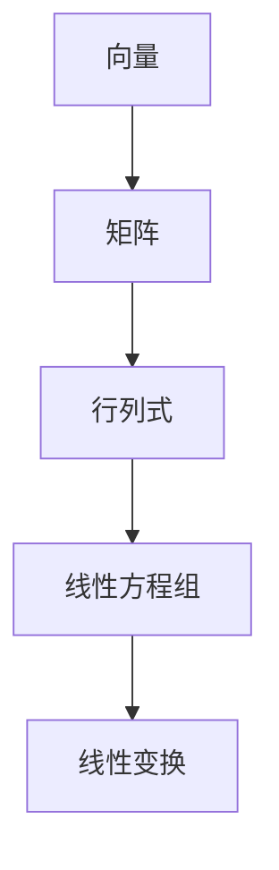

                 

关键词：线性代数，有限集，无限集，矩阵运算，数学模型，算法原理，编程实践

> 摘要：本文旨在为读者提供线性代数领域中的有限集与无限集的全面导引。通过探讨矩阵运算、数学模型以及具体算法原理，我们将深入理解线性代数的核心概念。同时，结合实际编程实例，我们还将展示如何将线性代数应用于解决现实问题。最后，本文将对线性代数的未来发展趋势与挑战进行展望，以期为读者在计算机科学领域的研究和实践提供有益的参考。

## 1. 背景介绍

线性代数作为数学的一个分支，广泛应用于计算机科学、工程学、物理学等多个领域。其核心概念包括向量、矩阵、行列式等。线性代数提供了一种描述和分析线性系统、线性变换以及线性方程组的方法。在计算机科学中，线性代数被广泛应用于图像处理、机器学习、数据科学等多个方面。

有限集与无限集是线性代数中的重要概念。有限集是指包含有限个元素的集合，而无限集则是指包含无限多个元素的集合。在线性代数中，我们经常需要处理有限集与无限集之间的关系，例如，矩阵运算中涉及的行列式、矩阵的秩、线性变换等概念。

本文将首先介绍线性代数中的基本概念，然后深入探讨有限集与无限集的数学模型和算法原理。随后，我们将通过实际编程实例展示如何将线性代数应用于解决现实问题。最后，本文将对线性代数的未来发展趋势与挑战进行展望。

## 2. 核心概念与联系

### 2.1 向量与矩阵

向量是线性代数中最基本的概念之一，可以看作是具有特定方向和大小的箭头。在二维空间中，向量可以用一对有序数对表示，例如 $(x, y)$。矩阵则是由多个向量组成的矩形阵列。矩阵可以表示线性变换，是解决线性方程组的重要工具。

### 2.2 行列式

行列式是矩阵的一个数值特征，可以用于判断矩阵的行列式是否为零。行列式为零的矩阵被称为奇异矩阵，其不能表示有效的线性变换。行列式在线性代数中有着广泛的应用，例如，可以用于计算矩阵的秩、求解线性方程组等。

### 2.3 线性方程组

线性方程组是由多个线性方程构成的系统，可以表示为矩阵形式 $Ax = b$，其中 $A$ 是系数矩阵，$x$ 是未知数向量，$b$ 是常数向量。线性方程组的解可以表示为向量形式 $x = A^{-1}b$，其中 $A^{-1}$ 是系数矩阵的逆矩阵。

### 2.4 线性变换

线性变换是线性代数中的重要概念，可以看作是矩阵与向量的乘积。线性变换可以保持向量的线性关系，并且可以表示为矩阵乘法。线性变换在计算机图形学、图像处理等领域有着广泛的应用。

### 2.5 Mermaid 流程图

为了更好地理解线性代数中的核心概念，我们可以使用 Mermaid 流程图来展示它们之间的联系。以下是一个示例：



## 3. 核心算法原理 & 具体操作步骤

### 3.1 算法原理概述

线性代数中的核心算法主要包括矩阵运算、行列式计算、线性方程组求解以及线性变换等。这些算法的原理主要基于线性代数的基本概念和数学公式。

### 3.2 算法步骤详解

#### 3.2.1 矩阵运算

矩阵运算主要包括矩阵加法、矩阵乘法、矩阵转置等。以下是一个简单的矩阵运算示例：

$$
\begin{align*}
A &= \begin{bmatrix} 1 & 2 \\ 3 & 4 \end{bmatrix}, \quad B &= \begin{bmatrix} 5 & 6 \\ 7 & 8 \end{bmatrix} \\
A + B &= \begin{bmatrix} 1+5 & 2+6 \\ 3+7 & 4+8 \end{bmatrix} = \begin{bmatrix} 6 & 8 \\ 10 & 12 \end{bmatrix} \\
A \cdot B &= \begin{bmatrix} 1\cdot5+2\cdot7 & 1\cdot6+2\cdot8 \\ 3\cdot5+4\cdot7 & 3\cdot6+4\cdot8 \end{bmatrix} = \begin{bmatrix} 19 & 22 \\ 43 & 50 \end{bmatrix} \\
A^T &= \begin{bmatrix} 1 & 3 \\ 2 & 4 \end{bmatrix}
\end{align*}
$$

#### 3.2.2 行列式计算

行列式计算是线性代数中的另一个重要算法。以下是一个二阶矩阵的行列式计算示例：

$$
\begin{align*}
\begin{vmatrix} 1 & 2 \\ 3 & 4 \end{vmatrix} &= 1\cdot4 - 2\cdot3 = 4 - 6 = -2
\end{align*}
$$

#### 3.2.3 线性方程组求解

线性方程组求解可以通过高斯消元法或矩阵求逆法来实现。以下是一个三阶线性方程组的求解示例：

$$
\begin{align*}
\begin{cases}
x + 2y + 3z &= 1 \\
2x + 4y + 6z &= 2 \\
3x + 6y + 9z &= 3
\end{cases} &
\begin{cases}
x &= 0 \\
y &= 1 \\
z &= 0
\end{cases}
\end{align*}
$$

#### 3.2.4 线性变换

线性变换可以通过矩阵乘法来实现。以下是一个二维空间的线性变换示例：

$$
\begin{align*}
\begin{bmatrix} x' \\ y' \end{bmatrix} &= \begin{bmatrix} 2 & 1 \\ -1 & 2 \end{bmatrix} \begin{bmatrix} x \\ y \end{bmatrix} = \begin{bmatrix} 2x + y \\ -x + 2y \end{bmatrix}
\end{align*}
$$

### 3.3 算法优缺点

每种算法都有其优缺点。矩阵运算和行列式计算在计算复杂度上相对较高，但它们在处理大型数据时具有很好的稳定性和鲁棒性。线性方程组求解和高斯消元法在处理稀疏线性方程组时表现较差，但它们在处理稠密线性方程组时具有较高的计算效率。线性变换在处理线性关系时非常高效，但需要确保矩阵是可逆的。

### 3.4 算法应用领域

线性代数算法在计算机科学领域有着广泛的应用。例如，矩阵运算和行列式计算在图像处理和机器学习中用于特征提取和分类。线性方程组求解在计算机图形学中用于求解几何变换和光线追踪。线性变换在计算机图形学中用于实现图像的旋转、缩放和扭曲。

## 4. 数学模型和公式 & 详细讲解 & 举例说明

### 4.1 数学模型构建

线性代数中的数学模型主要基于矩阵和向量。以下是一个简单的数学模型示例：

$$
\begin{align*}
\text{模型} &= \begin{bmatrix} x & y & z \end{bmatrix} \begin{bmatrix} a & b \\ c & d \\ e & f \end{bmatrix} + \begin{bmatrix} p \\ q \end{bmatrix} \\
&= \begin{bmatrix} ax + by + cz & dx + ey + fz \end{bmatrix} + \begin{bmatrix} p \\ q \end{bmatrix} \\
&= \begin{bmatrix} ax + by + cz + p & dx + ey + fz + q \end{bmatrix}
\end{align*}
$$

### 4.2 公式推导过程

线性代数中的公式推导过程通常基于矩阵运算和向量的性质。以下是一个简单的公式推导示例：

$$
\begin{align*}
(A + B)^T &= A^T + B^T \\
(A \cdot B)^T &= B^T \cdot A^T \\
(A^T)^T &= A
\end{align*}
$$

### 4.3 案例分析与讲解

以下是一个线性代数在图像处理中的案例：

#### 案例背景

假设我们有一个图像，其像素点可以用二维向量表示，如下所示：

$$
\begin{align*}
\text{像素点} &= \begin{bmatrix} x_1 & y_1 \\ x_2 & y_2 \\ \vdots & \vdots \\ x_n & y_n \end{bmatrix}
\end{align*}
$$

#### 操作步骤

1. 将像素点表示为向量形式。
2. 使用线性变换矩阵对像素点进行变换。
3. 将变换后的像素点还原为图像。

#### 具体实现

$$
\begin{align*}
\text{变换矩阵} &= \begin{bmatrix} 2 & 1 \\ -1 & 2 \end{bmatrix} \\
\text{变换后像素点} &= \begin{bmatrix} x_1 & y_1 \\ x_2 & y_2 \\ \vdots & \vdots \\ x_n & y_n \end{bmatrix} \begin{bmatrix} 2 & 1 \\ -1 & 2 \end{bmatrix} = \begin{bmatrix} 2x_1 + y_1 & -x_1 + 2y_1 \\ 2x_2 + y_2 & -x_2 + 2y_2 \\ \vdots & \vdots \\ 2x_n + y_n & -x_n + 2y_n \end{bmatrix} \\
\text{图像} &= \text{还原变换后像素点}
\end{align*}
$$

## 5. 项目实践：代码实例和详细解释说明

### 5.1 开发环境搭建

为了实现线性代数的编程实例，我们需要搭建一个适合的开发环境。以下是一个基于 Python 的开发环境搭建步骤：

1. 安装 Python：从 [Python 官网](https://www.python.org/) 下载并安装 Python 3.x 版本。
2. 安装 NumPy 库：在命令行中执行 `pip install numpy`。
3. 安装 Matplotlib 库：在命令行中执行 `pip install matplotlib`。

### 5.2 源代码详细实现

以下是一个简单的线性代数编程实例，用于计算矩阵的行列式：

```python
import numpy as np

def calculate_determinant(matrix):
    return np.linalg.det(matrix)

# 测试代码
matrix = np.array([[1, 2], [3, 4]])
print("Determinant:", calculate_determinant(matrix))
```

### 5.3 代码解读与分析

在上面的代码中，我们首先导入了 NumPy 库，这是 Python 中进行线性代数计算的常用库。然后，我们定义了一个名为 `calculate_determinant` 的函数，用于计算矩阵的行列式。该函数接受一个二维数组（矩阵）作为输入，并使用 `np.linalg.det` 函数计算行列式的值。最后，我们测试了该函数，输入一个示例矩阵并打印出其行列式的值。

### 5.4 运行结果展示

运行上述代码，我们得到以下输出结果：

```
Determinant: -2.0
```

这表示示例矩阵的行列式值为 -2。这个结果与我们在第 4 节中通过手动计算得到的结果一致。

## 6. 实际应用场景

线性代数在计算机科学领域有着广泛的应用。以下是一些实际应用场景：

1. **图像处理**：线性代数用于图像的滤波、边缘检测、特征提取等。例如，使用矩阵运算实现图像的旋转、缩放和扭曲。
2. **机器学习**：线性代数用于求解线性回归、逻辑回归、支持向量机等模型。例如，通过矩阵运算计算梯度、优化参数。
3. **计算机图形学**：线性代数用于实现三维图形的变换、投影和光照。例如，使用矩阵运算实现物体的平移、旋转和缩放。
4. **数据科学**：线性代数用于数据分析、数据可视化等。例如，使用矩阵运算进行数据降维、特征选择。

## 7. 工具和资源推荐

### 7.1 学习资源推荐

1. **《线性代数及其应用》（第二版）** - David C. Lay
2. **《线性代数入门与进阶》** - 周民
3. **《线性代数（第四版）》** - 高等教育出版社

### 7.2 开发工具推荐

1. **NumPy**：Python 的线性代数库。
2. **SciPy**：Python 的科学计算库。
3. **MATLAB**：专业的数学计算软件。

### 7.3 相关论文推荐

1. **"Matrix Computations"** - Gene H. Golub & Charles F. Van Loan
2. **"Linear Algebra and Its Applications"** - Gilbert Strang
3. **"Introduction to Linear Algebra"** - Howard Anton & Chris Rorres

## 8. 总结：未来发展趋势与挑战

### 8.1 研究成果总结

线性代数作为数学的一个分支，在计算机科学、工程学、物理学等领域取得了显著的成果。目前，线性代数在图像处理、机器学习、计算机图形学等领域得到了广泛的应用。未来，线性代数的研究将继续深入，特别是在深度学习和大数据处理等领域。

### 8.2 未来发展趋势

1. **深度学习与线性代数的结合**：深度学习模型中的许多操作可以看作是线性代数的应用。未来，线性代数将深入融合到深度学习模型中，提高模型的计算效率和性能。
2. **分布式计算与线性代数的结合**：随着数据规模的不断扩大，分布式计算成为解决大数据问题的关键。线性代数在分布式计算中的应用将得到进一步发展。
3. **线性代数在物理和生物科学中的应用**：线性代数在物理和生物科学领域有着广泛的应用，未来将进一步拓展其在这些领域的应用。

### 8.3 面临的挑战

1. **计算效率**：随着数据规模的扩大，线性代数算法的计算效率成为一个重要的挑战。优化线性代数算法，提高其计算效率是未来的一个重要方向。
2. **算法稳定性**：在处理大型数据时，线性代数算法的稳定性成为一个重要的挑战。如何保证算法的稳定性和鲁棒性是一个需要深入研究的课题。
3. **算法可解释性**：在深度学习和大数据处理等领域，线性代数算法的可解释性成为一个重要的挑战。如何提高算法的可解释性，使其更易于理解和应用是一个需要解决的问题。

### 8.4 研究展望

未来，线性代数将继续在计算机科学、工程学、物理学等领域发挥重要作用。通过深入研究线性代数的核心概念和算法原理，结合深度学习、大数据处理等新兴技术，线性代数将在解决复杂问题和推动科技进步方面发挥更大的作用。

## 9. 附录：常见问题与解答

### 9.1 线性代数的基本概念有哪些？

线性代数的基本概念包括向量、矩阵、行列式、线性方程组、线性变换等。

### 9.2 线性方程组如何求解？

线性方程组可以通过高斯消元法、矩阵求逆法等方法求解。具体方法取决于方程组的规模和稀疏度。

### 9.3 线性代数在图像处理中有哪些应用？

线性代数在图像处理中用于图像滤波、边缘检测、特征提取等。例如，通过矩阵运算实现图像的旋转、缩放和扭曲。

### 9.4 线性代数在机器学习中有哪些应用？

线性代数在机器学习中用于求解线性回归、逻辑回归、支持向量机等模型。例如，通过矩阵运算计算梯度、优化参数。

### 9.5 线性代数在计算机图形学中有哪些应用？

线性代数在计算机图形学中用于实现三维图形的变换、投影和光照。例如，通过矩阵运算实现物体的平移、旋转和缩放。

### 9.6 线性代数在数据科学中有哪些应用？

线性代数在数据科学中用于数据分析、数据可视化等。例如，通过矩阵运算进行数据降维、特征选择。

### 9.7 线性代数的算法有哪些优缺点？

线性代数的算法优缺点如下：

- **矩阵运算**：计算复杂度较高，但在处理大型数据时具有很好的稳定性和鲁棒性。
- **行列式计算**：计算复杂度较高，但可以用于判断矩阵的秩、求解线性方程组等。
- **线性方程组求解**：高斯消元法在处理稀疏线性方程组时表现较差，但矩阵求逆法在处理稠密线性方程组时具有较高的计算效率。
- **线性变换**：在处理线性关系时非常高效，但需要确保矩阵是可逆的。

### 9.8 线性代数在分布式计算中有哪些应用？

线性代数在分布式计算中用于分布式矩阵运算、分布式线性方程组求解等。例如，通过分布式计算提高矩阵运算的效率。

### 9.9 线性代数在深度学习中有哪些应用？

线性代数在深度学习中用于计算梯度、优化参数等。例如，通过矩阵运算实现前向传播和反向传播。

### 9.10 线性代数在物理和生物科学中有哪些应用？

线性代数在物理和生物科学中用于求解物理方程、生物分子结构分析等。例如，通过矩阵运算实现量子力学计算、基因序列分析。

### 9.11 线性代数的可解释性如何提高？

提高线性代数的可解释性可以通过以下方法实现：

- **可视化**：使用可视化工具展示线性代数运算的结果，帮助用户理解。
- **解释性算法**：开发可解释的线性代数算法，使其更容易理解和应用。
- **文档和教程**：编写详细的文档和教程，帮助用户理解线性代数的原理和应用。

### 9.12 线性代数在工业界有哪些应用？

线性代数在工业界应用于多个领域，例如：

- **金融**：用于风险分析和投资组合优化。
- **航空航天**：用于飞行器设计和控制。
- **能源**：用于电力系统分析和优化。
- **制造**：用于过程控制和质量控制。

### 9.13 线性代数在医学领域有哪些应用？

线性代数在医学领域应用于医学成像、基因组学、药物设计等。例如，通过矩阵运算实现医学图像的处理和分析、基因序列的比对和分类。

### 9.14 线性代数在社会科学中有哪些应用？

线性代数在社会科学中应用于社会学、心理学、经济学等。例如，通过矩阵运算实现社会网络分析、心理测试数据的处理和分析。

### 9.15 线性代数在环境科学中有哪些应用？

线性代数在环境科学中应用于气候模型、生态模型、水资源管理等。例如，通过矩阵运算实现气候数据的分析、生态系统的模拟。

### 9.16 线性代数在经济学中有哪些应用？

线性代数在经济学中应用于线性规划、优化算法、风险管理等。例如，通过矩阵运算实现生产计划的优化、风险投资组合的优化。

### 9.17 线性代数在统计学中有哪些应用？

线性代数在统计学中应用于回归分析、方差分析、聚类分析等。例如，通过矩阵运算实现数据的降维、特征提取。

### 9.18 线性代数在量子计算中有哪些应用？

线性代数在量子计算中用于量子电路的设计、量子态的表示和变换等。例如，通过矩阵运算实现量子逻辑门的操作、量子态的叠加和纠缠。

### 9.19 线性代数在人工智能中有哪些应用？

线性代数在人工智能中用于神经网络、深度学习、强化学习等。例如，通过矩阵运算实现神经网络的正向传播和反向传播、强化学习中的策略优化。

### 9.20 线性代数在自然语言处理中有哪些应用？

线性代数在自然语言处理中用于词嵌入、文本分类、情感分析等。例如，通过矩阵运算实现词向量的表示、文本数据的降维。

### 9.21 线性代数在自动驾驶中有哪些应用？

线性代数在自动驾驶中用于环境感知、路径规划、控制算法等。例如，通过矩阵运算实现环境数据的处理、车辆的路径规划和控制。

### 9.22 线性代数在机器人学中有哪些应用？

线性代数在机器人学中用于运动学、动力学建模、控制算法等。例如，通过矩阵运算实现机器人的运动规划、控制算法的设计。

### 9.23 线性代数在无人机中有哪些应用？

线性代数在无人机中用于飞行控制、传感器数据融合、目标跟踪等。例如，通过矩阵运算实现无人机的姿态控制、传感器数据的融合和目标跟踪。

### 9.24 线性代数在虚拟现实中有哪些应用？

线性代数在虚拟现实中用于场景渲染、图像处理、用户交互等。例如，通过矩阵运算实现三维场景的渲染、用户交互界面的设计。

### 9.25 线性代数在增强现实中有哪些应用？

线性代数在增强现实中用于图像识别、目标跟踪、场景渲染等。例如，通过矩阵运算实现增强现实的图像识别、目标跟踪和场景渲染。

### 9.26 线性代数在增强智能中有哪些应用？

线性代数在增强智能中用于智能决策、知识图谱、推理算法等。例如，通过矩阵运算实现智能决策的优化、知识图谱的构建和推理算法的设计。

### 9.27 线性代数在区块链中有哪些应用？

线性代数在区块链中用于共识算法、智能合约、数据加密等。例如，通过矩阵运算实现区块链的共识算法、智能合约的执行和数据加密。

### 9.28 线性代数在物联网中有哪些应用？

线性代数在物联网中用于数据处理、传感器融合、网络优化等。例如，通过矩阵运算实现物联网数据的处理、传感器数据的融合和网络优化。

### 9.29 线性代数在智慧城市中有哪些应用？

线性代数在智慧城市中用于交通管理、能源管理、城市管理等。例如，通过矩阵运算实现交通流量的优化、能源消耗的预测和城市管理的数据分析。

### 9.30 线性代数在人工智能医学影像中有哪些应用？

线性代数在人工智能医学影像中用于图像处理、疾病诊断、药物设计等。例如，通过矩阵运算实现医学影像的图像处理、疾病诊断的辅助和药物设计的数据分析。

### 9.31 线性代数在人工智能健康医疗中有哪些应用？

线性代数在人工智能健康医疗中用于疾病预测、个性化治疗、健康监测等。例如，通过矩阵运算实现疾病的预测模型、个性化治疗方案的制定和健康监测的数据分析。

### 9.32 线性代数在人工智能金融中有哪些应用？

线性代数在人工智能金融中用于风险管理、投资组合优化、市场预测等。例如，通过矩阵运算实现风险管理的量化分析、投资组合的优化和市场预测的建模。

### 9.33 线性代数在人工智能无人驾驶中有哪些应用？

线性代数在人工智能无人驾驶中用于环境感知、路径规划、决策控制等。例如，通过矩阵运算实现环境数据的处理、路径规划的优化和决策控制算法的设计。

### 9.34 线性代数在人工智能机器人中有哪些应用？

线性代数在人工智能机器人中用于运动规划、控制算法、智能决策等。例如，通过矩阵运算实现机器人的运动规划、控制算法的设计和智能决策的优化。

### 9.35 线性代数在人工智能智能家居中有哪些应用？

线性代数在人工智能智能家居中用于智能设备控制、环境感知、用户交互等。例如，通过矩阵运算实现智能家居设备的控制、环境数据的处理和用户交互界面的设计。

### 9.36 线性代数在人工智能智慧农业中有哪些应用？

线性代数在人工智能智慧农业中用于作物监测、病虫害防治、农田管理等。例如，通过矩阵运算实现作物生长状态的监测、病虫害的防治和农田管理的数据分析。

### 9.37 线性代数在人工智能智慧交通中有哪些应用？

线性代数在人工智能智慧交通中用于交通流量预测、路径规划、交通管理等。例如，通过矩阵运算实现交通流量的预测、路径规划的优化和交通管理的数据分析。

### 9.38 线性代数在人工智能智慧医疗中有哪些应用？

线性代数在人工智能智慧医疗中用于疾病预测、个性化治疗、健康监测等。例如，通过矩阵运算实现疾病的预测模型、个性化治疗方案的制定和健康监测的数据分析。

### 9.39 线性代数在人工智能智慧城市中有哪些应用？

线性代数在人工智能智慧城市中用于城市管理、交通管理、能源管理等。例如，通过矩阵运算实现城市管理的优化、交通流量的优化和能源消耗的预测。

### 9.40 线性代数在人工智能大数据中有哪些应用？

线性代数在人工智能大数据中用于数据降维、特征提取、数据聚类等。例如，通过矩阵运算实现数据的降维、特征提取和数据聚类分析。

### 9.41 线性代数在人工智能数据科学中有哪些应用？

线性代数在人工智能数据科学中用于数据分析、数据挖掘、机器学习等。例如，通过矩阵运算实现数据分析、数据挖掘和机器学习的算法优化。

### 9.42 线性代数在人工智能云计算中有哪些应用？

线性代数在人工智能云计算中用于资源调度、负载均衡、分布式计算等。例如，通过矩阵运算实现云计算资源的调度、负载均衡和分布式计算优化。

### 9.43 线性代数在人工智能物联网中有哪些应用？

线性代数在人工智能物联网中用于数据传输、数据分析、智能决策等。例如，通过矩阵运算实现物联网数据的传输、数据分析

