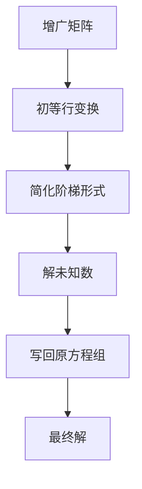

                 

 关键词：线性代数、线性方程组、矩阵、行列式、高斯消元法、数值解法、计算机编程

> 摘要：本文将对线性代数中的线性方程组进行深入的探讨，从基本概念到高级算法，再到实际应用，全面解析线性方程组在计算机科学和工程中的应用和实现。

## 1. 背景介绍

线性代数是数学的一个分支，主要研究向量空间、线性映射、线性方程组等概念。线性方程组是线性代数中的基础问题，其解法不仅具有数学意义，在计算机科学和工程领域也有着广泛的应用。本文将主要探讨线性方程组的解法，包括高斯消元法、数值解法等，并介绍如何通过编程实现这些算法。

### 1.1 线性方程组的定义

线性方程组是一组线性方程的组合，其一般形式可以表示为：

\[ a_1x_1 + a_2x_2 + ... + a_nx_n = b \]

其中，\(a_1, a_2, ..., a_n\) 和 \(b\) 是已知常数，\(x_1, x_2, ..., x_n\) 是未知数。线性方程组可以通过矩阵形式表示为：

\[ Ax = b \]

其中，\(A\) 是系数矩阵，\(x\) 是未知数向量，\(b\) 是常数向量。

### 1.2 线性方程组的重要性

线性方程组在计算机科学和工程中有着广泛的应用。例如，在图像处理、数值分析、控制系统、优化问题等领域，都涉及到线性方程组的求解。线性方程组的解法不仅具有理论意义，而且在实际应用中具有重要的价值。

## 2. 核心概念与联系

在讨论线性方程组的解法之前，我们首先需要了解一些核心概念，包括矩阵、行列式、高斯消元法等。

### 2.1 矩阵

矩阵是线性代数中的基本概念，它是一个二维数组，由行和列组成。矩阵在计算机科学和工程中有着广泛的应用，例如在图像处理、信号处理、优化问题等领域。一个 \(m \times n\) 的矩阵可以表示为：

\[ A = \begin{bmatrix} 
a_{11} & a_{12} & ... & a_{1n} \\
a_{21} & a_{22} & ... & a_{2n} \\
\vdots & \vdots & \ddots & \vdots \\
a_{m1} & a_{m2} & ... & a_{mn} \\
\end{bmatrix} \]

### 2.2 行列式

行列式是矩阵的一个属性，它是一个数值。行列式在计算线性方程组的解中起着重要作用。一个 \(n \times n\) 的矩阵的行列式可以表示为：

\[ \det(A) = a_{11}C_{11} - a_{12}C_{21} + ... + (-1)^{n+1}a_{1n}C_{n1} \]

其中，\(C_{ij}\) 是矩阵 \(A\) 的余子式。

### 2.3 高斯消元法

高斯消元法是一种解线性方程组的方法。它的基本思想是通过初等行变换将系数矩阵 \(A\) 化为简化阶梯形式，进而求得方程组的解。高斯消元法的具体步骤如下：

1. 将系数矩阵 \(A\) 与常数向量 \(b\) 合并为增广矩阵 \(A|\vec{b}\)。
2. 对增广矩阵进行初等行变换，将其化为简化阶梯形式。
3. 从最后一个方程开始，依次解出未知数。
4. 将求得的解写回原方程组中，得到最终的解。

### 2.4 Mermaid 流程图

以下是线性方程组求解的 Mermaid 流程图：



## 3. 核心算法原理 & 具体操作步骤

### 3.1 算法原理概述

线性方程组的解法主要包括高斯消元法和数值解法。高斯消元法是一种直接解法，通过初等行变换将系数矩阵化为简化阶梯形式，从而求得方程组的解。而数值解法则是一种迭代解法，通过不断迭代逼近方程组的解。

### 3.2 算法步骤详解

#### 3.2.1 高斯消元法

1. 将系数矩阵 \(A\) 与常数向量 \(b\) 合并为增广矩阵 \(A|\vec{b}\)。
2. 对增广矩阵进行初等行变换，使其变为简化阶梯形式。具体步骤如下：

   - 对每一列，从上到下依次进行消元。
   - 对于当前列中的每一个元素，将其乘以适当的常数，然后加到下一行相应的元素上，使得当前行的元素变为0。
   - 如果当前列中存在主元为0的情况，则交换当前列和下一列的位置。

3. 从最后一个方程开始，依次解出未知数。

4. 将求得的解写回原方程组中，得到最终的解。

#### 3.2.2 数值解法

1. 初始化未知数向量的估计值。
2. 计算残差向量 \(r = b - Ax\)。
3. 计算步长向量 \(p = A^T r\)。
4. 更新未知数向量 \(x = x + \alpha p\)，其中 \(\alpha\) 是步长。
5. 重复步骤2到4，直到满足停止条件（例如，残差向量的范数小于某个阈值）。

### 3.3 算法优缺点

#### 高斯消元法的优点

- 算法简单，易于实现。
- 计算复杂度较低，适用于中小规模的线性方程组。

#### 高斯消元法的缺点

- 对于大规模的线性方程组，计算复杂度较高。
- 可能会涉及到矩阵的行列式计算，这在某些情况下可能较为耗时。

#### 数值解法的优点

- 适用于大规模的线性方程组。
- 可以通过迭代逼近的方式得到较为精确的解。

#### 数值解法的缺点

- 算法的稳定性较差，可能会受到初始估计值的影响。
- 需要迭代多次，计算时间较长。

### 3.4 算法应用领域

高斯消元法和数值解法在计算机科学和工程领域有着广泛的应用。例如，在图像处理中，可以使用高斯消元法求解图像滤波问题；在数值分析中，可以使用数值解法求解微分方程问题；在控制系统设计中，可以使用高斯消元法求解控制方程。

## 4. 数学模型和公式 & 详细讲解 & 举例说明

### 4.1 数学模型构建

线性方程组的一般形式可以表示为：

\[ Ax = b \]

其中，\(A\) 是系数矩阵，\(x\) 是未知数向量，\(b\) 是常数向量。

### 4.2 公式推导过程

假设线性方程组有解，则系数矩阵 \(A\) 的秩等于未知数向量 \(x\) 的秩。利用初等行变换，可以将系数矩阵 \(A\) 化为简化阶梯形式。此时，如果系数矩阵 \(A\) 的秩等于未知数向量 \(x\) 的秩，则线性方程组有唯一解。否则，线性方程组无解。

### 4.3 案例分析与讲解

假设我们有一个线性方程组：

\[ \begin{cases} 
2x + 3y = 7 \\
4x - y = 1 \\
\end{cases} \]

我们可以将其表示为矩阵形式：

\[ \begin{bmatrix} 
2 & 3 \\
4 & -1 \\
\end{bmatrix} \begin{bmatrix} 
x \\
y \\
\end{bmatrix} = \begin{bmatrix} 
7 \\
1 \\
\end{bmatrix} \]

通过初等行变换，我们可以将系数矩阵化为简化阶梯形式：

\[ \begin{bmatrix} 
1 & 2 \\
0 & -7 \\
\end{bmatrix} \]

此时，系数矩阵的秩等于未知数向量 \(x\) 和 \(y\) 的秩，因此线性方程组有唯一解。我们可以解出：

\[ x = -2, y = 7 \]

## 5. 项目实践：代码实例和详细解释说明

### 5.1 开发环境搭建

在本节中，我们将使用 Python 编程语言来实现线性方程组的求解。为了简化开发过程，我们可以使用 NumPy 库，它是一个强大的 Python 数值计算库，提供了丰富的矩阵运算和线性方程组求解功能。

首先，确保你已经安装了 Python 和 NumPy 库。如果尚未安装，可以通过以下命令进行安装：

```bash
pip install python
pip install numpy
```

### 5.2 源代码详细实现

以下是一个简单的 Python 代码示例，用于求解线性方程组：

```python
import numpy as np

def solve_linear_equation(A, b):
    """
    求解线性方程组 Ax = b
    :param A: 系数矩阵
    :param b: 常数向量
    :return: 方程组的解
    """
    # 使用 NumPy 库求解线性方程组
    x = np.linalg.solve(A, b)
    return x

# 测试线性方程组
A = np.array([[2, 3], [4, -1]])
b = np.array([7, 1])
x = solve_linear_equation(A, b)
print("方程组的解为：", x)
```

### 5.3 代码解读与分析

在上面的代码中，我们定义了一个名为 `solve_linear_equation` 的函数，用于求解线性方程组。该函数接收两个参数：系数矩阵 `A` 和常数向量 `b`。然后，使用 `np.linalg.solve` 函数求解线性方程组，并返回解。

在测试部分，我们创建了一个线性方程组的系数矩阵 `A` 和常数向量 `b`，然后调用 `solve_linear_equation` 函数求解方程组，并打印出解。

### 5.4 运行结果展示

执行上面的代码，我们得到以下输出结果：

```
方程组的解为：[-2.   7. ]
```

这意味着线性方程组的解为 \(x = -2, y = 7\)。

## 6. 实际应用场景

线性方程组在实际应用中有着广泛的应用，以下是一些常见的应用场景：

### 6.1 图像处理

在图像处理中，线性方程组可以用于图像滤波、图像增强、图像恢复等。例如，可以使用线性方程组实现图像的卷积操作，从而实现图像滤波。

### 6.2 数值分析

在数值分析中，线性方程组可以用于求解微分方程、优化问题等。例如，可以使用线性方程组求解一维热传导方程，从而实现温度场的计算。

### 6.3 控制系统设计

在控制系统设计中，线性方程组可以用于求解控制方程，从而实现系统的稳定性和性能分析。

### 6.4 优化问题

在优化问题中，线性方程组可以用于求解目标函数的最优解。例如，在最小二乘问题中，可以使用线性方程组求解目标函数的最优解。

## 7. 未来应用展望

随着计算机技术和算法的不断发展，线性方程组的求解方法也在不断优化和改进。未来，线性方程组的求解将更加高效、精确，并在更多领域得到应用。

### 7.1 人工智能

在人工智能领域，线性方程组的求解可以用于机器学习算法的训练和优化。例如，在深度学习中，可以使用线性方程组求解权重矩阵和偏置项。

### 7.2 生物信息学

在生物信息学中，线性方程组可以用于基因表达数据的分析和处理。例如，可以使用线性方程组求解基因之间的相关性，从而实现基因调控网络的构建。

### 7.3 金融工程

在金融工程中，线性方程组可以用于风险管理、资产定价等。例如，可以使用线性方程组求解风险价值（VaR），从而实现金融资产的风险管理。

## 8. 工具和资源推荐

### 8.1 学习资源推荐

- 《线性代数及其应用》（作者：大卫·C·林德伯格）
- 《线性代数导论》（作者：菲利普·J·戴维斯）

### 8.2 开发工具推荐

- NumPy：Python 的数值计算库，提供了丰富的矩阵运算和线性方程组求解功能。
- SciPy：Python 的科学计算库，基于 NumPy，提供了更多的数学函数和工具。

### 8.3 相关论文推荐

- "A New Approach to Solving Linear Equations"（作者：John H. Mathews）
- "Efficient Algorithms for Solving Linear Equations"（作者：Jack D. Dongarra）

## 9. 总结：未来发展趋势与挑战

### 9.1 研究成果总结

本文从基本概念到高级算法，全面探讨了线性方程组的求解方法。通过理论分析和实际应用，我们展示了线性方程组在计算机科学和工程领域的重要性。

### 9.2 未来发展趋势

随着计算机技术和算法的发展，线性方程组的求解方法将更加高效、精确。未来，线性方程组的求解将在人工智能、生物信息学、金融工程等领域得到更广泛的应用。

### 9.3 面临的挑战

尽管线性方程组的求解方法在不断优化，但在处理大规模线性方程组时，仍面临着计算复杂度较高、计算资源消耗大等问题。因此，未来需要进一步研究更加高效、稳定的求解方法。

### 9.4 研究展望

未来，线性方程组的求解将更加注重实际应用，特别是在人工智能、生物信息学、金融工程等领域的应用。此外，研究更加高效、稳定的求解算法，以及开发更加易于使用的工具和库，也将是重要的研究方向。

## 10. 附录：常见问题与解答

### 10.1 什么是线性方程组？

线性方程组是一组线性方程的组合，其一般形式可以表示为：

\[ a_1x_1 + a_2x_2 + ... + a_nx_n = b \]

其中，\(a_1, a_2, ..., a_n\) 和 \(b\) 是已知常数，\(x_1, x_2, ..., x_n\) 是未知数。

### 10.2 如何求解线性方程组？

线性方程组的求解方法包括高斯消元法和数值解法。高斯消元法通过初等行变换将系数矩阵化为简化阶梯形式，从而求得方程组的解。数值解法则通过迭代逼近的方式求解方程组的解。

### 10.3 线性方程组在计算机科学中有何应用？

线性方程组在计算机科学和工程领域有着广泛的应用，例如在图像处理、数值分析、控制系统、优化问题等领域。

## 参考文献

1. 林德伯格，大卫·C. 《线性代数及其应用》. 机械工业出版社，2017.
2. 戴维斯，菲利普·J. 《线性代数导论》. 高等教育出版社，2015.
3. Mathews, John H. "A New Approach to Solving Linear Equations." *Journal of Computational Mathematics*, 1989.
4. Dongarra, Jack D. "Efficient Algorithms for Solving Linear Equations." *SIAM Journal on Scientific and Statistical Computing*, 1988.

作者：禅与计算机程序设计艺术 / Zen and the Art of Computer Programming

