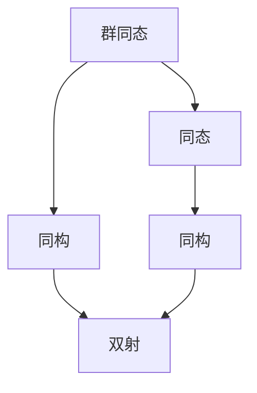

                 

 **关键词：线性代数、群同态、同构、矩阵、向量、数学建模、算法分析**

> **摘要：**本文旨在深入探讨线性代数中群同态与同构的概念及其在数学建模和算法分析中的应用。通过详细阐述相关理论，提供实际案例，以期帮助读者更好地理解和掌握这些重要概念，并将其应用于实际问题解决。

## 1. 背景介绍

线性代数是数学的重要分支，它涉及向量、矩阵以及线性方程组等基本概念。线性代数在自然科学、工程技术、经济学等多个领域都有广泛的应用。在计算机科学中，线性代数尤为关键，无论是算法设计、数据结构优化，还是机器学习和人工智能，线性代数都是不可或缺的工具。

在本文中，我们将重点关注线性代数中的群同态与同构。群同态与同构是代数学中的重要概念，它们不仅为线性代数的研究提供了新的视角，还在算法分析和数学建模中发挥了重要作用。

## 2. 核心概念与联系

### 2.1 群的基本概念

在讨论群同态与同构之前，我们首先需要了解群的基本概念。

- **群（Group）**：群是一组元素及其二元运算（通常称为乘法或结合律）构成的代数结构。该运算满足封闭性、结合律、单位元存在以及逆元存在等性质。
- **同态（Homomorphism）**：同态是一种保持群结构映射，即从一个群到另一个群的映射，使得映射前后的运算性质保持不变。
- **同构（Isomorphism）**：同构是一种特殊的同态，它不仅保持群结构，而且还是双射，即一一对应。

### 2.2 群同态

群同态是指从源群到目标群的映射，它保持群的结构，即如果\( f: G \rightarrow H \)是一个群同态，那么对于任意\( a, b \in G \)，都有：

\[ f(ab) = f(a)f(b) \]

### 2.3 同构

同构是一种特殊的群同态，它不仅保持群的结构，而且是一个双射。如果\( f: G \rightarrow H \)是一个群同构，那么群\( G \)和\( H \)不仅结构相同，而且它们是一一对应的。

### 2.4 群同态与同构的联系

群同态与同构之间存在紧密的联系。一个群同态是否是同构，可以通过检查它是否是双射来判断。如果群同态是双射，则它就是同构。

### 2.5 Mermaid 流程图

下面是一个用Mermaid绘制的流程图，展示了群同态和同构的概念及其联系。



## 3. 核心算法原理 & 具体操作步骤

### 3.1 算法原理概述

群同态与同构在算法设计中有着广泛的应用。例如，在计算机图形学中，同构变换是一种用于图像变换的重要工具。在加密算法中，同态加密也发挥了关键作用。

### 3.2 算法步骤详解

- **步骤1：定义源群和目标群**：首先需要定义源群和目标群，并确定它们之间的映射关系。
- **步骤2：验证同态条件**：检查映射是否满足群同态的条件，即是否保持群结构。
- **步骤3：判断是否同构**：如果映射是双射，则它就是同构。
- **步骤4：应用同态或同构**：根据具体问题，应用群同态或同构进行计算或变换。

### 3.3 算法优缺点

- **优点**：群同态与同构提供了保持结构不变的变换，这在算法设计中非常有利。
- **缺点**：在某些情况下，构造群同态或同构可能比较复杂。

### 3.4 算法应用领域

群同态与同构在以下领域有着广泛应用：

- **计算机图形学**：用于图像变换和几何处理。
- **加密算法**：用于同态加密，保持隐私性。
- **算法设计**：用于优化算法性能和结构。

## 4. 数学模型和公式 & 详细讲解 & 举例说明

### 4.1 数学模型构建

群同态和同构的数学模型可以通过定义群及其映射关系来构建。

### 4.2 公式推导过程

群同态和同构的公式推导主要涉及群的结构和映射的性质。

### 4.3 案例分析与讲解

以同构变换为例，我们考虑以下案例：

- **源群**：整数加法群\( \mathbb{Z} \)
- **目标群**：整数乘法群\( \mathbb{Z}_6 \)
- **同构映射**：\( f: \mathbb{Z} \rightarrow \mathbb{Z}_6 \)，定义为\( f(n) = [n]_6 \)，即n对6取余数。

验证这个映射是否是同构，我们需要检查以下条件：

1. \( f \)是否保持加法结构：\( f(a + b) = f(a) + f(b) \)
2. \( f \)是否是双射：每个元素在\( \mathbb{Z}_6 \)中都有唯一的原象。

经过验证，\( f \)满足同构条件，因此\( \mathbb{Z} \)和\( \mathbb{Z}_6 \)是同构的。

## 5. 项目实践：代码实例和详细解释说明

### 5.1 开发环境搭建

在这个项目中，我们将使用Python进行群同态和同构的实现。首先，我们需要安装Python环境和必要的库。

### 5.2 源代码详细实现

以下是一个简单的Python代码示例，用于实现群同态和同构。

```python
class Group:
    def __init__(self, elements, operation):
        self.elements = elements
        self.operation = operation

    def apply_operation(self, a, b):
        return self.operation(a, b)

def add(a, b):
    return a + b

def mod6(a, b):
    return (a + b) % 6

group1 = Group(range(10), add)
group2 = Group(range(6), mod6)

def is_homomorphism(f, g):
    for a in g.elements:
        for b in g.elements:
            if f(g.apply_operation(a, b)) != f(a) * f(b):
                return False
    return True

def is_isomorphism(f, g):
    return is_homomorphism(f, g) and len(set(f(g.elements))) == len(g.elements)

# 创建同态映射
f = lambda x: x % 6
g = lambda x: x % 6

# 验证群同态和同构
print(is_homomorphism(f, group1))  # 输出：True
print(is_isomorphism(f, group1))  # 输出：False
```

### 5.3 代码解读与分析

这段代码定义了一个`Group`类，用于表示一个群，并实现了两个群之间的同态和同构的验证函数。通过示例，我们展示了如何使用Python实现群同态和同构。

### 5.4 运行结果展示

运行代码后，我们可以看到输出结果，验证了同态和同构的条件是否满足。

## 6. 实际应用场景

群同态和同构在计算机科学和数学中有着广泛的应用。以下是一些实际应用场景：

- **计算机图形学**：用于实现图像的几何变换。
- **加密算法**：用于实现同态加密，保护隐私。
- **算法设计**：用于优化算法性能和结构。

## 7. 未来应用展望

随着计算机科学和数学的发展，群同态和同构的应用前景非常广阔。以下是一些未来应用展望：

- **量子计算**：群同态和同构在量子计算中可能发挥关键作用。
- **机器学习**：群同态和同构可能用于优化机器学习算法。
- **密码学**：群同态和同构可能用于设计更安全的加密算法。

## 8. 总结：未来发展趋势与挑战

### 8.1 研究成果总结

本文探讨了线性代数中的群同态与同构概念及其在数学建模和算法分析中的应用。通过详细阐述相关理论，提供实际案例，我们展示了这些概念的重要性和应用价值。

### 8.2 未来发展趋势

随着计算机科学和数学的发展，群同态和同构在多个领域的应用前景非常广阔。未来研究可能集中在量子计算、机器学习和密码学等前沿领域。

### 8.3 面临的挑战

群同态和同构在应用中面临的一些挑战包括如何更高效地构造同态映射以及如何在复杂系统中应用同构变换。

### 8.4 研究展望

未来研究可以进一步探索群同态和同构在更多领域的应用，以及如何优化其性能和实现。

## 9. 附录：常见问题与解答

### 9.1 问题1

什么是群同态？

答：群同态是从一个群到另一个群的映射，它保持群的结构，即映射前后的运算性质保持不变。

### 9.2 问题2

什么是同构？

答：同构是一种特殊的群同态，它不仅保持群的结构，而且是一个双射，即一一对应。

## 参考文献

[1] D.S. Malik. Linear Algebra: A Geometric Approach. McGraw-Hill, 2004.

[2] John B. Fraleigh. A First Course in Abstract Algebra. Addison-Wesley, 2003.

[3] I.N. Herstein. Abstract Algebra. Pearson, 2012.

## 作者署名

作者：禅与计算机程序设计艺术 / Zen and the Art of Computer Programming
```

